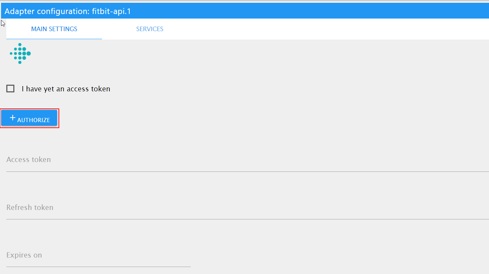
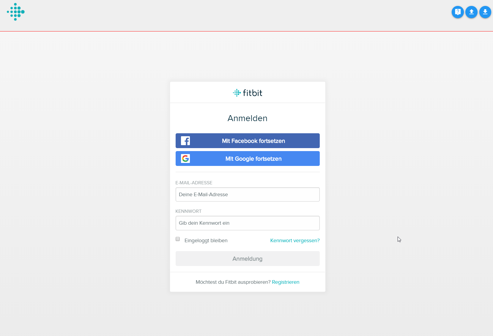
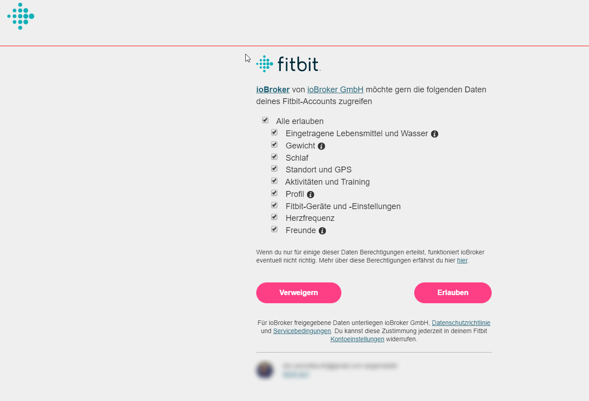
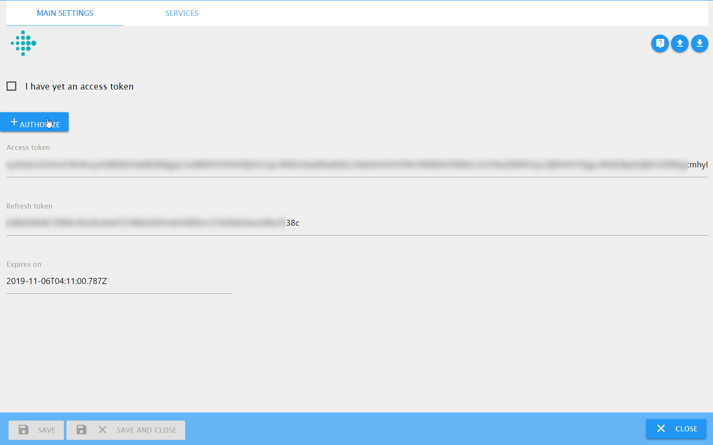

# IoBroker.fitbit
 

**Dieser Adapter verwendet Sentry-Bibliotheken, um Ausnahmen und Codefehler automatisch an die Entwickler zu melden.** Weitere Details und Informationen zum Deaktivieren der Fehlerberichterstattung finden Sie unter [Sentry-Plugin-Dokumentation](https://github.com/ioBroker/plugin-sentry#plugin-sentry)! Sentry Reporting wird ab js-controller 3.0 verwendet.

Dieser Adapter zieht Daten von der Fitbit-API!

## Aufbau

Drücken Sie die Schaltfläche "Autorisieren".

Danach könnten Sie aufgefordert werden, Ihre Zugangsdaten erneut einzugeben, oder wenn der Browser-Cache noch die Cookies enthält, könnte dies automatisch erfolgen.

Dann erscheinen `access token` und `refresh token`. Sie sind schreibgeschützt.

Wenn der Vorgang bei Ihnen nicht funktioniert, können Sie versuchen, das Zugriffstoken manuell zu erhalten: https://dev.fitbit.com/apps/oauthinteractivetutorial

## Mehrere Benutzer
Um die Daten für mehrere Benutzer (z. B. Familienmitglieder) zu lesen, müssen Sie die Cookies im Browser löschen und eine zusätzliche Instanz dieses Adapters erstellen.

Wichtig: Wenn Sie die Browser-Cookies nicht löschen, werden Sie mit dem letzten gültigen Benutzer angemeldet.

## Entwicklung
Die API wurde gemäß https://dev.fitbit.com/build/reference/web-api/basics/ implementiert.

## Changelog

### 0.1.1 (2019-11-06)
* (bluefox) initial release

## License
The MIT License (MIT)

Copyright 2019-2022, bluefox <dogafox@gmail.com>

Permission is hereby granted, free of charge, to any person obtaining a copy
of this software and associated documentation files (the "Software"), to deal
in the Software without restriction, including without limitation the rights
to use, copy, modify, merge, publish, distribute, sublicense, and/or sell
copies of the Software, and to permit persons to whom the Software is
furnished to do so, subject to the following conditions:

The above copyright notice and this permission notice shall be included in
all copies or substantial portions of the Software.

THE SOFTWARE IS PROVIDED "AS IS", WITHOUT WARRANTY OF ANY KIND, EXPRESS OR
IMPLIED, INCLUDING BUT NOT LIMITED TO THE WARRANTIES OF MERCHANTABILITY,
FITNESS FOR A PARTICULAR PURPOSE AND NONINFRINGEMENT. IN NO EVENT SHALL THE
AUTHORS OR COPYRIGHT HOLDERS BE LIABLE FOR ANY CLAIM, DAMAGES OR OTHER
LIABILITY, WHETHER IN AN ACTION OF CONTRACT, TORT OR OTHERWISE, ARISING FROM,
OUT OF OR IN CONNECTION WITH THE SOFTWARE OR THE USE OR OTHER DEALINGS IN
THE SOFTWARE.