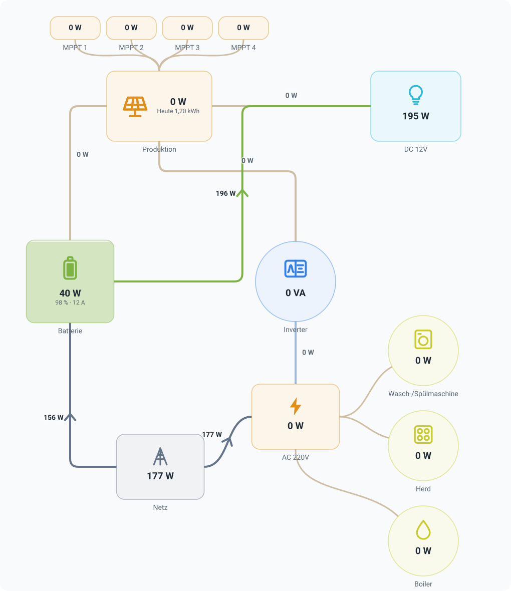

# ioBroker.flow

Ein frei anpassbares, animiertes Flussdiagramm – verwendbar in **ioBroker.vis-2** und im Widget-Manager von **ioBroker.devices** , mit derselben Konfiguration und demselben Designer. Es wurde speziell für Energie entwickelt; Wasser, Gas und Wärme fließen durch dieselben Leitungen.

<picture>
  <source media="(prefers-color-scheme: dark)" srcset="src-widgets/public/img/prev_hybrid-12v-dark.svg">
  
</picture>

_Eine komplette Installation – vier MPPT-Ladegeräte, eine 12-V-Batteriebank, ein Gleichstromzweig, ein Wechselrichter, Netzanschluss und drei Haushaltsgeräte. Die Lieferung erfolgt als[`examples/hybrid-12v.json`](/#/docs/adapterref/iobroker.flow/examples/README.md) und kann unverändert importiert werden._

## Was es tut

Sie platzieren Produzenten, Konsumenten, Speicher und das Grid auf einer Arbeitsfläche, verbinden sie und legen fest, welcher ioBroker-Zustand welche Zahl repräsentiert. Das Diagramm zeigt dann, wie viel Energie fließt und in welche Richtung, wobei sich die Punkte umso schneller bewegen, je höher die Energie ist.

- **Ein Designer, keine Liste von Feldern.** Ziehen Sie die Knoten, verbinden Sie sie miteinander. Keine feste Anzahl an Produzentenplätzen, keine Attribute wie „Knoten 7“. Wählen Sie mehrere Knoten mit einem Rahmen oder per Klick mit gedrückter Umschalttaste/Strg-Taste aus, verschieben Sie sie gemeinsam – mit der Maus oder den Pfeiltasten (Umschalt + Pfeiltasten ändern die Größe) –, kopieren Sie sie mit Strg+C / Strg+V (⌘ auf dem Mac), auch von einem Diagramm in ein anderes, und löschen Sie sie mit Entf. Das Mittelstück einer rechtwinkligen Linie kann seitlich verschoben werden; ein Doppelklick setzt es zurück.
- **Stile.** _Normal_ (umrandete Kästchen, Beschriftung darunter), _Clean_ (weiße Karten mit weichem Schatten, Beschriftung und Symbol innen, Pfeilspitzen markieren den Energiepunkt), _3D_ (Neumorphismus: Karten heben sich durch einen hellen und einen dunklen Schatten vom Untergrund ab) und _Neon_ (leuchtende Linien und Umrisse auf tiefblauem Hintergrund; ein runder Knotenpunkt zeigt seinen Pegel als leuchtenden Ring an). Jeder Stil passt sich dem hellen oder dunklen Design des Admin-Bereichs oder des Visualisierungsprojekts an; er ändert lediglich die Darstellung von Kästchen und Linien.
- **Füllstände.** Ein Akku füllt sich entsprechend seinem Ladezustand – dem Knoten und seinem Symbol. Jeder andere Knoten kann bis zu einem Maximalwert aufgeladen werden: Ein 1400-W-Array mit 75 W ist zu 5 % gefüllt. Der Maximalwert wird vom Zustandsobjekt bereitgestellt (`common.max` Wenn ein Wechselrichter über eine Nennleistung verfügt, muss diese nicht manuell eingegeben werden; eine Zahl am Knotenpunkt ist maßgebend, eine 0 deaktiviert den Ladevorgang. Der Ladezustand kann einfach „dem Wert entsprechen“ und wird entsprechend umgerechnet. Ein Knotenpunkt, dessen Wert in Prozent angegeben ist, zeigt sein Batteriesymbol entsprechend an.
- **Passende Werte.** Ein Wert, der zu lang für sein Feld ist – z. B. „-1.800,00 W“ in einem kleinen Feld – wird verkleinert, anstatt über den Rand hinauszulaufen.
- **Energie, Wasser, Gas oder Wärme.** Ein neues Diagramm fragt nach seinen Inhalten und liefert damit die Einheit, die Geschwindigkeit der Punkte, den Wert, unterhalb dessen eine Linie inaktiv ist, die Bezeichnungen im Designer („Quelle“ statt „Produzent“), die Suchkriterien des Assistenten und die Vorlagen – ein Wasserzähler für Haus und Garten, Regenwasser in einer Zisterne, ein Gaszähler für Heizung und Herd, eine Wärmepumpe, die einen Pufferspeicher füllt. Alle Einstellungen bleiben bearbeitbar, und selbst ein Diagramm ohne jegliche Aussage ist ein Energiediagramm – wie alle bisher erstellten.
- **Das Diagramm veranschaulicht den Durchfluss.** Sobald es eingeschaltet ist, benötigen die Leitungen keinen eigenen Zustand mehr: Ein geschlossenes Ventil oder eine stehende Pumpe stoppen den Durchfluss, ein leerer Tank liefert nichts, eine Pumpe fördert gemäß der eingezeichneten Richtung, und ein Durchflusssensor misst die Durchflussmenge – die dann auf die Abzweige verteilt wird: Zwei Zapfstellen hinter einer Pumpe erhalten jeweils die Hälfte, oder genau den Messwert, falls sie überhaupt einen messen, oder eine Hälfte wird mit zwei anderen geteilt, wobei eines ihrer Ventile nur halb geöffnet ist. Auch ein Ring funktioniert: Von einem Ende gespeist, führen beide Hälften die Hälfte; von beiden Enden gespeist, treffen sich die beiden Ströme in der Mitte, und dieses Rohr führt nichts mehr. Was ein Betrachter anhand der Abbildung erkennen würde – welcher Tank die Zapfstelle speist und welcher Abzweig abgesperrt ist –, zeigt das Diagramm nun von selbst.
- **Eine Bildunterschrift, die etwas aussagt.** Der Text einer Bildunterschrift kann Platzhalter enthalten: `{{ val }}` ist der Wert eines Zustands, `{{ ts }}` als es zuletzt geschrieben wurde ("vor 5 Minuten"), `{{ unit }}` seine Einheit und `{{ 0_userdata.0.x.val }}` jeder andere Zustand. Es kann auch berechnet werden: `{{ val * 10 }}` Die
- **Werte auf den Linien, ganz nach Ihren Wünschen.** Neben der Linie oder in einem abgerundeten Chip darauf – eine Einstellung für das gesamte Diagramm.
- **Symbole für die tatsächliche Ausstattung eines Hauses.** Über fünfzig gezeichnete Symbole: Photovoltaik, Windkraft, Wasserkraft, Batterie und Wärmespeicher, Stromnetz, Zähler, Wallbox und Auto, Wärmepumpe, Heizkörper, Elektroheizung, Klimaanlage, Lüftung, Ventilator, Wasserpumpe, Warmwasserbereiter, Waschmaschine, Geschirrspüler, Wäschetrockner, Kühlschrank, Gefrierschrank, Backofen, Kochfeld, Mikrowelle, Kaffeemaschine, Fernseher, Server, Pool, Beleuchtung – plus „alle Verbraucher“ für die Gesamtkosten eines Hauses. Für Wasser: Brunnen, Regenwasser, Zisterne, Rohr, Wasserzähler, Durchflusssensor, Ventil, Filter, Pumpe, Rasensprenger, Dusche, Waschbecken, Wasserhahn und Teich. Auch Bilder Ihrer eigenen Werke sind möglich (URL oder Data-URI). Zwei Symbole zeigen einen Füllstand anstelle einer festen Markierung – die Batterie ihren Ladezustand, der **Tank** seinen Inhalt, das Wasser steigt über die Skala an seiner Wand hinaus.
- **Die Farbpalette ist dem Medium angepasst.** Eine Wasserinstallation besteht nicht aus einem „Bus“: Der Planer bietet eine Quelle, einen Tank, den Hausanschluss, einen Verbraucher – und für die Komponenten _im_ Rohr einen Zähler, einen Durchflusssensor, eine Pumpe, ein Ventil und ein einfaches Verbindungsstück, jeweils mit dem passenden Symbol. Ein Energiediagramm behält seine bewährte Farbpalette bei.
- **Ein Ventil ist geöffnet oder geschlossen, und das kann man sehen.** Ein Ventil und eine Pumpe sind so positioniert, dass sie einen bestimmten Zustand annehmen können: Ein boolescher Wert gibt „offen“/„geschlossen“ an, der entsprechende Prozentsatz die Zahl. In beiden Fällen nimmt das Element die Farbe seines Mediums an, solange es eingeschaltet ist, und wird grau, wenn der Zustand null ist.
- **Regeln.** "Unter 20 % rot und blinkend", "Statusfehler in Rot": Farbe, Symbol und Blinken richten sich nach dem Wert; die erste übereinstimmende Regel gewinnt, und die Linien übernehmen die Farbe.
- **Statusmeldungen.** Ein Zustand wie beispielsweise der Wechselrichtermodus wird als Text angezeigt, optional übersetzt (`1` → "Aufladen").
- **Veraltete Werte werden angezeigt.** Ein Knoten, dessen Status über einen bestimmten Zeitraum nicht aktualisiert wurde, wird abgedunkelt – ein hängender Adapter sieht nicht mehr wie ein ruhiges Haus aus.
- **Energie des Tages.** Der angegebene Wert wird entweder vom Zähler des Geräts abgelesen – die „Heutausbeute“ eines Wechselrichters – oder aus den historischen Daten des Netzteils seit Mitternacht integriert.
- **Kennzahlen.** Autarkie und Eigenverbrauch in %, berechnet aus den Produzenten, dem Netz und den Speichern des Diagramms.
- **Färben Sie nach Wert.** Ein Knoten – und seine Linien – wird mit einem Wert von Grün nach Rot gefärbt, z. B. dem Strompreis.
- **Detailansicht.** Durch Klicken auf „Verlauf anzeigen“ werden die Werte der letzten 1 Stunde bis 30 Tage mit Minimum, Durchschnitt und Maximum angezeigt.
- **Als Bild speichern.** SVG oder PNG direkt vom Designer, ohne Raster und Griffe.
- **Ausgehend von meinen Geräten** erstellt ein Assistent die Bundesstaaten, die Strom melden, errät, um welche es sich handelt, und erstellt ein erstes Diagramm – Erzeuger oben, Netz links, Speicher rechts, Verbraucher unten.
- **Ein Diagramm im Knoten.** Mit einem Verlaufsadapter (History, SQL, InfluxDB) kann jeder Knoten seinen Wert der letzten 15 Minuten bis 24 Stunden hinter der Zahl darstellen.
- **Wann es sich zuletzt geändert hat.** Ein Knoten kann unter seinem Wert anzeigen, wann sich der Zustand zuletzt geändert oder aktualisiert wurde – „vor 12 Minuten“, eine Uhrzeit oder ein Datum in der Sprache des Browsers.
- **Einheiten aus den Zuständen.** Ein Wert übernimmt seine Einheit vom Zustandsobjekt (`common.unit` Eine Batterie mit kW-Angabe und ein Wechselrichter mit W-Angabe liegen ohne Konfiguration nebeneinander: Beide werden korrekt angezeigt, ein Knoten, der sie addiert, addiert Watt zu Watt, und die Punkte bewegen sich bei gleicher Leistung mit der gleichen Geschwindigkeit. Die am Knoten oder der Verbindung festgelegte Einheit ist weiterhin maßgebend.
- **Vorlagen als Ausgangspunkt:** Photovoltaikanlage + Netzanschluss + Hausanlage mit Batteriespeicher und entweder einer Wandbox oder einer Wärmepumpe. Wählen Sie eine Option aus und geben Sie nur noch die Bundeslandkennungen an. `examples/` Enthält vollständige Diagramme realer Installationen zum Importieren und Anpassen.
- **Ein Knoten berechnet seinen eigenen Wert** aus den Linien, die ihn treffen, daher benötigt das klassische Vier-Felder-Diagramm drei Zustands-IDs und nicht sieben.
- **Ein Zustand pro Verbindung, nicht zwei.** Ein Netzzähler oder eine Batterie meldet einen Wert mit Vorzeichen: positiv in die eine Richtung, negativ in die andere. Das ist eine Verbindung im Diagramm, und Richtung, Farbe und Animation richten sich nach dem Vorzeichen.
- **Einheiten, die sich selbst skalieren.** Angenommen, ein Wert ist in `W` einmal und das Diagramm zeigt `734 W`, `8.73 kW` oder `2.5 MW` abhängig davon, was tatsächlich fließt.
- **Formeln, bei denen ein einzelner Zustand nicht ausreicht.** `sum(inverter1, inverter2)`, `pv - feedIn`, `if(soc > 95, 0, charge)` — mit einem Faktor, einem Offset, einer Totzone und einem Vorzeichenschalter für die üblichen Skalierungsfälle.
- **Passt sich der Größe des jeweiligen Feldes an.** Eine SVG-Datei mit einem `viewBox`: eine vis-2-Ansicht in voller Breite oder eine 1×1-Karte im Geräte-Manager.
- **Die Animation stoppt, sobald niemand hinsieht.** Sie wird in einem ausgeblendeten Browsertab pausiert, während das Widget aus dem sichtbaren Bereich gescrollt wird, und berücksichtigt dabei die Einstellungen. `prefers-reduced-motion` (Dann zeigt ein statischer Pfeil die Richtung an).

## Installieren

Über die ioBroker-Administration oder die Befehlszeile:

```bash
iobroker add flow
```

Der Adapter enthält keinen Node.js-Code (`onlyWWW`), benötigt aber eine Instanz, damit vis-2 und der Geräte-Manager sie finden können. vis-2 wird nach der Installation automatisch neu gestartet.

### Im Adminbereich, ohne die Ansicht zu öffnen

Der Adapter fügt der Administrationsoberfläche den Tab **„Flow“** hinzu. Dort werden die gespeicherten Diagramme aufgelistet und können im selben Designer auf einer vollständigen Seite bearbeitet werden. Ein dort gespeichertes Diagramm wird sofort nach dem Speichern in allen vis-2-Widgets und Geräte-Manager-Karten angezeigt – ohne Neuladen oder Öffnen des vis-Editors.

Eine Option in der Symbolleiste speichert Änderungen automatisch, zehn Sekunden nach der letzten Änderung – nach einem ganzen Nachmittag, an dem man Änderungen per Drag & Drop vorgenommen hat, ohne den Speichern-Button zu betätigen. Dies ist eine Einstellung des Browsers, in dem die Option aktiviert wurde.

Gespeicherte Diagramme existieren als Objekte `flow.0.diagrams.<id>`, eines pro Diagramm, vom Typ `config` mit dem Dokument in `native.flow` Aus diesem Grund können sie auch wie jedes andere Objekt gesichert, wiederhergestellt und per Skript gesteuert werden.

### Export und Import

- **Ein Diagramm** – Über die Option _„Exportieren“_ im Menü **⋮** des Diagramms wird es gespeichert als `<name>.json` Die Datei enthält genau die Daten, die ein Widget speichert, daher kann sie auch in jeden beliebigen Designer eingefügt werden.** `< >` ** Dialog.
- **Alle Diagramme** – mit dem Download-Button über der Liste werden alle gespeicherten Diagramme in einer Datei gespeichert, entweder als Backup oder um einen Satz auf eine andere Installation zu übertragen.
- **Importieren** – die Schaltfläche „Hochladen“ über der Liste akzeptiert eine oder mehrere Dateien: einzelne Diagramme, eine Datei mit allen Diagrammen oder eine `energiefluss-erweitert` Konfiguration. Sie sehen den Inhalt jeder Datei und was bei der Konvertierung vor der Erstellung ausgelassen werden musste. Jedes Diagramm wird neu erstellt; bestehende Diagramme werden niemals überschrieben, nicht einmal solche mit demselben Namen.

Was exportiert wird, ist das, was gespeichert wird: Nicht gespeicherte Änderungen im Designer werden nicht berücksichtigt, und Sie werden darüber informiert.

### In vis-2

Fügen Sie das **Flussdiagramm-** Widget aus dem _Flow-_ Set hinzu. Dessen Attribut bietet zwei Modi:

- **Gespeichertes Diagramm** – wählen Sie eines der Diagramme aus dem Admin-Bereich aus. Das Widget enthält lediglich eine Referenz; bearbeiten Sie das Diagramm im Admin-Bereich oder öffnen Sie den Designer von hier aus, der dasselbe gespeicherte Diagramm bearbeitet.
- **In diesem Widget** befindet sich das Diagramm innerhalb des Widgets und wird beim Export der Ansicht übertragen. **Store Central** verschiebt es in den Admin-Tab und schaltet das Widget auf die Referenz um.

### Importieren eines vorgefertigten Diagramms

Der Designe&#x72;** `< >` ** Die Schaltfläche öffnet das Dokument als JSON: Fügen Sie eine der Dateien ein von `examples/` Klicken Sie darauf oder öffnen Sie die Datei mit der Ordner-Schaltfläche und klicken Sie auf „Anwenden“. Im selben Dialogfeld können Sie ein fertiges Diagramm für ein zweites Widget oder eine andere Installation kopieren oder herunterladen. Um eine Datei als eigenes Diagramm hinzuzufügen, anstatt das aktuell bearbeitete zu ersetzen, verwenden Sie _die Funktion „Importieren“_ im Admin-Bereich.

### In ioBroker.devices

Fügen Sie im Widget-Manager ein Widget zu einer Kategorie hinzu und wählen Sie unten in der Liste im Plugin-Bereich **„Flussdiagramm“** aus. Der Einstellungsdialog der Karte bietet dieselben zwei Modi wie in vis-2, sodass ein gespeichertes Diagramm gleichzeitig in vis-2 und im Geräte-Manager angezeigt werden kann.

> Die Geräteseite benötigt `ioBroker.devices` mit dem Widget-Manager und `@iobroker/json-config` 10 — Ältere Versionen kennen den von diesem Plugin verwendeten Mechanismus nicht.

### In der Administratorkonfiguration eines anderen Adapters

Der Designer ist ein `jsonConfig` Die benutzerdefinierte Komponente und die Konfigurationsseite eines Adapters werden vom selben gerendert. `@iobroker/json-config` als Einstellungsdialog des Geräte-Managers. Jeder Adapter kann dies also einbetten, indem er einen Eintrag in seine Einstellungen hinzufügt. `jsonConfig.json`:

```json
{
    "diagram": {
        "type": "custom",
        "url": "./adapter/flow/dm-widgets/customDevices.js",
        "name": "flow/Config/Designer",
        "guiApi": 2,
        "i18n": false,
        "newLine": true
    }
}
```

Das bearbeitete Diagramm landet in `native.diagram` dieses Adapters, als gewöhnliches Objekt – lesen Sie es zurück mit `normalizeConfig()` und rendern Sie es mit `FlowView` Oder lagern Sie es einfach ein.

Das beruht auf drei Dingen:

- **ioBroker.flow muss installiert sein** , weil `url` wird von dort aus serviert `admin` Ordner. Deklarieren Sie ihn unter `common.dependencies` (`[{ "flow": ">=0.0.1" }]`) also wird es von der Installation miteingezogen. `ifInstalledDependencies` ist _nicht_ ausreichend – es prüft die Version nur dann, wenn der Adapter zufällig vorhanden ist, und andernfalls zeigt das Formular einen Ladefehler anstelle des Designers an.
- ** `guiApi: 2` ** Laut Meldung ist die Komponente für React 19 / MUI 9 entwickelt worden. Ein älterer Administrator lehnt sie ab, anstatt abzustürzen – genau das ist ja der Sinn des Feldes.
- Die **führende `./` ** ist keine Dekoration. Ohne sie wird die URL relativ zu dem Adapter aufgelöst, dessen Konfiguration angezeigt wird, und das ist nicht dieser.

Die Komponente bringt ihre eigenen Übersetzungen mit, daher muss nichts weiter registriert werden.

### Ein bestehendes Diagramm übernehmen

Fügen Sie den Inhalt der `energiefluss-erweitert.0.configuration` Zustand in den Designe&#x72;** `< >` ** Sie können es im Dialogfeld öffnen oder als Datei speichern und im Admin-Bereich importieren. Es wird erkannt, konvertiert und zusammengefasst, bevor weitere Aktionen ausgeführt werden.

Die beiden Formate unterscheiden sich in einem Punkt, und genau darum geht es bei der Konvertierung: Dort ist ein Kästchen kein Objekt. Was Sie als „Batterie“ sehen, ist ein Rechteck, ein Symbol und zwei sich lediglich überlappende Texte, ohne dass ein Zusammenhang erkennbar ist. Explizit _ist_ hingegen der Graph – eine Verbindung ist unter dem Schlüssel gespeichert. `path_<a>_<b>` Dabei werden die beiden Rechtecke benannt, zwischen denen es verläuft. Der Importer verwendet diese Rechtecke als Knoten und ordnet alle anderen Elemente dem entsprechenden Feld zu, was auch dem menschlichen Auge entspricht.

Übernommen wurden: die Kästchen mit ihrer Position, Größe, Form und Farbe, die Beschriftungen, die Symbole (abgeglichen mit Schlüsselwörtern, also …). `mdi:house-city` Und `material-symbols:electric-car` korrekt landen), die staatlichen IDs einschließlich `add` /`subtract` /`convert` als Formel, die Einheiten und Dezimalstellen einschließlich der `calculate_kw` Modi, die Verbindungen mit ihrer Richtung, Seiten, Farbe und Schwelle.

Nicht übernommen und gemeldet statt stillschweigend entfernt werden: CSS-Anpassungen pro Element, Klickaktionen, Bilder und Werte, die etwas anderes als den Statuswert anzeigen. Sie erhalten eine Liste der betroffenen Elemente, bevor Sie auf „Importieren“ klicken.

Was bisher fehlt: das Lesen des Verlaufs, sodass es keine Min/Max-Werte für den letzten Tag gibt.

## Entwicklung

Ein Paket mit drei Bundles, einer Entwicklungsvorschau und drei gemeinsam genutzten Quellcodepaketen. Alles ist im Stammverzeichnis deklariert. `package.json` Die Pakete selbst haben keine Abhängigkeiten.

```
packages/core/          model, value resolution, geometry, SVG renderer — no MUI, no socket
packages/editor/        the designer (MUI + @iobroker/gui-components)
packages/translations/  the dictionary, used by both bundles
examples/               complete diagrams to import; `npm test` checks they stay valid
src-widgets/            the vis-2 widget set   -> widgets/flow/
src-dm-widgets/         the devices plugin     -> admin/dm-widgets/
src-admin/              the admin tab          -> admin/tab.html + admin/tab-assets/
src-preview/            dev server only: the admin-side GUI with hot reload, never built or shipped
```

```bash
npm install          # installs all three bundles and hoists the shared copies — do this at the root
npm run build        # previews + all three bundles, into widgets/ and admin/
npm run build-vis    # only the vis-2 bundle
npm run build-dm     # only the devices bundle
npm run build-admin  # only the admin tab
npm run dev          # the preview on http://localhost:3100, against a running ioBroker
npm run previews     # re-render the palette preview from the real renderer
npm run check        # type check the shared packages, tasks.ts, tools/ and the tests
npm run lint
npm test             # unit tests of the core plus the ioBroker package checks
```

`npm install` muss **im Stammverzeichnis** ausgeführt werden, und nur dort: Jede Abhängigkeit wird im Stammverzeichnis deklariert. `package.json` Es gibt also einen `node_modules` Für alles. Das ist Absicht. `packages/core` Und `packages/editor` werden in beide Bundles kompiliert und müssen dieselbe Kopie von React und MUI sehen wie das umgebende Bundle.

### Ich arbeite an der Benutzeroberfläche.

`npm run dev` beginnt `src-preview` Der Admin-Tab, das Widget als Ansicht (mit Live-Werten und einem Breitenregler) und der Attribut-Editor für vis-2 / Geräte / Adapterkonfigurationen befinden sich jeweils auf einer eigenen Seite mit Hot Reload. Es kompiliert dieselben Quellen wie die eigentlichen Bundles, daher ist kein Build erforderlich. `iobroker upload` zwischen dem Bearbeiten und dem Ansehen.

Es spricht mit dem Administrator bei `ADMIN_URL` In `src-preview/vite.config.ts`, `http://localhost:8081` Standardmäßig. Ändern Sie diese Konstante für eine andere Maschine, z. B. in `'http://vitanova:8081'` oder legen Sie es für einen einmaligen Durchlauf fest: `IOBROKER_ADMIN=http://vitanova:8081 npm run dev` Der Administrator muss, wie bei jedem ioBroker-Entwicklungsserver, ohne Anmeldung über den Browser erreichbar sein.

`cd src-widgets && npm start` ist der eigene Entwicklungsserver des Widgets (Vite auf Port 4173, der an einen ioBroker-Webadapter auf Port 8082 weiterleitet); es benötigt ein laufendes vis-2, um etwas anzuzeigen.

### Übersetzungen

`packages/translations/src/*.json`—`en` Und `de` sind vollständig, die anderen neun Sprachen sind absichtlich leer: `I18n.t` Bei fehlendem Schlüssel wird auf Englisch zurückgegriffen, und eine leere Datei zeigt „Noch nicht übersetzt“ an, obwohl eine englische Kopie das Gegenteil behaupten würde. Beiträge sind willkommen.

## Changelog
<!--
    Placeholder for the next version (at the beginning of the line):
    ### **WORK IN PROGRESS**
-->
### 0.0.2 (2026-10-03)

* (@GermanBluefox) Corrections for publication

### 0.0.1 (2026-09-25)

* (@GermanBluefox) Initial release

## License

MIT License

Copyright (c) 2026 Denis Haev <dogafox@gmail.com>

Permission is hereby granted, free of charge, to any person obtaining a copy
of this software and associated documentation files (the "Software"), to deal
in the Software without restriction, including without limitation the rights
to use, copy, modify, merge, publish, distribute, sublicense, and/or sell
copies of the Software, and to permit persons to whom the Software is
furnished to do so, subject to the following conditions:

The above copyright notice and this permission notice shall be included in all
copies or substantial portions of the Software.

THE SOFTWARE IS PROVIDED "AS IS", WITHOUT WARRANTY OF ANY KIND, EXPRESS OR
IMPLIED, INCLUDING BUT NOT LIMITED TO THE WARRANTIES OF MERCHANTABILITY,
FITNESS FOR A PARTICULAR PURPOSE AND NONINFRINGEMENT. IN NO EVENT SHALL THE
AUTHORS OR COPYRIGHT HOLDERS BE LIABLE FOR ANY CLAIM, DAMAGES OR OTHER
LIABILITY, WHETHER IN AN ACTION OF CONTRACT, TORT OR OTHERWISE, ARISING FROM,
OUT OF OR IN CONNECTION WITH THE SOFTWARE OR THE USE OR OTHER DEALINGS IN THE
SOFTWARE.