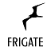

# IoBroker.frigate
**Tests:** 

**Dieser Adapter verwendet Sentry-Bibliotheken, um Ausnahmen und Codefehler automatisch an die Entwickler zu melden.** Weitere Details und Informationen zum Deaktivieren der Fehlerberichterstattung finden Sie in Abschnitt [Sentry-Plugin-Dokumentation](https://github.com/ioBroker/plugin-sentry#plugin-sentry)! Die Sentry-Berichterstattung wird ab js-controller 3.0 verwendet.

## Frigate-Adapter für ioBroker
Adapter für [Fregatten-NVR](https://frigate.video/) — ein Open-Source-Videoüberwachungssystem mit KI-gestützter Objekterkennung, das selbst gehostet wird.

## Dokumentation
[🇺🇸 Dokumentation](./docs/en/README.md)

[🇩🇪 Dokumentation](./docs/de/README.md)

## Diskussion und Fragen
[https://forum.iobroker.net/topic/64928/frigate-adapter-für-iobroker](https://forum.iobroker.net/topic/64928/frigate-adapter-für-iobroker)

## Changelog

<!--
    Placeholder for the next version (at the beginning of the line):
  ### **WORK IN PROGRESS**
-->
### 2.3.1 (2026-03-29)
- (Eistee82) Added Frigate API authentication support for port 8971 (username/password login with JWT)
- (Eistee82) Automatic token refresh on 401 responses

### 2.3.0 (2026-03-29)
- (Eistee82) Many new features, improvements, and bug fixes in development for the next major release (see 2.2.2)

### 2.2.2 (2026-03-29)

**New Features:**
- (Eistee82) Added per-camera motion threshold control (`remote.motionThreshold`)
- (Eistee82) Added per-camera motion contour area control (`remote.motionContourArea`)
- (Eistee82) Added per-camera birdseye mode control (`remote.birdseyeMode`)
- (Eistee82) Added per-camera improve contrast toggle (`remote.improveContrast`)
- (Eistee82) Added Frigate notification control via MQTT (`notifications.enabled`, `notifications.suspend`)
- (Eistee82) Added automatic zone device creation from Frigate config
- (Eistee82) Audio details (dBFS, RMS, transcription, audio types) now automatically available
- (Eistee82) Camera health status (detect/audio/record role status) now automatically available
- (Eistee82) Classification states and review status now automatically available

**Modernization:**
- (Eistee82) Migrated adapter to ESM (ECMAScript Modules) — requires js-controller >= 6.0.5
- (Eistee82) Upgraded aedes MQTT broker from 0.51 to 1.x
- (Eistee82) Replaced uuid dependency with built-in `crypto.randomUUID()`
- (Eistee82) Replaced json-bigint dependency with native `JSON.parse`
- (Eistee82) Refactored monolithic main.ts into focused modules
- (Eistee82) Include build directory in repository for direct GitHub installation

**Bug Fixes:**
- (Eistee82) Fixed critical bug: motion ON was always parsed as false due to operator precedence
- (Eistee82) Fixed snapshot notification missing image parameter
- (Eistee82) Fixed duplicate MQTT message processing in built-in broker mode
- (Eistee82) Fixed tmp directory cleanup deleting files from other programs
- (Eistee82) Converted synchronous filesystem operations to async
- (Eistee82) Debounced event history fetching to prevent excessive API calls
- (Eistee82) Improved error logging consistency across all catch blocks

### 2.2.1 (2026-03-29)
- (Eistee82) Added support for connecting to an external MQTT broker (e.g. Mosquitto) as an alternative to the built-in broker
- (Eistee82) Added configurable MQTT topic prefix
- (Eistee82) Added i18n translations for new MQTT configuration fields
- (mcm1957) dependencies have been updated

### 2.1.3 (2026-03-19)
- (@GermanBluefox) Remove wrong log message about missing docker
- (@GermanBluefox) Send on connection the topic onConnect to receive camera_activity topic

## License

MIT License

Copyright (c) 2026 iobroker-community-adapters <iobroker-community-adapters@gmx.de>  
Copyright (c) 2024-2025 TA2k <tombox2020@gmail.com>

Permission is hereby granted, free of charge, to any person obtaining a copy
of this software and associated documentation files (the "Software"), to deal
in the Software without restriction, including without limitation the rights
to use, copy, modify, merge, publish, distribute, sublicense, and/or sell
copies of the Software, and to permit persons to whom the Software is
furnished to do so, subject to the following conditions:

The above copyright notice and this permission notice shall be included in all
copies or substantial portions of the Software.

THE SOFTWARE IS PROVIDED "AS IS", WITHOUT WARRANTY OF ANY KIND, EXPRESS OR
IMPLIED, INCLUDING BUT NOT LIMITED TO THE WARRANTIES OF MERCHANTABILITY,
FITNESS FOR A PARTICULAR PURPOSE AND NONINFRINGEMENT. IN NO EVENT SHALL THE
AUTHORS OR COPYRIGHT HOLDERS BE LIABLE FOR ANY CLAIM, DAMAGES OR OTHER
LIABILITY, WHETHER IN AN ACTION OF CONTRACT, TORT OR OTHERWISE, ARISING FROM,
OUT OF OR IN CONNECTION WITH THE SOFTWARE OR THE USE OR OTHER DEALINGS IN THE
SOFTWARE.