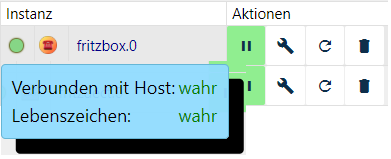
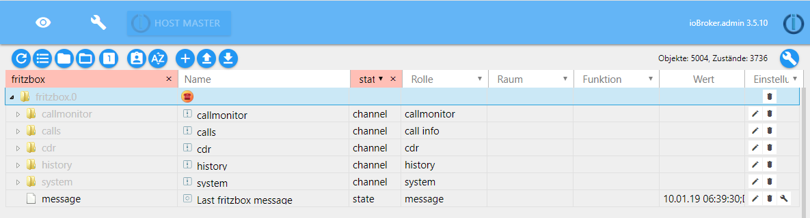
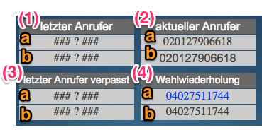

ioBroker Fritzbox-Adapter


**Dieser Adapter nutzt die Sentry-Bibliotheken, um Ausnahmen und Codefehler automatisch an die Entwickler zu melden.** Weitere Details und Informationen zum Deaktivieren der Fehlerberichterstattung finden Sie in [der Sentry-Plugin-Dokumentation](https://github.com/ioBroker/plugin-sentry#plugin-sentry) ! Die Sentry-Berichterstattung wird ab js-controller 3.0 verwendet.

## AVM Fritz!Box®

Die Fritz!Box (eigene Schreibweise des Herstellers AVM) ist eine der am weitesten verbreiteten Router auf dem Markt.

Mittlerweile gibt es Modelle für alle gängigen Arten von Internetanschlüssen: DSL, Kabel, Mobilfunk und Glasfaser.

### Fritzbox-Adapter

Der Adapter stellt eine Verbindung zwischen der Fritz!Box (kurz: FB) und ioBroker her und liefert Daten und Anruflisten.

## Voraussetzungen vor der Installation

Der Datenaustausch erfolgt über den im FB integrierten _Anrufmonitor_ . Um diesen zu aktivieren, wählen Sie von einem verbundenen Telefon aus die folgende Nummer:

- `#96*5*` - Anrufüberwachung einschalten
- `#96*4*` - Anrufüberwachung ausschalten

## Installieren

Wählen Sie im ioBroker Admin den Adapter „fritzbox“.

## Konfiguration

### Einstellungen

Hier müssen Sie lediglich aktivieren, welche Daten in welchem Format übertragen werden sollen. Laut den Entwicklern sind einige Datenfelder überflüssig (siehe Grafik und Forenbeitrag). Dieser Adapter erhält keine weiteren Updates, da er durch den leistungsfähigeren Adapter „TR-064“ ersetzt werden kann.


Weitere Informationen finden Sie im Forum [in diesem Thread](https://forum.iobroker.net/viewtopic.php?f=20\&t=3344\&hilit=fritzbox) .

### Automatische Einrichtung

siehe [Einstellungen](#settings)

## Beispiel

Unter _„Instanzen_ des ioBrokers“ finden Sie die installierte Instanz des Adapters. Links wird in einem Ampelsystem visualisiert, ob der Adapter aktiviert und verbunden ist.



Wenn Sie den Mauszeiger auf ein Symbol setzen, erhalten Sie detaillierte Informationen.

## Objekte des Adapters

Im Bereich „Objekte“ werden alle Werte, Listen und Informationen, die vom FB an den Adapter übermittelt werden, in einer Baumstruktur angezeigt (siehe Einstellungen).

Direkt im Instanzordner _fritzbox.x_ finden Sie die _Datenpunktnachricht_ mit Datum, Uhrzeit und Art der letzten Aktion.



Die jeweiligen Kanäle und die darin erzeugten Datenpunkte werden im Folgenden kurz beschrieben.

### Kanal-Anrufmonitor

Die Datenpunkte zeigen die Anrufe in Echtzeit an.

| **Datenpunkt** | **Beschreibung**                                                               |
| -------------- | ------------------------------------------------------------------------------ |
| alle           | Anzeige von Datum, Uhrzeit und Telefonnummer; eingehende und ausgehende Anrufe |
| Anruf          | Anzeige von Datum, Uhrzeit und Telefonnummer; ausgehend                        |
| verbinden      | Anzeige von Datum, Uhrzeit und Telefonnummer einer bestehenden Verbindung      |
| Ring           | Anzeige von Datum, Uhrzeit und Telefonnummer eingehender Anrufe                |

### Kanalanrufe

Innerhalb dieses Kanals werden zwei weitere Kanäle und einige Datenpunkte erstellt:


| **Datenpunkt**              | **Beschreibung**                                |
| --------------------------- | ----------------------------------------------- |
| letzte Rufnummer            | zuletzt gewählte Telefonnummer                  |
| Verbindungsnummer           | Letzter aktuell verbundener Anruf               |
| connectNumbers              | alle aktuell verbundenen Anrufe                 |
| verpasste Anzahl            | Zähler verpasster Anrufe                        |
| verpasstesDatumZurücksetzen | Datum der letzten Zählerzurücksetzung           |
| Ring                        | Signal für einen eingehenden Anruf              |
| Ringnummer                  | Telefonnummer eines aktuell eingehenden Anrufs  |
| ringActualNumbers           | Telefonnummern aller aktuell eingehenden Anrufe |
| ringLastMissedNumber        | Telefonnummer des letzten verpassten Anrufs     |
| Nachname des Rings          | Telefonnummer des letzten eingehenden Anrufs    |

#### GegenTatsächlicheAnrufe

Hier werden die Werte der verschiedenen Zähler für aktuelle Anrufe in Echtzeit aufgelistet:

| **Datenpunkt**    | **Beschreibung**                                   |
| ----------------- | -------------------------------------------------- |
| alleAktivenZähler | Anzahl aller aktiven Anrufe (verbunden, eingehend) |
| Anrufanzahl       | Anzahl ausgehender Anrufe                          |
| connectCount      | Anzahl der bestehenden Verbindungen                |
| ringCount         | Anzahl der aktuell eingehenden Anrufe              |

#### telLinks

Die unten aufgeführten Datenpunkte sind als Link formatiert, sodass die entsprechende Nummer über den Link angerufen werden kann (z. B. über ein Widget in VIS):

| **Datenpunkt**               | **Beschreibung**                                 |
| ---------------------------- | ------------------------------------------------ |
| letzte Rufnummer             | Wahlwiederholung, zuletzt gewählte Telefonnummer |
| Letzte verpasste Nummer Tel. | letzter verpasster Anruf                         |
| letzte Rufnummer             | letzter eingehender Anruf                        |

### Kanal cdr

Diese Datenpunkte liefern Informationen in formatierter Form (siehe Einstellungen).

| **Datenpunkt** | **Beschreibung**         |
| -------------- | ------------------------ |
| html           | Letzter Aufruf           |
| JSON           |                          |
| missedHTML     | letzter verpasster Anruf |
| missedJSON     |                          |
| txt            | Letzter Aufruf           |

### Kanalverlauf

Diese Datenpunkte liefern Tabellen in formatierter Form. Welche Informationen übertragen werden, kann in den Einstellungen festgelegt werden.

| **Datenpunkt**  | **Beschreibung** |
| --------------- | ---------------- |
| allTableHTML    |                  |
| allTableJSON    | alle Anrufe      |
| allTableTxt     |                  |
| missedTableHTML | verpasste Anrufe |
| missedTableJSON |                  |

### Kanalsystem

| **Datenpunkt** | **Beschreibung**                                                                |
| -------------- | ------------------------------------------------------------------------------- |
| Delta-Zeit     | Zeitdifferenz zwischen der Systemzeit von ioBroker und der Fritzbox in Sekunden |
| deltaTimeOK    | Testergebnis (wahr/falsch)                                                      |

## Häufig gestellte Fragen

**F: Es gibt die Fritzbox und den TR-064-Adapter, der ebenfalls auf den FB-Anrufmonitor zugreift. Worin bestehen die Unterschiede, und müssen beide Adapter installiert sein?**

A: Der Fritzbox-Adapter stammt aus der Anfangsphase und stellte nur diejenigen Informationen des Routers zur Verfügung, die die Anrufe betrafen.

TR-064 kann als Weiterentwicklung betrachtet werden, da dieser Adapter wesentlich umfangreichere Informationen bietet, z. B. über die im FB registrierten Geräte.

Prinzipiell genügt die Installation eines der beiden Adapter. Da jedoch viele langjährige Nutzer den FB-Adapter verwenden und ihre Visualisierung darauf aufgebaut haben, bleibt dieser zwar verfügbar, wird aber nicht mehr weiterentwickelt.

Neulingen wird die Installation des [TR-064-Adapters](https://github.com/ioBroker/ioBroker.docs/tree/master/docs/adapterref/docs/iobroker.tr-064/de) empfohlen.

## Datenpunktdokumentation

Unter **fritzbox.x** erzeugt der Adapter die folgenden Kanäle und Datenpunkte:

- Nachricht -(Nachricht von der FRITZ!Box)

### `calls` Kanal

- calls.ring - true/false, liegt ein eingehender Anruf vor?
- calls.missedCount - Ganzzahl, Lese- und Schreibzugriff, Anzahl verpasster Anrufe
- calls.missedDateReset – Datum, an dem calls.missedCount zuletzt auf 0 zurückgesetzt wurde
- calls.ringActualNumber - aktuell eingehender Anruf - der letzte, falls mehrere vorhanden sind)
- calls.ringActualNumbers - alle aktuell eingehenden Anrufe
- Anrufe.RingLetzteNummer - letzter Anrufer
- calls.ringLastMissedNumber - zuletzt verpasster Anrufer
- calls.callLastNumber - Wahlwiederholung, zuletzt gewählte Telefonnummer
- Anrufe.Verbindungsnummer – zuletzt verbundener Anruf
- Anrufe.Verbindungsnummern - alle aktuell verbundenen Anrufe

### `calls.counterActualCalls` Kanal - Echtzeit

- calls.counterActualCalls.ringCount - Anzahl der eingehenden Anrufe (RING)
- calls.counterActualCalls.callCount - Anzahl der ausgehenden Anrufversuche (CALL)
- calls.counterActualCalls.connectCount - Anzahl der aktiven verbundenen Anrufe (CONNECT)
- calls.counterActualCalls.allActiveCount - Anzahl aller aktiven Anrufe (ANRUFE, KLINGELN & VERBINDUNGEN)

### `calls.telLinks` Kanal - wählbare Telefonnummern tel:+...

- calls.telLinks.ringLastNumberTel - letzter Anrufer als wählbare Verbindung
- calls.telLinks.ringLastMissedNumberTel - zuletzt verpasster Anrufer als wählbare Verbindung
- calls.telLinks.callLastNumberTel - Wahlwiederholung, zuletzt gewählte Telefonnummer, wählbar

### `history.` Kanal

- history.allTableTxt - ...
- history.allTableHTML - Liste als HTML-Tabelle aufrufen
- history.allTableJSON - Aufrufliste als JSON
- history.missedTableHTML – Liste verpasster Anrufe als HTML
- history.missedTableJSON – Liste der verpassten Anrufe im JSON-Format

### `history.cdr` Kanal

- history.cdr.json - CDR als JSON
- history.cdr.html - CDR als HTML
- history.cdr.txt - CDR als TXT
- history.cdr.missedJSON – letzter verpasster Anruf als JSON
- history.cdr.missedHTML – Letzter verpasster Anruf als HTML-Datei

### `callmonitor.` Kanal

- callmonitor.all - HTML-Liste: Alle aktiven Anrufe in allen Bundesstaaten
- callmonitor.ring - HTML-Liste: alle aktiven eingehenden Anrufe
- callmonitor.call - HTML-Liste: alle ausgehenden Anrufe
- callmonitor.connect - HTML-Liste: Alle verbundenen Anrufe

### `system.` Kanal

- system.deltaTime – Zeitdifferenz zwischen System und FRITZ!Box in Sekunden
- system.deltaTimeOK – wahr/falsch, Zeitdifferenz zwischen System und FRITZ!Box innerhalb der Toleranz

### `wlan.` Kanal

- wlan.enabled - wahr/falsch, Lese- und Schreibzugriff, WLAN-Status, nur verfügbar, wenn ein Passwort konfiguriert ist

### `phonebook.` Kanal

- phonebook.tableJSON – Telefonbuch aller externen Nummern im JSON-Format

### `tam.` Kanal

- tam.messagesJSON - alle Nachrichten des Anrufbeantworters als JSON

## Beispiel-Widgets

### FRITZ!Box Großes Widget

Beinhaltet es unter anderem:

- Ein roter Balken, der die Telefonnummer des Anrufers während eines aktiven eingehenden Anrufs anzeigt.
- Eine grafische Zeitleiste, die die Anzahl der Anrufe nach Typ anzeigt: Klingeln, Verbindungsaufbau und Verbindungsaufbau.
- Zähler für verpasste Anrufe mit Reset-Taste
- Liste der verpassten Anrufe
- Liste aller Anrufe mit Farbkennzeichnung (verbunden/nicht verbunden) und Richtung
- Zähler für: aktuell eingehende Anrufe, ausgehende Anrufaufbauten, verbundene Anrufe, Gesamtanzahl Anrufe/Anrufversuche
- Ein Infofeld, das gelb wird, wenn die FRITZ!Box-Zeit zu stark von der ioBroker-Systemzeit abweicht.


[ioBroker FRITZ!Box großes Widget als VIS-Importdatei](https://github.com/iobroker-community-adapters/ioBroker.fritzbox/blob/master/widgets/iobroker_fritzbox_widget_gross.json)

### FRITZ!Box Live-Anrufmonitor-Widget

Zeigt alle aktiven, eingehenden (klingelnden) und ausgehenden Anrufe an. Die Dauer aktiver und eingehender Anrufe wird angezeigt (Aktualisierung jede Sekunde).


[ioBroker-Widget zur Live-Anrufüberwachung für den Import in VIS](https://github.com/iobroker-community-adapters/ioBroker.fritzbox/blob/master/widgets/iobroker_fritzbox_anrufmonitor.json)

### FRITZ!Box Anruflisten-Widget mit dem "basic - HTML Widget"

Die Spalteninhalte und ihre Überschriften können im Widget frei gewählt werden. Dies ermöglicht auch Überschriften in anderen Sprachen.


[ioBroker-Anruflisten-Widget mit dem Basis-HTML-Widget zum Import in VIS](https://github.com/iobroker-community-adapters/ioBroker.fritzbox/blob/master/widgets/iobroker_fritzbox_html_table.json)

### FRITZ!Box Widgets: Informationen über aktuelle und frühere Anrufer

Die Info-Widgets sind Beispiele für einzelne Datenpunkte, die vom FRITZ!Box-Adapter generiert werden.

Es gibt einen Datenpunkt mit der von der FRITZ!Box ausgegebenen Telefonnummer (a) und einen Datenpunkt mit der in einen wählbaren Link umgewandelten Telefonnummer (b) (z. B. wird die Nummer 020147114711 angezeigt und mit tel:+4920147114711 verknüpft). Die Tel-Links sind beispielsweise auf VIS-Schnittstellen von Smartphones nützlich, um einen verpassten Anruf mit einem einzigen Tippen zurückzurufen.

Beispiel-Widgets:

- (1) letzter Anrufer
- (2) Aktueller Anrufer (wird für die Dauer des Klingelns angezeigt)
- (3) Letzter Anrufer, der nicht abgenommen wurde
- (4) Wahlwiederholung: zuletzt gewählte Telefonnummer



[ioBroker-Widget-Informationen zu den letzten Anrufen](https://github.com/iobroker-community-adapters/ioBroker.fritzbox/blob/master/widgets/iobroker_fritzbox_letzte_telefonate.json)

## JSON-Datenformat für JSON-CDR und JSON-Anrufliste

```json
{
    "date":"25.07.15 16:40:21",
    "dateEpoch":1437835221000,
    "dateEpochNow":1437835221000,
    "deltaTime":0,
    "deltaTimeOK":true,
    "type":"DISCONNECT",
    "id":"1",
    "extensionLine":"11",
    "ownNumber":"021147114711",
    "externalNumber":"051112345678",
    "lineType":"POTS",
    "durationSecs":"55",
    "durationForm":"&nbsp;&nbsp;&nbsp;&nbsp;&nbsp;55",
    "durationSecs2":"55",
    "durationRingSecs":"",
    "connect":true,
    "direction":"out",
    "dateStartEpoch":1437835144000,
    "dateConnEpoch":1437835167000,
    "dateEndEpoch":1437835221000,
    "dateStart":"25.07.15 16:39:04",
    "dateConn":"25.07.15 16:39:27",
    "dateEnd":"25.07.15 16:40:21",
    "callSymbol":"<<-&nbsp;",
    "callSymbolColor":"<span style=\" color:green\"><b><<-&nbsp;</b></span>",
    "unknownNumber":false,
    "ownNumberForm":"021147114711&nbsp;&nbsp;&nbsp;",
    "externalNumberForm":"051112345678&nbsp;&nbsp;&nbsp;&nbsp;&nbsp;",
    "ownNumberE164":"+4921147114711",
    "externalE164":"+4951112345678",
    "externalTelLink":"<a style=\" text-decoration: none;\" href=\"tel:+4951112345678\">051112345678&nbsp;&nbsp;&nbsp;&nbsp;&nbsp;</a>",
    "externalTelLinkCenter":"<a style=\" text-decoration: none;\" href=\"tel:+4951112345678\">051112345678</a>"
}
```

<!--
## todo
* Doku der Datenpunkte
* Import des xml Telefonbuch der Fritzbox
* Feinere Konfiguration der Anruferliste (Tabellen)
-->

## Changelog
<!--
    Placeholder for the next version (at the beginning of the line):
    ### **WORK IN PROGRESS**
-->
### 1.0.0 (2026-09-09)
- (copilot) Adapter requires node.js >= 22 now
- (copilot) **ENHANCED**: Translated README documentation from German to English
- (GermanBluefox) Merged the ioBroker.net manual (docs/de, docs/en) into a single README.md
- (GermanBluefox) The adapter was refactored to TypeScript, the sources are in `src/` and are compiled to `build/`
- (GermanBluefox) The admin configuration was migrated from the HTML page to JsonConfig, the translations moved to `admin/i18n/<lang>.json`
- (GermanBluefox) `request` was replaced by `axios`
- (GermanBluefox) `enableWlan`, `enablePhonebook` and `enableTAM` have a default in io-package.json now, unused `native` entries were removed
- (GermanBluefox) The adapter cannot be installed directly from GitHub anymore, because the sources have to be compiled (`common.nogit`)
- (GermanBluefox) **FIXED**: after a lost connection, the adapter tried to reconnect only once
- (GermanBluefox) **FIXED**: the tel: links were not initialized, they were written to `telLinks.*` instead of `calls.telLinks.*`
- (GermanBluefox) **FIXED**: the cleanup of the answering machine audio files looked into the working directory instead of the instance directory
- (GermanBluefox) The adapter supports the compact mode now

### 0.7.0 (2026-03-07)
- (iobroker-bot) Adapter requires node.js >= 20 now.
- (copilot) Adapter requires admin >= 7.7.22 now
- (copilot) Adapter requires js-controller >= 6.0.11 now
- (mcm1957) Dependencies have been updated

### 0.6.0 (2024-04-11)
* (mcm1957) Adapter requires node.js >=18 and js-controller >= 5 now
* (mcm1957) Dependencies have been updated

### 0.5.0 (2022-04-02)
* (Apollon77) Write history.missedTableJSON value
* (Apollon77) Store tam files in an instance-specific location
* (Apollon77) Fix crash cases reported by Sentry

### 0.4.0 (2022-03-25)
* IMPORTANT: You need to re-enter the password once after installing this version!
* (Khaos66/Apollon77) General updates and fixes
* (Khaos66) TAM (Telephone Answering Maschine) support added
* (Apollon77) Add Sentry for crash reporting

[Older changelogs can be found there](https://github.com/iobroker-community-adapters/ioBroker.fritzbox/blob/master/CHANGELOG_OLD.md)

## License

The MIT License (MIT)

Copyright (c) 2024-2026 iobroker-community-adapters <iobroker-community-adapters@gmx.de>  
Copyright (c) 2015-2022, ruhr70

Permission is hereby granted, free of charge, to any person obtaining a copy
of this software and associated documentation files (the "Software"), to deal
in the Software without restriction, including without limitation the rights
to use, copy, modify, merge, publish, distribute, sublicense, and/or sell
copies of the Software, and to permit persons to whom the Software is
furnished to do so, subject to the following conditions:

The above copyright notice and this permission notice shall be included in
all copies or substantial portions of the Software.

THE SOFTWARE IS PROVIDED "AS IS", WITHOUT WARRANTY OF ANY KIND, EXPRESS OR
IMPLIED, INCLUDING BUT NOT LIMITED TO THE WARRANTIES OF MERCHANTABILITY,
FITNESS FOR A PARTICULAR PURPOSE AND NONINFRINGEMENT. IN NO EVENT SHALL THE
AUTHORS OR COPYRIGHT HOLDERS BE LIABLE FOR ANY CLAIM, DAMAGES OR OTHER
LIABILITY, WHETHER IN AN ACTION OF CONTRACT, TORT OR OTHERWISE, ARISING FROM,
OUT OF OR IN CONNECTION WITH THE SOFTWARE OR THE USE OR OTHER DEALINGS IN
THE SOFTWARE.