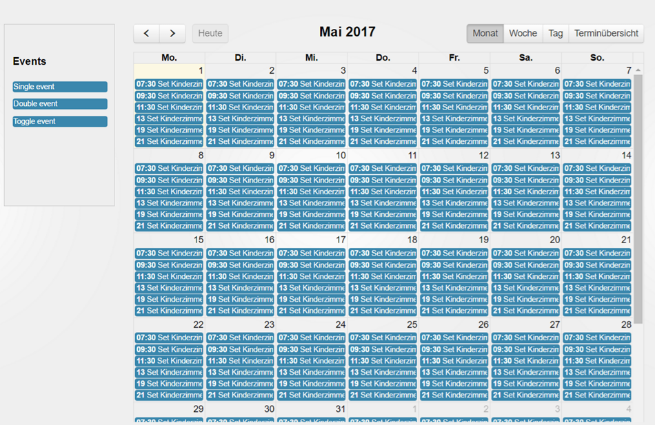

# IoBroker.fullcalendar
Zeitpläne mit [Vollkalender](https://fullcalendar.io).

## Planen Sie die Ereignisse (steuern Sie Ihre Geräte)
Sie dürfen keine externen Ressourcen verwenden, die Terminplanung wird ausschließlich in ioBroker verarbeitet und nicht mit externen Diensten wie „Google Kalender“ oder „iTunes“ kombiniert.

Sie können Ihre Ereignisse mit einem Kalender verwalten und planen, diese regelmäßig zu steuern.

## Ereignissimulation
Sie können Ihr Verhalten aufzeichnen und später wiedergeben.
Sie können beispielsweise zwei Aufnahmen für Arbeitstage und Wochenenden erstellen und diese an den entsprechenden Tagen abspielen.

Oder Sie können die ganze Woche aufzeichnen und sie in den nächsten Wochen während Ihrer Abwesenheit abspielen.

Anwendung:

- Wechseln Sie zur Registerkarte „Simulation“.
- Erstellen Sie die neue Simulation, indem Sie auf die Schaltfläche „+“ klicken und den Simulationstyp auswählen: Tag oder Woche.
- Klicken Sie auf die Aufnahmetaste und warten Sie 24 Stunden oder 7 Tage, bis die Simulation beendet ist, um Ereignisse aufzuzeichnen.
Sie können die Simulation nun durch Klicken auf die Wiedergabetaste erneut abspielen. Zusätzlich können Sie den Startzeitpunkt der Simulation festlegen.

## Todo
- Woche und Tag müssen auf die aktuelle Uhrzeit gescrollt werden.

<!-- Platzhalter für die nächste Version (am Anfang der Zeile):

### **IN BEARBEITUNG** -->

## Changelog
### **WORK IN PROGRESS**
* (bluefox) Migrated GUI to vite

### 2.4.5 (2024-09-09)
* (bluefox) Corrected SelectID Dialog

### 2.4.4 (2024-09-09)
* (bluefox) Removed withStyles package

### 2.3.17 (2024-05-26)
* (bluefox) Corrected the simulation

### 2.3.16 (2024-05-25)
* (bluefox) Small UI fixes on widget

### 2.3.10 (2024-05-22)
* (bluefox) Small UI fixes

### 2.3.9 (2024-05-20)
* (bluefox) Corrected vis-2 widget

### 2.3.4 (2023-11-28)
* (bluefox) Corrected monthly events

### 2.3.1 (2023-11-27)
* (bluefox) Packages were updated
* (bluefox) Corrected vis-2 widget

### 2.2.6 (2023-07-27)
* (bluefox) Compatibility with vis-2

### 2.2.2 (2023-06-19)
* (bluefox) Corrected stop of the recording

### 2.2.0 (2023-04-24)
* (bluefox) Added simulation of events

### 2.0.8 (2023-03-24)
* (bluefox) Corrected vis-2 widgets

### 2.0.5 (2023-03-07)
* (bluefox) New material design added
* (bluefox) License changed to MIT
* (bluefox) Allowed deletion of events

### 1.2.0 (2021-12-14)
* (bluefox) Updated to use with js-controller 3.3 and admin 5

### 1.1.0 (2020-01-12)
* (foxriver76) Updated to use with js-controller 2.x

### 1.0.0 (2019-11-17)
* (bluefox) Support for compact mode is added

### 0.2.4 (2017-11-23)
* Translations

### 0.2.3 (2017-11-22)
* (bluefox) Fixed interval settings
* (bluefox) Update fullcalendar library

### 0.2.1 (2017-09-25)
* (bluefox) Fixed error

### 0.2.0 (2017-08-06)
* (bluefox) Support for new admin

### 0.1.1 (2017-07-13)
* (bluefox) Fixed double event by creation

### 0.1.0 (2017-03-20)
* (bluefox) initial commit

## License
The MIT License (MIT)

Copyright (c) 2017-2026 Bluefox <dogafox@gmail.com>

Permission is hereby granted, free of charge, to any person obtaining a copy
of this software and associated documentation files (the "Software"), to deal
in the Software without restriction, including without limitation the rights
to use, copy, modify, merge, publish, distribute, sublicense, and/or sell
copies of the Software, and to permit persons to whom the Software is
furnished to do so, subject to the following conditions:

The above copyright notice and this permission notice shall be included in
all copies or substantial portions of the Software.

THE SOFTWARE IS PROVIDED "AS IS", WITHOUT WARRANTY OF ANY KIND, EXPRESS OR
IMPLIED, INCLUDING BUT NOT LIMITED TO THE WARRANTIES OF MERCHANTABILITY,
FITNESS FOR A PARTICULAR PURPOSE AND NONINFRINGEMENT. IN NO EVENT SHALL THE
AUTHORS OR COPYRIGHT HOLDERS BE LIABLE FOR ANY CLAIM, DAMAGES OR OTHER
LIABILITY, WHETHER IN AN ACTION OF CONTRACT, TORT OR OTHERWISE, ARISING FROM,
OUT OF OR IN CONNECTION WITH THE SOFTWARE OR THE USE OR OTHER DEALINGS IN
THE SOFTWARE.