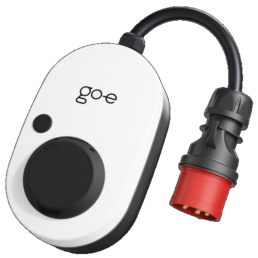

# IoBroker.go-eCharger

## Versionen
## IoBroker-Adapter für go-e Charger EV-Wallboxen
Dieser Adapter integriert eine oder mehrere go-e Charger Wallboxen in Ihre ioBroker-Hausautomation. Er fragt jede Wallbox zyklisch über ihre lokale HTTP-API ab, stellt alle relevanten Daten gemäß den ioBroker-Statusmeldungen bereit und ermöglicht Ihnen die direkte Steuerung des Ladevorgangs von Ihrem Smart Home aus.

Weitere Informationen zur go-e Charger Hardware finden Sie auf der Website des Herstellers: [go-e GmbH](https://go-e.com).

### Merkmale
- unterstützt mehrere go-e Ladegeräte innerhalb einer einzigen Adapterinstanz
- Überwachung des Fahrzeugzustands, der Ladeleistung, des Ladestroms, der Netzphasen und der Energiestatistik
- **ChargeNOW** – Sofortiger Ladevorgang mit einstellbarem Strom
- **ChargeManager** – automatisches Laden von PV-Überschussstrom: Der Ladestrom wird kontinuierlich an die verfügbare Solarenergie angepasst und berücksichtigt dabei den Hausverbrauch sowie den Ladezustand Ihrer Heimbatterie. Das Laden Ihres Elektrofahrzeugs kann verzögert werden, bis die Heimbatterie einen konfigurierbaren Mindestladezustand erreicht hat.

**Hinweis:** Die PV-Überschussladung ist derzeit für die Steuerung eines einzelnen Ladegeräts ausgelegt. Wenn ChargeManager gleichzeitig auf mehreren Ladegeräten aktiviert ist, werden die Ladeströme nicht koordiniert, und die Berechnung des Solarüberschusses liefert falsche Werte. Eine Erweiterung mit koordiniertem Lastmanagement für mehrere Ladegeräte wird in Kürze verfügbar sein.

- Umschaltung zwischen 1-phasigem und 3-phasigem Laden (Hardwaregeneration 3 und neuer)
- Energiestatistik pro RFID-Karte (Kartenname, ID und geladene Energie)
- Nur-Lese-Modus pro Wallbox – Überwachung des Ladegeräts ohne **Senden** von Steuerbefehlen (keine Ladungsfreigabe, kein Ladestrom, keine Phasenumschaltung), z. B. wenn der Ladevorgang extern gesteuert oder der Zugriff über RFID-Tags verwaltet wird.

Getestet mit Firmware V033, V040.0, V041.0, V054.7, V054.11, V055.5, V055.7, V055.8, V56.1, V56.2, V56.8, V56.9, V56.11, V57.0, V57.1, V59.4, V60.0, V60.1, V60.2 und mit bis zu 3 parallel betriebenen Ladegeräten.

### Anforderungen
- Für Hardware der Generationen 3 und 4 müssen Sie "HTTP API v1" in Ihrer go-e-App aktivieren.
- Für die Phasenumschaltung müssen Sie zusätzlich "HTTP API v2" in Ihrer go-e App aktivieren (Hardwaregeneration 3 und neuer).

## Konfiguration
Fügen Sie für jedes go-e Ladegerät einen Eintrag in die Wallbox-Liste ein und geben Sie dessen IP-Adresse ein. Optional können Sie jedem Ladegerät einen Namen zuweisen.

Aktivieren Sie den **Nur-Lese-Modus** für ein Ladegerät, wenn der Adapter dessen Daten nur lesen und niemals beschreiben soll. Im Nur-Lese-Modus sendet der Adapter keinerlei Steuerbefehle – weder die Ladefreigabe noch den Ladestrom noch die Phasenumschaltung. Die Zustände „ChargeNOW“ und „ChargeManager“ können weiterhin umgeschaltet werden, haben aber keine Auswirkung auf ein Ladegerät im Nur-Lese-Modus. Verwenden Sie diesen Modus, wenn der Ladevorgang der Wallbox von einem anderen System gesteuert oder lokal über RFID-Tags verwaltet wird.

Für die PV-Überschussladung mit ChargeManager konfigurieren Sie die Objekt-IDs der folgenden Zustände Ihres PV-Systems:

- aktuell verfügbare Solarleistung [W]
- aktueller Stromverbrauch des Haushalts [W]
- aktueller Ladezustand Ihrer Heimbatterie [%]

Wenn der Stromverbrauch der Wallbox bereits in Ihrem Haushaltsstromverbrauchswert enthalten ist, aktivieren Sie das entsprechende Kontrollkästchen, damit der Adapter den verfügbaren Überschuss korrekt berechnen kann.

Die Abfragezykluszeit legt fest, wie oft der Adapter Daten von den Ladegeräten abruft und den Ladestrom anpasst (Minimum 3 Sekunden, Standard 10 Sekunden).

## Wächter
Dieser Adapter verwendet Sentry-Bibliotheken, um Ausnahmen und Codefehler automatisch an die Entwickler zu melden. Weitere Details und Informationen zum Deaktivieren der Fehlerberichterstattung finden Sie in Abschnitt [Sentry-Plugin-Dokumentation](https://github.com/ioBroker/plugin-sentry#plugin-sentry)!

## Spenden
 Wenn dir dieses Projekt gefallen hat – oder du einfach nur in spendabler Stimmung bist – spendier mir doch ein Bier. Prost! 😉

## Changelog

<!--
  Placeholder for the next version (at the beginning of the line):
  ### **WORK IN PROGRESS**
-->

### **WORK IN PROGRESS**

- (hombach) removed chai-based unit test dependencies; modernized test harness to Node.js assert (fixes Appveyor, #836)

### 1.1.0 (2026-07-05)

- (hombach) fixed reading of "unlocked by RFID" (uby) on gen 3+ chargers via API V2
- (hombach) read-only mode now suppresses all control commands (charge release, charging current, phase switching)
- (ioBroker-Bot) Adapter requires admin >= 7.8.23 now.

### 1.0.4 (2026-07-04)

- (hombach) harmonized i18n files
- (hombach) improved README and English texts
- (hombach) reworked translations in all languages
- (hombach) added 5s timeout to all HTTP requests to chargers
- (hombach) fixed adapter stop when no charger is reachable at startup; warn per unreachable charger
- (hombach) fixed German fallback text for RFID card channel names
- (hombach) added upper bound validation for cycle time
- (hombach) added link to manufacturer's website
- (hombach) code optimizations

### 1.0.3 (2026-07-03)

- (hombach) added translations
- (hombach) fixed state roles

### 1.0.2 (2026-07-01)

- (hombach) fix RFID data readout for gen 3+ chargers via API V2 (#802)
- (hombach) prepared for beta repo
- (hombach) eliminate yarn
- (hombach) upgraded adapter-core
- (hombach) updated axios
- (hombach) updated dependencies

### 1.0.1 (2026-05-17)

- (hombach) fix total stats
- (hombach) fix adapter checker findings
- (hombach) fix docu
- (hombach) fix tsconfig

[Older changelogs can be found there](CHANGELOG_OLD.md)

## License

MIT License

Copyright (c) 2020-2026 C.Hombach

Permission is hereby granted, free of charge, to any person obtaining a copy
of this software and associated documentation files (the "Software"), to deal
in the Software without restriction, including without limitation the rights
to use, copy, modify, merge, publish, distribute, sublicense, and/or sell
copies of the Software, and to permit persons to whom the Software is
furnished to do so, subject to the following conditions:

The above copyright notice and this permission notice shall be included in all
copies or substantial portions of the Software.

THE SOFTWARE IS PROVIDED "AS IS", WITHOUT WARRANTY OF ANY KIND, EXPRESS OR
IMPLIED, INCLUDING BUT NOT LIMITED TO THE WARRANTIES OF MERCHANTABILITY,
FITNESS FOR A PARTICULAR PURPOSE AND NONINFRINGEMENT. IN NO EVENT SHALL THE
AUTHORS OR COPYRIGHT HOLDERS BE LIABLE FOR ANY CLAIM, DAMAGES OR OTHER
LIABILITY, WHETHER IN AN ACTION OF CONTRACT, TORT OR OTHERWISE, ARISING FROM,
OUT OF OR IN CONNECTION WITH THE SOFTWARE OR THE USE OR OTHER DEALINGS IN THE
SOFTWARE.