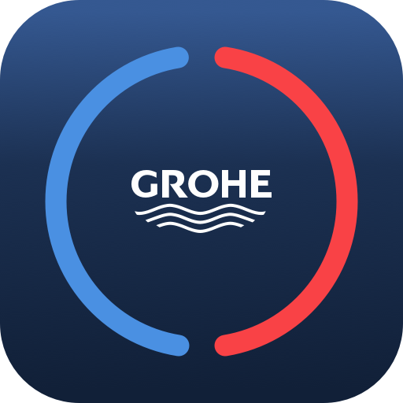

# ioBroker.grohe-smarthome

## ioBroker Grohe Smarthome-Adapter

This adapter connects ioBroker to the <strong>Grohe Smarthome / Ondus</strong> cloud and exposes Grohe devices as states (and some controls) inside ioBroker.

Es unterstützt:

- **Grohe Sense** (Typ`101` )
- **Grohe Sense Guard** (Typ`103` )
- **Grohe Blue Home** (Typ`104` )
- **Grohe Blue Professional** (Typ`105` )

Der Adapter meldet sich über den OIDC/Keycloak-Flow von Grohe an, speichert ein **verschlüsseltes Aktualisierungstoken** in einem Zustand und fragt die Grohe Cloud-API in einem konfigurierbaren Intervall ab.

Ideen und Konzept stammen von der Home-Assistant-Integration **ha-grohe\_smarthome** . Besonderer Dank gilt **Flo-Schilli** .

---

## Dokumentation

[🇺🇸 Dokumentation](/#/docs/adapterref/iobroker.grohe-smarthome/docs/en/README.md)

[🇩🇪 Dokumentation](https://github.com/patricknitsch/ioBroker.grohe-smarthome/blob/main/docs/de/README.md)

---

## Changelog
<!--
	Placeholder for the next version (at the beginning of the line):
	### **WORK IN PROGRESS**
-->
### 0.7.0 (2026-08-05)
* (patricknitsch) Isolate per-appliance errors during polling so one broken device doesn't abort the whole poll cycle
* (patricknitsch) Add app-matching remaining filter sensor for Grohe Blue (`remainingFilterApp`)

### 0.6.0 (2026-06-05)
* (copilot) Fixes Repo Checker
* (copilot) Change Raw-States to Bump Funktion for Debugging(see Doc.)
* (copilot) Fixes Problems Error 404
* (copilot) New functions for Grohe with Snooze, Withdrawal and Sprinkler
* (copilot) Extend Documentation

### 0.5.4 (2026-05-23)
* (copilot) Add latest Message for Notifications
* (copilot) Add Icons in Notifications

### 0.5.3 (2026-05-21)
* (copilot) Modify notification manager to work with instances
* (copilot) Update Dependencies

### 0.5.2 (2026-05-14)
* (patricknitsch) Fix Header when Device offline
* (patricknitsch) Add Icon and Online State on each Device
* (patricknitsch) Update Readme and Doc

**Older entries can be found in [CHANGELOG_OLD.md](https://github.com/patricknitsch/ioBroker.grohe-smarthome/blob/main/CHANGELOG_OLD.md).**

## License
MIT License

Copyright (c) 2026 patricknitsch <patricknitsch@web.de>

Permission is hereby granted, free of charge, to any person obtaining a copy
of this software and associated documentation files (the "Software"), to deal
in the Software without restriction, including without limitation the rights
to use, copy, modify, merge, publish, distribute, sublicense, and/or sell
copies of the Software, and to permit persons to whom the Software is
furnished to do so, subject to the following conditions:

The above copyright notice and this permission notice shall be included in all
copies or substantial portions of the Software.

THE SOFTWARE IS PROVIDED "AS IS", WITHOUT WARRANTY OF ANY KIND, EXPRESS OR
IMPLIED, INCLUDING BUT NOT LIMITED TO THE WARRANTIES OF MERCHANTABILITY,
FITNESS FOR A PARTICULAR PURPOSE AND NONINFRINGEMENT. IN NO EVENT SHALL THE
AUTHORS OR COPYRIGHT HOLDERS BE LIABLE FOR ANY CLAIM, DAMAGES OR OTHER
LIABILITY, WHETHER IN AN ACTION OF CONTRACT, TORT OR OTHERWISE, ARISING FROM,
OUT OF OR IN CONNECTION WITH THE SOFTWARE OR THE USE OR OTHER DEALINGS IN THE
SOFTWARE.