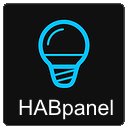
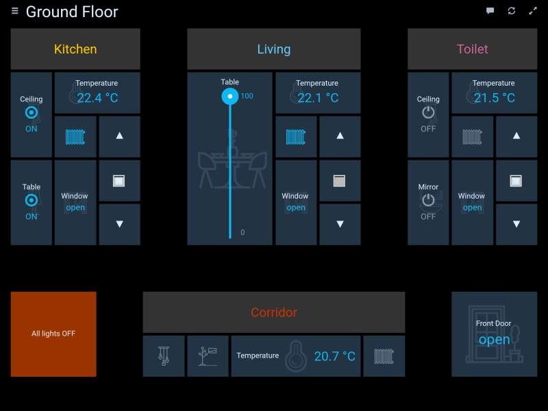

# IoBroker.habpanel
HABPanel ist eine leichte Dashboard-Schnittstelle für ioBroker, basierend auf OpenHAB HABpanel.

Es verfügt insbesondere über einen eingebetteten Dashboard-Designer, mit dem sich Schnittstellen ganz einfach direkt auf dem Zielgerät erstellen lassen.

## Installation
**Wichtig!** Dieser Adapter kann nicht direkt von GitHub installiert werden. Nur von npm.

## Erste Schritte
- Wenn Sie HABPanel zum ersten Mal in einem neuen Browser oder auf einem neuen Gerät aufrufen, sollte Ihnen ein ziemlich leerer Bildschirm angezeigt werden – folgen Sie dem Tutorial und beginnen Sie, indem Sie auf das Symbol in der oberen rechten Ecke klicken (oder tippen).
- Sie befinden sich jetzt im Bearbeitungsmodus, ein Link („Neues Dashboard hinzufügen“) sowie ein Link „Erweiterte Einstellungen“ wurden angezeigt.
- Wenn Sie zuvor HABPanel verwendet und einige Panel-Konfigurationen auf dem Server gespeichert haben, gehen Sie zu „Erweiterte Einstellungen“ und klicken Sie auf Ihre vorherige Konfiguration – sie wird sofort wiederhergestellt. Oder erstellen Sie Ihr erstes Dashboard: Klicken/tippen Sie auf den Link „Neues Dashboard hinzufügen“ und geben Sie ihm einen Namen.
- Klicken/tippen Sie auf die Dashboard-Kachel, um den Dashboard-Editor aufzurufen
- Fügen Sie Ihr erstes Widget hinzu: Wählen Sie das Menü „Widget hinzufügen“ und wählen Sie einen Widget-Typ (sagen wir „Dummy“ – ein einfaches Widget, das den Status eines Elements anzeigt).
- Verschieben Sie das Widget per Drag-and-Drop und ändern Sie die Größe mit dem weißen Chevron - dieser erscheint, wenn Sie auf das Widget klicken
- Klicken Sie auf die drei Punkte in der oberen rechten Ecke des Widgets, um dessen Kontextmenü aufzurufen, und wählen Sie _„Bearbeiten…“_
- Passen Sie einige Einstellungen an (Name, openHAB-Element usw.) und bestätigen Sie Ihre Änderungen
- Speichern Sie Ihre Konfiguration, indem Sie auf die Schaltfläche _Speichern_ klicken/tippen
- Klicken/tippen Sie auf _Ausführen_, um Ihr Dashboard in Aktion zu sehen - verwenden Sie die Zurück-Schaltfläche Ihres Browsers oder den Pfeil, um zum Zeichenbrett zurückzukehren
- Wenn Sie mit Ihrem Dashboard-Satz zufrieden sind, gehen Sie zurück zu „Erweiterte Einstellungen“ und klicken/tippen Sie dann auf „Aktuelle Konfiguration in einer neuen Panel-Konfiguration speichern“. Dadurch wird sie wie oben beschrieben auf dem openHAB 2-Server gespeichert und für die Wiederverwendung verfügbar gemacht.

## Screenshots

## Changelog
<!--
	Placeholder for the next version (at the beginning of the line):
	### __WORK IN PROGRESS__
-->
### __WORK IN PROGRESS__
-   (mcm1957) Adapter requires nodeJS >=18 and js-controller >= 5 now.
-   (mcm1957) Dependencies have been updated.

### 0.5.0 (2022-02-16)
* (jogibear9988) added on support for new websockets

### 0.4.3 (2020-08-22)
* (bluefox) The compatibility to socket.io 3.0.13 provided

### 0.4.1 (2020-02-10)
* (Apollon77) compatibility to web 3.0

### 0.3.5 (2019-04-15)
* (yaming116) bugfix i18n

### 0.3.4 (2019-02-04)
* (janfromberlin) button widget did not handle primitive boolean commands
* (matthiasgasser) fix time series query start date, adapted end date

### 0.3.3 (2019-02-02)
* (janfromberlin) fix button toggle functionality for true/false

### 0.3.2 (2019-01-30)
* (foxthefox) chart and timeline functionality fixed

### 0.3.1 (2019-01-27)
* (foxthefox) chart and timeline functionality added

### 0.2.6 (2019-01-14)
* (jogibear9988) bugfix selection element

### 0.2.5 (2019-01-14)
* (jogibear9988) bugfix format strings

### 0.2.4 (2019-01-13)
* (jogibear9988) bugfix template widget

### 0.2.3 (2019-01-11)
* (jogibear9988) upgrade to current openhab version

### 0.1.7 (2017-05-20)
* (bluefox) add to welcome screen

### 0.1.6 (2017-05-15)
* (bluefox) initial commit

## License
Copyright (c) 2024 iobroker-community-adapters <iobroker-community-adapters@gmx.de>
Copyright 2017-2022 bluefox <dogafox@gmail.com>

Eclipse Public License