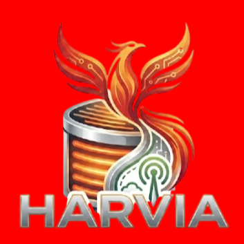

<p align="center"></p>

# IoBroker.harvia-fenix
**[Hier geht es zur deutschen Version der Dokumentation.](README_de.md)**

[](https://weblate.iobroker.net/engage/adapters/)


### Ein ioBroker-Adapter zur Integration und Steuerung Ihrer **Harvia Fenix** Sauna-Steuereinheit über die MyHarvia Cloud-Infrastruktur.
Weitere Informationen zu Harvia und deren Sauna-Steuereinheiten finden Sie unter [offizielle Harvia-Website](https://www.harvia.com).

---

## ⚠️ WICHTIGER SICHERHEITSHINWEIS & HAFTUNGSAUSSCHLUSS
**Die Fernsteuerung eines Saunaofens unterliegt strengen Sicherheitsbestimmungen!** Gemäß der europäischen Sicherheitsnorm **EN 60335-2-53** in Verbindung mit **EN 60335-1** sind Brandschutzmaßnahmen für ferngesteuerte Saunaöfen zwingend erforderlich. Die Saunakabine muss mit einem zugelassenen Türsensor oder einer Sicherheitsabschaltung ausgestattet sein. Dadurch wird sichergestellt, dass der Ofen nicht ferngesteuert oder per Zeitschaltuhr gestartet werden kann, wenn sich ein brennbarer Gegenstand (z. B. ein Handtuch) auf oder in der Nähe des Ofens befindet.

* **Haftungsausschluss:** Der Entwickler dieses Adapters übernimmt keinerlei Verantwortung, Gewährleistung oder Haftung für Schäden, Brände, Verletzungen oder rechtliche Probleme, die durch die Verwendung oder Fehlkonfiguration dieser Software entstehen. Die Nutzung dieser Integration erfolgt auf eigenes Risiko.
* **Marken:** Harvia und MyHarvia 2 sind eingetragene Marken der Harvia Group. Dieser Adapter ist ein unabhängiges, von der Community getragenes Open-Source-Projekt und wird weder offiziell von Harvia unterstützt noch gesponsert.

---

## Installation
Der Adapter ist im offiziellen ioBroker-Repository `latest` (Beta) verfügbar. Sie können ihn direkt über die ioBroker-Weboberfläche oder lokal via npm installieren.

### Browserbasiert (über ioBroker Admin)
1. Öffnen Sie Ihre ioBroker-Weboberfläche in einem Browser (z. B. `192.168.1.33:8081`).
2. Stellen Sie sicher, dass Ihre ioBroker-Repository-Einstellung auf **`latest`** (Beta) eingestellt ist.
3. Klicken Sie auf die Registerkarte **Adapter**.
4. Geben Sie "harvia-fenix" in den Filter ein.
5. Klicken Sie auf die drei Punkte und anschließend auf das "+"-Symbol des **Harvia Fenix**-Adapters, um eine Instanz hinzuzufügen.

### Lokaler Rechner
Navigieren Sie in Ihren ioBroker-Ordner und führen Sie folgenden Befehl aus:

```bash
npm i iobroker.harvia-fenix
```

---

## Aufstellen
Zusätzlich zur Installation des Adapters müssen Sie die Adapterinstanz mit Ihren MyHarvia-Kontodaten konfigurieren.

### Voraussetzungen
1. **Node.js >= 22**
2. Ein registriertes Konto in der offiziellen Smartphone-Anwendung **MyHarvia 2**.
3. Ihre gültigen Anmeldedaten:
   - **E-Mail-Adresse**
- **Passwort**

*Hinweis: Wir empfehlen, ein separates Konto für ioBroker in der Harvia 2-App einzurichten und diese Anmeldeinformationen in der Instanz zu verwenden.*

### IoBroker-Konfiguration
1. Öffnen Sie Ihre ioBroker-Oberfläche in einem Browser (z. B. `192.168.1.33:8081`).
2. Navigieren Sie zum Tab **Instanzen** und klicken Sie auf das Einstellungssymbol Ihrer `harvia-fenix.0`-Instanz.
3. Geben Sie Ihre **E-Mail-Adresse** und Ihr **Passwort** Ihres MyHarvia-Kontos ein.
4. Wenn Sie das Feld **Geräte-ID** leer lassen, sucht der Adapter beim Start automatisch nach Geräten, die mit Ihrem Konto verknüpft sind. Das erste gefundene Gerät wird als aktive Einheit verwendet.
5. Optionale Parameter anpassen: **Abfrageintervall** (Sekunden), **Minimale/Maximale Zieltemperaturgrenzen** (°C) und **Maximale Heizdauer** (Minuten).
6. Klicken Sie auf **Speichern & Schließen**.

### Gerätekonfiguration & Unterstützung mehrerer Geräte
#### Automatische Erkennung
Wenn Sie das Feld **Geräte-ID** in den Adaptereinstellungen leer lassen, sucht der Adapter beim Start automatisch nach Geräten, die mit Ihrem Konto verknüpft sind. Das erste gefundene Gerät wird als aktive Einheit verwendet. Die erkannte ID wird im ioBroker-Protokoll ausgegeben.

#### Manuelle Geräte-ID
Für die meisten Nutzer mit einer einzelnen Sauna ist die automatische Erkennung ausreichend. Es wird jedoch empfohlen, die erkannte ID aus dem Protokoll zu kopieren und in die Konfiguration einzufügen, um eine stabile Verbindung zur jeweiligen Hardware zu gewährleisten.

#### Mehrere Saunen
Wenn Ihr MyHarvia-Konto mehrere Steuereinheiten verwaltet (z. B. eine zu Hause und eine im Ferienhaus):

1. Erstellen Sie für jede Sauna eine separate Instanz des Adapters (z. B. `harvia-fenix.0` und `harvia-fenix.1`).
2. Geben Sie die spezifische **Geräte-ID** für jede Einheit manuell in deren jeweiliger Instanzkonfiguration ein.

Dies ermöglicht es Ihnen, beide Saunen unabhängig voneinander mit jeweils eigenen Datenpunkten zu überwachen und zu steuern.

### Gemeinsame Konten / Gastkonten & Die Partner-ID
#### Was ist die Partner-ID?
Die MyHarvia-Cloud-Infrastruktur trennt Geräte, Benutzer und Apps in verschiedene „Partnerorganisationen“. Beispielsweise ist die offizielle Smartphone-Anwendung **MyHarvia 2** der Partner-ID `ORG/prod:0:6656:0` zugeordnet.

Normalerweise dekodiert der Adapter beim Login eines Benutzers dessen JSON Web Token (JWT)-Payload und extrahiert automatisch die Partner-ID aus dem Feld `custom:org`. Anschließend fragt er die Harvia Cloud-API mithilfe dieser ID ab, um verbundene Geräte zu ermitteln.

#### Das Problem mit gemeinsam genutzten/Gastkonten
Wenn ein anderer Nutzer (der Besitzer/Hauptnutzer) seine Sauna in der MyHarvia 2 App mit Ihnen geteilt hat:

1. Ihr Kontotoken ist mit einer anderen Gastpartner-ID verknüpft (z. B. `ORG/prod:0:6749` oder einer benutzerdefinierten ID).
2. Wenn der Adapter die Geräteliste unter Ihrer Gast-Partner-ID abfragt, gibt die Harvia Cloud API eine leere Liste zurück (`{"devices":[]}`), und Sie sehen die Sauna nicht.
3. Um die gemeinsam genutzte Sauna zu entdecken und zu steuern, müssen die API-Anfragen **über die Partner-ID des Eigentümers** gestellt werden.

#### Wie finde ich die Partner-ID des Eigentümers?
Es gibt zwei Möglichkeiten, die Partner-ID des Eigentümers zu ermitteln:

1. **Standard-App:** Wenn der Besitzer die offizielle Standard-Mobilanwendung **MyHarvia 2** verwendet, lautet die Partner-ID **`ORG/prod:0:6656:0`**.
2. **Aus dem ioBroker-Protokoll:** Wenn der Besitzer den `harvia-fenix`-Adapter bereits ausführt, kann er sein ioBroker-Startprotokoll überprüfen. Beim Start gibt der Adapter eine Zeile wie die folgende aus:

`Using partner ID from user token: ORG/prod:0:XXXX` Der Besitzer kann diese ID einfach kopieren und sie mit dem Gastbenutzer teilen.

#### So konfigurieren Sie ein gemeinsames/Gastkonto
1. Geben Sie in den Adaptereinstellungen Ihren **Benutzernamen / Ihre E-Mail-Adresse** und Ihr **Passwort** (die Gastzugangsdaten) ein.
2. Geben Sie die **Partner-ID des Eigentümers** im Feld **Partner-ID (optional)** ein.
3. Wenn Sie das Feld **Geräte-ID** leer lassen, sucht der Adapter anhand der Partner-ID des Besitzers nach dem gemeinsam genutzten Gerät und findet es automatisch.

---

## Kompatibilitätshinweis
* **Unterstützt:** **Harvia Fenix** Steuereinheiten, die über die mobile Anwendung **MyHarvia 2** verwaltet werden.
* **NICHT unterstützt:** **Harvia Xenio**-Serie (z. B. Xenio WiFi / CX001WIFI). Die Xenio-Serie basiert auf einem älteren Hardware-Ökosystem und verwendet die ältere App *„MyHarvia for Xenio“*, die mit der von diesem Adapter verwendeten API nicht kompatibel ist.

---

## Verwendung
Der Adapter bildet die Cloud-Zustände Ihrer Sauna auf strukturierte ioBroker-Datenpunkte unter `harvia-fenix.0.*` ab.

### Verfügbare Datenpunkte
| Datenpunkt | Typ | Rolle | Zugriff | Beschreibung |
|---|---|---|---|---|
| `info.connection` | Boolescher Wert | `indicator` | Schreibgeschützt | Verbindungsstatus des Adapters zur MyHarvia Cloud. |
| `info.maxTemp` | Nummer | `value.temperature` | Schreibgeschützt | Maximale Zieltemperaturgrenze (`110 °C`). |
| `online` | Boolescher Wert | `indicator.reachable` | Schreibgeschützt | Verbindungsstatus der Steuereinheit zur Cloud. |
| `doorSafety` | Boolescher Wert | `indicator.safety` | Schreibgeschützt | Status der Sicherheitsschleife (z. B. `true`, wenn die Tür sicher ist / sicher betrieben werden kann). |
| `remoteControl` | Boolescher Wert | `indicator` | Schreibgeschützt | Status der Bereitschaft zum Fernstart. Wenn `false`, ist das Starten der Heizung per Fernzugriff (über den Adapter) blockiert. |
| `errorMsg` | Zeichenkette | `text` | Schreibgeschützt | Aktuelle Fehlermeldungen oder Statusmeldungen des Heizgeräts. |
| `heatOn` | Boolescher Wert | `switch.power` | Lesen/Schreiben | Hauptschalter zum Ein- (`true`) oder Ausschalten (`false`) der Saunaheizung. |
| `heaterPower` | Nummer | `value.power` | Schreibgeschützt | *Hinweis:* Dieses Objekt wird von der MyHarvia-API-Struktur bereitgestellt, wird aber derzeit als `0 kW` (leer) ausgeliefert. Es scheint für zukünftige Hardware- oder App-Updates reserviert zu sein. |
| `lightOn` | Boolescher Wert | `switch.light` | Lesen/Schreiben | Schalter zum Ein- oder Ausschalten der integrierten Saunabeleuchtung. |
| `maxDuration` | Nummer | `level.timer` | Lesen/Schreiben | Maximal zulässige Heizdauer für den Saunagang in Minuten (`min`). |
| `panelTemp` | Nummer | `value.temperature` | Schreibgeschützt | Die am physischen Bedienfeld gemessene Temperatur. |
| `targetTemp` | Nummer | `level.temperature` | Lesen/Schreiben | Sollwert für die Zieltemperatur der Saunakabine (z. B. `90 °C`). |
| `temp` | Zahl | `value.temperature` | Schreibgeschützt | Die aktuelle Umgebungstemperatur in der Saunakabine (z. B. `17 °C`). |
| `readyNotified10Min` | Boolescher Wert | `indicator` | Schreibgeschützt | Wird auf `true` gesetzt, wenn die Sauna noch etwa 10 Minuten von der Zieltemperatur entfernt ist (13 °C unter Zielwert). |
| `targetReachedNotified` | Boolescher Wert | `indicator` | Schreibgeschützt | Wird zu `true`, wenn die Sauna die konfigurierte Zieltemperatur erreicht hat. |
| `totalBathingHours` | Zahl | `value.number` | Schreibgeschützt | Gesamte historische kumulierte Betriebsstunden der Sauna (`h`). |
| `totalOperatingHours` | Nummer | `value.hours` | Schreibgeschützt | Gesamtbetriebsstunden des Systems (`h`). |
| `totalSessions` | Zahl | `value.count` | Schreibgeschützt | Zähler für die Gesamtzahl der durchgeführten Sauna-Heizvorgänge. |
| `totalSessions` | Zahl | `value.count` | Schreibgeschützt | Zähler für die Gesamtzahl der durchgeführten Sauna-Heizvorgänge. |

---

## Benachrichtigungen & Automatisierungen
Der Adapter berechnet automatisch den Heizfortschritt und liefert zwei Indikatordatenpunkte, die speziell für das Auslösen von Push-Benachrichtigungen (z. B. über Telegram, Pushover oder Alexa) entwickelt wurden.

Sie können einfach ein simples ioBroker-Skript (JavaScript oder Blockly) verwenden, das auf Änderungen dieser Zustände zu `true` reagiert:

```javascript
// Trigger for the 10-minute pre-warning
on({ id: 'harvia-fenix.0.readyNotified10Min', change: 'ne', val: true }, function () {
    const targetTemp = getState('harvia-fenix.0.targetTemp').val;
    sendTo('telegram.0', 'send', { text: `🧖 The sauna will reach its target temperature (${targetTemp}°C) in about 10 minutes.` });
});

// Trigger when the sauna is fully ready
on({ id: 'harvia-fenix.0.targetReachedNotified', change: 'ne', val: true }, function () {
    const targetTemp = getState('harvia-fenix.0.targetTemp').val;
    sendTo('telegram.0', 'send', { text: `♨️ The sauna has reached the target temperature of ${targetTemp}°C and is ready!` });
});
```

*Hinweis: Diese Zustände werden automatisch auf `false` zurückgesetzt, wenn die Heizung ausgeschaltet wird oder eine neue Heizsitzung beginnt.*

---

## Fehlerbehebung
### Häufige API-Fehler und Statusmeldungen in `errorMsg`
* **`Aktion blockiert (403 Verboten). Die Fernstartberechtigung (Sicherheitsschleife) am Bedienfeld ist möglicherweise nicht aktiv.`**
- **Ursache:** Die europäische Sicherheitsnorm verlangt, dass der Fernstart nur aktiviert werden kann, wenn der Sicherheitskreis/Türsensor geschlossen ist und der Fernstart am Saunabedienfeld physisch aktiviert wurde.
**Lösung:** Schließen Sie die Saunatür und drücken Sie die Taste **Fernstart** an Ihrem Harvia-Bedienfeld. Das Fernbedienungssymbol auf dem Bildschirm muss aktiv sein. Anschließend können Sie die Sauna über den Adapter steuern.
* **`Cloud-Sperre: Gerät belegt, Befehl verworfen.` (Als Debug protokolliert)**
- **Ursache:** Die API von Harvia begrenzt die Anzahl der Befehle, die in schneller Folge gesendet werden (z. B. durch schnelles Klicken in der Benutzeroberfläche), um die Hardware zu schützen.
**Lösung:** Warten Sie einige Sekunden zwischen den Befehlen. Der Adapter verwirft automatisch Befehle, die zu schnell gesendet werden, um eine Blockierung der API zu verhindern.

---

## Aufgaben
* [ ] Warten Sie auf die offizielle Genehmigung von Harvia zur Verwendung ihres Originallogos.
* [x] Adapter zum offiziellen ioBroker-Repository `latest` hinzufügen
* [ ] Adapter zum offiziellen ioBroker-Repository `stable` hinzufügen

---

## Changelog
### **WORK IN PROGRESS**
* (dependabot) Bump axios from 1.18.1 to 1.19.0
* (meistermopper) Center adapter logo in README files
* (meistermopper) Add Weblate translation status badge to README files
* (meistermopper) Add npm run translate step to release-before-commit script
* (meistermopper) Replace static latest badge with dynamic iobroker.live badge

### 0.3.1 (2026-08-04)
* (meistermopper) Update GitHub Actions in auto-translate workflow to v7
* (meistermopper) Add Git commit and push authorization rule to AGENTS.md
* (meistermopper) Add auto-translate workflow for automatic i18n translations
* (meistermopper) Add missing CHANGELOG_OLD link to README files
* (meistermopper) Fix untranslated news entries for 0.2.8 in io-package.json
* (meistermopper) Add common.news translation rule to AGENTS.md
* (meistermopper) Remove redundant npm badge and move Test and Release badge after NPM banner

### 0.3.0 (2026-07-29)
* (meistermopper) Add configurable min/max temperature limits and maxDuration in Admin UI

### 0.2.8 (2026-07-26)
* (meistermopper) Note latest repository availability in README installation section
* (meistermopper) Fix doorSafety role to sensor.door for repochecker compliance
* (meistermopper) Add missing CHANGELOG_OLD link to README.md (repochecker S6022)
* (meistermopper) Fix changelog rotation in README_de.md to enforce 5 entries limit

### 0.2.7 (2026-07-17)
* (meistermopper) Implement retry for "Device unavailable" and proactive token refresh
* (meistermopper) Restore clean datapoint table and safety warnings in README files
* (meistermopper) Mark latest repository item as completed in To-Do list
* (meistermopper) Clarify remoteControl description in README files
* (meistermopper) Remove redundant ==== underlines from header in README files
* (meistermopper) Remove duplicate changelog link and format it consistently in README files
* (meistermopper) Update Biome schema version to 2.5.3 to match CLI version

### 0.2.6 (2026-07-16)
* (meistermopper) Change doorSafety role to indicator.safety to prevent semantic role mismatch
* (meistermopper) Redesign README and README_de.md layout to match Denon adapter presentation
* (meistermopper) Update AI commit hook prompt to generate messages entirely in English

[Older changelog entries](CHANGELOG_OLD.md)

## License
MIT License

Copyright (c) 2026 meistermopper <meister.mopper@gmail.com>