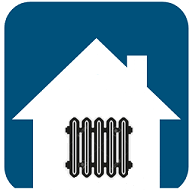

# IoBroker.HeatingControl

**Dieser Adapter verwendet Sentry-Bibliotheken, um den Entwicklern automatisch Ausnahmen und Codefehler zu melden.** Weitere Details und Informationen zum Deaktivieren der Fehlerberichterstattung finden Sie unter [Dokumentation zum Sentry-Plugin](https://github.com/ioBroker/plugin-sentry#plugin-sentry)! Sentry Reporting wird ab js-controller 3.0 verwendet.

**Wenn es Ihnen gefällt, denken Sie bitte über eine Spende nach:**

## Dokumentation
**Ich suche Unterstützung bei der Erstellung/Aktualisierung der Benutzerdokumentation und der FAQs. Bei Interesse bitte bei mir melden...**

## Adapter zur Steuerung Ihrer Heizungsanlage.
Merkmale:

* Steuern Sie die Solltemperaturen aller Thermostate nach Zeitplänen
* Konfigurieren Sie mehrere Heizperioden für jeden Tag und jede Nacht
* Unterstützt alle Arten von Thermostaten (Voraussetzung: es muss in ioBroker verfügbar sein)
* Automatische Erkennung von Homematic-Geräten
* unterstützt mehrere Profile
* Besteht keine direkte Verbindung zwischen Thermostat und Stellantrieb, kann der Stellantrieb direkt aus dem Adapter geschaltet werden
* Aktuell wird der Aktor bei Erreichen der Solltemperatur direkt abgeschaltet. Sobald die Solltemperatur unter der Isttemperatur liegt, wird der Aktor eingeschaltet. (Zu tun: verbesserte Kontrolle implementieren)
* unbegrenzte Anzahl von Thermostaten, Aktoren und Sensoren pro Raum werden unterstützt
* Thermostat, Stellantrieb und Sensor werden automatisch pro Raum erkannt. Dazu wird die Funktion (zB "Heizen") verwendet.
* Räume können innerhalb der Admin-Oberfläche ausgeschlossen werden, wenn ein Raum einen Thermostat enthält, aber nicht gesteuert werden soll
* Sensor dient zur Reduzierung der Solltemperatur (z. B. bei geöffnetem Fenster); optional mit SensorDelay
* Schnittstelle zu Feiertags-Adapter oder anderen zur Erkennung von Feiertagen. Feiertag kann ein normaler Tag oder wie ein Sonntag sein. (Admin-Einstellung)
* manuelle Temperaturübersteuerung für eine bestimmte Zeit
* vordefinierte Heizperiode
* Änderungen vom Thermostat übernehmen (optional)
* Visualisierung von [Pittini](https://github.com/Pittini/iobroker-heatingcontrol-vis) wird unterstützt. Dankeschön!

[FAQ](doc/FAQ.md)

## Installation
## Einstellungen
### Hauptsächlich
* Funktion = Funktion zur Erkennung von Thermostaten, Aktoren und Sensoren pro Raum. Es ist eine der System-Enums
* Zeitzone = wird für Cron verwendet, um Cron-Jobs anzupassen
* Pfad zum Feiertag - Adapter = Wenn Sie den Feiertag-Adapter verwenden möchten, um den heutigen Feiertag automatisch zu erkennen, dann stellen Sie hier den Pfad ein (z.B. feiertage.0)
* Alle Geräte löschen, wenn der Administrator öffnet = sollte deaktiviert sein. Aktivieren Sie es nur, wenn Sie alle Raum-, Aktor- und Sensoreinstellungen löschen müssen. Beim Öffnen des Adapter-Admin wird eine Gerätesuche durchgeführt
* Sensor verwendet = Wenn Sie Fenstersensoren haben und die Zieltemperatur bei geöffnetem Fenster senken möchten, aktivieren Sie diese Option
* Verwendete Aktoren = wenn Sie Aktoren direkt vom Adapter ansteuern möchten. Für den Fall, dass keine direkte Verbindung zwischen Thermostat und Stellantrieb besteht.
* Stellantriebe verwenden, wenn keine Heizperiode = nur gültig mit Stellantrieben. Legt fest, wie Aktoren eingestellt werden, wenn keine Heizperiode aktiv ist
* Stellantriebe verwenden, wenn kein Thermostat vorhanden = nur gültig mit Stellantrieben. Wenn Sie Räume ohne Thermostat aber mit Heizungsaktor haben, können Sie diese dauerhaft ein- oder ausschalten

### Profil
* Profiltyp = drei verschiedene Profiltypen (Montag - Sonntag oder Montag - Freitag und Samstag/Sonntag oder jeden Tag) werden unterstützt
* Anzahl der Profile = Wenn Sie mehr als das Profil benötigen, erhöhen Sie diesen Wert. Sie können dann auswählen, welches Profil verwendet wird.
* Anzahl der Perioden = Definieren Sie, wie viele Tagesabschnitte mit unterschiedlichen Temperaturen Sie benötigen. Je mehr Sie einstellen, desto mehr Datenpunkte werden erstellt. Verwenden Sie besser einen niedrigen Wert (z. B. 5)
* "Feiertag wie Sonntag = Wenn Sie Solltemperaturen an Feiertagen wie Sonntag einstellen möchten, aktivieren Sie diese Option. Ansonsten sind die Feiertagseinstellungen die gleichen wie an normalen Tagen
* Heizperiode = Start- und Enddatum der Heizperiode. Wird verwendet, um "HeizperiodeAktiv" einzustellen

### Geräte
* eine Liste aller Zimmer. Hier können Sie einen Raum deaktivieren.
* Drücken Sie die Schaltfläche Bearbeiten auf der rechten Seite, um das Einstellungsfenster für Thermostate, Aktoren und Sensoren für diesen Raum zu öffnen

### Bearbeitungsraum
* hier können Sie Objekt-IDs für Thermostate, Aktoren und Sensoren überprüfen und einstellen
* Sie können manuell neue Thermostate, Aktoren oder Sensoren hinzufügen. Drücken Sie einfach die +-Taste. Dann erhalten Sie eine leere Zeile, die aufgefüllt werden muss. Der Edit-Button öffnet eine Liste der verfügbaren Geräte auf dem System
* Thermostate:

** Name, Temperaturziel-OID und aktuelle Temperatur-OID sollten eingestellt werden.

* Aktoren

** Name und OID für Staat sollten gesetzt werden

* Sensoren

** Name und OID für den aktuellen Status sollten eingestellt werden

## Datenpunkte
| DP-Name | Beschreibung |
|---------------------|-----------------------------------------------------------------------------------------------------|
| HeizperiodeAktiv | wenn aus, werden die Profile nicht verwendet |
| AktuellesProfil | aktuelles Profil auswählen (1 basiert, bedeutet Profil 1 Datenpunkte unter Heatingcontrol.0.Profiles.0 verwenden) |
| LastProgramRun | zeigt das letzte Mal an, wann der Adapter ausgeführt wurde |

### Temperatursenkung / -erhöhung
| DP-Name | Beschreibung | Solltemperatur für relative Abnahme | Solltemperatur für absolute Abnahme |
|---------------------|------------------------------------------------------------|--------------------------------------------------------------------------------|---------------------------------------------------------------|
| GästeGegenwart | Temperatur erhöhen, weil Gäste es wärmer haben wollen | Erhöhen Sie die aktuelle Profiltemperatur um Profiles.0.room.GuestIncrease | setze das Ziel auf Profiles.0.room.absolute.GuestIncrease |
| PartyNow | Temperatur senken, weil es heiß wird' | Verringern Sie die aktuelle Profiltemperatur um Profiles.0.room.PartyDecrease | setze das Ziel auf Profiles.0.room.absolute.PartyDecrease |
| Präsentieren | wir sind anwesend, wenn wir nicht anwesend sind, sinkt die Temperatur | Verringern Sie die aktuelle Profiltemperatur um Profiles.0.room.AbsentDecrease | setze das Ziel auf Profiles.0.room.absolute.AbsentDecrease |
| UrlaubAbwesend | wir sind abwesend, also auch am Wochenende abnehmen | Verringern Sie die aktuelle Profiltemperatur um Profiles.0.room.VacationAbsentDecrease | setze das Ziel auf Profiles.0.room.absolute.VacationAbsentDecrease |
| FireplaceModeActive | Senken Sie die Temperatur, weil Sie einen Kamin benutzen, wird | Verringern Sie die aktuelle Profiltemperatur um Profiles.0.room.FireplaceModeDecrease | setze das Ziel auf Profiles.0.room.absolute.FireplaceModeDecrease |

| | automatisch zu einstellbarer Zeit zurückgesetzt

* in beiden Fällen wird nur eine Tieferlegung verwendet (in der vorherigen Version des Adapters konnten mehr als eine Entfettung verwendet werden)
* im absoluten Entfettungsszenario werden nur Sollwerte ungleich 0°C verwendet. Wenn Sie für einen bestimmten Raum keine Absenkung benötigen, halten Sie die Absenkungswerte bei 0°C

### Keine Heizperiode
es gibt drei möglichkeiten

* feste Temperatur pro Raum

Wenn diese Option ausgewählt ist, erscheint für jeden Raum ein neuer Datenpunkt im Objektbaum. Hier können Sie eine feste Solltemperatur einstellen, die eingestellt wird, wenn die Heizperiode nicht aktiv ist.

* feste Temperatur für alle Räume

Mit dieser Option können Sie für jeden Raum eine Solltemperatur verwenden, wenn die Heizperiode nicht aktiv ist

* nichts

mit dieser Option wird nichts an den Thermostat gesendet, wenn keine Heizperiode aktiv ist. Solltemperatur bleibt vom letzten Tag, als die Heizperiode noch aktiv war.
In diesem Fall und wenn Sie Aktoren aus dem Adapter verwenden, haben Sie die Möglichkeit zu definieren, wie die Aktoren eingestellt werden sollen (aus, ein oder so belassen)

## Andere
* HolidayPresent / PublicHolidyToday

Wenn Sie im Admin "Feriengeschenk wie Sonntag" oder "Feiertag wie Sonntag" aktivieren, wird das Profil für Sonntag verwendet, wenn dem Adapter mitgeteilt wird, dass heute ein Feiertag ist oder Sie im Urlaub zu Hause sind.

### Fenster geöffnet
wenn "Sensoren verwenden" aktiv ist und Sensor(en) für einen Raum konfiguriert ist/sind dann

* Verringern Sie die aktuelle Profiltemperatur bei geöffnetem Fenster (true) durch Profiles.0.room.WindowOpenDecrease, wenn relative Verringerung konfiguriert ist
* Setzen Sie das Ziel auf Profiles.0.room.absolute.WindowOpenDecrease, wenn das Fenster geöffnet ist (true), wenn die absolute Verringerung konfiguriert ist

optional kann eine Verzögerung verwendet werden. Wenn das Fenster nur für kurze Zeit geöffnet wird, kann die Sensorverzögerung in sehr kurzer Zeit eine Reduzierung und Rückkehr zum Normalzustand vermeiden.

## Ische Unterstützung
Sie können Ihren Kalender oder jeden anderen Datenpunkt verwenden, um Datenpunkte im Adapter zu ändern.
Konfigurieren Sie einfach Ereignisse von ical oder anderen Datenpunkten in admin. Unterstützt werden

| Datenpunkt | Beschreibung |-------------------------------------|---------- -------------------------------------------------- ---------------- |heatcontrol.0.Present | setze es auf true (bei booleschen Werten) oder auf eine Zahl höher als limit (bei Zahl) |heatingcontrol.0.HolidayPresent | setzen Sie es auf true, wenn Sie in Ihrem Urlaub zu Hause sind |heatingcontrol.0.UrlaubAbwesend | setzen Sie es auf true, wenn Sie im Urlaub nicht zu Hause sind |heatingcontrol.0.GuestsPresent | setze es auf true (bei booleschen Werten) oder auf eine Zahl höher als limit (bei Zahl) |heatingcontrol.0.PartyNow | setze es auf true (bei booleschen Werten) oder auf eine Zahl höher als limit (bei Zahl)

Hinweis: Mit Zahlendatenpunkten könnte man zählen, wie viele Personen sich im Haus befinden und dann entscheiden, z.B. Wir haben genug für eine Party...

## Änderungen vom Thermostat verwenden
Viele Benutzer fragten nach einer Option, um Änderungen vom Thermostat in den Adapter zu übernehmen. Jetzt sind vier Optionen implementiert:

| Option | Beschreibung |--------------------------|--------------------- -------------------------------------------------- ---------------- | nein | Änderungen vom Thermostat werden ignoriert | als Überschreibung | Änderungen vom Thermostat werden als Override genommen; Override-Zeit muss vorher in Heatingcontrol.0.Rooms.RoomName.TemperaturOverrideTime | . eingestellt werden | wenn Override-Zeit nicht gesetzt ist, wird Override nicht ausgeführt | als neue Profileinstellung | Änderungen vom Thermostat werden als Zieltemperatur für die aktuelle Profilperiode genommen | bis zum nächsten Profilpunkt | Änderungen vom Thermostat werden als Zieltemperatur bis zum nächsten Profilpunkt übernommen. Dies ist ein manueller Modus, daher werden nur Fenstersensoren verwendet. Alle anderen | | Erhöhungen / Verringerungen werden ignoriert. In jedem Raum befindet sich ein Datenpunkt, um den manuellen Modus zu deaktivieren, bevor der nächste Profilpunkt erreicht wird.

## Override verlängern, wenn die Temperatur geändert wird
Das Standardverhalten für Override ist, wenn Sie die Temperatur ändern, wird die Override-Zeit nicht geändert. Wenn Sie z.B. den Override für 20 Minuten mit 25 °C starten und nach 15 Minuten auf 28 °C wechseln, werden 28 °C nur für die letzten 5 Minuten verwendet. Mit dieser Option starten Sie den Override neu, wenn Sie die Override-Temperatur ändern.
Im Beispiel über 28°C würde dann für 20 Minuten verwendet, was zu 15 Minuten 25°C und 20 Minuten 28°C führt

## Override-Modus
Es gibt zwei einstellbare Modi im Admin für alle Räume.

* Timergesteuert

Dies ist die bekannte Funktion, die eine Temperatur und eine Dauer verwendet. Die angegebene Temperatur wird für die Dauer verwendet und dann wird das Temperaturziel auf den Wert im Auto-Modus zurückgesetzt

* bis zum nächsten Profilpunkt

Dies ist eine neue Funktion. Hier können wir einen Temperatur-Override bis zum nächsten Profilpunkt verwenden. Die Dauer wird ignoriert, muss aber ungleich Null sein!

## Thermostatgriffe "Fenster ist offen"
Einige Thermostate können selbst mit "Fenster ist offen" umgehen. In diesen Fällen wird eine direkte Verbindung zwischen Fensterfühler und Thermostat konfiguriert und der Thermostat reduziert beim Öffnen eines Fensters selbstständig die Solltemperatur.
In Kombination mit der Option "Änderungen vom Thermostat verwenden" / "bis zum nächsten Profilpunkt" führt dies zu einem unerwarteten manuellen Zustand. In dieser Situation würde die reduzierte Temperatur bis zum nächsten Profilpunkt verwendet.
Aber der Adapter kann dieses Verhalten handhaben. Sie müssen die Option "Thermostat behandelt 'Fenster ist geöffnet'" aktivieren und Sie können Fenstersensoren auch im Adapter konfigurieren.
Beim Öffnen des Fensters wartet der Adapter max. 3 Sekunden für neue Solltemperatur vom Thermostat. Erhält sie in dieser Zeit eine neue Solltemperatur, wird sie als reduzierte absolute Temperatur verwendet. Der Status lautet dann "automatisches Fenster öffnen". Sobald das Fenster geschlossen wird, geht der Status zurück auf Auto und der Thermostat setzt die ursprüngliche Solltemperatur zurück **Achtung** verwenden Sie in diesem Fall keine Sensoröffnungsverzögerung. Wenn Sie es verwenden, wird das Ereignis Fenster geöffnet angezeigt, nachdem die Zieltemperatur vom Thermostat empfangen wurde. Dies endet im manuellen Zustand.

## Zeitraum kopieren und Profil kopieren
`` Heatingcontrol.0.Profiles.1.CopyProfile Heatingcontrol.0.Profiles.1.Room.CopyProfile ``

und

`` Heatingcontrol.0.Profiles.1.Küche.Fr.CopyPeriods ``

CopyProfile kopiert den gesamten Inhalt des Profils, in dem die Schaltfläche gedrückt wird, in das nächste Profil. Im obigen Beispiel befindet sich die Schaltfläche in Profil 1. Die Schaltfläche kopiert alles von Profil 1 nach Profil 2.
Wenn Sie nur einen Raum kopieren möchten, verwenden Sie die Schaltfläche in einem bestimmten Raum.

Die CopyPeriods sind pro Tag oder Mo-Fr pro Zimmer verfügbar. Dadurch werden die Perioden in den nächsten Abschnitt kopiert. Im obigen Beispiel kopiert die CopyPeriods alle Stunden von Freitag im Küchenraum auf die Stunden am Samstag im Küchenraum.
So können Sie z.B. im Profil "jeden Tag separat" die Zeiträume von Montag bis Sonntag kopieren ...

## Wartungsmodus
machen

## Kaminmodus
machen

## Probleme und Funktionsanfragen
* Wenn Sie mit Fehlern konfrontiert sind oder Funktionsanfragen für diesen Adapter haben, erstellen Sie bitte ein Problem im GitHub-Abschnitt des Adapters unter [github](https://github.com/rg-engineering/ioBroker.heatingcontrol/issues ). Jedes Feedback ist willkommen und wird dazu beitragen, diesen Adapter zu verbessern.

## Bekannte Probleme
### Adapter mit Homematic IP Fußbodenheizungsaktor HmIP-FAL230-C10 – 10fach, 230 V
Es scheint, dass HmIP-FAL230-C10 in Kombination mit diesem Adapter nicht direkt als Aktor verwendet werden kann. Wenn Sie HmIP-FAL230-C10 zusammen mit Homematic Thermostaten verwenden, sollte es funktionieren.
siehe auch [Forum](https://forum.iobroker.net/topic/22579/test-adapter-heatingcontrol-v1-0-x/1553)

### Fensteröffnungsfunktion der HM-Thermostate
HM-Thermostate verfügen in zwei Varianten über eine Fensteröffnungsfunktion. Einerseits als Temperaturabfallerkennung und andererseits in Verbindung mit einem Fensterkontakt.
Diese Funktion bewirkt, dass der Adapter beim Öffnen des Fensters in den manuellen Modus wechselt. Idealerweise sollte diese Funktion deaktiviert werden, um die Funktionalität des Adapters nicht zu beeinträchtigen.
Wenn der Thermostat Informationen vom Fenstersensor verwendet, sollte die Option "Thermostat behandelt Fenster öffnen" aktiviert werden.

Wenn der Adapter abstürzt oder ein anderer Codefehler auftritt, wird diese Fehlermeldung, die auch im ioBroker-Protokoll angezeigt wird, an Sentry gesendet. All dies hilft mir, fehlerfreie Adapter bereitzustellen, die im Grunde nie abstürzen.

## Changelog

### 2.6.0 (2021-09-17)
* (René) maintenance mode added

### 2.5.1 (2021-08-20)
* (René) see issue #255: bug fix fireplace mode

### 2.5.0 (2021-08-20)
* (René) fireplace mode added
* (René) see issue #247: disable temp offset calculation when heating is off
* (René) see issue #223: bug fix to find correct period
* (René) see issue #194: accept float as minimum / maximum in vis settings; add warning if minumum is lower then 4.5°C

### 2.4.3 (2021-06-17)
* (René) see issue #243: bug fix for HeatingPeriod when adpater starts
* (René) see issue #245: problem with manual mode when SensorOpenDelay is used
* (René) see issue #244: bug fix for WindowOpenImg 

### 2.4.2 (2021-05-17)
* (René) logging for ActorsOn optimized

### 2.4.1 (2021-05-15)
* (René) see #233: remaining override time set also for choosen room in vis
* (René) bug fix public holiday detection

### 2.4.0 (2021-05-13)
* (René) make it ready for js-controller 3.3

### 2.3.2 (2021-04-18)
* (ericsboro) vis translation to russian
* (René) see issue #231: bug fix detect heating period

### 2.3.1 (2021-04-05)
* (René) some optimisations for vis translation

### 2.3.0 (2021-03-20)
* (René) see issue #187: show remaining override timeConverter
* (René) see issue #225: support different languages for vis
* (René) see issue #223: new overide mode "until next profile point"
* (René) bug fix to calculate average for temperatur offset

### 2.2.0 (2021-02-15)
* (René) see issue #146: different type of window sensor and also adjustable comparative value
* (René) see issue #110: optionally every room can be set to "no heating" with separate datapoint
* (René) see issue #185: maintenance function: Delete all unused datapoints (e.g. profiles) is implemented now for admin
* (René) see issue #185: maintenance function: Delete all devices related to a room, when a room is deleted is implemented now for admin
* (René) see issue #207: copy buttons for vis added
* (René) see issue #219: bug fix: DecreaseValues and ProfilName are copied in CopyProfile now

### 2.1.1 (2021-02-08)
* (René) bug fix Temperatur Offset: invert sign of TemperatureOffset 

### 2.1.0 (2021-01-31)
* (René) see issue #198: add name to profile as a datapoint, used to be shown in visualisation
* (René) see issue #194: limit and step width for increase / decrease values adjustable in admin 
* (René) see issue #182: Temperatur Offset
* (René) see issue #212: ActiveTimeSlot inkorrekt for vis

### 2.0.4 (2021-01-28)
* (René) bug fix for issue #213: Warnung "!!! Statechange not handled"

### 2.0.3 (2021-01-24)
* (René) bug fix for issue #211: endless change of temperatures

### 2.0.2 (2021-01-22)
* (René) bug fix for issue #208: exception "undefined is not a valid state value"
* (René) bug fix for issue #209: Not all open windows are recognized

### 2.0.1 (2021-01-19)
* (René) bug fix for issue #204: do not take over reduced temperature in manual mode
* (René) bug fix for issue #203: Warnings "has no existing object, this might lead to an error"
* (René) bug fix for issue #205: override start

### 2.0.0 (2021-01-16)
* (René) internal refactoring

**ATTENTION: breaking changes !!!!**
* complete internal refactoring (new source files, internal data structures, code review, ...)
* **Periods and Profils count from 1 instead 0**
* ChangesFromThermostat adjustable per room is removed
* recalculation of room temperature is performed only for the room where necessary (in previous versions all rooms were recalculated and new value transmitted)
* SensorOpenDelay / SensorCloseDelay renamed
* ResetButton to disable manual mode (and go back to auto)
* status log per room
* complete profile can be saved and loaded in admin
* copy profile (complete or for a single room) and periods (for a certain profile and room) by button supported
* datapoint selector for external datapoints added in admin
* autodectection for thermostats, sensors and actuators completely overworked
* room detection overworked
* limits and step widh for profil temperatures adjustable in admin for Pittini vis
* simple window status view (in html) for Pittini vis added
* room state as simple html table for vis added
* (optionally) extend override when temperature is changed; in standard new temperature is set, but timer is not changed
* (optionally) Thermostat handles "window is open"
* issues in github: 
	* #161 Profil springt zur angegebenen Zeit nicht um
	* #153 cron Probleme beim ändern eines Profils mittels Javascript
	* #152 Fenstererkennung im manuellen Modus
	* #148 Bei Änderung vom Thermostat bis zum nächsten Profilpunkt müssen Sensoren berücksichtigt werden

### 1.1.2 (2020-11-11)
* (René) bug fix: activate actors after temperatur change

### 1.1.0 (2020-11-01)
* (René) see issue #149: bug fix: calculate current period in case we are still in last period from yesterday

### 1.1.0 (2020-10-20)
* (René) see issue #132: timer before on and off for actuators 
* (René) see issue #143: additional checks to avoid unneccessary override 
* (René) see issue #140: use guests present and party now DP's also as counter like present (as a option); add adjustable counter limit for present, party now and guest present
* (René) see issue #145: avoid reset of target temperatur by profile settings in option "until next profil point" when set by thermostat 

### 1.0.0 (2020-10-09)
* (matida538) added better Handling of strings in HandleThermostat (convert to Number, instead of warn) (e.g. fhem connector for fht80)
* (matida538) changed Check4ValidTemperature to convert strings to Number instead of Int (else we lose information e.g. 18.5 will be 18)
* (René) some smaller code optimisations

### 0.6.0 (2020-09-15)
* (René) see issue #123: use window open / close delay only when window state changed
* (René) see issue #122: better log for different type warning
* (René) see issue #120: override from thermostat only if it's different to current settings
* (René) see issue #126: TestThermostat should not be checked for correct configuration
* (René) see issue #124: vis from Pittini: Image for open / closed window adjustabel (as an option, if nothing is configured the original will be used)
* (René) see issue #127: use value from thermostat until next profile point 
* (René) see issue #128: try to convert string data to number

### 0.5.7 (2020-07-07)
* (René) see issue #116: get MinimumTemperature for vis only if enabled

### 0.5.6 (2020-06-14)
* (René) see issue #113: re-order of rooms added
* (René) see issue #112: bug fix "Fensterübersicht"

### 0.5.4 (2020-06-04)
* (René) bug fix: HeatingControlVis avoid exceptions like "Cannot read property 'val' of null"

### 0.5.3 (2020-06-03)
* (René) bug fix: new temperatures set when current profile is changed
* (René) refactoring HeatingControlVis to avoid exceptions like "Cannot read property 'val' of null"

### 0.5.2 (2020-05-25)
* (René) bug fix: log a warning if actors are configured but UseActors are off

### 0.5.1 (2020-05-22)
* (René) log a warning if actors are configured but UseActors are off
* (René) sentry added
* (René) some hints in admin

### 0.5.0 (2020-05-03)
* (René) see issue #101: sensor close delay added (similar to already existing sensor open delay)
* (René) see issue #103: date/time format string corrected for vis
* (René) see issue #104: bug fix to take over changes from vis
* (René) see issue #102: bug fix change current time period to be shown on vis

### 0.4.0 (2020-05-02)
* (René) see issue #70: use changes from thermostat
* (René) see issue #91 bug fix: if the same sensor is configured for more than one room thermostat target temperature will be set for all configured rooms
* (René) script from Pittini integrated to support his visualization [Pittini](https://github.com/Pittini/iobroker-heatingcontrol-vis) 
* (Dutchman) some refactoring 

### 0.3.19 (2020-03-15)
* (René) create correct cron job for sunday if profile type "every day" is used
* (René) see issue #87: change type of time data points to string
* (René) see issue #87: set correct roles for data points
* (René) see issue #84: set default value for minimum temperature
* (René) see issue #86: all "float" converted to "number""

### 0.3.18 (2020-03-08)
* (René) fix issues reported by adapter checker

### 0.3.17 (2020-03-01)
* (René) check datapoint configuration: if datapoint points to itself then error messages
* (René) support of new vis see issue  #76
* (Rene) thermostat mode if no heating period

### 0.3.16 (2020-02-09)
* (René) deccrease/increase-handling also when Override is active (see issue #72)
* (René) priority handling for temperature increase / decrease overworked (use only values not equal zero)

### 0.3.15 (2020-01-18)
* (René) bug fix: avoid exception when go to override if MinTemperature-check is active

### 0.3.14 (2020-01-12)
* (René) format conversion for temperatures in string to number
* (René) ack for MinTemperature

### 0.3.13 (2019-12-28)
* (René) bugfix create cron jobs for profile type 3 (daily)

### 0.3.12 (2019-12-27)
* (René) bugfix exception in CheckTemperatureChange [ReferenceError: RoomState is not defined] 

### 0.3.11 (2019-12-27)
* (René) option: minimum temperature per room
* (René) bugfix exception in CheckTemperatureChange [ReferenceError: PublicHolidyToday is not defined] 

### 0.3.10 (2019-12-26)
* (René) see issue #54: stop override with OverrideTemperature =0
* (René) new priority for lowering reasons
* (René) handling of actuators without thermostat
* (René) see issue #66: handle lowering in time between 0:00 and first period
* (René) see issue #64: import of configuration fixed

### 0.3.9 (2019-12-14)
* (René) see issue #60: sensor delay
* (René) see issue #57: support of the same sensor for different rooms
* (René) bug fix: "AbsentDecrease not defined" for relative lowering

### 0.3.8 (2019-12-12)
* (René) see issue #59: TemperaturOverride: acceppt hh:mm and hh:mm:ss
* (René) PartyNow support by iCal 
* (René) if useActuators: show how many actuators are active (as a datapoint)

### 0.3.7 (2019-11-29)
Attention: some changes in datapoints!!
* (René) see issue  #53: moved datapoints for relative lowering into "relative"
* (René) new datapoint to show lowering decrease mode (heatingcontrol.0.TemperatureDecreaseMode)
* (René) guest present as interface to ical
* (René) see issue #52: support radar adapter
* (René) all external states checked when adapter starts

### 0.3.6 (2019-11-23)
Attention: some changes in datapoints!!
* (René) moved some datapoints from "profile" to "rooms"
* (René) see issue #50: support absolute and relative decrease of target temperature
* (René) do not check all rooms everytime: when data only for one room changed then check only one room
* (René) only one event is used to lower temperature
* (René) add interface to ical (path to vacation and path to holiday present datapoints)
* (René) support of more then one instance

### 0.3.4 (2019-11-09)
* (René) bug fix in data point name

### 0.3.3 (2019-11-08)
Attention: some changes in datapoints!!
* (René) in admin: new buttons to add search new rooms
* (René) bug fix: in profil type Mo-Fr / Sa- So period order check failed  
* (René) see issue #38: new datapoint for WindowIsOpen
* (René) change datapoint "CurrentTimePeriod" to "CurrentTimePeriodFull", "CurrentTimePeriod" and "CurrentTimePeriodTime"
* (René) bugfix datapoint name "Sa-Su"
* (René) see issue #16: new datapoint "state" per room to show reason for temperatur change 
* (René) change format of LastProgramRun date / time

### 0.3.2 (2019-11-01)
* (René) try to convert temperature to number if NaN
* (René) see issue #33: check for heating period when adapter starts
* (René) fix a problem in subscription function when room can not be found 

### 0.3.1 (2019-10-31)
* (René) see issue #42 and #44: check all sensors per room and set state when adapter starts
* (René) show message in admin when adapter is not online
* (René) pre-define devicelist; add dummy thermostat, if list is empty

### 0.3.0 (2019-10-27)
* (René) see issue #20 + #24: start and end of heating period is configurable in admin 
* (René) see issue #24: use external data point to set internal "present" data point 
* (René) see issue #15: manual temperatur override
* (René) see issue #35: delete of devices
* (René) reset DeleteAll at next admin start 

### 0.2.3 (2019-09-20)
* (René) see issue #19: handling of enums created in iobroker admin fixed
* (René) see issue #13: check order of periods; if order is wrong (next time is smaller than previous) then time si not used for cron and a warning appears in log
* (René) see issue #21: check temperatures after changing of period settings (e.g. time)
* (René) see issue #25: select OID for target and current of thermostat in admin overworked
* (René) change datapoint type from bool to boolean

### 0.2.2 (2019-09-13)
* (René) see issue #14: description of datapoint time changed ('from' instead 'until')
* (René) see issue #12: unnecessary warnings removed
* (René) see issue #17: seconds removed from time list
* (René) datepoint change handling reworked
* (René) see issue #18: take over values from external PublicHoliday-datapoint

### 0.2.1 (2019-09-08)
* (René) bug fixes in actuator handling

### 0.2.0 (2019-09-05)
* (René) path to Feiertag-Adapter can also include a complete datapoint path 

### 0.1.0 (2019-08-25)
* (René) redesign of data structure
	- more then one actuator, sensor and thermostat per room
	- three different profile types
	- manual configuration of devices (if device is not detected automatically)
	- interface to Feiertag-Adapter
	- public holiday as normal day or like sunday (setting in admin)
	- window sensor support. Reduce target temperature when window is open
	- !!ATTENTION!! data structure/objects has been changed. You need to update your visualisation settings

### 0.0.5 (2019-07-08)
* (René) support for max! thermostats

### 0.0.4 (2019-06-23)
* (René) debugging

### 0.0.3 (2019-06-02)
* (René) ready to publish

### 0.0.2 (2019-05-19)
* (René) actuator handling added

### 0.0.1 (2019-04-27)
* (René) initial release

## License

Copyright (C) <2019-2021>  <info@rg-engineering.eu>

Permission is hereby granted, free of charge, to any person obtaining a copy of this software and associated documentation files (the "Software"), to deal in the Software without restriction, including without limitation the rights to use, copy, modify, merge, publish, distribute, sublicense, and/or sell copies of the Software, and to permit persons to whom the Software is furnished to do so, subject to the following conditions:

The above copyright notice and this permission notice shall be included in all copies or substantial portions of the Software.

THE SOFTWARE IS PROVIDED "AS IS", WITHOUT WARRANTY OF ANY KIND, EXPRESS OR IMPLIED, INCLUDING BUT NOT LIMITED TO THE WARRANTIES OF MERCHANTABILITY, FITNESS FOR A PARTICULAR PURPOSE AND NONINFRINGEMENT. IN NO EVENT SHALL THE AUTHORS OR COPYRIGHT HOLDERS BE LIABLE FOR ANY CLAIM, DAMAGES OR OTHER LIABILITY, WHETHER IN AN ACTION OF CONTRACT, TORT OR OTHERWISE, ARISING FROM, OUT OF OR IN CONNECTION WITH THE SOFTWARE OR THE USE OR OTHER DEALINGS IN THE SOFTWARE.