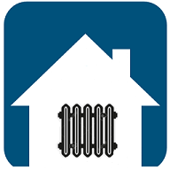

# ioBroker.HeatingControl

**Dieser Adapter nutzt die Sentry-Bibliotheken, um Ausnahmen und Codefehler automatisch an die Entwickler zu melden.** Weitere Details und Informationen zum Deaktivieren der Fehlerberichterstattung finden Sie in [der Sentry-Plugin-Dokumentation](https://github.com/ioBroker/plugin-sentry#plugin-sentry) ! Die Sentry-Berichterstattung wird ab js-controller 3.0 verwendet.

**Wenn es Ihnen gefällt, erwägen Sie bitte eine Spende:**

## Dokumentation

**Ich suche Unterstützung bei der Erstellung/Aktualisierung der Benutzerdokumentation und der FAQs. Bei Interesse bitte melden.**

## Übersetzung

Der Adapter wird mithilfe von Weblate übersetzt, einem webbasierten Tool, das die Übersetzung für Entwickler und Übersetzer gleichermaßen vereinfacht. [Beteiligen Sie sich am ioBroker-Adapterprojekt.](https://weblate.iobroker.net/engage/adapters/?utm_source=widget)

[Klicken Sie hier, um direkt zu den Übersetzungen zu gelangen.](https://weblate.iobroker.net/projects/adapters/heatingcontrol/)

## Adapter zur Steuerung Ihres Heizsystems.

Merkmale:

- Die Solltemperaturen aller Thermostate gemäß Zeitplänen steuern
- Konfigurieren Sie mehrere Heizperioden für jeden Tag und jede Nacht.
- Unterstützt alle Arten von Thermostaten (Voraussetzung: Er muss in ioBroker verfügbar sein).
- Homematic-Geräte-Automatikerkennung
- unterstützt mehrere Profile
- Besteht keine direkte Verbindung zwischen Thermostat und Stellantrieb, kann der Stellantrieb direkt aus dem Adapter herausgeschaltet werden.
- Aktuell wird der Aktor direkt abgeschaltet, sobald die Solltemperatur erreicht ist. Sobald die Solltemperatur unter die Isttemperatur sinkt, schaltet sich der Aktor wieder ein. (Zu erledigen: verbesserte Steuerung implementieren)
- Eine unbegrenzte Anzahl von Thermostaten, Aktoren und Sensoren pro Raum wird unterstützt.
- Thermostat, Stellantrieb und Sensor können raumweise automatisch erkannt werden (nur bei Homematic-Geräten). Hierfür wird die Funktion (z. B. „Heizung“) verwendet.
- Räume können in der Administrationsoberfläche ausgeschlossen werden, wenn ein Raum zwar ein Thermostat enthält, aber nicht gesteuert werden soll.
- Der Sensor dient zur Reduzierung der Zieltemperatur (z. B. bei geöffnetem Fenster); optional mit SensorDelay.
- Schnittstelle zum Feiertag-Adapter oder anderen Adaptern zur Erkennung von Feiertagen. Ein Feiertag kann ein normaler Wochentag oder ein Sonntag sein. (Administratoreinstellung)
- manuelle Temperaturüberschreibung für eine bestimmte Zeit
- vordefinierte Heizperiode
- Änderungen vom Thermostat übernehmen (optional)
- Die Visualisierung mit [Pittini](https://github.com/Pittini/iobroker-heatingcontrol-vis) wird unterstützt. Vielen Dank!
- Vis-2-Unterstützung mit [vis-2-widgets-weather-and-heating](https://github.com/rg-engineering/ioBroker.vis-2-widgets-weather-and-heating)

[Häufig gestellte Fragen](https://github.com/rg-engineering/ioBroker.heatingcontrol/blob/master/doc/FAQ.md)

## Installation

## Einstellungen

### hauptsächlich

- Funktion = Funktion zur Erkennung von Thermostaten, Aktoren und Sensoren pro Raum. Es handelt sich um eine der Systemaufzählungen.
- Pfad zum Feiertag-Adapter = Wenn Sie den Feiertag-Adapter verwenden möchten, um den heutigen Feiertag automatisch zu erkennen, geben Sie hier den Pfad an (z. B. festage.0).
- Verwendeter Sensor = Wenn Sie Fenstersensoren haben und die Zieltemperatur bei geöffnetem Fenster senken möchten, aktivieren Sie diese Option.
- Verwendete Aktoren = wenn Sie Aktoren direkt vom Adapter aus steuern möchten. Nur für den Fall, dass keine direkte Verbindung zwischen Thermostat und Aktor besteht.
- Aktuatoren verwenden, wenn keine Heizperiode aktiv ist = nur gültig mit Aktuatoren. Definiert, wie Aktuatoren eingestellt werden, wenn keine Heizperiode aktiv ist.
- Stellantriebe verwenden, wenn kein Thermostat vorhanden ist = gilt nur mit Stellantrieben. Wenn Sie Räume ohne Thermostat, aber mit Heizungsstellantrieb haben, können Sie diese dauerhaft ein- oder ausschalten.

### Profil

- Profiltyp = Es werden drei verschiedene Profiltypen unterstützt (Montag - Sonntag, oder Montag - Freitag und Samstag/Sonntag oder jeden Tag).
- Anzahl der Profile = Falls Sie mehr benötigen, erhöhen Sie diesen Wert. Anschließend können Sie das gewünschte Profil auswählen.
- Anzahl der Perioden = Legt fest, wie viele Tagesabschnitte mit unterschiedlichen Temperaturen benötigt werden. Je mehr Perioden Sie festlegen, desto mehr Datenpunkte werden erzeugt. Es empfiehlt sich, einen niedrigen Wert zu verwenden (z. B. 5).
- „Feiertage wie Sonntage = Wenn Sie an Feiertagen wie Sonntagen Zieltemperaturen festlegen möchten, aktivieren Sie diese Option. Ansonsten gelten für Feiertage die gleichen Einstellungen wie an normalen Tagen.“
- Heizperiode = Start- und Enddatum der Heizperiode. Wird verwendet, um „HeizperiodeAktiv“ festzulegen.

### Geräte

- Wählen Sie zuerst einen Raum aus und aktivieren Sie ihn.
- Im Folgenden finden Sie alle Konfigurationen für das Zimmer.

### Raumkonfiguration

- Hier können Sie Objekt-IDs für Thermostate, Aktoren und Sensoren überprüfen und festlegen.
- Sie können neue Thermostate, Aktoren oder Sensoren manuell hinzufügen. Drücken Sie dazu einfach die Schaltfläche „+“. Anschließend erscheint eine leere Zeile, die Sie ausfüllen müssen. Über die Schaltfläche „Bearbeiten“ öffnen Sie eine Liste der verfügbaren Geräte im System.
- Thermostate: \*\* Name, Zieltemperatur-OID und aktuelle Temperatur-OID sollten eingestellt werden.
- Aktuatoren \*\* Name und OID für den Zustand sollten festgelegt werden
- Sensoren \*\* Name und OID für den aktuellen Zustand sollten festgelegt werden

## Datenpunkte

| DP-Name              | Beschreibung                                                                                                             |
| -------------------- | ------------------------------------------------------------------------------------------------------------------------ |
| Heizperiode Aktiv    | Wenn diese Option deaktiviert ist, werden die Profile nicht verwendet.                                                   |
| AktuellesProfil      | Aktuelles Profil auswählen (1 basiert, bedeutet, dass Profil 1 Datenpunkte unter heatingcontrol.0.Profiles.0 verwendet). |
| Letzter Programmlauf | zeigt den letzten Zeitpunkt an, an dem der Adapter ausgeführt wurde.                                                     |

### Temperaturabnahme / -anstieg

| DP-Name         | Beschreibung                                                           | Zieltemperatur für relative Abnahme                                                         | Zieltemperatur für absolute Abnahme                           |
| --------------- | ---------------------------------------------------------------------- | ------------------------------------------------------------------------------------------- | ------------------------------------------------------------- |
| Anwesende Gäste | Die Temperatur erhöhen, weil die Gäste es wärmer wünschen.             | Erhöhe die aktuelle Profiltemperatur um Profiles.0.room.relative.GuestIncrease              | set target to Profiles.0.room.absolute.GuestIncrease          |
| PartyNow        | „Die Temperatur senken, weil es heiß wird.“                            | Verringere die aktuelle Profiltemperatur um Profiles.0.room.relative.PartyDecrease          | set target to Profiles.0.room.absolute.PartyDecrease          |
| Gegenwärtig     | Wir sind anwesend; wenn wir nicht anwesend sind, sinkt die Temperatur. | Verringere die aktuelle Profiltemperatur um Profiles.0.room.relative.AbsentDecrease         | set target to Profiles.0.room.absolute.AbsentDecrease         |
| Urlaub          | Wir sind abwesend, daher verringert sich die Zahl auch am Wochenende.  | Verringere die aktuelle Profiltemperatur um Profiles.0.room.relative.VacationAbsentDecrease | set target to Profiles.0.room.absolute.VacationAbsentDecrease |
| KaminmodusAktiv | Die Temperatur sinkt, weil Sie einen Kamin benutzen.                   | Verringere die aktuelle Profiltemperatur um Profiles.0.room.relative.FireplaceModeDecrease  | set target to Profiles.0.room.absolute.FireplaceModeDecrease  |
|                 | wird automatisch zu einem einstellbaren Zeitpunkt zurückgesetzt        |                                                                                             |                                                               |

- Datenpunkte sind nur verfügbar, wenn „Allgemeine Profileinstellungen, Temperaturabsenkung“ aktiviert ist.
- In beiden Fällen wird nur eine Absenkung verwendet (bei der vorherigen Version des Adapters konnten mehrere Absenkungen verwendet werden).
- Im Szenario der absoluten Entfettung werden nur Zielwerte ungleich 0 °C verwendet. Wenn für einen bestimmten Raum keine Absenkung erforderlich ist, sollten die Absenkungswerte bei 0 °C belassen werden.

### keine Heizperiode

Es gibt drei Optionen.

- Wenn Sie die Option „Temperatur pro Raum fixieren“ auswählen, wird für jeden Raum ein neuer Datenpunkt in der Objektstruktur angezeigt. Hier können Sie eine feste Zieltemperatur festlegen, die gilt, wenn die Heizperiode nicht aktiv ist.
- Temperatur für alle Räume festlegen: Mit dieser Option können Sie eine Zieltemperatur für alle Räume festlegen, wenn die Heizperiode nicht aktiv ist.
- Bei dieser Option werden keine Daten an den Thermostat gesendet, wenn keine Heizperiode aktiv ist. Die Zieltemperatur bleibt vom letzten Zielwert erhalten, als die Heizperiode noch aktiv war. In diesem Fall und wenn Sie Stellantriebe vom Adapter verwenden, können Sie festlegen, wie die Stellantriebe eingestellt werden sollen (aus, ein oder unverändert).

## andere

- HolidayPresent / PublicHolidyToday Wenn Sie im Admin-Bereich „Holiday Present like Sunday“ oder „Public Holiday like Sunday“ aktivieren, wird das Profil für Sonntag verwendet, wenn der Adapter darüber informiert wird, dass heute ein Feiertag ist oder Sie sich im Urlaub zu Hause befinden.

### Fenster offen

Wenn die Option „Sensoren verwenden“ aktiviert ist und Sensoren für einen Raum konfiguriert sind, dann

- Die aktuelle Profiltemperatur wird bei geöffnetem Fenster (true) um den Wert von Profiles.0.room.WindowOpenDecrease verringert, falls eine relative Verringerung konfiguriert ist.
- Setze das Ziel auf Profiles.0.room.absolute.WindowOpenDecrease, wenn das Fenster geöffnet ist (true), falls die absolute Verkleinerung konfiguriert ist.

Optional kann eine Verzögerung verwendet werden. Wenn das Fenster nur kurz geöffnet ist, kann die Verzögerung des Sensors verhindern, dass der Wert innerhalb kürzester Zeit wieder auf Normalniveau sinkt.

## ikale Unterstützung

Sie können Ihren Kalender oder andere Datenpunkte verwenden, um Datenpunkte im Adapter zu ändern. Konfigurieren Sie einfach Ereignisse aus iCal oder anderen Datenpunkten im Adminbereich. Unterstützt werden:

| Datenpunkt                          | Beschreibung                                                                                                                      |
| ----------------------------------- | --------------------------------------------------------------------------------------------------------------------------------- |
| Heizungssteuerung.0.Vorhanden       | Setzen Sie den Wert auf „true“ (bei einem booleschen Wert) oder auf eine Zahl, die größer als der Grenzwert ist (bei einer Zahl). |
| Heizungssteuerung.0.Urlaubsgeschenk | Setzen Sie es auf „wahr“, wenn Sie im Urlaub zu Hause sind.                                                                       |
| Heizungssteuerung.0.UrlaubAbwesend  | Setzen Sie diese Option auf „Wahr“, wenn Sie im Urlaub nicht zu Hause sind.                                                       |
| Heizungssteuerung.0.Anwesende Gäste | Setzen Sie den Wert auf „true“ (bei einem booleschen Wert) oder auf eine Zahl, die größer als der Grenzwert ist (bei einer Zahl). |
| heatingcontrol.0.PartyNow           | Setzen Sie den Wert auf „true“ (bei einem booleschen Wert) oder auf eine Zahl, die größer als der Grenzwert ist (bei einer Zahl). |

Hinweis: Mit numerischen Datenpunkten könnten Sie zählen, wie viele Personen sich im Haus befinden und dann entscheiden, z. B. ob wir genug für eine Party haben...

## Änderungen der Thermostateinstellungen

Viele Nutzer wünschten sich die Möglichkeit, die Einstellungen vom Thermostat auf den Adapter zu übertragen. Nun stehen vier Optionen zur Verfügung:

| Option                       | Beschreibung                                                                                                                                                                                     |
| ---------------------------- | ------------------------------------------------------------------------------------------------------------------------------------------------------------------------------------------------ |
| NEIN                         | Änderungen des Thermostats werden ignoriert                                                                                                                                                      |
| als Überschreibung           | Änderungen vom Thermostat werden als Überschreibung interpretiert; die Überschreibungszeit muss im Voraus in heatingcontrol.0.Rooms.RoomName.TemperaturOverrideTime festgelegt werden.           |
|                              | Wenn keine Überschreibungszeit festgelegt ist, wird die Überschreibung nicht ausgeführt.                                                                                                         |
| als neue Profileinstellung   | Die vom Thermostat eingestellten Änderungen werden als Zieltemperatur für den aktuellen Profilzeitraum verwendet.                                                                                |
| bis zum nächsten Profilpunkt | Änderungen der Thermostateinstellungen werden bis zum nächsten Profilpunkt als Zieltemperatur übernommen. Dies ist ein manueller Modus, daher werden nur Fenstersensoren verwendet. Alle anderen |
|                              | Erhöhungen/Verringerungen werden ignoriert. In jedem Raum befindet sich ein Datenpunkt, um den manuellen Modus vor Erreichen des nächsten Profilpunkts zu deaktivieren.                          |

## Überschreibung verlängern, wenn sich die Temperatur ändert

Das Standardverhalten bei der Überschreibung ist, dass sich die Überschreibungszeit bei einer Temperaturänderung nicht ändert. Wenn Sie die Überschreibung beispielsweise für 20 Minuten bei 25 °C starten und nach 15 Minuten auf 28 °C wechseln, werden die 28 °C nur für die letzten 5 Minuten verwendet. Mit dieser Option wird die Überschreibung jedes Mal neu gestartet, wenn Sie die Überschreibungstemperatur ändern. Im obigen Beispiel würden die 28 °C dann 20 Minuten lang verwendet, was zu 15 Minuten bei 25 °C und 20 Minuten bei 28 °C führt.

## Überschreibungsmodus

Im Adminbereich können zwei Modi für alle Räume eingestellt werden.

- Diese zeitgesteuerte Funktion ist bekannt und verwendet eine Temperatur und eine Dauer. Die angegebene Temperatur wird für die Dauer verwendet, anschließend wird die Zieltemperatur im Automatikmodus wieder auf den vorherigen Wert zurückgesetzt.
- Bis zum nächsten Profilpunkt ist dies eine neue Funktion. Hier kann die Temperatur bis zum nächsten Profilpunkt überschrieben werden. Die Dauer wird ignoriert, muss aber ungleich null sein!

## Thermostat reagiert auf die Meldung "Fenster ist offen"

Manche Thermostate können die Meldung „Fenster geöffnet“ selbstständig verarbeiten. In diesen Fällen wird eine direkte Verbindung zwischen Fenstersensor und Thermostat konfiguriert, und der Thermostat reduziert die Zieltemperatur automatisch, sobald ein Fenster geöffnet wird. In Kombination mit der Option „Änderungen vom Thermostat verwenden“ / „Bis zum nächsten Profilpunkt“ führt dies zu einem unerwarteten manuellen Zustand. In dieser Situation würde die reduzierte Temperatur bis zum nächsten Profilpunkt verwendet. Der Adapter kann dieses Verhalten jedoch steuern. Sie müssen die Option „Thermostat verarbeitet ‚Fenster geöffnet‘“ aktivieren und können die Fenstersensoren auch im Adapter konfigurieren. Wenn ein Fenster geöffnet wird, wartet der Adapter maximal 3 Sekunden auf eine neue Zieltemperatur vom Thermostat. Empfängt er innerhalb dieser Zeit eine neue Zieltemperatur, wird diese als reduzierte absolute Temperatur verwendet. Der Status ändert sich dann zu „Fenster automatisch geöffnet“. Sobald das Fenster geschlossen wird, wechselt der Status zurück zu „Automatisch“, und der Thermostat stellt die ursprüngliche Zieltemperatur wieder ein. **Achtung:** Verwenden Sie in diesem Fall nicht die Sensoröffnungsverzögerung. Wenn Sie diese verwenden, tritt das Ereignis „Fenster geöffnet“ erst nach dem Empfang der Zieltemperatur vom Thermostat auf. Dies führt zu einem manuellen Zustand.

## Kopierperiode und Kopierprofil

`heatingcontrol.0.Profiles.1.CopyProfile
heatingcontrol.0.Profiles.1.Room.CopyProfile`

Und

`heatingcontrol.0.Profiles.1.Küche.Fri.CopyPeriods`

Mit „Profil kopieren“ wird der gesamte Inhalt des Profils, in dem die Schaltfläche gedrückt wird, in das nächste Profil kopiert. Im obigen Beispiel befindet sich die Schaltfläche in Profil 1. Die Schaltfläche kopiert alles von Profil 1 nach Profil 2. Wenn Sie nur einen Raum kopieren möchten, drücken Sie die Schaltfläche in diesem Raum.

Die Funktion „Perioden kopieren“ ist pro Tag oder Montag bis Freitag pro Raum verfügbar. Dadurch werden die Perioden in den nächsten Abschnitt kopiert. Im obigen Beispiel kopiert die Funktion „Perioden kopieren“ alle Perioden vom Freitag im Küchenraum in die Perioden vom Samstag im Küchenraum. Sie können also beispielsweise im Profil „Jeden Tag separat“ einstellen und die Perioden von Montag bis Sonntag kopieren.

## Wartungsmodus

zu tun

## Kaminmodus

zu tun

## Aktuatorhandhabung

zu tun

Umschaltung zwischen linearem und linearem Betrieb mit Hysterese

Beschreibe zwei neue Datenpunkte: heatingcontrol.0.Rooms.TestRaum.Regulator.HysteresisOffOffset und heatingcontrol.0.Rooms.TestRaum.Regulator.HysteresisOnOffset.

## erweiterte Aktuatorhandhabung

prüft, ob der Wert korrekt gesetzt wurde und eine Bestätigung (ack) vorliegt, andernfalls wiederholt es den Vorgang...

zu tun

## EVU Sperrzeit / PowerInterruption

Sobald die Sperrzeit des Energieversorgers erreicht ist, werden alle Aktoren abgeschaltet und nach Ablauf der Sperrzeit wieder eingeschaltet. Der Status ändert sich zu „EVU Sperrzeit“ / „Stromunterbrechung“. Ziel: Gezieltes Ab- und Wiedereinschalten der elektrischen Heizungen, um die Belastung der Schütze und die Einschaltströme zu minimieren. Konfiguration: Start- und Endzeit der EVU-Sperrzeit; mehrere Zeiträume können konfiguriert werden.

## Probleme und Funktionswünsche

- Falls Sie auf Fehler stoßen oder Funktionswünsche für diesen Adapter haben, erstellen Sie bitte ein Issue im GitHub-Issue-Bereich des Adapters auf [GitHub](https://github.com/rg-engineering/ioBroker.heatingcontrol/issues) . Wir freuen uns über jedes Feedback, das zur Verbesserung des Adapters beiträgt.

## bekannte Probleme

### Adapter mit Homematic IP Fußbodenheizungsaktor HmIP-FAL230-C10 – 10fach, 230 V

Es scheint, dass der HmIP-FAL230-C10 in Kombination mit diesem Adapter nicht direkt als Stellantrieb verwendet werden kann. Bei Verwendung mit Homematic-Thermostaten sollte der HmIP-FAL230-C10 jedoch funktionieren. Siehe auch [Forum.](https://forum.iobroker.net/topic/22579/test-adapter-heatingcontrol-v1-0-x/1553)

### Fensteröffnungsfunktion der HM-Thermostate

HM-Thermostate verfügen über eine Fensteröffnungsfunktion in zwei Varianten: zum einen durch Temperaturabfallerkennung und zum anderen in Verbindung mit einem Fensterkontakt. Diese Funktion bewirkt, dass der Thermostat beim Öffnen des Fensters in den manuellen Modus schaltet. Idealerweise sollte diese Funktion deaktiviert werden, um die Funktionalität des Thermostats nicht zu beeinträchtigen. Nutzt der Thermostat Informationen vom Fenstersensor, sollte die Option „Thermostat erkennt offenes Fenster“ aktiviert werden.

Wenn der Adapter abstürzt oder ein anderer Codefehler auftritt, wird diese Fehlermeldung, die auch im ioBroker-Protokoll erscheint, an Sentry übermittelt. All dies hilft mir, fehlerfreie Adapter bereitzustellen, die praktisch nie abstürzen.

## Changelog

<!--
  Placeholder for the next version (at the beginning of the line):
  ### **WORK IN PROGRESS**
--->

### **WORK IN PROGRESS**
* (René) dependencies updated

### 3.2.0 (2026-06-03)
* (copilot) Adapter requires node.js >= 22 now
* (René) see issue #810: HeatingPeriod configurable via datapoint (like in admin) as option
* (René) dependencies updated

### 3.1.4 (2026-04-26)
* (Eistee82 + Claude Opus 4.6) fix visualization step width: selecting 0.5°C stored 1.5 instead of 0.5 (#785)
* (Eistee82 + Claude Opus 4.6) fix admin UI field name mismatch: ExtHandlingRepTime renamed to ExtHandlingActorRepTime (#787)
* (Eistee82 + Claude Opus 4.6) fix off-by-one error in thermostat ID assignment (#788)
* (Eistee82 + Claude Opus 4.6) add guard for GetRoomId returning -1 to prevent negative array index (#789)
* (Eistee82 + Claude Opus 4.6) add null checks for getStateAsync results in SaveProfile (#790)
* (Eistee82 + Claude Opus 4.6) fix copy-paste error: UseFixHeatingPeriod had label UseFireplaceMode (#791)
* (Eistee82 + Claude Opus 4.6) fix typo in types.d.ts: strin → string (#792)
* (Eistee82 + Claude Opus 4.6) fix onChange field name mismatch for customized notification window close (#793)
* (Eistee82 + Claude Opus 4.6) fix type mismatch: notificationsType should be string not number (#794)
* (Eistee82 + Claude Opus 4.6) add missing Discord notification defaults to io-package.json (#795)
* (Eistee82 + Claude Opus 4.6) add missing config key defaults to io-package.json (#796)
* (Eistee82 + Claude Opus 4.6) fix hysteresis debug log showing wrong calculation (+ instead of -) (#798)
* (Eistee82 + Claude Opus 4.6) fix duplicate variable in hysteresis error message (#799)
* (Eistee82 + Claude Opus 4.6) remove dead code: identical if/else branches in notification functions (#800)
* (Eistee82 + Claude Opus 4.6) fix wrong typeof in error message in support_tools.js (#802)
* (Eistee82 + Claude Opus 4.6) fix package.json bugs URL missing /issues suffix (#803)
* (Eistee82 + Claude Opus 4.6) simplify redundant null check in main.js (#805)
* (Eistee82 + Claude Opus 4.6) fix typo in error message: userTage → userTag (#808)

### 3.1.3 (2026-04-11)
* (René) fix in migrate data: wait, until room list is available and check if room list is empty, otherwise do not migrate data to avoid removing rooms
* (René) changelog_old.md added

### 3.1.1 (2026-04-08)
* (René) some logs in migrate data
* (René) issue #781: fix upload configuration

### 3.1.0 (2026-03-16)
* (softwarecrash) Add optional window-open thermostat priority
* (René) changes requested by adapter checker
* (René) dependencies updated

[Older changelogs can be found there](https://github.com/rg-engineering/ioBroker.heatingcontrol/blob/master/CHANGELOG_OLD.md)

## License
MIT License

Copyright (c) 2019-2026 René G. <info@rg-engineering.eu>

Permission is hereby granted, free of charge, to any person obtaining a copy
of this software and associated documentation files (the "Software"), to deal
in the Software without restriction, including without limitation the rights
to use, copy, modify, merge, publish, distribute, sublicense, and/or sell
copies of the Software, and to permit persons to whom the Software is
furnished to do so, subject to the following conditions:

The above copyright notice and this permission notice shall be included in all
copies or substantial portions of the Software.

THE SOFTWARE IS PROVIDED "AS IS", WITHOUT WARRANTY OF ANY KIND, EXPRESS OR
IMPLIED, INCLUDING BUT NOT LIMITED TO THE WARRANTIES OF MERCHANTABILITY,
FITNESS FOR A PARTICULAR PURPOSE AND NONINFRINGEMENT. IN NO EVENT SHALL THE
AUTHORS OR COPYRIGHT HOLDERS BE LIABLE FOR ANY CLAIM, DAMAGES OR OTHER
LIABILITY, WHETHER IN AN ACTION OF CONTRACT, TORT OR OTHERWISE, ARISING FROM,
OUT OF OR IN CONNECTION WITH THE SOFTWARE OR THE USE OR OTHER DEALINGS IN THE
SOFTWARE.