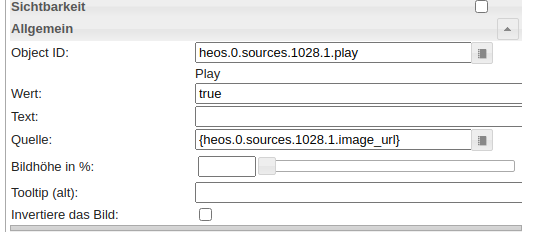
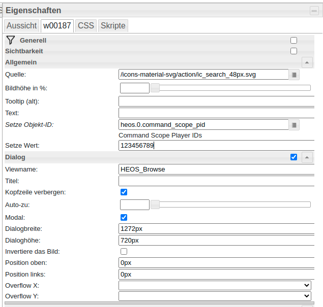
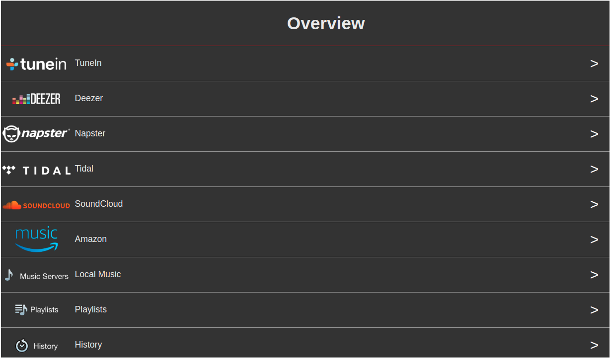

# ioBroker.heos

Der Adapter ermöglicht die Steuerung von HEOS über ioBroker.

## Haftungsausschluss

HEOS, DENON und Marantz sind Marken von D\&M Holdings Inc. Die Entwickler dieses Moduls werden in keiner Weise von D\&M Holdings Inc. oder deren Tochtergesellschaften, Logos oder Marken unterstützt oder sind mit diesen verbunden.

## Referenz

Die verwendete HEOS-API ist hier dokumentiert: <https://rn.dmglobal.com/euheos/HEOS_CLI_ProtocolSpecification_2021.pdf>

## Netzwerkanforderungen

Das SSDP-Protokoll dient der Spielersuche. UPnP benötigt Multicast-Zugriff auf die IP-Adresse 239.255.255.250:1900 sowie die entsprechenden IGMP-Nachrichten. Der Quellport für den Empfang von SSDP-Nachrichten kann in den Adaptereinstellungen konfiguriert werden (Standardeinstellung: ).`0` (Das bedeutet, dass der Port automatisch ausgewählt wird.) Weitere Details: <https://support.denon.com/app/answers/detail/a_id/4717/~/network-requirements-for-heos> Für den API-Zugriff auf die HEOS Player verwendet der Adapter den Port`1255` Die

## Konfiguration

- **AutoPlay** : Spielt Musik automatisch ab, sobald der Player verbunden ist oder die Stummschaltung aufgehoben wird. Kann global in den Einstellungen konfiguriert werden. Wenn die Funktion global aktiviert ist, kann sie für einen bestimmten Player deaktiviert werden.`auto_play` Die
- **Befehlsbereich** : Definiert, für welche Spieler der Befehl gilt.`scope/[cmd]` Der Befehlsstatus wird gesendet an: Alle Spieler, alle führenden Spieler oder alle Spieler-IDs (PIDs) im durch Kommas getrennten Status.`heos.0.command_scope_pid`
- **Stummschaltung per Regex** : In den Einstellungen können Sie eine Funktion aktivieren, die den Player basierend auf einem Regex-Treffer in den Songinformationen stummschaltet. Dies kann verwendet werden, um Werbung automatisch stummzuschalten. Für Spotify können Sie beispielsweise folgenden Regex verwenden:`spotify:ad:|Advertisement` Die
- **ignore\_broadcast\_cmd** : Dieser Player-Status konfiguriert, ob der Player Befehle an alle Player ignorieren soll, z. B. player/set\_mute\&state=on oder das Drücken der Wiedergabetaste für Voreinstellungen/Wiedergabelisten.

## Staaten und ihre Bedeutungen

### Befehlszustand

Der HEOS-Player lässt sich über verschiedene Player-Zustände steuern. Für eine erweiterte Player-Steuerung steht der Befehlszustand zur Verfügung. Zum einen gibt es einen globalen Befehlszustand (heos.0.command), mit dem sich der gesamte Adapter oder mehrere Player mit einem einzigen Befehl steuern lassen. Zum anderen existiert für jeden Player ein eigener Befehlszustand.

#### HEOS-Befehlsstatus (heos.0.command)

- `system/connect` : Versuchen Sie, eine Verbindung zu HEOS herzustellen
- `system/disconnect` : Verbindung zu HEOS trennen
- `system/reconnect` : Trennen und Verbinden
- `system/load_sources` : Quellen neu laden
- `system/reboot` : Verbundenen Spieler neu starten
- `system/reboot_all` : Alle Spieler neu starten
- `group/set_group?pid=<pid1>,<pid2>,...` : Gruppe mit der Liste der Spieler-IDs festlegen, z. B.`group/set_group?pid=12345678,12345679` Die
- `group/set_group?pid=<pid1>` : Vorhandene Gruppe löschen, z. B. "group/set\_group?pid=12345678"
- `group/ungroup_all` : Alle Gruppen löschen
- `group/group_all` Alle Spieler in einer Gruppe zusammenfassen
- `player/[cmd]` Sende den Befehl an alle Spieler. Beispiel: player/set\_mute\&state=on
- `leader/[cmd]` Sende den Befehl an alle führenden Spieler. Beispiel: leader/set\_mute\&state=on
- `scope/[cmd]` Sende den Befehl an den konfigurierten Bereich: alle Spieler, führende Spieler oder durch Komma getrennte Spieler-PIDs in scope\_pids
- `...` Alle anderen Befehle werden versucht, an HEOS zu senden (Einzelheiten finden Sie im HEOS API-PDF).

#### Spielerbefehlsstatus (heos.0.players.123456789.command)

Hinweis: Mehrere Befehle sind möglich, wenn sie durch einen senkrechten Strich getrennt werden, z. B. set\_volume\&level=20|play\_preset\&preset=1

- `set_volume?level=0|1|..|100` : Stellen Sie die Lautstärke des Players ein.
- `set_play_state?state=play|pause|stop` Spielerstatus festlegen
- `set_play_mode?repeat=on_all|on_one|off&shuffle=on|off` : Wiederholungs- und Zufallswiedergabemodus einstellen
- `set_mute?state=on|off` : Spieler stumm schalten
- `volume_down?step=1..10` Geringere Lautstärke
- `volume_up?step=1..10` Lautstärke erhöhen
- `play_next` Nächstes Spiel abspielen
- `play_previous` : Vorheriges Spiel abspielen
- `play_preset?preset=1|2|..|n` : Voreinstellung n abspielen
- `play_stream?url=url_path` : URL-Stream abspielen
- `add_to_queue?sid=1025&aid=4&cid=[CID]` Wiedergabeliste mit \[CID] auf dem Player abspielen (Hilfe: 1 – Jetzt abspielen; 2 – Nächstes abspielen; 3 – Am Ende hinzufügen; 4 – Ersetzen und abspielen)

### Voreinstellungen & Wiedergabelisten

Jede Quelle, z. B. Voreinstellung/Favorit oder Wiedergabelisten, befindet sich im Ordner „Quellenstatus“ (`heos.0.sources` Ihre Voreinstellungen/Favoriten finden Sie im Unterordner mit der ID 1028 und die Wiedergabelisten im Unterordner mit der ID 1025. Der Adapter erstellt Ihre individuellen Voreinstellungen und Wiedergabelisten zunächst nicht, da Sie ein Update auslösen müssen, indem Sie die folgenden Zustände auf „true“ setzen:

- Voreinstellungen/Favoriten:`heos.0.sources.1028.browse`
- Wiedergabelisten:`heos.0.sources.1025.browse` Anschließend erstellt der Adapter die Zustände für die Voreinstellungen oder Wiedergabelisten, sodass Sie die Voreinstellung problemlos auf allen Playern abspielen können.

### Bildfarbenextraktion

Mit Version 1.7.6 werden die markanten Farben des Songcovers extrahiert und in drei neuen Player-Zuständen gespeichert:

- **current\_image\_color\_palette** : Von node-vibrant ausgewählte, prominente Farben.
- **current\_image\_color\_background** : Die Farbe mit der größten Populationsdichte im Bild. Kann als Hintergrundfarbe für die Spielersteuerung in VIS verwendet werden.
- **current\_image\_color\_foreground** : Die Farbe mit der zweitgrößten Population im Bild und einem guten Kontrast zum Hintergrund. Kann als Textfarbe für die Spielersteuerung in VIS verwendet werden.

## Suchen

Die Suchfunktion funktioniert nicht bei allen Anbietern. Spotify und Amazon Music unterstützen die Suchfunktion.

## Sag es

[Der SayIt-Adapter](https://github.com/ioBroker/ioBroker.sayit) wird unterstützt.

## Material UI

[Der Material UI Adapter](https://github.com/ioBroker/ioBroker.material) wird unterstützt.

## VIS

### Installation

- Erstellen Sie die folgenden Zeichenkettenzustände:
  - 0\_userdata.0.heos.queue\_pid
  - 0\_userdata.0.heos.queue\_html
  - 0\_userdata.0.heos.browse\_result\_html

### Spieleransicht

- Öffnen Sie die Datei: [player\_view.json](https://github.com/withstu/ioBroker.heos/blob/main/docs/vis/views/player_view.json)
- Ersetzen Sie 123456789 durch die Spieler-PID.
- Ansicht in VIS importieren

### Voreinstellungen

- Klicken Sie auf die Schaltfläche`heos.0.sources.1028.browse` Voreinstellungen laden
- Öffnen Sie die Datei: [presets\_view.json](https://github.com/withstu/ioBroker.heos/blob/main/docs/vis/views/presets_view.json)
- Ansicht in VIS importieren

### Warteschlange

- Warteschlangen-Widget: [queue\_player\_widget.json](https://github.com/withstu/ioBroker.heos/blob/main/docs/vis/views/queue_player_widget.json)
- Warteschlangenansicht: [queue\_view.json](https://github.com/withstu/ioBroker.heos/blob/main/docs/vis/views/queue_view.json)
- Skript zur Generierung des HTML-Codes für die Warteschlange: [queue.js](https://github.com/withstu/ioBroker.heos/blob/main/docs/vis/scripts/queue.js)

### Quellen durchsuchen

- Browse-Widget: [browse\_player\_widget.json](https://github.com/withstu/ioBroker.heos/blob/main/docs/vis/views/browse_player_widget.json)
- Browseransicht: [browse\_view.json](https://github.com/withstu/ioBroker.heos/blob/main/docs/vis/views/browse_view.json)
- Browse-HTML-Generierungsskript: [browse.js](https://github.com/withstu/ioBroker.heos/blob/main/docs/vis/scripts/browse.js)

Alternativ können Sie das Skript von Uhula verwenden: <https://forum.iobroker.net/post/498779>

## Changelog
<!--
	Placeholder for the next version (at the beginning of the line):
	### **WORK IN PROGRESS**
-->
### 3.2.2 (2026-08-19)
* (withstu) Fix repository checker findings

### 3.2.1 (2026-08-19)
* (withstu) Package update
* (withstu) Improve number casting

### 3.2.0 (2026-08-12)
* (withstu) add flag to disable SSDP discovery
* (withstu) fixing iobroker checks

### 3.1.0 (2026-07-28)
* (withstu) improve error handling for sign in if webservice unreachable

### 3.0.5 (2026-07-28)
* (copilot) Adapter requires node.js >= 22 now
* (withstu) improve error handling for sign in if webservice unreachable

[Older changelogs can be found there](https://github.com/withstu/ioBroker.heos/blob/main/CHANGELOG_OLD.md)

## License
MIT License

Copyright (c) 2025-2026 withstu <withstu@gmx.de>

derived from https://forum.iobroker.net/topic/10420/vorlage-denon-heos-script by Uwe Uhula
TTS derived from https://github.com/ioBroker/ioBroker.sonos

Permission is hereby granted, free of charge, to any person obtaining a copy
of this software and associated documentation files (the "Software"), to deal
in the Software without restriction, including without limitation the rights
to use, copy, modify, merge, publish, distribute, sublicense, and/or sell
copies of the Software, and to permit persons to whom the Software is
furnished to do so, subject to the following conditions:

The above copyright notice and this permission notice shall be included in all
copies or substantial portions of the Software.

THE SOFTWARE IS PROVIDED "AS IS", WITHOUT WARRANTY OF ANY KIND, EXPRESS OR
IMPLIED, INCLUDING BUT NOT LIMITED TO THE WARRANTIES OF MERCHANTABILITY,
FITNESS FOR A PARTICULAR PURPOSE AND NONINFRINGEMENT. IN NO EVENT SHALL THE
AUTHORS OR COPYRIGHT HOLDERS BE LIABLE FOR ANY CLAIM, DAMAGES OR OTHER
LIABILITY, WHETHER IN AN ACTION OF CONTRACT, TORT OR OTHERWISE, ARISING FROM,
OUT OF OR IN CONNECTION WITH THE SOFTWARE OR THE USE OR OTHER DEALINGS IN THE
SOFTWARE.