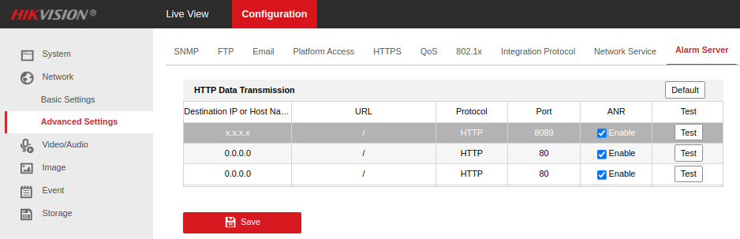

# IoBroker.hikvision-alarmserver
**Tests:** 

## Hikvision Alarm Server-Adapter für ioBroker
Ein Adapter zum Empfangen von Alarmen/Ereignissen, die von Hikvision-Kameras gesendet werden.

Getestet mit Hikvision-Modellen:

- DS-2CD2043G2-I
- DS-2CD2143G2-I
- DS-2DE2A404IW-DE3
- DS-2DE3A404IW-DE/W

Erfolgs-/Fehler-/Fehlerberichte sind willkommen, wenn Sie ein Modell haben, das nicht in dieser Liste enthalten ist.

## Verwendung
Die Adapterinstanz erstellt einen booleschen Zustand für jede gemeldete Kombination aus Kamera/Ereignistyp. Kameras werden anhand der MAC-Adresse identifiziert (begrenzt durch die von der Kamera bereitgestellten Informationen).

Es scheint, dass Kameras jede Sekunde wiederholt Ereignisse ausgeben, wenn diese Ereignisse noch gültig sind, aber keine Nachricht gesendet wird, um sie zu löschen. Aus diesem Grund löscht der Adapter automatisch Ereignisse, die länger als 5 Sekunden nicht erneut gemeldet wurden.

## Aufbau
### IoBroker
Wählen Sie in der Adapterkonfiguration einen freien Port aus, auf dem der Adapter lauschen soll (standardmäßig 8089).

### Vor der Kamera
Besuchen Sie die Konfigurationsseite Ihrer Kamera(s) und definieren Sie die IP-/Host- und Porteinstellungen von ioBroker:

Stellen Sie sicher, dass die Verknüpfung in den Ereignissen, die Sie ioBroker melden möchten, „Überwachungszentrum benachrichtigen“ enthält. Z.B:

## Changelog

<!--
  Placeholder for the next version (at the beginning of the line):
  ### **WORK IN PROGRESS**
-->

### 0.0.6 (2022-12-13)
-   (Robin Rainton) Handle multipart message payload ([#5](https://github.com/raintonr/ioBroker.hikvision-alarmserver/issues/5)).
-   (Robin Rainton) Handle payloads without XML declaration ([#7](https://github.com/raintonr/ioBroker.hikvision-alarmserver/issues/7).)

### 0.0.5 (2022-12-10)
-   (Robin Rainton) Drop colons from device IDs.

### 0.0.2
-   (Robin Rainton) initial release.

## License
MIT License

Copyright (c) 2022 Robin Rainton <robin@rainton.com>

Permission is hereby granted, free of charge, to any person obtaining a copy
of this software and associated documentation files (the "Software"), to deal
in the Software without restriction, including without limitation the rights
to use, copy, modify, merge, publish, distribute, sublicense, and/or sell
copies of the Software, and to permit persons to whom the Software is
furnished to do so, subject to the following conditions:

The above copyright notice and this permission notice shall be included in all
copies or substantial portions of the Software.

THE SOFTWARE IS PROVIDED "AS IS", WITHOUT WARRANTY OF ANY KIND, EXPRESS OR
IMPLIED, INCLUDING BUT NOT LIMITED TO THE WARRANTIES OF MERCHANTABILITY,
FITNESS FOR A PARTICULAR PURPOSE AND NONINFRINGEMENT. IN NO EVENT SHALL THE
AUTHORS OR COPYRIGHT HOLDERS BE LIABLE FOR ANY CLAIM, DAMAGES OR OTHER
LIABILITY, WHETHER IN AN ACTION OF CONTRACT, TORT OR OTHERWISE, ARISING FROM,
OUT OF OR IN CONNECTION WITH THE SOFTWARE OR THE USE OR OTHER DEALINGS IN THE
SOFTWARE.