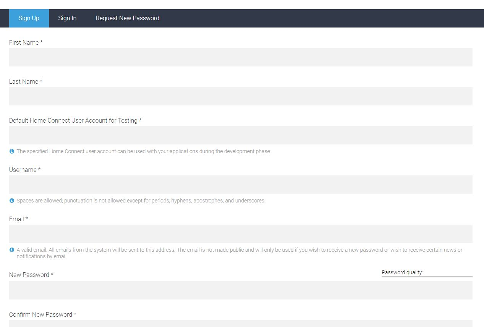

# IoBroker.homeconnect
## Voraussetzungen vor der Installation
Es muss mindestens Node.js Version 8 installiert sein!!

Für den Adapter wird eine ClientID benötigt. Nutzen Sie die Einstellungen um jeden Schritt der Registrierung zu erreichen.

## Anforderungen vor der Installation
Es muss mindestens Node.js Version 8 installiert sein!

Für den Adapter ist eine ClientID erforderlich. Verwenden Sie die Einstellungen für jeden Schritt, um sich zu registrieren.

<https://developer.home-connect.com>

Bei **Default Home Connect User Account for Testing** die E-Mail-Adresse angeben, mit der die Home-Connect-App registriert wurde, this WIRD später auch beim Authorization-Prozess benötigt.

Geben Sie bei **Default Home Connect Benutzerkonto zum Testen** die E-Mail-Adresse an, mit der die Home Connect App versendet werden soll.
registriert wurde, ist dies auch später im Autorisierungsprozess erforderlich.

Bei **Kontotyp** Individuell auswählen. Die restlichen Daten, sofern vorhanden, ergänzen (keine Ahnung, ob das geprüft WIRD).

Wählen Sie für **Kontotyp** Einzelperson aus. Fügen Sie die restlichen Daten hinzu, falls vorhanden (keine Ahnung, ob dies überprüft wird).

Dann auf **Bewerbungen** und anschließend auf **Bewerbung registrieren** gehen.

Gehen Sie dann zu **Bewerbungen** und dann zu **Bewerbung registrieren**.

Bei **Bewerbungs-ID** einen Namen für die Bewerbung eintragen, z.B. ioBroker. Bei **OAuth Flow** Device Flow selektieren.
**Home Connect Benutzerkonto zum Testen** kann leer bleiben. Bei **Success Redirect** eine URI eintragen, z.B. https://beispiel.com.
Dann Speichern und dann hat man die benötigte ClientID.

Geben Sie bei **Anwendungs-ID** einen Namen für die Anwendung ein, z. ioBroker. Mit **OAuth Flow** Device Flow auswählen.
**Home Connect Benutzerkonto zum Testen** kann leer bleiben. Geben Sie für **Success Redirect** einen URI ein, z. https://beispiel.com.
Dann speichern und Sie haben die benötigte ClientID.

##Konfiguration
In der Adapter-Config muss der Homeconnect App Benutzername und Passwort und die erstellte ClientID eingetragen werden.

## Benutzung
Mit den Zuständen in Befehlen kannst du das Programm stoppen, pausieren oder fortführen.

Mit den Zuständen in den Einstellungen kannst du das Gerät ein- oder ausschalten.

Change des States programmes.active.BSH_Common_Root_ActiveProgram führt zum Starten eines Programms

Ändern des Status programmes.s selected.BSH_Common_Root_SelectedProgram führt zum Auswählen des Programms oder der Optionen

If man checken möchte, ob ein Programm fertig ist muss

status.BSH_Common_Status_OperationState

auf den vollständigen Statusnamen übrprüft werden:

BSH.Common.EnumType.OperationState.Finished

Weitere Zustände sind noch:

"BSH.Common.EnumType.OperationState.Inactive": "Inaktiv", "BSH.Common.EnumType.OperationState.Ready": "Bereit", "BSH.Common.EnumType.OperationState.Run": "Ausführen", "BSH .Common.EnumType.OperationState.ActionRequired": "ActionRequired", "BSH.Common.EnumType.OperationState.Finished": "Fertig"

Oder ob ein Gerät geöffnet ist

"BSH.Common.EnumType.DoorState.Open": "Offen", "BSH.Common.EnumType.DoorState.Closed": "Geschlossen"

## Verwendungszweck
Mit den Zuständen in Befehlen können Sie ein Programm stoppen, pausieren und fortsetzen.
Mit den Zuständen in den Einstellungen können Sie das Gerät ein- oder ausschalten Ändern Sie den Wert von programmes.active.BSH_Common_Root_ActiveProgram führt zum Starten eines Programms Ändern Sie den Wert von programmes.s selected.BSH_Common_Root_SelectedProgram führt zur Auswahl eines Programms oder von Optionen

## Changelog

### 1.0.3

- Add manually login for SingleKey User
  
### 1.0.2

- Adapter complete rewriten. Includes a lot of Bugfixes
### 0.0.36

- fix for js.controller 3.3. Please delete the device in Objects manually

### 0.0.32 (29.12.2020)

- (Morluktom) bugfix for devices that are completely switched off (e.g. washing machine, dryer)

### 0.0.31

- (ta2k) fix pause start command

### 0.0.30 (10.05.2020)

- (ta2k) fix js controller 3 issues

### 0.0.27 (13.11.2019)

- (ta2k) improve option selecting

### 0.0.26 (04.11.2019)

- (ta2k) fix boolean settings

### 0.0.25 (08.09.2019)

- (ta2k) fix compact mode
- (ta2k) reduce query per minute to prevent too much request error

### 0.0.24 (08.09.2019)

- (ta2k) improve error messaging

### 0.0.22 (08.09.2019)

- (ta2k) improve error messaging

### 0.0.22 (26.07.2019)

- (ta2k) bugfixing

### 0.0.21 (12.07.2019)

- (ta2k) bugfixing

### 0.0.19 (30.06.2019)

- (ta2k) improve displaying long states, options and events

### 0.0.18 (26.06.2019)

- (ta2k) add error handling for stoping

### 0.0.17 (26.06.2019)

- (ta2k) make commands writeable

### 0.0.16 (26.06.2019)

- (ta2k) cleanup states after update

### 0.0.15 (24.06.2019)

- (ta2k) reconnect after token refresh

### 0.0.14 (18.06.2019)

- (ta2k) check for keep alive events

### 0.0.13 (18.06.2019)

- (ta2k) close event stream before reconnect

### 0.0.12 (18.06.2019)

- (ta2k) fix events lost after 12hr

### 0.0.11 (09.06.2019)

- (ta2k) fix set values and refresh available options after program select

### 0.0.10 (04.06.2019)

- (ta2k) add settings and commands, add options to available and fix bugs

### 0.0.9 (29.05.2019)

- (ta2k) clean up code and receive event notifications

### 0.0.8 (10.04.2019)

- (dna909) increase refreshTokenInterval

### 0.0.7 (03.04.2019)

- (TA2k) Improve refreshToken and add Register process in instance option

### 0.0.6 (09.01.2019)

- (dna909) Oven: add Option.FastPreHeat, Logging, query stream.type DISCONNECTED
- (tFaster) code format and cleanups,fixed devices data structure,renamed deviceArray to devices,
    added startInRelative for Oven

### 0.0.5 (28.11.2018)

- (dna909) add eventstream handling

### 0.0.4 (23.11.2018)

- (dna909) add event-listener

### 0.0.3 (14.11.2018)

- (dna909) query States and available programs

### 0.0.2 (08.11.2018)

- (dna909) OAuth2 Deviceflow-Authorization, enumerate connected appliances

### 0.0.1 (09.10.2018)

- (dna909) initial release

## License

The MIT License (MIT)

Copyright (c) 2020 dna909 <dna909@googlemail.com>, TA2k

Permission is hereby granted, free of charge, to any person obtaining a copy
of this software and associated documentation files (the "Software"), to deal
in the Software without restriction, including without limitation the rights
to use, copy, modify, merge, publish, distribute, sublicense, and/or sell
copies of the Software, and to permit persons to whom the Software is
furnished to do so, subject to the following conditions:

The above copyright notice and this permission notice shall be included in
all copies or substantial portions of the Software.

THE SOFTWARE IS PROVIDED "AS IS", WITHOUT WARRANTY OF ANY KIND, EXPRESS OR
IMPLIED, INCLUDING BUT NOT LIMITED TO THE WARRANTIES OF MERCHANTABILITY,
FITNESS FOR A PARTICULAR PURPOSE AND NONINFRINGEMENT. IN NO EVENT SHALL THE
AUTHORS OR COPYRIGHT HOLDERS BE LIABLE FOR ANY CLAIM, DAMAGES OR OTHER
LIABILITY, WHETHER IN AN ACTION OF CONTRACT, TORT OR OTHERWISE, ARISING FROM,
OUT OF OR IN CONNECTION WITH THE SOFTWARE OR THE USE OR OTHER DEALINGS IN
THE SOFTWARE.