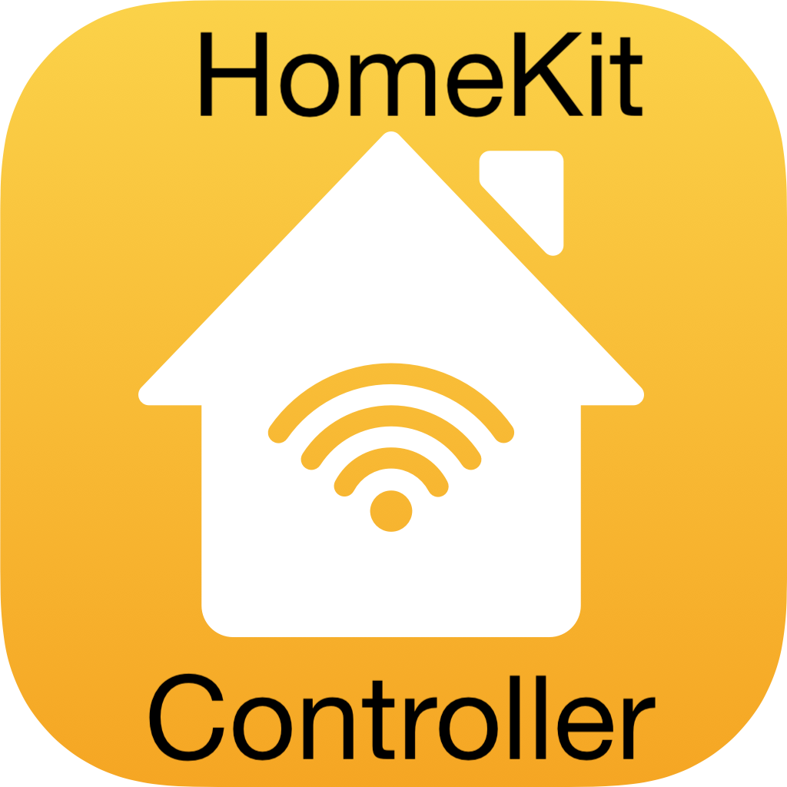

# ioBroker.homekit-controller

**Dieser Adapter nutzt die Sentry-Bibliotheken, um Ausnahmen und Codefehler automatisch an die Entwickler zu melden.** Weitere Details und Informationen zum Deaktivieren der Fehlerberichterstattung finden Sie in [der Sentry-Plugin-Dokumentation](https://github.com/ioBroker/plugin-sentry#plugin-sentry) ! Die Sentry-Berichterstattung wird ab js-controller 3.0 verwendet.

## HomeKit-Controller-Adapter für ioBroker

Mit diesem Adapter können Sie Geräte mit dem „Works with HomeKit“-Logo koppeln und direkt steuern, die mit Apple Home kompatibel sind. Der Adapter unterstützt IP/WLAN- und BLE-Geräte (Bluetooth LE). Er funktioniert ausschließlich lokal in Ihrem Netzwerk.

### Der Adapter ist nicht ...

... die Steuerung von ioBroker-Geräten oder -Zuständen über eine Apple Home App/ein Apple Home System ermöglichen. Wenn Sie diese Funktion nutzen möchten, verwenden Sie bitte den [Yahka-](https://github.com/jensweigele/ioBroker.yahka) Adapter.

... unterstützt ausschließlich Thread-basierte Geräte. Die HomeKit-Thread-Spezifikationen sind noch nicht öffentlich verfügbar. Nach aktuellem Kenntnisstand unterstützen alle auf dem Markt erhältlichen Geräte auch BLE oder WLAN, sodass der Adapter nicht Thread, sondern andere Kommunikationswege nutzen wird.

### So verwenden Sie den Adapter

Der Adapter überwacht verfügbare Geräte in Ihrem Netzwerk.

Es gibt drei „Arten“ von erkannten Geräten:

- **Nicht gekoppelte Geräte** sind Geräte, die erkannt werden und zur Kopplung verfügbar sind. Für diese Geräte werden in ioBroker einige grundlegende Zustände generiert, die Informations- und Verwaltungsdaten enthalten. Durch Eingabe der PIN können Sie diese Geräte mit dieser Adapterinstanz koppeln (siehe Abschnitt „Kopplung“ weiter unten).
- **Mit dieser Instanz gekoppelte** Geräte lassen sich vollständig steuern und aktualisieren Statuswerte in Echtzeit mithilfe von Abonnements (nur IP-Geräte) und einem Datenabfrageintervall. Das Gerät kann auch von dieser Instanz getrennt werden (siehe unten).
- Geräte, die zwar erkannt wurden, aber bereits mit einem anderen Controller gekoppelt sind, werden im Debug-Modus **protokolliert,** es werden jedoch keine Zustände für sie erstellt. Um sie mit ioBroker zu verwenden, müssen Sie sie zunächst von ihrem aktuellen Controller entkoppeln (manchmal nur durch einen Hard-Reset möglich – siehe Handbuch). Anschließend werden sie als „nicht gekoppeltes Gerät“ angezeigt.

Nach dem Koppeln werden die unterstützten Zustände vom Gerät ausgelesen und Objekte sowie Zustände erstellt. Alle im HomeKit-Standard definierten Datenpunkte sollten aussagekräftig benannt werden. Werden UUIDs als Namen verwendet, hat der Gerätehersteller eigene Daten hinzugefügt. Sind diese Daten bekannt, könnten sie dem Adapter hinzugefügt werden (wie beispielsweise bei Elgato-Geräten), sodass sie in der nächsten Version benannt angezeigt werden.

Die Datenpunkte werden mit den korrekten Zuständen und, falls verfügbar, auch mit den korrekten Rollen erstellt. Andernfalls werden generische Rollen verwendet.

### Informationen identifizieren

Geräte, die keinem Controller zugeordnet sind, haben ein`admin.identify` Zustand, der ausgelöst werden kann mit`true` In diesem Fall muss sich das betreffende Gerät identifizieren (z. B. durch Blinken einer Lampe). Diese Funktion ist nur verfügbar, solange das Gerät nicht mit einem Controller gekoppelt ist.

#### Paarungsinformationen

Um das Gerät mit diesem Adapter zu koppeln, benötigen Sie die PIN, die auf dem Gerät oder einem Aufkleber angegeben ist. Die PIN besteht aus 8 Ziffern neben einem QR-Code. Die Ziffern müssen im Format 123-45-678 eingegeben werden (auch wenn die Bindestriche nicht auf dem Aufkleber oder auf dem Bildschirm angezeigt werden!).

Aktuell muss die PIN im admin.pairWithPin-Status eingegeben werden – eine Admin-Benutzeroberfläche folgt in Kürze.

Nach dem Koppeln des Geräts mit dieser Instanz ist es NICHT möglich, das Gerät parallel auch zur Apple Home App oder einer ähnlichen App hinzuzufügen.

Es kann vorkommen, dass es bei der Kopplung noch Probleme gibt, da ich nur mit sehr wenigen Geräten testen konnte. Bitte melden Sie daher alle Probleme, und ich werde Ihnen mit Anweisungen zur Ermittlung der benötigten Debugging-Daten helfen.

#### Informationen zum Entpaaren

Zum Entkoppeln einfach auslösen`admin.unpair` Der Status ist auf „true“ gesetzt, woraufhin der Entkopplungsprozess ausgeführt wird – eine Admin-Benutzeroberfläche folgt in Kürze.

#### Besondere Hinweise zur Verwendung von IP-Geräten

IP-Geräte werden mithilfe von UDP-Paketen erkannt, daher muss sich Ihr Host im selben Netzwerk wie die Geräte befinden. Dies lässt sich derzeit nicht umgehen, da der verwendete MDNS-Eintrag wichtige Informationen für den Kopplungsprozess enthält. Insbesondere bei der Verwendung von Docker müssen Sie Wege finden (Host-Modus, macvlan usw.), um die UDP-Pakete zu empfangen.

Die größte Herausforderung bei WLAN-basierten IP-Geräten ohne Bedienelemente oder Bildschirm besteht darin, sie in Ihr WLAN-Netzwerk einzubinden. In den meisten Fällen gibt es eine herstellerspezifische mobile App, mit der Sie die Geräte initial in Ihr Netzwerk einbinden können. Falls das Gerät dabei auch mit Apple Home gekoppelt wird, müssen Sie die Kopplung möglicherweise anschließend aufheben (z. B. unter <https://www.macrumors.com/how-to/delete-homekit-device/> ). Danach sollte es sich in Ihrem WLAN befinden und mit diesem Adapter gekoppelt werden können.

Sobald ein Gerät mit einer IP-Adresse gekoppelt ist und diese gleich bleibt, verbindet sich der Adapter beim Start direkt mit dem Gerät. Daher empfiehlt es sich, die IP-Adresse in Ihrem Router zu fixieren. Sollte sich die IP-Adresse geändert haben, wird die Verbindung beim nächsten Verbindungsaufbau neu hergestellt und die IP-Adresse aktualisiert.

#### Besondere Hinweise zur Verwendung von BLE-Geräten

BLE ist in den Adaptereinstellungen standardmäßig deaktiviert. Nach der Aktivierung können erreichbare Geräte gefunden werden.

Aufgrund der technischen Beschränkungen von Bluetooth-Geräten sind keine Echtzeit-Aktualisierungen von Statusänderungen möglich. Die Geräte melden wichtige Statusänderungen (z. B. den Ein-/Aus-Zustand) mithilfe spezieller Pakete, die eine sofortige Datenaktualisierung auslösen. Zusätzlich werden die Daten in den festgelegten Abfrageintervallen aktualisiert. Diese sollten nicht zu kurz eingestellt werden!

Nach einem Neustart des Adapters können Bluetooth-Geräte nicht direkt verbunden werden – das System benötigt mindestens ein Discovery-Paket vom Gerät, um die erforderlichen Verbindungsdetails zu erhalten. Daher kann es zu einer leichten Verzögerung bei der Verfügbarkeit von BLE-Geräten kommen.

### Fehlerbehebung

#### Bekannte inkompatible Geräte

Falls Sie Probleme beim Koppeln des Geräts mit diesem Adapter haben, versuchen Sie es bitte mit der normalen Apple Home App für iOS. Funktioniert auch das nicht, liegt ein Fehler am Gerät vor, und dieser Adapter kann Ihnen ebenfalls nicht helfen. Ein Zurücksetzen ist nicht möglich, aber es gibt keine andere Möglichkeit.

Dies trifft derzeit auf einige zu.`Tado Door Locks` Beispielsweise müssen sie mithilfe der folgenden Methode gepaart werden:`Tado App` Das Gerät wird auf irgendeine Weise bei Apple Home registriert, jedoch nicht über einen offiziellen Kopplungsprozess.

Zusätzlich auch`Nuki 3 Locks (BLE)` Eine Kopplung ist nicht möglich, da sie Hardware-Authentifizierungskomponenten verwenden, die von Apple nicht öffentlich dokumentiert sind.

Ein Netatmo-Nutzer fand heraus, wie das Koppeln trotz Problemen möglich war. Siehe <https://github.com/Apollon77/ioBroker.homekit-controller/issues/233#issuecomment-1311983379>

#### Weitere mögliche Probleme, die Sie vor dem Eröffnen eines Tickets überprüfen sollten.

##### für BLE-Geräte

- Falls die BLE-Verbindung nicht funktioniert oder Fehler auftreten, wenn der Adapter versucht, die BluetoothLE-Verbindung zu initialisieren, führen Sie bitte zuerst Folgendes aus:`iobroker fix` um sicherzustellen, dass alle Berechtigungen und erforderlichen Funktionen korrekt eingestellt sind.
- Falls dies nicht hilft, besuchen Sie bitte <https://github.com/noble/noble#running-on-linux>
- Bitte stellen Sie sicher, dass Ihr System einschließlich des Kernels auf dem neuesten Stand ist.`apt update && apt dist-upgrade`
- Versuchen Sie, das betreffende BLE-Gerät beispielsweise mit dem Befehl \`setup\` zurückzusetzen.`sudo hciconfig hci0 reset`
- Bei Problemen geben Sie bitte auch die Ausgabe von`uname -a` Und`lsusb`
- Niedrigstufige BLE-Geräteprotokolle können wie folgt abgerufen werden:`sudo hcidump -t -x >log.txt` (in einer zweiten Shell zusätzlich zum Ausführen des Adapters)

##### Allgemeine Hinweise

- Verfügt das Gerät über einen Kopplungsmodus oder Ähnliches, der zuerst aktiviert werden muss? Lesen Sie aber auch das Handbuch sorgfältig durch; möglicherweise ist der Kopplungsmodus für ein älteres Protokoll oder eine Bridge vorgesehen und nicht für Apple Home.
- Wenn beim Koppeln die Fehlermeldung „Pair-Setup-Charakteristik nicht gefunden“ erscheint, unterstützt das Gerät in seinem aktuellen Zustand keine Kopplung über HomeKit. Der Adapter kann dann nichts tun!
- Bitte geben Sie die PIN mit Bindestrichen im Format „XXX-XX-XXX“ ein. Andere Formate werden von der Bibliothek wahrscheinlich ohnehin aufgrund eines Fehlers abgelehnt, aber um sicherzugehen, geben Sie sie bitte erneut ein.

## Debugging

Wenn Sie Probleme haben und ein Problem melden möchten (siehe unten), ist ein erweitertes Debug-Protokoll immer hilfreich.

- Bitte stoppen Sie die Adapterinstanz in iobBroker Admin.
- Öffnen Sie eine Shell auf dem entsprechenden Server.
- Den Adapter manuell starten`DEBUG=hap* node /opt/iobroker/node_modules/iobroker.homekit-controller/build/main.js 0 --debug --logs`
- Führe dann die Aktion aus, die den Fehler verursacht, und speichere das Log aus der Shell. Poste es anschließend zusammen mit der Problembeschreibung.
- Bitte fügen Sie das Konsolenprotokoll ebenfalls dem Problem bei. Dadurch wird ein Protokoll auf Protokollebene erstellt.
- Suchen Sie außerdem das entsprechende Objekt im Admin-Tab „Objekte“, klicken Sie auf das Stiftsymbol rechts und geben Sie den JSON-Code des Objekts an.

### Ressourcen und Links

- Ressource, die versucht zu entschlüsseln`Elgato` Sonderzustände: <https://gist.github.com/simont77/3f4d4330fa55b83f8ca96388d9004e7d>

### TODO

- Bitte prüfen Sie, wie der Adapter mit Tasten funktioniert (diese haben keinen Zustand, und ich besitze kein solches Gerät. Ich benötige Unterstützung).
- Prüfen Sie, ob Videogeräte unterstützt werden.
- Prüfen Sie, ob es Unterstützungsgeräte gibt, die Bilder liefern (die Methode existiert, aber ich habe sie noch nie in Aktion gesehen).

## Changelog
<!--
	Placeholder for the next version (at the beginning of the line):
	### **WORK IN PROGRESS**
-->
### 0.5.11 (2024-10-31)
* (Apollon77) Stability and compatibility improvements for BLE

### 0.5.10 (2024-01-26)
* (bluefox) Fix user interface

### 0.5.9 (2023-11-23)
* (Apollon77) Prevent crash when a single value is returned as error status
* (Apollon77) send booleans always as 0/1 to make sure all devices handle it correctly
* (Apollon77) Update dependencies

### 0.5.8 (2023-02-27)
* (Apollon77) Update Noble to address CPU/RAM issues

### 0.5.7 (2023-01-27)
* (Apollon77) Added support for Ikea Dirigera Hubs and other devices with very log Accessory IDs
* (Apollon77) Optimize handling of configuration changes
* (Apollon77) Optimize connection state handling

### 0.5.6 (2023-01-05)
* (Apollon77) Upgrade noble library

### 0.5.5 (2022-12-31)
* (Apollon77) Downgrade noble library again

### 0.5.3 (2022-12-22)
* (bluefox) Corrected active TAB Background

### 0.5.2 (2022-12-22)
* (bluefox) Updated GUI packages
* (Apollon77) Upgraded noble BLE library

### 0.5.1 (2022-06-10)
* (Apollon77) Optimizations for BLE connections

### 0.5.0 (2022-06-08)
* (Apollon77) Add Connection identifier for Admin object list
* (Apollon77) Count polling errors and reinitialize device connection when too many errors occur
* (Apollon77) Optimize adapter startup to prevent double initialization of devices

### 0.4.4 (2022-05-06)
* (Apollon77) Add Host header to HTTP devices to prevent issues with some devices
* (Apollon77) Fix several edge case issues

### 0.4.3 (2022-01-25)
* (Apollon77) make sure all connections get closed on reconnect

### 0.4.2 (2022-01-25)
* (Apollon77) Reset HTTP connection if timeouts happen on data polling

### 0.4.1 (2022-01-21)
* (Apollon77) Optimize close of connections on adapter stop

### 0.4.0 (2022-01-21)
* (Apollon77) performance increase by using persistent connections to IP devices and many more optimizations
* (Apollon77) Only use one queue for all BLE devices
* (Apollon77) Store pairing data directly after pair
* (Apollon77) Optimize handing of concurrent requests
* (Apollon77) Optimize value update handling and better detect stale data to force an update on next polling

### 0.3.3 (2021-10-26)
* (bluefox) Fix the Discovery checkboxes

### 0.3.1 (2021-10-25)
* (Apollon77) Fix datatype of lastDiscovered state

### 0.3.0 (2021-10-24)
* (Apollon77) BREAKING CHANGE: All channel names will be changed and a number gets added at the end of the name. Please manually delete the ones without such a number

### 0.2.0 (2021-10-23)
* (bluefox) Add Admin UI
* (Apollon77) Store pairing data additionally in an instance directory and retry them on start if objects where deleted or such
* (Apollon77) Add info.lastDiscovered state with a timestamp to allow manual cleanup of devices that are paired somewhere else then with the adapter instance (because such objects would currently not be deleted)
* (Apollon77) Add missing device and channel objects
* (Apollon77) Always convert bool-type to boolean because it might be numbers coming from the devices
* (Apollon77) sort devices for Admin UI to have those with available actions on top
* (Apollon77) Enhance error messages
* (Apollon77) Adjust some roles

### 0.1.0 (2021-10-19)
* (Apollon77) Optimizations and added some Elgato states
* (Apollon77) Initial GitHub release

### 0.0.x
* (Apollon77) Initial commit and Alpha GitHub testing

## License
MIT License

Copyright (c) 2021-2024 Ingo Fischer <github@fischer-ka.de>

Permission is hereby granted, free of charge, to any person obtaining a copy
of this software and associated documentation files (the "Software"), to deal
in the Software without restriction, including without limitation the rights
to use, copy, modify, merge, publish, distribute, sublicense, and/or sell
copies of the Software, and to permit persons to whom the Software is
furnished to do so, subject to the following conditions:

The above copyright notice and this permission notice shall be included in all
copies or substantial portions of the Software.

THE SOFTWARE IS PROVIDED "AS IS", WITHOUT WARRANTY OF ANY KIND, EXPRESS OR
IMPLIED, INCLUDING BUT NOT LIMITED TO THE WARRANTIES OF MERCHANTABILITY,
FITNESS FOR A PARTICULAR PURPOSE AND NONINFRINGEMENT. IN NO EVENT SHALL THE
AUTHORS OR COPYRIGHT HOLDERS BE LIABLE FOR ANY CLAIM, DAMAGES OR OTHER
LIABILITY, WHETHER IN AN ACTION OF CONTRACT, TORT OR OTHERWISE, ARISING FROM,
OUT OF OR IN CONNECTION WITH THE SOFTWARE OR THE USE OR OTHER DEALINGS IN THE
SOFTWARE.