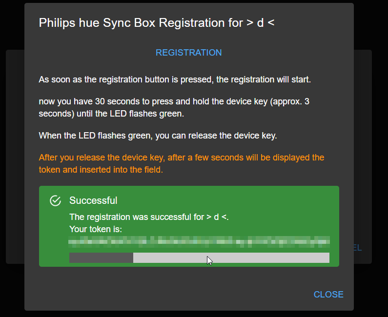

# ioBroker.hue-sync-box

## Hue-Sync-Box-Adapter für ioBroker

**Dieser Adapter nutzt die Sentry-Bibliotheken, um Ausnahmen und Codefehler automatisch an die Entwickler zu melden.** Weitere Details und Informationen zum Deaktivieren der Fehlerberichterstattung finden Sie in [der Sentry-Plugin-Dokumentation](https://github.com/ioBroker/plugin-sentry#plugin-sentry) ! Die Sentry-Berichterstattung wird ab js-controller 3.0 verwendet.

## Der Adapter benötigt Node.js Version >= 16.x

### Was ist die Philips Hue Sync Box?

Die Philips Hue Sync Box ist ein Gerät, mit dem Sie die Farben und Lichteffekte Ihrer Philips Hue Lampen mit dem Bildschirm Ihres Computers synchronisieren können. Dies funktioniert, indem die Sync Box die Farben und Lichteffekte Ihres Bildschirms erkennt und an Ihre Philips Hue Leuchten überträgt.

### Was kann der Adapter leisten?

Der Adapter fragt die Philips Hue Sync Box API alle 15 Sekunden ab und aktualisiert die Datenpunkte entsprechend. Einige Datenpunkte können die Einstellungen der Sync Box ändern (z. B. den Synchronisierungs-Ein-/Ausschalter, die HDMI-Eingänge usw.). Jede Änderung der Datenpunkte wird sofort an die Philips Hue Sync Box gesendet und löst eine Aktualisierung der Datenpunkte aus. Es können mehrere Philips Hue Sync Boxen gleichzeitig erstellt werden.

## Was wird zur Verwendung des Adapters benötigt?

- IP-Adresse der Philips Hue Sync Box (nur IPv4)
- Hue Sync Box Token (siehe unten)

## Wie schließe ich die Philips Hue Sync Box an den Adapter an?

1. Öffnen Sie die Adapterkonfiguration und klicken Sie auf die Schaltfläche „Box hinzufügen“.
2. Geben Sie einen Namen für das Feld ein. Der Name darf nur einmal vorkommen, da er als ID verwendet wird.
3. Geben Sie die IP-Adresse des Geräts ein. (Nur IPv4) (Kleiner Hinweis: Bei der Eingabe der IP-Adresse wird automatisch nach jeder dritten Ziffer ein Punkt eingefügt.)

   
4. Klicken Sie auf die Schaltfläche`register box` Es öffnet sich ein neues Fenster, in dem Sie die Box registrieren können (siehe unten).
5. Sobald der Knopf gedrückt wird`registration` Wenn der Knopf gedrückt wird, startet der Vorgang. Anschließend haben Sie 30 Sekunden Zeit, den Knopf an der Box zu drücken und ihn etwa 3 Sekunden lang gedrückt zu halten, bis die LED grün blinkt. (siehe unten)
6. Nach dem Loslassen der Gerätetaste wird nach einigen Sekunden das Token angezeigt und in das Feld eingefügt. (siehe unten)
7. Jetzt können Sie auf die Schaltfläche klicken.`add` Das Feld wird dann hinzugefügt, anschließend müssen Sie nur noch auf die Schaltfläche klicken.`save` Die Konfiguration speichern.

## Entfernen Sie die Hue Sync Box vom Adapter.

### Achtung! Damit die Löschfunktion mit den Optionen funktioniert, muss das Token über die Registrierungsfunktion des Adapters erstellt worden sein.

1. Öffnen Sie die Adapterkonfiguration und klicken Sie auf das Papierkorbsymbol mit der Aufschrift „Löschen“.
2. Es öffnet sich ein neues Fenster mit zwei Optionen. Wählen Sie die gewünschte Option aus. Wenn keine der Optionen ausgewählt ist, wird das Feld lediglich aus den Konfigurationseinstellungen entfernt. (siehe unten)
   - `deregister from the box` - Die Box wird aus dem Adapter gelöscht und das Token wird aus der Box gelöscht
   - `delete object` - Die Box wird aus dem Adapter gelöscht und die Objekte werden aus dem ioBroker gelöscht.

Sie können auch beide Optionen gleichzeitig auswählen. Dann wird die Box aus dem Adapter gelöscht, die Objekte werden aus dem ioBroker gelöscht und das Token wird aus der Box gelöscht.

## Changelog
<!--
	Placeholder for the next version (at the beginning of the line):
	### **WORK IN PROGRESS**
-->
### 0.3.5 (2023-02-06)
* (xXBJXx) Dependency update

### 0.3.4 (2023-01-15)
* (xXBJXx) fixed Sentry error reporting

### 0.3.3 (2023-01-14)
* (xXBJXx) fixed a bug

### 0.3.2 (2023-01-13)
* (xXBJXx) update dependencies
* (xXBJXx) Log output extended and improved
* (xXBJXx) Added data point for the response JSON
* (xXBJXx) Added data point "Reachable" to check if the box is reachable

### 0.3.1 (2022-12-20)
* (xXBJXx) Fixed error message that occurs after a successful registration.

### 0.3.0 (2022-12-20)
* (xXBJXx) added delete function for objects and Token
* (xXBJXx) added funktion for sync the `execution.intensity` state

### 0.2.1 (2022-12-17)
* (xXBJXx) typo corrected in README
* (xXBJXx) Fixed a bug when sending commands to the box

### 0.2.0 (2022-12-17)
* (xXBJXx) Optimization and improvement of the registration process

### 0.1.0 (2022-12-16)
* (Issi) First release

## License
MIT License

Copyright (c) 2022-2023 Issi <issi.dev.iobroker@gmail.com>

Permission is hereby granted, free of charge, to any person obtaining a copy
of this software and associated documentation files (the "Software"), to deal
in the Software without restriction, including without limitation the rights
to use, copy, modify, merge, publish, distribute, sublicense, and/or sell
copies of the Software, and to permit persons to whom the Software is
furnished to do so, subject to the following conditions:

The above copyright notice and this permission notice shall be included in all
copies or substantial portions of the Software.

THE SOFTWARE IS PROVIDED "AS IS", WITHOUT WARRANTY OF ANY KIND, EXPRESS OR
IMPLIED, INCLUDING BUT NOT LIMITED TO THE WARRANTIES OF MERCHANTABILITY,
FITNESS FOR A PARTICULAR PURPOSE AND NONINFRINGEMENT. IN NO EVENT SHALL THE
AUTHORS OR COPYRIGHT HOLDERS BE LIABLE FOR ANY CLAIM, DAMAGES OR OTHER
LIABILITY, WHETHER IN AN ACTION OF CONTRACT, TORT OR OTHERWISE, ARISING FROM,
OUT OF OR IN CONNECTION WITH THE SOFTWARE OR THE USE OR OTHER DEALINGS IN THE
SOFTWARE.