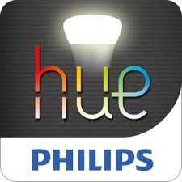

# ioBroker Philips Hue Bridge Adapter

> \[!IMPORTANT] Dieser Adapter kann nicht von GitHub installiert werden.

**Dieser Adapter nutzt den Dienst [Sentry.io](https://sentry.io) , um mir als Entwickler automatisch Ausnahmen, Codefehler und neue Geräteschemata zu melden.** Weitere Details finden Sie unten!

## Was ist Sentry.io und was wird an die Server dieses Unternehmens gemeldet?

Sentry.io ist ein Dienst, der Entwicklern einen Überblick über Fehler in ihren Anwendungen bietet. Genau dies wird in diesem Adapter implementiert.

Wenn der Adapter abstürzt oder ein anderer Codefehler auftritt, wird diese Fehlermeldung, die auch im ioBroker-Protokoll erscheint, an Sentry übermittelt. Wenn Sie der ioBroker GmbH die Berechtigung zur Erfassung von Diagnosedaten erteilt haben, wird auch Ihre Installations-ID (eine eindeutige ID **ohne** weitere Informationen wie E-Mail-Adresse, Name usw.) übermittelt. Dadurch kann Sentry Fehler gruppieren und die Anzahl der betroffenen Benutzer anzeigen. All dies hilft mir, fehlerfreie Adapter bereitzustellen, die praktisch nie abstürzen.

## Englisch :gb:

Dieser Adapter verbindet Ihre Philips Hue Bridges mit ioBroker, um Philips Hue LED-Lampen, Friends of Hue LED-Lampen, LED-Streifen, Steckdosen wie von Osram und andere SmartLink-fähige Geräte (wie LivingWhites und einige LivingColors) zu steuern.

### Aufstellen

Nachdem Sie diesen Adapter in ioBroker installiert haben, erstellen Sie entsprechend eine Adapterinstanz. Anschließend müssen Sie Ihre Hue Bridge in den Adaptereinstellungen mit ioBroker verbinden:

1. Wenn Sie eine andere Bridge als v2 verwenden, konfigurieren Sie den Port auf 80 (nicht https), ansonsten sollte Port 443 ( https) verwendet werden.
2. Klicken Sie auf die Schaltfläche „Bridge suchen“, um die IP-Adresse Ihrer Bridge zu ermitteln. Dadurch werden alle Bridges in Ihrer Umgebung gesucht. Wählen Sie anschließend die Bridge aus, mit der Sie sich verbinden möchten. Das Feld „Bridge-Adresse“ wird automatisch mit der IP-Adresse Ihrer ausgewählten Hue-Bridge ausgefüllt.
3. Klicken Sie anschließend in den Einstellungen auf „Benutzer erstellen“ und gehen Sie dann zu Ihrer Hue Bridge (Ihrem Gerät), um die runde Taste zu drücken. Sie haben 30 Sekunden Zeit. Nach dem Drücken der Taste wird im Feld „Bridge-Benutzer“ eine automatisch generierte Zeichenfolge angezeigt.
4. Ändern Sie alle weiteren Optionen in den Adaptereinstellungen und wählen Sie dann „Speichern und schließen“.
5. Abschließend sollten Sie nun alles eingerichtet haben: Der Adapter generiert alle Objekte, um Ihre Hue-Geräte entsprechend zu steuern.

Bitte beachten Sie: Die Schaltfläche „Bridge suchen“ in den Adaptereinstellungen ist inaktiv, wenn das Feld „Bridge-Adresse“ ausgefüllt ist, und die Schaltfläche „Benutzer erstellen“ ist inaktiv, wenn das Feld „Bridge-Benutzer“ ausgefüllt ist.

### Einstellungen

| Name                                  | Beschreibung                                                                                                                                                                                                                                                                                                                                                                                                                                                                                                                                                                                                              |
| ------------------------------------- | ------------------------------------------------------------------------------------------------------------------------------------------------------------------------------------------------------------------------------------------------------------------------------------------------------------------------------------------------------------------------------------------------------------------------------------------------------------------------------------------------------------------------------------------------------------------------------------------------------------------------- |
| **Brückenadresse**                    | Die IP-Adresse Ihrer Hue Bridge können Sie durch Drücken dieser Taste ermitteln. `Find Bridge` Taste.                                                                                                                                                                                                                                                                                                                                                                                                                                                                                                                      |
| **Hafen**                             | Port Ihrer Hue Bridge, normalerweise 443 (SSL) und 80 (nicht-SSL).                                                                                                                                                                                                                                                                                                                                                                                                                                                                                                                                                        |
| **SSL**                               | Wenn diese Option aktiviert ist, wird die Verbindung über SSL gesichert, der Port ändert sich automatisch auf 443 (die Verwendung von SSL wird dringend empfohlen).                                                                                                                                                                                                                                                                                                                                                                                                                                                       |
| **Benutzer**                          | Benutzername Ihres Bridge-Benutzers. Sie können ihn erstellen, indem Sie die entsprechende Taste drücken. `Create User` Drücken Sie die entsprechende Taste und folgen Sie den Anweisungen auf dem Bildschirm.                                                                                                                                                                                                                                                                                                                                                                                                             |
| **Szenen ignorieren**                 | Wenn diese Option aktiviert ist, werden die Szenen nicht vom Adapter angezeigt/gesteuert.                                                                                                                                                                                                                                                                                                                                                                                                                                                                                                                                 |
| **Gruppen ignorieren**                | Wenn diese Option aktiviert ist, werden Gruppen vom Adapter nicht angezeigt/gesteuert.                                                                                                                                                                                                                                                                                                                                                                                                                                                                                                                                    |
| **„Legacy“-Struktur**                 | Um die Abwärtskompatibilität zu gewährleisten, ist es möglich, eine alte Objektstruktur in ioBroker zu speichern. Diese alte Struktur ist `hue.<instance_number>.<bridge_name_channel>.<light_or_group_channel>.<state>` Die neue Struktur beseitigt `<bridge_name_channel>` Daher ist es notwendig, alte Skripte usw. anzupassen. Wenn der Adapter eine bestehende alte Struktur erkennt, wird diese ohne Aktivierung des Kontrollkästchens verwendet. Soll jedoch von der alten zur neuen Struktur migriert werden, muss die gesamte Struktur gelöscht werden. `hue.<instance_number>` einmalig einen Namespace erstellen. |
| **Natives Ein-/Ausschaltverhalten**   | Ist diese Option aktiviert, schaltet der Adapter die Lampen genauso ein und aus wie die Hue-App. Andernfalls leuchten die Lampen beim Einschalten mit 100 % Helligkeit. Ist eine Gruppe bereits eingeschaltet, wirkt sich die Helligkeitsanpassung nur auf die bereits eingeschalteten Lampen aus; ausgeschaltete Lampen werden nicht eingeschaltet.                                                                                                                                                                                                                                                                      |
| **Synchronisierungssoftwaresensoren** | Synchronisieren Sie auch Softwaresensoren. Dies sind virtuelle Sensoren, die beispielsweise von Hue Labs-Szenen erstellt werden. Durch die Steuerung der `status` Anhand der Datenpunkte eines solchen Sensors lassen sich Szenen starten/stoppen, die dieser Logik folgen. In den meisten Fällen `0` schaltet die Szene aus und `1` schaltet es ein.                                                                                                                                                                                                                                                                        |
| **Schalten Sie mit anderen ein**      | Schalten Sie die Beleuchtung auch mit CT-Status, Farbstatus usw. ein. Einstellen auf `false` und schalten sich nur bei eingeschalteter Stromversorgung und Helligkeit ein.                                                                                                                                                                                                                                                                                                                                                                                                                                                 |
| **Umfragen**                          | Ist diese Option aktiviert, fragt der Adapter Zustandsänderungen ab; andernfalls kann er nur zur Steuerung von Lampen verwendet werden, nicht aber zur Anzeige ihres Status.                                                                                                                                                                                                                                                                                                                                                                                                                                              |
| **Abstimmungsintervall**              | Legt fest, wie oft die Zustände abgefragt und somit in ioBroker aktualisiert werden. Kurze Abfrageintervalle können in bestimmten Umgebungen zu Leistungsproblemen führen. Daher beträgt das minimal zulässige Abfrageintervall 2 Sekunden. Wird das Abfrageintervall auf weniger als 2 Sekunden eingestellt, wird es zur Laufzeit auf 2 Sekunden festgelegt.                                                                                                                                                                                                                                                             |

### Befehle

Befehlszustände (z. B. `hue.0.All.command`) kann verwendet werden, um mehrere Befehle an die Brücke zu senden. Dies ermöglicht es, eine Gruppe oder ein Licht mithilfe einer Übergangszeit in einen bestimmten Zustand zu versetzen.

```javascript
setState('hue.0.All.command', { "bri": 50, "transitiontime": 30 }, false);
```

Für Gruppen, die Szenen enthalten, wie `hue.0.Wohnzimmer.scene_hell` Die Szenen können auch mit einer Übergangszeit aktiviert werden. Dazu übergeben Sie das Szenenargument an den entsprechenden Befehl.

```javascript
setState('hue.0.All.Wohnzimmer', { "scene": "hell", "transitiontime": 30 }, false);
```

### Weitere Informationen

Mit Version 3.3.0 erklärt die Gruppe: `anyOn` Und `allOn` wurden kontrollierbar, beachten Sie, dass sie sich einfach so verhalten werden. `on` Zustand, wenn kontrolliert. In manchen Fällen kann es wünschenswert sein, einen kontrollierbaren Zustand zu haben. `anyOn` Zustand in Ihrer Visualisierung.

## Deutsch :de:

Bindet Philips Hue / LivingColors / LivingWhites Lampen ein. In den Adapter-Einstellungen muss die IP der Hue Bridge sowie ein Benutzername konfiguriert werden. Um einen Benutzer zu aktivieren, drücken Sie einmal auf „Benutzer erstellen“ und drücken Sie dann innerhalb von 30 Sekunden den Button an der Hue Bridge. Dann wird der Benutzer automatisch übergeben.

## Roadmap/Aufgaben

- Automatische Brückenerkennung
- Automatische Benutzereinrichtung über Bridge-Link-Taste

## Changelog
<!--
	Placeholder for the next version (at the beginning of the line):
	### __WORK IN PROGRESS__
-->
### 3.17.4 (2026-09-15))
- (mcm1957) support to install from github has been dropped

### 3.17.2 (2026-09-15)
- (copilot) Fixed user creation not updating configuration field automatically- #776

### 3.17.1 (2026-09-15)
- (a-i-ks) fixed: ct object min/max being stricter than the adapter's supported color temperature range, causing "less than min"/"greater than max" warnings (closes #586)
- (copilot) Adapter requires node.js >= 22 now
- (copilot) Adapter requires admin >= 7.7.22 now
- (copilot) Adapter requires js-controller >= 6.0.11 now

### 3.16.2 (2025-04-12)
* (@foxriver76) do not try to use v2 functionality on legacy Hue bridges (closes #720)

### 3.16.1 (2025-03-07)
* (@foxriver76) fix if no tamper report is present on state creation

## License

Apache 2.0

Copyright (c) 2026 iobroker-community-adapters <iobroker-community-adapters@gmx.de>  
Copyright (c) 2017-2025 Bluefox <dogafox@gmail.com>  
Copyright (c) 2014-2016 hobbyquaker