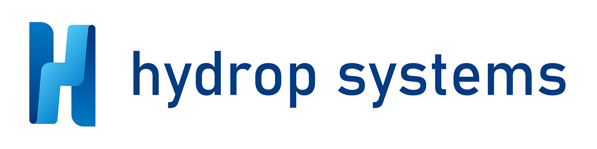

# ioBroker.hydrop

Dieser Adapter nutzt den Dienst`Sentry.io` Ausnahmen, Codefehler und neue Geräteschemata werden mir als Entwickler automatisch gemeldet. Weitere Details finden Sie unten!

---

## Unterstützung der Adapterentwicklung

**Wenn es Ihnen gefällt`ioBroker.hydrop` Bitte erwägen Sie eine Spende:**

---

### Was ist Sentry.io und was wird an die Server dieses Unternehmens gemeldet?

Sentry.io ist ein Dienst, der Entwicklern einen Überblick über Fehler in ihren Anwendungen bietet. Genau dies wird in diesem Adapter implementiert.

Wenn der Adapter abstürzt oder ein anderer Codefehler auftritt, wird diese Fehlermeldung, die auch im ioBroker-Protokoll erscheint, an Sentry übermittelt. Wenn Sie der iobroker GmbH die Erlaubnis erteilt haben, Diagnosedaten zu erfassen, wird auch Ihre Installations-ID (eine eindeutige ID **ohne** weitere Informationen wie E-Mail-Adresse, Name usw.) übermittelt. Dadurch kann Sentry Fehler gruppieren und die Anzahl der betroffenen Benutzer anzeigen. All dies hilft mir, fehlerfreie Adapter bereitzustellen, die praktisch nie abstürzen.

---

## Der Hydrop-Adapter für ioBroker

Mit diesem Adapter integrieren Sie Ihr Hydropmeter nahtlos in ioBroker und erhalten so Einblick in Ihren Wasserverbrauch in Ihr Smart Home. Weitere Informationen zum Hydropmeter und zu Hydrop Systems finden Sie auf der Website: <https://hydrop-systems.com>

Um Ihr Hydrometer in ioBroker zu integrieren, benötigen Sie Folgendes:

- Ein Konto in der Hydrop-App (verfügbar für [Android](https://play.google.com/store/apps/details?id=com.hydropsystems.monitoring\&pcampaignid=web_share) und [iOS](https://apps.apple.com/de/app/hydrop/id6740268955) )
- Der Name, den Sie Ihrem Hydropmeter in der App gegeben haben.
- Ihr persönlicher API-Schlüssel für die hydrop REST-API

Sie können einen API-Schlüssel in der Hydrop-App generieren. Navigieren Sie zu`Settings` , erweitern Sie die`Account` Abschnitt und tippen Sie auf`API key` Der API-Schlüssel wird nur einmal angezeigt. Bitte bewahren Sie ihn an einem sicheren Ort auf.

Sobald Sie alle Informationen bereit haben, können Sie beginnen. Geben Sie die Informationen auf der Einstellungsseite Ihrer Hydrop-Adapterinstanz ein und klicken Sie auf „Starten“.`Save` Die entsprechenden Objekte werden automatisch im Objektbaum erstellt. Die Daten werden alle 5 Minuten in ioBroker abgefragt.

---

### Wie funktioniert ein Hydropmeter?

Der Hydropmeter ist eine intelligente Erweiterung für Ihren Wasserzähler. Mithilfe fortschrittlicher KI-basierter Bildverarbeitung erkennt er jede Änderung des Zählerstands und erstellt so eine detaillierte, hochauflösende Zeitreihe Ihres Wasserverbrauchs. Durch die Überwachung der Durchflussrate können Sie Anomalien erkennen und selbst kleinste Leckagen aufspüren. Selbstverständlich erhalten Sie auch Benachrichtigungen, wenn die Durchflussrate einen bestimmten Maximalwert überschreitet. Mit ioBroker sind die Möglichkeiten nahezu unbegrenzt.

Wenn Sie überprüfen möchten, ob das Hydropmeter mit Ihrem Wasserzähler kompatibel ist, verwenden Sie bitte dieses Tool: <https://shop.hydrop-systems.com/zaehlercheck/>

---

## Changelog
<!-- ### **WORK IN PROGRESS** -->
### **WORK IN PROGRESS**
(simatec) Update dependencies

### 0.2.0 (2026-08-21)
* (copilot) Adapter requires node.js >= 22 now
* (simatec) Update dependencies
* (simatec) small Bugfixes

### 0.1.5 (2026-03-29)
* (simatec) Fix License
* (simatec) Update dependencies
* (simatec) Update automerge
* (simatec) Update io-package

### 0.1.4 (2025-11-23)
* (simatec) Fix dependabot
* (simatec) Update dependencies

### 0.1.3 (2025-11-05)
* (Goriatch) Minified Adapter Logo
* (Goriatch) Localization, description and branding updates
* (simatec) Update dependencies

### 0.1.2 (2025-11-02)
* (simatec) Fix for Beta Release

[Older changelogs can be found there](https://github.com/simatec/ioBroker.hydrop/blob/main/CHANGELOG_OLD.md)

## License
MIT License

Copyright (c) 2025 - 2026 simatec

Permission is hereby granted, free of charge, to any person obtaining a copy
of this software and associated documentation files (the "Software"), to deal
in the Software without restriction, including without limitation the rights
to use, copy, modify, merge, publish, distribute, sublicense, and/or sell
copies of the Software, and to permit persons to whom the Software is
furnished to do so, subject to the following conditions:

The above copyright notice and this permission notice shall be included in all
copies or substantial portions of the Software.

THE SOFTWARE IS PROVIDED "AS IS", WITHOUT WARRANTY OF ANY KIND, EXPRESS OR
IMPLIED, INCLUDING BUT NOT LIMITED TO THE WARRANTIES OF MERCHANTABILITY,
FITNESS FOR A PARTICULAR PURPOSE AND NONINFRINGEMENT. IN NO EVENT SHALL THE
AUTHORS OR COPYRIGHT HOLDERS BE LIABLE FOR ANY CLAIM, DAMAGES OR OTHER
LIABILITY, WHETHER IN AN ACTION OF CONTRACT, TORT OR OTHERWISE, ARISING FROM,
OUT OF OR IN CONNECTION WITH THE SOFTWARE OR THE USE OR OTHER DEALINGS IN THE
SOFTWARE.