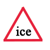

# ioBroker.iceroad

## Dokumentation

Vorhersage zur Wahrscheinlichkeit der Frontscheibe  Bitte die API hier beantragen: <https://www.eiswarnung.de/rest-api/> 

Wettervorhersage für vereiste Windschutzscheiben  Bitte fordern Sie die API hier an: <https://www.eiswarnung.de/rest-api/>   🇩🇪 [Dokumentation](https://github.com/iobroker-community-adapters/ioBroker.iceroad/blob/main/docs/de/iceroad.md)  🇬🇧 [Dokumentation](/#/docs/adapterref/iobroker.iceroad/docs/en/iceroad.md) 

## Diskussion und Fragen

[ioBroker-Forum](https://forum.iobroker.net/topic/50041/test-adapter-ice-road) 

## Ice-Road-Adapter für ioBroker

Dieser Zeitplanadapter fragt die aktuelle Eislage beispielsweise stündlich über <https://eiswarnung.de> ab. Anhand von Klima- und Wetterdaten für Ihren Standort berechnet er am Vorabend, ob am nächsten Morgen mit vereisten Fenstern in Ihrer Gegend zu rechnen ist. Die optimale Abfragezeit liegt 8–10 Stunden im Voraus. Wenn Sie um 8 Uhr morgens das Haus verlassen möchten, empfiehlt sich eine Vorhersage von 22–24 Uhr am Vorabend.   Wenn der Adapter den Status „Eis“ oder „Möglicherweise Eis“ anzeigt, können Sie sich benachrichtigen lassen. Aktuell stehen Ihnen mehrere integrierte Benachrichtigungsdienste zur Verfügung (Telegram, Pushover, WhatsApp, E-Mail, Jarvis, Lovelace, SynoChat). Auch bei einem Statuswechsel zu „Kein Eis“ erhalten Sie eine Benachrichtigung. Zusätzlich können Sie sich erinnern lassen, wenn der Status „Eis“ oder „Möglicherweise Eis“ länger als X Stunden anhält (einstellbar in den Einstellungen). Darüber hinaus stehen verschiedene Datenpunkte zur Weiterverarbeitung bereit.

## Changelog

<!--
    Placeholder for the next version (at the beginning of the line):
    ### **WORK IN PROGRESS**
-->
### **WORK IN PROGRESS**
- (copilot) **CI/CD**: Migrated the project to ESLint 9 with the shared @iobroker/eslint-config and Prettier templates
- (copilot) Adapter requires node.js >= 22 now
- (iobroker-bot) Adapter requires node.js >= 20 now.
- (copilot) Adapter requires admin >= 7.7.22 now
- (copilot) Adapter requires js-controller >= 6.0.11 now
- (copilot) Adapter requires admin >= 7.6.17 now
- (mcm1957) Adapter requires node.js 18 now
- (mcm1957) Dependencies have been updated

### 1.2.1 (2023-05-26)

-   (ciddi89) Updated dependecies
-   (ciddi89) increased timeout for axios to ten seconds

### 1.2.0 (2023-02-22)

-   (ciddi89) Updated dependencies

### 1.1.3 (2023-01-20)

-   (ciddi89) Bugfix: reminder doesn't work correctly
-   (ciddi89) Added: name and type for channel folders
-   (ciddi89) Other: Small code improvements

### 1.1.2 (2022-12-23)

-   (ciddi89) handling if no data was received added

### 1.1.1 (2022-12-18)

-   (ciddi89) changed order in table of longitude and latitude

### 1.1.0 (2022-12-18)

-   (ciddi89) added handling for wrong location data (comma to fullstop)
-   (ciddi89) added functionality for reminder notification
-   (ciddi89) updated readme

### 1.0.0 (2022-12-17)

-   (ciddi89) fixed issue messages wasn't sent
-   (ciddi89) increased timeout
-   (ciddi89) BREAKING CHANGE -> rebuild adapter complete. Please save your data and delete the instance before update
-   (ciddi89) drop support for admin 5

### 0.1.1 (2022-10-01)

-   (Apollon77) Make sure adapter stops when he is done

### 0.1.0

-   (Patrick Walther) add locations, add pushover/telegram/mail

### 0.0.1

-   (Patrick Walther) initial release

[Older changelogs can be found there](https://github.com/iobroker-community-adapters/ioBroker.iceroad/blob/main/CHANGELOG_OLD.md)

## License

The MIT License (MIT)

Copyright (c) 2025-2026 iobroker-community-adapters <iobroker-community-adapters@gmx.de>  
Copyright (c) 2023 Patrick Walther walther-patrick@gmx.net

Permission is hereby granted, free of charge, to any person obtaining a copy
of this software and associated documentation files (the "Software"), to deal
in the Software without restriction, including without limitation the rights
to use, copy, modify, merge, publish, distribute, sublicense, and/or sell
copies of the Software, and to permit persons to whom the Software is
furnished to do so, subject to the following conditions:

The above copyright notice and this permission notice shall be included in
all copies or substantial portions of the Software.

THE SOFTWARE IS PROVIDED "AS IS", WITHOUT WARRANTY OF ANY KIND, EXPRESS OR
IMPLIED, INCLUDING BUT NOT LIMITED TO THE WARRANTIES OF MERCHANTABILITY,
FITNESS FOR A PARTICULAR PURPOSE AND NONINFRINGEMENT. IN NO EVENT SHALL THE
AUTHORS OR COPYRIGHT HOLDERS BE LIABLE FOR ANY CLAIM, DAMAGES OR OTHER
LIABILITY, WHETHER IN AN ACTION OF CONTRACT, TORT OR OTHERWISE, ARISING FROM,
OUT OF OR IN CONNECTION WITH THE SOFTWARE OR THE USE OR OTHER DEALINGS IN
THE SOFTWARE.