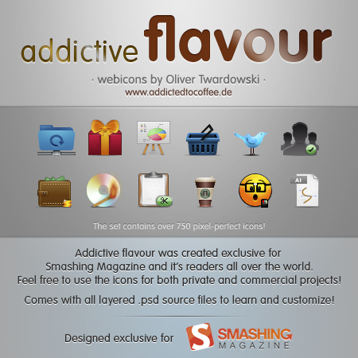
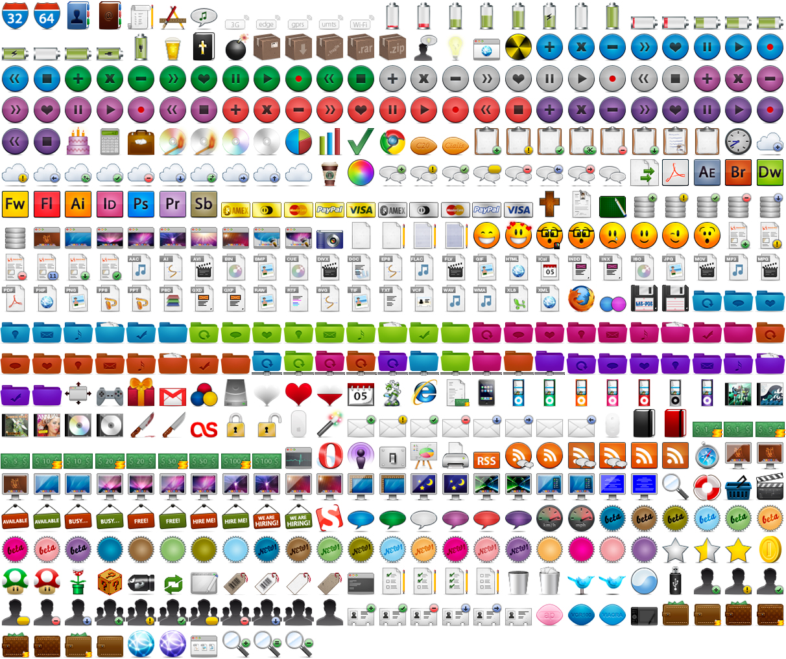

# ioBroker.icons-addictive-flavour-png

Icon-Set für ioBroker.vis und ioBroker.mobile aus dem Addictive Flavour Icon Set. <http://www.smashingmagazine.com/2010/04/15/the-ultimate-free-web-designer-s-icon-set-750-icons-incl-psd-sources/>

[Hier](https://github.com/ioBroker/ioBroker.icons-addictive-flavour-png/blob/master/ICONLIST.md) können Sie alle Symbole überprüfen.

Sie können dieses Set kostenlos und ohne Einschränkungen für all Ihre Projekte verwenden. Die Nutzung ist sowohl für private als auch für kommerzielle Projekte, einschließlich Software, Online-Dienste, Vorlagen und Designs, frei. Das Set darf nicht weiterverkauft, unterlizenziert, vermietet, übertragen oder anderweitig zur Verfügung gestellt werden. Bitte verlinken Sie diesen Artikel, wenn Sie das Set weiterempfehlen möchten.

## Zitat von Oliver Twardowski

## Motivation hinter dem Design

Im Januar 2009 veröffentlichte ich mein erstes pixelbasiertes Iconset „flavour“ hier im Smashing Magazine und ein paar Monate später, im Mai 2009, erweiterte ich dieses Set und veröffentlichte „flavour extended“.

Nun, über ein Jahr später, ist es an der Zeit, diese Reihe abzuschließen. „Addictive Flavor“ wird der letzte Teil der Aromenserie sein. (Zumindest denke ich das vorerst. ^\_^)

In meinen letzten Veröffentlichungen bat ich euch um Feedback zum Iconset, und die Resonanz war überwältigend. Ich erhielt Hunderte von E-Mails und las noch viel mehr Kommentare hier und auf Twitter ( <http://twitter.com/mywayhome> ).

Mit „Addictive Flair“ möchte ich Ihnen das gewünschte und benötigte Icon-Set für Ihre Webentwicklungsprojekte bieten. Sollte ein bestimmtes Icon fehlen, das Sie für Ihr Projekt oder Ihre Website benötigen, kontaktieren Sie mich gerne auf Twitter ( <http://twitter.com/mywayhome> ) oder per E-Mail ( <icons@addictedotocoffee.de> ). Wir finden bestimmt eine Lösung!

Ich möchte mich bei euch allen für eure großartige Unterstützung bei diesem riesigen Iconset bedanken. Mein besonderer Dank gilt Magda, Lars, Martin LeBlanc, Bastian Allgeier, dem Team von Smashing Magazine und allen Beta-Testern, die meine Arbeit fantastisch geprüft und mir wertvolles Feedback, viel Zuspruch und Inspiration gegeben haben!

Bleiben Sie dran für weitere Veröffentlichungen von mir hier im Smashing Magazine oder über meinen Twitter-Stream ( <http://twitter.com/mywayhome> ).

Vielen Dank, Oliver.

### Anleitung zur Verwendung

- Installieren Sie das Icon-Set "icons-addictive-flavour-png" (als Adapter) und navigieren Sie in ioBroker.vis im Bildauswahldialog zu "/icons-addictive-flavour-png/".

## Changelog
### 0.1.0 (2015-05-20)
* (bluefox) initial commit

