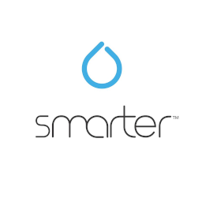

# ioBroker.ikettle2

## ikettle2-Adapter für ioBroker

Steuern Sie Ihren Smarter iKettle 2.0 mit ioBroker.

## Tritt dem Discord-Server bei, um alles über ioBroker zu diskutieren!

Wenn Ihnen meine Arbeit gefällt, freue ich mich über eine persönliche Spende.\
&#x20;(Dies ist ein persönlicher Spendenlink für Jey Cee und steht in keiner Verbindung zum ioBroker-Projekt!)\

---

## Handbuch

### Objektbeschreibung

**on** - Schaltet den Wasserkocher ein. Die Einstellung set\_temperature muss vorher vorgenommen werden.

**on\_formula** – Schaltet den Wasserkocher ein, erhitzt ihn und hält die Formeltemperatur für die angegebene Aufwärmzeit. Formeltemperatur und Aufwärmzeit müssen zuvor eingestellt werden.

**Kalibrieren** - Basiskalibrierung starten.

**on\_plate** - Zeigt an, ob der Wasserkocher auf der Bodenplatte steht.

**set\_temperature** - Die Zieltemperatur zum Erhitzen des Wassers.

**formula\_temperature** - Die Zieltemperatur nach dem Erhitzen des Wassers auf die eingestellte Temperatur.

**Wassertemperatur** - Die tatsächliche Temperatur des Wassers.

**Wasserstand** – Aktueller Wasserstand im Wasserkocher. Hinweis: Die Genauigkeit ist nicht sehr hoch und kann völlig falsch sein. Überprüfen Sie daher den Wasserstand im Wasserkocher visuell.

**Aufwärmzeit** – Die Zeit, die der Wasserkocher das Wasser auf der eingestellten Temperatur hält, bevor er sich abschaltet. Hinweis: 0 = Nicht verwendet, Mindestzeit 5 Minuten, Höchstzeit 30 Minuten.

**get\_preset** - Liest die voreingestellten Werte für die manuelle Steuerung (ohne App) vom Wasserkocher.

**set\_preset** – Legt die voreingestellten Werte für den Wasserkocher zur manuellen Steuerung fest (ohne App). Die Werte für formula\_temperature, temperature und warming\_time müssen zuvor im Ordner „preset“ festgelegt werden.

---

### Kalibrieren

Nehmen Sie den Wasserkocher von der Basisstation und stellen Sie die Objektkalibrierung auf „Wahr“. Nach dem Signalton der Basisstation können Sie den Wasserkocher wieder auf die Basisstation stellen und verwenden.

---

## Changelog
### **WORK IN PROGRESS**
- (copilot) Adapter requires node.js >= 22 now
### 1.0.9 (2026-09-03)
* chore(deps-dev): bump @tsconfig/node22 from 22.0.5 to 22.0.6
* chore(deps-dev): bump @alcalzone/release-script-plugin-license

### 1.0.8 (2026-08-03)
* chore(deps-dev): bump @iobroker/testing from 5.2.2 to 5.3.0
* chore(deps-dev): bump @types/node from 25.9.4 to 25.9.5

### 1.0.7 (2026-07-03)
* chore(deps-dev): bump @alcalzone/release-script-plugin-manual-review
* chore(deps-dev): bump @alcalzone/release-script from 5.2.0 to 5.2.1
* chore(deps-dev): bump @types/node from 25.9.1 to 25.9.4

### 1.0.6 (2026-06-03)
* chore(deps-dev): bump @alcalzone/release-script from 5.1.1 to 5.2.0
* chore(deps-dev): bump @alcalzone/release-script-plugin-iobroker
* chore(deps-dev): bump @types/node from 25.6.0 to 25.9.1
* chore(deps-dev): bump @iobroker/eslint-config from 2.2.0 to 2.3.4
* chore(deps-dev): bump @alcalzone/release-script-plugin-license
* Update from template: S6020-addChangelogOld
* Update from template: X0000-dropNode20
* Update from template: W8917-dependabot-addIgnoreTypesNode
* chore(deps-dev): bump typescript from 5.9.3 to 6.0.3

### 1.0.5 (2026-05-03)
* chore(deps-dev): bump @types/node from 25.5.0 to 25.6.0
* Update from template: X0000-updateNodeJsAtTestAndRelease

### 1.0.4 (2026-04-02)
* (jey-cee) fix some issues found by adapter checker

### 1.0.3 (2026-03-31)
* (iobroker-bot) Adapter requires node.js >= 20 now.
* (Jey Cee) Correct size of ip input on xl displays
* (Jey Cee) update dependencies
* (Jey Cee) fix issues found by adapter checker

### 1.0.2
* (Jey Cee) Add watchdog for connection to prevent adapter freeze
* (Jey Cee) Migrate config to JSON Config
* (Jey Cee) Update dependencies 
* (Jey Cee) Fix issues found by adapter checker

### 1.0.1
* (Jey Cee) fixes for Beta release

### 1.0.0
* (Jey Cee) initial release

[Older changelogs can be found there](https://github.com/Jey-Cee/ioBroker.ikettle2/blob/master/CHANGELOG_OLD.md)

## License
MIT License

Copyright (c) 2021-2026 Jey Cee <jey-cee@live.com>

Permission is hereby granted, free of charge, to any person obtaining a copy
of this software and associated documentation files (the "Software"), to deal
in the Software without restriction, including without limitation the rights
to use, copy, modify, merge, publish, distribute, sublicense, and/or sell
copies of the Software, and to permit persons to whom the Software is
furnished to do so, subject to the following conditions:

The above copyright notice and this permission notice shall be included in all
copies or substantial portions of the Software.

THE SOFTWARE IS PROVIDED "AS IS", WITHOUT WARRANTY OF ANY KIND, EXPRESS OR
IMPLIED, INCLUDING BUT NOT LIMITED TO THE WARRANTIES OF MERCHANTABILITY,
FITNESS FOR A PARTICULAR PURPOSE AND NONINFRINGEMENT. IN NO EVENT SHALL THE
AUTHORS OR COPYRIGHT HOLDERS BE LIABLE FOR ANY CLAIM, DAMAGES OR OTHER
LIABILITY, WHETHER IN AN ACTION OF CONTRACT, TORT OR OTHERWISE, ARISING FROM,
OUT OF OR IN CONNECTION WITH THE SOFTWARE OR THE USE OR OTHER DEALINGS IN THE
SOFTWARE.