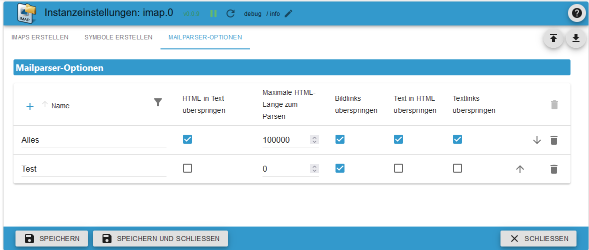
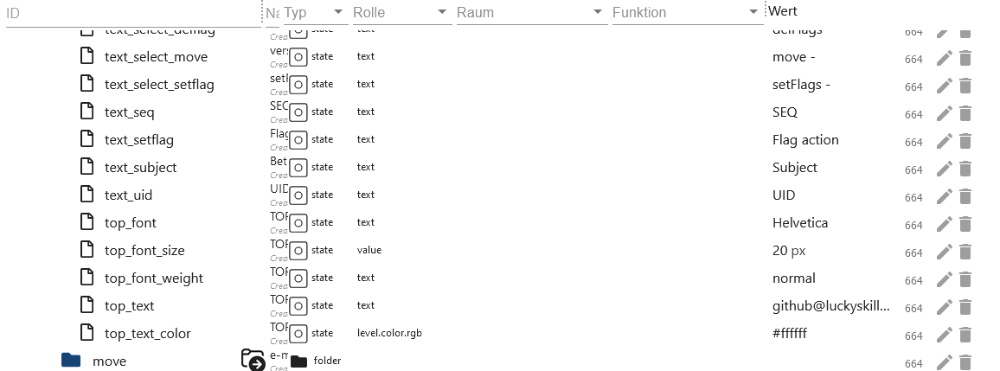

# ioBroker.imap

```:warning:
 ⚠ Dieser Adapter kann mit dem Blockly (Eigene Abfrage) das System sehr schnell zum Absturz bringen.
 ⚠ Daher bitte diese Beschreibung aufmerksam durchlesen.
```

[Zurück zur README](/README.md)

# Zusammenfassung

-   [Instanz Einstellungen](#instanz-einstellungen)
    -   [Einstellungen TAB IMAP](#instanz-konfiguration-tab-imap-erstellen)
    -   [Einstellungen TAB Symbole](#instanz-konfiguration-tab-symbole-erstellen)
    -   [Einstellungen TAB Mailparser](#instanz-konfiguration-tab-mailparser-optionen-erstellen)
-   [Datenpunkte](#datenpunkte)
    -   [Datenpunkte imap.0](#datenpunkte-imap0)
    -   [Datenpunkte imap.0.benutzername](#datenpunkte-imap0benutzername)
    -   [Datenpunkte imap.0.benutzername.email.emails_xx](#datenpunkte-imap0benutzernameemailemail_xx)
    -   [Datenpunkte imap.0.benutzername.infos](#datenpunkte-imap0benutzernameinfos)
    -   [Datenpunkte imap.0.benutzername.remote](#datenpunkte-imap0benutzernameremote)
    -   [Datenpunkte imap.0.benutzername.remote.copy](#datenpunkte-imap0benutzernameremotecopy)
    -   [Datenpunkte imap.0.benutzername.remote.flag](#datenpunkte-imap0benutzernameremoteflag)
    -   [Datenpunkte imap.0.benutzername.remote.html](#datenpunkte-imap0benutzernameremotehtml)
    -   [Datenpunkte imap.0.benutzername.remote.move](#datenpunkte-imap0benutzernameremotemove)
-   [Blocklys](#blocklys)
    -   [Blockly Instanzeinstellungen ändern](#blockly-imap-abfrage-mit-instanz-einstellungen)
    -   [Eigene Abfrage erstellen](#blockly-imap-abfrage-ändern)
    -   [Abfrage mit Instanzeinstellungen](#blockly-imap-eigene-abfrage)
    -   [Flags setzen](#blockly-imap-flags-setzen)
-   [Array JSON](#array-json)
    -   [imap.0.xxx.email.email_xx.attach_json](#array-json-imap0xxxemailemail_xxattach_json)
    -   [imap.0.xxx.json](#array-json-imap0xxxjson)
    -   [imap.0.xxx.last_activity_json](#json-imap0xxxlast_activity_json)
    -   [imap.0.xxx.quality](#json-imap0xxxquality)
    -   [imap.0.xxx.status](#json-imap0xxxstatus)
    -   [imap.0.online_history](#array-json-imap0online_history)
-   [Beispiel Javascripte und Blocklys](/docs/de/EXAMPLE.md)

# Instanz Einstellungen

### Instanz Konfiguration TAB IMAP erstellen

[Zusammenfassung](#zusammenfassung)

```:warning:
 ⚠ Die Instanz muss aktiviert sein!!!!
```

-   `Aktiv`: IMAP Verbindung aktivieren
-   `Host`: z. Bsp. imap.gmail.com
-   `Posteingang`: Standard INBOX - Box die Überwacht werden soll - Mögliche Auswahl siehe imap.0.xxx.remote.change_folder
-   `Port`: Standard 993
-   `Nutzername`: Benutzername - Instanz muss aktiviert sein!!!
-   `Passwort`: Passwort - Instanz muss aktiviert sein!!! - [gmail login](https://support.google.com/mail/answer/185833?hl=de) - [outlook 2-Fach-Authentifizierung](https://mcuiobroker.gitbook.io/jarvis-infos/tipps/allgemein/microsoft-windows/2-fach-authentifizierung)
    

-   `max.`: Maximale Anlage als Datenpunkte email_01...email_02... (1-99)
-   `max. HTML`: Maximale Anzahl von eMails als HTML. Muss größer sein als max. Datenpunkte (1-99)
-   `TLS`: TLS-Verbindung verwenden - Standard ist true
-   `Flaggen`: Flag für die IMAP Abfrage. Mögliche Flags:

```
ALL - alle – Alle Nachrichten.
ANSWERED - geantwortet – Nachrichten mit gesetzter Beantwortet-Flagge.
DELETED - gelöscht – Nachrichten mit gesetzter Gelöscht-Flagge.
DRAFT - Entwurf – Nachrichten mit gesetzter Entwurfsflagge.
FLAGGED - gekennzeichnet – Nachrichten mit gesetzter Flagge.
NEW - neu – Nachrichten, bei denen das Flag „Zuletzt verwendet“ gesetzt ist, aber nicht das Flag „Gesehen“.
SEEN - gesehen – Nachrichten, bei denen das Flag „Gesehen“ gesetzt ist.
RECENT - jüngste – Nachrichten, bei denen das Flag „Zuletzt verwendet“ gesetzt ist.
OLD - alt – Nachrichten, für die das Flag „Zuletzt verwendet“ nicht gesetzt ist. Dies entspricht funktional !RECENT (im Gegensatz zu „!NEW“).
UNANSWERED - unbeantwortet – Nachrichten, bei denen das Flag „Beantwortet“ nicht gesetzt ist.
UNDELETED - ungelöscht – Nachrichten, für die das Flag „Gelöscht“ nicht gesetzt ist.
UNDRAFT - kein Entwurf – Nachrichten, bei denen das Draft-Flag nicht gesetzt ist.
UNFLAGGED - ungekennzeichnet – Nachrichten, für die das Flag „Markiert“ nicht gesetzt ist.
UNSEEN - ungesehen – Nachrichten, bei denen das Flag „Gesehen“ nicht gesetzt ist.
```

-   `Symbol auswählen`: Symbol für den Ordner (unter TAB `Symbole erstellen` hochladen)


-   `tls-Option`: Standard ist {"rejectUnauthorized": false}
-   `Auto-TLS`: Mögliche Auswahl ist `always`, `required` and `never`. Standard ist never
    **Für mehr Informationen bitte [hier](https://www.npmjs.com/package/node-imap) lesen.**


-   `Att.`: Um das Feld HTML zu füllen müssen Anhänge mit geladen werden. Das verbraucht sehr viel RAM!!! Daher Standard `false`
-   `Mailparser-Option`: Mailparser-Option (erst unter TAB `MAILPARSER-OPTIONEN` erstellen)


-   `max. MEMRSS-Limit:` Ab wann die u. a. Aktion ausgelöst wird.
-   `Neu starten:` Ist das MEMRSS Limit erreicht wird der Adapter neu gestartet. Es wird allerdings nur alle 24h geprüft.


-   `Datenpunkt:` Ist das MEMRSS Limit erreicht wird der ausgewählt Datenpunkt auf `true` gesetzt. Dieser muss manuell zurückgesetzt werden. Es wird allerdings nur alle 24h geprüft.


-   `Senden:` Ist das MEMRSS Limit erreicht wird eine Nachricht versendet. Es wird dann bei jeder Aktualisierung von `MEMRSS` eine Nachricht versendet.
    -   `Instanzen:` Beispiel: telegram.0,telegram.1,pushover.0
    -   `Instanzen Benutzer:` Beispiel: Peter,Olaf,Thomas


### Instanz Konfiguration TAB Symbole erstellen

[Zusammenfassung](#zusammenfassung)

-   `Symbolname:` Name für das Symbol. Bitte keine doppelten Namen verwenden. Es wird dann bei Adapterstart ein Error im Logeintrag generiert.
-   `Upload:` Das Icon hochladen.


### Instanz Konfiguration TAB Mailparser Optionen erstellen

[Zusammenfassung](#zusammenfassung)

-   `Name:` Name vom Mailparser. Bitte keine doppelten Namen verwenden. Es wird dann bei Adapterstart ein Error im Logeintrag generiert. Genaue Beschreibung kann [hier](https://nodemailer.com/extras/mailparser/) gelesen werden.
-   `HTML in Text überspringen:` Generiert keinen Klartext aus HTML
-   `Maximale HTML-Länge zum Parsen:` Die maximale Menge an zu analysierendem HTML in Bytes. Wird diese überschritten werden nur Header Daten generiert.
-   `Bildlinks überspringen:` Überspringt die Konvertierung von CID-Anhängen in Daten-URL-Bilder. Bilder werden nicht als base64 konvertiert was `enormen RAM Verbrauch` einspart.
-   `Text in HTML überspringen:` Generiert kein HTML aus Klartextnachrichten
-   `Textlinks überspringen:` Verlink keine Links in Klartextinhalten



# Datenpunkte

### Datenpunkte `imap.0`

[Zusammenfassung](#zusammenfassung)

| Objekt                | Beschreibung                                                                                    |
| --------------------- | ----------------------------------------------------------------------------------------------- |
| imap.0.json_imap      | Name der IMAP Verbindung mit der letzten Aktivität. Trigger für eingehende Emails oder Updates. |
| imap.0.json_table     | Letzte Aktualisierung einer IMAP Verbindung als JSON Table für VIS.                             |
| imap.0.online_counter | Anzahl der aktiven IMAP Verbindungen.                                                           |
| imap.0.online_history | History der Verbindungsaktivitäten als JSON - [Beispiel](#array-json-imap0online_history).      |


### Datenpunkte `imap.0.benutzername`

[Zusammenfassung](#zusammenfassung)

| Objekt                             | Beschreibung                                                                                        |
| ---------------------------------- | --------------------------------------------------------------------------------------------------- |
| imap.0.xxx.active_inbox            | Aktive Inbox                                                                                        |
| imap.0.xxx.host                    | Hostname                                                                                            |
| imap.0.xxx.html                    | HTML Code für VIS                                                                                   |
| imap.0.xxx.json                    | JSON Table für VIS - [Beispiel](#array-json)                                                        |
| imap.0.xxx.last_activity           | Letzte Aktivität                                                                                    |
| imap.0.xxx.last_activity_json      | Welche Aktivität als Array JSON - [Beispiel](#json-imap0xxxlast_activity_json)                      |
| imap.0.xxx.last_activity_timestamp | Zeitstempel der letzten Aktivität                                                                   |
| imap.0.xxx.online                  | Status der IMAP Verbindung                                                                          |
| imap.0.xxx.quality                 | Qualität aller Datenpunkte als JSON. Wird alle 24h aktualisiert - [Beispiel](#json-imap0xxxquality) |
| imap.0.xxx.status                  | Infos zur IMAP Verbindung als JSON - [Beispiel](#json-imap0xxxstatus)                               |
| imap.0.xxx.total                   | Anzahl der Mails der aktiven Inbox                                                                  |
| imap.0.xxx.total_unread            | Anzahl der ungelesenen Mails der aktiven Inbox                                                      |


### Datenpunkte `imap.0.benutzername.email.email_xx`

[Zusammenfassung](#zusammenfassung)

| Objekt                                | Beschreibung                                                                          |
| ------------------------------------- | ------------------------------------------------------------------------------------- |
| imap.0.xxx.email.email_01.attach      | Anzahl der Anhänge und Bilder im Body                                                 |
| imap.0.xxx.email.email_01.attach_json | Infos der Anhänge als JSON - [Beispiel](#array-json-imap0xxxemailemail_xxattach_json) |
| imap.0.xxx.email_01.content           | Inhalt der eMail                                                                      |
| imap.0.xxx.email.email_01.flag        | Flags der eMail                                                                       |
| imap.0.xxx.email.email_01.from        | Versender als Array                                                                   |
| imap.0.xxx.email.email_01.receive     | Datum wann erhalten                                                                   |
| imap.0.xxx.email.email_01.seq         | Sequenznummer                                                                         |
| imap.0.xxx.email.email_01.size        | Größe der eMail in Byte                                                               |
| imap.0.xxx.email.email_01.subject     | Betreff der eMail                                                                     |
| imap.0.xxx.email.email_01.texthtml    | Inhalt als HTML                                                                       |
| imap.0.xxx.email.email_01.to          | Empfänger als Array                                                                   |
| imap.0.xxx.email.email_01.uid         | Eindeutige UID                                                                        |


### Datenpunkte `imap.0.benutzername.infos`

[Zusammenfassung](#zusammenfassung)

| Objekt                                 | Beschreibung                                                                                                                                                          |
| -------------------------------------- | --------------------------------------------------------------------------------------------------------------------------------------------------------------------- |
| imap.0.xxx.infos.all_capability        | Alle Features der IMAP Verbindung                                                                                                                                     |
| imap.0.xxx.infos.auth_cram-md5         | Authentifizierungsmethode auth_cram-md5                                                                                                                               |
| imap.0.xxx.infos.auth_xoauth           | Authentifizierungsmethode xoauth                                                                                                                                      |
| imap.0.xxx.infos.auth_xoauth2          | Authentifizierungsmethode xoauth2                                                                                                                                     |
| imap.0.xxx.infos.condstore             | MODSEQ Anfrage möglich [siehe](https://datatracker.ietf.org/doc/html/rfc4551#page-18)                                                                                 |
| imap.0.xxx.infos.esearch               | Mit einem Befehl mehrere Postfächer durchsuchen                                                                                                                       |
| imap.0.xxx.infos.id                    | [Siehe](https://www.iana.org/assignments/imap-capabilities/imap-capabilities.xhtml)                                                                                   |
| imap.0.xxx.infos.idle                  | [Siehe](https://www.iana.org/assignments/imap-capabilities/imap-capabilities.xhtml)                                                                                   |
| imap.0.xxx.infos.literal\*             | [Siehe](https://www.iana.org/assignments/imap-capabilities/imap-capabilities.xhtml)                                                                                   |
| imap.0.xxx.infos.logindisabled         | [Siehe](https://www.iana.org/assignments/imap-capabilities/imap-capabilities.xhtml)                                                                                   |
| imap.0.xxx.infos.move                  | eMails können verschoben werden. [Siehe](https://www.iana.org/assignments/imap-capabilities/imap-capabilities.xhtml)                                                  |
| imap.0.xxx.infos.namespace             | [Siehe](https://www.iana.org/assignments/imap-capabilities/imap-capabilities.xhtml)                                                                                   |
| imap.0.xxx.infos.quota                 | [Siehe](https://www.iana.org/assignments/imap-capabilities/imap-capabilities.xhtml)                                                                                   |
| imap.0.xxx.infos.sasl-ir               | [Siehe](https://www.iana.org/assignments/imap-capabilities/imap-capabilities.xhtml)                                                                                   |
| imap.0.xxx.infos.sort                  | eMail werden sortiert abgerufen werden [Siehe](https://www.iana.org/assignments/imap-capabilities/imap-capabilities.xhtml)                                            |
| imap.0.xxx.infos.sort_display          | Header Infos sind sortiert.[Siehe](https://www.iana.org/assignments/imap-capabilities/imap-capabilities.xhtml)                                                        |
| imap.0.xxx.infos.starttls              | Es wird starttls unterstützt. Kann dann in der Instanz Konfig eingestellt werden. [Siehe](https://www.iana.org/assignments/imap-capabilities/imap-capabilities.xhtml) |
| imap.0.xxx.infos.thread_orderedsubject | [Siehe](https://www.iana.org/assignments/imap-capabilities/imap-capabilities.xhtml)                                                                                   |
| imap.0.xxx.infos.thread_references     | [Siehe](https://www.iana.org/assignments/imap-capabilities/imap-capabilities.xhtml)                                                                                   |
| imap.0.xxx.infos.unselect              | [Siehe](https://www.iana.org/assignments/imap-capabilities/imap-capabilities.xhtml)                                                                                   |
| imap.0.xxx.infos.x-gm-ext-1            | [Siehe](https://www.iana.org/assignments/imap-capabilities/imap-capabilities.xhtml)                                                                                   |


### Datenpunkte `imap.0.benutzername.remote`

[Zusammenfassung](#zusammenfassung)

| Objekt                          | Beschreibung                                                                                                                                                         |
| ------------------------------- | -------------------------------------------------------------------------------------------------------------------------------------------------------------------- |
| imap.0.xxx.remote.apply_html    | Änderung von imap.0.xxx.remote.html anwenden.                                                                                                                        |
| imap.0.xxx.remote.change_folder | Instanz Konfig: Postfolder wechseln der überwacht und angezeigt werden soll. Wird erst nach einem Neustart zurückgesetzt.                                            |
| imap.0.xxx.remote.criteria      | Instanz Konfig: Suche ändern. Wird erst nach einem Neustart zurückgesetzt.                                                                                           |
| imap.0.xxx.remote.reload_emails | Emails neu laden.                                                                                                                                                    |
| imap.0.xxx.remote.search_start  | Änderungen von change_folder, criteria und show_mails anwenden                                                                                                       |
| imap.0.xxx.remote.show_mails    | Instanz Konfig: Anzahl der eMails (max. HTML) die geladen werden sollen. Wird erst nach einem Neustart zurückgesetzt. Sollte natürlich grüßer sein als der Wert max. |
| imap.0.xxx.remote.vis_command   | Kommando aus der VIS von den Auswahlboxen Mails zu verschieben. Wird nur von VIS verwendet.                                                                          |


### Datenpunkte `imap.0.benutzername.remote.copy`

[Zusammenfassung](#zusammenfassung)

| Objekt                            | Beschreibung                                                                                                              |
| --------------------------------- | ------------------------------------------------------------------------------------------------------------------------- |
| imap.0.xxx.remote.copy.apply_copy | Änderung von folder und uid anwenden.                                                                                     |
| imap.0.xxx.remote.copy.folder     | Ordner auswählen in dem die ausgewählt Mail kopiert werden soll.                                                          |
| imap.0.xxx.remote.copy.uid        | Hier die UID der eMail eintragen die kopiert werden soll. Die UID findet man im imap.0.xxx.json oder in den email Ordnern |


### Datenpunkte `imap.0.benutzername.remote.flag`

[Zusammenfassung](#zusammenfassung)

| Objekt                            | Beschreibung                                                                                                              |
| --------------------------------- | ------------------------------------------------------------------------------------------------------------------------- |
| imap.0.xxx.remote.flag.apply_flag | Änderung von set, type und uid anwenden.                                                                                  |
| imap.0.xxx.remote.flag.set        | Auswahl setFlag für Flag setzen, addFlag für ein Flag hinzuzufügen und delFlag für ein Flag zu löschen                    |
| imap.0.xxx.remote.flag.type       | Flag auswählen der hinzugefügt, gesetzt oder gelöscht werden soll                                                         |
| imap.0.xxx.remote.flag.uid        | Die UID an der die Flag Änderung vorgenommen werden soll. Die UID findet man im imap.0.xxx.json oder in den email Ordnern |


### Datenpunkte `imap.0.benutzername.remote.html`

[Zusammenfassung](#zusammenfassung)

| Objekt                                         | Beschreibung                                                                                    |
| ---------------------------------------------- | ----------------------------------------------------------------------------------------------- |
| imap.0.xxx.remote.html.body_background         | Tabelle Hintergrundfarbe - Standard #000000                                                     |
| imap.0.xxx.remote.html.choose_content          | Feld aus der eMail anzeigen. </br>Mögliche Felder sind html, text, textAsHtml und html convert. |
| imap.0.xxx.remote.html.header_border           | Randstärke Header - Standard 2 px                                                               |
| imap.0.xxx.remote.html.header_font             | Schriftart Header - Standard Helvetica                                                          |
| imap.0.xxx.remote.html.header_font_size        | Schriftgröße Header - Standard 15 px                                                            |
| imap.0.xxx.remote.html.header_linear_color_1   | Farbverlauf Hintergrund Header Wert 1 - Standard #424242                                        |
| imap.0.xxx.remote.html.header_linear_color_2   | Farbverlauf Hintergrund Header Wert 2 - Standard #424242                                        |
| imap.0.xxx.remote.html.header_tag_border_color | Randfarbe Header - Standard #424242 - Alles möglich                                             |
| imap.0.xxx.remote.html.header_text_color       | Header Textfarbe - Standard #BDBDBD                                                             |
| imap.0.xxx.remote.html.header_width            | Header Breite - Standard auto - Möglich px oder %                                               |
| imap.0.xxx.remote.html.headline_align_column_1 | Textausrichtung Header Spalte 1 - Standard center </br> Möglich center, left, right und auto    |


| Objekt                                          | Beschreibung                                                                                  |
| ----------------------------------------------- | --------------------------------------------------------------------------------------------- |
| imap.0.xxx.remote.html.headline_align_column_2  | Textausrichtung Header Spalte 2 - Standard center </br> Möglich center, left, right und auto  |
| imap.0.xxx.remote.html.headline_align_column_3  | Textausrichtung Header Spalte 3 - Standard center </br> Möglich center, left, right und auto  |
| imap.0.xxx.remote.html.headline_align_column_4  | Textausrichtung Header Spalte 4 - Standard center </br> Möglich center, left, right und auto  |
| imap.0.xxx.remote.html.headline_align_column_5  | Textausrichtung Header Spalte 5 - Standard center </br> Möglich center, left, right und auto  |
| imap.0.xxx.remote.html.headline_align_column_6  | Textausrichtung Header Spalte 6 - Standard center </br> Möglich center, left, right und auto  |
| imap.0.xxx.remote.html.headline_align_column_7  | Textausrichtung Header Spalte 7 - Standard center </br> Möglich center, left, right und auto  |
| imap.0.xxx.remote.html.headline_align_column_8  | Textausrichtung Header Spalte 8 - Standard center </br> Möglich center, left, right und auto  |
| imap.0.xxx.remote.html.headline_align_column_9  | Textausrichtung Header Spalte 9 - Standard center </br> Möglich center, left, right und auto  |
| imap.0.xxx.remote.html.headline_align_column_10 | Textausrichtung Header Spalte 10 - Standard center </br> Möglich center, left, right und auto |
| imap.0.xxx.remote.html.headline_color           | Randfarbe Body - Standard #BD5A3C                                                             |
| imap.0.xxx.remote.html.headline_column_width_1  | Spaltenbreite Spalte 1 - Standard auto - Möglich px oder %                                    |
| imap.0.xxx.remote.html.headline_column_width_10 | Spaltenbreite Spalte 10 - Standard auto - Möglich px oder %                                   |


| Objekt                                         | Beschreibung                                                  |
| ---------------------------------------------- | ------------------------------------------------------------- |
| imap.0.xxx.remote.html.headline_column_width_2 | Spaltenbreite Spalte 2 - Standard auto - Möglich px oder %    |
| imap.0.xxx.remote.html.headline_column_width_3 | Spaltenbreite Spalte 3 - Standard auto - Möglich px oder %    |
| imap.0.xxx.remote.html.headline_column_width_4 | Spaltenbreite Spalte 4 - Standard auto - Möglich px oder %    |
| imap.0.xxx.remote.html.headline_column_width_5 | Spaltenbreite Spalte 5 - Standard auto - Möglich px oder %    |
| imap.0.xxx.remote.html.headline_column_width_6 | Spaltenbreite Spalte 6 - Standard auto - Möglich px oder %    |
| imap.0.xxx.remote.html.headline_column_width_7 | Spaltenbreite Spalte 7 - Standard auto - Möglich px oder %    |
| imap.0.xxx.remote.html.headline_column_width_8 | Spaltenbreite Spalte 8 - Standard auto - Möglich px oder %    |
| imap.0.xxx.remote.html.headline_column_width_9 | Spaltenbreite Spalte 9 - Standard auto - Möglich px oder %    |
| imap.0.xxx.remote.html.headline_font_size      | Textgröße in den Zeilen - Standard 16 px                      |
| imap.0.xxx.remote.html.headline_height         | Zellenhöhe - Standard 35 px                                   |
| imap.0.xxx.remote.html.headline_style          | Style der Zellen - Standard normal - Möglich normal oder bold |


| Objekt                                           | Beschreibung                                                                                   |
| ------------------------------------------------ | ---------------------------------------------------------------------------------------------- |
| imap.0.xxx.remote.html.headline_underlined       | Zellenrand - Standard 3 px                                                                     |
| imap.0.xxx.remote.html.headline_underlined_color | Farbe Zellenrand - Standard #ffffff                                                            |
| imap.0.xxx.remote.html.jarvis                    | Codeanpassung für Ansicht in Jarvis                                                            |
| imap.0.xxx.remote.html.mails_even_color          | Zeilen Hintergrundfarbe bei graden ID`s - Standard #333333                                     |
| imap.0.xxx.remote.html.mails_nextday_color_even  | Zeilen Hintergrundfarbe bei graden ID`s gestern - Standard #F7FFE0                             |
| imap.0.xxx.remote.html.mails_nextday_color_odd   | Zeilen Hintergrundfarbe bei ungraden ID`s gestern - Standard #F7FFE0                           |
| imap.0.xxx.remote.html.mails_odd_color           | Zeilen Hintergrundfarbe bei ungraden ID`s - Standard #FFE32E                                   |
| imap.0.xxx.remote.html.mails_today_color         | Zeilen Hintergrundfarbe bei graden ID`s aktueller Tag - Standard #ffffff                       |
| imap.0.xxx.remote.html.mails_today_color_odd     | Zeilen Hintergrundfarbe bei ungraden ID`s aktueller Tag - Standard #ffffff                     |
| imap.0.xxx.remote.html.p_tag_text_align          | Textausrichtung Header und Footer - Standard center </br> Möglich center, left, right und auto |
| imap.0.xxx.remote.html.short_content             | Buchstabenbegrenzung in Inhalt - Standard 35                                                   |
| imap.0.xxx.remote.html.short_subject             | Buchstabenbegrenzung in Betreff - Standard 35                                                  |
| imap.0.xxx.remote.html.table_tag_border_color    | Tabelle Randfarbe - Standard #424242                                                           |


| Objekt                                      | Beschreibung                                                          |
| ------------------------------------------- | --------------------------------------------------------------------- |
| imap.0.xxx.remote.html.table_tag_cell       | Abstand zwischen Zellen - Standard 6 px                               |
| imap.0.xxx.remote.html.table_tag_text_align | Tabelle Textausrichtung - Standard auto - Möglich px oder %           |
| imap.0.xxx.remote.html.table_tag_width      | Tabellengröße - Standard auto - Möglich px oder %                     |
| imap.0.xxx.remote.html.td_tag_2_colums      | Zeilenumrandung von Zeile 1 und 2 - Standard auto - Möglich px oder % |
| imap.0.xxx.remote.html.td_tag_border_bottom | Zeilenrand unten - Standard 1 px                                      |
| imap.0.xxx.remote.html.td_tag_border_color  | Farbe Zeilenrand unten - Standard #424242                             |
| imap.0.xxx.remote.html.td_tag_border_right  | Zeilenrand rechts - Standard 1 px                                     |
| imap.0.xxx.remote.html.td_tag_cell          | Zellenabstand in den Zeilen - Standard 6 px                           |
| imap.0.xxx.remote.html.text_content         | Header Text Spalte 5 - Standard Inhalt                                |
| imap.0.xxx.remote.html.text_date            | Header Text Spalte 4 - Standard Datum                                 |
| imap.0.xxx.remote.html.text_flag            | Header Text Spalte 7 - Standard Flaggen                               |
| imap.0.xxx.remote.html.text_from            | Header Text Spalte 2 - Standard Von                                   |


| Objekt                                     | Beschreibung                                        |
| ------------------------------------------ | --------------------------------------------------- |
| imap.0.xxx.remote.html.text_id             | Header Text Spalte 1 - Standard ID                  |
| imap.0.xxx.remote.html.text_move_or_copy   | Header Text Spalte 9 - Standard kopie/paste         |
| imap.0.xxx.remote.html.text_select_addflag | Starttext in Flag Auswahlbox - Standard addFlags -  |
| imap.0.xxx.remote.html.text_select_copy    | Starttext in Kopie Auswahlbox - Standard kopie      |
| imap.0.xxx.remote.html.text_select_delflag | Starttext in Flag Auswahlbox - Standard delFlags -  |
| imap.0.xxx.remote.html.text_select_move    | Starttext in Kopie Auswahlbox - Standard verschiebe |
| imap.0.xxx.remote.html.text_select_setflag | Starttext in Flag Auswahlbox - Standard setFlags -  |
| imap.0.xxx.remote.html.text_seq            | Header Text Spalte 6 - Standard SEQ                 |
| imap.0.xxx.remote.html.text_setflag        | Header Text Spalte 10 - Standard Flaggenaktion      |
| imap.0.xxx.remote.html.text_subject        | Header Text Spalte 3 - Standard Betreff             |
| imap.0.xxx.remote.html.text_uid            | Header Text Spalte 8 - Standard UID                 |
| imap.0.xxx.remote.html.top_font            | Schriftart Header und Footer - Standard Helvetica   |


| Objekt                                 | Beschreibung                                                                 |
| -------------------------------------- | ---------------------------------------------------------------------------- |
| imap.0.xxx.remote.html.top_font_size   | Schriftgröße Header und Footer - Standard 20 px                              |
| imap.0.xxx.remote.html.top_font_weight | Schriftstärke Header und Footer - Standard normal - Möglich normal oder bold |
| imap.0.xxx.remote.html.top_text        | Headertext Standard der Username                                             |
| imap.0.xxx.remote.html.top_text_color  | Farbe Headertext - Standard #ffffff                                          |



### Datenpunkte `imap.0.benutzername.remote.move`

[Zusammenfassung](#zusammenfassung)

| Objekt                            | Beschreibung                                                                                                                 |
| --------------------------------- | ---------------------------------------------------------------------------------------------------------------------------- |
| imap.0.xxx.remote.move.apply_move | Änderung von folder und uid anwenden.                                                                                        |
| imap.0.xxx.remote.move.folder     | Ordner auswählen in dem die ausgewählt Mail verschoben werden soll.                                                          |
| imap.0.xxx.remote.move.uid        | Hier die UID der eMail eintragen die verschoben werden soll. Die UID findet ihr im imap.0.xxx.json oder in den email Ordnern |


# Blocklys

### Blockly IMAP Abfrage ändern

[Zusammenfassung](#zusammenfassung)

-   Hiermit kann man diese [Datenpunkte](#datenpunkte-imap0benutzernameremote) setzen.
-   Mögliche Flags findet man [in der Instanz Konfig](#instanz-konfiguration-tab-imap-erstellen).
-   Auswahl der IMAP Verbindung möglich oder für alle anwenden.
-   Max. 100 Emails erlaubt.


### Blockly IMAP eigene Abfrage

[Zusammenfassung](#zusammenfassung)

-   ACHTUNG! Hier kommen alle Daten wie z. Bsp. Anhänge. Diese Abfrage kann den RAM oder CPU ans Limit bringen. Wird ein fehlerhaftes Kriterium erstellt, kann dieses zum iobroker Absturtz führen!!!
-   Die Daten werden dann als JSON geliefert.
-   Bei Logausgaben wird das Logfile sehr groß. Daher später die Logausgaben wieder löschen.
-   Es muss eine Variable mit dem Namen `result` erstellt werden.
-   Max. 100 Emails erlaubt.
-   [Beispiele](/docs/de/EXAMPLE.md)


### Blockly IMAP Abfrage mit Instanz Einstellungen

[Zusammenfassung](#zusammenfassung)

-   Alle Daten von der IMAP Verbindung laden und selber verarbeiten. Als Suchkriterium wird die Instanz Einstellung verwendet.
-   ACHTUNG! Hoher RAM Verbrauch
-   Die Daten werden dann als JSON geliefert.
-   Bei Logausgaben wird das Logfile sehr groß. Daher später die Logausgaben wieder löschen.
-   Es muss eine Variable mit dem Namen `result` erstellt werden.
-   [Beispiele](/docs/de/EXAMPLE.md)


### Blockly IMAP Flags setzen

[Zusammenfassung](#zusammenfassung)

-   Bei einer eMail ein Flag setFlag=setzen, addFlag=hinzufügen oder delFlag=löschen.
-   Postfach auswählen.
-   Auswählen setFlag=setzen, addFlag=hinzufügen oder delFlag=löschen.
-   Flag auswählen.
-   [Mögliche Flags siehe imap.0.xxx.status](#json-imap0xxxstatus)


# Array JSON

### Array JSON imap.0.xxx.email.email_xx.attach_json

[Zusammenfassung](#zusammenfassung)

```json
[
    {
        "partID": "2",
        "id": "<image001.png@01D9C718.240FAD50>",
        "uid": 86,
        "size": "159762",
        "filename": "image001.png",
        "type": "inline",
        "encoding": "base64"
    },
    {
        "partID": "3",
        "id": "<image002.png@01D9C718.36F8AE30>",
        "uid": 86,
        "size": "1296247",
        "filename": "image002.png",
        "type": "inline",
        "encoding": "base64"
    }
]
```

### Array JSON imap.0.xxx.json

[Zusammenfassung](#zusammenfassung)

```json
[
    {
        "id": 1,
        "date": "15.08.2023 15:39:17",
        "from": ["test@luckyskills.de"],
        "from_name": ["Tester"],
        "attach": 0,
        "attach_info": [],
        "to": ["github@luckyskills.de"],
        "to_name": ["Lucky-ESA"],
        "subject": "Test",
        "text": "Am 2023-08-10 12:17, schrieb test@luckyskills.de:\n>>> TEST\n",
        "html": false,
        "textAsHtml": "Am 2023-08-10 12:17, schrieb <a href=\"mailto:test@luckyskills.de\">test@luckyskills.de</a>:<br/>&gt;&gt;&gt; TEST</p>",
        "seqno": 74,
        "uid": 93,
        "size": 1077,
        "flag": "unseen"
    }
]
```

### JSON imap.0.xxx.last_activity_json

[Zusammenfassung](#zusammenfassung)

```json
{
    "modseq": "196",
    "flags": ["\\Seen"]
}
```

### JSON imap.0.xxx.quality

[Zusammenfassung](#zusammenfassung)

```json
{
    "message": "No Message"
}
```

### Möglichkeiten

```
0: "0x00 - good",
1: "0x01 - general problem",
2: "0x02 - no connection problem",
16: "0x10 - substitute value from controller",
17: "0x11 - general problem by instance",
18: "0x12 - instance not connected",
32: "0x20 - substitute initial value",
64: "0x40 - substitute value from device or instance",
65: "0x41 - general problem by device",
66: "0x42 - device not connected",
68: "0x44 - device reports error",
128: "0x80 - substitute value from sensor",
129: "0x81 - general problem by sensor",
130: "0x82 - sensor not connected",
132: "0x84 - sensor reports error",
```

### JSON imap.0.xxx.status

[Zusammenfassung](#zusammenfassung)

```json
{
    "name": "INBOX",
    "flags": ["\\Answered", "\\Flagged", "\\Deleted", "\\Seen", "\\Draft"],
    "readOnly": false,
    "uidvalidity": 1667682367,
    "uidnext": 94,
    "permFlags": ["\\Answered", "\\Flagged", "\\Deleted", "\\Seen", "\\Draft"],
    "keywords": [],
    "newKeywords": true,
    "persistentUIDs": true,
    "nomodseq": false,
    "seq": 0,
    "time": 0,
    "reason": "",
    "user": "github_luckyskills_de",
    "messages": {
        "total": 74,
        "new": 0
    },
    "highestmodseq": "200"
}
```

### Array JSON imap.0.online_history

[Zusammenfassung](#zusammenfassung)

```json
[
    {
        "client": "github_luckyskills_de",
        "time": 1692298599784,
        "status": "Online"
    },
    {
        "client": "github_luckyskills_de",
        "time": 1692298232899,
        "status": "Online"
    }
]
```

## Changelog

<!--
    Placeholder for the next version (at the beginning of the line):
    ### **WORK IN PROGRESS**
-->
### 0.1.3 (2024-03-06)

-   (Lucky-ESA) Fixed setFlag
-   (Lucky-ESA) Fixed sendTo error during instance deletion ([#57](https://github.com/Lucky-ESA/ioBroker.imap/issues/57))
-   (Lucky-ESA) Mass email shift intercepted

### 0.1.2 (2024-01-24)

-   (Lucky-ESA) Added missing translate
-   (Lucky-ESA) Updated package
-   (Lucky-ESA) Bug fixes

### 0.1.1 (2023-09-11)

-   (Lucky-ESA) Delete wrong error parse message

### 0.1.0 (2023-09-06)

-   (Lucky-ESA) Added RAM consumption - Instance Settings
-   (Lucky-ESA) Added german documention
-   (Lucky-ESA) Added Mailparser options
-   (Lucky-ESA) Added counter history
-   (Lucky-ESA) Bug fixes

### 0.0.9 (2023-07-26)

-   (Lucky-ESA) Fixed RAM consumption of new emails
-   (Lucky-ESA) Added counter attachments in JSON

### 0.0.8 (2023-07-13)

-   (Lucky-ESA) Fix refresh crash
-   (Lucky-ESA) Added MB threshold

### 0.0.7 (2023-04-25)

-   (Lucky-ESA) Fix correct counter for seen and unseen
-   (Lucky-ESA) Added capabilities
-   (Lucky-ESA) Criteria change without restart
-   (Lucky-ESA) Added outlook.office365.com oauth2 login
-   (Lucky-ESA) Added Connection.js from Module to Adapter
-   (Lucky-ESA) Bug fixes

### 0.0.6 (2023-03-17)

-   (Lucky-ESA) Added trigger move or copy emails
-   (Lucky-ESA) Added JSON for multiple IMAP accounts
-   (Lucky-ESA) Bug fixes

### 0.0.5 (2023-03-15)

-   (Lucky-ESA) Added: Limited reconnected (5 max)
-   (Lucky-ESA) Added: into datapoints
-   (Lucky-ESA) Added: Password entry not possible without an active instance
-   (Lucky-ESA) Added: Added description to readme
-   (Lucky-ESA) Added: Added move or copy
-   (Lucky-ESA) Added: Set flag with datapoints
-   (Lucky-ESA) Fix: debug output without attachments
-   (Lucky-ESA) Fix: wrong json_table
-   (Lucky-ESA) Fix: value null
-   (Lucky-ESA) Change: Reconnected change info level to debug level
-   (Lucky-ESA) Change: correct dp roles
-   (Lucky-ESA) Change: delete attachments (too much RAM usage)

### 0.0.4 (2023-03-03)

-   (Lucky-ESA) Fix json_table

### 0.0.3 (2023-03-03)

-   (Lucky-ESA) Beta release

### 0.0.2 (2023-03-03)

-   (Lucky-ESA) initial release

## License

MIT License

Copyright (c) 2023-2024 Lucky-ESA <github@luckyskills.de>

Permission is hereby granted, free of charge, to any person obtaining a copy
of this software and associated documentation files (the "Software"), to deal
in the Software without restriction, including without limitation the rights
to use, copy, modify, merge, publish, distribute, sublicense, and/or sell
copies of the Software, and to permit persons to whom the Software is
furnished to do so, subject to the following conditions:

The above copyright notice and this permission notice shall be included in all
copies or substantial portions of the Software.

THE SOFTWARE IS PROVIDED "AS IS", WITHOUT WARRANTY OF ANY KIND, EXPRESS OR
IMPLIED, INCLUDING BUT NOT LIMITED TO THE WARRANTIES OF MERCHANTABILITY,
FITNESS FOR A PARTICULAR PURPOSE AND NONINFRINGEMENT. IN NO EVENT SHALL THE
AUTHORS OR COPYRIGHT HOLDERS BE LIABLE FOR ANY CLAIM, DAMAGES OR OTHER
LIABILITY, WHETHER IN AN ACTION OF CONTRACT, TORT OR OTHERWISE, ARISING FROM,
OUT OF OR IN CONNECTION WITH THE SOFTWARE OR THE USE OR OTHER DEALINGS IN THE
SOFTWARE.