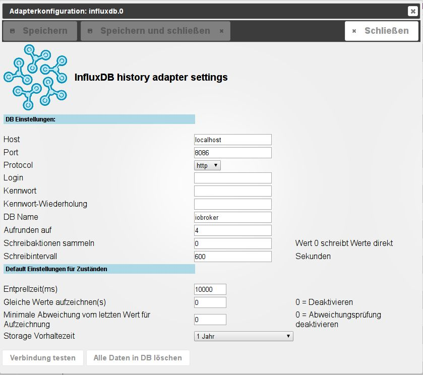
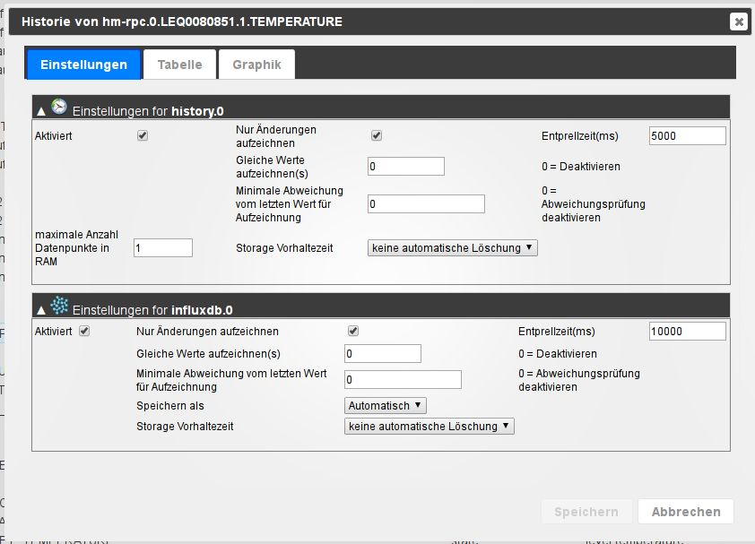
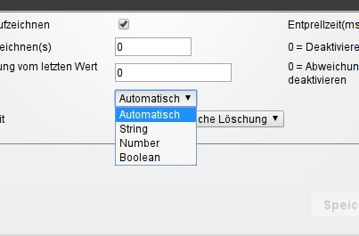
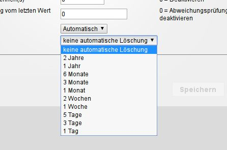
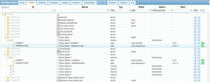
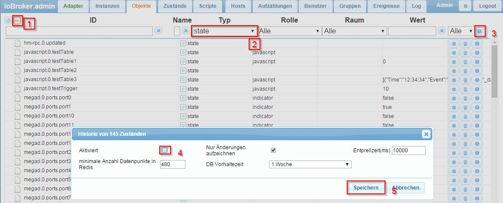
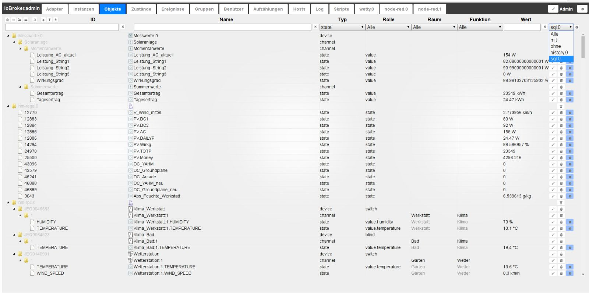
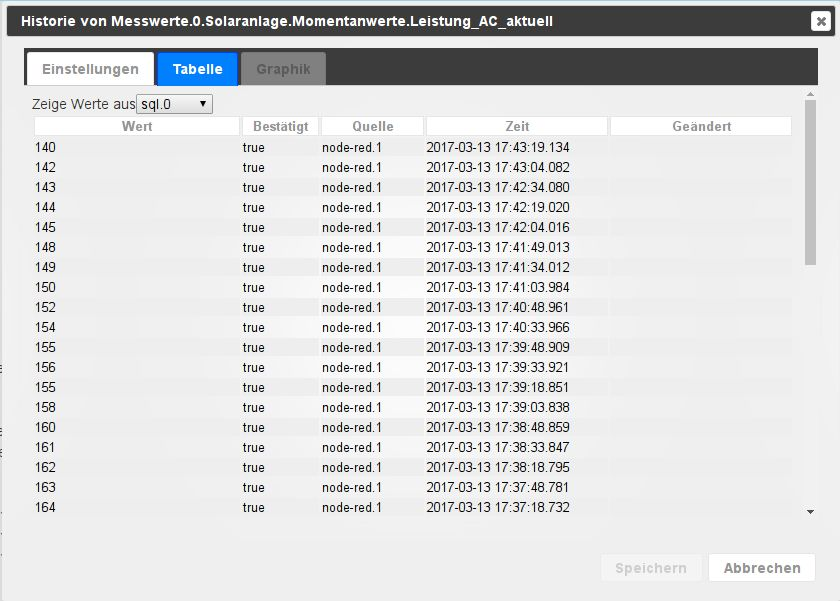
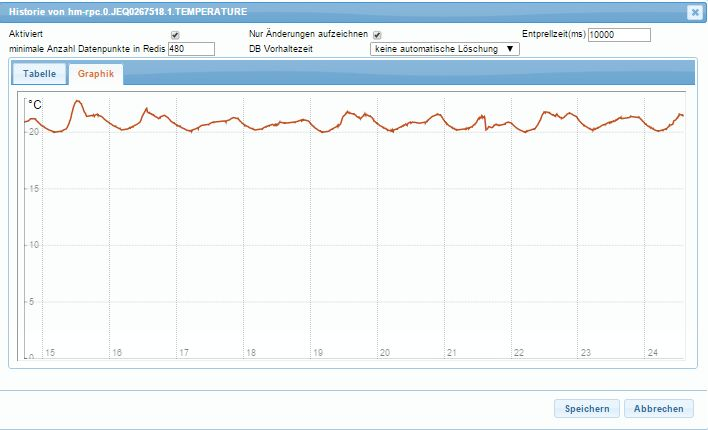

* * *

## Konfiguration

### DB-Einstellungen

Hier werden die Einstellungen, die beim Anlegen der influxDB gemacht wurden eingegeben, damit der ioBroker-Server Zugriff auf diese Datenbank erhält. 

#### Host

Hostname oder IP des Datenbank Servers.

#### Port

hier wird der Port eingegeben über den die Datenbank auf dem Host zu erreichen ist.

#### Protocol

Hier wird angegeben ob der Zugriff auf die Datenbank per einfachem http oder gesichertem https durchgeführt werden soll

#### Login

Der Besitzer der Datenbank (User) unter dessen ID die Daten aufgezeichnet werden sollen

#### Passwort

Dieses ist das Passwort des angegebenen Users in der SQL-Datenbank. Zur Sicherheit muss dieses Passwort im folgenden Feld wiederholt eingegeben werden.

#### Aufrunden auf

Angabe der Nachkommastellen mit denen Zahlen gespeichert werden sollen.

#### Schreibaktionen sammeln

Der hier eingegeben Wert bestimmt wieviele neue Daten vorliegen sollen, bevor wieder in die Datenbank geschrieben werden soll. Je höher der Wert, desto seltener wird in die DB geschrieben, desto höher ist aber der Datenverlust bei Ausfall des Adapters. Eine 0 sorgt für sofortigen Eintrag in die DB. Dementsprechend bedeutet die Eingabe "0": Sofortiges Schreiben in die Datenbank. Dies erhöht die Last auf der Datenbank und im Adapter.

#### Schreibintervall

Wird hier ein Wert eingegeben werden die Daten bereits nach der vorgegebenen Zeit in Sekunden in die Datenbank geschrieben, auch wenn die im letzten Punkt eingestellte Anzahl von Daten noch nicht erreicht ist.

### Default Einstellungen für Zustände

Diese Einstellungen geben die Werte vor, die bei der Konfiguration des Loggings der einzelnen Datenpunkte als Vorgabe genutzt werden sollen. 

#### Nur Änderungen aufzeichnen

Ist diese Checkbox angehakt müssen aufeinanderfolgende Daten unterschiedliche Werte haben damit sie aufgezeichnet werden. Sendet ein Sensor, z.B. mehrfach die gleiche Temperatur wird dies nicht aufgezeichnet, erst bei einer Änderung wird wieder eine Datensatz angelegt.

#### gleiche Werte aufzeichnen

sollen bei gleichem Wert von Zeit zu Zeit trotzdem diese (unveränderten) Werte gespeichert werden, kann hier eine Zeitspanne in Sekunden festgelegt werden, wie häufig dieses geschehen soll. Dementsprechend bedeutet die Eingabe 0, dass kein doppelter Wert gespeichert werden soll.

#### Minimale Abweichung vom letzten Wert

sollen bei ständig wechselnden Werten trotzdem diese (geänderten) Werte nicht gespeichert werden, kann hier ein Mindestwert festgelegt werden, den sich der Wert ändern muss, damit wieder ein neuer Wert gespeichert wird. Dies ist beispielsweise bei Strommesssteckdosen sinnvoll, bei dem nicht jede leichte Veränderung geloggt werden soll. Dementsprechend bedeutet die Eingabe 0, dass jeder Wert gespeichert werden soll.

#### Speichern als

Wenn nötig kann hier der Datentyp festgelegt werden mit dem die Daten gespeichert werden sollen. Dies sollte nur vor der ersten Aktivierung durchgeführt werden.

 In einer InfluxDB wird der Datentyp mit dem ersten Datensatz festgelegt und muss danach identisch bleiben.

#### Storage Vorhaltezeit

Legt fest, wie lange die Werte gespeichert werden sollen (unendlich, 2 Jahre, 1 Jahre, …, 1 Tag). 

#### Entprellzeit (ms)

Schutz vor zu häufigen Änderungen eines Wertes. Dies ist der Mindestabstand in Millisekunden bis wieder ein Wert geschrieben wird.

* * *

## Einstellungen für Datenpunkte

Die Einstellungen für die zu loggenden Datenpunkte werden in dem Reiter „Objekte“ bei dem entsprechenden Datenpunkt durchgeführt.  Dazu wählt man ganz rechts in der Spalte das Zahnradsymbol zu dem gewünschten Datenpunkt aus. Das Konfigurationsmenü öffnet sich: 

### Aktiviert

Logging des Datenpunktes aktivieren Nur Änderungen aufzeichnen: Es werden nur Werte gespeichert, wenn sich der Wert des Datenpunktes ändert. Das spart Speicherplatz.Eine sinnvolle Nutzung ergibt sich, wenn man vorher über die Filterfelder in dem Tabellenheader die Datenpunkte so filtert, dass man z.B. nur die „State“ Datenpunkte herausfiltert, um sie dann zu loggen 

1.  die Ansicht als Liste ohne Gruppierung anzeigen lassen
2.  den oder die Filterbegriffe eingeben
3.  alle gefilterten Datenpunkte zum loggen auswählen
    1.  Das Konfigurationsmenü für die Einstellungen der log-Parameter öffnet sich
4.  Das loggen für alle gefilterten Datenpunkte auf einmal aktivieren
    1.  Weitere Parameter wie „nur Änderungen“ und Vorhaltezeit für alle gefilterten Datenpunkte einheitlich auswählen
5.  Die Änderungen speichern

* * *

## **Bedienung**

Wählt man in der Titelzeile unter Historie "mit" oder "influxdb.0" aus, werden nur noch Datenpunkte mit Logging angezeigt.  Ein Klick auf das Zahnradsymbol öffnet die geloggten Daten:  Im Reiter Table werden die Daten tabellarisch angezeigt.  Im Reiter Chart kann bei installiertem Rickshaw-Adapter eine Verlaufsgrafik angezeigt werden.

* * *

## Installation einer influxDB Datenbank

Die Beschreibung einer Installation einer influxDB-Datenbank folgt.

## Changelog
### 5.0.4 (2026-08-28)
* (@GermanBluefox) Fixed Grafana not finding the InfluxDB running next to it in Docker: the provisioned data source pointed at `iob_influxdb_<instance>`, while the container was named `iob_influxdb_<instance>_flux_data` because the compose file gave it a name of its own. Inside the shared network only the container name resolves, so the data source could not connect. The influx service uses the default name of the instance now - the name the data source and `testConnection()` both expect
* (@GermanBluefox) Fixed the port of that data source: it used the port published on the host, although Grafana reaches InfluxDB inside the docker network, where the container port 8086 applies. The data source broke as soon as the port was changed in the settings
* (@GermanBluefox) Fixed the Grafana container never being started when Grafana is enabled and InfluxDB is not: the plugin waits for the readiness signal of the adapter before it starts any container of the instance, and that signal was only sent when both were switched on. That state is reachable by switching InfluxDB off afterwards - the Grafana checkbox is hidden then, but its stored value stays
* (@GermanBluefox) The "automatic image update" setting of Grafana had no effect: the compose file never passed it on to the plugin
* (@GermanBluefox) **Existing installations with InfluxDB in Docker have to remove the old container once**, because it is renamed by the first fix: `docker rm -f iob_influxdb_<instance>_flux_data`. It still holds the published port, so the correctly named container cannot start next to it. The data is not affected - it lives in the volumes, which keep their names

### 5.0.3 (2026-08-27)
* (@GermanBluefox) Errors are logged with more detail: error code, `cause` and a driver-specific error name (`HttpError`, `ServiceNotAvailableError`) are shown now, and a nested error without a message no longer degrades to `{}` (same implementation as in the SQL adapter)
* (@GermanBluefox) A switched-off or unreachable InfluxDB no longer floods the log (and syslog): a connection error is now recognized by its error code - Node reports a failed TCP connect as an `AggregateError` with an empty message, which no check could match before - so the points are buffered and a reconnect is scheduled instead of retrying every single point. The repeated error is logged once and afterwards only once an hour
* (@GermanBluefox) `getHostsAvailable()` reports the real state again: it returned a hardcoded `1` since the TypeScript port, so every "host not available" check in the adapter was dead code. After a connection error the host is now taken out of rotation for a short backoff and values are buffered instead of being written - and logged - point by point
* (@GermanBluefox) A failing buffer flush inside the interval timer no longer produces an unhandled promise rejection, which terminates the adapter process on current Node.js versions
* (@GermanBluefox) `storeState` answers with an error again if a value cannot be stored (`null`, `NaN`, or a non-numeric value for a `Number` datapoint) instead of reporting `success: true` and silently discarding it; on the state-change path such a value is still logged only once per datapoint
* (@GermanBluefox) The warning about an `undefined` state value is logged only once per datapoint as well

### 5.0.2 (2026-08-26)
* (@GermanBluefox) Added the data browser to the configuration, so the stored values can be viewed, edited and deleted.
* (@GermanBluefox) The aggregation is used now from `@iobroker/aggregate` and is shared with the history and SQL adapters.
* (@joltcoke) Fixed average and total returning null for every interval that contains a null value: parseFloat(null) is NaN and poisoned the sum of the whole interval (thanks to @joltcoke, ioBroker/ioBroker.sql#526). As the result was NaN and not null, ignoreNull could not act on it either
* (@joltcoke) Fixed min returning a wrong value if the interval contains a null, minmax losing the minimum if the interval starts with a null, and percentile/quantile counting a null as 0

### 5.0.1 (2026-08-15)
* (@GermanBluefox) Completely refactored the code to TypeScript and ES6
* (@GermanBluefox) Added possibility to start docker containers directly from the adapter
* (mcm1957) Adapter requires admin >= 7.7.2 now
* (arteck) Fixed the connection handling for InfluxDB 1.x: the health check (ping) and the automatic reconnect were never started
* (arteck) Fixed the loss of buffered values if the writing was running while new values arrived or if the write failed
* (arteck) Values are no longer written twice if they are written directly (buffer size 0 or conflicting points)
* (arteck) State IDs and database names are now escaped in the queries
* (arteck) The password/token is no longer written into the log by the connection test
* (arteck) The settings "request timeout" and "validate SSL" are now used for InfluxDB 1.x too
* (arteck) Fixed the cache file name if more than one instance runs in the compact mode
* (arteck) Fixed the aggregation for `percentile: 100`/`quantile: 1` and the last value of `integralTotal`
* (bluefox) Fixed empty charts for the aggregation `onchange` ("raw" in e-charts): it was run through the interval aggregation and returned only `null` values
* (@GermanBluefox) Minimal node.js version is 22

### 4.0.3 (2024-05-16)
* (bluefox) Some packages were updated

[Older changelogs can be found there](CHANGELOG_OLD.md)

## License

The MIT License (MIT)

Copyright (c) 2015-2026 bluefox, apollon77

Permission is hereby granted, free of charge, to any person obtaining a copy
of this software and associated documentation files (the "Software"), to deal
in the Software without restriction, including without limitation the rights
to use, copy, modify, merge, publish, distribute, sublicense, and/or sell
copies of the Software, and to permit persons to whom the Software is
furnished to do so, subject to the following conditions:

The above copyright notice and this permission notice shall be included in
all copies or substantial portions of the Software.

THE SOFTWARE IS PROVIDED "AS IS", WITHOUT WARRANTY OF ANY KIND, EXPRESS OR
IMPLIED, INCLUDING BUT NOT LIMITED TO THE WARRANTIES OF MERCHANTABILITY,
FITNESS FOR A PARTICULAR PURPOSE AND NONINFRINGEMENT. IN NO EVENT SHALL THE
AUTHORS OR COPYRIGHT HOLDERS BE LIABLE FOR ANY CLAIM, DAMAGES OR OTHER
LIABILITY, WHETHER IN AN ACTION OF CONTRACT, TORT OR OTHERWISE, ARISING FROM,
OUT OF OR IN CONNECTION WITH THE SOFTWARE OR THE USE OR OTHER DEALINGS IN
THE SOFTWARE.