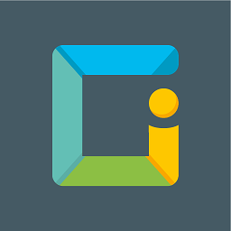

#ioBroker.iogo
Dieser Adapter fügt der Smarthome-App ioGo https://play.google.com/store/apps/details?id=de.nisnagel.iogo zusätzliche Funktionen hinzu.
Bitte besuchen Sie www.iogo.app für weitere Informationen zu den ersten Schritten.

## Aufbau
Sie benötigen einen gültigen Lizenzschlüssel, um diesen Adapter zu verwenden.
Eine Lizenz kann nach Erstellung eines Kontos unter https://www.iogo.app erworben werden.

Bitte geben Sie Ihre Kontoinformationen (E-Mail/Passwort) in die Instanzkonfiguration ein.

## Verwendung
Sie können Nachrichten an alle authentifizierten Benutzer über die MessageBox `sendTo('iogo', 'New message')` oder an bestimmte Benutzer `sendTo('iogo', {user: 'Username', text: 'Test message'})` senden.
Benutzer muss zuvor angelegt werden (weitere Details entnehmen Sie bitte der Anwendungsdokumentation).

Es ist möglich, mehr als einen Empfänger anzugeben (trennen Sie die Benutzernamen einfach durch Kommas). Beispiel: Empfänger: "Benutzer1,Benutzer4,Benutzer5"

Beispiel zum Senden einer benutzerdefinierten Benachrichtigungsnachricht mit Javascript:

```
sendTo('iogo', {
    user:                   'Username',
    text:                   'New message',
    title:                  'VIP News'
});
```

Und ein Beispiel mit Blockly:


Auch Rückrufe werden unterstützt:

```
sendTo('iogo', {title: 'News', text: 'New message'}, function (res) {
    console.log('Sent to ' + res + ' users');
});
```

Senden Sie einfach den Pfad zu Ihrem Bild anstelle von Text oder verwenden Sie das URL-Attribut `sendTo('iogo.0', 'absolute/path/file.png')`

```
sendTo('iogo', {
    user:                   'Username',
    text:                   'New message',
    title:                  'VIP News',
    url:                    'absolute/path/file.png'
});
```

**Möglichkeiten**:

- `Benutzer`: Einzelner Benutzer oder Liste von Benutzern
- `text`: Die Nachricht selbst
- `title`: Der Titel der Benachrichtigung
- `url`: Absoluter Pfad zu einem Bild
- `expiry`: Ablaufzeit in Sekunden

<!-- Platzhalter für die nächste Version (am Zeilenanfang):

### __ARBEITEN IN PROGRESS__ -->

## Changelog
### 0.7.0 (2021-05-24)
* (bluefox) Added support of Admin5

### 0.6.x
* (nisio) Changes for ioGo app version 2.3.0+ (older versions no longer supported)

### 0.5.x
* (nisio) Changes for ioGo app version 2.1.0+ (older versions no longer supported)
* (nisio) Split main.js into several files

### 0.4.x
* (nisio) Changes for ioGo app version 2.0.0+ (older versions no longer supported)

### 0.3.x
* (nisio) added support of compact mode
* (nisio) added support node 12

### 0.2.x
* (nisio) added pro features

### 0.1.x
* (nisio) initial release

## License
The MIT License (MIT)

Copyright (c) 2018 - 2021 Nis Nagel <info@iogo.app>

Permission is hereby granted, free of charge, to any person obtaining a copy
of this software and associated documentation files (the "Software"), to deal
in the Software without restriction, including without limitation the rights
to use, copy, modify, merge, publish, distribute, sublicense, and/or sell
copies of the Software, and to permit persons to whom the Software is
furnished to do so, subject to the following conditions:

The above copyright notice and this permission notice shall be included in
all copies or substantial portions of the Software.

THE SOFTWARE IS PROVIDED "AS IS", WITHOUT WARRANTY OF ANY KIND, EXPRESS OR
IMPLIED, INCLUDING BUT NOT LIMITED TO THE WARRANTIES OF MERCHANTABILITY,
FITNESS FOR A PARTICULAR PURPOSE AND NONINFRINGEMENT. IN NO EVENT SHALL THE
AUTHORS OR COPYRIGHT HOLDERS BE LIABLE FOR ANY CLAIM, DAMAGES OR OTHER
LIABILITY, WHETHER IN AN ACTION OF CONTRACT, TORT OR OTHERWISE, ARISING FROM,
OUT OF OR IN CONNECTION WITH THE SOFTWARE OR THE USE OR OTHER DEALINGS IN
THE SOFTWARE.