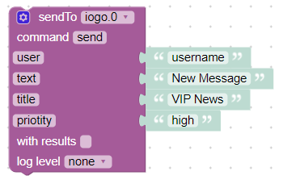

# IoBroker.iogopro
**Tests:** 

## Iogopro-Adapter für ioBroker
Dieser Adapter verbindet ioBroker mit der mobilen App ioGo PRO https://play.google.com/store/apps/details?id=de.nisnagel.iogopro.
Bitte besuchen Sie www.iogo.app für weitere Informationen zu den ersten Schritten.

## Aufbau
Für diesen Adapter benötigen Sie ein gültiges API-Geheimnis, welches Sie in der ioGO-PRO App generieren können.

## Verwendungszweck
Sie können Nachrichten an alle authentifizierten Benutzer über die MessageBox `sendTo('iogo', 'New message')` oder an bestimmte Benutzer `sendTo('iogo', {user: 'Username', text: 'Test message'})` senden.
Benutzer muss zuvor angelegt werden (weitere Details entnehmen Sie bitte der Anwendungsdokumentation).

Es ist möglich, mehr als einen Empfänger anzugeben (trennen Sie die Benutzernamen einfach durch Kommas). Beispiel: Empfänger: "Benutzer1,Benutzer4,Benutzer5"

Beispiel zum Senden einer benutzerdefinierten Benachrichtigungsnachricht mit Javascript:

```
sendTo('iogo', {
    user:                   'Username',
    text:                   'New message',
    title:                  'VIP News'
});
```

Und ein Beispiel mit Blockly:



Auch Rückrufe werden unterstützt:

```
sendTo('iogo', {title: 'News', text: 'New message'}, function (res) {
    console.log('Sent to ' + res + ' users');
});
```

Senden Sie einfach den Pfad zu Ihrem Bild anstelle von Text oder verwenden Sie das URL-Attribut `sendTo('iogo.0', 'absolute/path/file.png')`

```
sendTo('iogo', {
    user:                   'Username',
    text:                   'New message',
    title:                  'VIP News',
    url:                    'absolute/path/file.png'
});
```

**Möglichkeiten**:

- `Benutzer`: Einzelner Benutzer oder Liste von Benutzern
- `text`: Die Nachricht selbst
- `title`: Der Titel der Benachrichtigung
- `url`: Absoluter Pfad zu einem Bild
- `expiry`: Ablaufzeit in Sekunden

## Changelog
<!--
	Placeholder for the next version (at the beginning of the line):
	### **WORK IN PROGRESS**
-->

### 0.1.0 (2021-09-12)
* (nis) migrate current state from ioBroker.iogo

### 0.0.1 (2021-08-29)
* (nis) initial release

## License
MIT License

Copyright (c) 2021 nis <info@iogo.app>

Permission is hereby granted, free of charge, to any person obtaining a copy
of this software and associated documentation files (the "Software"), to deal
in the Software without restriction, including without limitation the rights
to use, copy, modify, merge, publish, distribute, sublicense, and/or sell
copies of the Software, and to permit persons to whom the Software is
furnished to do so, subject to the following conditions:

The above copyright notice and this permission notice shall be included in all
copies or substantial portions of the Software.

THE SOFTWARE IS PROVIDED "AS IS", WITHOUT WARRANTY OF ANY KIND, EXPRESS OR
IMPLIED, INCLUDING BUT NOT LIMITED TO THE WARRANTIES OF MERCHANTABILITY,
FITNESS FOR A PARTICULAR PURPOSE AND NONINFRINGEMENT. IN NO EVENT SHALL THE
AUTHORS OR COPYRIGHT HOLDERS BE LIABLE FOR ANY CLAIM, DAMAGES OR OTHER
LIABILITY, WHETHER IN AN ACTION OF CONTRACT, TORT OR OTHERWISE, ARISING FROM,
OUT OF OR IN CONNECTION WITH THE SOFTWARE OR THE USE OR OTHER DEALINGS IN THE
SOFTWARE.