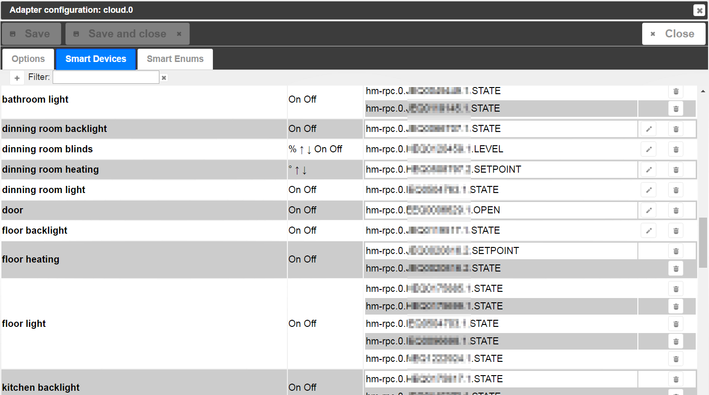
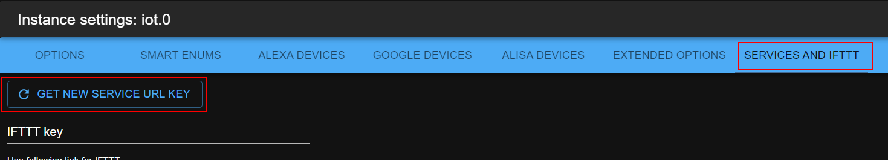

# IoBroker IoT-Adapter
 [](https://weblate.iobroker.net/engage/adapters/?utm_source=widget)

Dieser Adapter dient NUR zur Kommunikation mit Amazon Alexa, Google Home und Nightscout.
Es ist nicht für den Fernzugriff auf Ihre ioBroker-Instanz gedacht. Verwenden Sie dafür den ioBroker.cloud-Adapter.

**Dieser Adapter verwendet Sentry-Bibliotheken, um den Entwicklern automatisch Ausnahmen und Codefehler zu melden.** Weitere Details und Informationen zum Deaktivieren der Fehlerberichterstattung finden Sie unter [Dokumentation zum Sentry-Plugin](https://github.com/ioBroker/plugin-sentry#plugin-sentry)! Sentry Reporting wird ab js-controller 3.0 verwendet.

## Einstellungen
Um den Cloud-Adapter zu verwenden, sollten Sie sich zuerst in der ioBroker-Cloud registrieren [https://iobroker.pro](https://iobroker.pro).

[Verweis auf die Einstellungen des Google-API-Typs](https://developers.google.com/actions/smarthome/guides/)


###Grenzen
Alles hat Grenzen, so auch die Amazon Alexa. Alexa kann nur bis zu 300 Geräte unterstützen.

Google Cloud und Alisa sollten gelöscht werden

### Sprache
Wenn Sie die Sprache "Standard" auswählen, werden die intelligenten Namen von Geräten und Aufzählungen nicht übersetzt. Wenn eine Sprache angegeben ist, werden alle bekannten Namen in diese Sprache übersetzt.
Es wird gemacht, um zu Demonstrationszwecken schnell zwischen vielen Sprachen zu wechseln.

### Platziere die Funktion zuerst in den Namen
Ändern Sie die Reihenfolge von Funktionen und Rollen in selbst generierten Namen:

- falls falsch: "Raumfunktion", z.B. "Wohnzimmerdimmer"
- falls wahr: "Funktionsraum", z.B. "Dimmer Wohnzimmer"

### Wörter mit verketten
Sie können das Wort definieren, das zwischen Funktion und Raum platziert wird. Z.B. "in" und aus "Dimmer Wohnzimmer" wird "Dimmer in Wohnzimmer".

Dies wird jedoch nicht empfohlen, da die Erkennungsmaschine ein weiteres Wort analysieren muss und es zu Missverständnissen kommen kann.

### AUS-Pegel für Schalter
Einige Gruppen bestehen aus gemischten Geräten: Dimmer und Schalter. Es ist erlaubt sie mit "ON" und "OFF" Befehlen und mit Prozenten zu steuern.
Wenn der Befehl `Set to 30%` und der `OFF level is 30%` lautet, werden die Schalter eingeschaltet. Mit dem Befehl "Set to 25%" werden alle Schalter ausgeschaltet.

Wenn der Befehl außerdem "OFF" ist, merkt sich der Adapter den aktuellen Dimmerwert, wenn der tatsächliche Wert über oder gleich "30%" ist.
Später, wenn der neue "ON"-Befehl kommt, schaltet der Adapter den Dimmer nicht auf 100%, sondern auf den Wert im Speicher.

Beispiel:

- Angenommen, der *OFF-Level* beträgt 30%.
- Das virtuelle Gerät "Light" hat zwei physische Geräte: *Schalter* und *Dimmer*.
- Befehl: "Stelle das Licht auf 40%". Der Adapter merkt sich diesen Wert für *Dimmer*, stellt ihn auf "Dimmer" ein und schaltet den *Schalter* EIN.
- Befehl: "Licht ausschalten". Der Adapter setzt den *Dimmer* auf 0% und schaltet den *Schalter* aus.
- Befehl: "Licht einschalten". *dimmer* => 40%, *schalten* => EIN.
- Befehl: "Stelle das Licht auf 20%". *dimmer* => 20%, *schalten* => AUS. Der Wert für den Dimmer wird nicht gespeichert, da er unterhalb des *OFF-Pegels* liegt.
- Befehl: "Licht einschalten". *dimmer* => 40%, *schalten* => EIN.

### Von ON
Sie können das Verhalten des EIN-Befehls für den Nummernstatus auswählen. Der spezifische Wert kann ausgewählt werden oder der letzte Wert ungleich Null wird verwendet.

### Antwort schreiben an
Für jeden Befehl wird die Textantwort generiert. Hier können Sie die Objekt-ID definieren, in die dieser Text geschrieben werden soll. Z.B. *sayit.0.tts.text*.

### Farben
Zur Zeit unterstützt nur das englische alexa die Farbsteuerung.
Der Kanal muss 4 Zustände mit folgenden Rollen haben:

- level.color.saturation (erforderlich für die Erkennung des Kanals),
- level.color.hue,
- Pegeldimmer,
- Schalter (optional)

```
Alexa, set the "device name" to "color"
Alexa, turn the light fuchsia
Alexa, set the bedroom light to red
Alexa, change the kitchen to the color chocolate
```

### Sperren
Um die Möglichkeit zu haben, die Schlösser zu sperren, muss der Zustand die Rolle „switch.lock“ und „native.LOCK_VALUE“ haben, um den Sperrzustand zu bestimmen. Wenn Sie einen separaten Wert benötigen, um den Lock zu steuern, können Sie "native.CONTROL VALUE" verwenden.

```
Alexa, is "lock name" locked/unlocked
Alexa, lock the "lock name"
```

## So werden Namen generiert
Der Adapter versucht, virtuelle Geräte für die Smart-Home-Steuerung zu generieren (z. B. Amazon Alexa oder Google Home).

Dafür gibt es zwei wichtige Aufzählungen: Räume und Funktionen.

Die Zimmer sind wie: Wohnzimmer, Bad, Schlafzimmer.
Funktionen sind wie: Licht, Jalousie, Heizung.

Folgende Bedingungen müssen erfüllt sein, um den Status in der automatisch generierten Liste zu erhalten:

- Der Zustand muss sich in einer "Funktions"-Aufzählung befinden.
- Der Zustand muss eine Rolle haben ("state", "switch" oder "level.*", z.B. level.dimmer), wenn er nicht direkt in "Funktionen" enthalten ist.

Es kann sein, dass sich der Kanal in den "Funktionen" befindet, sich aber nicht selbst angibt.

- der Zustand muss beschreibbar sein: `common.write` = true
- der Zustandsdimmer muss `common.type` als 'Nummer' haben
- der Zustand Heizung muss `common.unit` als `°C', '°F' oder '°K' und `common.type` als `number` haben

Befindet sich der Zustand nur in "Funktionen" und nicht in einem "Raum", wird der Zustandsname verwendet.

Die Zustandsnamen werden aus Funktion und Raum generiert. Z.B. alle *Lichter* im *Wohnzimmer* werden im virtuellen Gerät *Wohnzimmerlicht* gesammelt.
Der Benutzer kann diesen Namen nicht ändern, da er automatisch generiert wird.
Aber wenn sich der Aufzählungsname ändert, wird auch dieser Name geändert. (z.B. Funktion "Licht" auf "Licht" geändert, also *Wohnzimmerlicht* wird auf *Wohnzimmerlicht* geändert)

Alle Regeln werden ignoriert, wenn der Zustand common.smartName hat. In diesem Fall wird nur der intelligente Name verwendet.

wenn *common.smartName* **false** ist, wird der Status oder die Aufzählung nicht in die Listengenerierung aufgenommen.

Der Konfigurationsdialog ermöglicht das komfortable Entfernen und Hinzufügen der einzelnen Zustände zu virtuellen Gruppen oder als Einzelgerät.


Wenn die Gruppe nur einen Status hat, kann sie umbenannt werden, da hierfür der smartName des Status verwendet wird.
Wenn die Gruppe mehr als einen Status hat, muss die Gruppe über die Namen der Aufzählung umbenannt werden.

Um eigene Gruppen zu erstellen, kann der Benutzer den "Szenen"-Adapter installieren oder "Skript" im Javascript-Adapter erstellen.

### Ersetzt
Sie können Strings angeben, die automatisch in den Gerätenamen ersetzt werden können. Z.B. wenn Sie Ersetzen auf: `.STATE,.LEVEL` setzen, werden alle ".STATE" und ".LEVEL" aus den Namen gelöscht. Seien Sie vorsichtig mit Leerzeichen.
Wenn Sie `.STATE, .LEVEL` einstellen, werden „.STATE“ und „.LEVEL“ ersetzt und nicht „.LEVEL“.

## Helferstatus
- **smart.lastObjectID**: Dieser Zustand wird gesetzt, wenn nur ein Gerät vom Home-Skill (Alexa, Google Home) gesteuert wurde.
- **smart.lastFunction**: Funktionsname (falls vorhanden) für den der letzte Befehl ausgeführt wurde.
- **smart.lastRoom**: Raumname (falls vorhanden) für den der letzte Befehl ausgeführt wurde.
- **smart.lastCommand**: Zuletzt ausgeführter Befehl. Der Befehl kann sein: true (ON), false (OFF), number (%), -X (verringern bei x), +X (erhöhen bei X)
- **smart.lastResponse**: Textantwort auf Befehl. Es kann an eine text2speech (sayit) Engine gesendet werden.

## IFTTT
[Anweisungen](doc/ifttt.md)

## Google Home
Wenn Sie im Protokoll folgende Fehlermeldung sehen: `[GHOME] Invalid URL Pro key. Status auto-update is disabled you can set states but receive states only manually`.
Sie müssen also den URL-Key neu generieren:



## Dienstleistungen
Es besteht die Möglichkeit, Nachrichten an den Cloud-Adapter zu senden.
Aufruf von `[POST]https://service.iobroker.in/v1/iotService?service=custom_<NAME>&key=<XXX>&user=<USER_EMAIL>` und Wert als Nutzlast.

`curl --data "myString" https://service.iobroker.in/v1/iotService?service=custom_<NAME>&key=<XXX>&user=<USER_EMAIL>`

oder

`[GET]https://service.iobroker.in/v1/iotService?service=custom_<NAME>&key=<XXX>&user=<USER_EMAIL>&data=myString`

Wenn Sie in den Einstellungen im Feld "Whitelist für Dienste" den Namen *custom_test* setzen und als Dienstnamen "custom_test" aufrufen, wird der Zustand **cloud.0.services.custom_test** auf *myString . gesetzt *.

Sie können "*" in die weiße Liste schreiben und alle Dienste werden zugelassen.

Hier finden Sie eine Anleitung zur Verwendung mit [Tasker](doc/tasker.md).

Der IFTTT-Dienst ist nur zulässig, wenn der IFTTT-Schlüssel gesetzt ist.

Reservierte Namen sind `ifttt`, `text2command`, `simpleApi`, `swagger`. Diese müssen ohne das Präfix `custom_` verwendet werden.

### `text2command`
Sie können "text2command" in die Whitelist schreiben, Sie können eine POST-Anfrage an `https://service.iobroker.in/v1/iotService?service=text2command&key=<user-app-key>&user=<USER_EMAIL>` senden, um Daten in die Variable *text2command.X.text* zu schreiben.

Sie können auch die GET-Methode verwenden `https://service.iobroker.in/v1/iotService?service=text2command&key=<user-app-key>&user=<USER_EMAIL>&data=<MY COMMAND>`

`X` können in den Einstellungen durch die Option "Text2command-Instanz verwenden" definiert werden.

## Benutzerdefinierte Fertigkeit
Die Antworten für benutzerdefinierte Fähigkeiten können auf zwei Arten verarbeitet werden:

- `text2command`
- `javascript`

### `text2command`
ist im Konfigurationsdialog `text2command` Instanz definiert, so wird die Frage an die Instanz gesendet.

`text2command` muss so konfiguriert werden, dass die erwartete Phrase geparst und die Antwort zurückgegeben wird.

### `Javascript`
Es besteht die Möglichkeit die Frage direkt mit Skript zu bearbeiten. Es ist standardmäßig aktiviert, wenn keine *text2command*-Instanz ausgewählt ist.

Wenn `text2command` Instanz definiert ist, muss diese Instanz die Antwort liefern und die Antwort von *script* wird ignoriert.

Der Adapter liefert die Details in zwei Zuständen mit unterschiedlicher Detailstufe

* **smart.lastCommand** enthält den empfangenen Text inklusive einer Info zur Art der Abfrage (Intent). Beispiel: „askDevice Status Rasenmäher“
* **smart.lastCommandObj*** enthält einen JSON-String, der in ein Objekt mit den folgenden Informationen geparst werden kann
  * **words** enthält die empfangenen Wörter in einem Array
  * **Intent** enthält die Art der Abfrage. Mögliche Werte sind derzeit "askDevice", "controlDevice", "actionStart", "actionEnd", "askWhen", "askWhere", "askWho"
  * **deviceId** enthält eine Geräte-ID, die das Gerät identifiziert, an das die Anfrage gesendet wurde, von Amazon geliefert, ist eine leere Zeichenfolge, wenn sie nicht angegeben wird
  * **sessionId** enthält eine sessionId der Skill-Sitzung, sollte gleich sein, wenn mehrere Befehle gesprochen wurden, von Amazon geliefert, ist eine leere Zeichenfolge, wenn sie nicht angegeben wird
  * **userId** enthält eine von Amazon gelieferte userId des Gerätebesitzers (oder später des Benutzers, der mit dem Skill interagiert hat).

 Weitere Details dazu, wie die Wörter erkannt werden und welche Arten von Abfragen der Alexa Custom Skill unterscheidet, finden Sie unter https://forum.iobroker.net/viewtopic.php?f=37&t=17452 .

**Ergebnis über smart.lastResponse-Zustand zurückgeben**

Die Antwort muss innerhalb von 200ms im Zustand "smart.lastResponse" gesendet werden und kann ein einfacher Textstring oder ein JSON-Objekt sein.
Wenn es sich um eine Textzeichenfolge handelt, wird dieser Text als Antwort an den Skill gesendet.
Wenn der Text ein JSON-Objekt ist, können die folgenden Schlüssel verwendet werden:

* **responseText** muss den Text enthalten, um an Amazon zurückzukehren
* **shouldEndSession** ist ein boolescher Wert und steuert, ob die Sitzung nach dem Sprechen der Antwort geschlossen wird oder offen bleibt, um eine weitere Spracheingabe zu akzeptieren.

**Ergebnis über die Nachricht an die iot-Instanz zurückgeben**

Die iot-Instanz akzeptiert auch eine Nachricht mit dem Namen "alexaCustomResponse", die den Schlüssel "response" enthält, mit einem Objekt, das die Schlüssel **responseText** und **shouldEndSession** wie oben beschrieben enthalten kann.
Es erfolgt keine Antwort von der iot-Instanz auf die Nachricht!

**Beispiel für ein Skript, das Texte verwendet**

```
// important, that ack=true
on({id: 'iot.0.smart.lastCommand', ack: true, change: 'any'}, obj => {
    // you have 200ms to prepare the answer and to write it into iot.X.smart.lastResponse
    setState('iot.0.smart.lastResponse', 'Received phrase is: ' + obj.state.val); // important, that ack=false (default)
});
```

**Beispiel für ein Skript, das JSON-Objekte verwendet**

```
// important, that ack=true
on({id: 'iot.0.smart.lastCommandObj', ack: true, change: 'any'}, obj => {
    // you have 200ms to prepare the answer and to write it into iot.X.smart.lastResponse
    const request = JSON.parse(obj.state.val);
    const response = {
        'responseText': 'Received phrase is: ' + request.words.join(' ') + '. Bye',
        'shouldEndSession': true
    };

    // Return response via state
    setState('iot.0.smart.lastResponse', JSON.stringify(response)); // important, that ack=false (default)

    // or alternatively return as message
    sendTo('iot.0', response);
});
```

### Private Wolke
Wenn Sie private Skill/Action/навык für die Kommunikation mit `Alexa/Google Home/Алиса` verwenden, haben Sie die Möglichkeit, die IoT-Instanz zu verwenden, um die Anfragen daraus zu verarbeiten.

Z.B. für `yandex alice`:

```
const OBJECT_FROM_ALISA_SERVICE = {}; // object from alisa service or empty object
OBJECT_FROM_ALISA_SERVICE.alisa = '/path/v1.0/user/devices'; // called URL, 'path' could be any text, but it must be there
sendTo('iot.0', 'private', {type: 'alisa', request: OBJECT_FROM_ALISA_SERVICE}, response => {
    // Send this response back to alisa service
    console.log(JSON.stringify(response));
});
```

Folgende Typen werden unterstützt:

- `alexa` - Handeln mit Amazon Alexa oder Amazon Custom Skill
- `ghome` - Handeln mit Google Actions über Google Home
- `alisa` - Schauspiel mit Yandex Алиса
- `ifttt` - Verhalten wie IFTTT (eigentlich nicht erforderlich, aber zu Testzwecken)

##Yandex лиса
[Anweisungen](doc/alisa.md)

<!-- Platzhalter für die nächste Version (am Zeilenanfang):

### __ARBEITEN IN PROGRESS__ -->

## Changelog
### 1.8.23 (2021-09-18)
* (bluefox) Fixed the response for the heating control

### 1.8.22 (2021-05-16)
* (bluefox) Make it admin4 compatible

### 1.8.21 (2021-05-16)
* (bluefox) Fixed the encryption of the password. Warning: if you see the message in the log, that password is invalid, please enter the password in configuration dialog one more time and save.

### 1.8.20 (2021-05-16)
* (foxriver76) we now write data received from custom services with acknowledge flag

### 1.8.19 (2021-05-14)
* (bluefox) Only added one debug output

### 1.8.16 (2021-03-13)
* (bluefox) fixed the blind functionality in alisa

### 1.8.15 (2021-03-12)
* (bluefox) implemented the sensor functionality in alisa

### 1.8.14 (2021-03-12)
* (bluefox) allowed the control of the blinds in alisa

### 1.8.13 (2021-02-04)
* (Apollon77) add missing object smart.lastObjectID

### 1.8.12 (2021-02-02)
* (bluefox) Fixed the dimmer issue with alisa.

### 1.8.11 (2021-01-20)
* (Morluktom) Alexa - Corrected the request for percentage values

### 1.8.10 (2021-01-20)
* (bluefox) Added the reconnection strategy if DNS address cannot be resolved

### 1.8.9 (2020-12-27)
* (bluefox) Updated configuration GUI to the latest state

### 1.8.8 (2020-12-14)
* (bluefox) Corrected the "google home" error

### 1.8.6 (2020-12-13)
* (bluefox) Try to fix google home error

### 1.8.5 (2020-11-23)
* (bluefox) Corrected the configuration table for google home

### 1.8.4 (2020-11-18)
* (bluefox) Corrected the configuration table for google home

### 1.8.3 (2020-11-16)
* (bluefox) Trying to fix the set to false at start for google home

### 1.8.2 (2020-11-15)
* (bluefox) Added the debug outputs for google home

### 1.8.1 (2020-11-13)
* (bluefox) The deletion of google home devices was corrected

### 1.8.0 (2020-11-12)
* (bluefox) The google home table was rewritten

### 1.7.15 (2020-11-05)
* (Morluktom) Corrected the request for temperature

### 1.7.14 (2020-11-05)
* (bluefox) Updated the select ID dialog.

### 1.7.12 (2020-09-25)
* (bluefox) Updated the select ID dialog.

### 1.7.9 (2020-09-17)
* (bluefox) Updated GUI for config.

### 1.7.7 (2020-09-02)
* (bluefox) Added information about changed linking process.

### 1.7.6 (2020-08-25)
* (bluefox) Some colors were changed in the dark mode.

### 1.7.5 (2020-08-21)
* (Apollon77) Crash prevented (Sentry IOBROKER-IOT-W)
* (bluefox) Values for modes will be converted to number in Alisa

### 1.7.3 (2020-08-16)
* (bluefox) Added vacuum cleaner to Alisa

### 1.7.1 (2020-08-16)
* (bluefox) Added blinds, lock and thermostat to Alisa

### 1.6.4 (2020-08-06)
* (Apollon77) crash prevented (Sentry IOBROKER-IOT-V)

### 1.6.3 (2020-08-04)
* (bluefox) Added french letters to allowed symbols

### 1.6.1 (2020-07-10)
* (bluefox) Used new SelectID Dialog in GUI

### 1.5.3 (2020-05-28)
* (bluefox) Small change for nightscout

### 1.5.2 (2020-05-21)
* (bluefox) Changed requirements for password
* (bluefox) Do not try load the "sharp" if blood sugar not enabled

### 1.4.18 (2020-05-11)
* (Apollon77) Make sure that invalid configured states or values without a timestamp do not crash adapter (Sentry IOBROKER-IOT-8)
* (Apollon77) Make sure publishes after the disconnect to not break adapter (Sentry IOBROKER-IOT-A)

### 1.4.17 (2020-05-11)
* (bluefox) Better error output is implemented

### 1.4.14 (2020-05-01)
* (bluefox) Fixed the problem if admin is not on 8081 port

### 1.4.12 (2020-04-30)
* (Apollon77) error case handled where system.config objects does not exist (Sentry IOBROKER-IOT-5)

### 1.4.11 (2020-04-26)
* (bluefox) fixed IOBROKER-IOT-REACT-F

### 1.4.10 (2020-04-24)
* (bluefox) Fixed crashes reported by sentry

### 1.4.7 (2020-04-23)
* fix iot crash when timeouts in communications to Google happens (Sentry IOBROKER-IOT-2)
* fix iot crash when google answers without customData (Sentry IOBROKER-IOT-1)

### 1.4.6 (2020-04-18)
* (Apollon77) Add the Sentry error reporting to `React Frontend`

### 1.4.4 (2020-04-14)
* (Apollon77) remove js-controller 3.0 warnings and replace `adapter.objects` access
* (Apollon77) add linux dependencies for canvas library
* (Apollon77) add sentry configuration

### 1.4.2 (2020-04-08)
* (TA2k) Fix updateState for Google Home

### 1.4.1 (2020-04-04)
* (bluefox) The blood glucose request supported now

### 1.3.4 (2020-02-26)
* (TA2k) Fixed deconz issues in Google Home

### 1.3.3 (2020-02-12)
* (Apollon77) fix alisa error with invalid smartName attributes

### 1.3.2 (2020-02-10)
* (Apollon77) usage with all kinds of admin ports and reverse proxies optimized

### 1.3.1 (2020-02-09)
* (Apollon77) Dependency updates
* (Apollon77) Make compatible with Admin > 4.0 because of updated socket.io

### 1.2.1 (2020-01-18)
* (bluefox) Fixed problem if the port of admin is not 8081

### 1.2.0 (2020-01-04)
* (TA2k) Google Home handling and visualization improved.

### 1.1.10 (2020-01-03)
* (bluefox) Now is allowed to select the temperature values as alexa states
* (bluefox) Allowed the setting type immediately after insertion of new state

### 1.1.9 (2019-11-27)
* (bluefox) Fixed: sometimes the configuration could not be loaded

### 1.1.8 (2019-09-12)
* (bluefox) Optimization of google home communication was done

### 1.1.7 (2019-09-11)
* (bluefox) The sending rate to google home is limited now

### 1.1.6 (2019-09-11)
* (TA2k) Room fix for Google Home and LinkedDevices

### 1.1.4 (2019-09-10)
* (bluefox) decreased keepalive value to fix issue with disconnect

### 1.1.3 (2019-09-09)
* (TA2k) Google Home problem fixed with LinkedDevices

### 1.1.0 (2019-09-06)
* (bluefox) Added support of aliases

### 1.0.8 (2019-09-03)
* (TA2k) Improved support for Google Home
* (TA2k) Added auto detection for RGB, RGBSingle, Hue, CT, MediaDevice, Switch, Info, Socket, Light, Dimmer, Thermostat, WindowTilt, Blinds, Slider
* (TA2k) Added support for manually adding states as devices
* (TA2k) Fix update state after Sync
* (TA2k) Added typical Google Home devices and traits/actions
* (TA2k) Fix only process update message when Alexa is checked in the options

### 1.0.4 (2019-08-01)
* (bluefox) Fixed password encoding. Please enter password anew!

### 1.0.3 (2019-07-30)
* (bluefox) Fixed language issues for google home and yandex alice

### 1.0.1 (2019-07-26)
* (bluefox) Support of private skills/actions was added.

### 1.0.0 (2019-07-14)
* (TA2k) Google Home list was added

### 0.5.0 (2019-06-29)
* (bluefox) tried to add yandex Alisa

### 0.4.3 (2019-04-14)
* (Apollon77) Change enable/disable of Amazon Alexa and of Google Home from configuration to be really "active if selected".

### 0.4.2 (2019-03-10)
* (bluefox) Allowed the enablement and disable of Amazon Alexa and of Google Home from configuration.

### 0.4.1 (2019-02-19)
* (bluefox) Add version check to google home

### 0.3.1 (2019-01-13)
* (bluefox) Blockly was fixed

### 0.3.0 (2018-12-30)
* (bluefox) Detection of google devices was fixed

### 0.2.2 (2018-12-21)
* (bluefox) Generation of new URL key was added

### 0.2.0 (2018-12-18)
* (bluefox) Change the name of adapter

### 0.1.8 (2018-10-21)
* (bluefox) Added extended diagnostics

### 0.1.7 (2018-10-14)
* (bluefox) The configuration dialog was corrected
* (bluefox) The possibility to create the answer with script for the custom skill was implemented.

### 0.1.4 (2018-09-26)
* (bluefox) Initial commit

## License
The MIT License (MIT)

Copyright (c) 2018-2021 bluefox <dogafox@gmail.com>

Permission is hereby granted, free of charge, to any person obtaining a copy
of this software and associated documentation files (the "Software"), to deal
in the Software without restriction, including without limitation the rights
to use, copy, modify, merge, publish, distribute, sublicense, and/or sell
copies of the Software, and to permit persons to whom the Software is
furnished to do so, subject to the following conditions:

The above copyright notice and this permission notice shall be included in all
copies or substantial portions of the Software.

THE SOFTWARE IS PROVIDED "AS IS", WITHOUT WARRANTY OF ANY KIND, EXPRESS OR
IMPLIED, INCLUDING BUT NOT LIMITED TO THE WARRANTIES OF MERCHANTABILITY,
FITNESS FOR A PARTICULAR PURPOSE AND NONINFRINGEMENT. IN NO EVENT SHALL THE
AUTHORS OR COPYRIGHT HOLDERS BE LIABLE FOR ANY CLAIM, DAMAGES OR OTHER
LIABILITY, WHETHER IN AN ACTION OF CONTRACT, TORT OR OTHERWISE, ARISING FROM,
OUT OF OR IN CONNECTION WITH THE SOFTWARE OR THE USE OR OTHER DEALINGS IN THE
SOFTWARE.