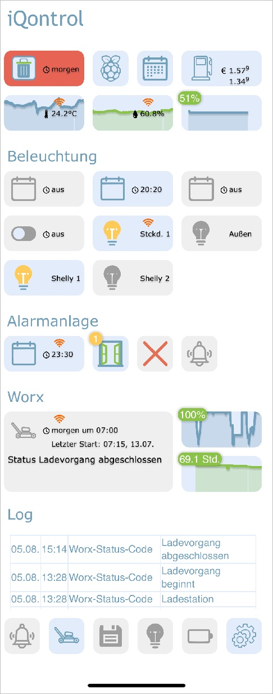
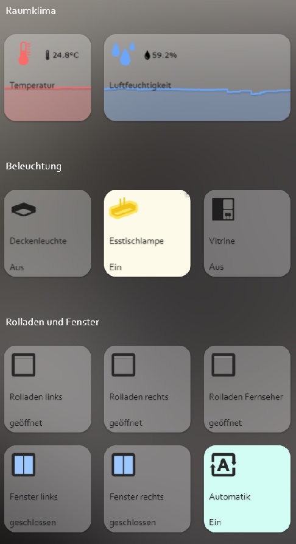
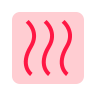

# IoBroker.iqontrol
**Tests:**

| Linux/Mac/Windows: | Browserübergreifende Prüfung: |
|---------------------------------------------------------------------------------------------------------------------------------------| --- |

****

## IQontrol-Adapter für ioBroker
Schnelle Web-App für Visualisierung.

    

© von dslraser:


© von muuulle:



© von peks-64:



Läuft in jedem Browser. Einfache Einrichtung, vollständig anpassbar und responsiv.

Dieser Adapter verwendet die Sentry-Bibliotheken, um Ausnahmen und Codefehler automatisch an die Entwickler zu melden. Weitere Informationen und Hinweise zum Deaktivieren der Fehlerberichterstattung finden Sie in Abschnitt [Sentry-Plugin-Dokumentation](https://github.com/ioBroker/plugin-sentry#plugin-sentry). Die Sentry-Berichterstattung wird ab js-controller 3.0 verwendet.

## Credits
Dieser Adapter wäre ohne die großartige Arbeit von @o0Shojo0o (https://github.com/o0Shojo0o), der frühere Versionen dieses Adapters entwickelt hat, nicht möglich gewesen.

## So melden Sie Probleme und Funktionswünsche
Idealerweise verwenden Sie hierfür GitHub-Issues. Die beste Methode hierfür ist, den Adapter in den Debug-Log-Modus zu versetzen (Instanzen → Expertenmodus → Spaltenprotokollierungsstufe). Laden Sie anschließend die Logdatei von der Festplatte über das ioBroker-Unterverzeichnis „log“ herunter, **nicht** über die Administrationsoberfläche, da dort Zeilen abgeschnitten werden.

## Video-Tutorial (Deutsche Sprache):
[](https://youtube.com/playlist?list=PL8epyNz8pGEv6-R8dnfXm-m5aBlZFKOBG)

## Zum Startbildschirm hinzufügen
Sie können es als Web-App auf dem Startbildschirm speichern, und es sieht aus und fühlt sich an wie eine native App: 

Dies funktioniert auch auf Ihrem PC mit Chrome:

* Öffnen Sie iQontrol in Chrome
* Klicken Sie auf das Drei-Punkte-Menü - Weitere Tools - Verknüpfung erstellen
Anschließend finden Sie iQontrol im Startmenü unter Chrome-Apps und können es sogar Ihrer Taskleiste hinzufügen.

## Du brauchst...
* Node.js 10 oder höher
* Web-Adapter mit einer Instanz, die dasselbe Protokoll (http oder https) wie der Admin-Adapter verwendet, socket.IO auf „integriert“ gesetzt und „Web-Sockets erzwingen“ deaktiviert.
* Falls dies zu Konflikten mit anderen Adaptern führt, fügen Sie einfach eine weitere Instanz mit den oben genannten Einstellungen hinzu - iQontrol sucht dann die am besten geeignete Webadapter-Instanz und verwendet diese für die Kommunikation.
* Für die Verbindung über *iobroker.pro-Cloud* müssen sowohl der Admin- als auch der Web-Adapter auf http (nicht https) eingestellt sein.

* Sollten Sie auf Probleme stoßen, lesen Sie bitte den Abschnitt [Fehlerbehebung](#Fehlerbehebung) am Ende dieser Readme-Datei.

## Forum
Besuchen Sie den Support-Thread [ioBroker-Forum](https://forum.iobroker.net/topic/52077).
Besuchen Sie den Entwickler-Thread [ioBroker-Forum](https://forum.iobroker.net/topic/22039).

## Wiki
Schau dir das Wiki [Wiki](https://github.com/sbormann/ioBroker.iqontrol/wiki) an.

## Wie man es benutzt
Lassen Sie sich von den vielen Optionen nicht abschrecken. Die meisten Funktionen sind sofort einsatzbereit. Sie *können*, müssen aber nicht alle Konfigurationsmöglichkeiten von iQontrol nutzen! Beginnen Sie einfach so:

* Beginnen Sie mit der Erstellung von Ansichten.

Man kann sich Ansichten wie so etwas wie eine Seite vorstellen.

* Erstellen Sie anschließend Geräte auf diesen Ansichten.

Geräte haben eine Rolle, die ihre Funktion, die verwendeten Symbole usw. bestimmt.
Abhängig von dieser Rolle können Sie dem Gerät verschiedene Zustände zuweisen. Diese verleihen dem Gerät seine Funktionalität.
Wenn Sie als Rolle „Mit anderer Ansicht verknüpfen“ auswählen, können Sie Verknüpfungen zu anderen Ansichten erstellen. Ich empfehle, die Verknüpfungen zu anderen Ansichten mit demselben Hintergrund wie die verknüpfte Ansicht zu gestalten.
Sie können auch versuchen, die Funktion „Automatisch erstellen“ zu verwenden, um ein vorhandenes Gerät aus dem iobroker-Objektbaum auszuwählen. Die automatische Erstellung versucht, die Rolle zu ermitteln und so viele Zustände wie möglich zuzuordnen.

Anschließend können Sie eine Symbolleiste erstellen, die als Fußzeile angezeigt wird.

Die Einträge in der Symbolleiste sind Links zu Ansichten.
Der erste Eintrag in der Symbolleiste ist Ihre „Startseite“, die beim Start geladen wird.

* Um dem Ganzen einen schicken Stil zu verleihen, können Sie Ihre eigenen Bilder hochladen.

Sie können Ihre Bilder als Hintergrundbilder für Ansichten oder Geräte verwenden.
Bilder im Ordner `/usericons` können als Symbole für Geräte verwendet werden.
Die kostenlosen, integrierten Demo-Hintergrundbilder stammen von www.pexels.com.

### Automatische Erstellung verwenden
* Im Tab „Ansichten“ finden Sie die Schaltfläche „Ansichten automatisch erstellen“.
* Wenn Sie gut gepflegte ioBroker-Enumerationen wie Rooms oder Functions haben, können Sie diese Funktion verwenden, um automatisch Views mit den in diesen Enumerationen aufgeführten Geräten zu erstellen.
* Beachten Sie, dass die automatische Erstellung aufgrund der Vielzahl unterschiedlicher Adapter und Geräte im ioBroker-Universum nicht alle Geräte vollständig korrekt unterstützen kann. Um optimale Ergebnisse zu erzielen, müssen Sie möglicherweise einige Einstellungen manuell anpassen. Die automatische Erstellung bietet Ihnen jedoch einen guten Ausgangspunkt, um Ihre eigene Visualisierung in Sekundenschnelle zu erstellen.

## URL-Parameter
* Das Frontend wird über `http[s]://<URL oder IP-Adresse von iobroker>:<Port des Webadapters>/iqontrol/index.html` aufgerufen.
* `<Port des Webadapters>` ist üblicherweise 8082
Um eine bestimmte Instanz zu öffnen, können Sie `namespace=iqontrol.<Instanznummer>` als URL-Parameter hinzufügen.
* Um eine bestimmte Ansicht zu öffnen, können Sie `renderView=<viewID>` als URL-Parameter hinzufügen.
* `<viewID>` muss wie folgt formatiert werden: `iqontrol.<instance-number>.Views.<view-name>`
* Hinweis: Hierbei ist Groß- und Kleinschreibung zu beachten!
Um eine bestimmte Ansicht als Startseite zu öffnen, können Sie `home=<viewID>` als URL-Parameter hinzufügen. Dadurch ändert sich auch die verlinkte Ansicht des ersten Eintrags in der Symbolleiste!
* `<viewID>` muss wie folgt formatiert werden: `iqontrol.<instance-number>.Views.<view-name>`
* Hinweis: Hierbei ist Groß- und Kleinschreibung zu beachten!
* Um beim Laden der Seite einen bestimmten Dialog zu öffnen, können Sie `openDialog=<Geräte-ID>` als URL-Parameter hinzufügen.
* `<deviceID>` muss wie folgt formatiert werden: `iqontrol.<instance-number>.Views.<view-name>.devices.<device-number>`, wobei `<device-number>` bei 0 beginnt (sodass das erste Gerät in einer Ansicht die Gerätenummer 0 hat).
* Hinweis: Hierbei ist Groß- und Kleinschreibung zu beachten!
* Um die Rückkehrzeit-Einstellungen festzulegen oder zu überschreiben, verwenden Sie die folgenden Parameter:
* Mit `returnAfterTimeTreshold=<Zeit in Sekunden>` legen Sie die Zeit fest, nach der die Zielansicht aufgerufen wird. Verwenden Sie `0`, um die Funktion „Rückkehr nach Zeit“ zu deaktivieren.
* Mit `returnAfterTimeDestiationView=<viewID>` wird die Ansicht festgelegt, die nach Erreichen des Schwellenwerts aufgerufen wird. Falls keine Ansicht angegeben wird, wird die Startseite verwendet.
* Diese Optionen sind hilfreich, wenn Sie iQontrol von einem an der Wand montierten Tablet aus aufrufen, das nach der Nutzung automatisch zur Startansicht zurückkehren sollte.
* Um die Seite ohne Symbolleiste zu laden, können Sie `noToolbar=true` hinzufügen.
* Um die Seite ohne Panel zu laden, können Sie `noPanel=true` hinzufügen.
* Um die Seite ohne Symbolleiste und Bedienfeld, mit deaktivierter Wischgeste, ohne Ladekreisel und mit transparentem Ladebildschirm zu laden, können Sie `isBackgroundView=true` hinzufügen.
* Normalerweise verwendet iQontrol die in ioBroker festgelegte Sprache. Sie können dies überschreiben, indem Sie `language=<xx>` hinzufügen.
* `<xx>` kann `de`, `en`, `es`, `fr`, `it`, `nl`, `pl`, `pt`, `ru` oder `zh-cn` sein.
* Wenn Ihre iQontrol-Instanz durch eine Passphrase geschützt ist (siehe Optionen - Passphrase-Schutz), können Sie die Passphrase durch Hinzufügen von `passphrase=<MeinePassphrase>' übermitteln.

**Beispiel:**

* `https://192.168.1.1:8082/iqontrol/index.html?namespace=iqontrol.1&home=iqontrol.1.Views.Living-Room`
* Beachten Sie die Groß- und Kleinschreibung.

## Schriftarten
* Sie können Ihre eigenen Schriftdateien im Tab „Bilder/Widgets“ in den Ordner „/userfonts“ hochladen.
* Im Optionsmenü gibt es mehrere Stellen, an denen diese Schriftarten ausgewählt werden können.
* Ob die Schriftart dem Browser korrekt präsentiert wird, hängt von den MIME-Einstellungen Ihres Servers ab - bei mir funktionierten .ttf und .woff am besten (getestet auf einem Raspberry Pi 4B).
Diese MIME-Einstellungen sollten funktionieren:
* .otf: `application/x-font-opentype`
* .ttf: `application/x-font-ttf` oder `application/x-font-truetype`
* .woff: `application/font-woff`
* .woff2: `application/font-woff2`
* .eot: `application/vnd.ms-fontobject`
* Sie können Schriftarten auf `fontsquirrel.com` unter dem Generator in andere Formate konvertieren.
* Bitte beachten Sie: Webfonts sind immer etwas knifflig und nicht jede Schriftart funktioniert mit jedem Server und jedem Browser.

## Symbole und Hintergrundbilder
Sie können die integrierten Bilder, die unter dem Reiter „Bilder“ hochgeladenen Bilder oder eine beliebige andere kostenlose URL verwenden.
* Sie können auch eine Variable innerhalb der Bild-URL verwenden. Dies kann beispielsweise für Wettervorhersagen nützlich sein. Verwenden Sie folgendes Muster:
* `path/to/firstloaded.png|anotherpath/to/{iobrokerstate|fallback}.png`
* Beispiel: `./../iqontrol.meta/userimages/demo/bottle.jpg|./../iqontrol.meta/userimages/demo/{javascript.0.myimage|whitestone}.jpg`
* Beim Öffnen der Ansicht wird die Datei `./../iqontrol.meta/userimages/demo/bottle.jpg` geladen.
Sobald der Zustand von `javascript.0.myimage` vom Server abgerufen wurde, wird das Bild durch `./../iqontrol.meta/userimages/demo/XXX.jpg` ersetzt, wobei `XXX` der Wert von `javascript.0.myimage` ist.
* Falls `javascript.0.myimage` keinen Wert hat, wird der Fallback `whitestone` verwendet (die Verwendung des Fallbacks ist optional).

### Fortschrittsbalken
* Es ist möglich, SVG-Definitionen in Kombination mit Variablen anstelle von Bilddateien zu verwenden, um Fortschrittsbalken anzuzeigen.
Es stehen einige integrierte Vorlagen zur Auswahl, Sie können aber auch Ihre eigenen SVGs erstellen.

 

Weitere Informationen finden Sie im [Wiki](https://github.com/sbormann/ioBroker.iqontrol/wiki/Progress-Bars).

### Diagramme
Sie können das „FLOT Chart-Widget“ als Hintergrund-URL für jedes Gerät hinzufügen. Dadurch wird der Hauptstatus automatisch als Diagramm im Hintergrund der Gerätekachel angezeigt.
* Sie müssen sicherstellen, dass der Status von einem der History-Adapter von ioBroker protokolliert und aufgezeichnet wird.


## Gerätenamen
* Genau wie Variablen in Bild-URLs können Sie Variablen in Gerätenamen verwenden. Die Syntax ist nahezu identisch:
* `Text während des Ladens|Text nach dem Laden {iobrokerstate|fallback}`
* Zusätzlich kann der iobroker-Status in eckige Klammern gesetzt werden; dann wird der einfache Wert ohne Einheit verwendet: `Text während des Ladens|Text nach dem Laden {[iobrokerstate]|fallback}`
* Beispiel: `Wetter wird geladen|Wetter: {javascript.0.weather|Keine Wetterdaten gefunden}`
* Beim Öffnen der Ansicht wird die Meldung „Wetter wird geladen“ angezeigt.
Sobald der Status von `javascript.0.weather` vom Server abgerufen wurde, wird der Text durch `Weather: XXX` ersetzt, wobei `XXX` der Wert von `javascript.0.weather` ist.
* Falls `javascript.0.weather` keinen Wert hat, wird der Fallback `Keine Wetterdaten gefunden` verwendet (die Verwendung des Fallbacks ist optional).

## Popup-Meldungen
* Jede Instanz erzeugt den Zustand `iqontrol.x.Popup.Message`
* Beim Übergeben von Werten an diesen Zustand wird auf allen **derzeit** geöffneten iQontrol-Frontends eine Popup-Meldung (oder ein Toast) angezeigt.
* Zusätzlich erzeugt jede Instanz den Zustand `iqontrol.x.Popup.PersistentMessage`
* Wenn Werte an diesen Zustand übergeben werden, wird die Popup-Nachricht im Array PERSISTENT_MESSAGES_PENDING gespeichert.
* Permanente Meldungen werden nicht nur auf allen aktuell geöffneten iQontrol-Frontends angezeigt, sondern auch auf allen **zukünftig** geöffneten Instanzen, bis sie (durch Klicken oder nach Ablauf der Zeit) bestätigt werden oder ablaufen.
* `PersistentExpires` definiert das Ablaufdatum der persistenten Nachricht als UNIX-Zeitstempel (Sekunden seit dem 1. Januar 1970, 00:00:00 Uhr). Werte unter 31536000 werden als Dauer in Sekunden ab jetzt interpretiert (31536000 Sekunden = 1 Jahr).
* `PersistentUndismissible` *Boolescher Wert* - Wenn dieser Wert auf „true“ gesetzt ist, bleibt die persistente Nachricht auch nach dem Schließen erhalten. Beim Öffnen einer neuen iQontrol-Instanz wird sie erneut angezeigt. Andernfalls werden persistente Nachrichten nach dem Schließen des Popups gelöscht (auch durch Klicken oder nach Ablauf der Anzeigedauer).
* `PersistentId` ist ein optionaler, beliebiger Ausdruck, der zur Identifizierung der Nachricht verwendet werden kann.
Die ID kann verwendet werden, um zugehörige Popup-Meldungen zu löschen, indem die ID an `PERSISTENT_MESSAGES_DELETE_ID` gesendet wird. Durch Senden von `null` an diesen Datenpunkt werden alle ausstehenden Meldungen entfernt.
Die ID kann auch verwendet werden, um entsprechende Popup-Meldungen auf allen aktuell geöffneten iQontrol-Instanzen erneut anzuzeigen, indem die ID an `PERSISTENT_MESSAGES_SHOW_ID` gesendet wird. Durch Senden von `null` an diesen Datenpunkt werden alle ausstehenden Meldungen angezeigt.
* **Hinweis**: Sie können eine Nachricht nur an einen der beiden Datenpunkte „Message“ oder „PersistentMessage“ senden, nicht an beide.
* Sie können HTML-Tags verwenden, um den Nachrichtentext zu formatieren.
* Es gibt einige zusätzliche Zustände zur weiteren Anpassung des angezeigten Popups (diese müssen festgelegt werden, bevor der Nachrichtendatenpunkt festgelegt wird):
* `Dauer`: Dies ist die Zeit in Millisekunden, die die Nachricht angezeigt wird; wenn der Wert auf 0 gesetzt ist, muss die Nachricht bestätigt werden.
* `ClickedValue` und `ClickedDestinationState`: Wenn der Benutzer auf das Popup klickt, wird der Wert von `ClickedValue` an `iqontrol.x.Popup.POPUP_CLICKED` und, falls angegeben, zusätzlich zum Datenpunkt in `ClickedDestinationState` gesendet.
* Wenn kein Wert angegeben wird, wird `true` verwendet.
* `ClickKeepsOpen` *Boolescher Wert* - Wenn „true“, kann das Popup nur durch Klicken auf eine Schaltfläche geschlossen werden. Ein Klick auf das Popup selbst schließt es nicht. Fügen Sie daher Ihrer Popup-Nachricht unbedingt Schaltflächen hinzu, wie unten beschrieben.
* `ButtonNames`: Hier können Sie eine durch Kommas getrennte Liste von Schaltflächen angeben, die am unteren Rand des Popups angezeigt werden (z. B. "OK,Abbrechen").
* `ButtonValues` und `ButtonDestinationStates`: Dies sind durch Kommas getrennte Listen von Werten, die an `iqontrol.x.Popup.BUTTON_CLICKED` gesendet werden und, falls angegeben, zusätzlich zum Datenpunkt in `ButtonDestinationStates`, wenn der Benutzer auf die entsprechende Schaltfläche klickt.
Anstelle eines Datenpunkts können Sie die Befehle `COMMAND:renderView` und `COMMAND:openDialog` als ButtonDestinationState verwenden, um eine Ansicht zu rendern oder einen Dialog zu öffnen.
* Der ButtonValue gibt dann die Ansicht bzw. den Dialog an und muss im Format `iqontrol.<instance-number>.Views.<view-name>` bzw. `iqontrol.<instance-number>.Views.<view-name>.devices.<device-number>` vorliegen, wobei `<device-number>` bei 0 beginnt (das erste Gerät in einer Ansicht hat also die Gerätenummer 0).
* Wenn Sie nur einen Wert verwenden (anstatt einer durch Kommas getrennten Liste), wird dieser Wert für alle Schaltflächen verwendet.
* Wenn Sie `ButtonValues` leer lassen, wird der Name der Schaltfläche verwendet.
* Wenn Sie nur einen Zielzustand verwenden (anstatt einer durch Kommas getrennten Liste), wird dieser Zustand für alle Schaltflächen verwendet.
* `ButtonCloses`: Dies ist eine durch Kommas getrennte Liste von booleschen Werten (`true`/`false`), die angeben, ob das Popup beim Drücken der entsprechenden Schaltfläche geschlossen werden soll.
* `ButtonClears`: Dies ist eine durch Kommas getrennte Liste von booleschen Werten (`true`/`false`), die angeben, ob die Popup-Einstellungen gelöscht werden sollen (= alle Popup-Zustände auf leer gesetzt werden), wenn die entsprechende Schaltfläche gedrückt wird.
* Alternativ können Sie diese Werte über den Befehl sendTo mit den Parametern `PopupMessage`, `PopupDuration`, `PopupClickedValue` usw. festlegen.
* Beispiel: `sendTo("iqontrol", "send", {PopupMessage: 'Dies ist meine Nachricht', PopupDuration: 2500, PopupClickedValue: 'messageConfirmed'});`
* Sie können Blockly auch verwenden, um Nachrichten an iQontrol zu senden.

 

## Widgets
* Jede Kachel verfügt über eine BACKGROUND_URL und einen BACKGROUND_HTML-Datenpunkt.
Hier können Sie einen Link (über BACKGROUND_URL) zu einer Website definieren oder direkten HTML-Code (über BACKGROUND_HTML) einfügen, der als Hintergrund der Kachel angezeigt wird.
* Dies gibt Ihnen die Möglichkeit, (interaktive) Inhalte in einer Kachel zu platzieren (wie Uhren, FLOT-Diagramme, Tabellen, Wettervorhersagen usw.).
* Standardmäßig werden Mausereignisse an diesen Inhalt weitergeleitet (daher können Sie nicht mehr auf die Kachel selbst klicken), dies kann jedoch mit der Option "Mausereignisse an die Kachel statt an den Inhalt von BACKGROUND_VIEW/URL/HTML weiterleiten" deaktiviert werden.
iQontrol bietet die Geräterolle „Widget“ mit vordefinierten Optionen, die hauptsächlich beim Anzeigen einer Website als Widget verwendet werden. Sie können jedoch dasselbe Ergebnis mit jeder anderen Rolle erzielen, indem Sie die Geräteoptionen entsprechend anpassen.


<details> <summary>Widget-Entwicklung (nur für Experten): (<ins>zum Öffnen klicken</ins>)</summary>

### JQuery
* Technisch gesehen wird der Inhalt von BACKGROUND_VIEW/URL/HTML in ein HTML-Element namens iframe eingebettet, das eine Webseite innerhalb einer Webseite darstellt.
* Um jQuery zu verwenden, können Sie es mit folgendem Code von iQontrol in den iFrame übertragen:

``window.$=window.jQuery=parent.jQuery.extend(function(s){return parent.jQuery(s,document)},parent.jQuery);``

* Beispiel:

	```html
	<!doctype html>
	<html>
	<head>
		<meta http-equiv="Content-Type" content="text/html; charset=UTF-8"/>
		<meta name="widget-description" content="This is a demo widget-preset. It has no useful funcion. (C) by Sebastian Bormann"/>
		<meta name="widget-options" content="{'noZoomOnHover': 'true', 'hideDeviceName': 'true', 'sizeInactive': 'xwideIfInactive highIfInactive', 'iconNoPointerEventsInactive': 'true', 'hideDeviceNameIfInactive': 'true', 'hideStateIfInactive': 'true', 'sizeActive': 'fullWidthIfActive fullHeightIfActive', 'bigIconActive': 'true', 'iconNoPointerEventsActive': 'true', 'hideDeviceNameIfActive': 'true', 'hideStateIfActive': 'true', 'sizeEnlarged': 'fullWidthIfEnlarged fullHeightIfEnlarged', 'bigIconEnlarged': 'true', 'iconNoPointerEventsEnlarged': 'false', 'noOverlayEnlarged': 'true', 'hideDeviceNameIfEnlarged': 'true', 'hideStateIfEnlarged': 'true', 'popupAllowPostMessage': 'true', 'backgroundURLAllowPostMessage': 'true', 'backgroundURLNoPointerEvents': 'false'}"/>
		<title>iQontrol Widget Test</title>
	</head>
	<body>
		<div id="testDiv">Loading...</div>
		<script type="text/javascript">
			console.log("JQUERY-TEST");
			window.$=window.jQuery=parent.jQuery.extend(function(s){return parent.jQuery(s,document)},parent.jQuery);
			$(document).ready(function(){
				$('#testDiv').html("<h1>Hello World</h1)");
				console.log("jQuery works!!");
			});
		</script>
	</body>
	</html>
	```

### PostMessage-Kommunikation
* Durch Aktivieren der Option „PostMessage-Kommunikation für BACKGROUND_VIEW/URL/HTML zulassen“ können Sie die PostMessage-Kommunikation zwischen dem Widget in seinem iFrame und iQontrol selbst aktivieren.
* Um Befehle an iQontrol zu senden, können Sie den folgenden JavaScript-Befehl verwenden: `window.parent.postMessage(message, "*");`
* `message` ist ein JavaScript-Objekt im Format `{ command: command, stateId: stateId, value: value }`
* Folgende Nachrichtenbefehle werden unterstützt:
* `{ command: "setWidgetState", stateId: <widgetStateId>, value: <value> }`
* Dadurch wird der ioBroker-Status `iqontrol.<instance>.Widgets.<widgetStateId>` auf den Wert `<value>` gesetzt (`<value>` kann eine Zeichenkette, eine Zahl, ein boolescher Wert oder ein Objekt wie `{ val: <value>, ack: true|false }` sein).
* `{ command: "getWidgetState", stateId: <widgetStateId> }`
* Dies veranlasst iQontrol, den Wert des ioBroker-Status `iqontrol.<instance>.Widgets.<widgetStateId>` zu senden (siehe unten, wie Sie die Antwortnachricht empfangen).
* `{ command: "getWidgetStateSubscribed", stateId: <widgetStateId> }`
* Dies bewirkt, dass iQontrol den Wert des ioBroker-Status `iqontrol.<instance>.Widgets.<widgetStateId>` jetzt und jedes Mal sendet, wenn sich sein Wert ändert (siehe unten, wie Sie die Antwortnachrichten empfangen).
* `{ command: "setWidgetDeviceState", stateId: <widgetDeviceState>, value: <value> }`
* Dadurch wird der ioBroker-Datenpunkt, der dem Gerätestatus `<widgetDeviceState>` zugewiesen ist (z. B. der Datenpunkt, der LEVEL zugewiesen ist), auf den Wert `<value>` gesetzt (`<value>` kann eine Zeichenkette, eine Zahl, ein boolescher Wert oder ein Objekt wie `{ val: <value>, ack: true|false }` sein).
* `{ command: "getWidgetDeviceState", stateId: <widgetDeviceState> }`
* Dadurch sendet iQontrol den Wert des ioBroker-Datenpunkts, der dem Gerätestatus `<widgetDeviceState>` zugewiesen ist (z. B. den Datenpunkt, der LEVEL zugewiesen ist; siehe unten, wie Sie die Antwortnachricht empfangen).
* `{ command: "getWidgetDeviceStateSubscribed", stateId: <widgetDeviceState> }`
* Dies veranlasst iQontrol, den Wert des ioBroker-Datenpunkts, der dem Gerätestatus `<widgetDeviceState>` zugewiesen ist (z. B. den Datenpunkt, der LEVEL zugewiesen ist), jetzt und jedes Mal zu senden, wenn sich sein Wert ändert (siehe unten, wie Sie die Antwortnachricht empfangen).
* `{ command: "setState", stateId: <stateId>, value: <value> }`
* Dadurch wird der ioBroker-Status `<stateId>` auf den Wert `<value>` gesetzt (`<value>` kann eine Zeichenkette, eine Zahl, ein boolescher Wert oder ein Objekt wie `{ val: <value>, ack: true|false }` sein).
* `{ command: "getState", stateId: <stateId> }`
* Dies veranlasst iQontrol, den Wert des ioBroker-Status `<stateId>` zu senden (siehe unten, wie Sie die Antwortnachricht empfangen).
* `{ command: "getStateSubscribed", stateId: <stateId> }`
* Dies führt dazu, dass iQontrol den Wert des ioBroker-Status `<stateId>` jetzt und jedes Mal sendet, wenn sich sein Wert ändert (siehe unten, wie Sie die Antwortnachrichten empfangen).
* `{ command: "getOptions"}`
Dies veranlasst iQontrol, dem Benutzer die vom Benutzer als Objekt konfigurierten Optionen zu senden.
* `{ command: "renderView", value: <viewID> }`
* Dies weist iQontrol an, eine Ansicht zu rendern, wobei `<viewID>` wie folgt formatiert werden muss: `iqontrol.<instance-number>.Views.<view-name>` (Groß-/Kleinschreibung beachten).
* `{ command: "openDialog", value: <deviceID> }`
* Dies weist iQontrol an, einen Dialog zu öffnen, in dem `<deviceID>` wie folgt formatiert werden muss: `iqontrol.<instance-number>.Views.<view-name>.devices.<device-number>`, wobei `<device-number>` bei 0 beginnt (sodass das erste Gerät in einer Ansicht die Gerätenummer 0 hat).
* Um Nachrichten von iQontrol zu empfangen, müssen Sie einen Event-Listener für das "message"-Ereignis mit dem JavaScript-Befehl `window.addEventListener("message", receivePostMessage, false);` registrieren.
* Die Funktion `receivePostMessage` empfängt das Objekt `event`
* `event.data` enthält die Nachricht von iqontrol, die ein Objekt wie folgt sein wird:
* event.data = `{ command: "getState", stateId: <stateId>, value: <stateObject> }` - dies ist die Antwort auf einen `getState`-Befehl oder einen `getStateSubscribed`-Befehl und liefert Ihnen das tatsächliche `<value>`-Objekt des ioBroker-Status.`<stateId>`
* `<stateObject>` selbst ist ein Objekt wie

			```
			event.data.value = {
				val: <value (rounded)>,
				unit: "<unit>",
				valFull: <value (not rounded, no javascript-injection prevention)>,
				plainText: "<clear text of val, for example taken from valuelist>",
				min: <minimum>,
				max: <maximum>,
				step: <step-width>,
				valuelist: {<object with possible values and corresponding clear text>},
				targetValues: {<target value list>},
				ack: <true|false>,
				readonly: <true|false>,
				custom: {<object with custom settings>},
				id: <id of the iobroker datapoint>,
				from: "<source of state>",
				lc: <timestamp of last change>,
				ts: <timestamp of last actualization>,
				q: <quality of signal>,
				role: "<role of state>",
				type: "<string|number|boolean>",
				name: "<name of datapoint>",
				desc: "<description of datapoint>",
				Date: <Date-object (only present, if value is regognized as a valid time or period)>
			}
			```

* Um iQontrol anzuweisen, einen widgetState unter `iqontrol.<instance>.Widgets` zu generieren, können Sie ein Meta-Tag im Head-Bereich der Widget-Website verwenden:
* Syntax:

```
<meta name="widget-datapoint" content="WidgetName.StateName" data-type="string" data-role="text" />
```

* Sie können den Datenpunkt weiter konfigurieren, indem Sie die Attribute Datentyp (Zeichenkette, Zahl oder Boolescher Wert), Datenrolle, Datenname, minimales Datenvolumen, maximales Datenvolumen, Datendefinition und Dateneinheit verwenden.
* Sie können auch einen URL-Parameter (siehe unten) als Variable verwenden, zum Beispiel um unterschiedliche Instanzen der Widgets mit jeweils eigenen Datenpunkten zu erstellen.
Die Syntax lautet dann:

		  ```
          <meta name="widget-datapoint" content="WidgetName.StateName|WidgetName.{instance}.StateName" data-type="string" data-role="text" />
          ```

* Wenn die Variable `instance` gesetzt ist, wird der Teil nach dem `|` als widgetState-Name verwendet und `{instance}` durch den Wert von `instance` ersetzt.
* Wenn die Variable `instance` nicht gesetzt ist, wird der Teil vor dem `|` als `wigdetState`-Name verwendet.
Der entsprechende Datenpunkt wird nur dann erstellt, wenn die Widget-Website einem Gerät als URL oder BACKGROUND_URL hinzugefügt wird.
* Das gleiche Konzept kann für die URL/den HTML-Status verwendet werden, der dazu dient, eine Website im Dialog eines Geräts anzuzeigen.
* Um ein Symbol für Ihr Widget zu erstellen, legen Sie eine .png-Datei mit demselben Dateinamen wie das Widget in das Widget-Verzeichnis.
* Ein Beispiel für eine Widget-Website finden Sie unten:

<details> <summary>Beispiel-Widget-Website anzeigen, die als Widget mit postMessage-Kommunikation angezeigt werden soll: (<ins>zum Öffnen klicken</ins>)</summary>

* Sie können den folgenden HTML-Code verwenden und ihn in den BACKGROUND_HTML-State eines Widgets kopieren (das dann als "Konstante" konfiguriert werden muss).
* Alternativ können Sie diesen Code als HTML-Datei in das Unterverzeichnis `/userwidgets` hochladen und ihn in BACKGROUND_URL-State referenzieren (das dann ebenfalls als "Konstante" konfiguriert werden muss).
* Aktivieren Sie die Option "Allow postMessage-Communication for BACKGROUND_VIEW/URL/HTML"
* Es wird demonstriert, wie eine bidirektionale Kommunikation zwischen der Website und iQontrol funktioniert.

```html
<!doctype html>
<html>
<head>
	<meta http-equiv="Content-Type" content="text/html; charset=UTF-8"/>
	<meta name="widget-datapoint" content="postMessageTest.test" data-type="string" data-role="text" />
	<meta name="widget-description" content="This is a test widget. To get the WidgetDeviceState-Functions working, please set a valid iobroker-datapoint for STATE. (C) by Sebastian Bormann"/>
	<meta name="widget-urlparameters" content="title/postMessageTest/Please enter a title">
	<meta name="widget-options" content="{'noZoomOnHover': 'true', 'hideDeviceName': 'true', 'sizeInactive': 'xwideIfInactive highIfInactive', 'iconNoPointerEventsInactive': 'true', 'hideDeviceNameIfInactive': 'true', 'hideStateIfInactive': 'true', 'sizeActive': 'xwideIfActive highIfActive', 'bigIconActive': 'true', 'iconNoPointerEventsActive': 'true', 'hideDeviceNameIfActive': 'true', 'hideStateIfActive': 'true', 'sizeEnlarged': 'fullWidthIfEnlarged fullHeightIfEnlarged', 'bigIconEnlarged': 'true', 'iconNoPointerEventsEnlarged': 'false', 'noOverlayEnlarged': 'true', 'hideDeviceNameIfEnlarged': 'true', 'hideStateIfEnlarged': 'true', 'popupAllowPostMessage': 'true', 'backgroundURLAllowPostMessage': 'true', 'backgroundURLNoPointerEvents': 'false'}"/>
 	<title>iQontrol postMessageTest</title>
</head>
<body>
	<br><br>
	<h3><span id="title">postMessageTest</span><h3>
	<button onclick="getWidgetState('postMessageTest.test')">getWidgetState postMessageTest.test</button><br>
	<button onclick="getWidgetStateSubscribed('postMessageTest.test')">getWidgetStateSubscribed postMessageTest.test</button><br>
	<button onclick="setWidgetState('postMessageTest.test', 'Hello world')">setWidgetState postMessageTest.test to 'Hello world'</button><br>
  	<br>
	<button onclick="getWidgetDeviceState('STATE')">getWidgetDeviceState STATE</button><br>
	<button onclick="getWidgetDeviceStateSubscribed('STATE')">getWidgetDeviceStateSubscribed STATE</button><br>
	<button onclick="setWidgetDeviceState('STATE', 'Hello world')">setWidgetDeviceState STATE to 'Hello world'</button><br>
  	<br>
	<button onclick="getState('system.adapter.admin.0.cpu')">getState system.adapter.admin.0.cpu</button><br>
	<button onclick="getStateSubscribed('system.adapter.admin.0.uptime')">getStateSubscribed system.adapter.admin.0.uptime</button><br>
	<button onclick="setState('iqontrol.0.Popup.Message', 'Hey, this is a test Message')">setState popup message</button><br>
  	<br>
	<button onclick="renderView('iqontrol.0.Views.Home')">renderView 'Home'</button><br>
	<button onclick="openDialog('iqontrol.0.Views.Home.devices.0')">openDialog 1st device on 'Home'</button><br>
	<br><hr>
	message sent: <span id="messageSent">-</span><br>
	<br><hr>
	message received: <span id="messageReceived">-</span><br>
	<br><hr>
	this means: <span id="thisMeans">-</span><br>
	<br><hr>
    <script type="text/javascript">
		var countSend = 0;
		var countReceived = 0;

		//Set title from UrlParameter
		document.getElementById('title').innerHTML = getUrlParameter('title') || "No Title set";

		//getWidgetState
		function getWidgetState(stateId){
			sendPostMessage("getWidgetState", stateId);
		}

		//getWidgetStateSubscribed (this means, everytime the state changes, an update will be received)
		function getWidgetStateSubscribed(stateId){
			sendPostMessage("getWidgetStateSubscribed", stateId);
		}

		//setWidgetState
		function setWidgetState(stateId, value){
			sendPostMessage("setWidgetState", stateId, value);
		}


		//getWidgetDeviceState
		function getWidgetDeviceState(stateId){
			sendPostMessage("getWidgetDeviceState", stateId);
		}

		//getWidgetDeviceStateSubscribed (this means, everytime the state changes, an update will be received)
		function getWidgetDeviceStateSubscribed(stateId){
			sendPostMessage("getWidgetDeviceStateSubscribed", stateId);
		}

		//setWidgetDeviceState
		function setWidgetDeviceState(stateId, value){
			sendPostMessage("setWidgetDeviceState", stateId, value);
		}


		//getState
		function getState(stateId){
			sendPostMessage("getState", stateId);
		}

		//getStateSubscribed (this means, everytime the state changes, an update will be received)
		function getStateSubscribed(stateId){
			sendPostMessage("getStateSubscribed", stateId);
		}

		//setState
		function setState(stateId, value){
			sendPostMessage("setState", stateId, value);
		}


		//renderView
		function renderView(viewId){
			sendPostMessage("renderView", null, viewId);
		}

		//openDialog
		function openDialog(deviceId){
			sendPostMessage("openDialog", null, deviceId);
		}

		// +++++ Default Functions +++++
		//getUrlParameter
		function getUrlParameter(name) {
			name = name.replace(/[\[]/, '\\[').replace(/[\]]/, '\\]');
			var regex = new RegExp('[\\?&]' + name + '=([^&#]*)');
			var results = regex.exec(location.search);
			return results === null ? null : decodeURIComponent(results[1].replace(/\+/g, ' '));
		};

		//send postMessages
		function sendPostMessage(command, stateId, value){
			countSend++;
			message = { command: command, stateId: stateId, value: value };
			document.getElementById('messageSent').innerHTML = countSend + " - " + JSON.stringify(message);
			window.parent.postMessage(message, "*");
		}

		//receive postMessages
		window.addEventListener("message", receivePostMessage, false);
		function receivePostMessage(event) { //event = {data: message data, origin: URL of origin, source: id of sending element}
			countReceived++;
			if(event.data) document.getElementById('messageReceived').innerHTML = countReceived + " - " + JSON.stringify(event.data);
			if(event.data && event.data.command) switch(event.data.command){
				case "getState":
				if(event.data.stateId && event.data.value && event.data.value.val){
					document.getElementById('thisMeans').innerHTML = "Got State " + event.data.stateId + " with value " + event.data.value.val;
				}
				break;
			}
		}
	</script>
</body>
</html>
```

</details>

### Weitere Konfiguration der Widgets
* Es gibt zusätzliche Meta-Tags, die Sie im Head-Bereich Ihrer Widget-Website verwenden können, um das Verhalten des Widgets zu konfigurieren:
* `widget-description`
* Syntax:

		  ```  
          <meta name="widget-description" content="Please see www.mywebsite.com for further informations. (C) by me"/>
          ```

* Der Inhalt wird angezeigt, wenn Sie das Widget als URL oder BACKGROUND_URL auswählen oder wenn Sie ein Widget automatisch erstellen.
* `widget-urlparameters`
* Syntax:

		  ```
          <meta name="widget-urlparameters" content="parameter/default value/description/type;parameter2/default value2/description2/type2"/>
          ```

Der Benutzer wird nach diesen Parametern gefragt, wenn er das Widget als URL oder BACKGROUND_URL auswählt oder ein Widget automatisch erstellt.
* `type` ist optional und kann `text` (Standard), `number`, `checkbox`, `color`, `select`, `multipleSelect`, `combobox`, `historyInstance`, `datapoint`, `listJsonDatapoint`, `icon`, `fontFamily`, `fontSize`, `fontStyle`, `fontWeight`, `language`, `section`, `divider`, `info`, `link` oder `hidden` sein.
* Wenn der Typ `select`, `multipleSelect` oder `combobox` ist, müssen Sie die möglichen Optionen durch Hinzufügen von `/<selectOptions>` angeben, wobei `<selectOptions>` eine Zeichenkette im Format `<value1>,<caption1>/<value2>,<caption2>/...` ist (combobox ist eine Auswahlliste mit der Möglichkeit, Freitext einzugeben).
* Wenn der Typ `number` ist, können Minimum, Maximum und Schrittweite durch Hinzufügen von `/<numberOptions>` angegeben werden, wobei `<numberOptions>` eine Zeichenkette im Format `<min>,<max>,<step>` ist.
Die Typen `section`, `divider`, `info` und `link` haben keine weitere Funktion; sie dienen lediglich der Anzeige von Informationen für den Benutzer. Für `link` muss der Wert eine URL sein, wobei alle Schrägstriche durch Backslashes ersetzt werden müssen.
Der Typ `hidden` wird an das Widget übergeben, es wird jedoch kein Konfigurationsdialog angezeigt.
* Alle diese Parameter werden der Widget-Website über eine URL-Parameterzeichenfolge übergeben (wie z. B. `widget.html?parameter=value&parameter2=value2`).
* Sie können diese Einstellungen innerhalb Ihrer Widget-Website verwenden, indem Sie die URL-Parameter mit einer Funktion wie dieser anfordern:

			```
			function getUrlParameter(name) {
				name = name.replace(/[\[]/, '\\[').replace(/[\]]/, '\\]');
				var regex = new RegExp('[\\?&]' + name + '=([^&#]*)');
				var results = regex.exec(location.search);
				return results === null ? null : decodeURIComponent(results[1].replace(/\+/g, ' '));
			};
			```

* Wenn Sie den Typ `icon` als URL-Parameter verwendet haben, erhalten Sie entweder einen Pfad relativ zum iqontrol-Verzeichnis oder einen absoluten Pfad zu einem Bild. Um einen gültigen Link zu Ihrem Bild zu erstellen, können Sie folgenden Code verwenden:

			    ```
				var iconOn = getUrlParameter('iconOn') || './images/icons/switch_on.png';
				if(iconOn.indexOf('http') != 0) iconOn = '/iqontrol/' + iconOn;
				```

* `widget-options`
* Syntax:

		  ```
          <meta name="widget-options" content="{'noZoomOnHover': 'true', 'hideDeviceName': 'true'}"/>
          ```

* Im untenstehenden ausklappbaren Abschnitt finden Sie die möglichen Optionen, die über dieses Meta-Tag konfiguriert werden können.

* `widget-replaceurl`
* Syntax:

```
<meta name="widget-replaceurl" content="<url>" data-absolute="<true|false>"/>

* Dadurch wird die verwendete URL/BACKGROUND_URL für dieses Widget neu konfiguriert (auf diese Weise können Sie Widget-Voreinstellungen definieren, die dem Benutzer spezielle oder vereinfachte Konfigurationen bieten). Beim Aufruf des Widgets verwendet iQontrol jedoch die angegebene `<url>` anstelle der ursprünglichen URL.
Standardmäßig wird nur der Dateiname (mit Dateiendung) ersetzt. Bei der Einstellung `data-absolute=`true`` wird die gesamte URL ersetzt.

<details> <summary>Mögliche Optionen anzeigen, die über das Meta-Tag 'widget-options' konfiguriert werden können: (<ins>zum Öffnen klicken</ins>)</summary>

* Symbole:
* `icon_on` (Symbol an):
		* Standard: ""
* `icon_off` (Symbol aus):
		* Standard: ""
* Gerätespezifische Optionen:
* `showState` (Status anzeigen) - nur gültig für die Rollen Button und Program:
* Mögliche Werte: `true`|`false`
* Standardwert: `false`
* `showPowerAsState: ` (Stromversorgung als Status anzeigen) - nur gültig für die Rollen Schalter, Licht und Ventilator:
* Mögliche Werte: `true`|`false`
* Standardwert: `false`
* `buttonCaption` (Beschriftung für Schaltfläche) - nur gültig für die Rolle Schaltfläche:
		* Standard: ""
* `returnToOffSetValueAfter` (Rückkehr zu 'OFF_SET_VALUE' nach [ms]) - nur gültig für die Rolle Button:
* Mögliche Werte: Zahl von 10 bis 60000
		* Standard: ""
* `alwaysSendTrue` (Immer 'true' senden (nicht umschalten)) - nur gültig für die Rolle Szene:
* Mögliche Werte: `true`|`false`
* Standardwert: `false`
* `closeDialogAfterExecution` (Dialog nach Ausführung schließen) - nur gültig für die Rollen Button, Program und Scene:
* Mögliche Werte: `true`|`false`
* Standardwert: `false`
* `invertCt` (CT invertieren (Kelvin statt Mired verwenden)) - nur gültig für die Rolle Light:
* Mögliche Werte: `true`|`false`
* Standardwert: `false`
* `alternativeColorspace` (Farbraum für ALTERNATIVE_COLORSPACE_VALUE") - nur gültig für die Rolle Light:
* Mögliche Werte: ""|"RGB"|"#RGB"|"RGBW"|"#RGBW"|"RGBWWCW"|"#RGBWWCW"|"RGBCWWW"|"#RGBCWWW"|"RGB_HUEONLY"|"#RGB_HUEONLY"|"HUE_MILIGHT"|"HHSSBB_TUYA"
		* Standard: ""
* `linkOverlayActiveColorToHue` (Lampenfarbe als OVERLAY_ACTIVE_COLOR verwenden) - nur gültig für die Rolle „Licht“:
* Mögliche Werte: `true`|`false`
* Standardwert: `false`
* `linkGlowActiveColorToHue` (Lampenfarbe als GLOW_ACTIVE_COLOR verwenden) - nur gültig für die Rolle Light:
* Mögliche Werte: `true`|`false`
* Standardwert: `false`
* `controlModeDisabledValue` (Wert von CONTROL_MODE für 'deaktiviert') - nur gültig für die Rollen Thermostat, Homematic-Thermostat und Homematic IP-Thermostat:
		* Standard: ""
* `valveStatesSectionType` (Darstellung von VALVE_STATES) - nur gültig für die Rollen Thermostat, Homematic-Thermostat und Homematic IP-Thermostat:
* Mögliche Werte: `true`|`false` `none`|`none noCaption`|`collapsible`|`collapsible open`
* Standardeinstellung: "zusammenklappbar"
* `stateClosedValue` (Wert von STATE für 'geschlossen') - nur gültig für die Rolle Fenster und Tür mit Schloss:
		* Standard: ""
* `stateOpenedValue` (Wert von STATE für 'geöffnet') - nur gültig für die Rolle Window:
		* Standard: ""
* `stateTiltedValue` (Wert von STATE für 'tilted') - nur gültig für die Rolle Window:
		* Standard: ""
* `lockStateLockedValue` (Wert von LOCK_STATE für 'gesperrt') - nur gültig für die Rolle Tür mit Schloss:
		* Standard: ""
* `lockOpenValue` (Wert von LOCK_OPEN für 'Tür öffnen') - nur gültig für die Rolle Tür mit Schloss:
		* Standard: ""
* `invertActuatorLevel` (LEVEL umkehren (0 = offen)) - nur gültig für die Rolle Blind:
* Mögliche Werte: `true`|`false`
* Standardwert: `false`
* `directionOpeningValue` (Wert von DIRECTION für 'opening') - nur gültig für die Rolle Window:
* Standardwert: "1"
* `directionClosingValue` (Wert von DIRECTION für 'Schließen') - nur gültig für die Rolle Window:
* Standardwert: "2"
* `directionUncertainValue` (Wert von DIRECTION für 'unsicher') - nur gültig für die Rolle Window:
* Standardwert: "3"
* `favoritePositionCaption` (Beschriftung für FAVORITE_POSITION) - nur gültig für die Rolle Window:
* Standard: "Lieblingsposition"
* `stopCaption` (Untertitel für STOP) - nur gültig für die Rolle Fenster:
* Standardwert: "Stop"
* `upCaption` (Untertitel für UP) - nur gültig für die Rolle Window:
* Standardeinstellung: "Unten"
* `downCaption` (Beschriftung für DOWN) - nur gültig für die Rolle Window:
* Standardeinstellung: "Unten"
* `noConfirmationForTogglingViaIcon` (Keine Bestätigung beim Umschalten über das Symbol anfordern) - nur gültig für die Rolle Garagentor:
* Standardwert: "false"
* Mögliche Werte: `true`|`false`
* `controlModeDisarmedValue` (Wert von CONTROL_MODE für 'disarmed') - nur gültig für die Rolle Alarm:
* Standardwert: "0"
* `showStateAndLevelSeparatelyInTile` (Status und Level separat in der Kachel anzeigen) - nur gültig für die Rolle Wert:
* Mögliche Werte: ""|"devidedByComma"|"devidedByComma preceedCaptions"|"devidedBySemicolon"|"devidedBySemicolon preceedCaptions"|"devidedByHyphen"|"devidedByHyphen preceedCaptions"
		* Standard: ""
* `timeCaption` (Beschriftung für ZEIT) - nur gültig für die Rolle DateAndTime:
		* Standard: ""
* `timeFormat` (Format der ZEIT (wie im Datenpunkt gespeichert, siehe Readme)) - nur gültig für die Rolle DateAndTime:
* Standardwert: "x"
* `timeDisplayFormat` (Anzeigeformat der ZEIT (wie sie angezeigt werden soll, siehe Readme)) - nur gültig für die Rolle DateAndTime:
* Standard: "dddd, DD.MM.YYYY HH:mm:ss"
* `timeDisplayDontShowDistance` (Entfernung anzeigen) - nur gültig für die Rolle DateAndTime:
* Mögliche Werte: ""|`false`|`true`
* Standardwert: "" (Dies bedeutet, benutzerdefinierte Datenpunkteinstellungen verwenden)
* `dateAndTimeTileActiveConditions` (Die Kachel ist aktiv, wenn alle ausgewählten Elemente wahr sind) - nur gültig für die Rolle DateAndTime:
* Mögliche Werte (Array): "activeIfStateActive", "activeIfTimeNotZero", "activeIfTimeInFuture", "activeIfTimeInPast"
* Standardwert: "activeIfStateActive,activeIfTimeInFuture"
* `dateAndTimeTileActiveWhenRinging` (Die Kachel ist immer aktiv, wenn RINGING aktiv ist) - nur gültig für die Rolle DateAndTime:
* Standardwert: true
* `dateAndTimeShowInState` (Status anzeigen) - nur gültig für die Rolle DateAndTime:
* Mögliche Werte (Array): "showStateIfInactive", "showStateIfActive", "showSubjectIfActive", "showSubjectIfInactive", "showTimeIfInactiveAndInPast", "showTimeIfInactiveAndInFuture", "showTimeIfActiveAndInPast", "showTimeIfActiveAndInFuture", "showTimeDistanceIfInactiveAndInPast", "showTimeDistanceIfInactiveAndInFuture", "showTimeDistanceIfActiveAndInPast", "showTimeDistanceIfActiveAndInFuture"
* Standard: "showStateIfInactive,showSubjectIfActive,showTimeDistanceIfActiveAndInFuture"
* `coverImageReloadDelay` (Verzögerung des Neuladens des Titelbildes [ms]) - nur gültig für die Rolle Media:
* Mögliche Werte: Zahl von 0 bis 5000
		* Standard: ""
* `coverImageNoReloadOnTitleChange: ` (Kein erzwungenes Neuladen des Titelbildes bei Änderung des Titels) - nur gültig für die Rolle Media:
* Mögliche Werte: `true`|`false`
* Standardwert: `false`
* `statePlayValue` (Wert von STATE für 'play') - nur gültig für die Rolle Media:
* Standardwert: "play"
* `statePauseValue` (Wert von STATE für 'pause') - nur gültig für die Rolle Media:
* Standardwert: "Pause"
* `stateStopValue` (Wert von STATE für 'stop') - nur gültig für die Rolle Media:
* Standardwert: "stop"
* `useStateValuesForPlayPauseStop` (Sendet diese Werte (anstelle von true) beim Klicken auf Wiedergabe, Pause und Stopp) - nur gültig für die Rolle Media:
* Mögliche Werte: `true`|`false`
* Standardwert: "false"
* `hidePlayOverlay` (Wiedergabesymbol ausblenden) - nur gültig für die Rolle „Medien“:
* Mögliche Werte: `true`|`false`
* Standardwert: `false`
* `hidePauseAndStopOverlay` (Pause- und Stoppsymbol ausblenden) - nur gültig für die Rolle Media:
* Mögliche Werte: `true`|`false`
* Standardwert: `false`
* `repeatOffValue` (Wert von REPEAT für 'off') - nur gültig für die Rolle Media:
* Standardwert: `false`
* `repeatAllValue` (Wert von REPEAT für 'repeat all') - nur gültig für die Rolle Media:
* Standardwert: `true`
* `repeatOneValue` (Wert von REPEAT für 'wiederholen') - nur gültig für die Rolle Media:
* Standardwert: "2"
* `remoteKeepSectionsOpen` (Abschnitte offen halten) - nur gültig für die Rolle Media:
* Mögliche Werte: `true`|`false`
* Standardwert: `false`
* `remoteSectionsStartOpened` (Diese Abschnitte sind von Anfang an geöffnet) - nur gültig für die Rolle „Medien“:
* Mögliche Werte: Array mit "REMOTE_PAD", "REMOTE_CONTROL", "REMOTE_ADDITIONAL_BUTTONS", "REMOTE_CHANNELS", "REMOTE_NUMBERS" und/oder "REMOTE_COLORS"
* Standardwert: `false`
* `remoteShowDirectionsInsidePad` (Lautstärke und Kanal +/- im Pad anzeigen) - nur gültig für die Rolle Media:
* Mögliche Werte: `true`|`false`
* Standardwert: `false`
* `remoteChannelsCaption` (Beschriftung für den Abschnitt 'Kanäle') - nur gültig für die Rolle Media:
		* Standard: ""
* `remoteAdditionalButtonsCaption` (Beschriftung für den Abschnitt „Zusätzliche Schaltflächen“) - nur gültig für die Rolle „Medien“:
		* Standard: ""
* `togglePowerSwitch` (Schaltet den POWER_SWITCH anstelle des STATE um (z. B. beim Klicken auf ein Symbol)) - nur gültig für die Rolle Media:
* Mögliche Werte: `true`|`false`
* Standardwert: `false`
* `noVirtualState` (Keinen virtuellen Datenpunkt für STATE verwenden (Schalter ausblenden, wenn STATE leer ist)) - nur gültig für die Rolle Widget:
* Mögliche Werte: `true`|`false`
* Standardwert: `false`
* Allgemein:
* `readonly` (Schreibgeschützt):
* Mögliche Werte: `true`|`false`
* Standardwert: `false`
* `renderLinkedViewInParentInstance` (Verknüpfte Ansicht in der übergeordneten Instanz öffnen, falls diese Ansicht als BACKGROUND_VIEW verwendet wird):
* Mögliche Werte: `true`|`false`
* Standardwert: `false`
* `renderLinkedViewInParentInstanceClosesPanel` (Nach dem Öffnen der verknüpften Ansicht in der übergeordneten Instanz wird das Panel geschlossen (falls es ausblendbar ist)):
* Mögliche Werte: `true`|`false`
* Standardwert: `false`
* Kachelverhalten (allgemein):
* `clickOnIconAction` (Klick-auf-Symbol-Aktion):
* Mögliche Werte: "toggle"|"openDialog"|"enlarge"|"openLinkToOtherView"|"openURLExternal"|`false`
* Standardeinstellung: "Umschalten"
* `clickOnTileAction` (Klick-auf-Kachel-Aktion):
* Mögliche Werte: "toggle"|"openDialog"|"enlarge"|"openLinkToOtherView"|"openURLExternal"|`false`
* Standardwert: "openDialog"
* `clickOnIconOpensDialog` (Klicken auf das Symbol öffnet den Dialog (anstatt ihn umzuschalten)):
* *veraltet*, da diese Option nun in clickOnIconAction enthalten ist.
* Mögliche Werte: `true`|`false`
* Standardwert: `false`
* `clickOnTileToggles` (Klicken Sie auf die Kachel-Umschalter (anstatt einen Dialog zu öffnen)):
* *veraltet*, da diese Option nun in clickOnTileAction enthalten ist.
* Mögliche Werte: `true`|`false`
* Standardwert: `false`
* `clickOnTileOpensDialog` (Klicken Sie auf die Kachel, um den Dialog zu öffnen):
* *veraltet*, da diese Option nun in clickOnTileAction enthalten ist.
* Mögliche Werte: `true`|`false`
* Standardwert: `true` (für die meisten Geräte)
* `noZoomOnHover` (Zoom-Effekt beim Überfahren mit der Maus deaktivieren):
* Mögliche Werte: `true`|`false`
* Standardwert: `false` (für die meisten Geräte)
* `iconNoZoomOnHover` (Zoom-Effekt beim Überfahren mit der Maus für das Symbol deaktivieren):
* Mögliche Werte: `true`|`false`
* Standardwert: `false`
* `hideDeviceName` (Gerätenamen ausblenden):
* Mögliche Werte: `true`|`false`
* Standardwert: `true`
* Bedingungen für eine aktive Kachel:
* `tileActiveStateId` (Status-ID (leer = STATE/LEVEL wird verwendet)):
		* Standard: ""
* `tileActiveCondition` (Bedingung):
		* Mögliche Werte: ""|"at"|"af"|"eqt"|"eqf"|"eq"|"ne"|"gt"|"ge"|"lt"|"le"
		* Standard: ""
* `tileActiveConditionValue` (Bedingungswert):
		* Standard: ""
* Kachelverhalten, wenn das Gerät inaktiv ist:
* `sizeInactive` (Größe der Kachel, wenn das Gerät inaktiv ist):
* Mögliche Werte: ""|"narrowIfInactive shortIfInactive"|"narrowIfInactive"|"narrowIfInactive highIfInactive"|"narrowIfInactive xhighIfInactive"|"shortIfInactive"|"shortIfInactive wideIfInactive"|"shortIfInactive xwideIfInactive"|"wideIfInactive"|"xwideIfInactive"|"highIfInactive"|"xhighIfInactive"|"wideIfInactive highIfInactive"|"xwideIfInactive highIfInactive"|"wideIfInactive xhighIfInactive"|"xwideIfInactive xhighIfInactive"|"fullWidthIfInactive aspect-1-1IfInactive"|"fullWidthIfInactive aspect-4-3IfInactive"|"fullWidthIfInactive aspect-3-2IfInactive"|"fullWidthIfInactive aspect-16-9IfInactive"|"fullWidthIfInactive Aspect-21-9IfInactive"|"fullWidthIfInactive fullHeightIfInactive"|"
* Standardwert: "xwideIfInactive highIfInactive"
* `stateHeightAdaptsContentInactive` (Passt die Höhe des STATE an seinen Inhalt an (überschreibt gegebenenfalls die Kachelgröße), wenn das Gerät inaktiv ist):
* Mögliche Werte: `true`|`false`
* Standardwert: `false`
* `stateFillsDeviceInactive` (Die Größe von STATE füllt das gesamte Gerät aus (dies kann andere Inhalte beeinträchtigen), wenn das Gerät inaktiv ist):
* Mögliche Werte: `true`|`false`
* Standardwert: `false`
* `stateBigFontInactive` (Große Schriftart für STATE verwenden, wenn das Gerät inaktiv ist):
* Mögliche Werte: `true`|`false`
* Standardwert: `false`
* `bigIconInactive` (Großes Symbol anzeigen, wenn das Gerät inaktiv ist):
* Mögliche Werte: `true`|`false`
* Standardwert: `false`
* `iconNoPointerEventsInactive` (Mausereignisse für das Symbol ignorieren, wenn das Gerät inaktiv ist):
* Mögliche Werte: `true`|`false`
* Standardwert: `false`
* `transparentIfInactive` (Hintergrund transparent machen, wenn das Gerät inaktiv ist):
* Mögliche Werte: `true`|`false`
* Standardwert: `false`
* `noOverlayInactive` (Entfernt die Kachelüberlagerung, wenn das Gerät inaktiv ist):
* Mögliche Werte: `true`|`false`
* Standardwert: `true`
* `hideBackgroundURLInactive` (Hintergrund von BACKGROUND_VIEW/URL/HTML ausblenden, wenn das Gerät inaktiv ist):
* Mögliche Werte: `true`|`false`
* Standardwert: `false`
* `hideDeviceNameIfInactive` (Gerätenamen ausblenden, wenn das Gerät inaktiv ist):
* Mögliche Werte: `true`|`false`
* Standardwert: `false`
* `hideInfoAIfInactive` (INFO_A ausblenden, wenn das Gerät inaktiv ist):
* Mögliche Werte: `true`|`false`
* Standardwert: `false`
* `hideInfoBIfInactive` (INFO_B ausblenden, wenn das Gerät inaktiv ist):
* Mögliche Werte: `true`|`false`
* Standardwert: `false`
* `hideIndicatorIfInactive` (Anzeigesymbole (FEHLER, UNREICHWEITE, AKKU) ausblenden, wenn das Gerät inaktiv ist):
* Mögliche Werte: `true`|`false`
* Standardwert: `false`
* `hideStateIfInactive` (Status ausblenden, wenn das Gerät inaktiv ist):
* Mögliche Werte: `true`|`false`
* Standardwert: `false`
* `hideDeviceIfInactive` (Gerät ausblenden, wenn es inaktiv ist):
* Mögliche Werte: `true`|`false`
* Standardwert: `false` * `
* Kachelverhalten, wenn das Gerät aktiv ist:
* `sizeActive` (Größe der Kachel, wenn das Gerät aktiv ist):
* Mögliche Werte: ""|"narrowIfActive shortIfActive"|"narrowIfActive"|"narrowIfActive highIfActive"|"narrowIfActive xhighIfActive"|"shortIfActive"|"shortIfActive wideIfActive"|"shortIfActive xwideIfActive"|"wideIfActive"|"xwideIfActive"|"highIfActive"|"xhighIfActive"|"wideIfActive highIfActive"|"xwideIfActive highIfActive"|"wideIfActive xhighIfActive"|"xwideIfActive xhighIfActive"|"fullWidthIfActive aspect-1-1IfActive"|"fullWidthIfActive aspect-4-3IfActive"|"fullWidthIfActive aspect-3-2IfActive"|"fullWidthIfActive aspect-16-9IfActive"|"fullWidthIfActive aspect-21-9IfActive"|"fullWidthIfActive fullHeightIfActive"|"
* `stateHeightAdaptsContentActive` (Passt die Höhe des STATE an seinen Inhalt an (überschreibt gegebenenfalls die Kachelgröße), wenn das Gerät inaktiv ist):
* Mögliche Werte: `true`|`false`
* Standardwert: `false`
* `stateFillsDeviceActive` (Die Größe von STATE füllt das gesamte Gerät aus (dies kann andere Inhalte beeinträchtigen), wenn das Gerät inaktiv ist):
* Mögliche Werte: `true`|`false`
* Standardwert: `false`
* `stateBigFontActive` (Große Schriftart für STATE verwenden, wenn das Gerät aktiv ist):
* Mögliche Werte: `true`|`false`
* Standardwert: `false`
* `bigIconActive` (Großes Symbol anzeigen, wenn das Gerät aktiv ist):
* Mögliche Werte: `true`|`false`
* Standardwert: `false`
* `iconNoPointerEventsActive` (Mausereignisse für das Symbol ignorieren, wenn das Gerät aktiv ist):
* Mögliche Werte: `true`|`false`
* Standardwert: `false`
* `transparentIfActive` (Hintergrund transparent machen, wenn das Gerät aktiv ist):
* Mögliche Werte: `true`|`false`
* Standardwert: `false`
* `noOverlayActive` (Entfernt die Kachelüberlagerung, wenn das Gerät aktiv ist):
* Mögliche Werte: `true`|`false`
* Standardwert: `true`
* `hideBackgroundURLActive` (Hintergrund von BACKGROUND_VIEW/URL/HTML ausblenden, wenn das Gerät aktiv ist):
* Mögliche Werte: `true`|`false`
* Standardwert: `false`
* `hideDeviceNameIfActive` (Gerätenamen ausblenden, wenn das Gerät aktiv ist):
* Mögliche Werte: `true`|`false`
* Standardwert: `false`
* `hideInfoAIfActive` (INFO_A ausblenden, wenn das Gerät aktiv ist):
* Mögliche Werte: `true`|`false`
* Standardwert: `false`
* `hideInfoBIfActive` (INFO_B ausblenden, wenn das Gerät aktiv ist):
* Mögliche Werte: `true`|`false`
* Standardwert: `false`
* `hideIndicatorIfActive` (Anzeigesymbole (FEHLER, UNREACH, BATTERIE) ausblenden, wenn das Gerät aktiv ist):
* Mögliche Werte: `true`|`false`
* Standardwert: `false`
* `hideStateIfActive` (Status ausblenden, wenn das Gerät aktiv ist):
* Mögliche Werte: `true`|`false`
* Standardwert: `false`
* `hideDeviceIfActive` (Gerät ausblenden, falls es aktiv ist):
* Mögliche Werte: `true`|`false`
* Standardwert: `false`
* Kachelverhalten bei vergrößertem Gerät:
* `sizeEnlarged` (Größe der Kachel, wenn das Gerät vergrößert ist):
* Mögliche Werte: ""|"narrowIfEnlarged shortIfEnlarged"|"narrowIfEnlarged"|"narrowIfEnlarged highIfEnlarged"|"narrowIfEnlarged xhighIfEnlarged"|"shortIfEnlarged"|"shortIfEnlarged wideIfEnlarged"|"shortIfEnlarged xwideIfEnlarged"|"wideIfEnlarged"|"xwideIfEnlarged"|"highIfEnlarged"|"wideIfEnlarged highIfEnlarged"|"xwideIfEnlarged highIfEnlarged"|"wideIfEnlarged xhighIfEnlarged"|"xwideIfEnlarged xhighIfEnlarged"|"fullWidthIfEnlarged aspect-1-1IfEnlarged"|"fullWidthIfEnlarged aspect-4-3IfEnlarged"|"fullWidthIfEnlarged Aspekt-3-2WennVergrößert"|"volleBreiteWennVergrößert Aspekt-16-9WennVergrößert"|"volleBreiteWennVergrößert Aspekt-21-9WennVergrößert"|"volleBreiteWennVergrößert volleHöheWennVergrößert"|"
* `stateHeightAdaptsContentEnlarged` (Passt die Höhe des STATE an seinen Inhalt an (überschreibt gegebenenfalls die Kachelgröße), wenn das Gerät inaktiv ist):
* Mögliche Werte: `true`|`false`
* Standardwert: `false`
* `stateFillsDeviceInactiveEnlarged` (Die Größe von STATE füllt das gesamte Gerät aus (dies kann andere Inhalte beeinträchtigen), wenn das Gerät inaktiv ist):
* Mögliche Werte: `true`|`false`
* Standardwert: `false`
* `stateBigFontEnlarged` (Verwende eine große Schriftart für STATE, wenn das Gerät vergrößert ist):
* Mögliche Werte: `true`|`false`
* Standardwert: `false`
* `bigIconEnlarged` (Großes Symbol anzeigen, wenn das Gerät vergrößert ist):
* Mögliche Werte: `true`|`false`
* Standardwert: `true`
* `iconNoPointerEventsEnlarged` (Mausereignisse für das Symbol ignorieren, wenn das Gerät vergrößert ist):
* Mögliche Werte: `true`|`false`
* Standardwert: `false`
* `transparentIfEnlarged` (Hintergrund transparent machen, wenn das Gerät vergrößert wird):
* Mögliche Werte: `true`|`false`
* Standardwert: `false`
* `noOverlayEnlarged` (Entfernt die Kachelüberlagerung, falls das Gerät vergrößert ist):
* Mögliche Werte: `true`|`false`
* Standardwert: `false`
* `tileEnlargeStartEnlarged` (Kachel wird beim Start vergrößert):
* Mögliche Werte: `true`|`false`
* Standardwert: `false`
* `tileEnlargeShowButtonInactive` (Vergrößern-Schaltfläche anzeigen, wenn das Gerät inaktiv ist):
* Mögliche Werte: `true`|`false`
* Standardwert: `true`
* `tileEnlargeShowButtonActive` (Vergrößern-Schaltfläche anzeigen, wenn das Gerät aktiv ist):
* Mögliche Werte: `true`|`false`
* Standardwert: `true`
* `tileEnlargeShowInPressureMenuInactive` (Vergrößern im Menü anzeigen, wenn das Gerät inaktiv ist):
* Mögliche Werte: `true`|`false`
* Standardwert: `true`
* `tileEnlargeShowInPressureMenuActive` (Vergrößern im Menü anzeigen, wenn das Gerät aktiv ist)
* Mögliche Werte: `true`|`false`
* Standardwert: `true`
* `visibilityBackgroundURLEnlarged` (Sichtbarkeit des Hintergrunds von BACKGROUND_VIEW/URL/HTML, wenn das Gerät vergrößert ist):
* Mögliche Werte: ""|"visibleIfEnlarged"|"hideIfEnlarged"
		* Standard: ""
* `hideDeviceNameIfEnlarged` (Gerätenamen ausblenden, wenn das Gerät vergrößert ist):
* Mögliche Werte: `true`|`false`
* Standardwert: `false`
* `hideInfoAIfEnlarged` (INFO_A ausblenden, wenn das Gerät vergrößert ist):
* Mögliche Werte: `true`|`false`
* Standardwert: `false`
* `hideInfoBIfEnlarged` (INFO_B ausblenden, wenn das Gerät vergrößert ist):
* Mögliche Werte: `true`|`false`
* Standardwert: `false`
* `hideIndicatorIfEnlarged` (Anzeigesymbole (FEHLER, NICHT REICHWEITE, AKKU) ausblenden, wenn das Gerät vergrößert ist):
* Mögliche Werte: `true`|`false`
* Standardwert: `false`
* `hideStateIfEnlarged` (Status ausblenden, wenn das Gerät vergrößert ist):
* Mögliche Werte: `true`|`false`
* Standardwert: `false`
* `hideIconEnlarged` (Symbol ausblenden, wenn das Gerät vergrößert ist):
* Mögliche Werte: `true`|`false`
* Standardwert: `false`
* Zeitstempel:
* `stateCaption` (Beschriftung des Bundesstaates):
		* Standard: ""
* `levelCaption` (Beschriftung von LEVEL):
		* Standard: ""
* `levelFavorites` (Favoritenwerte für LEVEL (durch Semikolon getrennte Liste von Zahlen)):
		* Standard: ""
* `levelFavoritesHideSlider` (Schieberegler für LEVEL ausblenden, wenn Favoritenwerte festgelegt sind):
* Mögliche Werte: `true`|`false`
* Standardwert: `false`
* `hideStateAndLevelInDialog` (Status und Ebene im Dialog ausblenden):
* Mögliche Werte: `true`|`false`
* Standardwert: `false`
* `addTimestampToState` (Zeitstempel zum Status hinzufügen):
		* Mögliche Werte: ""|"SA"|"ST"|"STA"|"SE"|"SEA"|"SE."|"SE.A"|"Se"|"SeA"|"STE"|"STEA"|"STE."|"STE.A"|"ST e"|"STeA"|"T"|"TA"|"TE"|"TEA"|"TE."|"TE.A"|"Te"|"TeA"|"E"|"EA"|"E."|"E.A"|"e"|"eA"|"N"
* Standardwert: "N"
* `showTimestamp` (Zeitstempel im Dialog anzeigen):
* Mögliche Werte: ""|"ja"|"nein"|"immer"|"nie"
		* Standard: ""
* INFO A/B:
* `infoARoundDigits` (Runde INFO_A auf diese Anzahl von Ziffern):
* Mögliche Werte: 0-10
* Standardwert: "1"
* `infoBRoundDigits` (Runde INFO_B auf diese Anzahl von Ziffern):
* Mögliche Werte: 0-10
* Standardwert: "1"
* `infoAShowName` (Name von INFO_A anzeigen):
* Mögliche Werte: `true`|`false`
* Standardwert: `false`
* `infoBShowName` (Name von INFO_B anzeigen):
* Mögliche Werte: `true`|`false`
* Standardwert: `false`
* Symbol für leeren Akku:
* `batteryActiveCondition` (Bedingung):
		* Mögliche Werte: ""|"at"|"af"|"eqt"|"eqf"|"eq"|"ne"|"gt"|"ge"|"lt"|"le"
		* Standard: ""
* `batteryActiveConditionValue` (Zustandswert):
		* Standard: ""
* UNREACH-Symbol:
* `invertUnreach` (UNREACH umkehren (verbunden statt unreach verwenden)):
* Mögliche Werte: `true`|`false`
* Standardwert: `false`
* `hideUnreachIfInactive` (UNREACH ausblenden (bzw. ignorieren), wenn das Gerät inaktiv ist):
* Mögliche Werte: `true`|`false`
* Standardwert: `false`
* FEHLER-Symbol:
* `invertError` (FEHLER umkehren (ok statt Fehler verwenden)):
* Mögliche Werte: `true`|`false`
* Standardwert: `false`
* HINTERGRUNDANSICHT/URL/HTML:
* `adjustHeightToBackgroundView` (Höhe der Gerätekachel an die Größe der Hintergrundansicht anpassen):
* Mögliche Werte: `true`|`false`
* Standardwert: `false`
* `backgroundURLAllowAdjustHeight` (Erlaubt dem Widget in BACKGROUND_URL, die Höhe der Gerätekachel anzupassen):
* Mögliche Werte: `true`|`false`
* Standardwert: `false`
* `backgroundLimitAdjustHeightToScreen` (Höhenanpassung auf Bildschirmgröße beschränken):
* Mögliche Werte: `true`|`false`
* Standardwert: `false`
* `backgroundURLDynamicIframeZoom` (Dynamischer Zoom für BACKGROUND_VIEW/URL/HTML (dies ist der Zoomfaktor in Prozent, der erforderlich wäre, damit der Inhalt in eine einzelne 1x1-Kachel passt)):
* Mögliche Werte: Zahl von 0,01 bis 200
		* Standard: ""
* `backgroundURLPadding` (Auffüllung für BACKGROUND_VIEW/URL/HTML anwenden):
* Mögliche Werte: Zahl von 0 bis 50 [Pixel]
		* Standard: ""
* `backgroundURLAllowPostMessage` (PostMessage-Kommunikation für BACKGROUND_VIEW/URL/HTML zulassen):
* Mögliche Werte: `true`|`false`
* Standardwert: `false`
* `backgroundURLNoPointerEvents` (Leitet Mausereignisse an die Kachel anstatt an den Inhalt von BACKGROUND_VIEW/URL/HTML weiter):
* Mögliche Werte: `true`|`false`
* Standardwert: `false`
* `overlayAboveBackgroundURL` (Overlay über BACKGROUND_VIEW/URL/HTML positionieren):
* Mögliche Werte: `true`|`false`
* Standardwert: `false`
* ABZEICHEN:
* `badgeWithoutUnit` (Zeige den Badge-Wert ohne Einheit an):
* Mögliche Werte: `true`|`false`
* Standardwert: `false`
* `showBadgeIfZero` (Badge auch dann anzeigen, wenn der Wert Null ist):
* Mögliche Werte: `true`|`false`
* Standardwert: `false`
* GLÜHEN:
* `invertGlowHide` (GLOW_HIDE umkehren):
* Mögliche Werte: `true`|`false`
* Standardwert: `false`
* URL/HTML:
* `popupWidth` (Breite [px] für URL/HTML-Box):
		* Standard: ""
* `popupHeight` (Höhe [px] für URL/HTML-Box):
		* Standard: ""
* `popupFixed` (Fest (nicht skalierbar)):
* Mögliche Werte: `true`|`false`
* Standardwert: `false`
* `openURLExternal` (URL in neuem Fenster öffnen (anstatt sie als Dialogfeld anzuzeigen)):
* Mögliche Werte: `true`|`false`
* Standardwert: `false`
* `openURLExternalCaption` (Beschriftung für die Schaltfläche zum Öffnen einer URL in einem neuen Fenster):
		* Standard: ""
* `popupAllowPostMessage` (PostMessage-Kommunikation für URL/HTML zulassen):
* Mögliche Werte: `true`|`false`
* Standardwert: `false`
* ZUSÄTZLICHE STEUERELEMENTE:
* `additionalControlsSectionType` (Darstellung von ADDITIONAL_CONTROLS):
* Mögliche Werte: "keine"|"zusammenklappbar"|"zusammenklappbar offen"
* Standardeinstellung: "zusammenklappbar"
* `additionalControlsCaption` (Beschriftung für ZUSÄTZLICHE_STEUERELEMENTE):
* Standardeinstellung: „Zusätzliche Steuerelemente“
* `additionalControlsHeadingType` (Darstellung der Überschriften von ADDITIONAL_CONTROLS):
* Mögliche Werte: "keine"|"zusammenklappbar"|"zusammenklappbar offen"
* Standardeinstellung: "zusammenklappbar"
* `additionalControlsHideNameForButtons` (Namen (mit Symbol) für Schaltflächen ausblenden (nur Beschriftung verwenden)):
* Mögliche Werte: `true`|`false`
* Standardwert: `false`
* ZUSÄTZLICHE INFORMATIONEN:
* `additionalInfoSectionType` (Darstellung von ADDITIONAL_INFO):
* Mögliche Werte: "keine"|"zusammenklappbar"|"zusammenklappbar offen"
* Standardeinstellung: "zusammenklappbar"
* `additionalInfoCaption` (Beschriftung für ADDITIONAL_INFO):
* Standardwert: "Zusätzliche Informationen"
* `additionalInfoListType` (Listentyp von ADDITIONAL_INFO):
* Mögliche Werte: ""|`plain`
		* Standard: ""
* `additionalInfoListColumnCount` (Teilt die Liste in diese Anzahl von Spalten auf):
* Mögliche Werte: `auto`|`1`|`2`|`3`|`4`|`5`|`6`
* Standardwert: `auto`
* `additionalInfoListColumnWidth` (Diese Spaltenbreite [px] darf nicht unterschritten werden):
* Mögliche Werte: 0-1200
		* Standard: ""

</details>

<details> <summary>Beispiel-Widget-Website anzeigen, die eine Karte mit den oben genannten Einstellungen erstellt: (<ins>zum Öffnen klicken</ins>)</summary>

* Sie können den folgenden HTML-Code als HTML-Datei in das Unterverzeichnis `/userwidgets` hochladen und ihn in BACKGROUND_URL-State referenzieren (das dann als "Konstante" konfiguriert werden muss).
Beim Hinzufügen des Widgets wird eine Beschreibung angezeigt.
Anschließend werden Sie gefragt, ob Sie die enthaltenen Optionen anwenden möchten.
* Zur Steuerung der Kartenposition werden drei Datenpunkte erstellt: `iqontrol.x.Widgets.Map.Position.latitude`, `.altitude` und `.zoom`.

```html
<!doctype html>
<html style="width: 100%; height: 100%; margin: 0;">
<head>
	<meta http-equiv="Content-Type" content="text/html; charset=UTF-8"/>
	<meta name="widget-description" content="This is a map widget, please provide coordinates at iqontrol.x.Widgets.Map.Posision. (C) by Sebastian Bormann"/>
	<meta name="widget-options" content="{'noZoomOnHover': 'true', 'hideDeviceName': 'true', 'sizeInactive': 'xwideIfInactive highIfInactive', 'iconNoPointerEventsInactive': 'true', 'hideDeviceNameIfInactive': 'true', 'hideStateIfInactive': 'true', 'sizeActive': 'fullWidthIfActive fullHeightIfActive', 'bigIconActive': 'true', 'iconNoPointerEventsActive': 'true', 'hideDeviceNameIfActive': 'true', 'hideStateIfActive': 'true', 'sizeEnlarged': 'fullWidthIfEnlarged fullHeightIfEnlarged', 'bigIconEnlarged': 'true', 'iconNoPointerEventsEnlarged': 'false', 'noOverlayEnlarged': 'true', 'hideDeviceNameIfEnlarged': 'true', 'hideStateIfEnlarged': 'true', 'popupAllowPostMessage': 'true', 'backgroundURLAllowPostMessage': 'true', 'backgroundURLNoPointerEvents': 'false'}"/>
	<meta name="widget-datapoint" content="Map.Position.latitude" data-type="number" data-role="value.gps.latitude" />
	<meta name="widget-datapoint" content="Map.Position.longitude" data-type="number" data-role="value.gps.longitude" />
	<meta name="widget-datapoint" content="Map.Position.zoom" data-type="number" data-role="value.zoom" />
	<link rel="stylesheet" href="https://unpkg.com/leaflet@1.7.1/dist/leaflet.css" integrity="sha512-xodZBNTC5n17Xt2atTPuE1HxjVMSvLVW9ocqUKLsCC5CXdbqCmblAshOMAS6/keqq/sMZMZ19scR4PsZChSR7A==" crossorigin=""/>
	<script src="https://unpkg.com/leaflet@1.7.1/dist/leaflet.js" integrity="sha512-XQoYMqMTK8LvdxXYG3nZ448hOEQiglfqkJs1NOQV44cWnUrBc8PkAOcXy20w0vlaXaVUearIOBhiXZ5V3ynxwA==" crossorigin=""></script>
	<title>Simple iQontrol Map Widget</title>
</head>
<body style="width: 100%; height: 100%; margin: 0px;">
	<div id="mapid" style="width: 100%; height: 100%; margin: 0px;"></div>
	<script type="text/javascript">
		//Declarations
		var mapPositionLatitude;
		var mapPositionLongitude;
		var mapPositionZoom;
		var mymap = false;

		//Subscribe to WidgetDatapoints now
		sendPostMessage("getWidgetStateSubscribed", "Map.Position.latitude");
		sendPostMessage("getWidgetStateSubscribed", "Map.Position.longitude");
		sendPostMessage("getWidgetStateSubscribed", "Map.Position.zoom");

		//Initialize map (if all three parameters mapPositionLatitude, mapPositionLongitude and mapPositionZoom were received)
		if(mapPositionLatitude != null && mapPositionLongitude != null && mapPositionZoom != null){
			console.log("Init map: " + mapPositionLatitude + "|" + mapPositionLongitude + "|" + mapPositionZoom);
			mymap = L.map('mapid').setView([mapPositionLatitude, mapPositionLongitude], mapPositionZoom);
			L.tileLayer('https://{s}.tile.openstreetmap.org/{z}/{x}/{y}.png', {
				'attribution':  'Kartendaten &copy; <a href="https://www.openstreetmap.org/copyright">OpenStreetMap</a> Mitwirkende',
				'useCache': true
			}).addTo(mymap);
		}

		//Reposition map
		function repositionMap(){
			console.log("Reposition map: " + mapPositionLatitude + "|" + mapPositionLongitude + "|" + mapPositionZoom);
			if(mymap) mymap.setView([mapPositionLatitude, mapPositionLongitude], mapPositionZoom); else console.log("   Abort, map not initialized yet");
		}

		//send postMessages
		function sendPostMessage(command, stateId, value){
			message = { command: command, stateId: stateId, value: value };
			window.parent.postMessage(message, "*");
		}

		//receive postMessages
		window.addEventListener("message", receivePostMessage, false);
		function receivePostMessage(event){ //event = {data: message data, origin: URL of origin, source: id of sending element}
			if(event.data && event.data.command) switch(event.data.command){
				case "getState":
				if(event.data.stateId && event.data.value) switch(event.data.stateId){
					case "Map.Position.latitude":
					console.log("Set latitude to " + event.data.value.val);
					mapPositionLatitude = parseFloat(event.data.value.val) || 0;
					if(mymap) repositionMap();
					break;

					case "Map.Position.longitude":
					console.log("Set longitude to " + event.data.value.val);
					mapPositionLongitude = parseFloat(event.data.value.val) || 0;
					if(mymap) repositionMap();
					break;

					case "Map.Position.zoom":
					console.log("Set zoom to " + event.data.value.val);
					mapPositionZoom = parseFloat(event.data.value.val) || 0;
					if(mymap) repositionMap();
					break;
				}
				break;
			}
		}
	</script>
</body>
</html>
```

</details>

<details> <summary>Ein fortgeschritteneres Beispiel anzeigen: (<ins>zum Öffnen klicken</ins>)</summary>

* Sie können den folgenden HTML-Code als HTML-Datei in das Unterverzeichnis `/userwidgets` hochladen und ihn in BACKGROUND_URL-State referenzieren (das dann als "Konstante" konfiguriert werden muss).
Beim Hinzufügen des Widgets wird eine Beschreibung angezeigt.
* Es wird nach einem URL-Parameter für Ihren Titel und Ihre Instanz gefragt.
Anschließend werden Sie gefragt, ob Sie die enthaltenen Optionen anwenden möchten.
* Es werden zahlreiche Datenpunkte erstellt, um die Position der Karte zu steuern und bevorzugte Positionen festzulegen.

```html
<!doctype html>
<html style="width: 100%; height: 100%; margin: 0;">
<head>
	<meta http-equiv="Content-Type" content="text/html; charset=UTF-8"/>
	<meta name="widget-description" content="This is a map widget, please provide coordinates at iqontrol.x.Widgets.Map[.instance]. (C) by Sebastian Bormann"/>
	<meta name="widget-urlparameters" content="instance//Instance (create multiple instances to get multiple distinct datapoints to configure your map)/number/0,100,1;title/My Map/Title for your map">
	<meta name="widget-options" content="{'noZoomOnHover': 'true', 'hideDeviceName': 'true', 'sizeInactive': 'xwideIfInactive highIfInactive', 'iconNoPointerEventsInactive': 'true', 'hideDeviceNameIfInactive': 'true', 'hideStateIfInactive': 'true', 'sizeActive': 'fullWidthIfActive fullHeightIfActive', 'bigIconActive': 'true', 'iconNoPointerEventsActive': 'true', 'hideDeviceNameIfActive': 'true', 'hideStateIfActive': 'true', 'sizeEnlarged': 'fullWidthIfEnlarged fullHeightIfEnlarged', 'bigIconEnlarged': 'true', 'iconNoPointerEventsEnlarged': 'false', 'noOverlayEnlarged': 'true', 'hideDeviceNameIfEnlarged': 'true', 'hideStateIfEnlarged': 'true', 'popupAllowPostMessage': 'true', 'backgroundURLAllowPostMessage': 'true', 'backgroundURLNoPointerEvents': 'false'}"/>

	<meta name="widget-datapoint" content="Map.Position.latitude|Map.{instance}.Position.latitude" data-type="number" data-role="value.gps.latitude" />
	<meta name="widget-datapoint" content="Map.Position.longitude|Map.{instance}.Position.longitude" data-type="number" data-role="value.gps.longitude" />
	<meta name="widget-datapoint" content="Map.Position.zoom|Map.{instance}.Position.zoom" data-type="number" data-role="value.zoom" />

	<meta name="widget-datapoint" content="Map.Favorites.0.Position.latitude|Map.{instance}.Favorites.0.Position.latitude" data-type="number" data-role="value.gps.latitude" />
	<meta name="widget-datapoint" content="Map.Favorites.0.Position.longitude|Map.{instance}.Favorites.0.Position.longitude" data-type="number" data-role="value.gps.longitude" />
	<meta name="widget-datapoint" content="Map.Favorites.0.name|Map.{instance}.Favorites.0.name" data-type="string" data-role="text" />
	<meta name="widget-datapoint" content="Map.Favorites.0.icon-url|Map.{instance}.Favorites.0.icon-url" data-type="string" data-role="url" />

	<meta name="widget-datapoint" content="Map.Favorites.1.Position.latitude|Map.{instance}.Favorites.1.Position.latitude" data-type="number" data-role="value.gps.latitude" />
	<meta name="widget-datapoint" content="Map.Favorites.1.Position.longitude|Map.{instance}.Favorites.1.Position.longitude" data-type="number" data-role="value.gps.longitude" />
	<meta name="widget-datapoint" content="Map.Favorites.1.name|Map.{instance}.Favorites.1.name" data-type="string" data-role="text" />
	<meta name="widget-datapoint" content="Map.Favorites.1.icon-url|Map.{instance}.Favorites.1.icon-url" data-type="string" data-role="url" />

	<meta name="widget-datapoint" content="Map.Favorites.2.Position.latitude|Map.{instance}.Favorites.2.Position.latitude" data-type="number" data-role="value.gps.latitude" />
	<meta name="widget-datapoint" content="Map.Favorites.2.Position.longitude|Map.{instance}.Favorites.2.Position.longitude" data-type="number" data-role="value.gps.longitude" />
	<meta name="widget-datapoint" content="Map.Favorites.2.name|Map.{instance}.Favorites.2.name" data-type="string" data-role="text" />
	<meta name="widget-datapoint" content="Map.Favorites.2.icon-url|Map.{instance}.Favorites.2.icon-url" data-type="string" data-role="url" />

	<meta name="widget-datapoint" content="Map.Favorites.3.Position.latitude|Map.{instance}.Favorites.3.Position.latitude" data-type="number" data-role="value.gps.latitude" />
	<meta name="widget-datapoint" content="Map.Favorites.3.Position.longitude|Map.{instance}.Favorites.3.Position.longitude" data-type="number" data-role="value.gps.longitude" />
	<meta name="widget-datapoint" content="Map.Favorites.3.name|Map.{instance}.Favorites.3.name" data-type="string" data-role="text" />
	<meta name="widget-datapoint" content="Map.Favorites.3.icon-url|Map.{instance}.Favorites.3.icon-url" data-type="string" data-role="url" />

	<meta name="widget-datapoint" content="Map.Favorites.4.Position.latitude|Map.{instance}.Favorites.4.Position.latitude" data-type="number" data-role="value.gps.latitude" />
	<meta name="widget-datapoint" content="Map.Favorites.4.Position.longitude|Map.{instance}.Favorites.4.Position.longitude" data-type="number" data-role="value.gps.longitude" />
	<meta name="widget-datapoint" content="Map.Favorites.4.name|Map.{instance}.Favorites.4.name" data-type="string" data-role="text" />
	<meta name="widget-datapoint" content="Map.Favorites.4.icon-url|Map.{instance}.Favorites.4.icon-url" data-type="string" data-role="url" />

	<meta name="widget-datapoint" content="Map.Favorites.5.Position.latitude|Map.{instance}.Favorites.5.Position.latitude" data-type="number" data-role="value.gps.latitude" />
	<meta name="widget-datapoint" content="Map.Favorites.5.Position.longitude|Map.{instance}.Favorites.5.Position.longitude" data-type="number" data-role="value.gps.longitude" />
	<meta name="widget-datapoint" content="Map.Favorites.5.name|Map.{instance}.Favorites.5.name" data-type="string" data-role="text" />
	<meta name="widget-datapoint" content="Map.Favorites.5.icon-url|Map.{instance}.Favorites.5.icon-url" data-type="string" data-role="url" />

	<meta name="widget-datapoint" content="Map.Favorites.6.Position.latitude|Map.{instance}.Favorites.6.Position.latitude" data-type="number" data-role="value.gps.latitude" />
	<meta name="widget-datapoint" content="Map.Favorites.6.Position.longitude|Map.{instance}.Favorites.6.Position.longitude" data-type="number" data-role="value.gps.longitude" />
	<meta name="widget-datapoint" content="Map.Favorites.6.name|Map.{instance}.Favorites.6.name" data-type="string" data-role="text" />
	<meta name="widget-datapoint" content="Map.Favorites.6.icon-url|Map.{instance}.Favorites.6.icon-url" data-type="string" data-role="url" />

	<meta name="widget-datapoint" content="Map.Favorites.7.Position.latitude|Map.{instance}.Favorites.7.Position.latitude" data-type="number" data-role="value.gps.latitude" />
	<meta name="widget-datapoint" content="Map.Favorites.7.Position.longitude|Map.{instance}.Favorites.7.Position.longitude" data-type="number" data-role="value.gps.longitude" />
	<meta name="widget-datapoint" content="Map.Favorites.7.name|Map.{instance}.Favorites.7.name" data-type="string" data-role="text" />
	<meta name="widget-datapoint" content="Map.Favorites.7.icon-url|Map.{instance}.Favorites.7.icon-url" data-type="string" data-role="url" />

	<meta name="widget-datapoint" content="Map.Favorites.8.Position.latitude|Map.{instance}.Favorites.8.Position.latitude" data-type="number" data-role="value.gps.latitude" />
	<meta name="widget-datapoint" content="Map.Favorites.8.Position.longitude|Map.{instance}.Favorites.8.Position.longitude" data-type="number" data-role="value.gps.longitude" />
	<meta name="widget-datapoint" content="Map.Favorites.8.name|Map.{instance}.Favorites.8.name" data-type="string" data-role="text" />
	<meta name="widget-datapoint" content="Map.Favorites.8.icon-url|Map.{instance}.Favorites.8.icon-url" data-type="string" data-role="url" />

	<meta name="widget-datapoint" content="Map.Favorites.9.Position.latitude|Map.{instance}.Favorites.9.Position.latitude" data-type="number" data-role="value.gps.latitude" />
	<meta name="widget-datapoint" content="Map.Favorites.9.Position.longitude|Map.{instance}.Favorites.9.Position.longitude" data-type="number" data-role="value.gps.longitude" />
	<meta name="widget-datapoint" content="Map.Favorites.9.name|Map.{instance}.Favorites.9.name" data-type="string" data-role="text" />
	<meta name="widget-datapoint" content="Map.Favorites.9.icon-url|Map.{instance}.Favorites.9.icon-url" data-type="string" data-role="url" />

	<link rel="stylesheet" href="https://unpkg.com/leaflet@1.7.1/dist/leaflet.css" integrity="sha512-xodZBNTC5n17Xt2atTPuE1HxjVMSvLVW9ocqUKLsCC5CXdbqCmblAshOMAS6/keqq/sMZMZ19scR4PsZChSR7A==" crossorigin=""/>
	<script src="https://unpkg.com/leaflet@1.7.1/dist/leaflet.js" integrity="sha512-XQoYMqMTK8LvdxXYG3nZ448hOEQiglfqkJs1NOQV44cWnUrBc8PkAOcXy20w0vlaXaVUearIOBhiXZ5V3ynxwA==" crossorigin=""></script>
	<title>iQontrol Map Widget</title>
</head>
<body style="width: 100%; height: 100%; margin: 0px;">
	<div id="mapid" style="width: 100%; height: 100%; margin: 0px;"></div>
	<div id="title" style="position: absolute; top: 3px; right: 15px; z-index: 1000; font-size: smaller; font-family: helvetica; text-shadow: 0px 0px 3px white;"></div>
	<script type="text/javascript">
	//Declarations
	var mapPositionLatitude;
	var mapPositionLongitude;
	var mapPositionZoom;
	var mapFavorites = [];
	var mapMarkers = [];
	var mapMarkerIcons = [];
	var mymap = false;

	//Get UrlParameters
	var instance = getUrlParameter('instance');
	var widgetDatapointsRoot = (instance ? "Map." + instance : "Map");
	document.getElementById('title').innerHTML = getUrlParameter('title') || "";

	//Subscribe to WidgetDatapoints now
	console.log("Getting Map Datapoints from " + widgetDatapointsRoot);
	sendPostMessage("getWidgetStateSubscribed", widgetDatapointsRoot + ".Position.latitude");
	sendPostMessage("getWidgetStateSubscribed", widgetDatapointsRoot + ".Position.longitude");
	sendPostMessage("getWidgetStateSubscribed", widgetDatapointsRoot + ".Position.zoom");
	for(var i=0; i<10; i++){
		mapFavorites[i] = {};
		sendPostMessage("getWidgetStateSubscribed", widgetDatapointsRoot + ".Favorites." + i + ".Position.latitude");
		sendPostMessage("getWidgetStateSubscribed", widgetDatapointsRoot + ".Favorites." + i + ".Position.longitude");
		sendPostMessage("getWidgetStateSubscribed", widgetDatapointsRoot + ".Favorites." + i + ".name");
		sendPostMessage("getWidgetStateSubscribed", widgetDatapointsRoot + ".Favorites." + i + ".icon-url");
	}

	//Initialize and Reposition map
	function repositionMap(){
		console.log("Reposition map: " + mapPositionLatitude + "|" + mapPositionLongitude + "|" + mapPositionZoom);
		if(mymap){
			mymap.setView([mapPositionLatitude, mapPositionLongitude], mapPositionZoom);
		} else {
			if(mapPositionLatitude != null && mapPositionLongitude != null && mapPositionZoom != null){
			console.log("Init map: " + mapPositionLatitude + "|" + mapPositionLongitude + "|" + mapPositionZoom);
				mymap = L.map('mapid', {tap: false}).setView([mapPositionLatitude, mapPositionLongitude], mapPositionZoom);
				L.tileLayer('https://{s}.tile.openstreetmap.org/{z}/{x}/{y}.png', {
					'attribution':  'Kartendaten &copy; <a href="https://www.openstreetmap.org/copyright">OpenStreetMap</a>',
					'useCache': true
				}).addTo(mymap);
			}
		}
	}

	//Set Favorites Markers
	function favoritesMarkers(favoritesIndex){
		if(mapMarkers[favoritesIndex]){
			mapMarkers[favoritesIndex].setLatLng([mapFavorites[favoritesIndex].latitude, mapFavorites[favoritesIndex].longitude]);
		} else {
			if(mapFavorites[favoritesIndex].latitude != null && mapFavorites[favoritesIndex].longitude != null && mapFavorites[favoritesIndex].name != null && mapFavorites[favoritesIndex].iconUrl != null){
				if(mapFavorites[favoritesIndex].iconUrl != "") {
					mapMarkers[favoritesIndex] = L.marker([mapFavorites[favoritesIndex].latitude, mapFavorites[favoritesIndex].longitude], {icon: mapMarkerIcons[favoritesIndex]}).addTo(mymap).bindPopup(mapFavorites[favoritesIndex].name);
				} else {
					mapMarkers[favoritesIndex] = L.marker([mapFavorites[favoritesIndex].latitude, mapFavorites[favoritesIndex].longitude]).addTo(mymap).bindPopup(mapFavorites[favoritesIndex].name);
				}
			}
		}
	}

	//Set Favorites Markers Name
	function favoritesMarkersName(favoritesIndex){
		if(mapMarkers[favoritesIndex]) mapMarkers[favoritesIndex].setPopupContent(mapFavorites[favoritesIndex].name); else favoritesMarkers(favoritesIndex);
	}

	 //Set Farovites Markers Icon
	function favoritesMarkersIcon(favoritesIndex){
		if(mapFavorites[favoritesIndex].iconUrl != "") {
			mapMarkerIcons[favoritesIndex] = L.icon({
				iconUrl: mapFavorites[favoritesIndex].iconUrl,
				iconSize:		[32, 32], // size of the icon
				shadowSize:		[32, 32], // size of the shadow
				iconAnchor:		[16, 16], // point of the icon which will correspond to marker's location
				shadowAnchor:	[16, 16], // the same for the shadow
				popupAnchor:	[0, 0]    // point from which the popup should open relative to the iconAnchor
			});
		} else {
			mapMarkerIcons[favoritesIndex] = L.Icon.Default.prototype;
		}
		if(mapMarkers[favoritesIndex]) mapMarkers[favoritesIndex].setIcon(mapMarkerIcons[favoritesIndex]); else favoritesMarkers(favoritesIndex);
	}

	//send postMessages
	function sendPostMessage(command, stateId, value){
		message = { command: command, stateId: stateId, value: value };
		window.parent.postMessage(message, "*");
	}

	//receive postMessages
	window.addEventListener("message", receivePostMessage, false);
	function receivePostMessage(event) { //event = {data: message data, origin: URL of origin, source: id of sending element}
		if(event.data && event.data.command) switch(event.data.command){
			case "getState":
				if(event.data.stateId && event.data.value) switch(event.data.stateId){
					case widgetDatapointsRoot + ".Position.latitude":
						console.log("Set latitude to " + event.data.value.valFull);
						mapPositionLatitude = parseFloat(event.data.value.valFull) || 0;
						repositionMap();
					break;

					case widgetDatapointsRoot + ".Position.longitude":
						console.log("Set longitude to " + event.data.value.valFull);
						mapPositionLongitude = parseFloat(event.data.value.valFull) || 0;
						repositionMap();
					break;

					case widgetDatapointsRoot + ".Position.zoom":
						console.log("Set zoom to " + event.data.value.valFull);
						mapPositionZoom = parseFloat(event.data.value.valFull) || 0;
						repositionMap();
					break;

					default:
					if(event.data.stateId.substring(0, 14) == widgetDatapointsRoot + ".Favorites."){
						var favoritesIndex = parseInt(event.data.stateId.substring(14,15));
						switch(event.data.stateId.substring(16)){
							case "Position.latitude":
							console.log("Set mapFavorite " + favoritesIndex + " latitude to " + event.data.value.valFull);
							mapFavorites[favoritesIndex].latitude = parseFloat(event.data.value.valFull) || 0;
							favoritesMarkers(favoritesIndex);
							break;

							case "Position.longitude":
							console.log("Set mapFavorite " + favoritesIndex + " longitude to " + event.data.value.valFull);
							mapFavorites[favoritesIndex].longitude = parseFloat(event.data.value.valFull) || 0;
							favoritesMarkers(favoritesIndex);
							break;

							case "name":
							console.log("Set mapFavorite " + favoritesIndex + " name to " + event.data.value.val);
							mapFavorites[favoritesIndex].name = event.data.value.val || null;
							favoritesMarkersName(favoritesIndex);
							break;

							case "icon-url":
							console.log("Set mapFavorite " + favoritesIndex + " iconUrl to " + event.data.value.val);
							mapFavorites[favoritesIndex].iconUrl = event.data.value.val || "";
							favoritesMarkersIcon(favoritesIndex);
							break;
						}
					}
				}
			break;
		}
	}

	//GetUrlParameter
	function getUrlParameter(name) {
		name = name.replace(/[\[]/, '\\[').replace(/[\]]/, '\\]');
		var regex = new RegExp('[\\?&]' + name + '=([^&#]*)');
		var results = regex.exec(location.search);
		return results === null ? null : decodeURIComponent(results[1].replace(/\+/g, ' '));
	};
	</script>
</body>
</html>
```

</details></details>

## Listen und Zähler
iQontrol bietet ein leistungsstarkes Werkzeug zum Erstellen dynamischer Listen und Zähler für Geräte und Zustände.

So können beispielsweise alle geöffneten Fenster automatisch gezählt und in einer Liste visualisiert werden. Ein weiteres Beispiel wären die aktuell im Haus eingeschalteten Lampen.

Servicemeldungen lassen sich ebenfalls auf diese Weise erstellen, beispielsweise durch Zählen der nicht erreichbaren Geräte oder der Geräte mit leerem Akku. iQontrol aktualisiert die Listen dann automatisch.

Zur Visualisierung der gezählten Geräte können Sie das Gerätezähler-Widget verwenden, das eine einfache und dennoch hochgradig anpassbare Oberfläche bietet. Experten können auch das JSON-Tabellen-Widget nutzen, das noch mehr Konfigurationsmöglichkeiten bietet (das Gerätezähler-Widget ist eine vereinfachte Version des JSON-Tabellen-Widgets).

### Liste erstellen
* Gehen Sie zum Tab LISTEN/ZÄHLER, erstellen Sie eine Liste und geben Sie ihr einen eindeutigen Namen. Klicken Sie auf **Bearbeiten**.
* Im oberen Teil müssen Sie die **Selektoren** definieren:
* Diese Liste wird von oben nach unten abgearbeitet.
* An jeder Position können Sie Elemente hinzufügen oder entfernen, indem Sie Bedingungen definieren. Dadurch wird Ihre **GESAMTLIST** generiert.
* Die Bedingungen bestehen aus folgenden Teilen:
* Modifikator: Fügt Elemente zur Liste hinzu oder entfernt sie davon
* Typ: Wählen Sie aus, was der Liste hinzugefügt oder daraus entfernt werden soll. Mögliche Typen:
* **Alle** - selbsterklärend
* **Aufzählung** - Filtern nach Aufzählung. Sie können Aufzählungen wie „Räume“, „Funktionen“ oder „Fenster Obergeschoss“ im ioBroker-Admin-Adapter definieren.
* **Aufzählung mit untergeordneten Elementen** - Aufzählungen enthalten oft nur das Gerät ohne seine Datenpunkte. Daher verwenden Sie meist die Aufzählung mit untergeordneten Elementen, die die Datenpunkte automatisch miteinbezieht.
* **ID** - Filtert nach der ID von Datenpunkten, z. B. entfernt ihr IDs, die nicht mit '.color' oder '.saturation' enden.
* **Objekttyp** - Filtern nach Objekttyp (Gerät, Kanal, Status oder Aufzählung).
* **Typ** - Filtern Sie nach dem `common.type` des Datenpunkts, z. B. Zeichenkette, Zahl, Boolescher Wert.
* **Rolle** - Filtern Sie nach der `common.role` des Datenpunkts. Dies ist einer der wichtigsten Filter, da jeder Datenpunkt eine `common.role` haben sollte, die seine Bedeutung beschreibt, z. B. Schalter, `indicator.unreach` oder level.color.rgb. ioBroker bietet eine Vielzahl von gemeinsamen Rollen. Sehen Sie sich einfach Ihre Datenpunkte an; der Admin-Adapter stellt eine Liste aller Rollen bereit.
* Vergleichsoperatoren: Einige Datentypen können mit einem Wert verglichen werden. Der Operator steht für den durchgeführten Vergleich, z. B. „ist größer als“, „ist kleiner als“ oder, bei Zeichenketten, „beginnt mit“ oder „enthält“:
* Sie funktionieren unabhängig von Groß- und Kleinschreibung ('Text' ist also dasselbe wie 'text').
* Sie können auch mehrere Werte gleichzeitig vergleichen, indem Sie eine durch Kommas getrennte Liste von Argumenten angeben.
* Beispiel: `|remove|ID|doesn't end with|.error,.overheat|` entfernt alle IDs, die nicht mit '.error' ODER mit '.overheat' enden.
* Wert: Der Wert, mit dem der Vergleichsoperator vergleicht.
* Sie können auch **nach Aliasen filtern**: Dies ist nützlich, wenn Sie beispielsweise eine Liste erstellen, die Geräte mit niedrigem Akkustand zählt. Sie möchten aber nicht, dass sowohl das Originalgerät als auch sein Alias gezählt werden. Der Filter „Alias“ stellt sicher, dass Datenpunkte, die einen Alias in der Liste haben, entfernt werden.
* Als Nächstes können Sie **Zähler** definieren:
Sie können mehrere Zähler definieren, die bestimmte Bedingungen in Ihrer TOTAL_LIST berücksichtigen. Angenommen, Sie haben eine Liste mit all Ihren Datenpunkten für niedrigen Batteriestand erstellt. Nun möchten Sie zählen, wie viele davon aktuell aktiv sind, also den Status „true“ haben. Dies geschieht mithilfe eines Zählers.
* Sie müssen jedem Zähler einen Namen zuweisen.
* Jedem Zähler kann eine Einheit zugeordnet werden.
* Sie müssen für jeden Zähler mindestens eine Bedingung definieren. Klicken Sie dazu auf das Bearbeitungssymbol:
* Fügen Sie beliebig viele Bedingungen hinzu.
Die Bedingungen werden von oben nach unten verarbeitet.
Die Bedingungen können mit UND- oder ODER-Operatoren verknüpft werden, sodass Sie komplexe Bedingungen für Ihren Zähler erstellen können.
* Die Zähler werden jedes Mal aktualisiert, wenn sich ein Datenpunkt in Ihrer TOTAL_LIST ändert.
* Zusätzlich können Sie ein bestimmtes **Zeitintervall** festlegen, in dem der Zähler aktualisiert wird (z. B. wenn Sie zählen, wie viele Geräte Sie mit einem Zeitstempel haben, der älter als 5 Minuten ist - dies erfordert eine regelmäßige Überprüfung).
* Als Nächstes können Sie **Berechnungen** definieren:
* Mithilfe von Berechnungen können numerische Datenpunkte kombiniert und beispielsweise die Summe verschiedener Zähler berechnet werden.
* Objekte wie Arrays (Listen) lassen sich auch durch Addition oder Subtraktion kombinieren.
Dann können Sie **Kombinationen** definieren:
* Kombinationen können verwendet werden, um verschiedene Datenpunkte mit Text zu kombinieren.
* Das 'Präfix' wird vor, das 'Postfix' nach dem Wert der angegebenen ID platziert.
* Im Abschnitt „Nur wenn“ können Sie eine Bedingung definieren, ob die Linie platziert werden soll oder nicht.
* Durch die Aktivierung von „Nur Präfix“ wird nur das Präfix eingefügt (weder der Wert noch das Postfix), wenn die Bedingung erfüllt ist.
* Sie können auch einen „Sonst“-Text angeben, der eingefügt wird, wenn die Bedingung nicht erfüllt ist.
* Zumindest kann man **Protokolle** definieren:
* Protokolle können verwendet werden, um Änderungen an Datenpunkten mit Zeitstempel in einer Tabelle zu protokollieren.
* Jedes Mal, wenn sich der Wert einer der angegebenen IDs ändert, wird das Protokoll aktualisiert.
* Durch Hinzufügen einer Entprellzeit kann verhindert werden, dass die Aktualisierung zu häufig erfolgt (zum Beispiel, wenn sich einige Werte nahezu gleichzeitig ändern).
* Das Protokoll ist eine Tabelle, die aus beliebig vielen Spalten besteht.
* Sie müssen den Spalten eindeutige Namen zuweisen.
Dann kann der Inhalt der Spalte definiert werden: die Eintragsnummer, ein Zeitstempel oder der Wert einer ID.
* Das Ergebnis der Protokollierung wird als JSON-Code gespeichert und kann mit dem JSON-Tabellen-Widget angezeigt werden.

Die Ergebnisse der Listen mit Zählern, Berechnungen, Kombinationen und Protokollen werden in Datenpunkten gespeichert, die Sie unter iqontrol.x.Lists finden.

### Beispiele
* Dieses Beispiel zeigt, wie man eine UNREACH-Liste erstellt:

	

* Die Selektoren fügen zunächst alle Datenpunkte mit der gemeinsamen Rolle `indicator.unreach` hinzu.
* Anschließend werden jedoch alle Datenpunkte mit `STICKY_` in ihrer ID entfernt (`homematic` liefert den `STICKY_UNREACH`-Indikator, den wir nicht mitzählen möchten).
* Es filtert Duplikate anhand von Aliasen heraus.

	

Und schließlich werden alle Datenpunkte mit dem Wert „true“ gezählt, die diesen Zustand mindestens 15 Sekunden lang aufweisen.
Es gibt einige vordefinierte Listen, die Sie hinzufügen können, beispielsweise für komplexe Servicemeldungen und einen Adaptermonitor. Klicken Sie einfach auf die Schaltfläche „Standardlisten hinzufügen“ und wählen Sie die gewünschten Listen aus. Sehen Sie sich die Listen gerne genauer an, um ihre Funktionsweise besser zu verstehen.

### Wiki
* Eine sehr gute Erklärung mit einigen guten Erweiterungen von `dslraser` findet sich im Wiki: [wiki](https://github.com/sbormann/ioBroker.iqontrol/wiki/Listen-Z%C3%A4hler)
Hier finden Sie einige Tipps zur Konfiguration der Symbolersetzungen im Gerätezähler-Widget: [wiki](https://github.com/sbormann/ioBroker.iqontrol/wiki/JSON-Table-and-Device-Counter-Widget---Icon-Replacements)

## Ändern der Datenpunktkonfiguration
Sie können die Konfiguration der Datenpunkte über das Schraubenschlüssel-Symbol (bzw. das Zahnrad-Symbol in der neuen react-ui) hinter einem Datenpunkt im Gerätekonfigurationsdialog oder auf der Registerkarte Objekte von iobroker ändern.

 

Hier können Sie:

* Schreibschutz-Flag setzen
* Invertierungsflag setzen
* Bestätigungsflag setzen (zwingt den Benutzer zur Bestätigung, bevor eine Änderung in einen Datenpunkt geschrieben wird)
* PIN-Code festlegen (zwingt den Benutzer zur Eingabe dieses PIN-Codes, bevor eine Änderung an einem Datenpunkt gespeichert wird - aber Vorsicht: Dies bietet nur geringe Sicherheit, da die PIN im Frontend überprüft wird! Verwenden Sie eine Zahl, um ein Vollbild-PIN-Pad anzuzeigen, falls Sie nach einem Code gefragt werden.)
* Dateneinheit ändern, für Null-, Singular- und Pluralwerte trennen
* Minimal- und Maximalwerte des Datenpunkts ändern
* Legen Sie die Schritte fest, die ein Regler beim Erhöhen/Verringern ausführt.
* Datentyp ändern
* Rolle des Datenpunkts ändern
* Legen Sie eine Zielwert-ID fest, die eine Datenpunkt-ID ist, in die die Zielwerte geschrieben werden (falls Sie unterschiedliche Datenpunkte für den Ist-Wert und den Zielwert haben).
* Eine Werteliste festlegen oder ändern
* Optional kann der Werteliste eine Option zur Eingabe von Freitext hinzugefügt werden.
* Zielwerteliste festlegen:
* Zusätzlich zur Zielwert-ID können Sie unterschiedliche Datenpunkt-IDs und Zielwerte für verschiedene Schlüssel definieren (Schlüssel sind mögliche Werte des ursprünglichen Datenpunkts).
* Sie können auch das Platzhalterzeichen `*` in den Schlüsseln und in den Zielwerten verwenden.
	* Beispiel:
* Schlüssel: `TuneIn-Playlist: *`, Ziel-Datenpunkt-ID: `alexa2.0.Echo-Devices.XYZ.Music-Provider.TuneIn-Playlist`, Zielwert: `*`
* Wenn der Benutzer `TuneIn-Playlist: Ambient` eingibt, wird der Wert `Ambient` in `alexa2.0.Echo-Devices.XYZ.Music-Provider.TuneIn-Playlist` geschrieben.

        

## Beschreibung der Rollen und zugehörigen Zustände
Jedes Gerät hat eine Rolle, die seine Funktion definiert. Jede Rolle erzeugt eine Reihe von Zuständen, die mit einem entsprechenden iobroker-Zustand verknüpft werden können.

Wenn Sie die automatische Erstellungsfunktion verwenden, können Sie ein vorhandenes Gerät aus der iobroker-Objektstruktur auswählen. Die automatische Erstellung versucht, die Rolle zu ermitteln und so viele Zustände wie möglich zuzuordnen.

Dies funktioniert nur für bekannte Geräte. Unbekannte Geräte und Geräte mit erweiterten Funktionen können Sie manuell über die Schaltfläche (+) hinzufügen oder die automatisch erstellten Geräte bearbeiten.

Um die Rolle und die Zustände eines Geräts zu bearbeiten, klicken Sie auf das Stiftsymbol hinter dem Gerät. Eine kurze Beschreibung der Rollen und der verwendeten Zustände finden Sie weiter unten.

### Allgemeine Staaten:
#### BUNDESSTAAT und EBENE
Fast alle Rollen verfügen über einen **STATE**- und/oder einen **LEVEL**-Status. In den meisten Fällen repräsentiert dieser die Hauptfunktion des Geräts. Sie können ihm iobroker-Zustände der folgenden Typen zuweisen:

* *Boolescher Wert* - falls möglich, wird er in einen verständlichen Text wie „Ein/Aus“, „Geöffnet/Geschlossen“ oder Ähnliches übersetzt. Wenn Sie auf das Symbol einer Kachel klicken, wird versucht, den booleschen Wert umzuschalten (z. B. um ein Licht ein- oder auszuschalten). Ist der Wert nicht schreibgeschützt, wird im Dialogfeld ein Umschalter angezeigt.
* *Zahl* - wird mit ihrer entsprechenden Einheit angezeigt und erzeugt einen Schieberegler im Dialog.
* *Zeichenkette* - ein anzuzeigender Text
* *Werteliste* - Der ausgewählte Wert wird angezeigt. Ist er nicht schreibgeschützt, wird ein Dropdown-Menü im Dialog generiert.
* Technisch gesehen ist eine *Werteliste* ein Wert mit einer entsprechenden Übersetzungsliste, die im Objekt `common.custom.iqontrol.<instance>.states`, `native.states` oder `common.states` des Datenpunkts definiert ist:

```
"native": {
    "states": {`true`: "Text for true", `false`: "Text for false"},
    ...
}
```

* Sie können Ihre eigene Werteliste erstellen, indem Sie den Datenpunkt (Schraubenschlüssel-Symbol bzw. Zahnrad-Symbol in der neuen react-ui-Version, hinter dem Datenpunkt auf der Registerkarte „Objekte“ von iobroker, siehe oben) ändern.
* iQontrol zeigt unter folgenden Umständen eine definierte Werteliste als Dropdown-Feld im Dialogfeld an:
* wenn der Typ `Zahl` ist und die Werteliste genau so viele Einträge hat wie Schritte zwischen dem Minimum und dem Maximum des Datenpunkts oder
* wenn der Typ `boolean` ist, die Rolle aber nicht `switch` ist oder
* wenn der Typ `string` ist oder
* wenn die Option "Option zum Eingeben von Freitext hinzufügen" aktiviert ist
Ob die Gerätekachel als aktiv oder inaktiv angezeigt wird, hängt ebenfalls vom Datenpunkt STATE oder LEVEL ab. Darüber hinaus können Sie das Verhalten im Optionsbereich „Bedingungen für eine aktive Kachel“ individuell anpassen. Sie können sogar einen weiteren externen Datenpunkt festlegen, der den Status der Kachel bestimmt.

Allerdings ist nicht jeder Datentyp für jede Rolle geeignet. So ist beispielsweise der Zustand eines Schalters in den meisten Fällen ein boolescher Wert, um zwischen „Ein“ und „Aus“ umschalten zu können. Zwar kann eine Zeichenkette angezeigt werden, der Schalter ist dann aber nicht funktionsfähig.

#### Weitere allgemeine Zustände:
* **INFO_A** und **INFO_B**: *Array* - ein Array von Datenpunkten und Symbolen, das zyklisch in der oberen rechten Ecke der Kachel angezeigt wird.

    

* **ZUSÄTZLICHE STEUERELEMENTE**: *Array* - ein Array von Datenpunkten, das zusätzliche Steuerelemente definiert, die im Infodialog angezeigt werden. Sie können Variablen in Namen und Beschriftungen verwenden (verwenden Sie dieselbe Syntax wie für normale Gerätenamen).
* **ZUSÄTZLICHE INFORMATIONEN**: *Array* - ein Array von Datenpunkten, das am unteren Rand des Infodialogs angezeigt wird.
* **URL**: CONSTANT oder DATAPOINT *string* - diese URL wird als iFrame im Dialog geöffnet.
* **HTML**: CONSTANT oder DATAPOINT *Zeichenfolge* - dieser Markup-Code wird im iFrame angezeigt, wenn kein URL-Datenpunkt angegeben ist.
* **BACKGROUND_URL**: CONSTANT oder DATAPOINT *string* - Diese URL wird als Hintergrund der Gerätekachel angezeigt. Sie befindet sich über den Hintergrundbildern, kann aber je nach Aktivität der Kachel ausgeblendet werden. Weitere Informationen finden Sie im Abschnitt „Widgets“ dieses Handbuchs.
* **BACKGROUND_HTML**: CONSTANT oder DATAPOINT *string* - diese Auszeichnung wird als Hintergrund der Gerätekachel angezeigt, wenn keine BACKGROUND_URL angegeben ist.
* **AKKU**: *Boolescher Wert* - wenn wahr, oder *Zahl* - wenn weniger als 10 %, wird ein kleines Symbol für einen leeren Akku angezeigt.
* Sie können das Verhalten des Batteriesymbols im Optionsbereich „Batterie-Symbol (leer)“ weiter anpassen.
* **FEHLER**: *Boolescher Wert* - Wenn wahr, wird ein kleines Ausrufezeichen-Symbol angezeigt
* **UNREACH**: *Boolescher Wert* - Wenn „true“, wird ein kleines WLAN-Symbol angezeigt.
* Das Verhalten kann im Abschnitt „Allgemein“ der Optionen umgekehrt werden (verwenden Sie `connected` anstelle von `unreach`).
* **ENLARGE_TILE**: *Boolescher Wert* - Wenn „true“, wird die Kachel vergrößert. Sie können dies durch Klicken auf die Schaltfläche „Vergrößern/Verkleinern“ überschreiben. Jedes Mal, wenn sich der Status von ENLARGE_TILE ändert, wird die Vergrößerung der Kacheln erneut gesteuert. Wenn die Rolle von „ENLARGE_TILE“ die Schaltfläche ist, wird der Vergrößerungsstatus bei jeder Statusänderung umgeschaltet.
* **ABZEICHEN**: *Zahl* oder *Zeichenkette* - Wenn ein Wert ungleich Null/falsch vorliegt, wird in der oberen linken Ecke ein Abzeichen mit diesem Wert angezeigt. Kann so konfiguriert werden, dass es auch bei einem Wert von Null angezeigt wird oder die Einheit ignoriert wird.
* **BADGE_COLOR**: *Zeichenkette* - eine beliebige gültige HTML-Farbzeichenkette (z. B. 'green', '#00FF00', 'rgba(0,255,0,0.5)' usw.), die die Farbe des Badges angibt. Falls keine oder eine ungültige Angabe vorhanden ist, wird Rot mit 20 % Transparenz verwendet.

    

* **OVERLAY_INACTIVE_COLOR** und **OVERLAY_ACTIVE_COLOR**: *Zeichenkette* - eine beliebige gültige HTML-Farbzeichenkette (z. B. 'green', '#00FF00', 'rgba(0,255,0,0.5)' usw.), die die Farbe des Overlays der Kachel angibt (abhängig davon, ob die Kachel aktiv oder inaktiv ist). Wird keine gültige Farbzeichenkette angegeben, wird die Standard-Overlay-Farbe verwendet (die in den iQontrol-Optionen konfiguriert werden kann). Beachten Sie, dass in den iQontrol-Optionen eine Option zur Festlegung der Transparenz des Overlays vorhanden ist, die sich auf die Darstellung der festgelegten Overlay-Farbe auswirkt.
* Für Leuchten können Sie auch die Option "Lampenfarbe als OVERLAY_ACTIVE_COLOR verwenden" nutzen, die Sie in den gerätespezifischen Optionen finden.

    

* **GLOW_INACTIVE_COLOR** und **GLOW_ACTIVE_COLOR**: *Zeichenkette* - eine beliebige gültige HTML-Farbzeichenkette (z. B. `green`, `#00FF00`, `rgba(0,255,0,0.5)` usw.), die die Farbe eines Leuchteffekts um die Kachel herum darstellt (abhängig davon, ob die Kachel aktiv oder inaktiv ist). Wird keine gültige Farbzeichenkette angegeben, ist der Leuchteffekt deaktiviert.
* **GLOW_HIDE**: *Boolescher Wert* - Wenn true, wird der Glüheffekt ausgeblendet (kann im Abschnitt „Allgemein“ der Optionen umgekehrt werden)
* Für Leuchten können Sie auch die Option "Lampenfarbe als GLOW_ACTIVE_COLOR verwenden" nutzen, die Sie in den gerätespezifischen Optionen finden.

    

### Link zur anderen Ansicht:
* Hat keine weiteren Zustände
* Die **verknüpfte Ansichtseigenschaft** wird direkt geöffnet

###  Schalter:
* **ZUSTAND**: *Boolescher Wert* - Anzeige und Festlegen des Ein-/Aus-Zustands
* **LEISTUNG**: *Zahl* - Stromverbrauch, der klein in der oberen rechten Ecke angezeigt wird

###  Schaltfläche:
* **ZUSTAND**: *beliebig* - jeder gewünschte Zustand
* **SET_VALUE**: CONSTANT *string* - Dies ist eine Konstante (kein verknüpfter iobroker-Status!), die dem STATE zugewiesen wird, wenn die Schaltfläche gedrückt wird
* **OFF_SET_VALUE**: CONSTANT *string* - Dies ist eine Konstante (kein verknüpfter iobroker-Status!). Falls definiert, wird STATE nach der in den Optionen festgelegten Zeit oder nach 100 ms auf diesen Wert zurückgesetzt.

###  Licht:
Jede Lampe kann einen oder beide der folgenden Zustände aufweisen:

* **ZUSTAND**: *Boolescher Wert* - Anzeige und Ein-/Aus-Zustand festlegen
* **LEVEL**: *Zahl* - Lichtstärke anzeigen und einstellen

Optional können Sie die folgenden Zustände definieren:

* Für farbige LEDs (HSB-Farbraum):
* **FARBTON**: *Zahl* - Farbe des Lichts von 0-360° (Farbtonformat)
* **SÄTTIGUNG**: *Zahl* - Sättigung des Lichts (von Weiß bis zu reiner Farbe)
* **FARBHELLIGKEIT**: *Zahl* - die Helligkeit der farbigen LEDs (wenn Sie einen LEVEL-Zustand haben und keine weißen LEDs vorhanden sind, wird dies ignoriert, da die Helligkeit vollständig über LEVEL gesteuert wird)
* Für weiße LEDs:
* **CT**: *Zahl* - Farbtemperatur des Lichts, falls es zwei Weißtöne aufweist.
* **WHITE_BRIGHTNESS**: *Zahl* - die Helligkeit der weißen LEDs (wenn Sie einen LEVEL-Zustand haben und keine farbigen LEDs vorhanden sind, wird dies ignoriert, da die Helligkeit vollständig über LEVEL gesteuert wird)
* Alternative Farbräume:
* **ALTERNATIVE_COLORSPACE_VALUE**: *Zeichenkette* oder *Zahl* (abhängig vom gewählten Farbraum) - der Wert des alternativen Farbraums

Wenn Ihr Gerät die Verwendung von Farbton, Sättigung und Farbhelligkeit (HSB/HSV-Farbraum) nicht unterstützt, können Sie verschiedene alternative Farbräume verwenden. In den Geräteeinstellungen können Sie einen der folgenden Farbräume auswählen:

* **RGB** / **#RGB**: Anstelle von HAUTTON, SÄTTIGUNG und FARBHELLIGKEIT können Sie das RGB-Format (hex) verwenden, optional mit vorangestelltem '#'
* **RGBW** / **#RGBW**: Anstelle von HAUTTON, SÄTTIGUNG, FARBHELLIGKEIT und WEISSHELLIGKEIT können Sie das RGBW-Format (hex) verwenden, optional mit vorangestelltem '#'.
* **RGBWWCW** / **#RGBWWCW** / **RGBCWWW** / **#RGBCWWW**: Anstelle von HUE, SATURATION, COLOR_BRIGHTNESS, CT und WHITE_BRIGHTNESS können Sie das RGBWWCW- oder RGBCWWW-Format (hex, WW = Warmweiß, CW = Kaltweiß) verwenden, optional mit vorangestelltem '#'
* **RGB (nur Farbton)** / **#RGB (nur Farbton)**: Anstelle von HUE können Sie das RGB-Format (nur Farbton) (hexadezimal) verwenden, optional mit vorangestelltem '#'. In diesem Fall akzeptiert das RGB-Format nur reine, gesättigte Farben des Farbkreises. Weißanteile sind nicht zulässig.
* **Farbton für Milight**: Dies ist der Farbtonwert für Milight-Geräte (v5), wobei ein anderer Ausgangspunkt im Farbtonkreis verwendet wird:

```
tHue = modulo(66 - (hue / 3.60), 100) * 2.55;
modulo(-3.60 * (MilightHue/2.55 - 66), 360);
on modulo(n, m){ return ((n % m) + m) %m; }
```

* **HHSSBB für Tuya**: 12-stellige Hexadezimalzeichenkette, die Farbton (HH = 0000-016d [0-365]), Sättigung (SS = 0000-03e8 [0-1000]) und Farbhelligkeit (BB = 0000-03e8 [0-1000]) darstellt

Wichtig: Die Konvertierung in einen alternativen Farbraum erfolgt durch das Frontend und ist daher nur aktiv, wenn iQontrol geöffnet ist. Aus diesem Grund kann es nicht als Konverter für Farbräume verwendet werden. Um Konvertierungsschleifen zu vermeiden, empfiehlt es sich, entweder die ursprünglichen Farbraumdatenpunkte (Farbton, Sättigung, Farbhelligkeit, Farbtemperatur, Weißhelligkeit) zu verwenden oder diese durch die Datenpunkte des alternativen Farbraums zu ersetzen.

* Effektmodus:
* **EFFEKT**: *Werteliste* - der abzuspielende Effekt
* **EFFECT_NEXT**: *Boolescher Wert* - Wenn auf „true“ gesetzt, wird der nächste Effekt abgespielt (als Alternative für Geräte, die keine EFFECT-Wertliste unterstützen).
* **EFFEKTBESCHLEUNIGUNG_ERHÖHEN** / **EFFEKTBESCHLEUNIGUNG_VERLANGEN**: *Boolescher Wert* - Wenn auf „true“ gesetzt, wird der Effekt beschleunigt/verlangsamt.
* Verschiedenes:
* **LEISTUNG**: *Zahl* - Stromverbrauch, der klein in der oberen rechten Ecke angezeigt wird

###  Fan:
* **ZUSTAND**: *Boolescher Wert* - Anzeige und Festlegen des Ein-/Aus-Zustands
* **LEVEL**: *Zahl* oder *Werteliste* - die Lüftergeschwindigkeit
* **LEISTUNG**: *Zahl* - Stromverbrauch, der klein in der oberen rechten Ecke angezeigt wird

###  Thermostat:
* **SET_TEMPERATUR**: *Zahl* - Zieltemperatur
* **TEMPERATUR**: *Zahl* - die tatsächliche Temperatur, die klein in der oberen rechten Ecke angezeigt wird
* **LUFTFEUCHTIGKEIT**: *Zahl* - die tatsächliche Luftfeuchtigkeit wird klein oben rechts angezeigt
* **CONTROL_MODE**: *Werteliste* - Anzeige und Einstellung des Thermostatmodus
* **WINDOW_OPENING_REPORTING**: *Boolescher Wert* - Wenn wahr, wird ein kleines geöffnetes Fenster angezeigt
* **VENTILZUSTANDSWERTE**: Array mit Namen und Nummern - zeigt den Öffnungszustand der dem Thermostat zugeordneten Ventile an.

###  Homematic-Thermostat:
Zusätzlich zum normalen Thermostat können Sie Folgendes definieren:

* **PARTY_TEMPERATUR**: *Zeichenkette* - speziell formatierte Zeichenkette zur Definition des Party- oder Feiertagsmodus von Homematic-Thermostaten
* **BOOST_STATE**: *Zahl* - zeigt die verbleibende Boost-Zeit der Homematic-Thermostate an

###  Temperatursensor,  Feuchtigkeitssensor,  Drucksensor:
* **STATUS**: *Zahl* - Temperatur oder Luftfeuchtigkeit, die im unteren Teil des Geräts angezeigt wird.
* **TEMPERATUR**: *Zahl* - Temperatur, die klein in der oberen rechten Ecke angezeigt wird
* **LUFTFEUCHTIGKEIT**: *Zahl* - die Luftfeuchtigkeit, die klein in der oberen rechten Ecke angezeigt wird
* Die **verknüpfte Ansichtseigenschaft** wird direkt geöffnet

###  Helligkeitssensor:
* **STATUS**: *Zahl* - Helligkeit, die im unteren Teil des Geräts angezeigt wird.
* **HELLIGKEIT**: *Zahl* - Helligkeit, die klein in der oberen rechten Ecke angezeigt wird
* Die **verknüpfte Ansichtseigenschaft** wird direkt geöffnet

###  Bewegungssensor:
* **STATUS**: *Boolescher Wert* - Anzeige, ob eine Bewegung erkannt wurde oder nicht
* Die **verknüpfte Ansichtseigenschaft** wird direkt geöffnet

###  Tür,  Fenster:
* **STATUS**: *Boolescher Wert* - Zeigt an, ob die Tür oder das Fenster geöffnet oder geschlossen ist.
* Alternativ können Sie eine *Werteliste* zuweisen, um zusätzliche Zustände wie 'geneigt' anzuzeigen (in den Fensteroptionen können Sie festlegen, welcher Text für geöffnet, geschlossen oder geneigt steht, um das richtige Symbol anzuzeigen).
* Sie können auch eine *Zeichenkette* zuweisen, um einen beliebigen Text wie "3 Fenster geöffnet" oder "alle geschlossen" oder eine *Zahl* anzuzeigen.
* Die **verknüpfte Ansichtseigenschaft** wird direkt geöffnet

###  Garagentor:
* **ZUSTAND**: *Boolescher Wert* - Zeigt an, ob die Tür geöffnet oder geschlossen ist.
* Alternativ können Sie eine *Werteliste* zuweisen, um zusätzliche Zustände wie 'geneigt' anzuzeigen.
* Sie können auch eine *Zeichenkette* zuweisen, um einen beliebigen Text anzuzeigen, z. B. "3 Türen offen" oder "alle geschlossen".
* **UMSCHALTEN**: *Boolescher Wert* - Zeigt eine 'Umschalttaste' an und wird auf „true“ gesetzt, wenn sie gedrückt wird

###  Tür mit Schloss:
* **STATUS**: *Boolescher Wert* - Anzeige, ob die Tür geöffnet oder geschlossen ist (Tür-/Fensterkontakt)
* **LOCK_STATE**: *Boolescher Wert* - Anzeige und Steuerung, ob die Tür verriegelt oder entriegelt ist (die Steuerung ist deaktiviert, wenn STATE auf true gesetzt ist - da man eine offene Tür nicht verriegeln kann)
* **LOCK_STATE_UNCERTAIN**: *Boolescher Wert* - Wenn „true“, wird der Status kursiv angezeigt, um zu verdeutlichen, dass die genaue Position des Schlosses unbekannt ist.
* **LOCK_OPEN**: *Boolescher Wert* - Wenn auf „true“ gesetzt, öffnet sich die Tür vollständig

###  Blind:
* **LEVEL**: *Zahl* - Höhe der Jalousie in Prozent
* **RICHTUNG**: *Werteliste* - kann Stopp, Aufwärts und Abwärts sein. Die Werte für Stopp, Aufwärts, Abwärts und Unbekannt können konfiguriert werden.
* **STOP**: *Boolescher Wert* - wird auf „true“ gesetzt, wenn die Stopptaste gedrückt wird. Zusätzlich kann über den Datenpunkt **STOP_SET_VALUE** ein Wert definiert werden. Falls definiert, wird dieser Wert anstelle von „true“ gesendet, wenn die Stopptaste gedrückt wird.
* **AUF** / **AB**: *Boolescher Wert* - wird auf „true“ gesetzt, wenn die Auf-/Ab-Taste gedrückt wird (für Geräte, die die Datenpunkte „AUF“ und „AB“ anstelle von oder zusätzlich zu „LEVEL“ verwenden). Zusätzlich können Sie einen Wert über die Datenpunkte **UP_SET_VALUE** / **DOWN_SET_VALUE** definieren. Falls definiert, wird dieser Wert anstelle von „true“ gesendet, wenn die Auf-/Ab-Taste gedrückt wird.
* **FAVORITE_POSITION**: *Boolescher Wert* - dient zum Aufrufen einer Favoritenposition. Beim Drücken der Favoritentaste (die Beschriftung der Taste kann in den Geräteeinstellungen konfiguriert werden) wird an diesen Datenpunkt der Wert „true“ gesendet. Zusätzlich kann über den Datenpunkt **FAVORITE_POSITION_SET_VALUE** ein Wert definiert werden. Ist dieser Wert definiert, wird er anstelle von „true“ gesendet, wenn die Favoritentaste gedrückt wird.
* **SLATS_LEVEL**: *Zahl* - Position der Lamellen in Prozent

###  Feuermelder:
* **STATUS**: *Boolescher Wert* - Wenn wahr, wird der Sensor als ausgelöst angezeigt.
Alternativ können Sie eine *Werteliste* zuweisen, um zusätzliche Zustände wie „manipuliert“ anzuzeigen.
* Sie können auch eine *Zeichenkette* zuweisen, um einen beliebigen Text wie "Feuer im Obergeschoss" anzuzeigen.
* Die **verknüpfte Ansichtseigenschaft** wird direkt geöffnet

###  Hochwassersensor:
* **STATUS**: *Boolescher Wert* - Wenn wahr, wird der Sensor als ausgelöst angezeigt.
Alternativ können Sie eine *Werteliste* zuweisen, um zusätzliche Zustände wie „manipuliert“ anzuzeigen.
* Sie können auch eine *Zeichenkette* zuweisen, um einen beliebigen Text wie "Überschwemmung im Obergeschoss" anzuzeigen.
* Die **verknüpfte Ansichtseigenschaft** wird direkt geöffnet

###  Alarm:
* **STATUS**: *Boolescher Wert* - Wenn wahr, wird der Sensor als ausgelöst angezeigt.
Alternativ können Sie eine *Werteliste* zuweisen, um zusätzliche Zustände wie „manipuliert“ anzuzeigen.
* Sie können auch eine *Zeichenkette* zuweisen, um einen beliebigen Text wie "Feuer im Obergeschoss" anzuzeigen.
* **CONTROL_MODE**: *Werteliste* - Betriebsmodus auswählen, z. B. "Aktiviert" und "Deaktiviert"
* In den Geräteoptionen können Sie den Wert für „deaktiviert“ festlegen, sodass das entsprechende Symbol angezeigt werden kann.

###  Akku:
* **STATUS**: *Zahl* - Akkustand in Prozent
* **LADEN**: *Boolescher Wert* - Wenn wahr, wird ein Ladesymbol angezeigt
* **LEISTUNG**: *Zahl* - Stromverbrauch, der klein in der oberen rechten Ecke angezeigt wird
* **SPANNUNG**: *Zahl* - Spannung, die klein in der oberen rechten Ecke angezeigt wird

###  Datum und Uhrzeit:
* **STATUS**: *Boolescher Wert* - Wenn „true“, wird die Kachel als aktiv angezeigt.
* **BETREFF**: *Zeichenkette* - um eine Beschreibung festzulegen
* **RINGEN**: *Boolescher Wert* - Wenn wahr, wird eine Alarmglocke angezeigt
* Hinweis: Sie können eine Beenden- und eine Schlummertaste über ADDITIONAL_CONTROLS konfigurieren.
* **ZEIT**: *Zeichenkette* - Zeichenkette mit Datum und/oder Uhrzeit oder Dauer (das Format kann in den Geräteoptionen festgelegt werden) für das erste und zweite Mal

<details> <summary>Mögliche Zeitformate anzeigen: (<ins>zum Öffnen klicken</ins>)</summary>

Im benutzerdefinierten Bereich (Schraubenschlüssel-Symbol bzw. Zahnrad-Symbol in der neuen React-UI) eines jeden Datenpunkts können Sie das Zeitformat und das Zeitanzeigeformat konfigurieren. Enthält der Datenpunkt Zeitinformationen, legen diese beiden Parameter fest, in welchem Format die Zeit im Datenpunkt gespeichert wird und wie iQontrols die Zeit dem Benutzer anzeigt.
* Für das Gerät „Datum und Uhrzeit“ können diese beiden Einstellungen auch in den Geräteoptionen im gerätespezifischen Abschnitt vorgenommen werden. Diese überschreiben die im benutzerdefinierten Abschnitt des Datenpunkts vorgenommenen Einstellungen.
* Sie können die folgenden Token verwenden:

| | | Token | Beschreibung/Beispiel | Datenpunkt | Anzeige | Auswahlfeld |
|----------:|-------------------------------:|----------------------|------------------------------------------------------------------------------------|-----------|----------------------------------------|-------------------------------|
| Zeitstempel | Unix-Zeitstempel | `X` | `1410715640.579` | X | --- | --- |
| Datum | Wochentag | `d` | `0` `1`...`5` `6` | X | --- | --- |
| | | `dd` | `Su` `Mo`...`Fr` `Sa` | X | X (übersetzt) | --- |
| | | `ddd` | `Sun` `Mon`...`Fri` `Sat` | X | X (übersetzt) | --- |
| | | `dddd` | `Sunday` `Monday`...`Friday` `Saturday` | X | X (übersetzt) | --- |
| | | `do` | `0th` `1st`...`5th` `6th` | X | --- | --- |
| | Tag des Monats | `D` | `1` `2`...`30` `31` | X | X | X |
| | | `DD` | `01` `02`...`30` `31` | X | X | X |
| | | `Do` | `1st` `2nd`...`30th` `31st` | X | --- (konvertiert zu `D`) | --- (konvertiert zu `D`) |
| | Monat | `M` | `1` `2`...`11` `12` | X | X | X |
| | | `MM` | `01` `02`...`11` `12` | X | X | X |
| | | `MMM` | `Jan` `Feb`...`Nov` `Dec` | X | X | X |
| | | `MMMM` | `January` `February`...`November` `December` | X | X | X |
| | | `Mo` | `1st` `2nd`...`11th` `12th` | X | --- (konvertiert zu `M`) | --- (konvertiert zu `M`) |
| | Jahr | `Y` | `1970` `1971`...`9999` `+10000` `+10001` | X | X | X |
| | | `YY` | `70` `71`...`29` `30` | X | X | X |
| | | `YYYY` | `1970` `1971`...`2029` `2030` | X | X | X |
| | | `YYYYYY` | `-001970` `-001971`...`+001907` `+001971` | X | --- (konvertiert zu `YYYY`) | --- (konvertiert zu `YYYY`) |
| Zeit | AM/PM | `A` | `AM` `PM` | X | X | X |
| | | `a` | `am` `pm` | X | X | X |
| | Stunde | `H` | `0` `1`...`22` `23` | X | X | X |
| | | `HH` | `00` `01`...`22` `23` | X | X | X |
| | | `h` | `1` `2`...`11` `12` | X | X | X |
| | | `hh` | `01` `02`...`11` `12` | X | X | X |
| | | `k` | `1` `2`...`23` `24` | X | --- (konvertiert zu `H`) | --- (konvertiert zu `H`) |
| | | `kk` | `01` `02`...`23` `24` | X | --- (konvertiert zu `HH`) | --- (konvertiert zu `HH`) |
| | Minute | `m` | `0` `1`...`58` `59` | X | X | X |
| | | `mm` | `00` `01`...`58` `59` | X | X | X |
| | Zweite | `s` | `0` `1`...`58` `59` | X | X | X |
| | | `ss` | `00` `01`...`58` `59` | X | X | X |
| | Bruchteil einer Sekunde | `S` | `0` `1`...`8` `9` | X | --- | --- |
| | | `SS` | `00` `01`...`98` `99` | X | --- | --- |
| | | `SSS` | `000` `001`...`998` `999` | X | --- | --- |
| | | `SSSS`...`SSSSSSSSS` | `000[0..]` `001[0..]`...`998[0..]` `999[0..]` | X | --- | --- |
| | Zeitzone | `z` oder `zz` | `EST` `CST`...`MST` `PST` | X | --- | --- |
| | | `Z` | `-07:00` `-06:00`...`+06:00` `+07:00` | X | --- | --- |
| | | `ZZ` | `-0700` `-0600`...`+0600` `+0700` | X | --- | --- |
| Perioden | Tag des Jahres | `DDD` | `1` `2`...`364` `365` | X | --- | --- |
| | | `DDDD` | `001` `002`...`364` `365` | X | --- | --- |
| | | `DDDo` | `1st` `2nd`...`364th` `365th` | X | --- | --- |
| Sonstige | Wochentag (Ort) | `e` | `0` `1`...`5` `6` | X | --- | --- |
| | Wochentag (ISO) | `E` | `1` `2`...`6` `7` | X | --- | --- |
| | Viertel | `Q` | `1` `2` `3` `4` | X | --- | --- |
| | | `Qo` | `1st` `2nd` `3rd` `4th` | X | --- | --- |
| | Kalenderwoche | `w` | `1` `2`...`52` `53` | X | --- | --- |
| | | `wo` | `1st` `2nd`...`52nd` `53rd` | X | --- | --- |
| | | `ww` | `01` `02`...`52` `53` | X | --- | --- |
| | Kalenderwoche (ISO) | `W` | `1` `2`...`52` `53` | X | --- | --- |
| | | `Wo` | `1st` `2nd`...`52nd` `53rd` | X | --- | --- |
| | | `WW` | `01` `02`...`52` `53` | X | --- | --- |
| | Ära Jahr | `y` | `1` `2`...`2020`... | X | --- | --- |
| | | `yo` | `1st` `2nd`...`2020th`... | X | --- | --- |
|           | Ära | `N`, `NN`, `NNN` | `BC` `AD` | X | --- | --- |
| | | `NNNN` | `Before Christ`, `Anno Domini` | X | --- | --- |
| | | `NNNNN` | `BC` `AD` | X | --- | --- |
| | Woche Jahr | `gg` | `70` `71`...`29` `30` | X | --- | --- |
| | | `gggg` | `1970` `1971`...`2029` `2030` | X | --- | --- |
| | Woche Jahr (ISO) | `GG` | `70` `71`...`29` `30` | X | --- | --- |
| | | `GGGG` | `1970` `1971`...`2029` `2030` | X | --- | --- |
| Perioden | Periode | `P` | Markiert eine Periode und keine bestimmte Zeit. Kann eines der folgenden Formate haben: | X | --- (konvertiert in `D [Day(s)], h:m:s`) | --- (konvertiert in `D, h:m:s`) |
| | | | Millisekunden (z. B. `279344`) | | | |
| | | | Stunden:Minuten (z. B. `46:33`) | | | |
| | | | Stunden:Minuten:Sekunden (z. B. `46:33:44` oder `28:33:44.5`) | | | |
| | | | Tage Stunden:Minuten.Sekunden (z. B. `1 22:33:44` oder `1 22:33:44.5`) | | | |
| | | | Tage.Stunden:Minuten.Sekunden (z. B. `1.22:33:44` oder `1.22:33:44.5`) | | | |
| | | | ISO 8601 (z. B. `P0Y0M1DT22H33M44S` oder `P1DT22H33M44S`) | | | |
| | | `Py` | Zeitraum in Jahren | X | --- | --- |
| | | `PM` | Zeitraum in Monaten | X | --- | --- |
| | | `Pw` | Zeitraum in Wochen | X | --- | --- |
| | | `Pd` | Zeitraum in Tagen | X | --- | --- |
| | | `Ph` | Zeitraum in Stunden | X | --- | --- |
| | | `Pm` | Zeitraum in Minuten | X | --- | --- |
| | | `Ps` | Periode in Sekunden | X | --- | --- |
| | | `Pms` | Periode in Millisekunden | X | --- | --- |
| Flags | Fehlende Teile an den Anfang setzen | `tb` | Z. B. Datum auf 1970-01-01 setzen, wenn nur eine Uhrzeit angegeben ist | X | --- | --- |
| | Fehlende Teile auf den aktuellen Zeitpunkt setzen | `tn` | Z. B. Datum auf den aktuellen Zeitpunkt setzen, wenn nur eine Uhrzeit angegeben ist | X | --- | --- |
| | Alte fehlende Teile beibehalten | `to` | Z. B. Datum wie zuvor beibehalten, wenn nur eine Uhrzeit angegeben ist | X | --- | --- |
| Freitext | Freitext in Klammern setzen | `[]` | `[this is an example, all tokens are ignored]` | X | X | --- |
| Freitext | Freitext in Klammern setzen | `[]` | `[Dies ist ein Beispiel, alle Token werden ignoriert]` | X | X | --- |

* Wenn Sie unterschiedliche Konfigurationen für datapoint-timeformat und display-timeformat verwenden, werden die folgenden Konvertierungsregeln angewendet.
* Sie können die Flags `tb`, `tn` und `to` innerhalb des Datenpunkt-Zeitformats verwenden, um das Verhalten zu beeinflussen.

    

</details>

###  Wert:
* **BUNDESSTAAT**: *beliebig* - jeder gültige Bundesstaat, der angezeigt werden soll (siehe Abschnitt „Allgemeine Bundesstaaten“)
* **LEVEL**: *Zahl* - erzeugt einen Schieberegler im Dialog

###  Programm:
* **STATUS**: *Boolescher Wert* - Wenn auf „true“ gesetzt, wird das Programm gestartet

###  Szene:
* **STATUS**: *Boolescher Wert* - Zeigt an, ob die Szene aktiv ist. Abhängig von der Szenenkonfiguration (virtuelle Gruppe, festgelegte Werte für „false“ = aktiviert oder deaktiviert) sendet der Umschaltbefehl „true“, „false“, „min“, „0“, „max“ oder „100“. Es besteht die Möglichkeit, immer „true“ zu senden (Umschalten deaktivieren).

###  Mediaplayer / Fernbedienung:
* **ZUSTAND**: *Zeichenkette* - "Wiedergabe", "Pause" oder "Stopp" oder *Boolescher Wert* - true für Wiedergabe, false für Stopp
* In den Geräteoptionen können Sie die Werte für Wiedergabe, Pause und Stopp festlegen.
* **COVER_URL**: *Zeichenkette* - URL zum Titelbild
* **KÜNSTLER, ALBUM, TITEL**: *string* - selbsterklärend
* **TRACKNUMMER**: *Nummer* - selbsterklärend
* **ZURÜCK, ZURÜCK, WIEDERGABE, PAUSE, STOP, VORWÄRTS, NÄCHSTES**: *Boolescher Wert* - wird auf „true“ gesetzt, wenn die entsprechende Taste gedrückt wird
* **Zufallswiedergabe, Stummschaltung, Wiedergabe überall, Auswerfen, Netzschalter**: *boolescher Wert* - Status der entsprechenden Funktion
* **WIEDERHOLEN**: *Boolescher Wert* - Status der Wiederholungsfunktion oder *Zeichenkette* - 3 Zustände können über die entsprechenden Optionen definiert werden: Wert für Aus, Alle wiederholen und Einmal wiederholen.
* **VERGANGENE DAUER**: *Zahl* - Dauer und verstrichene Zeit des eigentlichen Titels - wird zur Anzeige einer Suchleiste verwendet
* **LAUTSTÄRKE**: *Zahl* - für den Lautstärkeregler
* **QUELLE, PLAYLIST**: *Werteliste* - Auswahlmenü anzeigen, um eine Quelle oder einen Titel aus der Playlist auszuwählen

##### Um eine *Universalfernbedienung* anzuzeigen, können Sie die folgenden Zustände definieren:
* **REMOTE_NUMBER**: *Zeichenkette* - zeigt einen Ziffernblock an und gibt die entsprechende Zahl zurück, wenn eine Zahl angeklickt wird
* **REMOTE_VOLUME_UP, REMOTE_VOLUME_UP, REMOTE_CH_UP, REMOTE_CH_DOWN**: *Zeichenkette* - Zeigt die Tasten für Lautstärke erhöhen/verringern und Kanal erhöhen/verringern an und gibt 'volumeUp', 'volumeDown', 'chUp' oder 'chDown' zurück, wenn die entsprechende Taste gedrückt wird.
* **REMOTE_PAD_DIRECTION, REMOTE_PAD_BACK, REMOTE_PAD_HOME, REMOTE_PAD_MENU**: *Zeichenkette* - zeigt ein Trackpad zur Navigation an und gibt es zurück
* 'ok', wenn in die Mitte des Touchpads geklickt wird,
* 'links', 'rechts', 'oben' oder 'unten', wenn die Ränder des Touchpads angeklickt oder das Touchpad in die entsprechende Richtung gewischt wird oder
* 'Zurück', 'Startseite' oder 'Menü', wenn die entsprechenden Schaltflächen angeklickt werden
* Zur Erinnerung: Sie können die Zielwerteliste (zugänglich über das Schraubenschlüssel-Symbol bzw. Zahnrad-Symbol in der neuen React-UI jedes Datenpunkts) verwenden, um je nach zurückgegebenem Wert von einem Datenpunkt zu mehreren anderen Datenpunkten zu verlinken (siehe Abschnitt „Datenpunkte bearbeiten“ oben).
* **REMOTE_COLOR**: *Zeichenkette* - zeigt farbige Schaltflächen an und gibt die entsprechende Farbe ('rot', 'grün', 'gelb' oder 'blau') zurück, wenn eine Farbe angeklickt wird
* **REMOTE_CHANNELS**: *Array* - ein Array von Schaltflächen. Der Name der Schaltfläche wird an die entsprechende Status-ID gesendet, wenn die Schaltfläche angeklickt wird.
* **REMOTE_ADDITIONAL_BUTTONS**: *Array* - ein Array von Schaltflächen. Der Name der Schaltfläche wird an die entsprechende Status-ID gesendet, wenn die Schaltfläche angeklickt wird.
* **REMOTE_HIDE_REMOTE**: *Boolescher Wert* - Wenn true, wird der gesamte Abschnitt zur Fernbedienung ausgeblendet (z. B. nur angezeigt, wenn eine gültige Quelle ausgewählt ist).

###  Popup:
* **STATE**: *beliebig* - kann verwendet werden, um weitere Informationen anzuzeigen

###  Externer Link:
* **STATE**: *beliebig* - kann verwendet werden, um weitere Informationen anzuzeigen
* **URL**: KONSTANTE *Zeichenkette* - diese URL wird geöffnet

###  Widget:
Dieses Gerät verfügt über spezielle vordefinierte Größen- und Anzeigeeinstellungen, um eine Website, die über **BACKGROUND_URL** definiert werden kann, als Widget anzuzeigen. Standardmäßig wird oben rechts eine kleine Schaltfläche zum Vergrößern angezeigt.

* **ZUSTAND**: *beliebig* - BESONDERHEIT: Wenn leer, wird ein virtueller Datenpunkt erstellt. Sie können auf das Symbol klicken, um das Widget zu aktivieren und somit seine Größe zu maximieren.

###  Info-Text:
Dieses Gerät verfügt über spezielle vordefinierte Größen- und Anzeigeeinstellungen, um Text über die gesamte Bildschirmbreite auf transparentem Hintergrund anzuzeigen. In den Standardeinstellungen ist das Gerät ausgeblendet, wenn der Status leer ist. Die Höhe des Geräts passt sich der Größe des Status an.

* **STATE**: *any* - Text, der auf dem Bildschirm angezeigt wird.

****

## Fehlerbehebung
* Stellen Sie sicher, dass Sie die Anforderungen im Abschnitt „Sie benötigen…“ oben auf dieser Seite erfüllt haben.
* Sollte nach dem Update etwas nicht wie erwartet funktionieren, versuchen Sie bitte die folgenden Schritte:
* Upload des Adapters starten:

    \
        

* Browser-Cache leeren
* ioBroker neu starten

### Sollten weiterhin Probleme auftreten, stellen Sie bitte das Protokoll aus der Debugging-Konsole Ihres Browsers sowie Screenshots der fehlerhaften Zeile bereit:
* Starten Sie iQontrol mit geöffneter Debugging-Konsole Ihres Browsers (meistens müssen Sie <kbd>F12</kbd> drücken, um sie zu öffnen).
* Wechseln Sie zur Konsole und reproduzieren Sie den Fehler.
* Achten Sie auf Meldungen im Konsolenfenster.
* Wenn Fehler auftreten, wird die Nummer der Zeile angezeigt, die den Fehler verursacht hat.
* Bitte klicken Sie auf diese Zeilennummer und erstellen Sie einen Screenshot der fehlerhaften Zeile:

 

****

## Changelog
<!--
  Placeholder for the next version (at the beginning of the line):
  ### **WORK IN PROGRESS**
-->

### **WORK IN PROGRESS**
- (copilot) Adapter requires node.js >= 22 now
- (copilot) Adapter requires admin >= 7.7.22 now
- (copilot) Adapter requires js-controller >= 6.0.11 now
- (copilot) Adapter requires admin >= 7.6.17 now

### 3.0.0 (2024-10-21)
- (mcm1957) Adapter has been moved to iobroker-community-adapter organisation.
- (mcm1957) Adapter requires js-controller 5, admin 6 and node.js 20 now.
- (mcm1957) Dependencies have been updated.

### 2.3.0 (2023-07-16)
* (sbormann) Fixes for new js-controller

### 2.2.0 (2023-03-23)
* (sbormann) You can now chose destination when copying devices.
* (sbormann) Added option Toggle POWER_SWITCH instead of STATE (for example when clicking on icon) for media.
* (sbormann) Added option to hide slider for LEVEL, if favorites are set.
* (sbormann) Added option to show BADGE, even if value is zero.
* (sbormann) Added option to set DURATION and ELAPSED in milliseconds respective percentage for media.
* (sbormann) Added ability to set links to other views with anchor to sub-headings.
* (sbormann) Corrected some fonts.
* (sbormann/Wal) Enabled right-click for wioBrowser.
* (sbormann) Added some new options for popup-messages and introduced persistent popups.
* (sbormann) Uploading of userfiles via ZIP-File is now possible.
* (sbormann/hetti72) Fixed CONTROL_MODE of HP-IP-Thermostat (hopefully finally...)
* (sbormann) Removed hidden links to other views from toolbar context-menu

### 2.1.0 (2023-01-24)
* (sbormann) Fixed marquee for INFO_A/B after resizing tile.
* (sbormann) Subheading with no visible tiles beneath are now hided.
* (sbormann) Added option to hide STATE and LEVEL in dialog.
* (sbormann) Fixed default icons for ERROR, UNREACH and BATTERY (if you have changed them in a previous version you might need to change them again).
* (sbormann) Fixed size of custom toolbar icons.
* (sbormann) Added DISCHARGE to Battery.
* (sbormann) Fixed Favorites not working in map-widget with instance-number.
* (sbormann) Enhanced JSON-Table to work with alexa-shoppinglist-adapter.
* (sbormann) Added badges to toolbar.
* (sbormann) Enhanced handling of images in BACKGROUND_HTML.
* (sbormann) Added option to protect instance by passphrase.
* (sbormann) Added option to set value of LOCK_OPEN for doors with lock.
* (sbormann) Linking color to GLOW or BACKGROUND_COLOR now works when using ALTERNATIVE_COLORSPACE.
* (sbormann) Added URL-Parameter &language=xx.
* (sbormann) Added option to center headers and subheaders. 
* (sbormann) Enhanced FLOT-Chart-Widget to display more Datapoints.
* (sbormann) Fixed timestamp in JSON-Table-Widget.
* (dirkhe) Fixed and enhanced step attribute.
* (sbormann) Moved options caption for STATE and caption for LEVEL into section STATE, LEVEL and TIMESTAMP.
* (sbormann) Added option to set favorite values for LEVEL.
* (sbormann) You can now click on linked devices.
* (sbormann) Prevented back-swiping for safari.
* (sbormann) Updated some dependencies.

### 2.0.1 (2022-03-09)
* (sbormann) Fixed json-table sorting order.
* (sbormann) Added placeholder-option for empty tables to json-table-widget.
* (sbormann) Fixed 'switch to this widget button' for widgets with replace-URL.
* (sbormann) Added more timestamp options to datapoint-detection of json-table-widget.
* (sbormann) Enhanced sorting of lists.

[Older changelogs can be found there](https://github.com/iobroker-community-adapters/ioBroker.iqontrol/blob/master/CHANGELOG_OLD.md)

## License
MIT License

Copyright (c) 2024-2026 iobroker-community-adapters <iobroker-community-adapters@gmx.de>  
Copyright (c) 2019-2023 Sebastian Bormann

Permission is hereby granted, free of charge, to any person obtaining a copy
of this software and associated documentation files (the "Software"), to deal
in the Software without restriction, including without limitation the rights
to use, copy, modify, merge, publish, distribute, sublicense, and/or sell
copies of the Software, and to permit persons to whom the Software is
furnished to do so, subject to the following conditions:

The above copyright notice and this permission notice shall be included in all
copies or substantial portions of the Software.

THE SOFTWARE IS PROVIDED "AS IS", WITHOUT WARRANTY OF ANY KIND, EXPRESS OR
IMPLIED, INCLUDING BUT NOT LIMITED TO THE WARRANTIES OF MERCHANTABILITY,
FITNESS FOR A PARTICULAR PURPOSE AND NONINFRINGEMENT. IN NO EVENT SHALL THE
AUTHORS OR COPYRIGHT HOLDERS BE LIABLE FOR ANY CLAIM, DAMAGES OR OTHER
LIABILITY, WHETHER IN AN ACTION OF CONTRACT, TORT OR OTHERWISE, ARISING FROM,
OUT OF OR IN CONNECTION WITH THE SOFTWARE OR THE USE OR OTHER DEALINGS IN THE
SOFTWARE.