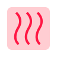
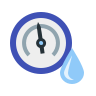

#ioBroker.iqontrol
[](https://weblate.iobroker.net/engage/adapters/?utm_source=widget)

**Tests:**

| Linux/Mac/Windows: | Cross-Browser-Checking: |
| --- | --- |

\ **Wenn es Ihnen gefällt, denken Sie bitte über eine Spende nach:**

[](https://www.paypal.com/cgi-bin/webscr?cmd=_s-xclick&hosted_button_id=LDHZMNPXKRX2N&source=url)

****

## Iqontrol-Adapter für ioBroker
Schnelle Web-App zur Visualisierung.


\


\


\


\


\


\


\


Läuft in jedem Browser.
Einfach einzurichten, obwohl es vollständig anpassbar und reaktionsschnell ist.

> **Dieser Adapter verwendet Sentry-Bibliotheken, um den Entwicklern automatisch Ausnahmen und Codefehler zu melden.** Weitere Details und Informationen zum Deaktivieren der Fehlerberichterstattung finden Sie unter [Dokumentation zum Sentry-Plugin](https://github.com/ioBroker/plugin-sentry#plugin-sentry)! Sentry Reporting wird ab js-controller 3.0 verwendet.

## Video-Tutorial (deutsche Sprache):
[](https://youtube.com/playlist?list=PL8epyNz8pGEv6-R8dnfXm-m5aBlZFKOBG)

## Zum Startbildschirm hinzufügen
Sie können es als Web-App auf dem Homescreen speichern und es sieht aus und fühlt sich an wie eine native App: 

## Du brauchst...
* Nodejs 10 oder höher
* Web-Adapter mit einer Instanz mit dem gleichen Protokoll (http oder https) wie der Admin-Adapter, socket.IO auf 'integriert' und 'Force Web-Sockets' deaktiviert
    * Falls dies mit anderen Adaptern in Konflikt steht, fügen Sie einfach eine weitere Instanz mit den obigen Einstellungen hinzu - iQontrol sucht die am besten passende Web-Adapter-Instanz und verwendet diese für die Kommunikation
* Für die Verbindung über *iobroker.pro-Cloud* sollten sowohl der Admin- als auch der Web-Adapter auf http (nicht https) eingestellt sein

* Wenn Probleme auftreten, lesen Sie bitte den Abschnitt [Fehlerbehebung](#Fehlerbehebung) am Ende dieser Readme

##Forum
Besuchen Sie [iobroker-Forum](https://forum.iobroker.net/topic/22039/neuer-adapter-visualisierung-iqontrol).

## Wie benutzt man
**Haben Sie keine Angst vor den vielen Optionen, die Sie haben.** Die meisten Dinge funktionieren direkt nach dem Auspacken. Sie *können*, müssen aber nicht alle Konfigurationsmöglichkeiten von iQontrol nutzen! Fang einfach so an:

* Beginnen Sie mit der Erstellung von Ansichten.

Sie können Ansichten als etwas wie eine Seite betrachten.

* Erstellen Sie dann Geräte auf diesen Ansichten.

Geräte haben eine Rolle, die die Funktion des Gerätes bestimmt, welche Icons verwendet werden und so weiter.
Abhängig von dieser Rolle können Sie mehrere Zustände mit dem Gerät verknüpfen. Diese verleihen dem Gerät seine Funktionalität.
Wenn Sie als Rolle 'Link zu anderer Ansicht' auswählen, können Sie Links zu anderen Ansichten erstellen. Ich schlage vor, Links zu anderen Ansichten mit dem gleichen Hintergrund zu häuten, den die verknüpfte Ansicht hat.
Sie können auch versuchen, mit der Autocreate-Funktion ein vorhandenes Gerät aus dem iobroker-Objektbaum auszuwählen. Autocreate versucht, die Rolle herauszufinden und so viele Zustände wie möglich abzugleichen.

* Anschließend können Sie eine Symbolleiste erstellen, die als Fußzeile angezeigt wird.

Toolbar-Einträge sind Links zu Ansichten.
Der erste Toolbar-Eintrag ist Ihre 'Home-Ansicht' und wird beim Start geladen.

* Um allem einen ausgefallenen Stil zu verleihen, können Sie Ihre eigenen Bilder hochladen.

Sie können Ihre Bilder als Hintergrundbilder für Ansichten oder für Geräte verwenden.
Bilder im Ordner '/usericons' können als Icons für Geräte verwendet werden.
Die kostenlosen integrierten Demo-Hintergründe stammen von www.pexels.com.

### Automatisches Erstellen verwenden
* Sie finden einen ``Autocreate Views``-Button im ``Views``-Tab
* Wenn Sie gut gepflegte ioBroker-Aufzählungen wie Räume oder Funktionen haben, können Sie diese Funktion verwenden, um automatisch Ansichten mit den in diesen Aufzählungen aufgeführten Geräten zu erstellen
* Denken Sie daran, dass die Autokrationsfunktion aufgrund der großen Anzahl verschiedener Adapter und Geräte im ioBroker-Universe nicht alle Geräte zu 100% korrekt verwalten kann. Möglicherweise müssen Sie einige der Einstellungen von Hand überarbeiten, um die besten Ergebnisse zu erzielen. Aber autocreate bietet Ihnen einen guten Ausgangspunkt, um in Sekundenschnelle Ihre eigene Visualisierung zu erstellen.

## URL-Parameter
* Das Frontend wird über ``http[s]://<url or ip of iobroker>:<port of web adapter>/iqontrol/index.html`` . aufgerufen
    * ``<Port des Webadapters>`` ist normalerweise 8082
* Um eine bestimmte Instanz zu öffnen, können Sie ``namespace=iqontrol.<Instanznummer>`` als URL-Parameter hinzufügen
* Um eine bestimmte Ansicht zu öffnen, können Sie ``renderView=<viewID>`` als URL-Parameter hinzufügen.
    * ``<viewID>`` muss wie ``iqontrol.<instance-number>.Views.<view-name>`` . formatiert sein
* Hinweis: Groß- und Kleinschreibung beachten!
* Um eine bestimmte Ansicht als Startseite zu öffnen, können Sie ``home=<viewID>`` als URL-Parameter hinzufügen. Dadurch wird auch die verknüpfte Ansicht des ersten Toolbar-Eintrags geändert!
    * ``<viewID>`` muss wie ``iqontrol.<instance-number>.Views.<view-name>`` . formatiert sein
* Hinweis: Groß- und Kleinschreibung beachten!
* Um einen bestimmten Dialog beim Laden der Seite zu öffnen, können Sie ``openDialog=<deviceID>`` als URL-Parameter hinzufügen
    * ``<Geräte-ID>`` muss formatiert sein wie ``iqontrol.<Instanznummer>.Views.<Ansichtsname>.devices.<Gerätenummer>`` wobei ``<Gerätenummer>`` beginnt bei 0 (das erste Gerät in einer Ansicht ist also die Gerätenummer 0)
* Hinweis: Groß- und Kleinschreibung beachten!
* Um die Rückkehr nach Zeiteinstellungen einzustellen oder zu überschreiben, verwenden Sie die folgenden Parameter:
* ``returnAfterTimeTreshold=<time in seconds> `` um die Zeit einzustellen, nach der die Zielansicht aufgerufen wird. Verwenden Sie ``0``, um die Rückkehr nach Zeitfunktion zu deaktivieren.
* ``returnAfterTimeDestiationView=<viewID>`` um die Ansicht zu setzen, die nach dem Schwellwert aufgerufen wird. Wenn nicht angegeben, wird die Home-Ansicht verwendet.
* Diese Optionen sind hilfreich, wenn Sie iQontrol von einem an der Wand montierten Tablet aus aufrufen, das nach der Verwendung automatisch zur Home-Ansicht zurückkehren sollte
* Um die Seite ohne Symbolleiste zu laden, können Sie ``noToolbar=true`` . hinzufügen
* Um die Seite ohne Panel zu laden, können Sie ``noPanel=true`` . hinzufügen
* Um die Seite ohne Toolbar und Panel zu laden, Swipen deaktiviert, kein Lade-Spinner und mit transparentem Lade-Bildschirm kann man ``isBackgroundView=true`` . hinzufügen

**Beispiel:**

* ``https://192.168.1.1:8082/iqontrol/index.html?namespace=iqontrol.1&home=iqontrol.1.Views.Wohnzimmer``
    * Groß- und Kleinschreibung beachten

## Schriftarten
* Sie können Ihre eigenen Schriftdateien im Bilder/Widgets-Tab in den Ordner /userfonts hochladen
* Im Options-Tab haben Sie mehrere Stellen, an denen diese Schriftarten ausgewählt werden können
* Es hängt von den MIME-Einstellungen Ihres Servers ab, ob die Schriftart dem Browser korrekt angezeigt wird - bei mir funktionierten am besten .ttf und .woff (getestet auf einem raspi 4b)
    * Diese Mime-Einstellungen sollten funktionieren:
* .otf: application/x-font-opentype
* .ttf: application/x-font-ttf oder application/x-font-truetype
* .woff: application/font-woff
* .woff2: application/font-woff2
* .eot: application/vnd.ms-fontobject
* Sie können Schriftarten auf fontsquirrel.com unter Generator in andere Formate konvertieren
* Denken Sie daran - Webfonts sind immer etwas knifflig und nicht jede Schriftart mit jedem Server und jedem Browser funktioniert

##Icons und Hintergrundbilder
* Sie können die eingebauten Bilder oder die unter der Registerkarte Bilder hochgeladenen Bilder oder eine beliebige kostenlose URL verwenden
* Sie können auch eine Variable innerhalb der Bild-URL verwenden. Dies kann beispielsweise für Wettervorhersagen nützlich sein. Verwenden Sie dieses Muster:
    * ``Pfad/zu/firstloaded.png|anotherpath/to/{iobrokerstate|fallback}.png``
    * Beispiel: ``./../iqontrol.meta/userimages/demo/bottle.jpg|./../iqontrol.meta/userimages/demo/{javascript.0.myimage|whitestone}.jpg``
* Dies lädt ``./../iqontrol.meta/userimages/demo/bottle.jpg``, wenn Sie die Ansicht öffnen
* Sobald der Status von ``javascript.0.myimage`` vom Server geholt wird, wird das Bild durch ``./../iqontrol.meta/userimages/demo/XXX.jpg`` ersetzt, wobei ` `XXX`` ist der Wert von ``javascript.0.myimage``
* Wenn ``javascript.0.myimage`` keinen Wert hat, wird der Fallback ``whitestone`` verwendet (die Verwendung des Fallbacks ist optional)

### Fortschrittsbalken
* Es ist möglich, SVG-Definitionen in Kombination mit Variablen anstelle von Bilddateien zu verwenden, um Fortschrittsbalken anzuzeigen
* Es sind mehrere Vorlagen zur Auswahl integriert, Sie können aber auch eigene SVGs erstellen

 

* Siehe [Wiki](https://github.com/sbormann/ioBroker.iqontrol/wiki/Progress-Bars) für weitere Informationen

###Charts
* Sie können das ''FLOT Chart-Widget'' als HINTERGRUND_URL eines beliebigen Geräts hinzufügen, das automatisch den Hauptzustand als Diagramm im Hintergrund der Gerätekachel anzeigt
* Sie müssen sicherstellen, dass der Status von einem der History-Adapter von ioBroker protokolliert und aufgezeichnet wird


## Gerätenamen
* Genau wie Variablen in Image-URLs können Sie Variablen in Gerätenamen verwenden. Die Syntax ist fast gleich:
    * ``Text beim Laden|Text nach dem Laden {iobrokerstate|fallback}``
* Zusätzlich kann der iobrokerstate in eckige Klammern gesetzt werden, dann wird der reine Wert ohne seine Einheit verwendet: ``Text while loading|Text after loading {[iobrokerstate]|fallback}``
    * Beispiel: ``Wetter wird geladen|Wetter: {javascript.0.weather|Keine Wetterdaten gefunden}``
* Dies zeigt ``Wetter wird geladen`` wenn Sie die Ansicht öffnen
* Sobald der Status von ``javascript.0.weather`` vom Server geholt wird, wird der Text durch ``Weather: XXX`` ersetzt, wobei ``XXX`` der Wert von ``javascript.0 . ist .Wetter``
* Wenn ``javascript.0.weather`` keinen Wert hat, wird der Fallback ``Keine Wetterdaten gefunden`` verwendet (die Verwendung des Fallbacks ist optional)

## Popup-Meldungen
* Jede Instanz erzeugt den Zustand ``iqontrol.x.Popup.Message``
* Wenn Werte an diesen Status übergeben werden, wird eine Popup-Nachricht (oder ein Toast) angezeigt
* Sie können HTML-Tags verwenden, um den Nachrichtentext zu formatieren
* Es gibt einige zusätzliche Zustände zur weiteren Anpassung des angezeigten Popups (diese müssen gesetzt werden, bevor der Nachrichtendatenpunkt gesetzt wird):
    * ``Dauer``: Dies ist die Zeit in ms, in der die Nachricht angezeigt wird; bei 0 muss die Meldung bestätigt werden
    * ``ClickedValue`` und ``ClickedDestinationState``: Wenn das Popup vom Benutzer angeklickt wird, wird der Wert von ``ClickedValue`` an ``iqontrol.x.Popup.POPUP_CLICKED`` gesendet und, falls angegeben, zusätzlich zum Datenpunkt in ``ClickedDestinationState``
        * Wenn kein Wert angegeben wird, wird ``true`` verwendet
    * ``ButtonNames``: Hier können Sie eine kommagetrennte Liste von Schaltflächen angeben, die unten im Popup angezeigt wird (zB "OK,Abort")
        * ``ButtonValues`` und ``ButtonDestinationStates``: Dies sind durch Kommas getrennte Listen von Werten, die an ``iqontrol.x.Popup.BUTTON_CLICKED`` und, falls angegeben, zusätzlich zum Datenpunkt in ``ButtonDestinationStates` . gesendet werden `, wenn der Benutzer auf die entsprechende Schaltfläche klickt
* Anstelle eines Datenpunkts können Sie die Befehle ``COMMAND:renderView`` und ``COMMAND:openDialog`` als ButtonDestinationState verwenden, um eine Ansicht zu rendern oder einen Dialog zu öffnen
* Der ButtonValue spezifiziert dann die Ansicht bzw. Dialog und muss das Format ``iqontrol.<Instanznummer>.Views.<View-Name>`` bzw. ``iqontrol.<instance-number>.Views.<view-name>.devices.<device-number>`` wobei ``<device-number>`` bei 0 beginnt (also das erste Gerät in einer Ansicht ist device Nummer 0)
* Wenn Sie nur einen Wert verwenden (anstelle einer durch Kommas getrennten Liste), wird dieser Wert für alle Schaltflächen verwendet
* Wenn Sie ``ButtonValues`` leer lassen, wird der Name des Buttons verwendet
* Wenn Sie nur einen Zielstatus verwenden (anstelle einer durch Kommas getrennten Liste), wird dieser Status für alle Schaltflächen verwendet
        * ``ButtonCloses``: Dies ist eine kommagetrennte Liste von booleschen Werten (``true``/``false``), die angeben, ob das Popup geschlossen werden soll, wenn der entsprechende Button gedrückt wird
* Alternativ können Sie diese Werte auch per sendTo-Befehl mit den Parametern ``PopupMessage``, ``PopupDuration``, ``PopupClickedValue`` usw. setzen
    * Beispiel: ``sendTo("iqontrol", "send", {PopupMessage: 'Das ist meine Nachricht', PopupDuration: 2500, PopupClickedValue: 'messageConfirmed'});``
* Sie können auch Blockly verwenden, um Nachrichten an iQontrol zu senden

 

##Widgets
* Jede Kachel hat eine HINTERGRUND_URL und einen HINTERGRUND_HTML Datenpunkt
* Hier können Sie einen Link (via HINTERGRUND_URL) zu einer Website definieren oder direkten HTML-Code (via HINTERGRUND_HTML) platzieren, der als Hintergrund der Kachel angezeigt wird
* Dies gibt Ihnen die Möglichkeit (interaktive) Inhalte innerhalb einer Kachel zu platzieren (wie Uhren, FLOT-Charts, Tabellen, Wettervorhersagen usw.)
* Standardmäßig werden Mausereignisse auf diesen Inhalt geleitet (Sie können also nicht mehr auf die Kachel selbst klicken), aber Sie können dies mit der Option "Mausereignisse auf die Kachel statt auf den Inhalt von HINTERGRUND_VIEW/URL/HTML richten" deaktivieren "
* iQontrol bietet eine Geräterolle "Widget" mit einigen vordefinierten Optionen, die meistens verwendet werden, wenn eine Website als Widget angezeigt wird. Sie können jedoch mit jeder anderen Rolle dasselbe Ergebnis erzielen, indem Sie die Geräteoptionen entsprechend ändern.


<details><summary>Widget-Entwicklung (nur für Experten): (<ins> zum Öffnen anklicken</ins> )</summary>

### PostMessage-Kommunikation
* Technisch gesehen wird der Inhalt von HINTERGRUND_VIEW/URL/HTML in einem HTML-Element namens iframe platziert, das eine Website innerhalb einer Website ist
* Durch Aktivieren der Option "PostMessage-Kommunikation für HINTERGRUND_VIEW/URL/HTML zulassen" können Sie die postMessage-Kommunikation zwischen der Website in diesem iframe und iQontrol selbst aktivieren
* Um Befehle an iQontrol zu senden, können Sie den folgenden Javascript-Befehl verwenden: ``window.parent.postMessage(message, "*");``
    * ``message`` ist ein Javascript-Objekt des Formats ``{ command: command, stateId: stateId, value: value }``
    * Folgende Nachrichtenbefehle werden unterstützt:
        * ``{ Befehl: "setWidgetState", stateId: <widgetStateId>, Wert: <Wert> }``
* Dadurch wird der ioBroker-Zustand ``iqontrol.<instance>.Widgets.<widgetStateId>`` auf den Wert ``<value>`` gesetzt (``<value>`` kann ein String, eine Zahl oder ein Boolean oder ein Objekt wie ``{ val: <value>, ack: true|false }``)
        * ``{ Befehl: "getWidgetState", stateId: <widgetStateId> }``
* Dadurch sendet iQontrol den Wert des ioBroker-Zustands ``iqontrol.<instance>.Widgets.<widgetStateId>`` (siehe unten, wie Sie die Antwortnachricht erhalten)
        * ``{ Befehl: "getWidgetStateSubscribed", stateId: <widgetStateId> }``
* Dadurch sendet iQontrol den Wert des ioBroker-Status ``iqontrol.<instance>.Widgets.<widgetStateId>`` jetzt und jedes Mal, wenn sich sein Wert ändert (siehe unten, wie Sie die Antwortnachrichten erhalten)
        * ``{ Befehl: "setWidgetDeviceState", stateId: <widgetDeviceState>, Wert: <Wert> }``
* Dadurch wird der ioBroker Datenpunkt, der dem Geräte STATE ``<widgetDeviceState>`` zugewiesen ist (zum Beispiel der Datenpunkt, der LEVEL zugewiesen ist) auf den Wert ``<value>`` (``<value>` ` kann ein String, eine Zahl oder ein Boolean sein oder ein Objekt wie ``{ val: <value>, ack: true|false }``)
        * ``{ Befehl: "getWidgetDeviceState", stateId: <widgetDeviceState> }``
* Dadurch sendet iQontrol den Wert des ioBroker-Datenpunktes, der dem Geräte STATE ``<widgetDeviceState>`` zugewiesen ist (zum Beispiel der Datenpunkt, der LEVEL zugewiesen ist; siehe unten, wie man die Antwort-Nachricht empfängt)
        * ``{ Befehl: "getWidgetDeviceStateSubscribed", stateId: <widgetDeviceState> }``
* Dadurch sendet iQontrol den Wert des ioBroker-Datenpunkts, der dem Geräte STATE ``<widgetDeviceState>`` zugewiesen ist (zum Beispiel der Datenpunkt, der LEVEL zugewiesen ist) jetzt und jedes Mal, wenn sich sein Wert ändert (siehe unten wie Sie die Antwortnachricht erhalten)
        * ``{ Befehl: "setState", stateId: <stateId>, value: <value> }``
* Dadurch wird der ioBroker-Zustand ``<stateId>`` auf den Wert ``<value>`` gesetzt (``<value>`` kann ein String, eine Zahl oder ein boolescher Wert sein oder ein Objekt wie ``{ val: < value>, ack: true|false }``)
        * ``{ Befehl: "getState", stateId: <stateId> }``
* Dies veranlasst iQontrol, den Wert des ioBroker-Status ``<stateId>`` zu senden (siehe unten, wie Sie die Antwortnachricht erhalten)
        * ``{ Befehl: "getStateSubscribed", stateId: <stateId> }``
* Dadurch sendet iQontrol den Wert des ioBroker-Status ``<stateId>`` jetzt und jedes Mal, wenn sich sein Wert ändert (siehe unten, wie Sie die Antwortnachrichten erhalten)
        * ``{ Befehl: "getOptions"}``
* Dadurch sendet iQontrol die Benutzeroptionen, die der Benutzer als Objekt konfiguriert hat
        * ``{ Befehl: "renderView", Wert: <viewID> }``
* Dadurch wird iQontrol angewiesen, eine Ansicht zu rendern, wobei ``<viewID>`` wie ``iqontrol.<Instanznummer>.Views.<Ansichtsname>`` formatiert werden muss (Groß-/Kleinschreibung beachten)
        * ``{ Befehl: "openDialog", Wert: <deviceID> }``
* Dadurch wird iQontrol angewiesen, einen Dialog zu öffnen, in dem ``<Geräte-ID>`` wie folgt formatiert werden muss: ``iqontrol.<Instanznummer>.Views.<Ansichtsname>.devices.<Gerätenummer>`` wobei ``<Gerätenummer>`` bei 0 beginnt (das erste Gerät in einer Ansicht ist also Gerätenummer 0)
* Um Nachrichten von iQontrol zu empfangen, müssen Sie einen Event-Listener für das "message"-Ereignis mit dem Javascript-Befehl ``window.addEventListener("message", receivePostMessage, false);``
    * Die Funktion ``receivePostMessage`` empfängt das Objekt ``Ereignis``
* ``event.data`` enthält die Nachricht von iqontrol, die ein Objekt wie:
* event.data = ``{ command: "getState", stateId: <stateId>, value: <stateObject> }`` - dies ist die Antwort auf einen getState-Befehl oder einen getStateSubsribed-Befehl und gibt Ihnen das aktuelle ` `<value>``-Objekt des ioBroker-Zustands``<stateId>``
* ``<stateObject>`` selbst ist ein Objekt wie

			````javascript
			event.data.value = {
				val: <value (rounded)>,
				unit: "<unit>",
				valFull: <value (not rounded)>,
				plainText: "<clear text of val, for example taken from valuelist>",
				min: <minimum>,
				max: <maximum>,
				step: <step-width>,
				valuelist: {<object with possible values and corresponding clear text>},
				targetValues: {<target value list>},
				ack: <true|false>,
				readonly: <true|false>,
				custom: {<object with custom settings>},
				id: <id of the iobroker datapoint>,
				from: "<source of state>",
				lc: <timestamp of last change>,
				ts: <timestamp of last actualization>,
				q: <quality of signal>,
				role: "<role of state>",
				type: "<string|number|boolean>"
			}
			````

* Um iQontrol anzuweisen, einen widgetState unter ``iqontrol.<instance>.Widgets`` zu generieren, können Sie ein Meta-Tag im Kopfbereich der Widget-Website verwenden:
* Syntax: ``<meta name="widget-datapoint" content="WidgetName.StateName" data-type="string" data-role="text" /> ``
* Sie können den Datenpunkt weiter konfigurieren, indem Sie Datentyp (der auf String, Zahl oder Boolean eingestellt werden kann), Datenrolle, Datenname, Datenmin., Datenmax., Datendef. und Dateneinheitsattribute verwenden
    * Der entsprechende Datenpunkt wird nur dann erstellt, wenn die Widget-Website als URL oder HINTERGRUND_URL zu einem Gerät hinzugefügt wird
* Das gleiche Konzept kann für den URL/HTML-State verwendet werden, der verwendet wird, um eine Website im Dialog eines Geräts anzuzeigen
* Um ein Symbol für Ihr Widget zu erstellen, legen Sie eine .png-Datei mit dem gleichen Dateinamen wie das Widget in das Widgets-Verzeichnis
* Siehe unten für eine Beispiel-Widget-Website:

<details><summary>Beispiel-Widget-Website anzeigen, die als Widget mit postMessage-Kommunikation angezeigt werden soll: (<ins> zum Öffnen anklicken</ins> )</summary>

* Sie können den folgenden HTML-Code verwenden und in den HINTERGRUND_HTML-Zustand eines Widgets kopieren (der dann als "Konstant" konfiguriert werden muss)
* Alternativ können Sie diesen Code als html-Datei in das Unterverzeichnis /userwidgets hochladen und auf den Hintergrund_URL-State verweisen (der dann auch als "Konstant" konfiguriert werden muss)
* Aktivieren Sie die Option "PostMessage-Kommunikation für HINTERGRUND_VIEW/URL/HTML zulassen"
* Es wird demonstriert, wie eine Zwei-Wege-Kommunikation zwischen der Website und iQontrol erfolgt

````html
<!doctype html>
<html>
<head>
	<meta http-equiv="Content-Type" content="text/html; charset=UTF-8"/>
	<meta name="widget-datapoint" content="postMessageTest.test" data-type="string" data-role="text" />
	<meta name="widget-description" content="This is a test widget. To get the WidgetDeviceState-Functions working, please set a valid iobroker-datapoint for STATE. (C) by Sebastian Bormann"/>
	<meta name="widget-urlparameters" content="title/postMessageTest/Please enter a title">
	<meta name="widget-options" content="{'noZoomOnHover': 'true', 'hideDeviceName': 'true', 'sizeInactive': 'xwideIfInactive highIfInactive', 'iconNoPointerEventsInactive': 'true', 'hideDeviceNameIfInactive': 'true', 'hideStateIfInactive': 'true', 'sizeActive': 'xwideIfActive highIfActive', 'bigIconActive': 'true', 'iconNoPointerEventsActive': 'true', 'hideDeviceNameIfActive': 'true', 'hideStateIfActive': 'true', 'sizeEnlarged': 'fullWidthIfEnlarged fullHeightIfEnlarged', 'bigIconEnlarged': 'true', 'iconNoPointerEventsEnlarged': 'false', 'noOverlayEnlarged': 'true', 'hideDeviceNameIfEnlarged': 'true', 'hideStateIfEnlarged': 'true', 'popupAllowPostMessage': 'true', 'backgroundURLAllowPostMessage': 'true', 'backgroundURLNoPointerEvents': 'false'}"/>
 	<title>iQontrol postMessageTest</title>
</head>
<body>
	<br><br>
	<h3><span id="title">postMessageTest</span><h3>
	<button onclick="getWidgetState('postMessageTest.test')">getWidgetState postMessageTest.test</button><br>
	<button onclick="getWidgetStateSubscribed('postMessageTest.test')">getWidgetStateSubscribed postMessageTest.test</button><br>
	<button onclick="setWidgetState('postMessageTest.test', 'Hello world')">setWidgetState postMessageTest.test to 'Hello world'</button><br>
  	<br>
	<button onclick="getWidgetDeviceState('STATE')">getWidgetDeviceState STATE</button><br>
	<button onclick="getWidgetDeviceStateSubscribed('STATE')">getWidgetDeviceStateSubscribed STATE</button><br>
	<button onclick="setWidgetDeviceState('STATE', 'Hello world')">setWidgetDeviceState STATE to 'Hello world'</button><br>
  	<br>
	<button onclick="getState('system.adapter.admin.0.cpu')">getState system.adapter.admin.0.cpu</button><br>
	<button onclick="getStateSubscribed('system.adapter.admin.0.uptime')">getStateSubscribed system.adapter.admin.0.uptime</button><br>
	<button onclick="setState('iqontrol.0.Popup.Message', 'Hey, this is a test Message')">setState popup message</button><br>
  	<br>
	<button onclick="renderView('iqontrol.0.Views.Home')">renderView 'Home'</button><br>
	<button onclick="openDialog('iqontrol.0.Views.Home.devices.0')">openDialog 1st device on 'Home'</button><br>
	<br><hr>
	message sent: <span id="messageSent">-</span><br>
	<br><hr>
	message received: <span id="messageReceived">-</span><br>
	<br><hr>
	this means: <span id="thisMeans">-</span><br>
	<br><hr>
    <script type="text/javascript">
		var countSend = 0;
		var countReceived = 0;

		//Set title from UrlParameter
		document.getElementById('title').innerHTML = getUrlParameter('title') || "No Title set";

		//getWidgetState
		function getWidgetState(stateId){
			sendPostMessage("getWidgetState", stateId);
		}

		//getWidgetStateSubscribed (this means, everytime the state changes, an update will be received)
		function getWidgetStateSubscribed(stateId){
			sendPostMessage("getWidgetStateSubscribed", stateId);
		}

		//setWidgetState
		function setWidgetState(stateId, value){
			sendPostMessage("setWidgetState", stateId, value);
		}


		//getWidgetDeviceState
		function getWidgetDeviceState(stateId){
			sendPostMessage("getWidgetDeviceState", stateId);
		}

		//getWidgetDeviceStateSubscribed (this means, everytime the state changes, an update will be received)
		function getWidgetDeviceStateSubscribed(stateId){
			sendPostMessage("getWidgetDeviceStateSubscribed", stateId);
		}

		//setWidgetDeviceState
		function setWidgetDeviceState(stateId, value){
			sendPostMessage("setWidgetDeviceState", stateId, value);
		}


		//getState
		function getState(stateId){
			sendPostMessage("getState", stateId);
		}

		//getStateSubscribed (this means, everytime the state changes, an update will be received)
		function getStateSubscribed(stateId){
			sendPostMessage("getStateSubscribed", stateId);
		}

		//setState
		function setState(stateId, value){
			sendPostMessage("setState", stateId, value);
		}


		//renderView
		function renderView(viewId){
			sendPostMessage("renderView", null, viewId);
		}

		//openDialog
		function openDialog(deviceId){
			sendPostMessage("openDialog", null, deviceId);
		}

		// +++++ Default Functions +++++
		//getUrlParameter
		function getUrlParameter(name) {
			name = name.replace(/[\[]/, '\\[').replace(/[\]]/, '\\]');
			var regex = new RegExp('[\\?&]' + name + '=([^&#]*)');
			var results = regex.exec(location.search);
			return results === null ? null : decodeURIComponent(results[1].replace(/\+/g, ' '));
		};

		//send postMessages
		function sendPostMessage(command, stateId, value){
			countSend++;
			message = { command: command, stateId: stateId, value: value };
			document.getElementById('messageSent').innerHTML = countSend + " - " + JSON.stringify(message);
			window.parent.postMessage(message, "*");
		}

		//receive postMessages
		window.addEventListener("message", receivePostMessage, false);
		function receivePostMessage(event) { //event = {data: message data, origin: url of origin, source: id of sending element}
			countReceived++;
			if(event.data) document.getElementById('messageReceived').innerHTML = countReceived + " - " + JSON.stringify(event.data);
			if(event.data && event.data.command) switch(event.data.command){
				case "getState":
				if(event.data.stateId && event.data.value && event.data.value.val){
					document.getElementById('thisMeans').innerHTML = "Got State " + event.data.stateId + " with value " + event.data.value.val;
				}
				break;
			}
		}
	</script>
</body>
</html>
````

</details>

### Weitere Konfiguration von Widgets
* Es gibt zusätzliche Meta-Tags, die Sie im Kopfbereich Ihrer Widget-Website verwenden können, um das Verhalten des Widgets zu konfigurieren:
* 'Widget-Beschreibung'
* Syntax: `` <meta name="widget-description" content="Please see www.mywebsite.com for further informations. (C) by me"/> ``
* Der Inhalt wird angezeigt, wenn Sie das Widget als URL oder HINTERGRUND_URL auswählen oder wenn Sie ein Widget automatisch erstellen
* 'Widget-URL-Parameter'
* Syntax: `` <meta name="widget-urlparameters" content="parameter/default value/description/type;parameter2/default value2/description2/type2"/> ``
* Der Benutzer wird nach diesen Parametern gefragt, wenn er das Widget als URL oder HINTERGRUND_URL auswählt oder ein Widget automatisch erstellt
* ``type`` ist optional und kann ``text`` sein (dies ist falsch), ``number``, ``checkbox``, ``color``, ``select``, ``multipleSelect` `, ``combobox``, ``historyInstance``, ``datapoint``, ``icon`` oder ``section``
* Wenn type ``select``, ``multipleSelect`` oder ``combobox`` ist, müssen Sie die möglichen Optionen angeben, indem Sie ``/<selectOptions>`` hinzufügen, wobei ``<selectOptions>`` a . ist String im Format ``<value1>,<caption1>/<value2>,<caption2>/...`` (Combobox ist eine Auswahlbox mit der Möglichkeit Freitext einzugeben)
* Wenn type ``number`` ist, dann können min, max und step-width durch Hinzufügen von ``/<numberOptions>`` angegeben werden, wobei ``<numberOptions>`` ein String im Format ``<min> ist, <max>,<Schritt>``
* Alle diese Parameter werden der Widget-Website über einen URL-Parameter-String übergeben (wie ``widget.html?parameter=value&parameter2=value2``)
* Sie können diese Einstellungen innerhalb Ihrer Widget-Website verwenden, indem Sie die URL-Parameter mit einer Funktion wie dieser anfordern:

			````javascript
			function getUrlParameter(name) {
				name = name.replace(/[\[]/, '\\[').replace(/[\]]/, '\\]');
				var regex = new RegExp('[\\?&]' + name + '=([^&#]*)');
				var results = regex.exec(location.search);
				return results === null ? null : decodeURIComponent(results[1].replace(/\+/g, ' '));
			};
			````

* Wenn Sie als URL-Parameter den Typ ``icon`` verwendet haben, erhalten Sie entweder einen relativen Pfad zum iqontrol-Verzeichnis oder einen absoluten Pfad zu einem Bild. Um einen gültigen Link zu Ihrem Bild zu erstellen, können Sie diesen Code verwenden:

			    ````javascript
				var iconOn = getUrlParameter('iconOn') || './images/icons/switch_on.png';
				if(iconOn.indexOf('http') != 0) iconOn = '/iqontrol/' + iconOn;
				````

* 'Widget-Optionen'
* Syntax: ``<meta name="widget-options" content="{'noZoomOnHover': 'true', 'hideDeviceName': 'true'}"/> ``
* Im erweiterbaren Abschnitt unten finden Sie die möglichen Optionen, die mit diesem Meta-Tag konfiguriert werden können

<details><summary>Zeigen Sie mögliche Optionen an, die durch das Meta-Tag &#39;widget-options&#39; konfiguriert werden können: (<ins> zum Öffnen anklicken</ins> )</summary>

* Symbole:
* ``icon_on`` (Symbol an):
* Standard: ""
* ``icon_off`` (Symbol aus):
* Standard: ""
* Gerätespezifische Optionen:
* ``showState`` (Show State) - nur gültig für Rolle Button und Programm:
* Mögliche Werte: "true"|"false"
* Standard: "falsch"
* ``buttonCaption`` (Beschriftung für Schaltfläche) - nur gültig für Rolle Schaltfläche:
* Standard: ""
* ``returnToOffSetValueAfter`` (Zurück zu 'OFF_SET_VALUE' nach [ms]) - nur gültig für Rolle Button:
* Mögliche Werte: Zahl von 10 bis 60000
* Standard: ""
* ``alwaysSendTrue`` (Immer 'true' senden (nicht umschalten)) - nur gültig für Rolle Szene:
* Mögliche Werte: "true"|"false"
* Standard: "falsch"
* ``closeDialogAfterExecution`` (Dialog nach Ausführung schließen) - nur gültig für Rolle Button, Programm und Szene:
* Mögliche Werte: "true"|"false"
* Standard: "falsch"
* ``invertCt`` (CT invertieren (Kelvin statt Mired verwenden)) - nur gültig für Rolle Light:
* Mögliche Werte: "true"|"false"
* Standard: "falsch"
* ``alternativeColorspace`` (Farbraum für ALTERNATIVE_COLORSPACE_VALUE") - nur gültig für Rolle Light:
* Mögliche Werte: ""|"RGB"|"#RGB"|"RGBW"|"#RGBW"|"RGBWWCW"|"#RGBWWCW"|"RGBCWWW"|"#RGBCWWW"|"RGB_HUEONLY"|"#RGB_HUEONLY "|"HUE_MILIGHT"|"HHSSBB_TUYA"
* Standard: ""
* ``linkOverlayActiveColorToHue`` (Farbe der Lampe als OVERLAY_ACTIVE_COLOR verwenden) - nur gültig für Rolle Light:
* Mögliche Werte: "true"|"false"
* Standard: "falsch"
* ``linkGlowActiveColorToHue`` (Farbe der Lampe als GLOW_ACTIVE_COLOR verwenden) - nur gültig für Rolle Light:
* Mögliche Werte: "true"|"false"
* Standard: "falsch"
* ``controlModeDisabledValue`` (Wert von CONTROL_MODE für 'disabled') - nur gültig für Rolle Thermostat:
* Standard: ""
* ``stateClosedValue`` (Wert von STATE für 'closed') - nur gültig für Rolle Window:
* Standard: ""
* ``stateOpenedValue`` (Wert von STATE für 'opened') - nur gültig für Rolle Window:
* Standard: ""
* ``stateTiltedValue`` (Wert von STATE für 'tilted') - nur gültig für Rolle Window:
* Standard: ""
* ``invertActuatorLevel`` (LEVEL invertieren (0 = offen)) - nur gültig für Rolle Blind:
* Mögliche Werte: "true"|"false"
* Standard: "falsch"
* ``directionOpeningValue`` (Wert von DIRECTION für 'opening') - nur gültig für Rolle Window:
* Standard: "1"
* ``directionOpeningValue`` (Wert von DIRECTION für 'opening') - nur gültig für Rolle Window:
* Vorgabe: "2"
* ``directionUncertainValue`` (Wert von DIRECTION für 'uncertain') - nur gültig für Rolle Window:
* Standard: "3"
* ``favoritePositionCaption`` (Beschriftung für FAVORITE_POSITION) - nur gültig für Rolle Window:
* Standard: "Favoritenposition"
* ``stopCaption`` (Beschriftung für STOP) - nur gültig für Rolle Window:
* Vorgabe: "Stopp"
* ``downCaption`` (Beschriftung für DOWN) - nur gültig für Rolle Window:
* Standard: "Unten"
* ``controlModeDisarmedValue`` (Wert von CONTROL_MODE für 'unscharf') - nur gültig für Rolle Alarm:
* Vorgabe: "0"
* ``showStateAndLevelSeparatelyInTile`` (State und LEVEL separat in Kachel anzeigen) - nur gültig für Rollenwert:
* Mögliche Werte: ""|"devidedByComma"|"devidedByComma preceedCaptions"|"devidedBySemicolon"|"devidedBySemicolon preceedCaptions"|"devidedByHyphen"|"devidedByHyphen preceedCaptions"
* Standard: ""
* ``timeCaption`` (Caption for TIME) - nur gültig für Rolle DateAndTime:
* Standard: ""
* ``timeFormat`` (Format von TIME (wie im Datenpunkt gespeichert, siehe Readme)) - nur gültig für Rolle DateAndTime:
* Vorgabe: "x"
* ``timeDisplayFormat`` (Anzeige-Format von TIME (wie es angezeigt werden soll, siehe Readme)) - nur gültig für Rolle DateAndTime:
* Standard: "TT.MM.JJJJ HH:mm:ss"
* ``timeDisplayDontShowDistance`` (Show Distance) - nur gültig für Rolle DateAndTime:
* Mögliche Werte: ""|"false"|"true"
* Standard: "" (das bedeutet, benutzerdefinierte Datenpunkteinstellungen verwenden)
* ``dateAndTimeTileActiveConditions`` (Tile ist aktiv, wenn alle ausgewählten Elemente wahr sind) - nur gültig für die Rolle DateAndTime:
* Mögliche Werte (Array): „activeIfStateActive“, „activeIfTimeNotZero“, „activeIfTimeInFuture“, „activeIfTimeInPast“
* Standard: "activeIfStateActive,activeIfTimeInFuture"
* ``dateAndTimeTileActiveWhenRinging`` (Tile ist immer aktiv wenn RINGING aktiv ist) - nur gültig für Rolle DateAndTime:
* Standard: wahr
* ``dateAndTimeShowInState`` (Show in state) - nur gültig für Rolle DateAndTime:
* Mögliche Werte (Array): "showStateIfInactive", "showStateIfActive", "showSubjectIfActive", "showSubjectIfInactive", "showTimeIfInactiveAndInPast", "showTimeIfInactiveAndInFuture", "showTimeIfActiveAndInPast", "showTimeIfActiveAndInFuture", "showTimeDistanceIfInactiveAndTimeInPast", "showTimeDistanceIfInactiveAndTimeInPast", "showTimeDistanceIfInactiveAndTimeInPast", "showTimeDistanceIfInactiveAndTimeInPast", , "showTimeDistanceIfActiveAndInFuture"
* Standard: "showStateIfInactive,showSubjectIfActive,showTimeDistanceIfActiveAndInFuture"
* ``coverImageReloadDelay`` (Verzögertes Nachladen des Cover-Bildes [ms]) - nur gültig für Rolle Media:
* Mögliche Werte: Zahl von 0 bis 5000
* Standard: ""
* ``statePlayValue`` (Wert von STATE für 'play') - nur gültig für Rolle Media:
* Standard: "spielen"
* ``statePauseValue`` (Wert von STATE für 'pause') - nur gültig für Rolle Media:
* Standard: "Pause"
* ``stateStopValue`` (Wert von STATE für 'stop') - nur gültig für Rolle Media:
* Vorgabe: "Stopp"
* ``hidePlayOverlay`` (Spielsymbol ausblenden) - nur gültig für Rollenmedien:
* Mögliche Werte: "true"|"false"
* Standard: "falsch"
* ``hidePauseAndStopOverlay`` (Pause- und Stoppsymbol ausblenden) - nur gültig für Rolle Media:
* Mögliche Werte: "true"|"false"
* Standard: "falsch"
* ``repeatOffValue`` (Wert von REPEAT für 'off') - nur gültig für Rolle Media:
* Standard: "falsch"
* ``repeatAllValue`` (Wert von REPEAT für 'repeat all') - nur gültig für Rolle Media:
* Standard: "wahr"
* ``repeatOneValue`` (Wert von REPEAT für 'repeat one') - nur gültig für Rolle Media:
* Vorgabe: "2"
* ``remoteKeepSectionsOpen`` (Abschnitte offen halten) - nur gültig für Rolle Media:
* Mögliche Werte: "true"|"false"
* Standard: "falsch"
* ``remoteSectionsStartOpened`` (Beginnen Sie mit diesen anfangs geöffneten Abschnitten) - nur gültig für Rolle Media:
* Mögliche Werte: Array mit "REMOTE_PAD", "REMOTE_CONTROL", "REMOTE_ADDITIONAL_BUTTONS", "REMOTE_CHANNELS", "REMOTE_NUMBERS" und/oder "REMOTE_COLORS"
* Standard: "falsch"
* ``remoteShowDirectionsInsidePad`` (Show Vol und Ch +/- innerhalb des Pads) - nur gültig für Rollenmedien:
* Mögliche Werte: "true"|"false"
* Standard: "falsch"
* ``remoteChannelsCaption`` (Beschriftung für Abschnitt 'Channels') - nur gültig für Rolle Media:
* Standard: ""
* ``remoteAdditionalButtonsCaption`` (Beschriftung für Abschnitt 'Additional Buttons') - nur gültig für Rolle Media:
* Standard: ""
* ``noVirtualState`` (Verwende keinen virtuellen Datenpunkt für STATE (Schalter ausblenden, wenn STATE leer ist)) - nur gültig für Rollen-Widget:
* Mögliche Werte: "true"|"false"
* Standard: "falsch"
* Allgemein:
* ``stateCaption`` (Beschriftung von STATE):
* Standard: ""
* ``levelCaption`` (Beschriftung von LEVEL):
* Standard: ""
* ``schreibgeschützt`` (Schreibgeschützt):
* Mögliche Werte: "true"|"false"
* Standard: "falsch"
* ``renderLinkedViewInParentInstance`` (Verknüpfte Ansicht in der übergeordneten Instanz öffnen, wenn diese Ansicht als HINTERGRUND_VIEW verwendet wird):
* Mögliche Werte: "true"|"false"
* Standard: "falsch"
* ``renderLinkedViewInParentInstanceClosesPanel`` (Nach dem Öffnen der verknüpften Ansicht in der übergeordneten Instanz das Panel schließen (wenn es abgelehnt wird)):
* Mögliche Werte: "true"|"false"
* Standard: "falsch"
* Kachel-Verhalten (allgemein):
* ``clickOnIconAction`` (Klicken Sie auf die Symbolaktion):
* Mögliche Werte: "toggle"|"openDialog"|"enlarge"|"openLinkToOtherView"|"openURLExternal"|"false"
* Standard: "umschalten"
* ``clickOnTileAction`` (Auf Kachelaktion klicken):
* Mögliche Werte: "toggle"|"openDialog"|"enlarge"|"openLinkToOtherView"|"openURLExternal"|"false"
* Standard: "openDialog"
* ``clickOnIconOpensDialog`` (Klicken Sie auf das Symbol öffnet den Dialog (statt umzuschalten)):
* *veraltet*, da diese Option jetzt in clickOnIconAction enthalten ist
* Mögliche Werte: "true"|"false"
* Standard: "falsch"
* ``clickOnTileToggles`` (Klicken Sie auf die Tile Toggles (anstatt den Dialog zu öffnen)):
* *veraltet*, da diese Option jetzt in clickOnTileAction enthalten ist
* Mögliche Werte: "true"|"false"
* Standard: "falsch"
* ``clickOnTileOpensDialog`` (Klick auf Kachel öffnet Dialog):
* *veraltet*, da diese Option jetzt in clickOnTileAction enthalten ist
* Mögliche Werte: "true"|"false"
* Standard: "true" (für die meisten Geräte)
* ``noZoomOnHover`` (Zoom-Effekt beim Schweben deaktivieren):
* Mögliche Werte: "true"|"false"
* Standard: "false" (für die meisten Geräte)
* ``iconNoZoomOnHover`` (Zoom-Effekt beim Schweben für das Symbol deaktivieren):
* Mögliche Werte: "true"|"false"
* Standard: "falsch"
* ``hideDeviceName`` (Gerätenamen ausblenden):
* Mögliche Werte: "true"|"false"
* Standard: "wahr"
* Bedingungen für eine aktive Kachel:
* ``tileActiveStateId`` (Status-ID (leer = STATE/LEVEL wird verwendet)):
* Standard: ""
* ``tileActiveCondition`` (Bedingung):
* Mögliche Werte: ""|"at"|"af"|"eqt"|"eqf"|"eq"|"ne"|"gt"|"ge"|"lt"|"le"
* Standard: ""
* ``tileActiveConditionValue`` (Bedingungswert):
* Standard: ""
* Kachel-Verhalten bei inaktivem Gerät:
* ``sizeInactive`` (Größe der Kachel, wenn das Gerät inaktiv ist):
* Mögliche Werte: ""|"narrowIfInactive shortIfInactive"|"narrowIfInactive"|"narrowIfInactive highIfInactive"|"narrowIfInactive xhighIfInactive"|"shortIfInactive"|"shortIfInactive wideIfInactive"|"shortIfInactive xwideIfInactive"|"wideIfInactive"|"xhighIfInactive"|"xhighIfInactive"|"xhighIfInactive"| "|"xhighIfInactive"|"wideIfInactive highIfInactive"|"xwideIfInactive highIfInactive"|"wideIfInactive xhighIfInactive"|"xwideIfInactive xhighIfInactive"|"fullWidthIfInactive Aspekt-1-1IfInactive"|"fullWidthIfInactive Aspekt-4-3IfInactive"If"fullWid 2IfInactive"|"fullWidthIfInactive Aspekt-16-9IfInactive"|"fullWidthIfInactive Aspekt-21-9IfInactive"|"fullWidthIfInactive fullHeightIfInactive"|"
* Vorgabe: "xwideIfInactive highIfInactive"
* ``stateHeightAdaptsContentInactive`` (Höhe von STATE an seinen Inhalt anpassen (dies überschreibt bei Bedarf die Kachelgröße), wenn das Gerät inaktiv ist):
* Mögliche Werte: "true"|"false"
* Standard: "falsch"
* ``stateFillsDeviceInactive`` (Größe von STATE füllt das komplette Gerät (dies kann andere Inhalte stören), wenn das Gerät inaktiv ist):
* Mögliche Werte: "true"|"false"
* Standard: "falsch"
* ``stateBigFontInactive`` (Große Schrift für STATE verwenden, wenn das Gerät inaktiv ist):
* Mögliche Werte: "true"|"false"
* Standard: "falsch"
* ``bigIconInactive`` (Großes Symbol anzeigen, wenn Gerät inaktiv ist):
* Mögliche Werte: "true"|"false"
* Standard: "falsch"
* ``iconNoPointerEventsInactive`` (Mausereignisse für das Symbol ignorieren, wenn das Gerät inaktiv ist):
* Mögliche Werte: "true"|"false"
* Standard: "falsch"
* ``transparentIfInactive`` (Hintergrund transparent machen, wenn Gerät inaktiv ist):
* Mögliche Werte: "true"|"false"
* Standard: "falsch"
* ``noOverlayInactive`` (Overlay der Kachel entfernen, wenn das Gerät inaktiv ist):
* Mögliche Werte: "true"|"false"
* Standard: "wahr"
* ``hideBackgroundURLInactive`` (Hintergründe von HINTERGRUND_VIEW/URL/HTML ausblenden, wenn das Gerät inaktiv ist):
* Mögliche Werte: "true"|"false"
* Standard: "falsch"
* ``hideDeviceNameIfInactive`` (Gerätenamen ausblenden, wenn das Gerät inaktiv ist):
* Mögliche Werte: "true"|"false"
* Standard: "falsch"
* ``hideInfoAIfInactive`` (Info_A ausblenden, wenn das Gerät inaktiv ist):
* Mögliche Werte: "true"|"false"
* Standard: "falsch"
* ``hideInfoBIfInactive`` (Info_B ausblenden, wenn das Gerät inaktiv ist):
* Mögliche Werte: "true"|"false"
* Standard: "falsch"
* ``hideStateIfInactive`` (Zustand ausblenden, wenn das Gerät inaktiv ist):
* Mögliche Werte: "true"|"false"
* Standard: "falsch"
* ``hideDeviceIfInactive`` (Gerät ausblenden, wenn es inaktiv ist):
* Mögliche Werte: "true"|"false"
* Standard: "false" * ``
* Kachel-Verhalten bei aktivem Gerät:
* ``sizeActive`` (Größe der Kachel, wenn Gerät aktiv):
* Mögliche Werte: ""|"narrowIfActive shortIfActive"|"narrowIfActive"|"narrowIfActive highIfActive"|"narrowIfActive xhighIfActive"|"shortIfActive"|"shortIfActive wideIfActive"|"shortIfActive xwideIfActive"|"wideIfActive"|"xhighIfActive" .| "|"xhighIfActive"|"wideIfActive highIfActive"|"xwideIfActive highIfActive"|"wideIfActive xhighIfActive"|"xwideIfActive xhighIfActive"|"fullWidthIfActive Aspekt-1-1IfActive"|"fullWidthIfActive Aspekt-4-3IfActive"If"ActiveWid 2IfActive"|"fullWidthIfActive Aspekt-16-9IfActive"|"fullWidthIfActive Aspekt-21-9IfActive"|"fullWidthIfActive fullHeightIfActive"|"
* ``stateHeightAdaptsContentActive`` (Höhe von STATE an seinen Inhalt anpassen (dies überschreibt bei Bedarf die Kachelgröße), wenn das Gerät inaktiv ist):
* Mögliche Werte: "true"|"false"
* Standard: "falsch"
* ``stateFillsDeviceActive`` (Größe von STATE füllt das komplette Gerät (dies kann andere Inhalte stören), wenn das Gerät inaktiv ist):
* Mögliche Werte: "true"|"false"
* Standard: "falsch"
* ``stateBigFontActive`` (Große Schrift für STATE verwenden, wenn das Gerät aktiv ist):
* Mögliche Werte: "true"|"false"
* Standard: "falsch"
* ``bigIconActive`` (Großes Symbol anzeigen, wenn Gerät aktiv):
* Mögliche Werte: "true"|"false"
* Standard: "falsch"
* ``iconNoPointerEventsActive`` (Mausereignisse für das Symbol ignorieren, wenn das Gerät aktiv ist):
* Mögliche Werte: "true"|"false"
* Standard: "falsch"
* ``transparentIfActive`` (Hintergrund transparent machen, wenn Gerät aktiv ist):
* Mögliche Werte: "true"|"false"
* Standard: "falsch"
* ``noOverlayActive`` (Overlay der Kachel entfernen, wenn das Gerät aktiv ist):
* Mögliche Werte: "true"|"false"
* Standard: "wahr"
* ``hideBackgroundURLActive`` (Hintergrund von HINTERGRUND_VIEW/URL/HTML ausblenden, wenn das Gerät aktiv ist):
* Mögliche Werte: "true"|"false"
* Standard: "falsch"
* ``hideDeviceNameIfActive`` (Gerätenamen ausblenden, wenn das Gerät aktiv ist):
* Mögliche Werte: "true"|"false"
* Standard: "falsch"
* ``hideInfoAIfActive`` (Info_A ausblenden, wenn das Gerät aktiv ist):
* Mögliche Werte: "true"|"false"
* Standard: "falsch"
* ``hideInfoBIfActive`` (Info_B ausblenden, wenn das Gerät aktiv ist):
* Mögliche Werte: "true"|"false"
* Standard: "falsch"
* ``hideStateIfActive`` (Zustand ausblenden, wenn das Gerät aktiv ist):
* Mögliche Werte: "true"|"false"
* Standard: "falsch"
* ``hideDeviceIfActive`` (Gerät ausblenden, wenn es aktiv ist):
* Mögliche Werte: "true"|"false"
* Standard: "falsch"
* Kachel-Verhalten bei vergrößertem Gerät:
* ``sizeEnlarged`` (Größe der Kachel, wenn das Gerät vergrößert wird):
* Mögliche Werte: ""|"narrowIfEnlarged shortIfEnlarged"|"narrowIfEnlarged"|"narrowIfEnlarged highIfEnlarged"|"narrowIfEnlarged xhighIfEnlarged"|"shortIfEnlarged"|"shortIfEnlarged wideIfEnlarged"|"shortIfEnlarged xwideIfEnlargedEnlarged"|"widexwide" "|"xhighIfEnlarged"|"wideIfEnlarged highIfEnlarged"|"xwideIfEnlarged highIfEnlarged"|"wideIfEnlarged xhighIfEnlarged"|"xwideIfEnlarged xhighIfEnlarged"|"fullWidthIfEnlarged aspekt-1-1IfEnlarged"|"fullWidthIfEnlarged-3-th 2IfEnlarged"|"fullWidthIfEnlarged aspekt-16-9IfEnlarged"|"fullWidthIfEnlarged aspekt-21-9IfEnlarged"|"fullWidthIfEnlarged fullHeightIfEnlarged"|"
* ``stateHeightAdaptsContentEnlarged`` (Höhe von STATE an seinen Inhalt anpassen (dies überschreibt bei Bedarf die Kachelgröße), wenn das Gerät inaktiv ist):
* Mögliche Werte: "true"|"false"
* Standard: "falsch"
* ``stateFillsDeviceInactiveEnlarged`` (Größe von STATE füllt das komplette Gerät (dies kann andere Inhalte stören), wenn das Gerät inaktiv ist):
* Mögliche Werte: "true"|"false"
* Standard: "falsch"
* ``stateBigFontEnlarged`` (Große Schrift für STATE verwenden, wenn das Gerät vergrößert wird):
* Mögliche Werte: "true"|"false"
* Standard: "falsch"
* ``bigIconEnlarged`` (Großes Icon anzeigen, wenn Gerät vergrößert):
* Mögliche Werte: "true"|"false"
* Standard: "wahr"
* ``iconNoPointerEventsEnlarged`` (Mausereignisse für das Symbol ignorieren, wenn das Gerät vergrößert wird):
* Mögliche Werte: "true"|"false"
* Standard: "falsch"
* ``transparentIfEnlarged`` (Hintergrund transparent machen, wenn das Gerät vergrößert wird):
* Mögliche Werte: "true"|"false"
* Standard: "falsch"
* ``noOverlayEnlarged`` (Overlay der Kachel entfernen, wenn das Gerät vergrößert wird):
* Mögliche Werte: "true"|"false"
* Standard: "falsch"
* ``tileEnlargeStartEnlarged`` (Kachel wird beim Start vergrößert):
* Mögliche Werte: "true"|"false"
* Standard: "falsch"
* ``tileEnlargeShowButtonInactive`` (Zeige Enlarge-Button, wenn Gerät inaktiv ist):
* Mögliche Werte: "true"|"false"
* Standard: "wahr"
* ``tileEnlargeShowButtonActive`` (Show Enlarge-Button, wenn Gerät aktiv):
* Mögliche Werte: "true"|"false"
* Standard: "wahr"
* ``tileEnlargeShowInPressureMenuInactive`` (Vergrößern im Menü anzeigen, wenn Gerät inaktiv ist):
* Mögliche Werte: "true"|"false"
* Standard: "wahr"
* ``tileEnlargeShowInPressureMenuActive`` (Vergrößern im Menü anzeigen, wenn Gerät aktiv ist)
* Mögliche Werte: "true"|"false"
* Standard: "wahr"
* ``visibilityBackgroundURLEnlarged`` (Sichtbarkeit des Hintergrunds von HINTERGRUND_VIEW/URL/HTML, wenn das Gerät vergrößert wird):
* Mögliche Werte: ""|"visibleIfEnlarged"|"hideIfEnlarged"
* Standard: ""
* ``hideDeviceNameIfEnlarged`` (Gerätenamen ausblenden, wenn das Gerät vergrößert ist):
* Mögliche Werte: "true"|"false"
* Standard: "falsch"
* ``hideInfoAIfEnlarged`` (Info_A ausblenden, wenn das Gerät vergrößert ist):
* Mögliche Werte: "true"|"false"
* Standard: "falsch"
* ``hideInfoBIfEnlarged`` (Info_B ausblenden, wenn das Gerät vergrößert ist):
* Mögliche Werte: "true"|"false"
* Standard: "falsch"
* ``hideStateIfEnlarged`` (Zustand ausblenden, wenn das Gerät vergrößert ist):
* Mögliche Werte: "true"|"false"
* Standard: "falsch"
* ``hideIconEnlarged`` (Icon ausblenden, wenn Gerät vergrößert):
* Mögliche Werte: "true"|"false"
* Standard: "falsch"
* Zeitstempel:
* ``addTimestampToState`` (Zeitstempel zum Zustand hinzufügen):
* Mögliche Werte: ""|"SA"|"ST"|"STA"|"SE"|"SEA"|"SE."|"SE.A"|"Se"|"SeA"|"STE"| "STEA"|"STE."|"STE.A"|"STe"|"STEA"|"T"|"TA"|"TE"|"TEA"|"TE."|"TE.A"| "Te"|"TeeA"|"E"|"EA"|"E."|"EA"|"e"|"eA"|"N"
* Standard: "N"
* ``showTimestamp`` (Zeitstempel im Dialog anzeigen):
* Mögliche Werte: ""|"ja"|"nein"|"immer"|"nie"
* Standard: ""
* Batterie leer Symbol:
* ``batteryActiveCondition`` (Bedingung):
* Mögliche Werte: ""|"at"|"af"|"eqt"|"eqf"|"eq"|"ne"|"gt"|"ge"|"lt"|"le"
* Standard: ""
* ``batteryActiveConditionValue`` (Zustandswert):
* Standard: ""
* UNREACH-Symbol:
* ``invertUnreach`` (UNREACH invertieren (Verbunden statt Unreach verwenden)):
* Mögliche Werte: "true"|"false"
* Standard: "falsch"
* ``invertUnreach`` (Verbergen (bzw. ignorieren) UNREACH, wenn das Gerät inaktiv ist):
* Mögliche Werte: "true"|"false"
* Standard: "falsch"
* FEHLER-Symbol:
* ``invertError`` (Fehler invertieren (OK statt Fehler verwenden)):
* Mögliche Werte: "true"|"false"
* Standard: "falsch"
* HINTERGRUND_VIEW/URL/HTML:
* ``backgroundURLDynamicIframeZoom`` (Dynamischer Zoom für HINTERGRUND_VIEW/URL/HTML (dies ist die Zoomstufe in %, die benötigt wird, damit der Inhalt in eine einzelne 1x1-Kachel passt)):
* Mögliche Werte: Zahl von 0,01 bis 200
* Standard: ""
* ``backgroundURLPadding`` (Anwenden von Auffüllung auf HINTERGRUND_VIEW/URL/HTML):
* Mögliche Werte: Zahl von 0 bis 50 [Pixel]
* Standard: ""
* ``backgroundURLAllowPostMessage`` (PostMessage-Kommunikation für HINTERGRUND_VIEW/URL/HTML zulassen):
* Mögliche Werte: "true"|"false"
* Standard: "falsch"
* ``backgroundURLNoPointerEvents`` (Direkte Mausereignisse auf die Kachel statt auf den Inhalt von HINTERGRUND_VIEW/URL/HTML):
* Mögliche Werte: "true"|"false"
* Standard: "falsch"
* ``overlayAboveBackgroundURL`` (Overlay über HINTERGRUND_VIEW/URL/HTML positionieren):
* Mögliche Werte: "true"|"false"
* Standard: "falsch"
* ABZEICHEN:
* ``badgeWithoutUnit`` (Badge-Wert ohne Einheit anzeigen):
* Mögliche Werte: "true"|"false"
* Standard: "falsch"
* GLÜHEN:
* ``GlowHide invertieren`` (GLOW_HIDE invertieren):
* Mögliche Werte: "true"|"false"
* Standard: "falsch"
* URL/HTML:
* ``popupWidth`` (Breite [px] für URL/HTML-Box):
* Standard: ""
* ``popupHeight`` (Höhe [px] für URL/HTML-Box):
* Standard: ""
* ``popupFixed`` (Korrigiert (nicht veränderbar)):
* Mögliche Werte: "true"|"false"
* Standard: "falsch"
* ``openURLExternal`` (URL in neuem Fenster öffnen (anstatt als Box im Dialog anzuzeigen)):
* Mögliche Werte: "true"|"false"
* Standard: "falsch"
* ``popupAllowPostMessage`` (PostMessage-Kommunikation für URL/HTML zulassen):
* Mögliche Werte: "true"|"false"
* Standard: "falsch"
* ADDITIONAL_CONTROLS:
* ``additionalControlsSectionType`` (Aussehen von ADDITIONAL_CONTROLS):
* Mögliche Werte: "none"|"collapsible"|"collapsible open"
* Standard: "zusammenklappbar"
* ``additionalControlsCaption`` (Beschriftung für ADDITIONAL_CONTROLS):
* Standard: "Zusätzliche Steuerelemente"
* ``additionalControlsHeadingType`` (Aussehen von ADDITIONAL_CONTROLS-Überschriften):
* Mögliche Werte: "none"|"collapsible"|"collapsible open"
* Standard: "zusammenklappbar"
* ZUSÄTZLICHE INFORMATION:
* ``additionalInfoSectionType`` (Aussehen von ADDITIONAL_INFO):
* Mögliche Werte: "none"|"collapsible"|"collapsible open"
* Standard: "zusammenklappbar"
* ``additionalInfoCaption`` (Beschriftung für ADDITIONAL_INFO):
* Standard: "Zusätzliche Infos"

</details>

<details><summary>Beispiel-Widget-Website anzeigen, die eine Karte mit den obigen Einstellungen erstellt: (<ins> zum Öffnen anklicken</ins> )</summary>

* Sie können den folgenden HTML-Code als html-Datei in das Unterverzeichnis /userwidgets hochladen und auf den Hintergrund_URL-State verweisen (der dann als "Konstant" konfiguriert werden muss)
* Beim Hinzufügen des Widgets wird eine Beschreibung angezeigt
* Dann werden Sie gefragt, ob Sie die enthaltenen Optionen anwenden möchten
* Drei Datenpunkte werden erstellt, um die Position der Karte zu steuern: iqontrol.x.Widgets.Map.Posision.latitude, .altitude und .zoom

````html
<!doctype html>
<html style="width: 100%; height: 100%; margin: 0px;">
<head>
	<meta http-equiv="Content-Type" content="text/html; charset=UTF-8"/>
	<meta name="widget-description" content="This is a map widget, please provide coordinates at iqontrol.x.Widgets.Map.Posision. (C) by Sebastian Bormann"/>
	<meta name="widget-options" content="{'noZoomOnHover': 'true', 'hideDeviceName': 'true', 'sizeInactive': 'xwideIfInactive highIfInactive', 'iconNoPointerEventsInactive': 'true', 'hideDeviceNameIfInactive': 'true', 'hideStateIfInactive': 'true', 'sizeActive': 'fullWidthIfActive fullHeightIfActive', 'bigIconActive': 'true', 'iconNoPointerEventsActive': 'true', 'hideDeviceNameIfActive': 'true', 'hideStateIfActive': 'true', 'sizeEnlarged': 'fullWidthIfEnlarged fullHeightIfEnlarged', 'bigIconEnlarged': 'true', 'iconNoPointerEventsEnlarged': 'false', 'noOverlayEnlarged': 'true', 'hideDeviceNameIfEnlarged': 'true', 'hideStateIfEnlarged': 'true', 'popupAllowPostMessage': 'true', 'backgroundURLAllowPostMessage': 'true', 'backgroundURLNoPointerEvents': 'false'}"/>
	<meta name="widget-datapoint" content="Map.Position.latitude" data-type="number" data-role="value.gps.latitude" />
	<meta name="widget-datapoint" content="Map.Position.longitude" data-type="number" data-role="value.gps.longitude" />
	<meta name="widget-datapoint" content="Map.Position.zoom" data-type="number" data-role="value.zoom" />
	<link rel="stylesheet" href="https://unpkg.com/leaflet@1.7.1/dist/leaflet.css" integrity="sha512-xodZBNTC5n17Xt2atTPuE1HxjVMSvLVW9ocqUKLsCC5CXdbqCmblAshOMAS6/keqq/sMZMZ19scR4PsZChSR7A==" crossorigin=""/>
	<script src="https://unpkg.com/leaflet@1.7.1/dist/leaflet.js" integrity="sha512-XQoYMqMTK8LvdxXYG3nZ448hOEQiglfqkJs1NOQV44cWnUrBc8PkAOcXy20w0vlaXaVUearIOBhiXZ5V3ynxwA==" crossorigin=""></script>
	<title>Simple iQontrol Map Widget</title>
</head>
<body style="width: 100%; height: 100%; margin: 0px;">
	<div id="mapid" style="width: 100%; height: 100%; margin: 0px;"></div>
	<script type="text/javascript">
		//Declarations
		var mapPositionLatitude;
		var mapPositionLongitude;
		var mapPositionZoom;
		var mymap = false;

		//Subscribe to WidgetDatapoints now
		sendPostMessage("getWidgetStateSubscribed", "Map.Position.latitude");
		sendPostMessage("getWidgetStateSubscribed", "Map.Position.longitude");
		sendPostMessage("getWidgetStateSubscribed", "Map.Position.zoom");

		//Initialize map (if all three parameters mapPositionLatitude, mapPositionLongitude and mapPositionZoom were received)
		if(mapPositionLatitude != null && mapPositionLongitude != null && mapPositionZoom != null){
			console.log("Init map: " + mapPositionLatitude + "|" + mapPositionLongitude + "|" + mapPositionZoom);
			mymap = L.map('mapid').setView([mapPositionLatitude, mapPositionLongitude], mapPositionZoom);
			L.tileLayer('https://{s}.tile.openstreetmap.org/{z}/{x}/{y}.png', {
				'attribution':  'Kartendaten &copy; <a href="https://www.openstreetmap.org/copyright">OpenStreetMap</a> Mitwirkende',
				'useCache': true
			}).addTo(mymap);
		};

		//Reposition map
		function repositionMap(){
			console.log("Reposition map: " + mapPositionLatitude + "|" + mapPositionLongitude + "|" + mapPositionZoom);
			if(mymap) mymap.setView([mapPositionLatitude, mapPositionLongitude], mapPositionZoom); else console.log("   Abort, map not initialized yet");
		}

		//send postMessages
		function sendPostMessage(command, stateId, value){
			message = { command: command, stateId: stateId, value: value };
			window.parent.postMessage(message, "*");
		}

		//receive postMessages
		window.addEventListener("message", receivePostMessage, false);
		function receivePostMessage(event){ //event = {data: message data, origin: url of origin, source: id of sending element}
			if(event.data && event.data.command) switch(event.data.command){
				case "getState":
				if(event.data.stateId && event.data.value) switch(event.data.stateId){
					case "Map.Position.latitude":
					console.log("Set latitude to " + event.data.value.val);
					mapPositionLatitude = parseFloat(event.data.value.val) || 0;
					if(mymap) repositionMap();
					break;

					case "Map.Position.longitude":
					console.log("Set longitude to " + event.data.value.val);
					mapPositionLongitude = parseFloat(event.data.value.val) || 0;
					if(mymap) repositionMap();
					break;

					case "Map.Position.zoom":
					console.log("Set zoom to " + event.data.value.val);
					mapPositionZoom = parseFloat(event.data.value.val) || 0;
					if(mymap) repositionMap();
					break;
				}
				break;
			}
		}
	</script>
</body>
</html>
````

</details>

<details><summary>Zeigen Sie ein fortgeschritteneres Beispiel: (<ins> zum Öffnen anklicken</ins> )</summary>

* Sie können den folgenden HTML-Code als html-Datei in das Unterverzeichnis /userwidgets hochladen und auf den Hintergrund_URL-State verweisen (der dann als "Konstant" konfiguriert werden muss)
* Beim Hinzufügen des Widgets wird eine Beschreibung angezeigt
* Ein URL-Parameter für Ihren Titel wird gefragt
* Dann werden Sie gefragt, ob Sie die enthaltenen Optionen anwenden möchten
* Eine Reihe von Datenpunkten wird erstellt, um die Position der Karte zu kontrollieren und bevorzugte Positionen festzulegen

````html
<!doctype html>
<html style="width: 100%; height: 100%; margin: 0px;">
<head>
	<meta http-equiv="Content-Type" content="text/html; charset=UTF-8"/>
	<meta name="widget-description" content="This is a map widget, please provide coordinates at iqontrol.x.Widgets.Map. (C) by Sebastian Bormann"/>
	<meta name="widget-urlparameters" content="title/My Map/Please enter a title for your map">
	<meta name="widget-options" content="{'noZoomOnHover': 'true', 'hideDeviceName': 'true', 'sizeInactive': 'xwideIfInactive highIfInactive', 'iconNoPointerEventsInactive': 'true', 'hideDeviceNameIfInactive': 'true', 'hideStateIfInactive': 'true', 'sizeActive': 'fullWidthIfActive fullHeightIfActive', 'bigIconActive': 'true', 'iconNoPointerEventsActive': 'true', 'hideDeviceNameIfActive': 'true', 'hideStateIfActive': 'true', 'sizeEnlarged': 'fullWidthIfEnlarged fullHeightIfEnlarged', 'bigIconEnlarged': 'true', 'iconNoPointerEventsEnlarged': 'false', 'noOverlayEnlarged': 'true', 'hideDeviceNameIfEnlarged': 'true', 'hideStateIfEnlarged': 'true', 'popupAllowPostMessage': 'true', 'backgroundURLAllowPostMessage': 'true', 'backgroundURLNoPointerEvents': 'false'}"/>

	<meta name="widget-datapoint" content="Map.Position.latitude" data-type="number" data-role="value.gps.latitude" />
	<meta name="widget-datapoint" content="Map.Position.longitude" data-type="number" data-role="value.gps.longitude" />
	<meta name="widget-datapoint" content="Map.Position.zoom" data-type="number" data-role="value.zoom" />

	<meta name="widget-datapoint" content="Map.Favorites.0.Position.latitude" data-type="number" data-role="value.gps.latitude" />
	<meta name="widget-datapoint" content="Map.Favorites.0.Position.longitude" data-type="number" data-role="value.gps.longitude" />
	<meta name="widget-datapoint" content="Map.Favorites.0.name" data-type="string" data-role="text" />
	<meta name="widget-datapoint" content="Map.Favorites.0.icon-url" data-type="string" data-role="url" />

	<meta name="widget-datapoint" content="Map.Favorites.1.Position.latitude" data-type="number" data-role="value.gps.latitude" />
	<meta name="widget-datapoint" content="Map.Favorites.1.Position.longitude" data-type="number" data-role="value.gps.longitude" />
	<meta name="widget-datapoint" content="Map.Favorites.1.name" data-type="string" data-role="text" />
	<meta name="widget-datapoint" content="Map.Favorites.1.icon-url" data-type="string" data-role="url" />

	<meta name="widget-datapoint" content="Map.Favorites.2.Position.latitude" data-type="number" data-role="value.gps.latitude" />
	<meta name="widget-datapoint" content="Map.Favorites.2.Position.longitude" data-type="number" data-role="value.gps.longitude" />
	<meta name="widget-datapoint" content="Map.Favorites.2.name" data-type="string" data-role="text" />
	<meta name="widget-datapoint" content="Map.Favorites.2.icon-url" data-type="string" data-role="url" />

	<meta name="widget-datapoint" content="Map.Favorites.3.Position.latitude" data-type="number" data-role="value.gps.latitude" />
	<meta name="widget-datapoint" content="Map.Favorites.3.Position.longitude" data-type="number" data-role="value.gps.longitude" />
	<meta name="widget-datapoint" content="Map.Favorites.3.name" data-type="string" data-role="text" />
	<meta name="widget-datapoint" content="Map.Favorites.3.icon-url" data-type="string" data-role="url" />

	<meta name="widget-datapoint" content="Map.Favorites.4.Position.latitude" data-type="number" data-role="value.gps.latitude" />
	<meta name="widget-datapoint" content="Map.Favorites.4.Position.longitude" data-type="number" data-role="value.gps.longitude" />
	<meta name="widget-datapoint" content="Map.Favorites.4.name" data-type="string" data-role="text" />
	<meta name="widget-datapoint" content="Map.Favorites.4.icon-url" data-type="string" data-role="url" />

	<meta name="widget-datapoint" content="Map.Favorites.5.Position.latitude" data-type="number" data-role="value.gps.latitude" />
	<meta name="widget-datapoint" content="Map.Favorites.5.Position.longitude" data-type="number" data-role="value.gps.longitude" />
	<meta name="widget-datapoint" content="Map.Favorites.5.name" data-type="string" data-role="text" />
	<meta name="widget-datapoint" content="Map.Favorites.5.icon-url" data-type="string" data-role="url" />

	<meta name="widget-datapoint" content="Map.Favorites.6.Position.latitude" data-type="number" data-role="value.gps.latitude" />
	<meta name="widget-datapoint" content="Map.Favorites.6.Position.longitude" data-type="number" data-role="value.gps.longitude" />
	<meta name="widget-datapoint" content="Map.Favorites.6.name" data-type="string" data-role="text" />
	<meta name="widget-datapoint" content="Map.Favorites.6.icon-url" data-type="string" data-role="url" />

	<meta name="widget-datapoint" content="Map.Favorites.7.Position.latitude" data-type="number" data-role="value.gps.latitude" />
	<meta name="widget-datapoint" content="Map.Favorites.7.Position.longitude" data-type="number" data-role="value.gps.longitude" />
	<meta name="widget-datapoint" content="Map.Favorites.7.name" data-type="string" data-role="text" />
	<meta name="widget-datapoint" content="Map.Favorites.7.icon-url" data-type="string" data-role="url" />

	<meta name="widget-datapoint" content="Map.Favorites.8.Position.latitude" data-type="number" data-role="value.gps.latitude" />
	<meta name="widget-datapoint" content="Map.Favorites.8.Position.longitude" data-type="number" data-role="value.gps.longitude" />
	<meta name="widget-datapoint" content="Map.Favorites.8.name" data-type="string" data-role="text" />
	<meta name="widget-datapoint" content="Map.Favorites.8.icon-url" data-type="string" data-role="url" />

	<meta name="widget-datapoint" content="Map.Favorites.9.Position.latitude" data-type="number" data-role="value.gps.latitude" />
	<meta name="widget-datapoint" content="Map.Favorites.9.Position.longitude" data-type="number" data-role="value.gps.longitude" />
	<meta name="widget-datapoint" content="Map.Favorites.9.name" data-type="string" data-role="text" />
	<meta name="widget-datapoint" content="Map.Favorites.9.icon-url" data-type="string" data-role="url" />
	<link rel="stylesheet" href="https://unpkg.com/leaflet@1.7.1/dist/leaflet.css" integrity="sha512-xodZBNTC5n17Xt2atTPuE1HxjVMSvLVW9ocqUKLsCC5CXdbqCmblAshOMAS6/keqq/sMZMZ19scR4PsZChSR7A==" crossorigin=""/>
	<script src="https://unpkg.com/leaflet@1.7.1/dist/leaflet.js" integrity="sha512-XQoYMqMTK8LvdxXYG3nZ448hOEQiglfqkJs1NOQV44cWnUrBc8PkAOcXy20w0vlaXaVUearIOBhiXZ5V3ynxwA==" crossorigin=""></script>
	<title>iQontrol Map Widget</title>
</head>
<body style="width: 100%; height: 100%; margin: 0px;">
	<div id="mapid" style="width: 100%; height: 100%; margin: 0px;"></div>
	<div id="title" style="position: absolute; top: 3px; right: 15px; z-index: 1000; font-size: smaller; font-family: helvetica; text-shadow: 0px 0px 3px white;"></div>
	<script type="text/javascript">
	//Declarations
	var mapPositionLatitude;
	var mapPositionLongitude;
	var mapPositionZoom;
	var mapFavorites = [];
	var mapMarkers = [];
	var mapMarkerIcons = [];
	var mymap = false;

	//Set title from UrlParameter
	document.getElementById('title').innerHTML = getUrlParameter('title') || "";

	//Subscribe to WidgetDatapoints now
	sendPostMessage("getWidgetStateSubscribed", "Map.Position.latitude");
	sendPostMessage("getWidgetStateSubscribed", "Map.Position.longitude");
	sendPostMessage("getWidgetStateSubscribed", "Map.Position.zoom");
	for(var i=0; i<10; i++){
		mapFavorites[i] = {};
		sendPostMessage("getWidgetStateSubscribed", "Map.Favorites." + i + ".Position.latitude");
		sendPostMessage("getWidgetStateSubscribed", "Map.Favorites." + i + ".Position.longitude");
		sendPostMessage("getWidgetStateSubscribed", "Map.Favorites." + i + ".name");
		sendPostMessage("getWidgetStateSubscribed", "Map.Favorites." + i + ".icon-url");
	}

	//Initialize and Reposition map
	function repositionMap(){
		console.log("Reposition map: " + mapPositionLatitude + "|" + mapPositionLongitude + "|" + mapPositionZoom);
		if(mymap){
			mymap.setView([mapPositionLatitude, mapPositionLongitude], mapPositionZoom);
		} else {
			if(mapPositionLatitude != null && mapPositionLongitude != null && mapPositionZoom != null){
			console.log("Init map: " + mapPositionLatitude + "|" + mapPositionLongitude + "|" + mapPositionZoom);
				mymap = L.map('mapid', {tap: false}).setView([mapPositionLatitude, mapPositionLongitude], mapPositionZoom);
				L.tileLayer('https://{s}.tile.openstreetmap.org/{z}/{x}/{y}.png', {
					'attribution':  'Kartendaten &copy; <a href="https://www.openstreetmap.org/copyright">OpenStreetMap</a>',
					'useCache': true
				}).addTo(mymap);
			}
		}
	}

	//Set Favorites Markers
	function favoritesMarkers(favoritesIndex){
		if(mapMarkers[favoritesIndex]){
			mapMarkers[favoritesIndex].setLatLng([mapFavorites[favoritesIndex].latitude, mapFavorites[favoritesIndex].longitude]);
		} else {
			if(mapFavorites[favoritesIndex].latitude != null && mapFavorites[favoritesIndex].longitude != null && mapFavorites[favoritesIndex].name != null && mapFavorites[favoritesIndex].iconUrl != null){
				if(mapFavorites[favoritesIndex].iconUrl != "") {
					mapMarkers[favoritesIndex] = L.marker([mapFavorites[favoritesIndex].latitude, mapFavorites[favoritesIndex].longitude], {icon: mapMarkerIcons[favoritesIndex]}).addTo(mymap).bindPopup(mapFavorites[favoritesIndex].name);
				} else {
					mapMarkers[favoritesIndex] = L.marker([mapFavorites[favoritesIndex].latitude, mapFavorites[favoritesIndex].longitude]).addTo(mymap).bindPopup(mapFavorites[favoritesIndex].name);
				}
			}
		}
	}

	//Set Favorites Markers Name
	function favoritesMarkersName(favoritesIndex){
		if(mapMarkers[favoritesIndex]) mapMarkers[favoritesIndex].setPopupContent(mapFavorites[favoritesIndex].name); else favoritesMarkers(favoritesIndex);
	}

	 //Set Farovites Markers Icon
	function favoritesMarkersIcon(favoritesIndex){
		if(mapFavorites[favoritesIndex].iconUrl != "") {
			mapMarkerIcons[favoritesIndex] = L.icon({
				iconUrl: mapFavorites[favoritesIndex].iconUrl,
				iconSize:		[32, 32], // size of the icon
				shadowSize:		[32, 32], // size of the shadow
				iconAnchor:		[16, 16], // point of the icon which will correspond to marker's location
				shadowAnchor:	[16, 16], // the same for the shadow
				popupAnchor:	[0, 0]    // point from which the popup should open relative to the iconAnchor
			});
		} else {
			mapMarkerIcons[favoritesIndex] = L.Icon.Default.prototype;
		}
		if(mapMarkers[favoritesIndex]) mapMarkers[favoritesIndex].setIcon(mapMarkerIcons[favoritesIndex]); else favoritesMarkers(favoritesIndex);
	}

	//send postMessages
	function sendPostMessage(command, stateId, value){
		message = { command: command, stateId: stateId, value: value };
		window.parent.postMessage(message, "*");
	}

	//receive postMessages
	window.addEventListener("message", receivePostMessage, false);
	function receivePostMessage(event) { //event = {data: message data, origin: url of origin, source: id of sending element}
		if(event.data && event.data.command) switch(event.data.command){
			case "getState":
				if(event.data.stateId && event.data.value) switch(event.data.stateId){
					case "Map.Position.latitude":
						console.log("Set latitude to " + event.data.value.valFull);
						mapPositionLatitude = parseFloat(event.data.value.valFull) || 0;
						repositionMap();
					break;

					case "Map.Position.longitude":
						console.log("Set longitude to " + event.data.value.valFull);
						mapPositionLongitude = parseFloat(event.data.value.valFull) || 0;
						repositionMap();
					break;

					case "Map.Position.zoom":
						console.log("Set zoom to " + event.data.value.valFull);
						mapPositionZoom = parseFloat(event.data.value.valFull) || 0;
						repositionMap();
					break;

					default:
					if(event.data.stateId.substring(0, 14) == "Map.Favorites."){
						var favoritesIndex = parseInt(event.data.stateId.substring(14,15));
						switch(event.data.stateId.substring(16)){
							case "Position.latitude":
							console.log("Set mapFavorite " + favoritesIndex + " latitude to " + event.data.value.valFull);
							mapFavorites[favoritesIndex].latitude = parseFloat(event.data.value.valFull) || 0;
							favoritesMarkers(favoritesIndex);
							break;

							case "Position.longitude":
							console.log("Set mapFavorite " + favoritesIndex + " longitude to " + event.data.value.valFull);
							mapFavorites[favoritesIndex].longitude = parseFloat(event.data.value.valFull) || 0;
							favoritesMarkers(favoritesIndex);
							break;

							case "name":
							console.log("Set mapFavorite " + favoritesIndex + " name to " + event.data.value.val);
							mapFavorites[favoritesIndex].name = event.data.value.val || null;
							favoritesMarkersName(favoritesIndex);
							break;

							case "icon-url":
							console.log("Set mapFavorite " + favoritesIndex + " iconUrl to " + event.data.value.val);
							mapFavorites[favoritesIndex].iconUrl = event.data.value.val || "";
							favoritesMarkersIcon(favoritesIndex);
							break;
						}
					}
				}
			break;
		}
	}

	//GetUrlParameter
	function getUrlParameter(name) {
		name = name.replace(/[\[]/, '\\[').replace(/[\]]/, '\\]');
		var regex = new RegExp('[\\?&]' + name + '=([^&#]*)');
		var results = regex.exec(location.search);
		return results === null ? null : decodeURIComponent(results[1].replace(/\+/g, ' '));
	};
	</script>
</body>
</html>
````

</details> </details>

## Datenpunktkonfiguration ändern
Sie können die Konfiguration von Datenpunkten über das Schraubenschlüssel-Symbol (oder besser das Zahnrad-Symbol in der neuen Reaktions-UI) hinter einem Datenpunkt im Geräte-Konfigurationsdialog oder im Objekt-Tab von iobroker ändern.

 

Hier kannst du:

* Nur-Lese-Flag setzen
* Invert-Flag setzen
* Confirm-Flag setzen (zwingt den Benutzer zur Bestätigung, bevor eine Änderung in einen Datenpunkt geschrieben wird)
* PIN-Code setzen (zwingt den Benutzer, diesen PIN-Code einzugeben, bevor eine Änderung in einen Datenpunkt geschrieben wird - aber Achtung: Dies ist nur von geringer Sicherheit, da die PIN im Frontend überprüft wird! Verwenden Sie eine Zahl, um einen Vollbild anzuzeigen -Pin-Pad, wenn nach Code gefragt wird)
* Einheit des Datenpunkts ändern, getrennt für Null-, Singular- und Pluralwerte
* Min und Max des Datenpunkts ändern
* Stellen Sie die Schritte ein, die ein Level-Slider beim Erhöhen/Verringern durchführt
* Datenpunkttyp ändern
* Rolle des Datenpunkts ändern
* Setzen Sie eine Zielwert-ID, die eine Datenpunkt-ID ist, in die Zielwerte geschrieben werden (wenn Sie unterschiedliche Datenpunkte für den Ist- und den Zielwert haben)
* Setze oder modifiziere eine Werteliste
    * Optional eine Option zur Werteliste hinzufügen, um freien Text einzugeben
* Setze eine Zielwertliste:
    * Zusätzlich zur Zielwert-ID können Sie verschiedene Datenpunkt-IDs und Zielwerte für verschiedene Schlüssel definieren (Schlüssel sind mögliche Werte des ursprünglichen Datenpunkts)
    * Sie können auch den Platzhalter ``*`` in den Schlüsseln und in den Zielwerten verwenden
* Beispiel:
* Schlüssel: ``TuneIn-Playlist: *``, Ziel-Datenpunkt-ID: ``alexa2.0.Echo-Devices.XYZ.Music-Provider.TuneIn-Playlist``, Ziel-Wert: ``*``
* Wenn der Benutzer ``TuneIn-Playlist: Ambient`` eingibt, wird der Wert ``Ambient`` in ``alexa2.0.Echo-Devices.XYZ.Music-Provider.TuneIn-Playlist`` . geschrieben

        

##Beschreibung von Rollen und zugehörigen Zuständen
Jedes Gerät hat eine Rolle, die die Funktion des Geräts definiert. Jede Rolle generiert eine Menge von Zuständen, die mit einem entsprechenden iobroker-Zustand verknüpft werden können.
Wenn Sie die Auto-Create-Funktion verwenden, können Sie ein vorhandenes Gerät aus dem iobroker-Objektbaum auswählen. Autocreate versucht, die Rolle herauszufinden und so viele Zustände wie möglich abzugleichen.
Dies funktioniert nur bei bekannten Geräten. Für unbekannte Geräte und um Geräten erweiterte Funktionen zu geben, können Sie diese manuell über die (+)-Schaltfläche hinzufügen oder die Geräte bearbeiten, die durch Autocreate erstellt wurden.
Um die Rolle und den Status eines Geräts zu bearbeiten, klicken Sie auf den Stift hinter dem Gerät. Nachfolgend finden Sie eine kurze Beschreibung der Rollen und der verwendeten Zustände:

### Allgemeines:
#### ZUSTAND und STUFE
Fast alle Rollen haben einen **STATE**- und/oder einen **LEVEL**-Status. In den meisten Fällen stellt dies die Hauptfunktion des Gerätes dar. Sie können ihm iobroker-States der folgenden Typen zuweisen:

* *boolean* - wenn möglich, wird es in einen sinnvollen Text wie 'an/aus', 'geöffnet/geschlossen' oder ähnliches übersetzt. Wenn Sie auf das Symbol einer Kachel klicken, wird versucht, den booleschen Wert umzuschalten (z. B. um ein Licht ein- oder auszuschalten). Wenn es nicht schreibgeschützt ist, wird im Dialogfeld ein Kippschalter generiert
* *Zahl* - wird mit der entsprechenden Einheit angezeigt und generiert einen Schieberegler im Dialog
* *string* - ein anzuzeigender Text
* *Werteliste* - der ausgewählte Wert wird angezeigt. Wenn es nicht schreibgeschützt ist, wird ein Dropdown-Menü im Dialog generiert
  *Technisch gesehen ist eine* erteliste* ein Wert mit einer entsprechenden Übersetzungsliste, definiert im 'common.custom.iqontrol.<instance>.states', 'native.states' oder 'common.states' Objekt des Datenpunkts :

````
"native": {
    "states": {"true": "Text for true", "false": "Text for false"},
    ...
}
````

    * Sie können Ihre eigene Werteliste erstellen, indem Sie den Datenpunkt ändern (Schraubenschlüssel-Symbol, bzw. Zahnrad-Symbol in der neuen Reaktions-UI, hinter dem Datenpunkt im Objekt-Tab von iobroker, siehe oben)
* iQontrol zeigt unter folgenden Umständen eine definierte Werteliste als Dropdown-Feld im Dialog an:
* wenn type 'numbers' ist und die valueList genau so viele Einträge hat, als Schritte zwischen min- und max des Datenpunkts oder
* wenn type 'boolean' ist, aber Rolle nicht 'switch' ist oder
* wenn der Typ 'String' ist oder
* wenn "Option zur Eingabe von Freitext hinzufügen" aktiviert ist
* Ob die Gerätekachel als aktiv oder inaktiv angezeigt wird, wird auch aus dem STATE oder LEVEL-Datenpunkt bestimmt. Darüber hinaus können Sie das Verhalten im Optionsbereich 'Bedingungen für eine aktive Kachel' frei anpassen. Sie können sogar einen weiteren externen Datenpunkt setzen, der den Zustand der Kachel bestimmt

Allerdings ist nicht jeder Typ für jede Rolle sinnvoll. So ist beispielsweise der STATE eines Schalters in den meisten Fällen ein boolescher Wert, um zwischen Ein und Aus umgeschaltet werden zu können. Möglicherweise wird eine Zeichenfolge angezeigt, aber der Schalter funktioniert nicht.

#### Weitere allgemeine Zustände:
* **INFO_A** und **INFO_B**: *array* - ein Array von Datenpunkten und Symbolen, die zyklisch oben rechts in der Kachel angezeigt werden

    

* **ADDITIONAL_CONTROLS**: *array* - ein Array von Datenpunkten, die zusätzliche Kontrollelemente definieren, die im Info-Dialog angezeigt werden. Sie können Variablen innerhalb von Namen und Beschriftungen verwenden (verwenden Sie die gleiche Syntax wie für normale Gerätenamen)
* **ADDITIONAL_INFO**: *array* - ein Array von Datenpunkten, die unten im Info-Dialog angezeigt werden
* **URL**: CONSTANT oder DATAPOINT *string* - diese URL wird als iframe im Dialog geöffnet
* **HTML**: CONSTANT oder DATAPOINT *string* - dieses Markup wird im iframe angezeigt, wenn kein URL-Datenpunkt angegeben ist
* **BACKGROUND_URL**: CONSTANT oder DATAPOINT *string* - diese URL wird als Hintergrund der Gerätekachel angezeigt. Es wird über den Hintergrundbildern platziert, aber Sie können es so konfigurieren, dass es ausgeblendet wird, wenn die Kachel aktiv oder inaktiv ist. Bitte werfen Sie einen weiteren Blick in den Widget-Bereich dieses Handbuchs
* **BACKGROUND_HTML**: CONSTANT oder DATAPOINT *string* - dieses Markup wird als Hintergrund der Gerätekachel angezeigt, wenn keine HINTERGRUND_URL angegeben ist
* **BATTERIE**: *boolean* - wenn wahr oder *Zahl* - wenn weniger als 10%, wird ein kleines Batterie-Leer-Symbol angezeigt
    * Sie können das Verhalten des Batteriesymbols im Optionsbereich 'BATTERY Empty Icon' weiter anpassen.
* **FEHLER**: *boolean* - wenn wahr, wird ein kleines Ausrufezeichen-Symbol angezeigt
* **UNREACH**: *boolean* - wenn wahr, wird ein kleines Wireless-Symbol angezeigt
    * Verhalten kann im Abschnitt 'Allgemein' der Optionen invertiert werden (verwende verbunden statt unerreichbar)
* **ENLARGE_TILE**: *boolean* - Wenn wahr, wird die Kachel als vergrößert gesetzt. Sie können dies überschreiben, indem Sie auf die Schaltfläche zum Vergrößern/Verkleinern klicken. Aber jedes Mal, wenn sich der Status von ENLARGE_TILE ändert, übernimmt es wieder die Kontrolle über den Vergrößerungsstatus der Kacheln. Wenn die Rolle von ENLARGE_TILE *button* ist, wird jede Statusänderung den Vergrößerungsstatus umschalten
* **ABZEICHEN**: *Zahl* oder *Zeichenfolge* - wenn ein anderer Wert als Null/Falsch vorhanden ist, dann wird ein Abzeichen in der oberen linken Ecke mit diesem Wert angezeigt
  ***BADGE_COLOR**:* tring* - jeder gültige HTML-Farbstring (wie 'green', '#00FF00', 'rgba(0,255,0,0.5)' usw.), der die Farbe des Badges darstellt . Wenn nicht vorhanden oder ungültig, wird Rot mit 20 % Transparenz verwendet.

    

* **OVERLAY_INACTIVE_COLOR** und **OVERLAY_ACTIVE_COLOR**: *string* - jeder gültige HTML-Farbstring (wie 'green', '#00FF00', 'rgba(0,255,0,0.5)' usw.), der stellt die Farbe der Überlagerung der Kachel dar (je nachdem, ob die Kachel aktiv oder inaktiv ist). Wenn kein gültiger Farbstring angegeben ist, wird die Standard-Overlay-Farbe (die in den iQontrol-Optionen konfiguriert werden kann) verwendet. Beachten Sie, dass es in den iQontrol-Optionen eine Option zum Definieren der Transparenz des Overlays gibt, die sich auf die Darstellung der eingestellten Overlay-Farbe auswirkt.
* Für Lampen können Sie auch die Option "Farbe der Lampe als OVERLAY_ACTIVE_COLOR verwenden" verwenden, die in den gerätespezifischen Optionen zu finden ist.

    

* **GLOW_INACTIVE_COLOR** und **GLOW_ACTIVE_COLOR**: *string* - jeder gültige HTML-Farbstring (wie 'green', '#00FF00', 'rgba(0,255,0,0.5)' usw.), der stellt die Farbe eines Leuchteffekts um die Kachel herum dar (abhängig davon, ob die Kachel aktiv oder inaktiv ist). Wenn kein gültiger Farbstring angegeben ist, ist der Leuchteffekt deaktiviert.
* **GLOW_HIDE**: *boolean* - wenn wahr, wird der Glüheffekt ausgeblendet (kann im Abschnitt 'Allgemein' der Optionen invertiert werden)
* Für Leuchten können Sie auch die Option "Farbe der Lampe als GLOW_ACTIVE_COLOR verwenden" verwenden, die in den gerätespezifischen Optionen zu finden ist.

    

### Link zu anderer Ansicht:
* Hat keine weiteren Zustände
* Die **linked-view-property** wird direkt geöffnet

### Schalter:
* **STATE**: *boolean* - Anzeige und Ein-/Ausschalten des Status
* **LEISTUNG**: *Zahl* - Stromverbrauch, der oben rechts klein angezeigt wird

### Taste:
* **STATE**: *any* - jeder gewünschte Zustand
* **SET_VALUE**: CONSTANT *string* - Dies ist eine Konstante (kein verknüpfter Iobroker-Zustand!), die dem STATE zugewiesen wird, wenn die Taste gedrückt wird
* **OFF_SET_VALUE**: CONSTANT *string* - Dies ist eine Konstante (kein verknüpfter Iobroker-Zustand!). Falls definiert, wird STATE nach der in den Optionen definierten Zeit oder 100ms . auf diesen Wert zurückgesetzt

### Hell:
Jedes Licht kann einen oder beide der folgenden Zustände haben:

* **STATE**: *boolean* - Ein/Aus-Status anzeigen und einstellen
* **STUFE**: *Zahl* - Lichtstärke anzeigen und einstellen

Optional können Sie folgende Zustände definieren:

* Für farbige LEDs (HSB-Farbraum):
  ***HUE**:* ahl* - Lichtfarbe von 0-360° (Farbtonformat)
  ***SATURATION**:* nzahl* - Sättigung des Lichts (von weiß zu reiner Farbe)
  ***COLOR_BRIGHTNESS**:* nzahl* - die Helligkeit der farbigen LEDs (wenn Sie einen LEVEL-State haben und keine weißen LEDs, wird dies ignoriert, da die Helligkeit vollständig von LEVEL gesteuert wird)
* Für weiße LEDs:
  ***CT**:* nzahl* - Farbtemperatur des Lichts, wenn es zwei Weißtöne hat
  ***WHITE_BRIGHTNESS**:* nzahl* - die Helligkeit der weißen LEDs (wenn Sie einen LEVEL-State haben und keine farbigen LEDs, wird dies ignoriert, da die Helligkeit vollständig von LEVEL gesteuert wird)
* Alternative Farbräume:
    * **ALTERNATIVE_COLORSPACE_VALUE**: *string* oder *number* (je nach gewähltem Farbraum) - der Wert des alternativen Farbraums

    Wenn Ihr Gerät die Verwendung von HUE, SATURATION und COLOR_BRIGHTNESS (HSB/HSV-Farbraum) nicht unterstützt, können Sie verschiedene alternative Farbräume verwenden. In den Geräteoptionen können Sie einen der folgenden Farbräume auswählen:

        * **RGB** / **#RGB**: anstelle von HUE, SATURATION und COLOR_BRIGHTNESS kann auch das RGB-Format (hex) verwendet werden, optional mit führendem '#'
        * **RGBW** / **#RGBW**: statt HUE, SATURATION, COLOR_BRIGHTNESS und WHITE_BRIGHTNESS kann auch das RGBW-Format (hex) verwendet werden, optional mit führendem '#'
        * **RGBWWCW** / **#RGBWWCW** / **RGBCWWW** / **#RGBCWWW**: statt HUE, SATURATION, COLOR_BRIGHTNESS, CT und WHITE_BRIGHTNESS können Sie das RGBWWCW- oder RGBCWWW-Format (hex , WW = warmweiß, CW = kaltweiß), optional mit führendem '#'
        * **RGB (nur Hue)** / **#RGB (nur Hue)**: Anstelle von HUE können Sie das RGB (nur Hue)-Format (hex) verwenden, optional mit führendem '#'. In diesem speziellen Fall akzeptiert das RGB-Format nur reine gesättigte Farben des Farbton-Farbkreises. Mischweiß ist nicht erlaubt
        * **Hue for Milight**: Dies ist der Hue-Wert für Milight-Geräte (v5), bei Verwendung eines anderen Ausgangspunkts im Hue-Farbkreis:

````
tHue = modulo(66 - (hue / 3.60), 100) * 2.55;
modulo(-3.60 * (MilightHue/2.55 - 66), 360);
on modulo(n, m){ return ((n % m) + m) %m; }
````

        * **HHSSBB für Tuya**: 12-stelliger Hex-String, der Farbton (HH = 0000-016d [0-365]), Sättigung (SS = 0000-03e8 [0-1000]) und Farbhelligkeit (BB = 0000-03e8 [0-1000])

Beachten Sie: Die Konvertierung in den alternativen Farbraum erfolgt per Frontend, ist also nur aktiv, wenn iQontrol irgendwo geöffnet wird. Daher kann es nicht als Konverter für Farbräume verwendet werden. Um Gesprächsschleifen zu vermeiden wird empfohlen entweder die originalen Farbraum-Datenpunkte (HUE, SATURATION, COLOR_BRIGHTNESS, CT, WHITE_BRIGHTNESS) *oder* den alternativen Farbraum-Datenpunkt zu *ersetzen*.

* Effekt-Modus:
  ***EFFEKT**:* erteliste* - der abzuspielende Effekt
* **EFFECT_NEXT**: *boolean* - wenn auf true gesetzt, wird der nächste Effekt abgespielt (als Alternative für Geräte, die die EFFECT-Werteliste nicht unterstützen)
* **EFFECT_SPEED_UP** / **EFFECT_SPEED_DOWN**: *boolean* - wenn auf true gesetzt, wird der Effekt beschleunigt/verringert
* Sonstig:
  ***LEISTUNG**:* ahl* - Stromverbrauch, der oben rechts klein angezeigt wird

### Fan:
* **STATE**: *boolean* - Anzeige und Ein-/Ausschalten des Status
* **LEVEL**: *Zahl* oder *Werte-Liste* - die Lüftergeschwindigkeit
* **LEISTUNG**: *Zahl* - Stromverbrauch, der oben rechts klein angezeigt wird

### Thermostat:
* **SET_TEMPERATURE**: *Zahl* - Zieltemperatur
* **TEMPERATUR**: *Zahl* - Ist-Temperatur wird klein in der oberen rechten Ecke angezeigt
* **FEUCHTIGKEIT**: *Zahl* - die aktuelle Luftfeuchtigkeit wird klein in der oberen rechten Ecke angezeigt
* **CONTROL_MODE**: *Werteliste* - Anzeige und Einstellung des Thermostatmodus
* **WINDOW_OPENING_REPORTING**: *boolean* - wenn wahr, wird ein kleines geöffnetes Fenster angezeigt
* **VALVE_STATES**: Array von Namen und Nummern - zeigt die Öffnung der Ventile an, die dem Thermostat zugeordnet sind

### Homematic-Thermostat:
Zusätzlich zum normalen Thermostat können Sie Folgendes definieren:

* **PARTY_TEMPERATURE**: *string* - speziell formatierter String um den Party- oder Urlaubsmodus von homematic-Thermostate zu definieren
* **BOOST_STATE**: *Zahl* - zeigt die verbleibende Boost-Zeit der Homematic-Thermostate an

### Temperatursensor, Feuchtigkeitssensor, Drucksensor:
* **STATE**: *Zahl* - Temperatur oder Luftfeuchtigkeit, die im unteren Teil des Geräts angezeigt wird
* **TEMPERATUR**: *Zahl* - Temperatur, die in der oberen rechten Ecke klein angezeigt wird
* **FEUCHTIGKEIT**: *Zahl* - Luftfeuchtigkeit, die in der oberen rechten Ecke klein angezeigt wird
* Die **linked-view-property** wird direkt geöffnet

### Helligkeitssensor:
* **STATE**: *Zahl* - Helligkeit, die im unteren Teil des Geräts angezeigt wird
* **HELLIGKEIT**: *Zahl* - Helligkeit, die in der oberen rechten Ecke klein angezeigt wird
* Die **linked-view-property** wird direkt geöffnet

### Bewegungssensor:
* **STATE**: *boolean* - Anzeige ob Bewegung erkannt wird oder nicht
* Die **linked-view-property** wird direkt geöffnet

### Tür, Fenster:
* **STATE**: *boolean* - Anzeige ob Tür oder Fenster geöffnet oder geschlossen ist
  *Alternativ können Sie eine* erteliste* zuweisen, um zusätzliche Zustände wie 'gekippt' anzuzeigen (in den Optionen von Fenstern können Sie festlegen, welcher Text für geöffnet, geschlossen und gekippt steht, um das richtige Symbol anzuzeigen)
    * Sie können auch eine *Zeichenfolge* zuweisen, um einen beliebigen Text anzuzeigen, wie "3 Fenster geöffnet" oder "alle geschlossen" oder eine *Zahl*
* Die **linked-view-property** wird direkt geöffnet

### Garagentor:
* **STATE**: *boolean* - Anzeige ob die Tür geöffnet oder geschlossen ist
  *Alternativ können Sie eine* erteliste* zuweisen, um zusätzliche Zustände wie 'gekippt' anzuzeigen
  *Sie können auch eine* eichenfolge* zuweisen, um einen beliebigen Text wie "3 Türen offen" oder "alle geschlossen" anzuzeigen
* **TOGGLE**: *boolean* - zeigt einen 'Toggle'-Button an und wird auf true gesetzt, wenn gedrückt

### Tür mit Schloss:
* **STATE**: *boolean* - Anzeige ob die Tür geöffnet oder geschlossen ist (Tür/Fenster-Kontakt)
* **LOCK_STATE**: *boolean* - Anzeige und Kontrolle ob die Tür ver- oder entriegelt ist (Kontrolle ist deaktiviert, wenn STATE wahr ist - weil man eine Tür nicht verriegeln kann, die geöffnet ist)
* **LOCK_STATE_UNCERTAIN**: *boolean* - wenn wahr, wird der STATE in Kursivschrift angezeigt, um anzuzeigen, dass die genaue Position des Schlosses unbekannt ist
* **LOCK_OPEN**: *boolean* - wenn auf true gesetzt, öffnet sich die Tür vollständig

### Blind:
* **LEVEL**: *Zahl* - Höhe der Jalousie in Prozent
* **RICHTUNG**: *Werteliste* - kann Stop, Up und Down sein. Die Werte für Stop, Up, Down und Unknown können konfiguriert werden
* **STOP**: *boolean* - wird auf true gesetzt, wenn die Stop-Taste gedrückt wird. Zusätzlich können Sie über den **STOP_SET_VALUE** Datenpunkt einen Wert definieren. Wenn definiert, wird dieser Wert anstelle von true gesendet, wenn der Stop-Button gedrückt wird
* **UP** / **DOWN**: *boolean* - wird auf true gesetzt, wenn die Up / Down-Taste gedrückt wird (für Geräte, die UP- und DOWN-Datenpunkte anstelle oder zusätzlich zu LEVEL verwenden). Zusätzlich können Sie über die **UP_SET_VALUE** / **DOWN_SET_VALUE** Datenpunkte einen Wert definieren. Wenn definiert, wird dieser Wert anstelle von true gesendet, wenn die Up / Down-Taste gedrückt wird
* **FAVORITE_POSITION**: *boolean* - kann verwendet werden, um eine Lieblingsposition abzurufen. Wird die Taste Favorit (Tastenbeschriftung in den Geräteeinstellungen konfigurierbar) gedrückt, wird true an diesen Datenpunkt gesendet. Zusätzlich können Sie über den **FAVORITE_POSITION_SET_VALUE** Datenpunkt einen Wert definieren. Wenn definiert, wird dieser Wert anstelle von true gesendet, wenn die Favoritentaste gedrückt wird
* **SLATS_LEVEL**: *Anzahl* - Position der Lamellen in Prozent

### Brandmelder:
* **STATE**: *boolean* - wenn wahr, wird der Sensor als ausgelöst angezeigt
  *Alternativ können Sie eine* erteliste* zuweisen, um zusätzliche Zustände wie 'manipuliert' anzuzeigen
  *Sie können auch eine* eichenfolge* zuweisen, um einen beliebigen Text wie "Feuer im Obergeschoss" anzuzeigen
* Die **linked-view-property** wird direkt geöffnet

### Hochwassersensor:
* **STATE**: *boolean* - wenn wahr, wird der Sensor als ausgelöst angezeigt
  *Alternativ können Sie eine* erteliste* zuweisen, um zusätzliche Zustände wie 'manipuliert' anzuzeigen
  *Sie können auch eine* eichenfolge* zuweisen, um einen beliebigen Text wie "Hochwasser im Obergeschoss" anzuzeigen
* Die **linked-view-property** wird direkt geöffnet

### Alarm:
* **STATE**: *boolean* - wenn wahr, wird der Sensor als ausgelöst angezeigt
  *Alternativ können Sie eine* erteliste* zuweisen, um zusätzliche Zustände wie 'manipuliert' anzuzeigen
  *Sie können auch eine* eichenfolge* zuweisen, um einen beliebigen Text wie "Feuer im Obergeschoss" anzuzeigen
* **CONTROL_MODE**: *Werteliste* - Auswahl des Betriebsmodus wie "Scharf" und "Unscharf"
    * In den Geräteoptionen können Sie den Wert definieren, der für unscharf steht, damit das entsprechende Symbol angezeigt werden kann

### Batterie:
* **STATE**: *Zahl* - Batteriestand in Prozent
* **CHARGING**: *boolean* - wenn wahr, wird ein Ladesymbol angezeigt
* **LEISTUNG**: *Zahl* - Stromverbrauch, der oben rechts klein angezeigt wird
* **SPANNUNG**: *Zahl* - Spannung, die in der oberen rechten Ecke klein angezeigt wird

### Datum (und Uhrzeit:
* **STATE**: *boolean* - wenn wahr, wird die Kachel als aktiv angezeigt
* **BETREFF**: *string* - um eine Beschreibung festzulegen
* **RINGING**: *boolean* - wenn wahr, wird eine Alarmglocke angezeigt
* Denken Sie daran: Sie können eine Quit- und eine Snooze-Taste über ADDITIONAL_CONTROLS konfigurieren
* **TIME**: *string* - String mit Datum und/oder Uhrzeit oder Dauer (das Format kannst du in den Geräteoptionen angeben) für das erste und zweite Mal

<details><summary>Mögliche Zeitformate anzeigen: (<ins> zum Öffnen anklicken</ins> )</summary>

* Im Custom-Bereich (Schraubenschlüssel-Icon bzw. Zahnrad-Icon in der neuen React-UI) eines beliebigen Datenpunkts können Sie das Zeitformat und das Zeitanzeigeformat konfigurieren. Wenn der Datenpunkt Zeitinformationen enthält, legen diese beiden Parameter fest, in welchem Format die Zeit im Datenpunkt gespeichert wird und wie iQontrols dem Benutzer die Zeit anzeigt.
* Für das 'Datum und Uhrzeit'-Gerät können diese beiden Einstellungen auch in den Geräteoptionen im gerätespezifischen Bereich vorgenommen werden. Diese überschreiben die im Custom-Bereich des Datenpunkts vorgenommenen Einstellungen.
* Sie können die folgenden Token verwenden:

| | | Token | Beispiel | Datenpunkt | Anzeige | Picker |
|----------:|-------------------------------:|--------------------|------------------------------------------------------------------------------|-----------|--------------------------------------|-----------------------------|
| Zeitstempel | Unix-Zeitstempel | X | 1410715640.579 | X | --- | --- |
| | Unix-MS-Zeitstempel | x | 1410715640579 | X | --- | --- |
| Datum | Wochentag | d | 0 1 ... 5 6 | X | --- | --- |
| | | dd | So Mo ... Fr Sa | X | X (übersetzt) | --- |
| | | ddd | So Mo ... Fr Sa | X | X (übersetzt) | --- |
| | | dddd | Sonntag Montag ... Freitag Samstag | X | X (übersetzt) | --- |
| | | tun | 0. 1. ... 5. 6. | X | --- | --- |
| | Tag des Monats | D | 1 2 ... 30 31 | X | X | X |
| | | DD | 01 02 ... 30 31 | X | X | X |
| | | Mach | 1. 2. ... 30. 31. | X | --- (umgerechnet in D) | --- (umgerechnet in D) |
| | Monat | M | 1 2 ... 11 12 | X | X | X |
| | | MM | 01 02 ... 11 12 | X | X | X |
| | | MMM | Jan Feb ... Nov Dez | X | X | X |
| | | MMMM | Januar Februar ... November Dezember | X | X | X |
| | | Mo | 1. 2. ... 11. 12. | X | --- (umgerechnet in M) | --- (umgerechnet in M) |
| | Jahr | Y | 1970 1971 ... 9999 +10000 +1001 | X | X | X |
| | | JJ | 70 71 ... 29 30 | X | X | X |
| | | JJJJ | 1970 1971 ... 2029 2030 | X | X | X |
| | | YYYYYY | -001970 -001971 ... +001907 +001971 | X | --- (umgerechnet in JJJJ) | --- (umgerechnet in JJJJ) |
| Zeit | AM/PM | A | AM PM | X | X | X |
| | | ein | bin pm | X | X | X |
| | Stunde | H | 0 1 ... 22 23 | X | X | X |
| | | HH | 00 01 ... 22 23 | X | X | X |
| | | h | 1 2 ... 11 12 | X | X | X |
| | | hh | 01 02 ... 11 12 | X | X | X |
| | | k | 1 2 ... 23 24 | X | --- (umgerechnet in H) | --- (umgerechnet in H) |
| | | kk | 01 02 ... 23 24 | X | --- (umgerechnet in HH) | --- (umgerechnet in HH) |
| | Minute | m | 0 1 ... 58 59 | X | X | X |
| | | mm | 00 01 ... 58 59 | X | X | X |
| | Zweite | s | 0 1 ... 58 59 | X | X | X |
| | | ss | 00 01 ... 58 59 | X | X | X |
| | Sekundenbruchteil | S | 0 1 ... 8 9 | X | --- | --- |
| | | SS | 00 01 ... 98 99 | X | --- | --- |
| | | SSS | 000 001 ... 998 999 | X | --- | --- |
| | | SSSS ... SSSSSSSS | 000[0..] 001[0..] ... 998[0..] 999[0..] | X | --- | --- |
| | Zeitzone | z oder zz | EST CST ... MST PST | X | --- | --- |
| | | Z | -07:00 -06:00 ... +06:00 +07:00 | X | --- | --- |
| | | ZZ | -0700 -0600 ... +0600 +0700 | X | --- | --- |
| Perioden | Tag des Jahres | DDD | 1 2 ... 364 365 | X | --- | --- |
| | | DDDD | 001 002 ... 364 365 | X | --- | --- |
| | | DDDo | 1. 2. ... 364. 365. | X | --- | --- |
| Andere | Wochentag (Lokal) | e | 0 1 ... 5 6 | X | --- | --- |
| | Wochentag (ISO) | E | 1 2 ... 6 7 | X | --- | --- |
| | Quartal | Q | 1 2 3 4 | X | --- | --- |
| | | Qo | 1. 2. 3. 4. | X | --- | --- |
| | Woche des Jahres | w | 1 2 ... 52 53 | X | --- | --- |
| | | wo | 1. 2. ... 52. 53. | X | --- | --- |
| | | ww | 01 02 ... 52 53 | X | --- | --- |
| | Woche des Jahres (ISO) | W | 1 2 ... 52 53 | X | --- | --- |
| | | Wo | 1. 2. ... 52. 53. | X | --- | --- |
| | | WW | 01 02 ... 52 53 | X | --- | --- |
| | Ära Jahr | y | 1 2 ... 2020 ... | X | --- | --- |
| | | du | 1. 2. … 2020. … | X | --- | --- |
| | Ära | N, NN, NNN | v. Chr. | X | --- | --- |
| | | NNNN | Vor Christus, Anno Domini | X | --- | --- |
| | | NNNNN | v. Chr. | X | --- | --- |
| | Woche Jahr | gg | 70 71 ... 29 30 | X | --- | --- |
| | | gggg | 1970 1971 ... 2029 2030 | X | --- | --- |
| | Woche Jahr (ISO) | GG | 70 71 ... 29 30 | X | --- | --- |
| | | GGGG | 1970 1971 ... 2029 2030 | X | --- | --- |
| Perioden | Zeitraum | P | Markiert einen Zeitraum und keinen bestimmten Zeitpunkt. Kann eines der folgenden Formate haben: | X | --- (umgerechnet in D [Tag(e)], h:m:s) | --- (umgerechnet in D, h:m:s) |
| | | | Millisekunden (z. B. 279344) | | | |
| | | | Stunden:Minuten (z. B. 46:33) | | | |
| | | | Stunden:Minuten:Sekunden (z. B. 46:33:44 oder 28:33:44.5) | | | |
| | | | Tage Stunden:Minuten.Sekunden (z. B. 1 22:33:44 oder 1 22:33:44.5) | | | |
| | | | Tage.Stunden:Minuten.Sekunden (z. B. 1,22:33:44 oder 1,22:33:44,5) | | | |
| | | | ISO 8601 (z. B. P0Y0M1DT22H33M44S oder P1DT22H33M44S) | | | |
| | | Py | Zeitraum von Jahren | X | --- | --- |
| | | PN | Zeitraum Monate | X | --- | --- |
| | | Pw | Zeitraum Wochen | X | --- | --- |
| | | Pd | Zeitraum von Tagen | X | --- | --- |
| | | Ph | Stundendauer | X | --- | --- |
| | | Uhr | Zeitraum in Minuten | X | --- | --- |
| | | Ps | Zeitraum in Sekunden | X | --- | --- |
| | | Pms | Zeitraum von Millisekunden | X | --- | --- |
| Flaggen | Fehlende Teile auf Anfang setzen | tb | Z.B. Datum auf 1970-01-01 setzen, wenn nur eine Uhrzeit angegeben wird | X | --- | --- |
| | Fehlende Teile auf jetzt setzen | tn | Z.B. Datum auf jetzt setzen, wenn nur eine Uhrzeit angegeben wird | X | --- | --- |
| | Alte fehlende Teile aufbewahren | nach | Z.B. Austrittsdatum wie bisher, wenn nur eine Uhrzeit angegeben wird | X | --- | --- |
| Freitext | Freitext in Klammern markieren | [] | [dies ist ein Beispiel, alle Token werden ignoriert] | X | X | --- |

* Wenn Sie unterschiedliche Konfigurationen für Datenpunkt-Zeitformat und Anzeige-Zeitformat verwenden, werden die folgenden Konvertierungsregeln verwendet.
* Sie können die Flags ``tb``, ``tn`` und ``to`` innerhalb des Datenpunkt-Zeitformats verwenden, um das Verhalten zu beeinflussen.

    

</details>

### Wert:
* **STATE**: *any* - jeder gültige Status, der angezeigt werden soll (siehe allgemeine Status-Sektion)
* **STUFE**: *Zahl* - erzeugt einen Schieberegler im Dialog

### Programm:
* **STATE**: *boolean* - wenn auf true gesetzt, wird das Programm gestartet

### Szene:
* **STATE**: *boolean* - zeigt an, ob die Szene aktiv ist. Abhängig von der Konfiguration der Szene (virtuelle Gruppe, eingestellte Werte für false aktiviert oder deaktiviert) sendet der Toggle-Befehl true, false, min, 0, max oder 100. Es besteht die Möglichkeit immer true zu senden (toggleing deaktivieren) .

### Media-Player / Fernbedienung:
* **STATE**: *string* - "play", "pause" oder "stop" oder *boolean* - true für play, false für stop
    * In den Geräteoptionen können Sie den Wert definieren, der Wiedergabe, Pause und Stopp darstellt
* **COVER_URL**: *string* - URL zum Titelbild
* **KÜNSTLER, ALBUM, TITEL**: *string* - selbsterklärend
* **TRACK_NUMBER**: *Nummer* - selbsterklärend
* **PREV, REWIND, PLAY, PAUSE, STOP, FORWARD, NEXT**: *boolean* - wird auf true gesetzt, wenn die entsprechende Taste gedrückt wird
* **SHUFFLE, MUTE, PLAY_EVERYWHERE, EJECT, POWER_SWITCH**: *boolean* - Zustand für entsprechende Funktion
* **REPEAT**: *boolean* - Zustand für Repeat-Funktion oder *string* - 3 Zustände können über die entsprechenden Optionen definiert werden: Wert für off, repeat-all und repeat-one
* **DURATION, ELAPSED**: *Zahl* - Dauer und verstrichene Zeit des aktuellen Titels - wird verwendet, um eine Suchleiste anzuzeigen
* **VOLUME**: *Zahl* - für Lautstärkeregler
* **QUELLE, PLAYLIST**: *value-list* - Auswahlmenü anzeigen, um eine Quelle oder einen Titel aus der Playlist auszuwählen

##### Um eine *Universalfernbedienung* anzuzeigen, können Sie folgende Zustände definieren:
* **REMOTE_NUMBER**: *string* - zeigt einen Nummernblock an und gibt die entsprechende Zahl zurück, wenn eine Zahl angeklickt wird
* **REMOTE_VOLUME_UP, REMOTE_VOLUME_UP, REMOTE_CH_UP, REMOTE_CH_DOWN**: *string* - zeigt Tasten für Lautstärke lauter/leiser und Kanal lauter/leiser und gibt 'volumeUp', 'volumeDown', 'chUp' oder 'chDown' zurück, wenn die entsprechenden Taste ist gedrückt
* **REMOTE_PAD_DIRECTION, REMOTE_PAD_BACK, REMOTE_PAD_HOME, REMOTE_PAD_MENU**: *string* - zeigt ein Trackpad für die Navigation und Rückkehr
    * 'ok' wenn die Mitte des Pads angeklickt wird,
* 'links', 'rechts', 'oben' oder 'unten', wenn die Kanten des Pads angeklickt oder das Pad in die entsprechende Richtung gewischt wird oder
* 'zurück', 'home' oder 'menu*, wenn die entsprechenden Schaltflächen angeklickt werden
* Beachten Sie: Sie können die Zielwertliste (erreichbar über das Schraubenschlüssel-Symbol, bzw. Zahnrad-Symbol in der neuen Reaktionsoberfläche jedes Datenpunkts) verwenden, um von einem Datenpunkt zu mehreren Datenpunkten zu verknüpfen, abhängig vom zurückgegebenen Wert (siehe Abschnitt Ändern von Datenpunkten oben)
* **REMOTE_COLOR**: *string* - zeigt farbige Schaltflächen an und gibt die entsprechende Farbe ('rot', 'grün', 'gelb' oder 'blau') zurück, wenn eine Farbe angeklickt wird
* **REMOTE_CHANNELS**: *array* - ein Array von Schaltflächen. Der Name des Buttons wird an die entsprechende State-ID gesendet, wenn der Button angeklickt wird
* **REMOTE_ADDITIONAL_BUTTONS**: *array* - ein Array von Schaltflächen. Der Name des Buttons wird an die entsprechende State-ID gesendet, wenn der Button angeklickt wird
* **REMOTE_HIDE_REMOTE**: *boolean* - wenn true, wird der gesamte Fernbedienungsbereich ausgeblendet (um ihn beispielsweise nur anzuzeigen, wenn eine gültige Quelle ausgewählt ist)

### Pop-up:
* **STATE**: *any* - kann verwendet werden, um weitere Informationen anzuzeigen

### Externer Link:
* **STATE**: *any* - kann verwendet werden, um weitere Informationen anzuzeigen
* **URL**: CONSTANT *string* - diese URL wird geöffnet

### Widget:
Dieses Gerät verfügt über einige spezielle vordefinierte Größen- und Anzeigeeinstellungen, um eine Website, die durch **BACKGROUND_URL** definiert werden kann, als Widget anzuzeigen. Bei den Standardoptionen wird oben rechts eine kleine Schaltfläche zum Vergrößern angezeigt.

* **STATE**: *any* - SPECIAL: Wenn leer, wird ein virtueller Datenpunkt erstellt, sodass Sie auf das Symbol klicken können, um das Widget zu aktivieren und somit die Größe zu maximieren

### Info-Text:
Dieses Gerät verfügt über einige spezielle vordefinierte Größen- und Anzeigeeinstellungen, um einen Text über die gesamte Bildschirmbreite auf einem transparenten Hintergrund anzuzeigen. Bei Standardeinstellungen ist das Gerät ausgeblendet, wenn STATE leer ist. Die Höhe des Gerätes passt sich der Größe des STATE an.

* **STATE**: *any* - dieser Text wird auf dem Bildschirm angezeigt.

****

## Fehlerbehebung
* Stellen Sie sicher, dass Sie den Abschnitt "Sie brauchen..." oben auf dieser Seite erfüllt haben
* Wenn nach dem Update etwas nicht wie erwartet funktioniert, versuchen Sie bitte die folgenden Schritte:
    * Upload des Adapters starten:

    \
        

* Browser-Cache löschen
* ioBroker neu starten

### Bei weiteren Problemen stellen Sie bitte das Log aus der Debugging-Konsole Ihres Browsers und Screenshots der fehlerhaften Zeile bereit:
* Starten Sie iQonrol mit geöffneter Debugging-Konsole Ihres Browsers (meistens müssen Sie <kbd>F12</kbd> drücken, um es zu öffnen)
* Wechseln Sie in das Konsolenfenster und reproduzieren Sie den Fehler
* Suchen Sie nach Nachrichten im Konsolenfenster
* Wenn Fehler auftreten, wird die Nummer der Zeile aufgelistet, die den Fehler verursacht hat
* Bitte klicken Sie auf diese Zeilennummer und machen Sie einen Screenshot der fehlerhaften Zeile:

 

****

## Changelog

### 1.9.7 (2021-08-31)
* (sbormann) Added option to close collapsible subheaders, if others open.
* (sbormann) Fixed missing subheaders if new line option was activated.
* (sbormann) Added option to define new section spacing.
* (sbormann) Minor design enhancements to dark mode, ADDITIONAL_INFO and JSON-Table-Widget.
* (sbormann) Added more options to configure cols of JSON-Table-Widget.
* (sbormann) Redesigned CONTROL_MODE of Thermostats to be a fieldset instead of a dropdown.
* (sbormann) Overwrite step for HomematicIP-Temperature sensors with wrong min and max values.
* (sbormann) Added option to send state-values when clicking on play, pause and stop to media.
* (sbormann) Updated dependencies.
* (sbormann) Added sections to widget options.
* (sbormann) Added option to show state and level devided for device type value.

### 1.9.6 (2021-08-21)
* (sbormann) Removed some unnecessary horizontal lines in dialog.
* (sbormann) Added option to edit caption of STATE or LEVEL.
* (sbormann) Enhanced ADDITIONAL_INFO list (you can go back to old style via option) and added optional columns.
* (sbormann) Added some polyfils for older browsers.
* (sbormann) Fixed a bug that prevented certain options from being applied correctly.

### 1.9.5 (2021-08-20)
* (sbormann) Removed prevention of injection for iframes.

### 1.9.4 (2021-08-20)
* (sbormann, sandro_gera) Preventing injection of code into states.
* (sbormann) Sub-Headers can now contain variables.
* (sbormann) Added option to make sub-headers collapsible.
* (sbormann) BACKGROUND_VIEWs are now lightend up in dark-mode.

### 1.9.3 (2021-08-18)
* (sbormann) Fixes for ADDITIONAL_CONTROLS.
* (sbormann) Some minor enhancements for handling of Date and Time.
* (sbormann) Added option to custom to hide period of date and time values.
* (sbormann) Some design adjustments for dark-mode.
* (sbormann) You can now freely configure all colours for dark-mode.
* (sbormann) Added previous and next buttons to views-tab.

### 1.9.2 (2021-08-17)
* (sbormann) Fixed conversion error #199.
* (sbormann) Added option to set ADDITIONAL_CONTROLS to half width.
* (sbormann) Enhanced uploading of font files.
* (sbormann) Added getOptions to postMessage-Communication for widgets.
* (sbormann) Added Dark-Mode to JSON-Table-Widget.

### 1.9.1 (2021-08-15)
* (sbormann) You can now upload own font files.
* (sbormann) Admin tab is now linked to the iqontrol-administration page instead of frontend.
* (sbormann) Fixed mkDir for redis.
* (sbormann) Enhanced enlarge button for large screens.

### 1.9.0 (2021-08-13)
* (sbormann) Added Dark-Mode.
* (sbormann) Added new configuration options for click on tile/icon behaviours - WARNING: Old configuration is automatically converted to the new settings. Its recommendet to create a backup of your config BEFORE doing the update, as the new settings are not backwards-compatible and in case of conversion errors.
* (sbormann) Added option to link color of lamp to OVERLAY_ACTIVE_COLOR.
* (sbormann) Added option to define caption of button for external URLs.

### 1.8.2 (2021-08-06)
* (sbormann) Added JSON-Table Widget (Displays JSON-Data as table).
* (sbormann) Enhanced device copy dialog with option to set new name and to replace datapoints.
* (sbormann) You can now copy devices directly from the device list.
* (sbormann) Entries with empty values in Arrays of INFO_A/B are now hidden.
* (sbormann) Added option to hide UNREACH if device is inactive.
* (sbormann) Fixed missing general options for device link to other view.
* (sbormann) Fixed admin page not working in safari.
* (sbormann) Added option to hide name for buttons in ADDITIONAL_CONTROLS.

### 1.8.1 (2021-07-28)
* (sbormann) Some design-adjustments for react-ui.
* (sbormann) Keep track of ioBroker object changes in admin.
* (sbormann) Fixed crash if active view has no devices.
* (sbormann) Removed old conn.js from admin.
* (Einstein2002, sbormann) Added HomematicIP-Thermostat.
* (sbormann) Enhanced max-height of dialog.
* (sbormann) Fixed up, down and stop button for blinds.
* (sbormann) Changed some log messages.
* (sbormann) Enhanced FLOT-Chart-Widget to set axis options.

### 1.8.0 (2021-04-29)
* (sbormann) Some design-adjustments for react-ui.

### 1.7.3 (2021-04-27)
* (sbormann) Fixed admin-tab for react.

### 1.7.2 (2021-04-27)
* (sbormann) Added compatibility to new react-ui of admin-adapter.
* (sbormann) Fixed uploading of larger files.
* (sbormann) Changed background-images in autocreate views function.
* (sbormann) Internal definition and handling of device options changed.
* (sbormann) The directories /usericons, /usersymbols and /userwidgets are now automatically created, if not existant.
* (sbormann) Some design-adjustments for react-ui.

### 1.7.1 (2021-04-18)
* (sbormann) Fix to work with Admin v5.0.3 (renaming files and folders will only work with the upcoming next admin-update).
* (sbormann) Updated dependencies.
* (sbormann) Added option to show name of INFO_A/B.

### 1.7.0 (2021-04-13)
* (sbormann) Added combobox as possible option type.
* (sbormann) Added Date and Time as new device for dates, times and periods (durations).
* (sbormann) Added time-format and time-display-format to custom settings of datapoints.
* (sbormann) Added time-picker for every STATE datapoint and ADDITIONAL_CONTROLS - of role value.time, value.date, value.datetime, level.timer and level.timer.sleep.
* (sbormann) Enhanced blind to better show opening and closing, even if level is 0 or 100.
* (sbormann) Added STOP_SET_VALUE for blinds.
* (sbormann) You can now use variables in device-names, button-captions and headings of ADDITIONAL_CONTROLS.

### 1.6.6 (2021-03-21)
* (sbormann) Fix for double admin page.

### 1.6.5 (2021-03-20)
* (sbormann) If you change the device-specific option 'Return to OFF_SET_VALUE after [ms]' of buttons to 0, the button toggles now. 
* (sbormann) Fixed noZoomOnHover for device icon on large screens. 
* (sbormann) The options of the change device-options-function are now sorted alphabetically. 
* (sbormann) Added option to configure appereance of VALVE_STATES for thermostats. 
* (sbormann) Fixed recognition of blank icon for device-filling states and added padding, if badge is present. 
* (sbormann) Added option to INFO_A/B to define the number of digits to be rounded to. 
* (sbormann) Added option to customs-dialog to define the number of digits to be rounded to. 
* (sbormann) Now also numerical values are treatet as strings, if common.role is string (before it was converted to level).
* (sbormann) Now empty values on a value-list are not longer ignored.
* (sbormann) Some fine adjustments to panel.
* (sbormann) Updated type-detector.
* (sbormann) Added edit button to views.
* (sbormann) INFO_A/B will be hidden if value is empty.

### 1.6.4 (2021-03-06)
* (sbormann) Added select id dialog to change-device-states function.

### 1.6.3 (2021-03-03)
* (sbormann) Added match-list to change device-options-function.
* (sbormann) Added change device-states-function to options.
* (sbormann) Fixed comparing to 0 for tile active conditions.
* (sbormann) Enhanced speed of admin ui.

### 1.6.2 (2021-02-28)
* (sbormann) Enhanced rendering of badge to avoid color flickering.
* (sbormann) Added option clickOnIconToggles and clickOnIconOpensDialog to all devices. The logic is now: 
    1. If clickOnIconToggles is true => toggle
	2. else if clickOnIconOpensDialog is true => open dialog
	3. else if linked view is given => open link to view
	4. else do nothing
* (sbormann) Fixed slider sometimes not working after swiping.
* (sbormann) Prevent scrolling and flickering of background when dialog is opened.
* (sbormann) Lights without hue but with active option linkGlowActiveColorToHue now glow in a slightly yellow.

### 1.6.1 (2021-02-21)
* (sbormann) Fixed sentry error in main.js.
* (sbormann) Reworked shuffle-process.
* (sbormann) Fixed can't scroll to bottom issue.
* (sbormann) Added possibility to change many icons and options at once (under options, change device-options).

### 1.6.0 (2021-02-19)
* (sbormann) Changed standard badge-color to red, 20% transparency.
* (sbormann) Added optional glow-effect for tiles.
* (sbormann) Fixed edit-dialog of device not opening under some circumstances.
* (sbormann) Added type icon and type datapoint to widget-url-parameters.
* (sbormann) Added OVERLAY_INACTIVE_COLOR and OVERLAY_ACTIVE_COLOR.
* (sbormann) Added option to show badge value without unit.
* (sbormann) Badge has now a maximum-width and uses marquee-effect.
* (sbormann) Added toggle by icon for garage door (after optional confirmation).
* (sbormann) Fixed not to open Dialog if clickOnTileOpensDialog is set to false.
* (sbormann) Added new device: Info-Text, which can be used to display plain Text on views, therefore some new options were created (stateHeightAdaptsContent, stateFillsDevice, stateBigFont).
* (sbormann) Text on transparent tiles is now white (can be configured).
* (sbormann) When converting to bool, "off" is interpreted as false now.
* (sbormann) Added option to center device name and/or state.
* (sbormann) Fixed option font-size for sub-header.
* (sbormann) Moved option, to show toolbar in one single line, into the options-tab.
* (sbormann) Added option, to invert Error Icon.
* (sbormann) Rearranged device options for a better overview.
* (sbormann) Added option noZoomOnHover for Icon (in device-options, section tile-behaviour (general) and, for all devices, in settings, section tile).
* (sbormann) Added delay to visibility of badge to allow color-change happen before it appears.
* (sbormann) Fixed min/max/step for number of url-parameters of widgets (which fixed range for FLOT-Chart).
* (sbormann) Added PANEL_HIDE and the corresponding option Invert PANEL_HIDE to panel.
* (sbormann) Added manifest.json.
* (sbormann) Fixed saving values of color-picker.

### 1.5.7 (2021-01-24)
* (sbormann) Fixed missing info.connection object.
* (sbormann) Fixed INFO_B position for short tiles.
* (siedi) Added option clickOnTileOpensDialog to all devices. The logic is now: 
    1. If clickOnTileToggles is true => toggle
	2. else if clickOnTileOpensDialog is true => open dialog
	3. else if linked view is given => open link to view
	4. else do nothing
* (sbormann) Fixed FLOT for short tiles.

### 1.5.6 (2021-01-21)
* (sbormann) Fixed toolbar hiding issue if popup with additional controls is closed early.
* (sbormann) Fixed ALTERNATIVE_COLORSPACE only working after opening the view a second time.
* (sbormann) Added badge.
* (sbormann) Added predefined wallpapers to dropdown for devices background images.
* (sbormann) Redesigned dropdown for toolbar-icons to show thumbnails and added ability to add custom icons.
* (sbormann) Added option to show toolbar in one singe line.
* (sbormann) Added HHSSBB for Tuya to ALTERNATIVE_COLORSPACEs.
* (sbormann) Added historyInstance to options of FLOT-Chart-Widget.
* (sbormann) Fixed changing commonRole breaks symbolic links.

### 1.5.5 (2021-01-07)
* (sbormann) Added optional headings to ADDITIONAL_CONTROLS, the appereance can be controlled by an option.
* (sbormann) Added "No caption" to the option that controls the appereance of ADDITIONAL_CONTROLS-Section.
* (sbormann) The ADDITIONAL_CONTROLS-Section has been reordered to appear higher up.
* (sbormann) Virtual enlarge-switch from widgets was renamed from switch to enlarge.
* (siedi) Fix for remote control not appearing if REMOTE_CHANNELS was the only used datapoint.
* (sbormann) Reposition popup, if ADDITIONAL_CONTROLS are present.

### 1.5.4 (2020-12-20)
* (sbormann) Added info if demo-view is loaded.
* (sbormann) Enhanced widget FLOT_CHART to be able to use an external datapoint.
* (sbormann) Added homeButton for BACKGROUND_VIEWs, if view has changed to return to home view.
* (sbormann) You can now edit widget-settings by clicking the pencil icon.

### 1.5.3 (2020-12-18)
* (sbormann) Fix for black-colour-options-bug for new instances.
* (sbormann) Added pressure sensor.

### 1.5.2 (2020-12-06)
* (sbormann) Design-Adjustments for iPhones without home button and devices with notch and rounded corners.
* (sbormann) Prevent opening of context menu when closing app.

### 1.5.1 (2020-12-01)
* (sbormann) Added url-paremeter noPanel.
* (sbormann) Changed fetching-method of ioBroker Objects.

<details>
<summary>Older Changelog: (<ins>klick to open</ins>)</summary>

### 1.5.0 (2020-11-24)
* (sbormann) Added Flot-Chart widget.
* (sbormann) Enhanced adding of widgets with a new settings dialog.
* (sbormann) Added some new options for widget-developers (the meta-tag url-datapoints was enhanced for example to ask for a color with a color-picker, postMessage-answeres now contain the id of the original datapoint).
* (sbormann) Removed space when using new-line-option.
* (sbormann) Added role "button" in custom dialog.
* (sbormann) Enhanced timing of repositioning dialogs after loading.
* (sbormann) Added noToolbar to URL-parameters.
* (sbormann) Added BACKGROUND_VIEW, to define a view which will be displayed as background of a tile.
* (sbormann) Added the option 'Open linked view in parent instance, if this view is used as a BACKGROUND_VIEW' and the option 'close panel after opening link' for links to other views. 
* (sbormann) Added a panel which can be placed on left side of the screen and display a BACKGROUND_VIEW/URL/HTML and is widely configurable.
* (sbormann) Added showing of swipe goals (can be hidden via option in options/miscellaneous/swiping).
* (sbormann) Fixed crash when enlarging a hidden tile.
* (sbormann) Reworked some borders and scrolling parameters.
* (sbormann) Fixed comboboxes (selecbox with progressbars in admin).
* (sbormann) Padding bottom is only applied when minimizing a tile to give enough room for scrolling to tiles top.
* (sbormann) Fixed setState to false for postMessage-Communication.
* (sbormann) Added option to define border-radius (rounded corners) of tiles.
* (sbormann) Added option to define text-shadow-color of toolbar.
* (sbormann) Added fallback to loading iframe content for non fitting mime types.

### 1.4.1 (2020-11-01)
* (sbormann) Fixed drag-sorting or tables and usage of comboboxes on mobile (touch) devices.
* (sbormann) Enhanced demo for new instances.
* (sbormann) Enhanced autocreate views function.

### 1.4.0 (2020-10-30)
* (sbormann) Added Autocreate views, which will help you create entire configurations out of ioBroker lists (for example rooms or functions).
* (sbormann) Added state ENLARGE_TILE, which can be used to trigger enlargement of tile via external datapoint.
* (sbormann) Enhanced dynamic zoom for BACKGROUND_VIEW/URL/HTML to be more accurate when resizing the tile.
* (sbormann) Drag-Sort of lists should now work on touch devices too.

### 1.3.6 (2020-10-29)
* (sbormann) Added option for transparent background.
* (sbormann) Enhanced handling of temporary states for color lights.
* (sbormann) Added option for dynamic zoom for BACKGROUND_VIEW/URL/HTML.
* (sbormann) Fixed creating of widget-datapoints.

### 1.3.5 (2020-10-27)
* (sbormann) Fix for line 6034 (capitalze).

### 1.3.4 (2020-10-27)
* (sbormann) Added clock widget.
* (sbormann) Added ability to create symbolic links instead of real copys of devices.
* (sbormann) Added options to hide INFO_A and INFO_B if device is inactive/active/enlarged.
* (sbormann) Added optional delay of cover reload for media.
* (sbormann) Added new size optione for tiles (full width with aspect ratio but limited to screen height).
* (sbormann) Added option to center tiles (options / tiles / general / tiles centered).
* (sbormann) Changed scrollbar layout.
* (sbormann) Fixed scrolling to top when clicking on a large dialog.
* (sbormann) Fixed colour lights if using alterntive_color_space.
* (sbormann) Added blank symbol.
* (sbormann) Removed up/down arrows from lists (because of sort-by-dragging not necessary any more and they broke symbolic links).
* (sbormann) Added option to apply padding to BACKGROUND_VIEW/URL/HTML.
* (sbormann) Enhanced recognition of tilted state for windows.
* (sbormann) Added backup and restore of settings and userfiles (under options / backup and restore).

### 1.3.3 (2020-10-17)
* (sbormann) Fixed applying of widget-options for newly devices that havn't been saved before.
* (sbormann) Enhanced postMessage-Communication to deliver the complete stateObject if a state is requested.
* (sbormann) Added postMessage-Communication commands getWidgetDeviceState, getWidgetDeviceStateSubscribed and setWidgetDeviceState.
* (sbormann) Drop-Down-Menus in admin-page are now bigger.
* (sbormann) Added Autocreate Widget to devices tab.
* (sbormann) Added more meta-tags for widgets.

### 1.3.2 (2020-10-12)
* (sbormann) Added icons to REMOTE_ADDITIONAL_BUTTONS of remote control.
* (sbormann) Added REMOTE_CHANNELS to display channel buttons inside remote control.
* (sbormann) Enhanced positioning of dialog if URL/HTML is set.
* (sbormann) When writing data to an iframe replace encoded cr chars.
* (sbormann) Added option to remove overlay of tile, if device is enlarged.
* (sbormann) Added possibility to add and edit html/css/js files to folder /userwidgets.
* (sbormann) Withdrawn changes to blank icons (now they catch mouse events again) - but for that added an option to optionally ignore mouse events for icons.
* (sbormann) Added option which sections of remote are opened at start.
* (sbormann) Added new postMessage-communication options for widgets and allow widgets to create datapoints unter iqontrol.x.Widgets by using a meta-tag inside html-code.

### 1.3.1 (2020-10-04)
* (sbormann) Breaking change: completely removed presssure detection and replaced it by long clicks to open context menu.
* (sbormann) Blank icons don't catch mouse and touch-events any more.
* (sbormann) Added option to disable virtual datapoint (switch) for widgetes.
* (sbormann) Fixed url-parameter home.
* (sbormann) Added collapsible sections to device options.
* (sbormann) Enhanced channel detector for autocreate devices function.
* (sbormann) Enhanced dropdown-menus on admin-page to work better on mobile devices.

### 1.2.7 (2020-09-30)
* (sbormann) Added ADDITIONAL_CONTROLS as universal datapoint to define an array of additional control items that will be displayed inside dialog.
* (sbormann) Added possibility to renderViews and openDialogs via popup-buttons and postMessage-commands for iframes.
* (sbormann) Changed behaviour of url-parameter home (this will now also change the link of the first toolbar entry) and added new url-parameter renderView.

### 1.2.6 (2020-09-27)
* (sbormann) Scroll to element when deactivating fullScreen.
* (sbormann) Enhanced picture selection drop down and rearranged some images - maybe you need to clear cache to get this working.
* (sbormann) Added INFO_A and INFO_B to display additional informations in the tile.
* (sbormann) Added possibility to hide views name.
* (sbormann) Added possibility to upload html, css and js files and added drop down menu for these files for URL- and BACKGROUND_URL-State.
* (sbormann) Added option to hide icon, if device is enlarged.
* (sbormann) Added option set visibility of BACKGROUND_VIEW/URL/HTML, if device is enlarged.

### 1.2.5 (2020-09-19)
* (sbormann) Fix for iOS 14 touch callout.
* (sbormann) Added option to show big icons if device is inactive, active or enlarged.
* (sbormann) Added forced reload to cover images.
* (sbormann) Added more tile sizes.
* (sbormann) Added options to hide device, name or state if inactive, active or enlarged.
* (sbormann) Added option direct mouse events to the tile instead to the content of BACKGROUND_VIEW/URL/HTML.
* (sbormann) Added postMessage-Communication to allow widget-websites to send commands to iQontrol and receive messages from iQontrol.
* (sbormann) Added option to disable swiping.

### 1.2.4 (2020-09-14)
* (sbormann) Ignore readonly for enlarge.
* (sbormann) Always show enlarge button, if tile is enlarged.
* (sbormann) Enhanced some styles and marquee detection.
* (sbormann) Added url-parameter to open a specified dialog on loading the page.
* (sbormann) Changed the way cover images are loaded.
* (sbormann) Added option to start with new line for devices.
* (sbormann) Tiles with no link to other view now open dialog by default.
* (sbormann) Added mouse cursor styles depending on tile actions (open dialog, toggle, link to view, external link, ...).
* (sbormann) You can now chose caption and appearance (always visible, collapsible closed, collapsible opened) of ADDITIONAL_INFO.

### 1.2.3 (2020-09-07)
* (sbormann) Now it will be automatically scrolled to tile that is switched to Screen Size.
* (sbormann) New options to set tile size for an enlarged state, which can be toggled via a new enlarge-button and via the pressure menu (both needs to be turned on in options).
* (sbormann) Modified the widget-device to use the new enlarge-button and use a blank icon by default.

### 1.2.2 (2020-09-05)
* (sbormann) Enhanced TileActiveConditions to even work, if STATE is not defined.
* (sbormann) Added option to rename section 'Additional Buttons' for remote.
* (sbormann) Arrays like REMOTE_ADDITIONAL_BUTTONS are now sortable.
* (sbormann) Enhanced handling of BACKGROUND_VIEW/URL/HTML.
* (sbormann) Added options to change caption of UP, STOP and DOWN for blinds.
* (sbormann) Disabled scrolling to top by reconnection.
* (sbormann) Added more tile size options (full width with different aspects and full screen).
* (sbormann) Fixed a bug where frontend could crash in endless loop.
* (sbormann) Added Widget to devices.

### 1.2.1 (2020-28-30)
* (sbormann) If STATE in Dialog contains (valid) HTML-Code, it is now rendered as HTML and - if state is not readonly - a HTML-Editor is shown.
* (sbormann) Added option to disable zoom-effect on mouse-over (for HTML-Widgets the zoom-effect may be disturbing).
* (sbormann) Remote is only shown, if one of the remote datapoints are defined.
* (sbormann) Added polyfil for older browsers for Array.from in shuffle.js.

### 1.2.0 (2020-28-29)
* (sbormann) Introducing different tile sizes, they can be configured in options for active and inactive state.
* (sbormann) Added BACKGROUND_URL and BACKGROUND_HTML as universal states to all devices, to display webpages as background of tiles (for FLOT, weather, security-cameras,...).
* (sbormann) Again better animations for shuffle.js.
* (sbormann) Reordered remote control sections.

### 1.1.15 (2020-08-27)
* (sbormann) Bugfixed shuffle.js (better animations, fixed hideIfInactive-Option).

### 1.1.14 (2020-08-24)
* (sbormann) Made HTML/URL-iFrame resizable (can be turned off by option).
* (sbormann) Bugfixing remote control.
* (sbormann) Added option to configure conditions for active battery-empty-icon.
* (sbormann) Dialog is now repositioned and bigger when phone is rotated to horizontal view.
* (sbormann) Breaking Change: Using now shuffle.js to reposition the tiles after resizing or orientation change. For now its only a nice effect, but this opens possibilities for future development with different tile-sizes.

### 1.1.13 (2020-08-23)
* (sbormann) Added option to remote to show vol and ch +/- inside pad.
* (sbormann) Fixed calculation of blind level.
* (sbormann) Fixed opening of external links.

### 1.1.12 (2020-08-21)
* (sbormann) Prevented selection of elements on long click for actual iOS version.
* (sbormann) Bugfixed tile active conditions for media.
* (sbormann) Renamed Media-Player to Media-Player / Remote-Control.
* (bluefox) The compatibility to socket.io 3.0.13 provided
* (sbormann) Prevented accidentally sorting of tables when clicking buttons.

### 1.1.11 (2020-08-21)
* (sbormann) Added option to define explicit conditions for a tile to be active.
* (sbormann) Added wrench icon to edit array dialog.

### 1.1.10 (2020-08-20)
* (sbormann) Added universal remote control including a track-pad to media-device.
* (sbormann) Device-Options are now sorted in categories.
* (sbormann) Collapsibles like additional informations are animated now.
* (sbormann) Added option for the device button to change the caption of the button in the dialog.
* (sbormann) Added option to open URL in new window instead of box inside dialog.
* (sbormann) Made toggeling of a state more fault tolerant if the type is not set correctly (iQontrol presumes now, it is a switch).

### 1.1.9 (2020-08-14)
* (sbormann) Enhanced popup with the ability to add buttons and confirmation messages.
* (sbormann) Fixed crash on some toolbar specifications.

### 1.1.8 (2020-08-02)
* (sbormann) Enhanced rendering of color-lights with alternative colorspace.
* (sbormann) Added rounded corners to iframe.
* (sbormann) Added sans-serif as standard font-family to iframe (may overwrite your settings - you can overwrite this by marking your own font-family css with '!important').
* (sbormann) Added sentry plugin.

### 1.1.7 (2020-07-28)
* (sbormann) Improved long press and forced touch handling.
* (sbormann) Added URL-Parameters returnAfterTimeDestiationView and returnAfterTimeTreshold.

### 1.1.6 (2020-07-24)
* (sbormann) Added some roles to recognize water and fire sensors more reliable.
* (sbormann) Added a block to blockly to send popup messages to iQontrol.
* (sbormann) Set option "Always use time instead of pressure" as standard - if you want to use ForcedTouch, disable this option.
* (sbormann) Updated some dependencies.

### 1.1.5 (2020-07-05)
* (sbormann) Made dialog movable by dragging title.
* (sbormann) Added LEVEL to fan.
* (sbormann) Fixed flickering of SVG-Background change on some devices.

### 1.1.4 (2020-07-03)
* (sbormann) Changed the way popup-iframes are created to allow execution of code inside them.
* (sbormann) Added the possibility to chose progressbars as icons and background-images for devices.
* (sbormann) Added progress-circle of remaining display-time to popup.

### 1.1.3 (2020-06-28)
* (sbormann) Added popup messagen (toast-messagen).
* (sbormann) Enhanced scenes to be able to toggle (added option to always send true, if you need the old behaviour).

### 1.1.2 (2020-06-21)
* (sbormann) Compatibility enhancements for repeat function of Media-Player.
* (sbormann) Made value-list and target-value-list sortable.
* (sbormann) Made sortable lists only draggable in y-axis.
* (sbormann) Added option to enter own value for value-lists.
* (sbormann) Added PLAY_EVERYWHERE to Media-Player.

### 1.1.1 (2020-06-16)
* (sbormann) Some fixes, styling and enhancements for Media-Player.
* (sbormann) Added option to hide play, pause and stop icon for Media-Player.
* (sbormann) Added function repeat one to Media-Player.
* (sbormann) Maquee is only restarting, if the value of a state has really changed.
* (sbormann) Fixed crash when some ids of linked views were missing.
* (sbormann) Added targetValues to custom configuration, which allows to send changes of a state to different target-datapoints.

### 1.1.0 (2020-06-13)
* (sbormann) Added Media-Player.

### 1.0.1 (2020-06-10)
* (sbormann) Fixed month for timestamps.
* (sbormann) You can now chose if values are linked states or constants.
* (sbormann) Added the ability to use variables in device-names.

### 1.0.0 (2020-06-01)
* (sbormann) Added a few captions to admin.
* (sbormann) Prevent pressure menu when scrolling and after opening menu.
* (sbormann) Corrected a few translations.

### 0.4.1 (2020-05-15)
* (sbormann) Added icons for toplight and tilted to window and enhanced window to recognize tilted position.
* (sbormann) Fixed crash when using some thermostats.
* (sbormann) New gulpfile and fixed translations.
* (sbormann) Further improvement of connection speed.
* (sbormann) Disabled context-menu on long/right-click.
* (sbormann) Revised pressure/forced touch and added option to always use time instead of pressure.

### 0.4.0 (2020-05-13)
* (sbormann) Major change using socket.io without conn.js which leads to a much faster initial connection.
* (sbormann) Improved loading and scrolling for popups.

### 0.3.7 (2020-05-06)
* (sbormann) Added more options to timestamp.

### 0.3.6 (2020-05-05)
* (sbormann) Added failback to variables
* (sbormann) Added option to add timestamp to state

### 0.3.5 (2020-04-26)
* (sbormann) Added variables to icons and backgroundimages (see readme)
* (sbormann) It is now possible to remove toolbar (the first view is then the home view)

### 0.3.3 (2020-04-19)
* (sbormann) Fixed device readonly for toggle state.
* (Sebastian Boramnn) Fixed devices with same name.
* (sbormann) Removed some old code from version <0.3.0.

### 0.3.2 (2020-04-19)
* (sbormann) Fixed loading toolbar with no entries on linked view.
* (sbormann) Fixed views with quotes in name.
* (sbormann) Fixed Flood-Sensor.

### 0.3.1 (2020-04-16)
* (sbormann) Breaking change: The complete configuration is no longer stored in ioBroker channels and states, but is fetched as one complete object, thus saving the configuration is much much faster than before.
* (sbormann) Views, devices and toolbar entries are now sortable via drag- and drop in the configuration dialog.
* (sbormann) After saving the configuration the instance ist now yellow until the configuration is completely written.
* (sbormann) Added invert UNREACH to device options.
* (sbormann) Added Flood-Sensor.
* (sbormann) Enhanced autocreation-feature by using ioBroker-Type-Detector by bluefox.
* (sbormann) Enhanced hue-lights when using alternative colorspace without white-values and changing ct.
* (sbormann) Enhanced hue-lights when using alternative colorspace to keep uppercase if needed.

### 0.2.20 (2020-04-08)
* (sbormann) If value for POWER is greater than 100, it is rounded without decimal places.
* (sbormann) Bugfixed invert-function with custom min and max.
* (sbormann) Added reload-link to loading page.
* (sbormann) Updated dependencies.

### 0.2.19 (2020-02-29)
* (sbormann) Updated dependencies.

### 0.2.18 (2020-02-29)
* (sbormann) Updated dependencies.

### 0.2.17 (2020-02-29)
* (sbormann) Added option to open dialog by clicking on tile for View, Window, Door, Fire, Temperatur, Humidity, Brightness and Motion.
* (sbormann) Added option to hide device, if it is inactive (handle with care, as you may not be able to switch it on again).

### 0.2.16 (2020-01-14)
* (sbormann) Fixed custom step for heating control.
* (sbormann) Fixed universal popup which was displayed, even when empty.

### 0.2.15 (2020-01-07)
* (sbormann) Added svg as possible image to upload.
* (sbormann) Made URL and HTML universal for nearly all devices, to display custom html code or content of an url inside the dialog (this could be used e.g. to display FLOT-graphs related to the device inside the dialog).
* (sbormann) Fixed disabled custom values with admin 3.7.6+ and js-controller <2.2.

### 0.2.14 (2019-11-12)
* (sbormann) Fixed icon-switching for thermostats.

### 0.2.13 (2019-10-23)
* (sbormann) Improved the return after time method.
* (Bluefox) Fixed translations in custom-dialog.

### 0.2.12 (2019-10-12)
* (sbormann) Improvement of homematic-thermostat for controler 2.0 compatiility.

### 0.2.11 (2019-10-07)
* (sbormann) Rewritten pincode-section to work with older browsers.
* (sbormann) Pincode now works for buttons as well.
* (sbormann) Modified the return after time function to work with older browsers.
* (sbormann) Fixed missing entrys in long pressure menus in iOS 13.

### 0.2.10 (2019-10-05)
* (Sebatian Bormann) Enhanced PIN-Code to view a num-pad when using an alphanumeric PIN.

### 0.2.9 (2019-10-02)
* (sbormann) Added optional PIN-Code to custom datapoint-configuration dialog (wrench icon).
* (sbormann) Added option to return to a view after a settable time of inactivity to settings.

### 0.2.8 (2019-09-27)
* (sbormann) Further improvement of index.js for controller 2.0 compatibility.

### 0.2.7 (2019-09-27)
* (sbormann) Fixed popup_width and popup_height.
* (sbormann) Further improvement of main.js and index.js for controller 2.0 compatibility.
* (sbormann) Added option showState for Button and Program.

### 0.2.6 (2019-09-24)
* (sbormann) Processing the plain text of values is now done after rounding a number value.
* (sbormann) Removed Icon_on for Button.
* (sbormann) Modified main.js for controler 2.0 compatibility.

### 0.2.5 (2019-09-22)
* (sbormann) Adjusted handling of pressure menu for iOS 13.
* (sbormann) Added Buffer for rendering a view while pressureMenue is beeing created.
* (sbormann) Added POWER and VOLTAGE to battery.

### 0.2.4 (2019-09-15)
* (sbormann) Further enhancement of control-mode handling for homematic-thermostat.
* (sbormann) Minor bugfixes.

### 0.2.3 (2019-09-15)
* (sbormann) Further enhancement of control-mode handling for homematic-thermostat.
* (sbormann) Added handling of alternative states-property-syntax.

### 0.2.2 (2019-09-14)
* (sbormann) Enhanced handling of control-mode for homematic-thermostat for more compatibility.
* (sbormann) Reduced rate of sending when moving slider for blinds and thermostats. 

### 0.2.1 (2019-09-07)
* (sbormann) Fixed crash of Backend (interchanged index_m.html and custom_m.html).

### 0.2.0 (2019-09-06)
* (sbormann) Added slats level to blind.

### 0.1.15 (2019-09-05)
* (sbormann) Added step to custom dialog, which allowes to define the resolution of value-sliders.
* (sbormann) Values with unit % and a range from min to max of 0-1 are now scaled to 0-100.
* (sbormann) Fixed conversion to alternative colorspace for hue lights.

### 0.1.14 (2019-09-01)
* (sbormann) Fixed missing dropdown-menus for images after sorting or adding items to tables.
* (sbormann) Level-Sliders will have a higher resolution for datapoints with small value ranges.

### 0.1.13 (2019-08-28)
* (sbormann) Fixed crash of frontend.
* (sbormann) Security updates.

### 0.1.12 (2019-08-28)
* (sbormann) Added width and height to options for popup.
* (sbormann) Added option to define free CSS-code to modify frontend.
* (sbormann) Infotext-values are now displayed as plain text or rounded if numbers.
* (sbormann) Added 'Close dialog after execution' to device options for scenes, programs and buttons.

### 0.1.11 (2019-08-26)
* (sbormann) Bugfix for chrome opacity transition bug.
* (sbormann) Added placeholder for default values for text inputs on options page.
* (sbormann) Added placeholder for default icon and blank icon to device options.
* (sbormann) Extended thermostat CONTROL_MODE by type switch.
* (sbormann) Fixed crash when using thermostat with setpoint an non homematic-devices.
* (sbormann) Added min and max to custom dialog.
* (sbormann) Now you can set none as a devices background image for active devices (formerly this was copied from inactive devices for backward-compatibility-reasons).
 
### 0.1.10 (2019-08-20)
* (sbormann) You can now define different units if value is zero or if value is one in custom dialog.
* (sbormann) When changing an image via the new drop-down, save button will be activated now.
* (Sebastian Boramnn) Added option, to remove overlay of tile, if device is active or inactive.
* (sbormann) Enhanced conversion function when converting booelan to number.
* (sbormann) Fixed renaming of image files (links to used images are now also correctly renamed).
* (sbormann) Fixed handling of spaces in image filenames.

### 0.1.9 (2019-08-18)
* (sbormann) Modified cache manifest to remove EISDIR-errors from log.
* (sbormann) Fixed toggle-entry in pressure menu.
* (sbormann) Added multiple file upload to images tab.
* (sbormann) Added check for dead links to other views when saving settings.
* (sbormann) You can now assign external urls to background images and icons (for example to add a weather-live-map).
* (sbormann) Removed options clickOnIconOpensDialog and clickOnTileToggles for Values and Programs as they are not switchable.
* (sbormann) Added OFF_SET_VALUE and the option 'Return to OFF_SET_VALUE after [ms]' to button.

### 0.1.8 (2019-08-11)
* (sbormann) Further improvements on connecting over iobroker.pro.
* (sbormann) COLOR_BRIGHTNESS and WHITE_BRIGHTNESS are now displayed, if LEVEL is not defined on hue lights.
* (sbormann) Added thumbnail-previews of fonts.
* (sbormann) Added clickOnIconOpensDialog and clickOnTileToggles to device options.

### 0.1.7 (2019-08-11)
* (sbormann) Added font-family, -size, -weight and -style to options for toolbar, headers, device-name, device-state and device-info-text.
* (sbormann) Added icon-size, icon-background-size and icon-background-corner-size to options for toolbar.

### 0.1.6 (2019-08-08)
* (sbormann) Next try to connect via iobroker.pro

### 0.1.5 (2019-08-06)
* (sbormann) Added validation to options.
* (sbormann) Extended alarm with CONTROL_MODE-datapoint and icons for disarmed, armed and triggered. 
* (sbormann) To save memory, only used states are saved in local memory (before all used AND all updated states were saved).
* (sbormann) Optimized socket-connectionLink to try to connect via iobroker.pro.

### 0.1.4 (2019-08-04)
* (sbormann) Optimized fading of tiles.
* (sbormann) Added toggle-button to blind, if no up/down button is defined.
* (sbormann) Added detection of protocol for socket in admin.
* (sbormann) Added confirm-flag inside custom datapoint configuration dialog to enable asking user to confirm before changing values.
* (sbormann) Added toggle-button to garage door.

### 0.1.3 (2019-08-01)
* (sbormann) Added seperate background image for active devices.
* (sbormann) Fixed background-options (color and opacity) for active and inactive device tiles.
* (sbormann) Added more space to views bottom.
* (sbormann) Fixed invert level for blinds.
* (sbormann) Organized options in collapsible layout.

### 0.1.2 (2019-07-29)
* (sbormann) Added FAVORITE_POSITION (with configurable button caption) and SET_VALUE for UP, DOWN and FAVORITE_POSITION to Blinds.
* (sbormann) Added 'No Icon' as option to icon configuration.
* (sbormann) Addes icon to 'Link to other view'.
* (sbormann) Added a bunch of new standard-icons.

### 0.1.1 (2019-07-28)
* (sbormann) Added usericons.

### 0.1.0 **stable** (2019-07-27)
* (sbormann) First stable release.
* (sbormann) Added show timestamp to device options to chose default behaviour and a small timestamp-icon in the dialog to show and hide timestamps.
* (sbormann) Fixed readonly handling of control mode for Homematic Thermostats.

### 0.0.49 (2019-07-27)
* (sbormann) Added common type and common role to custom dialog.
* (sbormann) Added pressure menu for toolbar.

### 0.0.48 (2019-07-25)
* (sbormann) Datapoint BATTERY can now be a level - the battery-empty-icon will be shown if value is less than 10%.
* (sbormann) Added additional colorspaces for hue lights (RGB, RGBW, RGBWWCW, RGBCWWW, Milight-Hue, RGB Hue Only).
* (sbormann) Added Garage Door.

### 0.0.47 (2019-07-22)
* (sbormann) Added targetValueId inside custom datapoint configuration dialog which allowes to have different datapoints vor actual value and for target value.
* (sbormann) Added invert-flag inside custom datapoint configuration dialog.

### 0.0.46 (2019-07-20)
* (sbormann) Added options to device configuration dialog.
* (sbormann) Added readonly-flag to device options.
* (sbormann) Added invert color temperature flag to device options for lights.
* (sbormann) Added invert flag to device options for blinds.

### 0.0.45 (2019-07-15)
* (sbormann) Devices are now zoomed to fit screen (configurable under options).

### 0.0.44
* (sbormann) Fixed incomplete loading of admin page with some settings.
* (sbormann) Added datapoint-configuration via custom-dialog.

### 0.0.43
* (sbormann) Changed initialization of socket.io to an asynchronous process to wait for connection before trying to use file-operations.
* (sbormann) Added general datapoint ADDITIONAL_INFO to display additional datapoints at the bottom of the info-dialog.
* (sbormann) Fixed value list type conflict.

### 0.0.42
* (sbormann) Adjusted pathes of demo-files.

### 0.0.41
* (sbormann) Major Change: The location of the uploaded userimages has changed, so the images can be accessed by backup-function of iobroker - the images will be moved to the new location automatically - please open admin-page for ALL instances and save the settings to adjust the filenames of used images automatically.
* (sbormann) Inverted colortemperature-scale for hue-lights (now it uses the mired-scale = micro reciprocal degree-scale instead of kelvin).
* (Ansgar Schulte) Added Up and Down Buttons to Blinds.
* (sbormann) When creating a directory it will be entered.
* (sbormann) Added Effect-Section to Light
* (sbormann) If a state is not set yet, a standard value will be used

### 0.0.40
* (sbormann) Appended missing conn.js in admin-folder.

### 0.0.39
* (sbormann) Now file-operations in admin should work (file and directory renaming and deleting).
* (sbormann) Added Image-Popup in admin.
* (sbormann) Renamed demo-images.

### 0.0.38
* (sbormann) Again changes to forced touch for gained compatibility.

### 0.0.37
* (sbormann) Some more little changes to forced touch.
* (sbormann) Added option to open a view via url by adding 'home=<viewId>' to url-parameters.

### 0.0.36
* (sbormann) Added compatibility for some android devices to forced touch.
* (sbormann) Changed the way hue and ct is displayed for better compatibility to some devices.

### 0.0.35
* (sbormann) Fixed crash of frontend, if a device has no role and added info to admin to chose a role.
* (sbormann) Removed filtering of states in select-id-dialog for autocreate.
* (sbormann) Further improvments of forced touch with force-indicator and hopefully a better compatibility with more devices.

### 0.0.34
* (sbormann) Added forced touch menu (press hard or press long on unsupported devices), which will give more room for extended features in future.
* (sbormann) Linked Views can now be set for all roles and are available in the dialog and by a forced touch.
* (sbormann) Added timestamp for Window, Door, Fire, Temperature, Humidity, Brightness and Motion.
* (sbormann) Fixed issure 49 (state for role switch if type is number).

### 0.0.33
* (sbormann) Added WINDOW_OPENING_REPORTING to thermostat and homematic-thermostat.
* (sbormann) Fixed marquee not always starting correctly.

### 0.0.32
* (sbormann) Added Battery.
* (sbormann) Heaters are displayed as inactive, if set-value is at its minimum.
* (sbormann) Added meta.user object to allow backup of user uploaded files via iobroker backup.
* (sbormann) Added check for existance of common.role before rendering view.

### 0.0.31
* (sbormann) Fixed some typos.
* (sbormann) Enhanced color-mixing of light with seperate brightness-datapoints for color and white.
* (sbormann) Rewritten rendering of view as praparation for further enhancements.
* (sbormann) Rewritten rendering of dialog as praparation for further enhancements.
* (sbormann) Added option to colorize Device-Texts.

### 0.0.30
* (sbormann) Fixed io-package.json

### 0.0.29
* (sbormann) changed parts of the code to be backward-compatible to older browsers like ie 11.
* (sbormann) Now its possible to define a value list for a data point under .native.states which will have a greater priority than a value list under .common.states. 
* (sbormann) Updated dependency for axios to 0.0.19 to fix a scurity issue.

### 0.0.28
* (sbormann) Added datapoint POWER to switch, fan and light.
* (sbormann) Fixed marquee for small info texts in the upper right corner at big screen sizes.
* (sbormann) Added more options for configuring header-colors and device-colors (experimental state). Text-color ist not configurable yet.

### 0.0.27
* (sbormann) Added marquee (scrolling text) for long states and device names (can be configured  in options). 
* (sbormann) Added more toolbar-options. 
* (sbormann) Enhanced handling of value lists. 
* (sbormann) Disabled swiping when dialog is opened.

### 0.0.26
* (sbormann) Added brightness to motion-sensor.
* (sbormann) Added options tab. You can now configure colors of toolbar.
* (sbormann) Fixed rendering of constants.
* (sbormann) Resized the demo-wallpapers for faster loading.

### 0.0.25
* (sbormann) Added motion-sensor.
* (sbormann) Added description, how the frontend works: [Operating Principle of Frontend](Operating%20Principle%20of%20Frontend.md).
* (sbormann) Added dialog for editing constants like SET_VALUE, URL or HTML.
* (sbormann) Changed the way arrays are stored.
* (sbormann) Added submit-button for values of type string.
* (sbormann) Added saturation to hue-lights.
* (sbormann) Better icons for color-temperature and brightness-sensor.

### 0.0.24
* (sbormann) Fixed jittering on Safari while scrolling (was related to Pull2Refresh).
* (sbormann) System language of iobroker will be loaded and used.

### 0.0.23
* (sbormann) Rewrote how constant values (instead of linkedStates) are handeled - this is a requirement for further development.
* (sbormann) Fixed Pull2Refresh on android devices / chrome.
* (sbormann) Added external links
* (sbormann) Added popups with iframes

### 0.0.22
* (watcherkb) Improved german translation.
* (BramTown) Improved german translation.
* (sbormann) Short after another coming reconnect-events (<5s) are ignored now.

### 0.0.21
* (sbormann) Added Pull2Refresh on mobile devices - reloads whole page when pulling down on homepage, otherwise only the acual view is reloaded.
* (sbormann) Improved reloading on reconnect (hoepefully to get it finally good working on iOS 12.2).

### 0.0.20
* (sbormann) New trial to get it working in iOS 12.2.

### 0.0.19
* (sbormann) Improved reloading of page in new PWA-Mode of iOS 12.2.

### 0.0.18
* (sbormann) Improved fetching of VALVE_STATES.
* (sbormann) Changed Button Icon.
* (sbormann) Added Loading-Spinner if disconnected.
* (sbormann) Due to new iOS 12.2 PWA-Mode added visibility-check and connectivity-check.
* (sbormann) Added role-icons to role-selectbox in edit device dialog.
* (sbormann) Fixed missing value-list for states of the type string.

### 0.0.17
* (sbormann) Changed description of slider (level/dimmer/value/height).

### 0.0.16
* (sbormann) Role of device is displayed in devices-table.
* (sbormann) VALVE_STATES is now editable via GUI (show opening of valves associated with a thermostat in percentage).
* (sbormann) Added Role 'Button': You can define a constant SET_VALUE which will be written to the ID that is linked with STATE if the button is pressed.
* (sbormann) Rewritten parts of front-end to guarentee better compatibility. Boost-Mode for Homematic-Thermostat should work now.
* (sbormann) Added state BOOST_STATE for Homematic-Thermostat - ability to display remaining boost-time if in boost-mode.
* (sbormann) Added dessription of roles and corresponding states.
* (sbormann) Temperature und Humidity-Sensors can now display a STATE at bottom of device, and both, TEMPERATURE and HUMIDITY, in small in the upper right corner.
* (sbormann) Better handling of Auto-Create of Temperature- und Humidity-Sensors.
* (sbormann) German translation: 'geöffnet' lower case.
* (sbormann) Zigbee humidity and temperature added to auto-creation.
* (sbormann) Fixed not scrollable selectbox at devices tab.

### 0.0.15
* (sbormann) Improved check for value type of states.
* (sbormann) Improved slider-tooltip to lower font-size at large numbers.

### 0.0 14
* (sbormann) If role of state is not further specified, then check for role of parent object.

### 0.0.13
* (sbormann) Doors and Windows now force true/false to be translated to opened/closed.
* (sbormann) Double Entrys on WelcomeScreen/Overview removed.
* (sbormann) States are now set with the correct value type.
* (sbormann) Changed recognition of state types. I hope there are no new bugs now!

### 0.0.12
* (sbormann) Check for unallowed chars in object names.
* (sbormann) Check for duplicates in view names.
* (sbormann) Level fires a slider in dialog - even when it has a state list (HUE again :)).
* (sbormann) Added Blinds (Homematic) - please test it, i don't have one to test.

### 0.0.11
* (sbormann) Added compatibility for edge and firefox. 
* (sbormann) Again Hue bugfixes.
* (sbormann) Removed Tooltip from Toolbar.

### 0.0.10
* (sbormann) Added ColorTemperature. Hoepfully HUE works now? Can't test ist, because i do not own any hue lamp :)

### 0.0.9
* (sbormann) Philips HUE added to autocreate (colortemp is not working yet!).  
* (sbormann) LinkedView now also works on windows, doors and fire-sensor.
* (sbormann) Added translation (thanks ldittmar!).

### 0.0.8
* (sbormann) Added icons to image selectboxes.

### 0.0.7
* (sbormann) Changed order of tabs
* (sbormann) Autocreate for shelly should work now (i hope so, can't test it here)

### 0.0.6
* (sbormann) Improved speed of select id and autocreate
* (sbormann) Set filter to channel on autocreate

### 0.0.5
* (sbormann) Bugfix: creation of many devices schould work now

### 0.0.4
* (sbormann) Bugfix: copy device created just a reference to old object
* (sbormann) Addes Toolbar-Icons

### 0.0.3
* (sbormann) various bugfixes

### 0.0.2
* (sbormann) first partly running version

### 0.0.1
* (sbormann) initial release

</details>

## License
MIT License

Copyright (c) 2021 Sebastian Bormann

Permission is hereby granted, free of charge, to any person obtaining a copy
of this software and associated documentation files (the "Software"), to deal
in the Software without restriction, including without limitation the rights
to use, copy, modify, merge, publish, distribute, sublicense, and/or sell
copies of the Software, and to permit persons to whom the Software is
furnished to do so, subject to the following conditions:

The above copyright notice and this permission notice shall be included in all
copies or substantial portions of the Software.

THE SOFTWARE IS PROVIDED "AS IS", WITHOUT WARRANTY OF ANY KIND, EXPRESS OR
IMPLIED, INCLUDING BUT NOT LIMITED TO THE WARRANTIES OF MERCHANTABILITY,
FITNESS FOR A PARTICULAR PURPOSE AND NONINFRINGEMENT. IN NO EVENT SHALL THE
AUTHORS OR COPYRIGHT HOLDERS BE LIABLE FOR ANY CLAIM, DAMAGES OR OTHER
LIABILITY, WHETHER IN AN ACTION OF CONTRACT, TORT OR OTHERWISE, ARISING FROM,
OUT OF OR IN CONNECTION WITH THE SOFTWARE OR THE USE OR OTHER DEALINGS IN THE
SOFTWARE.