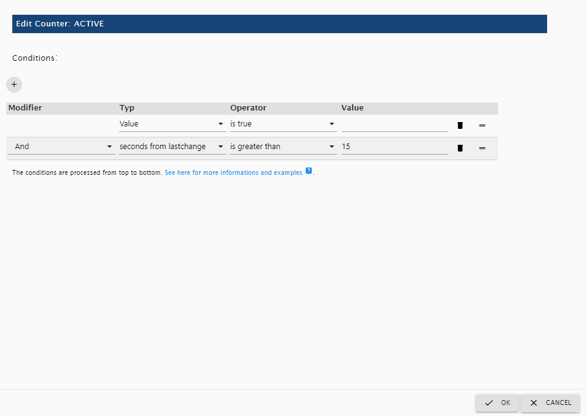
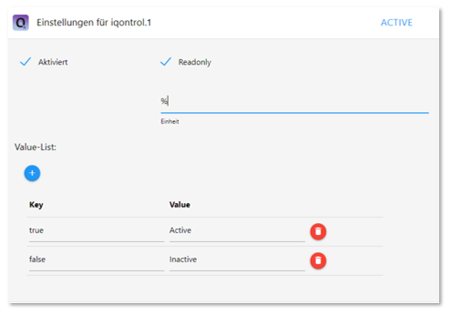

# IoBroker.iqontrol
<!-- [](https://weblate.iobroker.net/engage/adapters/?utm_source=widget) -->

**Tests:**

| Linux/Mac/Windows: | Cross-Browser-Checking: |
|---------------------------------------------------------------------------------------------------------------------------------------| --- |

**Wenn es Ihnen gefällt, denken Sie bitte über eine Spende nach:**

[](https://www.paypal.com/cgi-bin/webscr?cmd=_s-xclick&hosted_button_id=LDHZMNPXKRX2N&source=url)

****

## IQontrol-Adapter für ioBroker
Schnelle Web-App zur Visualisierung.

    

&Kopieren; von dslraser:


&Kopieren; von Muuule:


&Kopieren; von peks-64:


Läuft in jedem Browser.
Einfach einzurichten, obwohl es vollständig anpassbar und reaktionsschnell ist.

> **Dieser Adapter verwendet Sentry-Bibliotheken, um Ausnahmen und Codefehler automatisch an die Entwickler zu melden.** Weitere Details und Informationen zum Deaktivieren der Fehlerberichterstattung finden Sie unter [Sentry-Plugin-Dokumentation](https://github.com/ioBroker/plugin-sentry#plugin-sentry)! Sentry-Berichte werden ab js-controller 3.0 verwendet.

## Video-Tutorial (Deutsch):
[](https://youtube.com/playlist?list=PL8epyNz8pGEv6-R8dnfXm-m5aBlZFKOBG)

## Zum Startbildschirm hinzufügen
Sie können es als Web-App auf dem Startbildschirm speichern, und es sieht aus und fühlt sich an wie eine native App: 

Dies funktioniert auch auf Ihrem PC mit Chrome:

* Öffnen Sie iQontrol in Chrome
* Klicken Sie auf das Drei-Punkte-Menü - Weitere Tools - Verknüpfung erstellen
* Sie finden iQontrol dann im Startmenü unter Chrome-Apps und können es sogar zu Ihrer Taskleiste hinzufügen

## Du brauchst...
* Nodejs 10 oder höher
* Web-Adapter mit einer Instanz, die dasselbe Protokoll (http oder https) wie der Admin-Adapter ausführt, socket.IO auf 'integrated' gesetzt und 'Force Web-Sockets' deaktiviert
    * Wenn dies im Widerspruch zu anderen Adaptern steht, fügen Sie einfach eine weitere Instanz mit den obigen Einstellungen hinzu - iQontrol sucht die am besten passende Web-Adapter-Instanz und verwendet sie für die Kommunikation
* Für die Verbindung über *iobroker.pro-Cloud* sollten sowohl Admin- als auch Web-Adapter auf http (nicht https) eingestellt sein

* Wenn Sie auf Probleme stoßen, lesen Sie bitte den Abschnitt [Fehlerbehebung](#Fehlerbehebung) am Ende dieser Readme-Datei

##Forum
Besuchen Sie den Support-Thread [iobroker-Forum](https://forum.iobroker.net/topic/52077).
Besuchen Sie den Entwickler-Thread [iobroker-Forum](https://forum.iobroker.net/topic/22039).

##Wiki
Schau mal ins Wiki [wiki](https://github.com/sbormann/ioBroker.iqontrol/wiki).

## Wie benutzt man
**Hab keine Angst vor den vielen Optionen, die du hast.** Die meisten Dinge funktionieren sofort nach dem Auspacken. Sie *können*, müssen aber nicht alle Konfigurationsmöglichkeiten nutzen, die iQontrol bietet! Beginnen Sie einfach so:

* Beginnen Sie mit dem Erstellen von Ansichten.

Sie können Ansichten als so etwas wie eine Seite betrachten.

* Erstellen Sie dann Geräte auf diesen Ansichten.

Geräte haben eine Rolle, die die Funktion des Geräts bestimmt, welche Symbole verwendet werden und so weiter.
Abhängig von dieser Rolle können Sie mehrere Zustände mit dem Gerät verknüpfen. Diese geben dem Gerät seine Funktionalität.
Wenn Sie als Rolle „Link to other view“ auswählen, können Sie Links zu anderen Views erstellen. Ich schlage vor, Links zu anderen Ansichten mit demselben Hintergrund zu skinnen, den die verknüpfte Ansicht hat.
Sie können auch versuchen, die Auto-Create-Funktion zu verwenden, um ein vorhandenes Gerät aus dem iobroker-Objektbaum auszuwählen. Auto-Create versucht, die Rolle herauszufinden und so viele Zustände wie möglich abzugleichen.

* Anschließend können Sie eine Symbolleiste erstellen, die als Fußzeile angezeigt wird.

Toolbar-Einträge sind Links zu Ansichten.
Der erste Toolbar-Eintrag wird Ihre 'Home-Ansicht' sein, die beim Start geladen wird.

* Um allem einen ausgefallenen Stil zu verleihen, können Sie Ihre eigenen Bilder hochladen.

Sie können Ihre Bilder als Hintergrundbilder für Ansichten oder für Geräte verwenden.
Bilder im Ordner `/usericons` können als Icons für Geräte verwendet werden.
Die kostenlosen integrierten Demo-Hintergrundbilder stammen von www.pexels.com.

### Automatisch erstellen verwenden
* Innerhalb des `Views`-Tabs finden Sie einen `Views automatisch erstellen`-Button
* Wenn Sie über gut gepflegte ioBroker-Aufzählungen wie Räume oder Funktionen verfügen, können Sie diese Funktion verwenden, um automatisch Ansichten mit den in diesen Aufzählungen aufgeführten Geräten zu erstellen
* Beachten Sie, dass aufgrund der großen Anzahl verschiedener Adapter und Geräte im ioBroker-Universum die automatische Erstellungsfunktion nicht alle Geräte zu 100 % korrekt verwalten kann. Möglicherweise müssen Sie einige Einstellungen von Hand nacharbeiten, um die besten Ergebnisse zu erzielen. Die automatische Erstellung bietet Ihnen jedoch einen guten Ausgangspunkt, um in Sekundenschnelle Ihre eigene Visualisierung zu erstellen.

## URL-Parameter
* Das Frontend wird über `http[s]://<url oder ip von iobroker>:<port of web adapter>/iqontrol/index.html` aufgerufen
    * `<Port des Webadapters>` ist normalerweise 8082
* Um eine bestimmte Instanz zu öffnen, können Sie `namespace=iqontrol.<Instanznummer>` als URL-Parameter hinzufügen
* Um eine bestimmte Ansicht zu öffnen, können Sie `renderView=<viewID>` als URL-Parameter hinzufügen.
    * „<viewID>“ muss wie „iqontrol.<Instanznummer>.Views.<Ansichtsname>“ formatiert sein
* Achtung: Groß- und Kleinschreibung beachten!
* Um eine bestimmte Ansicht als Startseite zu öffnen, können Sie `home=<viewID>` als URL-Parameter hinzufügen. Dadurch wird auch die verknüpfte Ansicht des ersten Symbolleisteneintrags geändert!
    * „<viewID>“ muss wie „iqontrol.<Instanznummer>.Views.<Ansichtsname>“ formatiert sein
* Achtung: Groß- und Kleinschreibung beachten!
* Um beim Laden der Seite einen bestimmten Dialog zu öffnen, können Sie `openDialog=<deviceID>` als URL-Parameter hinzufügen
    * „<Geräte-ID>“ muss wie „iqontrol.<Instanznummer>.Views.<Ansichtsname>.Geräte.<Gerätenummer>“ formatiert werden, wobei „<Gerätenummer>“ bei 0 beginnt (also die erstes Gerät in einer Ansicht ist Gerätenummer 0)
* Achtung: Groß- und Kleinschreibung beachten!
* Verwenden Sie die folgenden Parameter, um die Rückkehr nach Zeiteinstellungen festzulegen oder zu überschreiben:
* `returnAfterTimeTreshold=<time in seconds> ` um die Zeit einzustellen, nach der die Zielansicht aufgerufen wird. Verwenden Sie &#39;0&#39;, um die Rückkehr nach Zeitfunktion zu deaktivieren.
* `returnAfterTimeDestinationView=<viewID>` um die Ansicht zu setzen, die nach dem Schwellwert aufgerufen wird. Wenn nicht angegeben, wird die Startansicht verwendet.
* Diese Optionen sind hilfreich, wenn Sie iQontrol von einem an der Wand montierten Tablet aus aufrufen, das nach der Verwendung automatisch zur Home-Ansicht zurückkehren sollte
* Um die Seite ohne Symbolleiste zu laden, können Sie `noToolbar=true` hinzufügen
* Um die Seite ohne Panel zu laden, können Sie `noPanel=true` hinzufügen
* Um die Seite ohne Symbolleiste und Panel zu laden, Wischen deaktiviert, kein Lade-Spinner und mit transparentem Ladebildschirm können Sie `isBackgroundView=true` hinzufügen
* Wenn Ihre iQontrol-Instanz durch eine Passphrase passwortgeschützt ist (siehe Optionen – Passphrase-Schutz), können Sie die Passphrase übermitteln, indem Sie „passphrase=<MyPassphrase>“ hinzufügen.

**Beispiel:**

* `https://192.168.1.1:8082/iqontrol/index.html?namespace=iqontrol.1&home=iqontrol.1.Views.Living-Room`
    * Groß- und Kleinschreibung beachten

## Schriftarten
* Sie können Ihre eigenen Schriftdateien im Bilder/Widgets-Tab in den Ordner `/userfonts` hochladen
* Im Optionen-Tab gibt es mehrere Stellen, an denen diese Schriftarten ausgewählt werden können
* Es hängt von den MIME-Einstellungen Ihres Servers ab, ob die Schriftart korrekt im Browser angezeigt wird - bei mir funktionierten am besten .ttf und .woff (getestet auf einem Raspi 4b)
    * Diese Mime-Einstellungen sollten funktionieren:
* .otf: `application/x-font-opentype`
* .ttf: `application/x-font-ttf` oder `application/x-font-truetype`
* .woff: `application/font-woff`
* .woff2: `application/font-woff2`
* .eot: `application/vnd.ms-fontobject`
* Auf `fontsquirrel.com` unter Generator können Sie Schriftarten in andere Formate konvertieren
* Denken Sie daran - Webfonts sind immer etwas knifflig und nicht jede Schriftart mit jedem Server und jedem Browser funktioniert

## Icons und Hintergrundbilder
* Sie können die eingebauten Bilder oder die Bilder verwenden, die unter der Registerkarte "Bilder" oder einer beliebigen kostenlosen URL hochgeladen wurden
* Sie können auch eine Variable innerhalb der Bild-URL verwenden. Dies kann zum Beispiel für Wettervorhersagen nützlich sein. Verwenden Sie dieses Muster:
    * `path/to/firstloaded.png|anotherpath/to/{iobrokerstate|fallback}.png`
    * Beispiel: `./../iqontrol.meta/userimages/demo/bottle.jpg|./../iqontrol.meta/userimages/demo/{javascript.0.myimage|whitestone}.jpg`
* Dies lädt `./../iqontrol.meta/userimages/demo/bottle.jpg`, wenn Sie die Ansicht öffnen
* Sobald der Status von `javascript.0.myimage` vom Server abgerufen wird, wird das Bild durch `./../iqontrol.meta/userimages/demo/XXX.jpg` ersetzt, wobei `XXX` die Wert von `javascript.0.myimage`
* Wenn `javascript.0.myimage` keinen Wert hat, wird der Fallback `whitestone` verwendet (die Verwendung des Fallbacks ist optional)

### Fortschrittsbalken
* Es ist möglich, SVG-Definitionen in Kombination mit Variablen anstelle von Bilddateien zu verwenden, um Fortschrittsbalken anzuzeigen
* Es sind viele Vorlagen integriert, aus denen Sie auswählen können, aber Sie können auch Ihre eigenen SVGs erstellen

 

* Siehe [Wiki](https://github.com/sbormann/ioBroker.iqontrol/wiki/Progress-Bars) für weitere Informationen

### Diagramme
* Sie können das ''FLOT Chart-Widget'' als Background_URL eines beliebigen Geräts hinzufügen, wodurch automatisch der Hauptzustand als Diagramm im Hintergrund der Gerätekachel angezeigt wird
* Sie müssen sicherstellen, dass der Status von einem der History-Adapter von ioBroker protokolliert und aufgezeichnet wird


## Gerätenamen
* Genau wie Variablen in Bild-URLs können Sie Variablen in Gerätenamen verwenden. Die Syntax ist fast gleich:
    * `Text beim Laden|Text nach dem Laden {iobrokerstate|fallback}`
* Zusätzlich kann der iobroker-Zustand in eckige Klammern gesetzt werden, dann wird der reine Wert ohne seine Einheit verwendet: `Text beim Laden|Text nach dem Laden {[iobrokerstate]|fallback}`
    * Beispiel: `Wetter wird geladen|Wetter: {javascript.0.weather|Keine Wetterdaten gefunden}`
* Dies zeigt "Wetter wird geladen", wenn Sie die Ansicht öffnen
* Sobald der Status von „javascript.0.weather“ vom Server abgerufen wird, wird der Text durch „Wetter: XXX“ ersetzt, wobei „XXX“ der Wert von „javascript.0.weather“ ist
* Wenn `javascript.0.weather` keinen Wert hat, wird der Fallback `Keine Wetterdaten gefunden` verwendet (die Verwendung des Fallbacks ist optional)

## Popup-Meldungen
* Jede Instanz erzeugt den Zustand `iqontrol.x.Popup.Message`
* Beim Übergeben von Werten an diesen Status wird eine Popup-Nachricht (oder Toast) angezeigt
* Sie können HTML-Tags verwenden, um den Nachrichtentext zu formatieren
* Es gibt einige zusätzliche Zustände zur weiteren Anpassung des angezeigten Popups (diese müssen gesetzt werden, bevor der Nachrichtendatenpunkt gesetzt wird):
    * `Duration`: Dies ist die Zeit in ms, in der die Nachricht angezeigt wird; bei 0 muss die Meldung bestätigt werden
    * `ClickedValue` und `ClickedDestinationState`: Wenn das Popup vom Benutzer angeklickt wird, wird der Wert von `ClickedValue` an `iqontrol.x.Popup.POPUP_CLICKED` gesendet und, falls angegeben, zusätzlich zum Datenpunkt in `ClickedDestinationState`
        * Wenn kein Wert angegeben ist, wird "true" verwendet
    * `ButtonNames`: Hier können Sie eine kommaseparierte Liste von Buttons angeben, die unten im Popup angezeigt werden (zB "OK,Abbruch")
        * `ButtonValues` und `ButtonDestinationStates`: Dies sind kommagetrennte Listen von Werten, die an `iqontrol.x.Popup.BUTTON_CLICKED` gesendet werden und, falls angegeben, zusätzlich zum Datenpunkt in `ButtonDestinationStates`, wenn der Benutzer auf das entsprechende klickt Taste
* Anstelle eines Datenpunkts können Sie die Befehle `COMMAND:renderView` und `COMMAND:openDialog` als ButtonDestinationState verwenden, um eine Ansicht zu rendern oder einen Dialog zu öffnen
* Der ButtonValue gibt dann die Ansicht bzw. Dialog und muss im Format `iqontrol.<Instanznummer>.Views.<Ansichtsname>` bzw. „iqontrol.<Instanznummer>.Views.<Ansichtsname>.Geräte.<Gerätenummer>“, wobei „<Gerätenummer>“ bei 0 beginnt (das erste Gerät in einer Ansicht ist also Gerätenummer 0)
* Wenn Sie nur einen Wert verwenden (statt einer kommagetrennten Liste), wird dieser Wert für alle Schaltflächen verwendet
* Wenn Sie `ButtonValues` leer lassen, wird der Name des Buttons verwendet
* Wenn Sie nur einen Zielstatus verwenden (anstelle einer kommagetrennten Liste), wird dieser Status für alle Schaltflächen verwendet
        * `ButtonCloses`: Dies ist eine kommaseparierte Liste von booleschen Werten (`true`/`false`), die angeben, ob das Popup geschlossen werden soll, wenn der entsprechende Button gedrückt wird
* Alternativ können Sie diese Werte auch per sendTo-Befehl mit den Parametern `PopupMessage`, `PopupDuration`, `PopupClickedValue` usw. setzen
    * Beispiel: `sendTo("iqontrol", "send", {PopupMessage: 'Das ist meine Nachricht', PopupDuration: 2500, PopupClickedValue: 'messageConfirmed'});`
* Sie können auch blockly verwenden, um Nachrichten an iQontrol zu senden

 

##Widgets
* Jede Kachel hat eine Background_URL und einen Background_HTML-Datenpunkt
* Hier können Sie einen Link (perHINTERGRUND_URL) zu einer Website definieren oder direkten HTML-Code (perHINTERGRUND_HTML) platzieren, der als Hintergrund der Kachel angezeigt wird
* Dies gibt Ihnen die Möglichkeit, (interaktive) Inhalte innerhalb einer Kachel zu platzieren (wie Uhren, FLOT-Charts, Tabellen, Wettervorhersagen usw.)
* Standardmäßig werden Mausereignisse auf diesen Inhalt geleitet (daher können Sie nicht mehr auf die Kachel selbst klicken), aber Sie können dies mit der Option "Mausereignisse auf die Kachel leiten statt auf den Inhalt von "HINTERGRUND_ANSICHT/URL/HTML" deaktivieren "
* iQontrol bietet eine Geräterolle "Widget" mit einigen vordefinierten Optionen, die meistens verwendet werden, wenn eine Website als Widget angezeigt wird. Aber Sie können das gleiche Ergebnis mit jeder anderen Rolle erzielen, indem Sie die Geräteoptionen richtig ändern.


<details><summary>Widget-Entwicklung (nur für Experten): (<ins> zum Öffnen anklicken</ins> )</summary>

### PostMessage-Kommunikation
* Technisch gesehen wird der Inhalt vonROUND_VIEW/URL/HTML in ein HTML-Element namens iframe platziert, das eine Website innerhalb einer Website ist
* Durch Aktivieren der Option "PostMessage-Kommunikation für Background_VIEW/URL/HTML zulassen" können Sie die PostMessage-Kommunikation zwischen der Website in diesem iFrame und iQontrol selbst aktivieren
* Um Befehle an iQontrol zu senden, können Sie den folgenden Javascript-Befehl verwenden: `window.parent.postMessage(message, "*");`
    * „Nachricht“ ist ein Javascript-Objekt im Format „{ Befehl: Befehl, Status-ID: Status-ID, Wert: Wert }“.
    * Die folgenden Nachrichtenbefehle werden unterstützt:
        * `{ Befehl: "setWidgetState", stateId: <widgetStateId>, Wert: <value> }`
* Dadurch wird der ioBroker-Zustand `iqontrol.<Instanz>.Widgets.<WidgetStateId>` auf den Wert `<Wert>` gesetzt (`<Wert>` kann ein String, eine Zahl oder ein boolescher Wert oder ein Objekt wie `{ val sein: <Wert>, Bestätigung: wahr|falsch }`)
        * `{ Befehl: "getWidgetState", stateId: <widgetStateId> }`
* Dies veranlasst iQontrol, den Wert des ioBroker-Status `iqontrol.<instance>.Widgets.<widgetStateId>` zu senden (siehe unten, wie man die Antwortnachricht erhält)
        * `{ Befehl: "getWidgetStateSubscribed", stateId: <widgetStateId> }`
* Dies veranlasst iQontrol, den Wert des ioBroker-Zustands `iqontrol.<instance>.Widgets.<widgetStateId>` jetzt und jedes Mal zu senden, wenn sich sein Wert ändert (siehe unten, wie man die Antwortnachrichten erhält).
        * `{ Befehl: "setWidgetDeviceState", stateId: <widgetDeviceState>, Wert: <value> }`
* Dadurch wird der ioBroker-Datenpunkt, der dem Geräte-STATUS `<widgetDeviceState>` zugewiesen ist (z. B. der Datenpunkt, der LEVEL zugewiesen ist), auf den Wert `<Wert>` gesetzt (`<Wert>` kann eine Zeichenfolge sein, Zahl oder Boolean oder ein Objekt wie `{ val: <value>, ack: true|false }`)
        * `{ Befehl: "getWidgetDeviceState", stateId: <widgetDeviceState> }`
* Dies veranlasst iQontrol, den Wert des ioBroker-Datenpunkts zu senden, der dem Gerät STATE `<widgetDeviceState>` zugewiesen ist (z. B. der Datenpunkt, der LEVEL zugewiesen ist; siehe unten, wie man die Antwortnachricht erhält)
        * `{ Befehl: "getWidgetDeviceStateSubscribed", stateId: <widgetDeviceState> }`
* Dies bewirkt, dass iQontrol den Wert des ioBroker-Datenpunkts sendet, der dem Gerät STATE `<widgetDeviceState>` zugewiesen ist (zum Beispiel der Datenpunkt, der LEVEL zugewiesen ist) jetzt und jedes Mal, wenn sich sein Wert ändert (siehe unten, wie man Antwortnachricht erhalten)
        * `{ Befehl: "setState", stateId: <stateId>, Wert: <value> }`
* Dadurch wird der ioBroker-Status `<stateId>` auf den Wert `<value>` gesetzt (`<value>` kann ein String, eine Zahl oder ein boolescher Wert oder ein Objekt wie `{ val: <value>, ack: true| sein falsch }`)
        * `{ Befehl: "getState", stateId: <stateId> }`
* Dies veranlasst iQontrol, den Wert des ioBroker-Status `<stateId>` zu senden (siehe unten, wie man die Antwortnachricht erhält)
        * `{ Befehl: "getStateSubscribed", stateId: <stateId> }`
* Dies veranlasst iQontrol, den Wert des ioBroker-Zustands `<stateId>` jetzt und jedes Mal zu senden, wenn sich sein Wert ändert (siehe unten, wie Sie die Antwortnachrichten erhalten)
        * `{ Befehl: "getOptions"}`
* Dies veranlasst iQontrol, die Benutzeroptionen zu senden, die der Benutzer als Objekt konfiguriert hat
        * `{ Befehl: "renderView", Wert: <viewID> }`
* Dies weist iQontrol an, eine Ansicht zu rendern, wobei „<viewID>“ wie „iqontrol.<Instanznummer>.Views.<Ansichtsname>“ formatiert werden muss (Groß-/Kleinschreibung beachten).
        * `{ Befehl: "openDialog", Wert: <deviceID> }`
* Dies weist iQontrol an, einen Dialog zu öffnen, in dem „<Geräte-ID>“ wie folgt formatiert werden muss: „iqontrol.<Instanznummer>.Ansichten.<Ansichtsname>.Geräte.<Gerätenummer>“, wobei „<Gerät -number>` beginnt bei 0 (das erste Gerät in einer Ansicht ist also die Gerätenummer 0)
* Um Nachrichten von iQontrol zu erhalten, müssen Sie mit dem Javascript-Befehl `window.addEventListener("message", receivePostMessage, false);` einen Event-Listener für das "message"-Ereignis registrieren
    * Die Funktion `receivePostMessage` empfängt das Objekt `event`
* `event.data` enthält die Nachricht von iqontrol, die ein Objekt sein wird wie:
* event.data = `{ command: "getState", stateId: <stateId>, value: <stateObject> }` - dies ist die Antwort auf einen `getState`-Befehl oder einen `getStateSubscribed`-Befehl und gibt Ihnen die aktuelles `<value>`-Objekt des ioBroker-Status`<stateId>`
* `<stateObject>` selbst ist ein Objekt wie

			```
			event.data.value = {
				val: <value (rounded)>,
				unit: "<unit>",
				valFull: <value (not rounded, no javascript-injection prevention)>,
				plainText: "<clear text of val, for example taken from valuelist>",
				min: <minimum>,
				max: <maximum>,
				step: <step-width>,
				valuelist: {<object with possible values and corresponding clear text>},
				targetValues: {<target value list>},
				ack: <true|false>,
				readonly: <true|false>,
				custom: {<object with custom settings>},
				id: <id of the iobroker datapoint>,
				from: "<source of state>",
				lc: <timestamp of last change>,
				ts: <timestamp of last actualization>,
				q: <quality of signal>,
				role: "<role of state>",
				type: "<string|number|boolean>",
				name: "<name of datapoint>",
				desc: "<description of datapoint>",
				Date: <Date-object (only present, if value is regognized as a valid time or period)>
			}
			```

* Um iQontrol anzuweisen, einen WidgetState unter `iqontrol.<Instanz>.Widgets` zu generieren, können Sie ein Meta-Tag im Head-Bereich der Widget-Website verwenden:
    * Syntax:

```
<meta name="widget-datapoint" content="WidgetName.StateName" data-type="string" data-role="text" />
```

    * Sie können den Datenpunkt weiter konfigurieren, indem Sie die Attribute data-type (der auf string, number oder boolean gesetzt werden kann), data-role, data-name, data-min, data-max, data-def und data-unit Attribute verwenden
    * Sie können auch einen URL-Parameter (siehe unten) als Variable verwenden, um beispielsweise eindeutige Instanzen der Widgets mit eigenen Datenpunkten zu erstellen.
        * Die Syntax lautet dann:

		  ```
          <meta name="widget-datapoint" content="WidgetName.StateName|WidgetName.{instance}.StateName" data-type="string" data-role="text" />
          ```

        * Wenn die Variable `instance` gesetzt ist, dann wird der Teil nach dem `|` als WidgetState-Name verwendet und `{instance}` wird durch den Wert von `instance` ersetzt
        * Wenn die Variable `instance` nicht gesetzt ist, wird der Teil vor dem `|` als `wigdetState`-Name verwendet
    * Der entsprechende Datenpunkt wird nur dann erstellt, wenn die Widget-Website einem Gerät als URL oder Background_URL hinzugefügt wird
* Dasselbe Konzept kann für den URL/HTML-Status verwendet werden, der verwendet wird, um eine Website innerhalb des Dialogs eines Geräts anzuzeigen
* Um ein Symbol für Ihr Widget zu erstellen, platzieren Sie eine .png-Datei mit demselben Dateinamen wie das Widget im Widgets-Verzeichnis
* Siehe unten für eine Beispiel-Widget-Website:

<details><summary>Beispiel-Widget-Website anzeigen, die als Widget mit postMessage-Kommunikation angezeigt werden soll: (<ins> zum Öffnen anklicken</ins> )</summary>

* Sie können den folgenden HTML-Code verwenden und ihn in den Background_HTML-State eines Widgets kopieren (das dann als "Constant" konfiguriert werden muss)
* Alternativ können Sie diesen Code auch als html-Datei in das Unterverzeichnis `/userwidgets` hochladen und auf den Background_URL-State referenzieren (der dann auch als "Constant" konfiguriert werden muss)
* Aktivieren Sie die Option "PostMessage-Kommunikation für Background_VIEW/URL/HTML zulassen"
* Es wird gezeigt, wie eine bidirektionale Kommunikation zwischen der Website und iQontrol erfolgt

```html
<!doctype html>
<html>
<head>
	<meta http-equiv="Content-Type" content="text/html; charset=UTF-8"/>
	<meta name="widget-datapoint" content="postMessageTest.test" data-type="string" data-role="text" />
	<meta name="widget-description" content="This is a test widget. To get the WidgetDeviceState-Functions working, please set a valid iobroker-datapoint for STATE. (C) by Sebastian Bormann"/>
	<meta name="widget-urlparameters" content="title/postMessageTest/Please enter a title">
	<meta name="widget-options" content="{'noZoomOnHover': 'true', 'hideDeviceName': 'true', 'sizeInactive': 'xwideIfInactive highIfInactive', 'iconNoPointerEventsInactive': 'true', 'hideDeviceNameIfInactive': 'true', 'hideStateIfInactive': 'true', 'sizeActive': 'xwideIfActive highIfActive', 'bigIconActive': 'true', 'iconNoPointerEventsActive': 'true', 'hideDeviceNameIfActive': 'true', 'hideStateIfActive': 'true', 'sizeEnlarged': 'fullWidthIfEnlarged fullHeightIfEnlarged', 'bigIconEnlarged': 'true', 'iconNoPointerEventsEnlarged': 'false', 'noOverlayEnlarged': 'true', 'hideDeviceNameIfEnlarged': 'true', 'hideStateIfEnlarged': 'true', 'popupAllowPostMessage': 'true', 'backgroundURLAllowPostMessage': 'true', 'backgroundURLNoPointerEvents': 'false'}"/>
 	<title>iQontrol postMessageTest</title>
</head>
<body>
	<br><br>
	<h3><span id="title">postMessageTest</span><h3>
	<button onclick="getWidgetState('postMessageTest.test')">getWidgetState postMessageTest.test</button><br>
	<button onclick="getWidgetStateSubscribed('postMessageTest.test')">getWidgetStateSubscribed postMessageTest.test</button><br>
	<button onclick="setWidgetState('postMessageTest.test', 'Hello world')">setWidgetState postMessageTest.test to 'Hello world'</button><br>
  	<br>
	<button onclick="getWidgetDeviceState('STATE')">getWidgetDeviceState STATE</button><br>
	<button onclick="getWidgetDeviceStateSubscribed('STATE')">getWidgetDeviceStateSubscribed STATE</button><br>
	<button onclick="setWidgetDeviceState('STATE', 'Hello world')">setWidgetDeviceState STATE to 'Hello world'</button><br>
  	<br>
	<button onclick="getState('system.adapter.admin.0.cpu')">getState system.adapter.admin.0.cpu</button><br>
	<button onclick="getStateSubscribed('system.adapter.admin.0.uptime')">getStateSubscribed system.adapter.admin.0.uptime</button><br>
	<button onclick="setState('iqontrol.0.Popup.Message', 'Hey, this is a test Message')">setState popup message</button><br>
  	<br>
	<button onclick="renderView('iqontrol.0.Views.Home')">renderView 'Home'</button><br>
	<button onclick="openDialog('iqontrol.0.Views.Home.devices.0')">openDialog 1st device on 'Home'</button><br>
	<br><hr>
	message sent: <span id="messageSent">-</span><br>
	<br><hr>
	message received: <span id="messageReceived">-</span><br>
	<br><hr>
	this means: <span id="thisMeans">-</span><br>
	<br><hr>
    <script type="text/javascript">
		var countSend = 0;
		var countReceived = 0;

		//Set title from UrlParameter
		document.getElementById('title').innerHTML = getUrlParameter('title') || "No Title set";

		//getWidgetState
		function getWidgetState(stateId){
			sendPostMessage("getWidgetState", stateId);
		}

		//getWidgetStateSubscribed (this means, everytime the state changes, an update will be received)
		function getWidgetStateSubscribed(stateId){
			sendPostMessage("getWidgetStateSubscribed", stateId);
		}

		//setWidgetState
		function setWidgetState(stateId, value){
			sendPostMessage("setWidgetState", stateId, value);
		}


		//getWidgetDeviceState
		function getWidgetDeviceState(stateId){
			sendPostMessage("getWidgetDeviceState", stateId);
		}

		//getWidgetDeviceStateSubscribed (this means, everytime the state changes, an update will be received)
		function getWidgetDeviceStateSubscribed(stateId){
			sendPostMessage("getWidgetDeviceStateSubscribed", stateId);
		}

		//setWidgetDeviceState
		function setWidgetDeviceState(stateId, value){
			sendPostMessage("setWidgetDeviceState", stateId, value);
		}


		//getState
		function getState(stateId){
			sendPostMessage("getState", stateId);
		}

		//getStateSubscribed (this means, everytime the state changes, an update will be received)
		function getStateSubscribed(stateId){
			sendPostMessage("getStateSubscribed", stateId);
		}

		//setState
		function setState(stateId, value){
			sendPostMessage("setState", stateId, value);
		}


		//renderView
		function renderView(viewId){
			sendPostMessage("renderView", null, viewId);
		}

		//openDialog
		function openDialog(deviceId){
			sendPostMessage("openDialog", null, deviceId);
		}

		// +++++ Default Functions +++++
		//getUrlParameter
		function getUrlParameter(name) {
			name = name.replace(/[\[]/, '\\[').replace(/[\]]/, '\\]');
			var regex = new RegExp('[\\?&]' + name + '=([^&#]*)');
			var results = regex.exec(location.search);
			return results === null ? null : decodeURIComponent(results[1].replace(/\+/g, ' '));
		};

		//send postMessages
		function sendPostMessage(command, stateId, value){
			countSend++;
			message = { command: command, stateId: stateId, value: value };
			document.getElementById('messageSent').innerHTML = countSend + " - " + JSON.stringify(message);
			window.parent.postMessage(message, "*");
		}

		//receive postMessages
		window.addEventListener("message", receivePostMessage, false);
		function receivePostMessage(event) { //event = {data: message data, origin: URL of origin, source: id of sending element}
			countReceived++;
			if(event.data) document.getElementById('messageReceived').innerHTML = countReceived + " - " + JSON.stringify(event.data);
			if(event.data && event.data.command) switch(event.data.command){
				case "getState":
				if(event.data.stateId && event.data.value && event.data.value.val){
					document.getElementById('thisMeans').innerHTML = "Got State " + event.data.stateId + " with value " + event.data.value.val;
				}
				break;
			}
		}
	</script>
</body>
</html>
```

</Details>

### Weitere Konfiguration von Widgets
* Es gibt zusätzliche Meta-Tags, die Sie im Head-Bereich Ihrer Widget-Website verwenden können, um das Verhalten des Widgets zu konfigurieren:
* `Widget-Beschreibung`
* Syntax:

		  ```  
          <meta name="widget-description" content="Please see www.mywebsite.com for further informations. (C) by me"/>
          ```

* Der Inhalt wird angezeigt, wenn Sie das Widget als URL oder Background_URL auswählen oder wenn Sie ein Widget automatisch erstellen
* `Widget-URL-Parameter`
* Syntax:

		  ```
          <meta name="widget-urlparameters" content="parameter/default value/description/type;parameter2/default value2/description2/type2"/>
          ```

 * Der Benutzer wird nach diesen Parametern gefragt, wenn er das Widget als URL oder Background_URL auswählt oder automatisch ein Widget erstellt
* `type` ist optional und kann `text` (Standard), `number`, `checkbox`, `color`, `select`, `multipleSelect`, `combobox`, `historyInstance`, `datapoint` sein, `listJsonDatapoint`, `icon`, `fontFamily`, `fontSize`, `fontStyle`, `fontWeight`, `language`, `section`, `divider`, `info`, `link` oder `hidden`
* Wenn der Typ „select“, „multipleSelect“ oder „combobox“ ist, müssen Sie die möglichen Optionen angeben, indem Sie „/<selectOptions>“ hinzufügen, wobei „<selectOptions>“ eine Zeichenfolge im Format „<value1>,<“ ist caption1>/<value2>,<caption2>/...` (Combobox ist eine Auswahlbox mit der Möglichkeit zur Eingabe von freiem Text)
* Wenn der Typ `number` ist, kann durch Hinzufügen von `/<numberOptions>` die Mindest-, Maximal- und Schrittweite angegeben werden, wobei `<numberOptions>` eine Zeichenfolge im Format `<min>,<max>,<step> ist `
* Die Typen `section`, `divider`, `info` und `link` haben keine weitere Funktion, sie dienen lediglich dazu, dem Benutzer Informationen anzuzeigen. Für `link` sollte der Wert eine URL sein, aber alle Slashes müssen durch Backslashes ersetzt werden.
* Type `hidden` wird an das Widget übergeben, aber es wird kein Konfigurationsdialog angezeigt
* Alle diese Parameter werden der Widget-Website über einen URL-Parameter-String (wie `widget.html?parameter=value&parameter2=value2`) übergeben.
* Sie können diese Einstellungen innerhalb Ihrer Widget-Website verwenden, indem Sie die URL-Parameter mit einer Funktion wie dieser anfordern:

			```
			function getUrlParameter(name) {
				name = name.replace(/[\[]/, '\\[').replace(/[\]]/, '\\]');
				var regex = new RegExp('[\\?&]' + name + '=([^&#]*)');
				var results = regex.exec(location.search);
				return results === null ? null : decodeURIComponent(results[1].replace(/\+/g, ' '));
			};
			```

* Wenn Sie als URL-Parameter den Typ `icon` verwendet haben, erhalten Sie entweder einen relativen Pfad zum iqontrol-Verzeichnis oder einen absoluten Pfad zu einem Bild. Um einen gültigen Link zu Ihrem Bild zu erstellen, können Sie diesen Code verwenden:

			    ```
				var iconOn = getUrlParameter('iconOn') || './images/icons/switch_on.png';
				if(iconOn.indexOf('http') != 0) iconOn = '/iqontrol/' + iconOn;
				```

* `Widget-Optionen`
* Syntax:

		  ```
          <meta name="widget-options" content="{'noZoomOnHover': 'true', 'hideDeviceName': 'true'}"/>
          ```

* Siehe den erweiterbaren Abschnitt unten für die möglichen Optionen, die durch dieses Meta-Tag konfiguriert werden können

* `widget-replaceurl`
        * Syntax:

```
<meta name="widget-replaceurl" content="<url>" data-absolute="<true|false>"/>

        * Dies konfiguriert die verwendete URL/BACKGROUND_URL für dieses Widget neu (auf diese Weise könnten Sie Widget-Voreinstellungen definieren, die verwendet werden, um dem Benutzer spezielle oder vereinfachte Konfigurationen zu geben. Aber wenn das Widget aufgerufen wird, verwendet iQontrol stattdessen die angegebene `<url>` der Original-URL.
        * Standardmäßig wird nur der Dateiname (mit Erweiterung) ersetzt. Beim Setzen von `data-absolute=`true`` wird die gesamte URL ersetzt.

<details><summary>Mögliche Optionen anzeigen, die durch das Meta-Tag &#39;widget-options&#39; konfiguriert werden können: (<ins> zum Öffnen anklicken</ins> )</summary>

* Symbole:
* `icon_on` (Symbol an):
* Standard: ""
* `icon_off` (Symbol aus):
* Standard: ""
* Gerätespezifische Optionen:
* `showState` (Show State) - nur gültig für die Rolle Button und Program:
* Mögliche Werte: `true`|`false`
* Standard: „falsch“.
* `showPowerAsState: ` (POWER als Zustand anzeigen) - nur gültig für die Rollen Switch, Light und Fan:
* Mögliche Werte: `true`|`false`
* Standard: „falsch“.
* `buttonCaption` (Beschriftung für Button) - nur gültig für Rolle Button:
* Standard: ""
* `returnToOffSetValueAfter` (Rückkehr zu 'OFF_SET_VALUE' nach [ms]) - nur gültig für Rolle Button:
* Mögliche Werte: Zahl von 10 bis 60000
* Standard: ""
* `alwaysSendTrue` (immer 'true' senden (nicht toggeln)) - nur gültig für Rollenszene:
* Mögliche Werte: `true`|`false`
* Standard: „falsch“.
* `closeDialogAfterExecution` (Dialog nach Ausführung schließen) - nur gültig für Rolle Button, Programm und Szene:
* Mögliche Werte: `true`|`false`
* Standard: „falsch“.
* `invertCt` (Invert CT (verwende Kelvin statt Mired)) - nur gültig für Rolle Light:
* Mögliche Werte: `true`|`false`
* Standard: „falsch“.
* `alternativeColorspace` (Colorspace for ALTERNATIVE_COLORSPACE_VALUE") - nur gültig für Rolle Light:
* Mögliche Werte: ""|"RGB"|"#RGB"|"RGBW"|"#RGBW"|"RGBWWCW"|"#RGBWWCW"|"RGBCWWW"|"#RGBCWWW"|"RGB_HUEONLY"|"#RGB_HUEONLY "|"HUE_MILIGHT"|"HHSSBB_TUYA"
* Standard: ""
* `linkOverlayActiveColorToHue` (Farbe der Lampe als OVERLAY_ACTIVE_COLOR verwenden) - nur gültig für Rolle Light:
* Mögliche Werte: `true`|`false`
* Standard: „falsch“.
* `linkGlowActiveColorToHue` (Farbe der Lampe als GLOW_ACTIVE_COLOR verwenden) - nur gültig für Rolle Light:
* Mögliche Werte: `true`|`false`
* Standard: „falsch“.
* `controlModeDisabledValue` (Wert von CONTROL_MODE für 'disabled') - nur gültig für Rolle Thermostat:
* Standard: ""
* `stateClosedValue` (Wert von STATE für 'closed') - nur gültig für Rolle Window und Door with Lock:
* Standard: ""
* `stateOpenedValue` (Wert von STATE für 'opened') - nur gültig für Rolle Window:
* Standard: ""
* `stateTiltedValue` (Wert von STATE für 'tilted') - nur gültig für Rolle Window:
* Standard: ""
* `lockStateLockedValue` (Wert von LOCK_STATE für 'locked') - nur gültig für Rolle Door with Lock:
* Standard: ""
* `invertActuatorLevel` (Invert LEVEL (0 = open)) - nur gültig für Rolle Blind:
* Mögliche Werte: `true`|`false`
* Standard: „falsch“.
* `directionOpeningValue` (Wert von DIRECTION für 'opening') - nur gültig für Rolle Window:
* Standard: "1"
* `directionOpeningValue` (Wert von DIRECTION für 'opening') - nur gültig für Rolle Window:
* Standard: "2"
* `directionUncertainValue` (Wert von DIRECTION für 'uncertain') - nur gültig für Rolle Window:
* Standard: "3"
* `favoritePositionCaption` (Beschriftung für FAVORITE_POSITION) - nur gültig für Rolle Fenster:
* Standard: "Lieblingsposition"
* `stopCaption` (Beschriftung für STOP) - nur gültig für Rolle Window:
* Vorgabe: „Stopp“
* `downCaption` (Beschriftung für DOWN) - nur gültig für Rolle Window:
* Standard: "Nach unten"
* `controlModeDisarmedValue` (Wert von CONTROL_MODE für 'disarmed') - nur gültig für Rolle Alarm:
* Standard: "0"
* `showStateAndLevelSeparatelyInTile` (Zeige STATE und LEVEL separat in Kachel) - nur gültig für Rollenwert:
* Mögliche Werte: ""|"devidedByComma"|"devidedByComma preceedCaptions"|"devidedBySemicolon"|"devidedBySemicolon preceedCaptions"|"devidedByHyphen"|"devidedByHyphen preceedCaptions"
* Standard: ""
* `timeCaption` (Beschriftung für TIME) - nur gültig für Rolle DateAndTime:
* Standard: ""
* `timeFormat` (Format von TIME (wie im Datenpunkt gespeichert, siehe Readme)) - nur gültig für Rolle DateAndTime:
* Standard: "x"
* `timeDisplayFormat` (Display-Format von TIME (wie es angezeigt werden soll, siehe Readme)) - nur gültig für Rolle DateAndTime:
* Standard: "tttt, TT.MM.JJJJ HH:mm:ss"
* `timeDisplayDontShowDistance` (Entfernung anzeigen) - nur gültig für die Rolle DateAndTime:
* Mögliche Werte: ""|`false`|`true`
* Standard: "" (d.h. benutzerdefinierte Datenpunkteinstellungen verwenden)
* `dateAndTimeTileActiveConditions` (Tile ist aktiv, wenn alle ausgewählten Elemente wahr sind) - nur gültig für Rolle DateAndTime:
* Mögliche Werte (Array): "activeIfStateActive", "activeIfTimeNotZero", "activeIfTimeInFuture", "activeIfTimeInPast"
* Standard: "activeIfStateActive,activeIfTimeInFuture"
* `dateAndTimeTileActiveWhenRinging` (Tile ist immer aktiv, wenn RINGING aktiv ist) - nur gültig für Rolle DateAndTime:
* Standard: wahr
* `dateAndTimeShowInState` (Im Status anzeigen) - nur gültig für Rolle DateAndTime:
* Mögliche Werte (Array): "showStateIfInactive", "showStateIfActive", "showSubjectIfActive", "showSubjectIfInactive", "showTimeIfInactiveAndInPast", "showTimeIfInactiveAndInFuture", "showTimeIfActiveAndInPast", "showTimeIfActiveAndInFuture", "showTimeDistanceIfInactiveAndInPast", "showTimeDistanceIfInactiveAndInFuture", "showTimeDistanceIfActiveAndInPast" , "showTimeDistanceIfActiveAndInFuture"
* Standard: "showStateIfInactive,showSubjectIfActive,showTimeDistanceIfActiveAndInFuture"
* `coverImageReloadDelay` (Reload des Cover-Bildes verzögern [ms]) - nur gültig für Rolle Media:
* Mögliche Werte: Zahl von 0 bis 5000
* Standard: ""
* `coverImageNoReloadOnTitleChange: ` (Kein erzwungenes Neuladen des Coverbildes bei Änderung des TITLE) - nur gültig für Rolle Media:
* Mögliche Werte: `true`|`false`
* Standard: „falsch“.
* `statePlayValue` (Wert von STATE für 'play') - nur gültig für Rolle Media:
* Standard: "spielen"
* `statePauseValue` (Wert von STATE für 'pause') - nur gültig für Rolle Media:
* Standard: "Pause"
* `stateStopValue` (Wert von STATE für 'stop') - nur gültig für Rolle Media:
* Vorgabe: „stopp“
* `hidePlayOverlay` (Hide Play Icon) - nur gültig für Rolle Media:
* Mögliche Werte: `true`|`false`
* Standard: „falsch“.
* `hidePauseAndStopOverlay` (Pause- und Stop-Icon ausblenden) - nur gültig für Rolle Media:
* Mögliche Werte: `true`|`false`
* Standard: „falsch“.
* `repeatOffValue` (Wert von REPEAT für 'off') - nur gültig für Rolle Media:
* Standard: „falsch“.
* `repeatAllValue` (Wert von REPEAT für 'alle wiederholen') - nur gültig für Rolle Media:
* Standard: „true“.
* `repeatOneValue` (Wert von REPEAT für 'repeat one') - nur gültig für Rolle Media:
* Standard: "2"
* `remoteKeepSectionsOpen` (Abschnitte offen halten) - nur gültig für Rolle Medien:
* Mögliche Werte: `true`|`false`
* Standard: „falsch“.
* `remoteSectionsStartOpened` (Beginnen Sie mit diesen anfangs geöffneten Abschnitten) - nur gültig für die Rolle Medien:
* Mögliche Werte: Array mit "REMOTE_PAD", "REMOTE_CONTROL", "REMOTE_ADDITIONAL_BUTTONS", "REMOTE_CHANNELS", "REMOTE_NUMBERS" und/oder "REMOTE_COLORS"
* Standard: „falsch“.
* `remoteShowDirectionsInsidePad` (Vol und Ch +/- im Pad anzeigen) - nur gültig für Rolle Media:
* Mögliche Werte: `true`|`false`
* Standard: „falsch“.
* `remoteChannelsCaption` (Beschriftung für Abschnitt 'Channels') - nur gültig für Rolle Media:
* Standard: ""
* `remoteAdditionalButtonsCaption` (Beschriftung für Abschnitt 'Zusätzliche Schaltflächen') - nur gültig für Rolle Medien:
* Standard: ""
* `noVirtualState` (keinen virtuellen Datenpunkt für STATE verwenden (Schalter ausblenden, wenn STATE leer ist)) - nur gültig für Rolle Widget:
* Mögliche Werte: `true`|`false`
* Standard: „falsch“.
* Allgemein:
* `stateCaption` (Beschriftung von STATE):
* Standard: ""
* `levelCaption` (Beschriftung von LEVEL):
* Standard: ""
* `readonly` (Nur lesen):
* Mögliche Werte: `true`|`false`
* Standard: „falsch“.
* `renderLinkedViewInParentInstance` (Verknüpfte Ansicht in übergeordneter Instanz öffnen, wenn diese Ansicht als Background_VIEW verwendet wird):
* Mögliche Werte: `true`|`false`
* Standard: „falsch“.
* `renderLinkedViewInParentInstanceClosesPanel` (Nach dem Öffnen der verknüpften Ansicht in der übergeordneten Instanz das Bedienfeld schließen (falls es geschlossen werden kann)):
* Mögliche Werte: `true`|`false`
* Standard: „falsch“.
* Tile-Verhalten (allgemein):
* `clickOnIconAction` (Klick auf Symbolaktion):
* Mögliche Werte: "toggle"|"openDialog"|"enlarge"|"openLinkToOtherView"|"openURLExternal"|`false`
* Standard: "umschalten"
* `clickOnTileAction` (Klick auf Kachelaktion):
* Mögliche Werte: "toggle"|"openDialog"|"enlarge"|"openLinkToOtherView"|"openURLExternal"|`false`
* Standard: "openDialog"
* `clickOnIconOpensDialog` (Klick auf Icon öffnet Dialog (anstatt umzuschalten)):
* *veraltet*, da diese Option jetzt in clickOnIconAction enthalten ist
* Mögliche Werte: `true`|`false`
* Standard: „falsch“.
* `clickOnTileToggles` (Klicken Sie auf die Kachelschalter (anstatt den Dialog zu öffnen))):
* *veraltet*, da diese Option jetzt in clickOnTileAction enthalten ist
* Mögliche Werte: `true`|`false`
* Standard: „falsch“.
* `clickOnTileOpensDialog` (Klick auf Kachel öffnet Dialog):
* *veraltet*, da diese Option jetzt in clickOnTileAction enthalten ist
* Mögliche Werte: `true`|`false`
* Standard: `true` (für die meisten Geräte)
* `noZoomOnHover` (Zoom-Effekt beim Schweben deaktivieren):
* Mögliche Werte: `true`|`false`
* Standard: `false` (für die meisten Geräte)
* `iconNoZoomOnHover` (Zoom-Effekt beim Hover für Icon deaktivieren):
* Mögliche Werte: `true`|`false`
* Standard: „falsch“.
* `hideDeviceName` (Gerätename ausblenden):
* Mögliche Werte: `true`|`false`
* Standard: „true“.
* Bedingungen für ein aktives Plättchen:
* `tileActiveStateId` (State ID (leer = STATE/LEVEL wird verwendet)):
* Standard: ""
* `tileActiveCondition` (Bedingung):
* Mögliche Werte: ""|"at"|"af"|"eqt"|"eqf"|"eq"|"ne"|"gt"|"ge"|"lt"|"le"
* Standard: ""
* `tileActiveConditionValue` (Bedingungswert):
* Standard: ""
* Tile-Verhalten bei inaktivem Gerät:
* `sizeInactive` (Kachelgröße, wenn Gerät inaktiv):
* Mögliche Werte: ""|"narrowIfInactive shortIfInactive"|"narrowIfInactive"|"narrowIfInactive highIfInactive"|"narrowIfInactive xhighIfInactive"|"shortIfInactive"|"shortIfInactive wideIfInactive"|"shortIfInactive xwideIfInactive"|"wideIfInactive"|"xwideIfInactive"|"highIfInactive "|"xhighIfInactive"|"wideIfInactive highIfInactive"|"xwideIfInactive highIfInactive"|"wideIfInactive xhighIfInactive"|"xwideIfInactive xhighIfInactive"|"fullWidthIfInactive Aspekt-1-1IfInactive"|"fullWidthIfInactive Aspekt-4-3IfInactive"|"fullWidthIfInactive Aspekt-3- 2IfInactive"|"fullWidthIfInactive Aspekt-16-9IfInactive"|"fullWidthIfInactive Aspekt-21-9IfInactive"|"fullWidthIfInactive fullHeightIfInactive"|"
* Standard: "xwideIfInactive highIfInactive"
* `stateHeightAdaptsContentInactive` (Höhe von STATE an seinen Inhalt anpassen (dies überschreibt ggf. die Kachelgröße), wenn das Gerät inaktiv ist):
* Mögliche Werte: `true`|`false`
* Standard: „falsch“.
* `stateFillsDeviceInactive` (Größe von STATE füllt das komplette Gerät (dies kann andere Inhalte stören), wenn das Gerät inaktiv ist):
* Mögliche Werte: `true`|`false`
* Standard: „falsch“.
* `stateBigFontInactive` (Große Schrift für STATE verwenden, wenn das Gerät inaktiv ist):
* Mögliche Werte: `true`|`false`
* Standard: „falsch“.
* `bigIconInactive` (Großes Icon anzeigen, wenn Gerät inaktiv):
* Mögliche Werte: `true`|`false`
* Standard: „falsch“.
* `iconNoPointerEventsInactive` (Mausereignisse für das Icon ignorieren, wenn Gerät inaktiv):
* Mögliche Werte: `true`|`false`
* Standard: „falsch“.
* `transparentIfInactive` (Hintergrund transparent machen, wenn Gerät inaktiv):
* Mögliche Werte: `true`|`false`
* Standard: „falsch“.
* `noOverlayInactive` (Überlagerung der Kachel entfernen, wenn Gerät inaktiv):
* Mögliche Werte: `true`|`false`
* Standard: „true“.
* `hideBackgroundURLInactive` (Hintergründe von Background_VIEW/URL/HTML ausblenden, wenn das Gerät inaktiv ist):
* Mögliche Werte: `true`|`false`
* Standard: „falsch“.
* `hideDeviceNameIfInactive` (Gerätenamen ausblenden, wenn das Gerät inaktiv ist):
* Mögliche Werte: `true`|`false`
* Standard: „falsch“.
* `hideInfoAIfInactive` (Hide INFO_A, wenn das Gerät inaktiv ist):
* Mögliche Werte: `true`|`false`
* Standard: „falsch“.
* `hideInfoBIfInactive` (Hide INFO_B, wenn das Gerät inaktiv ist):
* Mögliche Werte: `true`|`false`
* Standard: „falsch“.
* `hideIndicatorIfInactive` (Anzeigesymbole ausblenden (ERROR, UNREACH, BATTERY), wenn das Gerät inaktiv ist):
* Mögliche Werte: `true`|`false`
* Standard: „falsch“.
* `hideStateIfInactive` (Zustand verbergen, wenn das Gerät inaktiv ist):
* Mögliche Werte: `true`|`false`
* Standard: „falsch“.
* `hideDeviceIfInactive` (Gerät ausblenden, wenn es inaktiv ist):
* Mögliche Werte: `true`|`false`
* Standard: `false` * `
* Tile-Verhalten bei aktivem Gerät:
* `sizeActive` (Kachelgröße, wenn Gerät aktiv):
* Mögliche Werte: ""|"narrowIfActive shortIfActive"|"narrowIfActive"|"narrowIfActive highIfActive"|"narrowIfActive xhighIfActive"|"shortIfActive"|"shortIfActive wideIfActive"|"shortIfActive xwideIfActive"|"wideIfActive"|"xwideIfActive"|"highIfActive "|"xhighIfActive"|"wideIfActive highIfActive"|"xwideIfActive highIfActive"|"wideIfActive xhighIfActive"|"xwideIfActive xhighIfActive"|"fullWidthIfActive Aspekt-1-1IfActive"|"fullWidthIfActive Aspekt-4-3IfActive"|"fullWidthIfActive Aspekt-3- 2IfActive"|"fullWidthIfActive Aspekt-16-9IfActive"|"fullWidthIfActive Aspekt-21-9IfActive"|"fullWidthIfActive fullHeightIfActive"|"
* `stateHeightAdaptsContentActive` (Höhe von STATE an seinen Inhalt anpassen (dies überschreibt ggf. die Kachelgröße), wenn das Gerät inaktiv ist):
* Mögliche Werte: `true`|`false`
* Standard: „falsch“.
* `stateFillsDeviceActive` (Größe von STATE füllt das komplette Gerät (dies kann andere Inhalte stören), wenn das Gerät inaktiv ist):
* Mögliche Werte: `true`|`false`
* Standard: „falsch“.
* `stateBigFontActive` (Verwende große Schrift für STATE, wenn das Gerät aktiv ist):
* Mögliche Werte: `true`|`false`
* Standard: „falsch“.
* `bigIconActive` (Großes Icon anzeigen, wenn Gerät aktiv):
* Mögliche Werte: `true`|`false`
* Standard: „falsch“.
* `iconNoPointerEventsActive` (Mausereignisse für das Icon ignorieren, wenn Gerät aktiv):
* Mögliche Werte: `true`|`false`
* Standard: „falsch“.
* `transparentIfActive` (Hintergrund transparent machen, wenn Gerät aktiv):
* Mögliche Werte: `true`|`false`
* Standard: „falsch“.
* `noOverlayActive` (Overlay der Kachel entfernen, falls Gerät aktiv):
* Mögliche Werte: `true`|`false`
* Standard: „true“.
* `hideBackgroundURLActive` (Hintergründe von Background_VIEW/URL/HTML ausblenden, wenn das Gerät aktiv ist):
* Mögliche Werte: `true`|`false`
* Standard: „falsch“.
* `hideDeviceNameIfActive` (Gerätenamen ausblenden, wenn das Gerät aktiv ist):
* Mögliche Werte: `true`|`false`
* Standard: „falsch“.
* `hideInfoAIfActive` (Hide INFO_A, wenn das Gerät aktiv ist):
* Mögliche Werte: `true`|`false`
* Standard: „falsch“.
* `hideInfoBIfActive` (Info_B ausblenden, wenn das Gerät aktiv ist):
* Mögliche Werte: `true`|`false`
* Standard: „falsch“.
* `hideIndicatorIfActive` (Anzeigesymbole ausblenden (ERROR, UNREACH, BATTERY), wenn das Gerät aktiv ist):
* Mögliche Werte: `true`|`false`
* Standard: „falsch“.
* `hideStateIfActive` (Zustand verbergen, wenn das Gerät aktiv ist):
* Mögliche Werte: `true`|`false`
* Standard: „falsch“.
* `hideDeviceIfActive` (Gerät ausblenden, wenn es aktiv ist):
* Mögliche Werte: `true`|`false`
* Standard: „falsch“.
* Tile-Verhalten bei vergrößertem Gerät:
* `sizeEnlarged` (Größe der Kachel, wenn das Gerät vergrößert wird):
* Mögliche Werte: ""|"narrowIfEnlarged shortIfEnlarged"|"narrowIfEnlarged"|"narrowIfEnlarged highIfEnlarged"|"narrowIfEnlarged xhighIfEnlarged"|"shortIfEnlarged"|"shortIfEnlarged wideIfEnlarged"|"shortIfEnlarged xwideIfEnlarged"|"wideIfEnlarged"|"xwideIfEnlarged"|"highIfEnlarged "|"xhighIfEnlarged"|"wideIfEnlarged highIfEnlarged"|"xwideIfEnlarged highIfEnlarged"|"wideIfEnlarged xhighIfEnlarged"|"xwideIfEnlarged xhighIfEnlarged"|"fullWidthIfEnlarged Aspekt-1-1IfEnlarged"|"fullWidthIfEnlarged Aspekt-4-3IfEnlarged"|"fullWidthIfEnlarged Aspekt-3- 2IfEnlarged"|"fullWidthIfEnlarged Aspekt-16-9IfEnlarged"|"fullWidthIfEnlarged Aspekt-21-9IfEnlarged"|"fullWidthIfEnlarged fullHeightIfEnlarged"|"
* `stateHeightAdaptsContentEnlarged` (Höhe von STATE an seinen Inhalt anpassen (dies überschreibt ggf. die Kachelgröße), wenn das Gerät inaktiv ist):
* Mögliche Werte: `true`|`false`
* Standard: „falsch“.
* `stateFillsDeviceInactiveEnlarged` (Größe von STATE füllt das komplette Gerät aus (dies kann andere Inhalte stören), wenn das Gerät inaktiv ist):
* Mögliche Werte: `true`|`false`
* Standard: „falsch“.
* `stateBigFontEnlarged` (Große Schrift für STATE verwenden, wenn das Gerät vergrößert wird):
* Mögliche Werte: `true`|`false`
* Standard: „falsch“.
* `bigIconEnlarged` (Großes Icon anzeigen, wenn Gerät vergrößert):
* Mögliche Werte: `true`|`false`
* Standard: „true“.
* `iconNoPointerEventsEnlarged` (Mausereignisse für das Icon ignorieren, wenn Gerät vergrößert wird):
* Mögliche Werte: `true`|`false`
* Standard: „falsch“.
* `transparentIfEnlarged` (Hintergrund transparent machen, wenn Gerät vergrößert wird):
* Mögliche Werte: `true`|`false`
* Standard: „falsch“.
* `noOverlayEnlarged` (Überlagerung der Kachel entfernen, wenn Gerät vergrößert wird):
* Mögliche Werte: `true`|`false`
* Standard: „falsch“.
* `tileEnlargeStartEnlarged` (Kachel wird beim Start vergrößert):
* Mögliche Werte: `true`|`false`
* Standard: „falsch“.
* `tileEnlargeShowButtonInactive` (Zeige Enlarge-Button, wenn Gerät inaktiv):
* Mögliche Werte: `true`|`false`
* Standard: „true“.
* `tileEnlargeShowButtonActive` (Zeige Enlarge-Button, wenn Gerät aktiv):
* Mögliche Werte: `true`|`false`
* Standard: „true“.
* `tileEnlargeShowInPressureMenuInactive` (Vergrößern im Menü anzeigen, wenn Gerät inaktiv):
* Mögliche Werte: `true`|`false`
* Standard: „true“.
* `tileEnlargeShowInPressureMenuActive` (Vergrößern im Menü anzeigen, wenn Gerät aktiv)
* Mögliche Werte: `true`|`false`
* Standard: „true“.
* `visibilityBackgroundURLEnlarged` (Sichtbarkeit des Hintergrunds aus Background_VIEW/URL/HTML, wenn Gerät vergrößert):
* Mögliche Werte: ""|"visibleIfEnlarged"|"hideIfEnlarged"
* Standard: ""
* `hideDeviceNameIfEnlarged` (Gerätenamen ausblenden, wenn das Gerät vergrößert wird):
* Mögliche Werte: `true`|`false`
* Standard: „falsch“.
* `hideInfoAIfEnlarged` (Hide INFO_A, wenn das Gerät vergrößert wird):
* Mögliche Werte: `true`|`false`
* Standard: „falsch“.
* `hideInfoBIfEnlarged` (Hide INFO_B, wenn das Gerät vergrößert ist):
* Mögliche Werte: `true`|`false`
* Standard: „falsch“.
* `hideIndicatorIfEnlarged` (Anzeigesymbole ausblenden (ERROR, UNREACH, BATTERY), wenn das Gerät vergrößert ist):
* Mögliche Werte: `true`|`false`
* Standard: „falsch“.
* `hideStateIfEnlarged` (Status ausblenden, wenn das Gerät vergrößert wird):
* Mögliche Werte: `true`|`false`
* Standard: „falsch“.
* `hideIconEnlarged` (Symbol ausblenden, wenn Gerät vergrößert):
* Mögliche Werte: `true`|`false`
* Standard: „falsch“.
* Zeitstempel:
* `addTimestampToState` (Zeitstempel zum Zustand hinzufügen):
* Mögliche Werte: ""|"SA"|"ST"|"STA"|"SE"|"SEA"|"SE."|"SE.A"|"Se"|"SeA"|"STE"| "STEA"|"STE."|"STE.A"|"STe"|"STeA"|"T"|"TA"|"TE"|"TEA"|"TE."|"TE.A"| "Te"|"TeA"|"E"|"EA"|"E."|"E.A"|"e"|"eA"|"N"
* Standard: "N"
* `showTimestamp` (Zeitstempel im Dialog anzeigen):
* Mögliche Werte: ""|"ja"|"nein"|"immer"|"nie"
* Standard: ""
* BATTERIE-Leer-Symbol:
* `batteryActiveCondition` (Zustand):
* Mögliche Werte: ""|"at"|"af"|"eqt"|"eqf"|"eq"|"ne"|"gt"|"ge"|"lt"|"le"
* Standard: ""
* `batteryActiveConditionValue` (Zustandswert):
* Standard: ""
* UNREACH-Symbol:
* `invertUnreach` (UNREACH umkehren (connected statt unreach verwenden)):
* Mögliche Werte: `true`|`false`
* Standard: „falsch“.
* `invertUnreach` (Verstecke (bzw. ignoriere) UNREACH, wenn das Gerät inaktiv ist):
* Mögliche Werte: `true`|`false`
* Standard: „falsch“.
* FEHLER-Symbol:
* `invertError` (ERROR invertieren (ok anstelle von error verwenden)):
* Mögliche Werte: `true`|`false`
* Standard: „falsch“.
*HINTERGRUND_ANSICHT/URL/HTML:
* `adjustHeightToBackgroundView: ` (Höhe der Gerätekachel an die Größe von DESCRIPTION_VIEW anpassen):
* Mögliche Werte: `true`|`false`
* Standard: „falsch“.
* `backgroundURLDynamicIframeZoom` (Dynamischer Zoom für Background_VIEW/URL/HTML (dies ist die Zoomstufe in %, die benötigt würde, damit der Inhalt in eine einzelne 1x1-Kachel passt)):
* Mögliche Werte: Zahl von 0,01 bis 200
* Standard: ""
* `backgroundURLPadding` (Padding auf Background_VIEW/URL/HTML anwenden):
* Mögliche Werte: Zahl von 0 bis 50 [Pixel]
* Standard: ""
* `backgroundURLAllowPostMessage` (PostMessage-Kommunikation für Background_VIEW/URL/HTML zulassen):
* Mögliche Werte: `true`|`false`
* Standard: „falsch“.
* `backgroundURLNoPointerEvents` (Mausereignisse auf die Kachel richten statt auf den Inhalt von DESCRIPTION_VIEW/URL/HTML):
* Mögliche Werte: `true`|`false`
* Standard: „falsch“.
* `overlayAboveBackgroundURL` (Positions-Overlay über Background_VIEW/URL/HTML):
* Mögliche Werte: `true`|`false`
* Standard: „falsch“.
* ABZEICHEN:
* `badgeWithoutUnit` (Badge-Wert ohne Einheit anzeigen):
* Mögliche Werte: `true`|`false`
* Standard: „falsch“.
* GLÜHEN:
* `invertGlowHide` (GLOW_HIDE invertieren):
* Mögliche Werte: `true`|`false`
* Standard: „falsch“.
*URL/HTML:
* `popupWidth` (Breite [px] für URL/HTML-Box):
* Standard: ""
* `popupHeight` (Höhe [px] für URL/HTML-Box):
* Standard: ""
* `popupFixed` (Fixed (nicht in der Größe veränderbar)):
* Mögliche Werte: `true`|`false`
* Standard: „falsch“.
* `openURLExternal` (URL in neuem Fenster öffnen (statt als Box im Dialog anzuzeigen)):
* Mögliche Werte: `true`|`false`
* Standard: „falsch“.
* `popupAllowPostMessage` (postMessage-Kommunikation für URL/HTML zulassen):
* Mögliche Werte: `true`|`false`
* Standard: „falsch“.
* ADDITIONAL_CONTROLS:
* `additionalControlsSectionType` (Aussehen von ADDITIONAL_CONTROLS):
* Mögliche Werte: "none"|"collapsible"|"collapsible open"
* Standard: "zusammenklappbar"
* `additionalControlsCaption` (Beschriftung für ADDITIONAL_CONTROLS):
* Standard: "Zusätzliche Steuerelemente"
* `additionalControlsHeadingType` (Aussehen von ADDITIONAL_CONTROLS-Überschriften):
* Mögliche Werte: "none"|"collapsible"|"collapsible open"
* Standard: "zusammenklappbar"
* ZUSÄTZLICHE INFORMATION:
* `additionalInfoSectionType` (Aussehen von ADDITIONAL_INFO):
* Mögliche Werte: "none"|"collapsible"|"collapsible open"
* Standard: "zusammenklappbar"
* `additionalInfoCaption` (Beschriftung für ADDITIONAL_INFO):
* Voreinstellung: "Zusätzliche Infos"

</Details>

<details><summary>Beispiel-Widget-Website anzeigen, die eine Karte mit den obigen Einstellungen erstellt: (<ins> zum Öffnen anklicken</ins> )</summary>

* Sie können den folgenden HTML-Code als html-Datei in das Unterverzeichnis `/userwidgets` hochladen und auf den Background_URL-State referenzieren (der dann als "Constant" konfiguriert werden muss)
* Beim Hinzufügen des Widgets wird eine Beschreibung angezeigt
* Anschließend werden Sie gefragt, ob Sie die enthaltenen Optionen anwenden möchten
* Drei Datenpunkte werden erstellt, um die Position der Karte zu steuern: `iqontrol.x.Widgets.Map.Posision.latitude`, `.altitude` und `.zoom`

```html
<!doctype html>
<html style="width: 100%; height: 100%; margin: 0;">
<head>
	<meta http-equiv="Content-Type" content="text/html; charset=UTF-8"/>
	<meta name="widget-description" content="This is a map widget, please provide coordinates at iqontrol.x.Widgets.Map.Posision. (C) by Sebastian Bormann"/>
	<meta name="widget-options" content="{'noZoomOnHover': 'true', 'hideDeviceName': 'true', 'sizeInactive': 'xwideIfInactive highIfInactive', 'iconNoPointerEventsInactive': 'true', 'hideDeviceNameIfInactive': 'true', 'hideStateIfInactive': 'true', 'sizeActive': 'fullWidthIfActive fullHeightIfActive', 'bigIconActive': 'true', 'iconNoPointerEventsActive': 'true', 'hideDeviceNameIfActive': 'true', 'hideStateIfActive': 'true', 'sizeEnlarged': 'fullWidthIfEnlarged fullHeightIfEnlarged', 'bigIconEnlarged': 'true', 'iconNoPointerEventsEnlarged': 'false', 'noOverlayEnlarged': 'true', 'hideDeviceNameIfEnlarged': 'true', 'hideStateIfEnlarged': 'true', 'popupAllowPostMessage': 'true', 'backgroundURLAllowPostMessage': 'true', 'backgroundURLNoPointerEvents': 'false'}"/>
	<meta name="widget-datapoint" content="Map.Position.latitude" data-type="number" data-role="value.gps.latitude" />
	<meta name="widget-datapoint" content="Map.Position.longitude" data-type="number" data-role="value.gps.longitude" />
	<meta name="widget-datapoint" content="Map.Position.zoom" data-type="number" data-role="value.zoom" />
	<link rel="stylesheet" href="https://unpkg.com/leaflet@1.7.1/dist/leaflet.css" integrity="sha512-xodZBNTC5n17Xt2atTPuE1HxjVMSvLVW9ocqUKLsCC5CXdbqCmblAshOMAS6/keqq/sMZMZ19scR4PsZChSR7A==" crossorigin=""/>
	<script src="https://unpkg.com/leaflet@1.7.1/dist/leaflet.js" integrity="sha512-XQoYMqMTK8LvdxXYG3nZ448hOEQiglfqkJs1NOQV44cWnUrBc8PkAOcXy20w0vlaXaVUearIOBhiXZ5V3ynxwA==" crossorigin=""></script>
	<title>Simple iQontrol Map Widget</title>
</head>
<body style="width: 100%; height: 100%; margin: 0px;">
	<div id="mapid" style="width: 100%; height: 100%; margin: 0px;"></div>
	<script type="text/javascript">
		//Declarations
		var mapPositionLatitude;
		var mapPositionLongitude;
		var mapPositionZoom;
		var mymap = false;

		//Subscribe to WidgetDatapoints now
		sendPostMessage("getWidgetStateSubscribed", "Map.Position.latitude");
		sendPostMessage("getWidgetStateSubscribed", "Map.Position.longitude");
		sendPostMessage("getWidgetStateSubscribed", "Map.Position.zoom");

		//Initialize map (if all three parameters mapPositionLatitude, mapPositionLongitude and mapPositionZoom were received)
		if(mapPositionLatitude != null && mapPositionLongitude != null && mapPositionZoom != null){
			console.log("Init map: " + mapPositionLatitude + "|" + mapPositionLongitude + "|" + mapPositionZoom);
			mymap = L.map('mapid').setView([mapPositionLatitude, mapPositionLongitude], mapPositionZoom);
			L.tileLayer('https://{s}.tile.openstreetmap.org/{z}/{x}/{y}.png', {
				'attribution':  'Kartendaten &copy; <a href="https://www.openstreetmap.org/copyright">OpenStreetMap</a> Mitwirkende',
				'useCache': true
			}).addTo(mymap);
		}

		//Reposition map
		function repositionMap(){
			console.log("Reposition map: " + mapPositionLatitude + "|" + mapPositionLongitude + "|" + mapPositionZoom);
			if(mymap) mymap.setView([mapPositionLatitude, mapPositionLongitude], mapPositionZoom); else console.log("   Abort, map not initialized yet");
		}

		//send postMessages
		function sendPostMessage(command, stateId, value){
			message = { command: command, stateId: stateId, value: value };
			window.parent.postMessage(message, "*");
		}

		//receive postMessages
		window.addEventListener("message", receivePostMessage, false);
		function receivePostMessage(event){ //event = {data: message data, origin: URL of origin, source: id of sending element}
			if(event.data && event.data.command) switch(event.data.command){
				case "getState":
				if(event.data.stateId && event.data.value) switch(event.data.stateId){
					case "Map.Position.latitude":
					console.log("Set latitude to " + event.data.value.val);
					mapPositionLatitude = parseFloat(event.data.value.val) || 0;
					if(mymap) repositionMap();
					break;

					case "Map.Position.longitude":
					console.log("Set longitude to " + event.data.value.val);
					mapPositionLongitude = parseFloat(event.data.value.val) || 0;
					if(mymap) repositionMap();
					break;

					case "Map.Position.zoom":
					console.log("Set zoom to " + event.data.value.val);
					mapPositionZoom = parseFloat(event.data.value.val) || 0;
					if(mymap) repositionMap();
					break;
				}
				break;
			}
		}
	</script>
</body>
</html>
```

</Details>

<details><summary>Zeigen Sie ein fortgeschritteneres Beispiel: (<ins> zum Öffnen anklicken</ins> )</summary>

* Sie können den folgenden HTML-Code als html-Datei in das Unterverzeichnis `/userwidgets` hochladen und auf den Background_URL-State referenzieren (der dann als "Constant" konfiguriert werden muss)
* Beim Hinzufügen des Widgets wird eine Beschreibung angezeigt
* Ein URL-Parameter für Ihren Titel und für Ihre Instanz wird abgefragt
* Anschließend werden Sie gefragt, ob Sie die enthaltenen Optionen anwenden möchten
* Eine Reihe von Datenpunkten wird erstellt, um die Position der Karte zu steuern und bevorzugte Positionen festzulegen

```html
<!doctype html>
<html style="width: 100%; height: 100%; margin: 0;">
<head>
	<meta http-equiv="Content-Type" content="text/html; charset=UTF-8"/>
	<meta name="widget-description" content="This is a map widget, please provide coordinates at iqontrol.x.Widgets.Map[.instance]. (C) by Sebastian Bormann"/>
	<meta name="widget-urlparameters" content="instance//Instance (create multiple instances to get multiple distinct datapoints to configure your map)/number/0,100,1;title/My Map/Title for your map">
	<meta name="widget-options" content="{'noZoomOnHover': 'true', 'hideDeviceName': 'true', 'sizeInactive': 'xwideIfInactive highIfInactive', 'iconNoPointerEventsInactive': 'true', 'hideDeviceNameIfInactive': 'true', 'hideStateIfInactive': 'true', 'sizeActive': 'fullWidthIfActive fullHeightIfActive', 'bigIconActive': 'true', 'iconNoPointerEventsActive': 'true', 'hideDeviceNameIfActive': 'true', 'hideStateIfActive': 'true', 'sizeEnlarged': 'fullWidthIfEnlarged fullHeightIfEnlarged', 'bigIconEnlarged': 'true', 'iconNoPointerEventsEnlarged': 'false', 'noOverlayEnlarged': 'true', 'hideDeviceNameIfEnlarged': 'true', 'hideStateIfEnlarged': 'true', 'popupAllowPostMessage': 'true', 'backgroundURLAllowPostMessage': 'true', 'backgroundURLNoPointerEvents': 'false'}"/>

	<meta name="widget-datapoint" content="Map.Position.latitude|Map.{instance}.Position.latitude" data-type="number" data-role="value.gps.latitude" />
	<meta name="widget-datapoint" content="Map.Position.longitude|Map.{instance}.Position.longitude" data-type="number" data-role="value.gps.longitude" />
	<meta name="widget-datapoint" content="Map.Position.zoom|Map.{instance}.Position.zoom" data-type="number" data-role="value.zoom" />

	<meta name="widget-datapoint" content="Map.Favorites.0.Position.latitude|Map.{instance}.Favorites.0.Position.latitude" data-type="number" data-role="value.gps.latitude" />
	<meta name="widget-datapoint" content="Map.Favorites.0.Position.longitude|Map.{instance}.Favorites.0.Position.longitude" data-type="number" data-role="value.gps.longitude" />
	<meta name="widget-datapoint" content="Map.Favorites.0.name|Map.{instance}.Favorites.0.name" data-type="string" data-role="text" />
	<meta name="widget-datapoint" content="Map.Favorites.0.icon-url|Map.{instance}.Favorites.0.icon-url" data-type="string" data-role="url" />

	<meta name="widget-datapoint" content="Map.Favorites.1.Position.latitude|Map.{instance}.Favorites.1.Position.latitude" data-type="number" data-role="value.gps.latitude" />
	<meta name="widget-datapoint" content="Map.Favorites.1.Position.longitude|Map.{instance}.Favorites.1.Position.longitude" data-type="number" data-role="value.gps.longitude" />
	<meta name="widget-datapoint" content="Map.Favorites.1.name|Map.{instance}.Favorites.1.name" data-type="string" data-role="text" />
	<meta name="widget-datapoint" content="Map.Favorites.1.icon-url|Map.{instance}.Favorites.1.icon-url" data-type="string" data-role="url" />

	<meta name="widget-datapoint" content="Map.Favorites.2.Position.latitude|Map.{instance}.Favorites.2.Position.latitude" data-type="number" data-role="value.gps.latitude" />
	<meta name="widget-datapoint" content="Map.Favorites.2.Position.longitude|Map.{instance}.Favorites.2.Position.longitude" data-type="number" data-role="value.gps.longitude" />
	<meta name="widget-datapoint" content="Map.Favorites.2.name|Map.{instance}.Favorites.2.name" data-type="string" data-role="text" />
	<meta name="widget-datapoint" content="Map.Favorites.2.icon-url|Map.{instance}.Favorites.2.icon-url" data-type="string" data-role="url" />

	<meta name="widget-datapoint" content="Map.Favorites.3.Position.latitude|Map.{instance}.Favorites.3.Position.latitude" data-type="number" data-role="value.gps.latitude" />
	<meta name="widget-datapoint" content="Map.Favorites.3.Position.longitude|Map.{instance}.Favorites.3.Position.longitude" data-type="number" data-role="value.gps.longitude" />
	<meta name="widget-datapoint" content="Map.Favorites.3.name|Map.{instance}.Favorites.3.name" data-type="string" data-role="text" />
	<meta name="widget-datapoint" content="Map.Favorites.3.icon-url|Map.{instance}.Favorites.3.icon-url" data-type="string" data-role="url" />

	<meta name="widget-datapoint" content="Map.Favorites.4.Position.latitude|Map.{instance}.Favorites.4.Position.latitude" data-type="number" data-role="value.gps.latitude" />
	<meta name="widget-datapoint" content="Map.Favorites.4.Position.longitude|Map.{instance}.Favorites.4.Position.longitude" data-type="number" data-role="value.gps.longitude" />
	<meta name="widget-datapoint" content="Map.Favorites.4.name|Map.{instance}.Favorites.4.name" data-type="string" data-role="text" />
	<meta name="widget-datapoint" content="Map.Favorites.4.icon-url|Map.{instance}.Favorites.4.icon-url" data-type="string" data-role="url" />

	<meta name="widget-datapoint" content="Map.Favorites.5.Position.latitude|Map.{instance}.Favorites.5.Position.latitude" data-type="number" data-role="value.gps.latitude" />
	<meta name="widget-datapoint" content="Map.Favorites.5.Position.longitude|Map.{instance}.Favorites.5.Position.longitude" data-type="number" data-role="value.gps.longitude" />
	<meta name="widget-datapoint" content="Map.Favorites.5.name|Map.{instance}.Favorites.5.name" data-type="string" data-role="text" />
	<meta name="widget-datapoint" content="Map.Favorites.5.icon-url|Map.{instance}.Favorites.5.icon-url" data-type="string" data-role="url" />

	<meta name="widget-datapoint" content="Map.Favorites.6.Position.latitude|Map.{instance}.Favorites.6.Position.latitude" data-type="number" data-role="value.gps.latitude" />
	<meta name="widget-datapoint" content="Map.Favorites.6.Position.longitude|Map.{instance}.Favorites.6.Position.longitude" data-type="number" data-role="value.gps.longitude" />
	<meta name="widget-datapoint" content="Map.Favorites.6.name|Map.{instance}.Favorites.6.name" data-type="string" data-role="text" />
	<meta name="widget-datapoint" content="Map.Favorites.6.icon-url|Map.{instance}.Favorites.6.icon-url" data-type="string" data-role="url" />

	<meta name="widget-datapoint" content="Map.Favorites.7.Position.latitude|Map.{instance}.Favorites.7.Position.latitude" data-type="number" data-role="value.gps.latitude" />
	<meta name="widget-datapoint" content="Map.Favorites.7.Position.longitude|Map.{instance}.Favorites.7.Position.longitude" data-type="number" data-role="value.gps.longitude" />
	<meta name="widget-datapoint" content="Map.Favorites.7.name|Map.{instance}.Favorites.7.name" data-type="string" data-role="text" />
	<meta name="widget-datapoint" content="Map.Favorites.7.icon-url|Map.{instance}.Favorites.7.icon-url" data-type="string" data-role="url" />

	<meta name="widget-datapoint" content="Map.Favorites.8.Position.latitude|Map.{instance}.Favorites.8.Position.latitude" data-type="number" data-role="value.gps.latitude" />
	<meta name="widget-datapoint" content="Map.Favorites.8.Position.longitude|Map.{instance}.Favorites.8.Position.longitude" data-type="number" data-role="value.gps.longitude" />
	<meta name="widget-datapoint" content="Map.Favorites.8.name|Map.{instance}.Favorites.8.name" data-type="string" data-role="text" />
	<meta name="widget-datapoint" content="Map.Favorites.8.icon-url|Map.{instance}.Favorites.8.icon-url" data-type="string" data-role="url" />

	<meta name="widget-datapoint" content="Map.Favorites.9.Position.latitude|Map.{instance}.Favorites.9.Position.latitude" data-type="number" data-role="value.gps.latitude" />
	<meta name="widget-datapoint" content="Map.Favorites.9.Position.longitude|Map.{instance}.Favorites.9.Position.longitude" data-type="number" data-role="value.gps.longitude" />
	<meta name="widget-datapoint" content="Map.Favorites.9.name|Map.{instance}.Favorites.9.name" data-type="string" data-role="text" />
	<meta name="widget-datapoint" content="Map.Favorites.9.icon-url|Map.{instance}.Favorites.9.icon-url" data-type="string" data-role="url" />

	<link rel="stylesheet" href="https://unpkg.com/leaflet@1.7.1/dist/leaflet.css" integrity="sha512-xodZBNTC5n17Xt2atTPuE1HxjVMSvLVW9ocqUKLsCC5CXdbqCmblAshOMAS6/keqq/sMZMZ19scR4PsZChSR7A==" crossorigin=""/>
	<script src="https://unpkg.com/leaflet@1.7.1/dist/leaflet.js" integrity="sha512-XQoYMqMTK8LvdxXYG3nZ448hOEQiglfqkJs1NOQV44cWnUrBc8PkAOcXy20w0vlaXaVUearIOBhiXZ5V3ynxwA==" crossorigin=""></script>
	<title>iQontrol Map Widget</title>
</head>
<body style="width: 100%; height: 100%; margin: 0px;">
	<div id="mapid" style="width: 100%; height: 100%; margin: 0px;"></div>
	<div id="title" style="position: absolute; top: 3px; right: 15px; z-index: 1000; font-size: smaller; font-family: helvetica; text-shadow: 0px 0px 3px white;"></div>
	<script type="text/javascript">
	//Declarations
	var mapPositionLatitude;
	var mapPositionLongitude;
	var mapPositionZoom;
	var mapFavorites = [];
	var mapMarkers = [];
	var mapMarkerIcons = [];
	var mymap = false;

	//Get UrlParameters
	var instance = getUrlParameter('instance');
	var widgetDatapointsRoot = (instance ? "Map." + instance : "Map");
	document.getElementById('title').innerHTML = getUrlParameter('title') || "";

	//Subscribe to WidgetDatapoints now
	console.log("Getting Map Datapoints from " + widgetDatapointsRoot);
	sendPostMessage("getWidgetStateSubscribed", widgetDatapointsRoot + ".Position.latitude");
	sendPostMessage("getWidgetStateSubscribed", widgetDatapointsRoot + ".Position.longitude");
	sendPostMessage("getWidgetStateSubscribed", widgetDatapointsRoot + ".Position.zoom");
	for(var i=0; i<10; i++){
		mapFavorites[i] = {};
		sendPostMessage("getWidgetStateSubscribed", widgetDatapointsRoot + ".Favorites." + i + ".Position.latitude");
		sendPostMessage("getWidgetStateSubscribed", widgetDatapointsRoot + ".Favorites." + i + ".Position.longitude");
		sendPostMessage("getWidgetStateSubscribed", widgetDatapointsRoot + ".Favorites." + i + ".name");
		sendPostMessage("getWidgetStateSubscribed", widgetDatapointsRoot + ".Favorites." + i + ".icon-url");
	}

	//Initialize and Reposition map
	function repositionMap(){
		console.log("Reposition map: " + mapPositionLatitude + "|" + mapPositionLongitude + "|" + mapPositionZoom);
		if(mymap){
			mymap.setView([mapPositionLatitude, mapPositionLongitude], mapPositionZoom);
		} else {
			if(mapPositionLatitude != null && mapPositionLongitude != null && mapPositionZoom != null){
			console.log("Init map: " + mapPositionLatitude + "|" + mapPositionLongitude + "|" + mapPositionZoom);
				mymap = L.map('mapid', {tap: false}).setView([mapPositionLatitude, mapPositionLongitude], mapPositionZoom);
				L.tileLayer('https://{s}.tile.openstreetmap.org/{z}/{x}/{y}.png', {
					'attribution':  'Kartendaten &copy; <a href="https://www.openstreetmap.org/copyright">OpenStreetMap</a>',
					'useCache': true
				}).addTo(mymap);
			}
		}
	}

	//Set Favorites Markers
	function favoritesMarkers(favoritesIndex){
		if(mapMarkers[favoritesIndex]){
			mapMarkers[favoritesIndex].setLatLng([mapFavorites[favoritesIndex].latitude, mapFavorites[favoritesIndex].longitude]);
		} else {
			if(mapFavorites[favoritesIndex].latitude != null && mapFavorites[favoritesIndex].longitude != null && mapFavorites[favoritesIndex].name != null && mapFavorites[favoritesIndex].iconUrl != null){
				if(mapFavorites[favoritesIndex].iconUrl != "") {
					mapMarkers[favoritesIndex] = L.marker([mapFavorites[favoritesIndex].latitude, mapFavorites[favoritesIndex].longitude], {icon: mapMarkerIcons[favoritesIndex]}).addTo(mymap).bindPopup(mapFavorites[favoritesIndex].name);
				} else {
					mapMarkers[favoritesIndex] = L.marker([mapFavorites[favoritesIndex].latitude, mapFavorites[favoritesIndex].longitude]).addTo(mymap).bindPopup(mapFavorites[favoritesIndex].name);
				}
			}
		}
	}

	//Set Favorites Markers Name
	function favoritesMarkersName(favoritesIndex){
		if(mapMarkers[favoritesIndex]) mapMarkers[favoritesIndex].setPopupContent(mapFavorites[favoritesIndex].name); else favoritesMarkers(favoritesIndex);
	}

	 //Set Farovites Markers Icon
	function favoritesMarkersIcon(favoritesIndex){
		if(mapFavorites[favoritesIndex].iconUrl != "") {
			mapMarkerIcons[favoritesIndex] = L.icon({
				iconUrl: mapFavorites[favoritesIndex].iconUrl,
				iconSize:		[32, 32], // size of the icon
				shadowSize:		[32, 32], // size of the shadow
				iconAnchor:		[16, 16], // point of the icon which will correspond to marker's location
				shadowAnchor:	[16, 16], // the same for the shadow
				popupAnchor:	[0, 0]    // point from which the popup should open relative to the iconAnchor
			});
		} else {
			mapMarkerIcons[favoritesIndex] = L.Icon.Default.prototype;
		}
		if(mapMarkers[favoritesIndex]) mapMarkers[favoritesIndex].setIcon(mapMarkerIcons[favoritesIndex]); else favoritesMarkers(favoritesIndex);
	}

	//send postMessages
	function sendPostMessage(command, stateId, value){
		message = { command: command, stateId: stateId, value: value };
		window.parent.postMessage(message, "*");
	}

	//receive postMessages
	window.addEventListener("message", receivePostMessage, false);
	function receivePostMessage(event) { //event = {data: message data, origin: URL of origin, source: id of sending element}
		if(event.data && event.data.command) switch(event.data.command){
			case "getState":
				if(event.data.stateId && event.data.value) switch(event.data.stateId){
					case widgetDatapointsRoot + ".Position.latitude":
						console.log("Set latitude to " + event.data.value.valFull);
						mapPositionLatitude = parseFloat(event.data.value.valFull) || 0;
						repositionMap();
					break;

					case widgetDatapointsRoot + ".Position.longitude":
						console.log("Set longitude to " + event.data.value.valFull);
						mapPositionLongitude = parseFloat(event.data.value.valFull) || 0;
						repositionMap();
					break;

					case widgetDatapointsRoot + ".Position.zoom":
						console.log("Set zoom to " + event.data.value.valFull);
						mapPositionZoom = parseFloat(event.data.value.valFull) || 0;
						repositionMap();
					break;

					default:
					if(event.data.stateId.substring(0, 14) == widgetDatapointsRoot + ".Favorites."){
						var favoritesIndex = parseInt(event.data.stateId.substring(14,15));
						switch(event.data.stateId.substring(16)){
							case "Position.latitude":
							console.log("Set mapFavorite " + favoritesIndex + " latitude to " + event.data.value.valFull);
							mapFavorites[favoritesIndex].latitude = parseFloat(event.data.value.valFull) || 0;
							favoritesMarkers(favoritesIndex);
							break;

							case "Position.longitude":
							console.log("Set mapFavorite " + favoritesIndex + " longitude to " + event.data.value.valFull);
							mapFavorites[favoritesIndex].longitude = parseFloat(event.data.value.valFull) || 0;
							favoritesMarkers(favoritesIndex);
							break;

							case "name":
							console.log("Set mapFavorite " + favoritesIndex + " name to " + event.data.value.val);
							mapFavorites[favoritesIndex].name = event.data.value.val || null;
							favoritesMarkersName(favoritesIndex);
							break;

							case "icon-url":
							console.log("Set mapFavorite " + favoritesIndex + " iconUrl to " + event.data.value.val);
							mapFavorites[favoritesIndex].iconUrl = event.data.value.val || "";
							favoritesMarkersIcon(favoritesIndex);
							break;
						}
					}
				}
			break;
		}
	}

	//GetUrlParameter
	function getUrlParameter(name) {
		name = name.replace(/[\[]/, '\\[').replace(/[\]]/, '\\]');
		var regex = new RegExp('[\\?&]' + name + '=([^&#]*)');
		var results = regex.exec(location.search);
		return results === null ? null : decodeURIComponent(results[1].replace(/\+/g, ' '));
	};
	</script>
</body>
</html>
```

</detail> </detail>

## Listen und Zähler
iQontrol bietet ein leistungsstarkes Tool zum Erstellen dynamischer Listen und Zähler von Geräten und Zuständen.

So können beispielsweise alle geöffneten Fenster automatisch gezählt und auch in einer Liste visualisiert werden. Ein anderes Beispiel wären die aktuell eingeschalteten Lampen im Haus.

Auch Servicemeldungen können so erstellt werden, indem beispielsweise die nicht erreichbaren Geräte oder die Geräte mit leerem Akku gezählt werden. iQontrol aktualisiert die Listen dann automatisch.

Um die gezählten Geräte zu visualisieren, können Sie das Device-Counter-Widget verwenden, das eine einfache, aber dennoch hochgradig anpassbare Oberfläche bietet. Experten könnten auch das JSON-Table-Widget verwenden, das noch mehr Konfigurationsmöglichkeiten bietet (das Device-Counter-Widget ist eine vereinfachte Version des JSON-Table-Widget).

### Erstelle eine Liste
* Gehen Sie zur Registerkarte LISTEN/ZÄHLER, erstellen Sie eine Liste und geben Sie ihr einen eindeutigen Namen. Klicken Sie auf **Bearbeiten**
* Im oberen Teil müssen die **Selektoren** definiert werden:
* Diese Liste wird von oben nach unten abgearbeitet.
* An jeder Position können Sie Elemente hinzufügen oder entfernen, indem Sie Bedingungen definieren. Dadurch wird Ihre **TOTAL_LIST** generiert.
* Bedingungen bestehen aus folgenden Teilen:
* Modifikator: Elemente zur Liste hinzufügen oder entfernen
* Typ: Wählen Sie aus, was zur Liste hinzugefügt oder daraus entfernt werden soll. Typ könnte sein:
* **Alle** - selbsterklärend
* **Aufzählung** - Filtern nach Aufzählung. Sie können Aufzählungen wie „Räume“, „Funktionen“ oder „Fenster im Obergeschoss“ im ioBroker-Admin-Adapter definieren
* **Aufzählung mit Kindern** - Aufzählungen enthalten oft nur das Gerät ohne seinen Datenpunkt. Daher werden Sie meistens die Aufzählung mit untergeordneten Elementen verwenden, die automatisch auch die Datenpunkte enthält
* **ID** - Filtern Sie nach der ID von Datenpunkten, entfernen Sie beispielsweise IDs, die nicht mit „.color“ oder „.saturation“ enden.
* **Objekttyp** - Filtern nach Objekttyp, der Gerät, Kanal, Zustand oder Aufzählung sein kann
* **Typ** - Filtern nach dem `common.type` des Datenpunkts, zum Beispiel String, Zahl, Boolean
* **Rolle** - Filtern nach der `common.role` des Datenpunkts. Dies ist einer der wichtigsten Filter, da jeder Datenpunkt eine `common.role` haben sollte, die beschreibt, wofür er steht, zum Beispiel switch, `indicator.unreach` oder level.color.rgb. Es gibt viele gemeinsame Rollen innerhalb von ioBroker, schauen Sie sich einfach Ihre Datenpunkte an, der Admin-Adapter stellt eine Liste mit allen bereit
* Vergleichsoperatoren: Einige Typen können mit einem Wert verglichen werden. Der Operator steht für den durchgeführten Vergleich, wie „ist größer als“, „ist kleiner als“ oder bei Zeichenfolgen „beginnt mit“ oder „enthält“:
* Sie arbeiten ohne Berücksichtigung der Groß-/Kleinschreibung (also ist 'Text' dasselbe wie 'text')
* Sie können auch mit mehreren Werten gleichzeitig vergleichen, wenn Sie eine durch Kommas getrennte Liste von Argumenten bereitstellen
* Beispiel: `|remove|ID|does't end with|.error,.overheat|` entfernt alle IDs, die nicht mit '.error' ODER mit '.overheat' enden
* Wert: Der Wert, mit dem der Vergleichsoperator vergleicht
* Sie können auch **nach Aliassen filtern**: Dies ist nützlich, wenn Sie beispielsweise eine Liste erstellen, die Geräte mit schwachem Akku zählt. Aber Sie möchten nicht, dass sowohl das Originalgerät als auch sein Alias gezählt werden. Filter Alias sorgt also dafür, dass Datenpunkte, die einen Alias in der Liste haben, entfernt werden
* Als nächstes können Sie **Zähler** definieren:
* Sie können mehrere Zähler definieren, die für bestimmte Bedingungen in Ihrer TOTAL_LIST zählen. Angenommen, Sie haben eine Liste mit all Ihren LOW-BATTERY-Datenpunkten erstellt. Nun wollen Sie zählen, wie viele davon gerade aktiv sind, also den Status „true“ haben. Das macht ein Zähler
* Sie müssen jedem Zähler einen Namen zuweisen
* Sie können jedem Zähler eine Einheit zuweisen
* Für jeden Zähler muss mindestens eine Bedingung definiert werden. Klicken Sie dazu auf das Bearbeiten-Icon:
* Fügen Sie beliebig viele Bedingungen hinzu
* Die Bedingungen werden von oben nach unten abgearbeitet
* Die Bedingungen können mit UND- oder mit ODER-Operatoren verknüpft werden, sodass Sie komplexe Bedingungen für Ihren Zähler erstellen können
* Die Zähler werden jedes Mal aktualisiert, wenn sich ein Datenpunkt in Ihrer TOTAL_LIST ändert
* Zusätzlich können Sie ein bestimmtes **Zeitintervall** festlegen, in dem der Zähler aktualisiert wird (z. B. wenn Sie zählen, wie viele Geräte Sie mit einem Zeitstempel älter als 5 Minuten haben - dies erfordert eine regelmäßige Überprüfung)
* Als nächstes können Sie **Berechnungen** definieren:
* Berechnungen können verwendet werden, um numerische Datenpunkte zu kombinieren und beispielsweise die Summe verschiedener Zähler zu berechnen.
* Sie können auch Objekte wie Arrays (Listen) durch Addition oder Subtraktion kombinieren.
* Dann können Sie **Kombinationen** definieren:
* Kombinationen können verwendet werden, um verschiedene Datenpunkte mit Text zu kombinieren.
* Das 'Prefix' wird vor, das 'Postfix' nach dem Wert der angegebenen ID gesetzt.
* In der 'Only If'-Sektion können Sie eine Bedingung definieren, ob die Linie platziert werden soll oder nicht.
* Bei Aktivierung von 'Nur Präfix' wird nur das Präfix gesetzt (nicht der Wert oder das Postfix), wenn die Bedingung zutrifft.
* Sie können auch einen 'Sonst'-Text angeben, der platziert wird, wenn die Bedingung nicht zutrifft.
* Zumindest können Sie **Protokolle** definieren:
* Protokolle können verwendet werden, um Änderungen an Datenpunkten mit Zeitstempel in einer Tabelle zu protokollieren.
* Jedes Mal, wenn sich ein Wert einer der angegebenen IDs ändert, wird das Protokoll aktualisiert.
* Durch Hinzufügen einer Entprellzeit können Sie verhindern, dass sie zu häufig aktualisiert wird (z. B. wenn sich einige Werte fast gleichzeitig ändern).
* Das Protokoll ist eine Tabelle, die aus beliebig vielen Spalten besteht.
* Sie müssen den Spalten eindeutige Namen zuweisen.
* Dann kann der Inhalt der Spalte definiert werden: die Eintragsnummer, ein Zeitstempel oder der Wert einer ID.
* Das Ergebnis des Logs wird als JSON-Code gespeichert und kann über das JSON-Table-Widget angezeigt werden.

* Die Ergebnisse der Listen mit Zählern, Berechnungen, Kombinationen und Protokollen werden in Datenpunkten gespeichert, die Sie unter iqontrol.x.Listen finden

### Beispiele
* Dieses Beispiel zeigt, wie man eine UNREACH-Liste erstellt:

	

* Die Selektoren fügen zuerst alle Datenpunkte mit der gemeinsamen Rolle `indicator.unreach` hinzu
* Aber es entfernt dann alle Datenpunkte mit `STICKY_` in seiner ID (`homematic` liefert den `STICKY_UNREACH`-Indikator, den wir nicht zählen wollen)
* Es filtert Duplikate nach Aliasnamen heraus

	

* Und schließlich werden alle Datenpunkte mit dem Wert „wahr“ gezählt, die diesen Zustand für mindestens 15 Sekunden haben
* Es gibt einige eingebaute Standardlisten, die Sie hinzufügen können, zum Beispiel komplexe Service-Meldungen und einen Adapter-Monitor. Klicken Sie einfach auf die Schaltfläche „Standardlisten hinzufügen“ und wählen Sie aus, was Sie hinzufügen möchten. Fühlen Sie sich frei, die Listen zu untersuchen, um ein besseres Verständnis dafür zu bekommen, wie die Arbeit funktioniert.

###Wiki
* Es gibt eine sehr gute Erklärung mit einigen guten Erweiterungen von `dslraser` im Wiki: [wiki](https://github.com/sbormann/ioBroker.iqontrol/wiki/Listen-Z%C3%A4hler)
* Hier finden Sie einige Tipps zur Konfiguration der Icon-Ersetzungen im Device-Counter-Widget: [wiki](https://github.com/sbormann/ioBroker.iqontrol/wiki/JSON-Table-and-Device-Counter- Widget---Icon-Ersetzungen)

## Ändern der Datenpunktkonfiguration
Sie können die Konfiguration von Datenpunkten über das Schraubenschlüssel-Symbol (oder eher das Zahnrad-Symbol in der neuen React-UI) hinter einem Datenpunkt im Gerätekonfigurationsdialog oder im Objekt-Tab von iobroker ändern.

 

Hier kannst du:

* Readonly-Flag setzen
* Invert-Flag setzen
* Confirm-Flag setzen (zwingt den Benutzer zu bestätigen, bevor eine Änderung in einen Datenpunkt geschrieben wird)
* PIN-Code setzen (zwingt den Benutzer, diesen PIN-Code einzugeben, bevor eine Änderung auf einen Datenpunkt geschrieben wird - aber Vorsicht: dies ist nur von geringer Sicherheit, da die PIN im Frontend überprüft wird! Verwenden Sie eine Zahl, um einen Vollbildmodus anzuzeigen -Pin-Pad, wenn nach Code gefragt wird)
* Ändern Sie die Einheit des Datenpunkts, getrennt für Null-, Singular- und Pluralwerte
* Min und Max des Datenpunkts ändern
* Legen Sie die Schritte fest, die ein Level-Schieberegler ausführt, wenn er erhöht/verringert wird
* Datenpunkttyp ändern
* Ändern Sie die Rolle des Datenpunkts
* Setzen Sie eine Zielwert-ID, die eine Datenpunkt-ID ist, in die Zielwerte geschrieben werden (wenn Sie unterschiedliche Datenpunkte für den Ist- und den Zielwert haben)
* Setzen oder ändern Sie eine Werteliste
    * Fügen Sie optional eine Option zur Werteliste hinzu, um freien Text einzugeben
* Legen Sie eine Zielwertliste fest:
    * Zusätzlich zur Zielwert-ID können Sie verschiedene Datenpunkt-IDs und Zielwerte für verschiedene Schlüssel definieren (Schlüssel sind mögliche Werte des ursprünglichen Datenpunkts)
    * Sie können auch den Platzhalter `*` in den Schlüsseln und in den Zielwerten verwenden
* Beispiel:
* Schlüssel: „TuneIn-Playlist: *“, Ziel-Datenpunkt-ID: „alexa2.0.Echo-Devices.XYZ.Music-Provider.TuneIn-Playlist“, Zielwert: „*“.
* Wenn der Benutzer „TuneIn-Playlist: Ambient“ eingibt, wird der Wert „Ambient“ in „alexa2.0.Echo-Devices.XYZ.Music-Provider.TuneIn-Playlist“ geschrieben

        

## Beschreibung der Rollen und zugehörigen Zustände
Jedes Gerät hat eine Rolle, die die Funktion des Geräts definiert. Jede Rolle generiert eine Reihe von Zuständen, die mit einem entsprechenden iobroker-Zustand verknüpft werden können.
Wenn Sie die Auto-Create-Funktion verwenden, können Sie ein vorhandenes Gerät aus dem iobroker-Objektbaum auswählen. Auto-Create versucht, die Rolle herauszufinden und so viele Zustände wie möglich abzugleichen.
Dies funktioniert nur für bekannte Geräte. Für unbekannte Geräte und um Geräten erweiterte Funktionen zu geben, können Sie diese manuell über die (+)-Schaltfläche hinzufügen oder die automatisch erstellten Geräte bearbeiten.
Um die Rolle und die Zustände eines Geräts zu bearbeiten, klicken Sie auf den Stift hinter dem Gerät. Nachfolgend finden Sie eine kurze Beschreibung der Rollen und der verwendeten Zustände:

### Allgemein heißt es:
#### ZUSTAND und LEVEL
Fast alle Rollen haben einen **STATE**- und/oder einen **LEVEL**-State. In den meisten Fällen stellt dies die Hauptfunktion des Geräts dar. Sie können ihm iobroker-states der folgenden Typen zuweisen:

* *boolean* - wenn möglich, wird es in einen sinnvollen Text wie `on/off`, `open/closed` oder ähnliches übersetzt. Wenn Sie auf das Symbol einer Kachel klicken, wird versucht, den booleschen Wert umzuschalten (z. B. um ein Licht ein- oder auszuschalten). Wenn es nicht schreibgeschützt ist, wird es einen Kippschalter im Dialog erzeugen
* *Zahl* - wird mit der entsprechenden Einheit angezeigt und generiert einen Schieberegler im Dialog
* *string* - ein anzuzeigender Text
* *value-list* - der ausgewählte Wert wird angezeigt. Wenn es nicht schreibgeschützt ist, wird im Dialog ein Dropdown-Menü generiert
  *Technisch gesehen ist eine* erteliste* ein Wert mit einer entsprechenden Übersetzungsliste, definiert im Objekt `common.custom.iqontrol.<instance>.states`, `native.states` oder `common.states` des Datenpunkts :

```
"native": {
    "states": {`true`: "Text for true", `false`: "Text for false"},
    ...
}
```

    * Sie können Ihre eigene Werteliste erstellen, indem Sie den Datenpunkt ändern (Schraubenschlüssel-Symbol, oder besser gesagt Zahnrad-Symbol im neuen React-UI, hinter dem Datenpunkt im Objekt-Tab von iobroker, siehe oben)
* iQontrol zeigt unter folgenden Umständen eine definierte Werteliste als Dropdown-Feld im Dialog an:
* wenn type `number` ist und die valueList genau so viele Einträge hat, wie Schritte zwischen Min- und Max des Datenpunktes oder
* wenn der Typ `boolean` ist, aber die Rolle nicht `switch` ist oder
* wenn Typ `String` ist oder
* wenn "Option zur Eingabe von Freitext hinzufügen" aktiviert ist
* Ob die Geräte-Kachel als aktiv oder inaktiv angezeigt wird, wird auch vom STATE- oder LEVEL-Datenpunkt bestimmt. Darüber hinaus können Sie das Verhalten im Optionsbereich „Bedingungen für eine aktive Kachel“ frei anpassen. Sie können sogar einen weiteren externen Datenpunkt setzen, der den Zustand der Kachel bestimmt

Allerdings ist nicht jeder Typ für jede Rolle sinnvoll. So ist beispielsweise der STATE eines Schalters in den meisten Fällen ein boolescher Wert, um zwischen ein und aus umgeschaltet werden zu können. Möglicherweise wird eine Zeichenfolge angezeigt, aber der Schalter funktioniert nicht.

#### Weitere allgemeine Aussagen:
* **INFO_A** und **INFO_B**: *array* - ein Array von Datenpunkten und Symbolen, die zyklisch oben rechts auf der Kachel angezeigt werden

    

* **ADDITIONAL_CONTROLS**: *array* - ein Array von Datenpunkten, die zusätzliche Steuerelemente definieren, die im Info-Dialog angezeigt werden. Sie können Variablen in Namen und Beschriftungen verwenden (verwenden Sie dieselbe Syntax wie für normale Gerätenamen).
* **ADDITIONAL_INFO**: *array* - ein Array von Datenpunkten, das unten im Info-Dialog angezeigt wird
* **URL**: CONSTANT oder DATAPOINT *string* - diese URL wird als Iframe im Dialog geöffnet
* **HTML**: CONSTANT oder DATAPOINT *string* - dieses Markup wird im Iframe angezeigt, wenn kein URL-Datenpunkt angegeben ist
* **BACKGROUND_URL**: CONSTANT oder DATAPOINT *string* - diese URL wird als Hintergrund der Gerätekachel angezeigt. Es wird über den Hintergrundbildern platziert, aber Sie können es so konfigurieren, dass es ausgeblendet wird, wenn die Kachel aktiv oder inaktiv ist. Bitte werfen Sie einen weiteren Blick auf den Widget-Abschnitt dieses Handbuchs
* **BACKGROUND_HTML**: CONSTANT oder DATAPOINT *string* - dieses Markup wird als Hintergrund der Gerätekachel angezeigt, wenn keine DESCRIPTION_URL angegeben ist
* **BATTERY**: *boolean* - wenn true oder *number* - wenn weniger als 10%, wird ein kleines Batterie-leer-Symbol angezeigt
    * Sie können das Verhalten des Batteriesymbols im Abschnitt „Batterie leer“ weiter anpassen.
* **ERROR**: *boolean* - wenn wahr, wird ein kleines Ausrufezeichen-Symbol angezeigt
* **UNREACH**: *boolean* - wenn wahr, wird ein kleines Wireless-Icon angezeigt
    * Das Verhalten kann im Abschnitt „Allgemein“ der Optionen umgekehrt werden (verwenden Sie „verbunden“ anstelle von „nicht erreichbar“)
* **ENLARGE_TILE**: *boolean* - wenn wahr, wird die Kachel vergrößert. Sie können dies überschreiben, indem Sie auf die Schaltfläche „Vergrößern/Verkleinern“ klicken. Aber jedes Mal, wenn sich der Zustand von ENLARGE_TILE ändert, übernimmt es wieder die Kontrolle über den Vergrößerungszustand der Kacheln. Wenn die Rolle von `ENLARGE_TILE` `button` ist, wird jede Zustandsänderung den Vergrößerungszustand umschalten
* **BADGE**: *number* or *string* - wenn ein anderer Wert als null/false vorhanden ist, dann wird ein Badge in der oberen linken Ecke mit diesem Wert angezeigt
  ***BADGE_COLOR**:* tring* – jede gültige HTML-Farbzeichenfolge (wie „green“, „#00FF00“, „rgba(0,255,0,0.5)“ usw.), die die Farbe des Abzeichens darstellt . Wenn nicht vorhanden oder ungültig, wird Rot mit 20 % Transparenz verwendet.

    

* **OVERLAY_INACTIVE_COLOR** und **OVERLAY_ACTIVE_COLOR**: *string* - jeder gültige HTML-Farbstring (wie 'green', '#00FF00', 'rgba(0,255,0,0.5)' und so weiter), der stellt die Farbe der Überlagerung der Kachel dar (abhängig davon, ob die Kachel aktiv oder inaktiv ist). Wenn kein gültiger Farbstring angegeben wird, wird die Standard-Overlay-Farbe (die in den iQontrol-Optionen konfiguriert werden kann) verwendet. Beachten Sie, dass es eine Option zum Definieren der Transparenz des Overlays in den iQontrol-Optionen gibt, die sich auf das Erscheinungsbild der eingestellten Overlay-Farbe auswirkt.
* Für Lichter können Sie auch die Option "Farbe der Lampe als OVERLAY_ACTIVE_COLOR verwenden" verwenden, die in den gerätespezifischen Optionen zu finden ist.

    

* **GLOW_INACTIVE_COLOR** und **GLOW_ACTIVE_COLOR**: *string* - jeder gültige HTML-Farbstring (wie `green`, `#00FF00`, `rgba(0,255,0,0.5)` und so weiter), der stellt die Farbe eines Glow-Effekts um die Kachel dar (abhängig davon, ob die Kachel aktiv oder inaktiv ist). Wenn kein gültiger Farbstring angegeben wird, ist der Glow-Effekt deaktiviert.
* **GLOW_HIDE**: *boolean* - wenn wahr, wird der Glow-Effekt ausgeblendet (kann im Abschnitt "Allgemein" der Optionen invertiert werden)
* Für Lichter können Sie auch die Option "Farbe der Lampe als GLOW_ACTIVE_COLOR verwenden" verwenden, die in den gerätespezifischen Optionen zu finden ist.

    

### Link zu anderer Ansicht:
* Hat keine weiteren Zustände
* Die **linked-view-property** wird direkt geöffnet

### Schalter:
* **STATE**: *boolean* - Anzeigen und Setzen des Ein/Aus-Zustands
* **LEISTUNG**: *Zahl* - Stromverbrauch, der klein in der oberen rechten Ecke angezeigt wird

### Taste:
* **STATUS**: *any* - beliebiger Statustyp
* **SET_VALUE**: CONSTANT *string* - dies ist eine Konstante (kein verknüpfter iobroker-Zustand!), die dem STATE zugewiesen wird, wenn die Schaltfläche gedrückt wird
* **OFF_SET_VALUE**: CONSTANT *string* - dies ist eine Konstante (kein verknüpfter iobroker-Zustand!). Wenn definiert, wird STATE nach der in den Optionen definierten Zeit oder 100 ms auf diesen Wert zurückgesetzt

### Licht:
Jedes Licht kann einen oder beide der folgenden Zustände haben:

* **STATE**: *boolean* - Ein-/Aus-Zustand anzeigen und setzen
* **LEVEL**: *Nummer* - Zeigt und stellt die Lichtstärke ein

Optional können Sie folgende Zustände definieren:

* Für farbige LEDs (HSB-Farbraum):
  ***HUE**:* ahl* - Farbe des Lichts von 0-360° (Farbtonformat)
  ***SÄTTIGUNG**:* ahl* - Sättigung des Lichts (von Weiß bis reine Farbe)
  ***COLOR_BRIGHTNESS**:* umber* - die Helligkeit der farbigen LEDs (wenn Sie einen LEVEL-State und keine weißen LEDs haben, wird dies ignoriert, da die Helligkeit vollständig von LEVEL gesteuert wird)
* Für weiße LEDs:
  ***CT**:* ahl* - Farbtemperatur des Lichts, wenn es zwei Weißtöne hat
  ***WHITE_BRIGHTNESS**:* umber* - die Helligkeit der weißen LEDs (wenn Sie einen LEVEL-State und keine farbigen LEDs haben, wird dies ignoriert, da die Helligkeit vollständig von LEVEL gesteuert wird)
* Alternative Farbräume:
    * **ALTERNATIVE_COLORSPACE_VALUE**: *string* oder *number* (abhängig vom gewählten Farbraum) - der Wert des alternativen Farbraums

    Wenn Ihr Gerät die Verwendung von HUE, SATURATION und COLOR_BRIGHTNESS (HSB/HSV-Farbraum) nicht unterstützt, können Sie eine Vielzahl alternativer Farbräume verwenden. In den Geräte-Optionen können Sie einen der folgenden Farbräume auswählen:

        * **RGB** / **#RGB**: Anstelle von HUE, SATURATION und COLOR_BRIGHTNESS können Sie das RGB-Format (hex) verwenden, optional mit führendem '#'
        * **RGBW** / **#RGBW**: Anstelle von HUE, SATURATION, COLOR_BRIGHTNESS und WHITE_BRIGHTNESS können Sie das RGBW-Format (hex) verwenden, optional mit führendem '#'
        * **RGBWWCW** / **#RGBWWCW** / **RGBCWWW** / **#RGBCWWW**: Anstelle von HUE, SATURATION, COLOR_BRIGHTNESS, CT und WHITE_BRIGHTNESS können Sie das RGBWWCW- oder RGBCWWW-Format (hex , WW = warmweiß, CW = kaltweiß), optional mit führendem '#'
        * **RGB (nur Hue)** / **#RGB (nur Hue)**: Anstelle von HUE kann auch das RGB (nur Hue)-Format (hex) verwendet werden, optional mit führendem '#'. In diesem speziellen Fall akzeptiert das RGB-Format nur reine gesättigte Farben des Farbtonkreises. Gemischtes Weiß ist nicht erlaubt
        * **Hue for Milight**: Dies ist der Hue-Wert für Milight-Geräte (v5), wobei ein weiterer Ausgangspunkt im Hue-Farbkreis verwendet wird:

```
tHue = modulo(66 - (hue / 3.60), 100) * 2.55;
modulo(-3.60 * (MilightHue/2.55 - 66), 360);
on modulo(n, m){ return ((n % m) + m) %m; }
```

        * **HHSSBB für Tuya**: 12-stellige Hex-Zeichenfolge, die Farbton (HH = 0000-016d [0-365]), Sättigung (SS = 0000-03e8 [0-1000]) und Farbhelligkeit (BB = 0000-03e8 [0-1000])

Beachte: Die Konvertierung in den alternativen Farbraum erfolgt über das Frontend, ist also nur aktiv, wenn iQontrol irgendwo geöffnet ist. Daher können Sie es nicht als Konverter für Farbräume verwenden. Um Konversationsschleifen zu vermeiden, wird empfohlen, entweder die ursprünglichen Farbraum-Datenpunkte (HUE, SATURATION, COLOR_BRIGHTNESS, CT, WHITE_BRIGHTNESS) *oder* den alternativen Farbraum-Datenpunkt zu verwenden, um diese Datenpunkte zu *ersetzen*.

* Effekt-Modus:
  ***EFFEKT**:* erteliste* - der zu spielende Effekt
* **EFFECT_NEXT**: *boolean* - wenn auf true gesetzt, wird der nächste Effekt gespielt (als Alternative für Geräte, die keine EFFECT-Werteliste unterstützen)
* **EFFECT_SPEED_UP** / **EFFECT_SPEED_DOWN**: *boolean* - wenn auf true gesetzt, beschleunigt sich der Effekt
* Sonstig:
  ***LEISTUNG**:* ahl* - Stromverbrauch, der klein in der oberen rechten Ecke angezeigt wird

### Fan:
* **STATE**: *boolean* - Anzeigen und Setzen des Ein/Aus-Zustands
* **LEVEL**: *Zahl* oder *Werteliste* - die Lüftergeschwindigkeit
* **LEISTUNG**: *Zahl* - Stromverbrauch, der klein in der oberen rechten Ecke angezeigt wird

### Thermostat:
* **SET_TEMPERATURE**: *Zahl* - Zieltemperatur
* **TEMPERATUR**: *Zahl* - aktuelle Temperatur, die klein in der oberen rechten Ecke angezeigt wird
* **FEUCHTE**: *Zahl* - tatsächliche Luftfeuchtigkeit, die klein in der oberen rechten Ecke angezeigt wird
* **CONTROL_MODE**: *value-list* - zeigt und setzt den Modus des Thermostats
* **WINDOW_OPENING_REPORTING**: *boolean* - wenn wahr, wird ein kleines geöffnetes Fenster angezeigt
* **VALVE_STATES**: Array aus Namen und Nummern – zeigt die Öffnung der Ventile an, die dem Thermostat zugeordnet sind

### Homematic-Thermostat:
Zusätzlich zum normalen Thermostat können Sie Folgendes definieren:

* **PARTY_TEMPERATURE**: *string* - speziell formatierter String zur Definition des Party- oder Urlaubsmodus von Homematic-Thermostaten
* **BOOST_STATE**: *Zahl* - zeigt die verbleibende Boost-Zeit von Homematic-Thermostaten an

### Temperatursensor, Feuchtigkeitssensor, Drucksensor:
* **STATUS**: *Zahl* - Temperatur oder Luftfeuchtigkeit, die im unteren Teil des Geräts angezeigt wird
* **TEMPERATUR**: *Zahl* - Temperatur, die klein in der oberen rechten Ecke angezeigt wird
* **FEUCHTE**: *Zahl* - Feuchtigkeit, die klein in der oberen rechten Ecke angezeigt wird
* Die **linked-view-property** wird direkt geöffnet

### Helligkeitssensor:
* **STATUS**: *Zahl* - Helligkeit, die im unteren Teil des Geräts angezeigt wird
* **HELLIGKEIT**: *Zahl* - Helligkeit, die klein in der oberen rechten Ecke angezeigt wird
* Die **linked-view-property** wird direkt geöffnet

### Bewegungssensor:
* **STATE**: *boolean* - Anzeige ob Bewegung erkannt wird oder nicht
* Die **linked-view-property** wird direkt geöffnet

### Tür, Fenster:
* **STATE**: *boolean* - zeigt an, ob die Tür oder das Fenster geöffnet oder geschlossen ist
  *Alternativ können Sie eine* erteliste* zuweisen, um zusätzliche Zustände wie 'gekippt' anzuzeigen (in den Optionen von Fenstern können Sie festlegen, welcher Text für geöffnet, geschlossen und gekippt steht, um das richtige Symbol anzuzeigen)
    * Sie können auch eine *Zeichenfolge* zuweisen, um einen beliebigen Text wie "3 Fenster offen" oder "alle geschlossen" oder eine *Zahl* anzuzeigen
* Die **linked-view-property** wird direkt geöffnet

### Garagentor:
* **STATE**: *boolean* - Anzeige, ob die Tür geöffnet oder geschlossen ist
  *Alternativ können Sie eine* erteliste* zuweisen, um zusätzliche Zustände wie 'gekippt' anzuzeigen
  *Sie können auch eine* eichenfolge* zuweisen, um einen beliebigen Text wie "3 Türen offen" oder "alle geschlossen" anzuzeigen.
* **TOGGLE**: *boolean* - zeigt einen 'Toggle'-Button und wird auf true gesetzt, wenn er gedrückt wird

### Tür mit Schloss:
* **STATE**: *boolean* - Anzeige ob die Tür geöffnet oder geschlossen ist (Tür/Fenster-Kontakt)
* **LOCK_STATE**: *boolean* - Anzeige und Steuerung, ob die Tür verriegelt oder entriegelt ist (Steuerung ist deaktiviert, wenn STATE wahr ist - weil Sie eine Tür nicht verriegeln können, die geöffnet ist)
* **LOCK_STATE_UNCERTAIN**: *boolean* - wenn wahr, wird der STATE in Kursivschrift angezeigt, um anzuzeigen, dass die genaue Position des Schlosses unbekannt ist
* **LOCK_OPEN**: *boolean* - wenn auf true gesetzt, öffnet sich die Tür vollständig

### Blind:
* **LEVEL**: *Zahl* - Höhe des Rollos in Prozent
* **RICHTUNG**: *Werteliste* - kann Stop, Up und Down sein. Die Werte, die Stop, Up, Down und Unknown darstellen, können konfiguriert werden
* **STOP**: *boolean* - wird auf true gesetzt, wenn die Stop-Taste gedrückt wird. Zusätzlich können Sie über den Datenpunkt **STOP_SET_VALUE** einen Wert definieren. Wenn definiert, wird dieser Wert statt wahr gesendet, wenn die Stopp-Schaltfläche gedrückt wird
* **UP** / **DOWN**: *boolean* - wird auf true gesetzt, wenn die Up / Down-Taste gedrückt wird (für Geräte, die UP- und DOWN-Datenpunkte anstelle oder zusätzlich zu LEVEL verwenden). Zusätzlich können Sie über die Datenpunkte **UP_SET_VALUE** / **DOWN_SET_VALUE** einen Wert definieren. Wenn definiert, wird dieser Wert statt wahr gesendet, wenn die Up / Down-Taste gedrückt wird
* **FAVORITE_POSITION**: *boolesch* - kann verwendet werden, um eine Lieblingsposition abzurufen. Wenn die Favoriten-Schaltfläche (Schaltflächenbeschriftung in den Geräteeinstellungen konfigurierbar) gedrückt wird, wird true an diesen Datenpunkt gesendet. Zusätzlich können Sie über den Datenpunkt **FAVORITE_POSITION_SET_VALUE** einen Wert definieren. Falls definiert, wird dieser Wert statt wahr gesendet, wenn die Favoritentaste gedrückt wird
* **SLATS_LEVEL**: *number* - Position der Lamellen in Prozent

### Brandmelder:
* **STATE**: *boolean* - wenn wahr, wird der Sensor als ausgelöst angezeigt
  *Alternativ können Sie eine* erteliste* zuweisen, um zusätzliche Zustände wie 'Manipuliert' anzuzeigen
  *Sie können auch eine* eichenfolge* zuweisen, um einen beliebigen Text wie "Feuer im Obergeschoss" anzuzeigen
* Die **linked-view-property** wird direkt geöffnet

### Hochwassersensor:
* **STATE**: *boolean* - wenn wahr, wird der Sensor als ausgelöst angezeigt
  *Alternativ können Sie eine* erteliste* zuweisen, um zusätzliche Zustände wie 'Manipuliert' anzuzeigen
  *Sie können auch eine* eichenfolge* zuweisen, um einen beliebigen Text wie "Hochwasser im Obergeschoss" anzuzeigen
* Die **linked-view-property** wird direkt geöffnet

### Alarm:
* **STATE**: *boolean* - wenn wahr, wird der Sensor als ausgelöst angezeigt
  *Alternativ können Sie eine* erteliste* zuweisen, um zusätzliche Zustände wie 'Manipuliert' anzuzeigen
  *Sie können auch eine* eichenfolge* zuweisen, um einen beliebigen Text wie "Feuer im Obergeschoss" anzuzeigen
* **CONTROL_MODE**: *Werteliste* - Auswahl des Betriebsmodus wie "Scharf" und "Unscharf"
    * In den Geräteoptionen können Sie den Wert definieren, der „unscharf“ darstellt, sodass das entsprechende Symbol angezeigt werden kann

### Batterie:
* **STATUS**: *Zahl* - Batteriestand in Prozent
* **CHARGING**: *boolean* - wenn wahr, wird ein Ladesymbol angezeigt
* **LEISTUNG**: *Zahl* - Stromverbrauch, der klein in der oberen rechten Ecke angezeigt wird
* **SPANNUNG**: *Zahl* - Spannung, die klein in der oberen rechten Ecke angezeigt wird

### Datum (und Uhrzeit:
* **STATE**: *boolean* - wenn wahr, wird die Kachel als aktiv angezeigt
* **BETREFF**: *string* - um eine Beschreibung festzulegen
* **RINGING**: *boolean* - wenn wahr, wird eine Alarmglocke angezeigt
* Denken Sie daran: Sie können einen Quit- und einen Snooze-Button über ADDITIONAL_CONTROLS konfigurieren
* **TIME**: *string* - String mit Datum und/oder Uhrzeit oder Dauer (Sie können das Format in den Geräteoptionen angeben) für das erste und zweite Mal

<details><summary>Mögliche Zeitformate anzeigen: (<ins> zum Öffnen anklicken</ins> )</summary>

* In der benutzerdefinierten Sektion (Schraubenschlüssel-Symbol bzw. Zahnrad-Symbol im neuen React-UI) jedes Datenpunkts können Sie das Zeitformat und das Zeitanzeigeformat konfigurieren. Wenn der Datenpunkt Zeitinformationen enthält, legen diese beiden Parameter fest, in welchem Format die Zeit im Datenpunkt gespeichert wird und wie iQontrols dem Benutzer die Zeit anzeigt.
* Für das 'Datum und Uhrzeit'-Gerät können diese beiden Einstellungen auch in den Geräteoptionen im gerätespezifischen Bereich vorgenommen werden. Diese überschreiben die im Custom-Bereich des Datenpunkts vorgenommenen Einstellungen.
* Sie können die folgenden Token verwenden:

| | | Token | Beispiel | Datenpunkt | Anzeige | Pflücker |
|----------:|-------------------------------:|--------------------|------------------------------------------------------------------------------|-----------|--------------------------------------|-----------------------------|
| Zeitstempel | Unix-Zeitstempel | X | 1410715640.579 | X | --- | --- |
| | Unix ms Zeitstempel | x | 1410715640579 | X | --- | --- |
| Datum | Wochentag | d | 0 1 ... 5 6 | X | --- | --- |
| | | dd | So Mo ... Fr Sa | X | X (übersetzt) | --- |
| | | dd | So Mo ... Fr Sa | X | X (übersetzt) | --- |
| | | dddd | Sonntag Montag ... Freitag Samstag | X | X (übersetzt) | --- |
| | | machen | 0. 1. ... 5. 6. | X | --- | --- |
| | Tag des Monats | D | 1 2 ... 30 31 | X | X | X |
| | | DD | 01 02 ... 30 31 | X | X | X |
| | | Mach | 1. 2. ... 30. 31. | X | --- (umgewandelt in D) | --- (umgewandelt in D) |
| | Monat | M | 1 2 ... 11 12 | X | X | X |
| | | MM | 01 02 ... 11 12 | X | X | X |
| | | MMM | Jan Feb ... Nov Dez | X | X | X |
| | | MMMM | Januar Februar ... November Dezember | X | X | X |
| | | Mo | 1. 2. ... 11. 12. | X | --- (umgewandelt in M) | --- (umgewandelt in M) |
| | Jahr | Y | 1970 1971 ... 9999 +10000 +10001 | X | X | X |
| | | JJ | 70 71 ... 29 30 | X | X | X |
| | | JJJJ | 1970 1971 ... 2029 2030 | X | X | X |
| | | JJJJJJ | -001970 -001971 ... +001907 +001971 | X | --- (umgewandelt in JJJJ) | --- (umgewandelt in JJJJ) |
| Zeit | AM/PM | Ein | AM PM | X | X | X |
| | | ein | Uhr Uhr | X | X | X |
| | Stunde | H | 0 1 ... 22 23 | X | X | X |
| | | HH | 00 01 ... 22 23 | X | X | X |
| | | h | 1 2 ... 11 12 | X | X | X |
| | | hh | 01 02 ... 11 12 | X | X | X |
| | | k | 1 2 ... 23 24 | X | --- (umgewandelt in H) | --- (umgewandelt in H) |
| | | kk | 01 02 ... 23 24 | X | --- (umgewandelt in HH) | --- (umgewandelt in HH) |
| | Minute | m | 0 1 ... 58 59 | X | X | X |
| | | Millimeter | 00 01 ... 58 59 | X | X | X |
| | Zweite | s | 0 1 ... 58 59 | X | X | X |
| | | ss | 00 01 ... 58 59 | X | X | X |
| | Sekundenbruchteile | S | 0 1 ... 8 9 | X | --- | --- |
| | | SS | 00 01 ... 98 99 | X | --- | --- |
| | | SSS | 000 001 ... 998 999 | X | --- | --- |
| | | SSSS ... SSSSSSSS | 000[0..] 001[0..] ... 998[0..] 999[0..] | X | --- | --- |
| | Zeitzone | z oder zz | EST CST ... MST PST | X | --- | --- |
| | | Z | -07:00 -06:00 ... +06:00 +07:00 | X | --- | --- |
| | | ZZ | -0700 -0600 ... +0600 +0700 | X | --- | --- |
| Perioden | Tag des Jahres | DDD | 1 2 ... 364 365 | X | --- | --- |
| | | DDDD | 001 002 ... 364 365 | X | --- | --- |
| | | DDDo | 1. 2. ... 364. 365. | X | --- | --- |
| Andere | Wochentag (Gebietsschema) | e | 0 1 ... 5 6 | X | --- | --- |
| | Wochentag (ISO) | E | 1 2 ... 6 7 | X | --- | --- |
| | Quartal | Q | 1 2 3 4 | X | --- | --- |
| | | Qo | 1. 2. 3. 4. | X | --- | --- |
| | Woche des Jahres | w | 1 2 ... 52 53 | X | --- | --- |
| | | wo | 1. 2. ... 52. 53. | X | --- | --- |
| | | ww | 01 02 ... 52 53 | X | --- | --- |
| | Woche des Jahres (ISO) | W | 1 2 ... 52 53 | X | --- | --- |
| | | Wo | 1. 2. ... 52. 53. | X | --- | --- |
| | | WW | 01 02 ... 52 53 | X | --- | --- |
| | Epoche Jahr | y | 1 2 ... 2020 ... | X | --- | --- |
| | | du | 1. 2. … 2020. … | X | --- | --- |
| | Ära | N, NN, NNN | v. Chr. n. Chr. | X | --- | --- |
| | | NNNN | Vor Christus, Anno Domini | X | --- | --- |
| | | NNNNN | v. Chr. n. Chr. | X | --- | --- |
| | Woche Jahr | gg | 70 71 ... 29 30 | X | --- | --- |
| | | ggg | 1970 1971 ... 2029 2030 | X | --- | --- |
| | Woche Jahr (ISO) | GG | 70 71 ... 29 30 | X | --- | --- |
| | | GGGG | 1970 1971 ... 2029 2030 | X | --- | --- |
| Perioden | Zeitraum | P | Markiert einen Zeitraum und keine bestimmte Zeit. Kann eines der folgenden Formate haben: | X | --- (umgewandelt in D [Tag(e)], h:m:s) | --- (umgewandelt in D, h:m:s) |
| | | | Millisekunden (zB 279344) | | | |
| | | | Stunden:Minuten (zB 46:33) | | | |
| | | | Stunden:Minuten:Sekunden (z. B. 46:33:44 oder 28:33:44,5) | | | |
| | | | Tage Stunden:Minuten.Sekunden (z. B. 1 22:33:44 oder 1 22:33:44,5) | | | |
| | | | Tage.Stunden:Minuten.Sekunden (z. B. 1.22:33:44 oder 1.22:33:44,5) | | | |
| | | | ISO 8601 (z. B. P0Y0M1DT22H33M44S oder P1DT22H33M44S) | | | |
| | | Pi | Zeitraum von Jahren | X | --- | --- |
| | | PN | Zeitraum von Monaten | X | --- | --- |
| | | PW | Zeitraum von Wochen | X | --- | --- |
| | | Pd | Zeitraum von Tagen | X | --- | --- |
| | | Ph. | Zeitraum von Stunden | X | --- | --- |
| | | Uhr | Zeitraum von Minuten | X | --- | --- |
| | | PS | Zeitraum von Sekunden | X | --- | --- |
| | | Pms | Zeitraum von Millisekunden | X | --- | --- |
| Flaggen | Fehlende Teile auf Anfang | setzen tb | Z.B. Datum auf 1970-01-01 setzen, wenn nur eine Zeit angegeben ist | X | --- | --- |
| | Fehlende Teile jetzt auf | setzen tn | Z.B. Datum auf jetzt setzen, wenn nur eine Zeit angegeben ist | X | --- | --- |
| | Alte fehlende Teile aufbewahren | zu | Z.B. Datum wie bisher belassen, wenn nur eine Uhrzeit angegeben ist | X | --- | --- |
| Freitext | Freitext in Klammern markieren | [] | [Dies ist ein Beispiel, alle Token werden ignoriert] | X | X | --- |

* Wenn Sie unterschiedliche Konfigurationen für Datenpunkt-Zeitformat und Anzeige-Zeitformat verwenden, werden die folgenden Konvertierungsregeln verwendet.
* Sie können die Flags `tb`, `tn` und `to` innerhalb des Datenpunkt-Zeitformats verwenden, um das Verhalten zu beeinflussen.

    

</Details>

### Wert:
* **STATE**: *any* - jeder gültige Status, der angezeigt werden soll (siehe allgemeine Status-Sektion)
* **LEVEL**: *Nummer* - erzeugt einen Schieberegler im Dialog

### Programm:
* **STATE**: *boolean* - wenn auf true gesetzt, wird das Programm gestartet

### Szene:
* **STATE**: *boolean* - zeigt an, ob die Szene aktiv ist. Abhängig von der Konfiguration der Szene (virtuelle Gruppe, eingestellte Werte für falsch aktiviert oder deaktiviert) sendet der Toggle-Befehl wahr, falsch, min, 0, max oder 100. Es gibt eine Option, um immer wahr zu senden (Umschalten deaktivieren). .

### Media-Player / Fernbedienung:
* **STATE**: *string* - "play", "pause" oder "stop" oder *boolean* - true für Play, false für stop
    * In den Geräteoptionen können Sie den Wert definieren, der Wiedergabe, Pause und Stopp darstellt
* **COVER_URL**: *string* - URL zum Titelbild
* **KÜNSTLER, ALBUM, TITEL**: *string* - selbsterklärend
* **TRACK_NUMBER**: *Nummer* - selbsterklärend
* **PREV, REWIND, PLAY, PAUSE, STOP, FORWARD, NEXT**: *boolean* - wird auf true gesetzt, wenn der entsprechende Button gedrückt wird
* **SHUFFLE, MUTE, PLAY_EVERYWHERE, EJECT, POWER_SWITCH**: *boolean* - Zustand für entsprechende Funktion
* **REPEAT**: *boolean* - Zustand für Wiederholungsfunktion oder *String* - 3 Zustände können über die entsprechenden Optionen definiert werden: Wert für aus, alles wiederholen und eins wiederholen
* **DAUER, ELAPSED**: *Zahl* - Dauer und verstrichene Zeit des aktuellen Titels - wird verwendet, um eine Suchleiste anzuzeigen
* **VOLUME**: *Zahl* - für Lautstärkeregler
* **QUELLE, PLAYLIST**: *Werteliste* - Auswahlmenü anzeigen, um eine Quelle oder einen Titel aus der Playlist auszuwählen

##### Zur Anzeige einer *Universalfernbedienung* können Sie folgende Zustände definieren:
* **REMOTE_NUMBER**: *string* - zeigt einen Nummernblock und gibt die entsprechende Zahl zurück, wenn eine Zahl angeklickt wird
* **REMOTE_VOLUME_UP, REMOTE_VOLUME_UP, REMOTE_CH_UP, REMOTE_CH_DOWN**: *string* - zeigt Schaltflächen für Lautstärke lauter/leiser und Kanal lauter/leiser und gibt 'volumeUp', 'volumeDown', 'chUp' oder 'chDown' zurück, falls zutreffend Taste gedrückt wird
* **REMOTE_PAD_DIRECTION, REMOTE_PAD_BACK, REMOTE_PAD_HOME, REMOTE_PAD_MENU**: *string* - zeigt ein Trackpad für Navigation und Rückkehr
    * 'ok' wenn die Mitte des Pads angeklickt wird,
* 'links', 'rechts', 'oben' oder 'unten', wenn die Ränder des Pads angeklickt oder das Pad in die entsprechende Richtung gewischt wird bzw
* 'Zurück', 'Home' oder 'Menü'*, wenn die entsprechenden Schaltflächen angeklickt werden
* Denken Sie daran: Sie können die Zielwertliste (erreichbar über das Schraubenschlüssel-Symbol, oder besser gesagt das Zahnrad-Symbol in der neuen Benutzeroberfläche jedes Datenpunkts) verwenden, um abhängig vom zurückgegebenen Datenpunkt von einem Datenpunkt zu mehreren Datenpunkten zu verlinken Wert (siehe Abschnitt „Ändern von Datenpunkten“ oben)
* **REMOTE_COLOR**: *string* - zeigt farbige Buttons und liefert die entsprechende Farbe ('rot', 'grün', 'gelb' oder 'blau'), wenn eine Farbe angeklickt wird
* **REMOTE_CHANNELS**: *array* - ein Array von Schaltflächen. Der Name des Buttons wird an die entsprechende State-ID gesendet, wenn der Button angeklickt wird
* **REMOTE_ADDITIONAL_BUTTONS**: *array* - ein Array von Schaltflächen. Der Name des Buttons wird an die entsprechende State-ID gesendet, wenn der Button angeklickt wird
* **REMOTE_HIDE_REMOTE**: *boolean* - wenn wahr, wird der komplette Fernbedienungsbereich ausgeblendet (z. B. um ihn nur anzuzeigen, wenn eine gültige Quelle ausgewählt ist)

### Aufpoppen:
* **STATE**: *any* - kann verwendet werden, um weitere Informationen anzuzeigen

### Externer Link:
* **STATE**: *any* - kann verwendet werden, um weitere Informationen anzuzeigen
* **URL**: CONSTANT *string* - diese URL wird geöffnet

### Widget:
Dieses Gerät verfügt über einige spezielle vordefinierte Größen- und Anzeigeeinstellungen, um eine Website, die durch **BACKGROUND_URL** definiert werden kann, als Widget anzuzeigen. Mit den Standardoptionen wird oben rechts ein kleiner Vergrößerungs-Button angezeigt.

* **STATUS**: *beliebig* - SPEZIELL: Wenn leer, wird ein virtueller Datenpunkt erstellt, sodass Sie auf das Symbol klicken können, um das Widget zu aktivieren und somit die Größe zu maximieren

### Info-Text:
Dieses Gerät verfügt über einige spezielle vordefinierte Größen- und Anzeigeeinstellungen, um einen Text über die gesamte Bildschirmbreite auf einem transparenten Hintergrund anzuzeigen. Bei Standard-Einstellungen wird das Gerät ausgeblendet, wenn der STATE leer ist. Die Höhe des Gerätes passt sich der Größe des STATE an.

* **STATUS**: *beliebig* - auf dem Bildschirm angezeigter Text.

****

## Fehlerbehebung
* Stellen Sie sicher, dass Sie den Abschnitt "Sie benötigen ..." oben auf dieser Seite erfüllt haben
* Wenn etwas nach dem Update nicht wie erwartet funktioniert, versuchen Sie bitte die folgenden Schritte:
    * Upload des Adapters starten:

    \
        

* Browser-Cache löschen
* Starten Sie ioBroker neu

### Wenn Sie weitere Probleme haben, stellen Sie bitte das Protokoll aus der Debugging-Konsole Ihres Browsers und Screenshots der fehlerhaften Leitung zur Verfügung:
* Starten Sie iQontrol mit geöffneter Debugging-Konsole Ihres Browsers (meistens müssen Sie <kbd>F12</kbd> drücken, um sie zu öffnen)
* Wechseln Sie in das Konsolenfenster und reproduzieren Sie den Fehler
* Suchen Sie nach Meldungen im Konsolenfenster
* Beim Auftreten von Fehlern wird die Nummer der Zeile aufgelistet, die den Fehler verursacht hat
* Bitte klicken Sie auf diese Zeilennummer und machen Sie einen Screenshot der fehlerhaften Zeile:

 

****

## Changelog
<!--
  Placeholder for the next version (at the beginning of the line):
  ### **WORK IN PROGRESS**
-->
### **WORK IN PROGRESS**
* (sbormann) Fixed marquee for INFO_A/B after resizing tile.
* (sbormann) Subheading with no visible tiles beneath are now hided.
* (sbormann) Added option to hide STATE and LEVEL in dialog.
* (sbormann) Fixed default icons for ERROR, UNREACH and BATTERY (if you have changed them in a previous version you might need to change them again).
* (sbormann) Fixed size of custom toolbar icons.
* (sbormann) Added DISCHARGE to Battery.
* (sbormann) Fixed Favorites not working in map-widget with instance-number.
* (sbormann) Enhance JSON-Table to work with alexa-shoppinglist-adapter.
* (sbormann) Added badges to toolbar.
* (sbormann) Enhanced handling of images in BACKGROUND_HTML.
* (sbormann) Added option to protect instance by passphrase.
* (sbormann) Added option to set value of LOCK_OPEN for doors with lock.
* (sbormann) Linking color to GLOW or BACKGROUND_COLOR now works when using ALTERNATIVE_COLORSPACE.

### 2.0.1 (2022-03-09)
* (sbormann) Fixed json-table sorting order.
* (sbormann) Added placeholder-option for empty tables to json-table-widget.
* (sbormann) Fixed 'switch to this widget button' for widgets with replace-URL.
* (sbormann) Added more timestamp options to datapoint-detection of json-table-widget.
* (sbormann) Enhanced sorting of lists.

### 2.0.0 (2022-02-25)
* (sbormann) Minor fixes.

### 2.0.0-rc4.0 (2022-02-22)
* (sbormann) Added option to allow widgets to adjust height of device tile and enhanced JSON-Table-Widget and Device-Counter-Widget to do so.

### 2.0.0-rc3.0 (2022-02-19)
* (sbormann) Added seconds from alive and seconds from connection to counter conditions of lists.
* (sbormann) Removed start_url from manifest.json to allow multiple instances as home-screen app.

### 2.0.0-rc2.2 (2022-02-15)
* (sbormann) Minor enhancements and bugfixes.

### 2.0.0-rc2.1 (2022-02-14)
* (sbormann) Abort button now works in preview mode.

### 2.0.0-rc2.0 (2022-02-12)
* (sbormann) Fixed counting of logs.
* (sbormann) Lists are now saved as readonly and with ack=true.
* (sbormann) Fixed glow.
* (sbormann) Enhanced sorting of JSON-Table-Widget.
* (sbormann) Added option to define, how the parent name of lists is determined.
* (dirkhe, sbormann) Added save-button to dialogs.
* (dirkhe) Added preview mode.
* (sbormann) Added option to define toolbar selected icon background color.

### 2.0.0-rc1.1 (2022-02-08)
* (sbormann) Compatibility to new ioBroker websocket established.
* (sbormann) Enhanced datapoint-recognition in json-table-widget.
* (sbormann) Fixed INFO A/B icon brightness-setting for dark mode.

### 2.0.0-rc1.0 (2022-02-04)
* (sbormann) Introducing a powerful new feature: Lists and Counters.
* (sbormann) The JSON-Table-Widget accepts now simple lists (for example an array of data points).
* (sbormann) Added configurable font to JSON-table widget.
* (sbormann) Added column-sorting to JSON-Table-Widget.
* (sbormann) Added heading and border-color-option to JSON-table widget.
* (sbormann) Added Device-Counter-Widget.
* (sbormann) Added option to show POWER as state.
* (sbormann) Added preview of tile appearance when setting tile colors.
* (sbormann) Added scrollbar-settings for firefox.
* (sbormann) Added option to adjust height of tile to the size of BACKGROUND_VIEW.
* (sbormann) Added option to change and invert INFO_A/B-Symbols.
* (sbormann) Added option to invert color of INFO_A/B icons for dark-mode.
* (sbormann) Added option to hide indicator icons if inactive, active or enlarged.
* (sbormann) Added import and export function to device options.
* (sbormann) Added widget-replaceurl to widgets, which allows creation of simplified widget-presets, as preparation for further development.
* (sbormann) Added option to media-player to disable forced reload of cover-image on TITLE-change.
* (sbormann) Adjustmets for ALTERNATIVE_COLORSPACE.
* (sbormann) Added widget-replaceurl as a widget configuration parameter.
* (sbormann) Changed behaviour of min/max/ignore-min-max-settings of FLOT-Chart-Widget.
* (sbormann) Added export and import function to devices.
* (sbormann) Fixed border-radius for big mode.
* (sbormann) Added configurable values for 'closed' and 'locked' for 'Door with Lock'
* (sbormann) Fixed targetValues for Admin 5.

### 1.11.0 (2021-12-18)
* (sbormann) Added the ability to globally change the default icons.
* (sbormann) Introducing icon sets and fluent icons.
* (sbormann) Added option to change badge font and color.
* (sbormann) Fixed setting of font family.
* (sbormann) Fixed LayoutViewDeviceInactiveHoverOpacity.

### 1.10.0 (2021-12-03)
* (sbormann) Fixed ALTERNATIVE_COLORSPACE.
* (sbormann) Added option to change the icons for BATTERY, UNREACH and ERROR.

### 1.9.16 (2021-11-23)
* (sbormann) Enhanced viewport height scaling for collapsibles.

### 1.9.15 (2021-11-23)
* (sbormann) Updated dependencies.
* (sbormann) Updated type-detector.
* (sbormann) Some minor code adjustments.

### 1.9.14 (2021-11-21)
* (sbormann) Added option to set colors for JSON-Table-Widget.
* (sbormann) Fix for periods with role value.time.
* (sbormann) Enhanced reconnection process when reopening the web app.
* (sbormann) Prevent endless loop for Party-Mode if objects do not exist.

### 1.9.13 (2021-10-02)
* (sbormann) Minor design adjustments for dark-mode.

### 1.9.12 (2021-09-28)
* (sbormann) Fix for ADDITIONAL_CONTROLS rendering only once.

### 1.9.11 (2021-09-27)
* (sbormann) Added release-script by AlCalzone.
* (sbormann) Set setState for postMessage to forced send.

### 1.9.10 (2021-09-26)
* (sbormann) Enhanced handling of states set by widgets.

### 1.9.9 (2021-09-09)
* (sbormann) Fixed collapsible not opening if initial closed.
* (muuulle, sbormann) Enhanced Analog-Clock-Widget to be able to display the time of a datapoint.
* (sbormann) Enhanced json-table-Widget to recognize parentNames of data points, transpose and convert json-data and some styling-options.
* (sbormann) Enhanced styling of ADDITIONAL_INFO.

### 1.9.8 (2021-09-03)
* (sbormann) Fixed variables with special chars not working.
* (sbormann) Enhanced json-table-widget with datapoint recognition, which allows to see values and toggle data points in the list.
* (sbormann) Fixed view rendering problems with thermostats without CONTROL_MODE.
* (sbormann) Added the ability to widgets, to create widgetStates that contain a variable (for example to create distinct instances of a widget with own data points).
* (sbormann) The map widget has been extended with a instance-option to create multiple maps with own data points.

### 1.9.7 (2021-08-31)
* (sbormann) Added option to close collapsible subheaders, if others open.
* (sbormann) Fixed missing subheaders if new line option was activated.
* (sbormann) Added option to define new section spacing.
* (sbormann) Minor design enhancements to dark mode, ADDITIONAL_INFO and JSON-Table-Widget.
* (sbormann) Added more options to configure cols of JSON-Table-Widget.
* (sbormann) Redesigned CONTROL_MODE of Thermostats to be a fieldset instead of a dropdown.
* (sbormann) Overwrite step for HomematicIP-Temperature sensors with wrong min and max values.
* (sbormann) Added option to send state-values when clicking on play, pause and stop to media.
* (sbormann) Updated dependencies.
* (sbormann) Added sections to widget options.
* (sbormann) Added option to show state and level divided for device type value.

### 1.9.6 (2021-08-21)
* (sbormann) Removed some unnecessary horizontal lines in dialog.
* (sbormann) Added option to edit caption of STATE or LEVEL.
* (sbormann) Enhanced ADDITIONAL_INFO list (you can go back to old style via option) and added optional columns.
* (sbormann) Added some polyfills for older browsers.
* (sbormann) Fixed a bug that prevented certain options from being applied correctly.

### 1.9.5 (2021-08-20)
* (sbormann) Removed prevention of injection for iframes.

### 1.9.4 (2021-08-20)
* (sbormann, sandro_gera) Preventing injection of code into states.
* (sbormann) Sub-Headers can now contain variables.
* (sbormann) Added option to make sub-headers collapsible.
* (sbormann) BACKGROUND_VIEWs are now lightened up in dark-mode.

### 1.9.3 (2021-08-18)
* (sbormann) Fixes for ADDITIONAL_CONTROLS.
* (sbormann) Some minor enhancements for handling of Date and Time.
* (sbormann) Added option to custom to hide period of date and time values.
* (sbormann) Some design adjustments for dark-mode.
* (sbormann) You can now freely configure all colours for dark-mode.
* (sbormann) Added previous and next buttons to views-tab.

### 1.9.2 (2021-08-17)
* (sbormann) Fixed conversion error #199.
* (sbormann) Added option to set ADDITIONAL_CONTROLS to half width.
* (sbormann) Enhanced uploading of font files.
* (sbormann) Added getOptions to postMessage-Communication for widgets.
* (sbormann) Added Dark-Mode to JSON-Table-Widget.

### 1.9.1 (2021-08-15)
* (sbormann) You can now upload own font files.
* (sbormann) Admin tab is now linked to the iqontrol-administration page instead of frontend.
* (sbormann) Fixed mkDir for redis.
* (sbormann) Enhanced enlarge button for large screens.

### 1.9.0 (2021-08-13)
* (sbormann) Added Dark-Mode.
* (sbormann) Added new configuration options for click on tile/icon behaviours - WARNING: Old configuration is automatically converted to the new settings. It is recommended to create a backup of your config BEFORE doing the update, as the new settings are not backwards-compatible and in case of conversion errors.
* (sbormann) Added option to link color of lamp to OVERLAY_ACTIVE_COLOR.
* (sbormann) Added option to define caption of button for external URLs.

### 1.8.2 (2021-08-06)
* (sbormann) Added JSON-Table Widget (Displays JSON-Data as table).
* (sbormann) Enhanced device copy dialog with option to set new name and to replace data points.
* (sbormann) You can now copy devices directly from the device list.
* (sbormann) Entries with empty values in Arrays of INFO_A/B are now hidden.
* (sbormann) Added option to hide UNREACH if device is inactive.
* (sbormann) Fixed missing general options for device link to other view.
* (sbormann) Fixed admin page not working in safari.
* (sbormann) Added option to hide name for buttons in ADDITIONAL_CONTROLS.

### 1.8.1 (2021-07-28)
* (sbormann) Some design-adjustments for react-ui.
* (sbormann) Keep track of ioBroker object changes in admin.
* (sbormann) Fixed crash if active view has no devices.
* (sbormann) Removed old conn.js from admin.
* (Einstein2002, sbormann) Added HomematicIP-Thermostat.
* (sbormann) Enhanced max-height of dialog.
* (sbormann) Fixed up, down and stop button for blinds.
* (sbormann) Changed some log messages.
* (sbormann) Enhanced FLOT-Chart-Widget to set axis options.

### 1.8.0 (2021-04-29)
* (sbormann) Some design-adjustments for react-ui.

### 1.7.3 (2021-04-27)
* (sbormann) Fixed admin-tab for react.

### 1.7.2 (2021-04-27)
* (sbormann) Added compatibility to new react-ui of admin-adapter.
* (sbormann) Fixed uploading of larger files.
* (sbormann) Changed background-images in auto-create views function.
* (sbormann) Internal definition and handling of device options changed.
* (sbormann) The directories `/usericons`, `/usersymbols` and `/userwidgets` are now automatically created, if not existant.
* (sbormann) Some design-adjustments for react-ui.

### 1.7.1 (2021-04-18)
* (sbormann) Fix to work with Admin v5.0.3 (renaming files and folders will only work with the upcoming next admin-update).
* (sbormann) Updated dependencies.
* (sbormann) Added option to show name of INFO_A/B.

### 1.7.0 (2021-04-13)
* (sbormann) Added combobox as possible option type.
* (sbormann) Added Date and Time as new device for dates, times and periods (durations).
* (sbormann) Added time-format and time-display-format to custom settings of data points.
* (sbormann) Added time-picker for every STATE datapoint and ADDITIONAL_CONTROLS - of role `value.time`, `value.date`, `value.datetime`, `level.timer` and `level.timer.sleep`.
* (sbormann) Enhanced blind to better show opening and closing, even if level is 0 or 100.
* (sbormann) Added STOP_SET_VALUE for blinds.
* (sbormann) You can now use variables in device-names, button-captions and headings of ADDITIONAL_CONTROLS.

### 1.6.6 (2021-03-21)
* (sbormann) Fix for double admin page.

### 1.6.5 (2021-03-20)
* (sbormann) If you change the device-specific option 'Return to OFF_SET_VALUE after [ms]' of buttons to 0, the button toggles now. 
* (sbormann) Fixed noZoomOnHover for device icon on large screens. 
* (sbormann) The options of the change device-options-function are now sorted alphabetically. 
* (sbormann) Added option to configure appearance of VALVE_STATES for thermostats. 
* (sbormann) Fixed recognition of blank icon for device-filling states and added padding, if badge is present. 
* (sbormann) Added option to INFO_A/B to define the number of digits to be rounded to. 
* (sbormann) Added option to customs-dialog to define the number of digits to be rounded to. 
* (sbormann) Now also numerical values are treated as strings, if `common.role` is string (before it was converted to level).
* (sbormann) Now empty values on a value-list are no longer ignored.
* (sbormann) Some fine adjustments to panel.
* (sbormann) Updated type-detector.
* (sbormann) Added edit button to views.
* (sbormann) INFO_A/B will be hidden if value is empty.

### 1.6.4 (2021-03-06)
* (sbormann) Added select id dialog to change-device-states function.

### 1.6.3 (2021-03-03)
* (sbormann) Added match-list to change device-options-function.
* (sbormann) Added change device-states-function to options.
* (sbormann) Fixed comparing to 0 for tile active conditions.
* (sbormann) Enhanced speed of admin ui.

### 1.6.2 (2021-02-28)
* (sbormann) Enhanced rendering of badge to avoid color flickering.
* (sbormann) Added option clickOnIconToggles and clickOnIconOpensDialog to all devices. The logic is now: 
    1. If clickOnIconToggles is true => toggle
	2. else if clickOnIconOpensDialog is true => open dialog
	3. else if linked view is given => open link to view
	4. else do nothing
* (sbormann) Fixed slider sometimes not working after swiping.
* (sbormann) Prevent scrolling and flickering of background when dialog is opened.
* (sbormann) Lights without hue but with active option linkGlowActiveColorToHue now glow in a slightly yellow.

### 1.6.1 (2021-02-21)
* (sbormann) Fixed sentry error in main.js.
* (sbormann) Reworked shuffle-process.
* (sbormann) Fixed can't scroll to bottom issue.
* (sbormann) Added possibility to change many icons and options at once (under options, change device-options).

### 1.6.0 (2021-02-19)
* (sbormann) Changed standard badge-color to red, 20% transparency.
* (sbormann) Added optional glow-effect for tiles.
* (sbormann) Fixed edit-dialog of device not opening under some circumstances.
* (sbormann) Added type icon and type datapoint to widget-URL-parameters.
* (sbormann) Added OVERLAY_INACTIVE_COLOR and OVERLAY_ACTIVE_COLOR.
* (sbormann) Added option to show badge value without unit.
* (sbormann) Badge has now a maximum-width and uses marquee-effect.
* (sbormann) Added toggle by icon for garage door (after optional confirmation).
* (sbormann) Fixed not to open Dialog if clickOnTileOpensDialog is set to false.
* (sbormann) Added new device: Info-Text, which can be used to display plain Text on views, therefore some new options were created (stateHeightAdaptsContent, stateFillsDevice, stateBigFont).
* (sbormann) Text on transparent tiles is now white (can be configured).
* (sbormann) When converting to bool, "off" is interpreted as false now.
* (sbormann) Added option to center device name and/or state.
* (sbormann) Fixed option font-size for sub-header.
* (sbormann) Moved option, to show toolbar in one single line, into the options-tab.
* (sbormann) Added option, to invert Error Icon.
* (sbormann) Rearranged device options for a better overview.
* (sbormann) Added option noZoomOnHover for Icon (in device-options, section tile-behaviour (general) and, for all devices, in settings, section tile).
* (sbormann) Added delay to visibility of badge to allow color-change happen before it appears.
* (sbormann) Fixed min/max/step for number of URL-parameters of widgets (which fixed range for FLOT-Chart).
* (sbormann) Added PANEL_HIDE and the corresponding option Invert PANEL_HIDE to panel.
* (sbormann) Added manifest.json.
* (sbormann) Fixed saving values of color-picker.

### 1.5.7 (2021-01-24)
* (sbormann) Fixed missing `info.connection` object.
* (sbormann) Fixed INFO_B position for short tiles.
* (siedi) Added option clickOnTileOpensDialog to all devices. The logic is now: 
    1. If clickOnTileToggles is true => toggle
	2. else if clickOnTileOpensDialog is true => open dialog
	3. else if linked view is given => open link to view
	4. else do nothing
* (sbormann) Fixed FLOT for short tiles.

### 1.5.6 (2021-01-21)
* (sbormann) Fixed toolbar hiding issue if popup with additional controls is closed early.
* (sbormann) Fixed ALTERNATIVE_COLORSPACE only working after opening the view a second time.
* (sbormann) Added badge.
* (sbormann) Added predefined wallpapers to dropdown for devices background images.
* (sbormann) Redesigned dropdown for toolbar-icons to show thumbnails and added ability to add custom icons.
* (sbormann) Added option to show toolbar in one singe line.
* (sbormann) Added HHSSBB for Tuya to ALTERNATIVE_COLORSPACEs.
* (sbormann) Added historyInstance to options of FLOT-Chart-Widget.
* (sbormann) Fixed changing commonRole breaks symbolic links.

### 1.5.5 (2021-01-07)
* (sbormann) Added optional headings to ADDITIONAL_CONTROLS, the appearance can be controlled by an option.
* (sbormann) Added "No caption" to the option that controls the appearance of ADDITIONAL_CONTROLS-Section.
* (sbormann) The ADDITIONAL_CONTROLS-Section has been reordered to appear higher up.
* (sbormann) Virtual enlarge-switch from widgets was renamed from switch to enlarge.
* (siedi) Fix for remote control not appearing if REMOTE_CHANNELS was the only used datapoint.
* (sbormann) Reposition popup, if ADDITIONAL_CONTROLS are present.

### 1.5.4 (2020-12-20)
* (sbormann) Added info if demo-view is loaded.
* (sbormann) Enhanced widget FLOT_CHART to be able to use an external datapoint.
* (sbormann) Added homeButton for BACKGROUND_VIEWs, if view has changed to return to home view.
* (sbormann) You can now edit widget-settings by clicking the pencil icon.

### 1.5.3 (2020-12-18)
* (sbormann) Fix for black-colour-options-bug for new instances.
* (sbormann) Added pressure sensor.

### 1.5.2 (2020-12-06)
* (sbormann) Design-Adjustments for iPhones without home button and devices with notch and rounded corners.
* (sbormann) Prevent opening of context menu when closing app.

### 1.5.1 (2020-12-01)
* (sbormann) Added URL-parameter noPanel.
* (sbormann) Changed fetching-method of ioBroker Objects.

<details>
<summary>Older Changelog: (<ins>klick to open</ins>)</summary>

### 1.5.0 (2020-11-24)
* (sbormann) Added Flot-Chart widget.
* (sbormann) Enhanced adding of widgets with a new settings dialog.
* (sbormann) Added some new options for widget-developers (the meta-tag URL-data points was enhanced for example to ask for a color with a color-picker, postMessage-answeres now contain the id of the original datapoint).
* (sbormann) Removed space when using new-line-option.
* (sbormann) Added role "button" in custom dialog.
* (sbormann) Enhanced timing of repositioning dialogs after loading.
* (sbormann) Added noToolbar to URL-parameters.
* (sbormann) Added BACKGROUND_VIEW, to define a view which will be displayed as background of a tile.
* (sbormann) Added the option 'Open linked view in parent instance, if this view is used as a BACKGROUND_VIEW' and the option 'close panel after opening link' for links to other views. 
* (sbormann) Added a panel which can be placed on left side of the screen and display a BACKGROUND_VIEW/URL/HTML and is widely configurable.
* (sbormann) Added showing of swipe goals (can be hidden via option in options/miscellaneous/swiping).
* (sbormann) Fixed crash when enlarging a hidden tile.
* (sbormann) Reworked some borders and scrolling parameters.
* (sbormann) Fixed comboboxes (selecbox with progressbars in admin).
* (sbormann) Padding bottom is only applied when minimizing a tile to give enough room for scrolling to tile`s top.
* (sbormann) Fixed setState to false for postMessage-Communication.
* (sbormann) Added option to define border-radius (rounded corners) of tiles.
* (sbormann) Added option to define text-shadow-color of toolbar.
* (sbormann) Added fallback to loading iframe content for non-fitting mime types.

### 1.4.1 (2020-11-01)
* (sbormann) Fixed drag-sorting or tables and usage of combo-boxes on mobile (touch) devices.
* (sbormann) Enhanced demo for new instances.
* (sbormann) Enhanced auto-create views function.

### 1.4.0 (2020-10-30)
* (sbormann) Added Autocreate views, which will help you create entire configurations out of ioBroker lists (for example rooms or functions).
* (sbormann) Added state ENLARGE_TILE, which can be used to trigger enlargement of tile via external datapoint.
* (sbormann) Enhanced dynamic zoom for BACKGROUND_VIEW/URL/HTML to be more accurate when resizing the tile.
* (sbormann) Drag-Sort of lists should now work on touch devices too.

### 1.3.6 (2020-10-29)
* (sbormann) Added option for transparent background.
* (sbormann) Enhanced handling of temporary states for color lights.
* (sbormann) Added option for dynamic zoom for BACKGROUND_VIEW/URL/HTML.
* (sbormann) Fixed creating of widget-data points.

### 1.3.5 (2020-10-27)
* (sbormann) Fix for line 6034 (capitalize).

### 1.3.4 (2020-10-27)
* (sbormann) Added clock widget.
* (sbormann) Added ability to create symbolic links instead of real copies of devices.
* (sbormann) Added options to hide INFO_A and INFO_B if device is inactive/active/enlarged.
* (sbormann) Added optional delay of cover reload for media.
* (sbormann) Added new size option for tiles (full width with aspect ratio but limited to screen height).
* (sbormann) Added option to center tiles (options / tiles / general / tiles centered).
* (sbormann) Changed scrollbar layout.
* (sbormann) Fixed scrolling to top when clicking on a large dialog.
* (sbormann) Fixed colour lights if using `alterntive_color_space`.
* (sbormann) Added blank symbol.
* (sbormann) Removed up/down arrows from lists (because of sort-by-dragging not necessary anymore, and they broke symbolic links).
* (sbormann) Added option to apply padding to BACKGROUND_VIEW/URL/HTML.
* (sbormann) Enhanced recognition of tilted state for windows.
* (sbormann) Added backup and restore of settings and user files (under options / backup and restore).

### 1.3.3 (2020-10-17)
* (sbormann) Fixed applying of widget-options for newly devices that haven't been saved before.
* (sbormann) Enhanced postMessage-Communication to deliver the complete stateObject if a state is requested.
* (sbormann) Added postMessage-Communication commands getWidgetDeviceState, getWidgetDeviceStateSubscribed and setWidgetDeviceState.
* (sbormann) Drop-Down-Menus in admin-page are now bigger.
* (sbormann) Added Auto-create Widget to devices tab.
* (sbormann) Added more meta-tags for widgets.

### 1.3.2 (2020-10-12)
* (sbormann) Added icons to REMOTE_ADDITIONAL_BUTTONS of remote control.
* (sbormann) Added REMOTE_CHANNELS to display channel buttons inside remote control.
* (sbormann) Enhanced positioning of dialog if URL/HTML is set.
* (sbormann) When writing data to an iframe replace encoded cr chars.
* (sbormann) Added option to remove overlay of tile, if device is enlarged.
* (sbormann) Added possibility to add and edit `html/css/js` files to folder `/userwidgets`.
* (sbormann) Withdrawn changes to blank icons (now they catch mouse events again) - but for that added an option to optionally ignore mouse events for icons.
* (sbormann) Added option which sections of remote are opened at start.
* (sbormann) Added new postMessage-communication options for widgets and allow widgets to create data points unter iqontrol.x.Widgets by using a meta-tag inside html-code.

### 1.3.1 (2020-10-04)
* (sbormann) Breaking change: completely removed presssure detection and replaced it by long clicks to open context menu.
* (sbormann) Blank icons don't catch mouse and touch-events anymore.
* (sbormann) Added option to disable virtual datapoint (switch) for widgets.
* (sbormann) Fixed URL-parameter home.
* (sbormann) Added collapsible sections to device options.
* (sbormann) Enhanced channel detector for auto-create devices function.
* (sbormann) Enhanced dropdown-menus on admin-page to work better on mobile devices.

### 1.2.7 (2020-09-30)
* (sbormann) Added ADDITIONAL_CONTROLS as universal datapoint to define an array of additional control items that will be displayed inside dialog.
* (sbormann) Added possibility to renderViews and openDialogs via popup-buttons and postMessage-commands for iframes.
* (sbormann) Changed behaviour of URL-parameter home (this will now also change the link of the first toolbar entry) and added new URL-parameter renderView.

### 1.2.6 (2020-09-27)
* (sbormann) Scroll to element when deactivating fullScreen.
* (sbormann) Enhanced picture selection drop-down and rearranged some images - maybe you need to clear cache to get this working.
* (sbormann) Added INFO_A and INFO_B to display additional information in the tile.
* (sbormann) Added possibility to hide views name.
* (sbormann) Added possibility to upload html, css and js files and added drop down menu for these files for URL- and BACKGROUND_URL-State.
* (sbormann) Added option to hide icon, if device is enlarged.
* (sbormann) Added option set visibility of BACKGROUND_VIEW/URL/HTML, if device is enlarged.

### 1.2.5 (2020-09-19)
* (sbormann) Fix for iOS 14 touch callout.
* (sbormann) Added option to show big icons if device is inactive, active or enlarged.
* (sbormann) Added forced reload to cover images.
* (sbormann) Added more tile sizes.
* (sbormann) Added options to hide device, name or state if inactive, active or enlarged.
* (sbormann) Added option direct mouse events to the tile instead to the content of BACKGROUND_VIEW/URL/HTML.
* (sbormann) Added postMessage-Communication to allow widget-websites to send commands to iQontrol and receive messages from iQontrol.
* (sbormann) Added option to disable swiping.

### 1.2.4 (2020-09-14)
* (sbormann) Ignore readonly for enlarge.
* (sbormann) Always show enlarge button, if tile is enlarged.
* (sbormann) Enhanced some styles and marquee detection.
* (sbormann) Added URL-parameter to open a specified dialog on loading the page.
* (sbormann) Changed the way cover images are loaded.
* (sbormann) Added option to start with new line for devices.
* (sbormann) Tiles with no link to other view now open dialog by default.
* (sbormann) Added mouse cursor styles depending on tile actions (open dialog, toggle, link to view, external link, ...).
* (sbormann) You can now choose caption and appearance (always visible, collapsible closed, collapsible opened) of ADDITIONAL_INFO.

### 1.2.3 (2020-09-07)
* (sbormann) Now it will be automatically scrolled to tile that is switched to Screen Size.
* (sbormann) New options to set tile size for an enlarged state, which can be toggled via a new enlarge-button and via the pressure menu (both needs to be turned on in options).
* (sbormann) Modified the widget-device to use the new enlarge-button and use a blank icon by default.

### 1.2.2 (2020-09-05)
* (sbormann) Enhanced TileActiveConditions to even work, if STATE is not defined.
* (sbormann) Added option to rename section 'Additional Buttons' for remote.
* (sbormann) Arrays like REMOTE_ADDITIONAL_BUTTONS are now sortable.
* (sbormann) Enhanced handling of BACKGROUND_VIEW/URL/HTML.
* (sbormann) Added options to change caption of UP, STOP and DOWN for blinds.
* (sbormann) Disabled scrolling to top by reconnection.
* (sbormann) Added more tile size options (full width with different aspects and full screen).
* (sbormann) Fixed a bug where frontend could crash in endless loop.
* (sbormann) Added Widget to devices.

### 1.2.1 (2020-28-30)
* (sbormann) If STATE in Dialog contains (valid) HTML-Code, it is now rendered as HTML and - if state is not readonly - a HTML-Editor is shown.
* (sbormann) Added option to disable zoom-effect on mouse-over (for HTML-Widgets the zoom-effect may be disturbing).
* (sbormann) Remote is only shown, if one of the remote data points are defined.
* (sbormann) Added polyfill for older browsers for Array.from in shuffle.js.

### 1.2.0 (2020-28-29)
* (sbormann) Introducing different tile sizes, they can be configured in options for active and inactive state.
* (sbormann) Added BACKGROUND_URL and BACKGROUND_HTML as universal states to all devices, to display webpages as background of tiles (for FLOT, weather, security-cameras,...).
* (sbormann) Again better animations for shuffle.js.
* (sbormann) Reordered remote control sections.

### 1.1.15 (2020-08-27)
* (sbormann) Bug-fixing shuffle.js (better animations, fixed hideIfInactive-Option).

### 1.1.14 (2020-08-24)
* (sbormann) Made HTML/URL-iFrame resizable (can be turned off by option).
* (sbormann) Bug-fixing remote control.
* (sbormann) Added option to configure conditions for active battery-empty-icon.
* (sbormann) Dialog is now repositioned and bigger when phone is rotated to horizontal view.
* (sbormann) Breaking Change: Using now shuffle.js to reposition the tiles after resizing or orientation change. For now it is only a nice effect, but this opens possibilities for future development with different tile-sizes.

### 1.1.13 (2020-08-23)
* (sbormann) Added option to remote to show vol and ch +/- inside pad.
* (sbormann) Fixed calculation of blind level.
* (sbormann) Fixed opening of external links.

### 1.1.12 (2020-08-21)
* (sbormann) Prevented selection of elements on long click for actual iOS version.
* (sbormann) Bug-fixing tile active conditions for media.
* (sbormann) Renamed Media-Player to Media-Player / Remote-Control.
* (bluefox) The compatibility to socket.io 3.0.13 provided
* (sbormann) Prevented accidentally sorting of tables when clicking buttons.

### 1.1.11 (2020-08-21)
* (sbormann) Added option to define explicit conditions for a tile to be active.
* (sbormann) Added wrench icon to edit array dialog.

### 1.1.10 (2020-08-20)
* (sbormann) Added universal remote control including a track-pad to media-device.
* (sbormann) Device-Options are now sorted in categories.
* (sbormann) Collapses like additional information are animated now.
* (sbormann) Added option for the device button to change the caption of the button in the dialog.
* (sbormann) Added option to open URL in new window instead of box inside dialog.
* (sbormann) Made toggling of a state more fault-tolerant if the type is not set correctly (iQontrol presumes now, it is a switch).

### 1.1.9 (2020-08-14)
* (sbormann) Enhanced popup with the ability to add buttons and confirmation messages.
* (sbormann) Fixed crash on some toolbar specifications.

### 1.1.8 (2020-08-02)
* (sbormann) Enhanced rendering of color-lights with alternative colorspace.
* (sbormann) Added rounded corners to iframe.
* (sbormann) Added sans-serif as standard font-family to iframe (may overwrite your settings - you can overwrite this by marking your own font-family css with `!important`).
* (sbormann) Added sentry plugin.

### 1.1.7 (2020-07-28)
* (sbormann) Improved long press and forced touch handling.
* (sbormann) Added URL-Parameters `returnAfterTimeDestinationView` and `returnAfterTimeThreshold`.

### 1.1.6 (2020-07-24)
* (sbormann) Added some roles to recognize water and fire sensors more reliable.
* (sbormann) Added a block to blockly to send popup messages to iQontrol.
* (sbormann) Set option "Always use time instead of pressure" as standard - if you want to use ForcedTouch, disable this option.
* (sbormann) Updated some dependencies.

### 1.1.5 (2020-07-05)
* (sbormann) Made dialog movable by dragging title.
* (sbormann) Added LEVEL to fan.
* (sbormann) Fixed flickering of SVG-Background change on some devices.

### 1.1.4 (2020-07-03)
* (sbormann) Changed the way popup-iframes are created to allow execution of code inside them.
* (sbormann) Added the possibility to chose progressbar as icons and background-images for devices.
* (sbormann) Added progress-circle of remaining display-time to popup.

### 1.1.3 (2020-06-28)
* (sbormann) Added popup message (toast-message).
* (sbormann) Enhanced scenes to be able to toggle (added option to always send true, if you need the old behaviour).

### 1.1.2 (2020-06-21)
* (sbormann) Compatibility enhancements for repeat function of Media-Player.
* (sbormann) Made value-list and target-value-list sortable.
* (sbormann) Made sortable lists only draggable in y-axis.
* (sbormann) Added option to enter own value for value-lists.
* (sbormann) Added PLAY_EVERYWHERE to Media-Player.

### 1.1.1 (2020-06-16)
* (sbormann) Some fixes, styling and enhancements for Media-Player.
* (sbormann) Added option to hide play, pause and stop icon for Media-Player.
* (sbormann) Added function repeat one to Media-Player.
* (sbormann) Made restarting, if the value of a state has really changed.
* (sbormann) Fixed crash when some ids of linked views were missing.
* (sbormann) Added targetValues to custom configuration, which allows to send changes of a state to different target-data points.

### 1.1.0 (2020-06-13)
* (sbormann) Added Media-Player.

### 1.0.1 (2020-06-10)
* (sbormann) Fixed month for timestamps.
* (sbormann) You can now choose if values are linked states or constants.
* (sbormann) Added the ability to use variables in device-names.

### 1.0.0 (2020-06-01)
* (sbormann) Added a few captions to admin.
* (sbormann) Prevent pressure menu when scrolling and after opening menu.
* (sbormann) Corrected a few translations.

### 0.4.1 (2020-05-15)
* (sbormann) Added icons for top-light and tilted to window and enhanced window to recognize tilted position.
* (sbormann) Fixed crash when using some thermostats.
* (sbormann) New gulpfile and fixed translations.
* (sbormann) Further improvement of connection speed.
* (sbormann) Disabled context-menu on long/right-click.
* (sbormann) Revised pressure/forced touch and added option to always use time instead of pressure.

### 0.4.0 (2020-05-13)
* (sbormann) Major change using socket.io without conn.js which leads to a much faster initial connection.
* (sbormann) Improved loading and scrolling for popups.

### 0.3.7 (2020-05-06)
* (sbormann) Added more options to timestamp.

### 0.3.6 (2020-05-05)
* (sbormann) Added fallback to variables
* (sbormann) Added option to add timestamp to state

### 0.3.5 (2020-04-26)
* (sbormann) Added variables to icons and background images (see readme)
* (sbormann) It is now possible to remove toolbar (the first view is then the home view)

### 0.3.3 (2020-04-19)
* (sbormann) Fixed device readonly for toggle state.
* (Sebastian Bormann) Fixed devices with same name.
* (sbormann) Removed some old code from version <0.3.0.

### 0.3.2 (2020-04-19)
* (sbormann) Fixed loading toolbar with no entries on linked view.
* (sbormann) Fixed views with quotes in name.
* (sbormann) Fixed Flood-Sensor.

### 0.3.1 (2020-04-16)
* (sbormann) Breaking change: The complete configuration is no longer stored in ioBroker channels and states, but is fetched as one complete object, thus saving the configuration is much faster than before.
* (sbormann) Views, devices and toolbar entries are now sortable via drag- and drop in the configuration dialog.
* (sbormann) After saving the configuration the instance ist now yellow until the configuration is completely written.
* (sbormann) Added invert UNREACH to device options.
* (sbormann) Added Flood-Sensor.
* (sbormann) Enhanced auto-creation-feature by using ioBroker-Type-Detector by bluefox.
* (sbormann) Enhanced hue-lights when using alternative colorspace without white-values and changing ct.
* (sbormann) Enhanced hue-lights when using alternative colorspace to keep uppercase if needed.

### 0.2.20 (2020-04-08)
* (sbormann) If value for POWER is greater than 100, it is rounded without decimal places.
* (sbormann) Bug fixed invert-function with custom min and max.
* (sbormann) Added reload-link to loading page.
* (sbormann) Updated dependencies.

### 0.2.19 (2020-02-29)
* (sbormann) Updated dependencies.

### 0.2.18 (2020-02-29)
* (sbormann) Updated dependencies.

### 0.2.17 (2020-02-29)
* (sbormann) Added option to open dialog by clicking on tile for View, Window, Door, Fire, Temperatur, Humidity, Brightness and Motion.
* (sbormann) Added option to hide device, if it is inactive (handle with care, as you may not be able to switch it on again).

### 0.2.16 (2020-01-14)
* (sbormann) Fixed custom step for heating control.
* (sbormann) Fixed universal popup which was displayed, even when empty.

### 0.2.15 (2020-01-07)
* (sbormann) Added svg as possible image to upload.
* (sbormann) Made URL and HTML universal for nearly all devices, to display custom html code or content of an url inside the dialog (this could be used e.g. to display FLOT-graphs related to the device inside the dialog).
* (sbormann) Fixed disabled custom values with admin 3.7.6+ and js-controller <2.2.

### 0.2.14 (2019-11-12)
* (sbormann) Fixed icon-switching for thermostats.

### 0.2.13 (2019-10-23)
* (sbormann) Improved the return after time method.
* (Bluefox) Fixed translations in custom-dialog.

### 0.2.12 (2019-10-12)
* (sbormann) Improvement of homematic-thermostat for controler 2.0 compatiility.

### 0.2.11 (2019-10-07)
* (sbormann) Rewritten pincode-section to work with older browsers.
* (sbormann) Pincode now works for buttons as well.
* (sbormann) Modified the return after time function to work with older browsers.
* (sbormann) Fixed missing entrys in long pressure menus in iOS 13.

### 0.2.10 (2019-10-05)
* (Sebatian Bormann) Enhanced PIN-Code to view a num-pad when using an alphanumeric PIN.

### 0.2.9 (2019-10-02)
* (sbormann) Added optional PIN-Code to custom datapoint-configuration dialog (wrench icon).
* (sbormann) Added option to return to a view after a settable time of inactivity to settings.

### 0.2.8 (2019-09-27)
* (sbormann) Further improvement of index.js for controller 2.0 compatibility.

### 0.2.7 (2019-09-27)
* (sbormann) Fixed popup_width and popup_height.
* (sbormann) Further improvement of main.js and index.js for controller 2.0 compatibility.
* (sbormann) Added option showState for Button and Program.

### 0.2.6 (2019-09-24)
* (sbormann) Processing the plain text of values is now done after rounding a number value.
* (sbormann) Removed Icon_on for Button.
* (sbormann) Modified main.js for controller 2.0 compatibility.

### 0.2.5 (2019-09-22)
* (sbormann) Adjusted handling of pressure menu for iOS 13.
* (sbormann) Added Buffer for rendering a view while pressureMenue is being created.
* (sbormann) Added POWER and VOLTAGE to battery.

### 0.2.4 (2019-09-15)
* (sbormann) Further enhancement of control-mode handling for Homematic-thermostat.
* (sbormann) Minor bugfixes.

### 0.2.3 (2019-09-15)
* (sbormann) Further enhancement of control-mode handling for Homematic-thermostat.
* (sbormann) Added handling of alternative states-property-syntax.

### 0.2.2 (2019-09-14)
* (sbormann) Enhanced handling of control-mode for Homematic-thermostat for more compatibility.
* (sbormann) Reduced rate of sending when moving slider for blinds and thermostats.

### 0.2.1 (2019-09-07)
* (sbormann) Fixed crash of Backend (interchanged index_m.html and custom_m.html).

### 0.2.0 (2019-09-06)
* (sbormann) Added slats level to blind.

### 0.1.15 (2019-09-05)
* (sbormann) Added step to custom dialog, which allows to define the resolution of value-sliders.
* (sbormann) Values with unit % and a range from min to max of 0-1 are now scaled to 0-100.
* (sbormann) Fixed conversion to alternative colorspace for hue lights.

### 0.1.14 (2019-09-01)
* (sbormann) Fixed missing dropdown-menus for images after sorting or adding items to tables.
* (sbormann) Level-Sliders will have a higher resolution for data points with small value ranges.

### 0.1.13 (2019-08-28)
* (sbormann) Fixed crash of frontend.
* (sbormann) Security updates.

### 0.1.12 (2019-08-28)
* (sbormann) Added width and height to options for popup.
* (sbormann) Added option to define free CSS-code to modify frontend.
* (sbormann) Infotext-values are now displayed as plain text or rounded if numbers.
* (sbormann) Added 'Close dialog after execution' to device options for scenes, programs and buttons.

### 0.1.11 (2019-08-26)
* (sbormann) Bugfix for chrome opacity transition bug.
* (sbormann) Added placeholder for default values for text inputs on options page.
* (sbormann) Added placeholder for default icon and blank icon to device options.
* (sbormann) Extended thermostat CONTROL_MODE by type switch.
* (sbormann) Fixed crash when using thermostat with set-point a non Homematic-devices.
* (sbormann) Added min and max to custom dialog.
* (sbormann) Now you can set none as a devices background image for active devices (formerly this was copied from inactive devices for backward-compatibility-reasons).

### 0.1.10 (2019-08-20)
* (sbormann) You can now define different units if value is zero or if value is one in custom dialog.
* (sbormann) When changing an image via the new drop-down, save button will be activated now.
* (Sebastian Bormann) Added option, to remove overlay of tile, if device is active or inactive.
* (sbormann) Enhanced conversion function when converting boolean to number.
* (sbormann) Fixed renaming of image files (links to used images are now also correctly renamed).
* (sbormann) Fixed handling of spaces in image filenames.

### 0.1.9 (2019-08-18)
* (sbormann) Modified cache manifest to remove EISDIR-errors from log.
* (sbormann) Fixed toggle-entry in pressure menu.
* (sbormann) Added multiple file upload to images tab.
* (sbormann) Added check for dead links to other views when saving settings.
* (sbormann) You can now assign external urls to background images and icons (for example to add a weather-live-map).
* (sbormann) Removed options clickOnIconOpensDialog and clickOnTileToggles for Values and Programs as they are not switchable.
* (sbormann) Added OFF_SET_VALUE and the option 'Return to OFF_SET_VALUE after [ms]' to button.

### 0.1.8 (2019-08-11)
* (sbormann) Further improvements on connecting over iobroker.pro.
* (sbormann) COLOR_BRIGHTNESS and WHITE_BRIGHTNESS are now displayed, if LEVEL is not defined on hue lights.
* (sbormann) Added thumbnail-previews of fonts.
* (sbormann) Added clickOnIconOpensDialog and clickOnTileToggles to device options.

### 0.1.7 (2019-08-11)
* (sbormann) Added font-family, -size, -weight and -style to options for toolbar, headers, device-name, device-state and device-info-text.
* (sbormann) Added icon-size, icon-background-size and icon-background-corner-size to options for toolbar.

### 0.1.6 (2019-08-08)
* (sbormann) Next try to connect via iobroker.pro

### 0.1.5 (2019-08-06)
* (sbormann) Added validation to options.
* (sbormann) Extended alarm with CONTROL_MODE-datapoint and icons for disarmed, armed and triggered. 
* (sbormann) To save memory, only used states are saved in local memory (before all used AND all updated states were saved).
* (sbormann) Optimized socket-connectionLink to try to connect via iobroker.pro.

### 0.1.4 (2019-08-04)
* (sbormann) Optimized fading of tiles.
* (sbormann) Added toggle-button to blind, if no up/down button is defined.
* (sbormann) Added detection of protocol for socket in admin.
* (sbormann) Added confirm-flag inside custom datapoint configuration dialog to enable asking user to confirm before changing values.
* (sbormann) Added toggle-button to garage door.

### 0.1.3 (2019-08-01)
* (sbormann) Added separate background image for active devices.
* (sbormann) Fixed background-options (color and opacity) for active and inactive device tiles.
* (sbormann) Added more space to views bottom.
* (sbormann) Fixed invert level for blinds.
* (sbormann) Organized options in collapsible layout.

### 0.1.2 (2019-07-29)
* (sbormann) Added FAVORITE_POSITION (with configurable button caption) and SET_VALUE for UP, DOWN and FAVORITE_POSITION to Blinds.
* (sbormann) Added 'No Icon' as option to icon configuration.
* (sbormann) Added icon to 'Link to other view'.
* (sbormann) Added a bunch of new standard-icons.

### 0.1.1 (2019-07-28)
* (sbormann) Added user icons.

### 0.1.0 **stable** (2019-07-27)
* (sbormann) First stable release.
* (sbormann) Added show timestamp to device options to chose default behaviour and a small timestamp-icon in the dialog to show and hide timestamps.
* (sbormann) Fixed readonly handling of control mode for Homematic Thermostats.

### 0.0.49 (2019-07-27)
* (sbormann) Added common type and common role to custom dialog.
* (sbormann) Added pressure menu for toolbar.

### 0.0.48 (2019-07-25)
* (sbormann) Datapoint BATTERY can now be a level - the battery-empty-icon will be shown if value is less than 10%.
* (sbormann) Added additional color spaces for hue lights (RGB, RGBW, RGBWWCW, RGBCWWW, Milight-Hue, RGB Hue Only).
* (sbormann) Added Garage Door.

### 0.0.47 (2019-07-22)
* (sbormann) Added targetValueId inside custom datapoint configuration dialog which allows to have different data points vor actual value and for target value.
* (sbormann) Added invert-flag inside custom datapoint configuration dialog.

### 0.0.46 (2019-07-20)
* (sbormann) Added options to device configuration dialog.
* (sbormann) Added readonly-flag to device options.
* (sbormann) Added invert color temperature flag to device options for lights.
* (sbormann) Added invert flag to device options for blinds.

### 0.0.45 (2019-07-15)
* (sbormann) Devices are now zoomed to fit screen (configurable under options).

### 0.0.44
* (sbormann) Fixed incomplete loading of admin page with some settings.
* (sbormann) Added datapoint-configuration via custom-dialog.

### 0.0.43
* (sbormann) Changed initialization of socket.io to an asynchronous process to wait for connection before trying to use file-operations.
* (sbormann) Added general datapoint ADDITIONAL_INFO to display additional data points at the bottom of the info-dialog.
* (sbormann) Fixed value list type conflict.

### 0.0.42
* (sbormann) Adjusted paths of demo-files.

### 0.0.41
* (sbormann) Major Change: The location of the uploaded user images has changed, so the images can be accessed by backup-function of iobroker - the images will be moved to the new location automatically - please open admin-page for ALL instances and save the settings to adjust the filenames of used images automatically.
* (sbormann) Inverted color-temperature-scale for hue-lights (now it uses the mired-scale = micro reciprocal degree-scale instead of kelvin).
* (Ansgar Schulte) Added Up and Down Buttons to Blinds.
* (sbormann) When creating a directory it will be entered.
* (sbormann) Added Effect-Section to Light
* (sbormann) If a state is not set yet, a standard value will be used

### 0.0.40
* (sbormann) Appended missing conn.js in admin-folder.

### 0.0.39
* (sbormann) Now file-operations in admin should work (file and directory renaming and deleting).
* (sbormann) Added Image-Popup in admin.
* (sbormann) Renamed demo-images.

### 0.0.38
* (sbormann) Again changes to forced touch for gained compatibility.

### 0.0.37
* (sbormann) Some more little changes to forced touch.
* (sbormann) Added option to open a view via url by adding 'home=<viewId>' to url-parameters.

### 0.0.36
* (sbormann) Added compatibility for some android devices to forced touch.
* (sbormann) Changed the way hue and ct is displayed for better compatibility to some devices.

### 0.0.35
* (sbormann) Fixed crash of frontend, if a device has no role and added info to admin to choose a role.
* (sbormann) Removed filtering of states in select-id-dialog for auto-create.
* (sbormann) Further improvements of forced touch with force-indicator and hopefully a better compatibility with more devices.

### 0.0.34
* (sbormann) Added forced touch menu (press hard or press long on unsupported devices), which will give more room for extended features in the future.
* (sbormann) Linked Views can now be set for all roles and are available in the dialog and by a forced touch.
* (sbormann) Added timestamp for Window, Door, Fire, Temperature, Humidity, Brightness and Motion.
* (sbormann) Fixed issue 49 (state for role switch if type is number).

### 0.0.33
* (sbormann) Added WINDOW_OPENING_REPORTING to thermostat and Homematic-thermostat.
* (sbormann) Fixed marquee not always starting correctly.

### 0.0.32
* (sbormann) Added Battery.
* (sbormann) Heaters are displayed as inactive, if set-value is at its minimum.
* (sbormann) Added `meta.user` object to allow backup of user uploaded files via iobroker backup.
* (sbormann) Added check for existence of `common.role` before rendering view.

### 0.0.31
* (sbormann) Fixed some typos.
* (sbormann) Enhanced color-mixing of light with separate brightness-data points for color and white.
* (sbormann) Rewritten rendering of view as preparation for further enhancements.
* (sbormann) Rewritten rendering of dialog as preparation for further enhancements.
* (sbormann) Added option to colorize Device-Texts.

### 0.0.30
* (sbormann) Fixed io-package.json

### 0.0.29
* (sbormann) changed parts of the code to be backward-compatible to older browsers like ie 11.
* (sbormann) Now it is possible to define a value list for a data point under .native.states which will have a greater priority than a value list under `.common.states`. 
* (sbormann) Updated dependency for axios to 0.0.19 to fix a security issue.

### 0.0.28
* (sbormann) Added datapoint POWER to switch, fan and light.
* (sbormann) Fixed marquee for small info texts in the upper right corner at big screen sizes.
* (sbormann) Added more options for configuring header-colors and device-colors (experimental state). Text-color ist not configurable yet.

### 0.0.27
* (sbormann) Added marquee (scrolling text) for long states and device names (can be configured  in options). 
* (sbormann) Added more toolbar-options. 
* (sbormann) Enhanced handling of value lists. 
* (sbormann) Disabled swiping when dialog is opened.

### 0.0.26
* (sbormann) Added brightness to motion-sensor.
* (sbormann) Added options tab. You can now configure colors of toolbar.
* (sbormann) Fixed rendering of constants.
* (sbormann) Resized the demo-wallpapers for faster loading.

### 0.0.25
* (sbormann) Added motion-sensor.
* (sbormann) Added description, how the frontend works: [Operating Principle of Frontend](Operating%20Principle%20of%20Frontend.md).
* (sbormann) Added dialog for editing constants like SET_VALUE, URL or HTML.
* (sbormann) Changed the way arrays are stored.
* (sbormann) Added submit-button for values of type string.
* (sbormann) Added saturation to hue-lights.
* (sbormann) Better icons for color-temperature and brightness-sensor.

### 0.0.24
* (sbormann) Fixed jittering on Safari while scrolling (was related to Pull2Refresh).
* (sbormann) System language of iobroker will be loaded and used.

### 0.0.23
* (sbormann) Rewrote how constant values (instead of linkedStates) are handled - this is a requirement for further development.
* (sbormann) Fixed Pull2Refresh on android devices / chrome.
* (sbormann) Added external links
* (sbormann) Added popups with iframes

### 0.0.22
* (watcherkb) Improved german translation.
* (BramTown) Improved german translation.
* (sbormann) Short after another coming reconnect-events (<5s) are ignored now.

### 0.0.21
* (sbormann) Added Pull2Refresh on mobile devices - reloads whole page when pulling down on homepage, otherwise only the actual view is reloaded.
* (sbormann) Improved reloading on reconnect (hopefully to get it finally good working on iOS 12.2).

### 0.0.20
* (sbormann) New trial to get it working in iOS 12.2.

### 0.0.19
* (sbormann) Improved reloading of page in new PWA-Mode of iOS 12.2.

### 0.0.18
* (sbormann) Improved fetching of VALVE_STATES.
* (sbormann) Changed Button Icon.
* (sbormann) Added Loading-Spinner if disconnected.
* (sbormann) Due to new iOS 12.2 PWA-Mode added visibility-check and connectivity-check.
* (sbormann) Added role-icons to role-selectbox in edit device dialog.
* (sbormann) Fixed missing value-list for states of the type string.

### 0.0.17
* (sbormann) Changed description of slider (level/dimmer/value/height).

### 0.0.16
* (sbormann) Role of device is displayed in devices-table.
* (sbormann) VALVE_STATES is now editable via GUI (show opening of valves associated with a thermostat in percentage).
* (sbormann) Added Role 'Button': You can define a constant SET_VALUE which will be written to the ID that is linked with STATE if the button is pressed.
* (sbormann) Rewritten parts of front-end to guarantee better compatibility. Boost-Mode for Homematic-Thermostat should work now.
* (sbormann) Added state BOOST_STATE for Homematic-Thermostat - ability to display remaining boost-time if in boost-mode.
* (sbormann) Added description of roles and corresponding states.
* (sbormann) Temperature und Humidity-Sensors can now display a STATE at bottom of device, and both, TEMPERATURE and HUMIDITY, in small in the upper right corner.
* (sbormann) Better handling of Auto-Create of Temperature- und Humidity-Sensors.
* (sbormann) German translation: 'geöffnet' lower case.
* (sbormann) Zigbee humidity and temperature added to auto-creation.
* (sbormann) Fixed not scrollable selectbox at devices tab.

### 0.0.15
* (sbormann) Improved check for value type of states.
* (sbormann) Improved slider-tooltip to lower font-size at large numbers.

### 0.0.13
* (sbormann) Doors and Windows now force true/false to be translated to opened/closed.
* (sbormann) Double Entries on WelcomeScreen/Overview removed.
* (sbormann) States are now set with the correct value type.
* (sbormann) Changed recognition of state types. I hope there are no new bugs now!

### 0.0.12
* (sbormann) Check for un-allowed chars in object names.
* (sbormann) Check for duplicates in view names.
* (sbormann) Level fires a slider in dialog - even when it has a state list (HUE again :)).
* (sbormann) Added Blinds (Homematic) - please test it, I don't have one to test.

### 0.0.11
* (sbormann) Added compatibility for edge and firefox. 
* (sbormann) Again Hue bugfixes.
* (sbormann) Removed Tooltip from Toolbar.

### 0.0.10
* (sbormann) Added ColorTemperature. Hopefully HUE works now? Can't test ist, because i do not own any hue lamp :)

### 0.0.9
* (sbormann) Philips HUE added to auto-create (colortemp is not working yet!).  
* (sbormann) LinkedView now also works on windows, doors and fire-sensor.
* (sbormann) Added translation (thanks `ldittmar`!).

### 0.0.8
* (sbormann) Added icons to image selectboxes.

### 0.0.7
* (sbormann) Changed order of tabs
* (sbormann) Auto-create for shelly should work now (i hope so, can't test it here)

### 0.0.6
* (sbormann) Improved speed of select id and autocreate
* (sbormann) Set filter to channel on autocreate

### 0.0.5
* (sbormann) Bugfix: creation of many devices should work now

### 0.0.4
* (sbormann) Bugfix: copy device created just a reference to old object
* (sbormann) Added Toolbar-Icons

### 0.0.3
* (sbormann) various bugfixes

### 0.0.2
* (sbormann) first partly running version

### 0.0.1
* (sbormann) initial release

</details>

## License
MIT License

Copyright (c) 2019-2022 Sebastian Bormann

Permission is hereby granted, free of charge, to any person obtaining a copy
of this software and associated documentation files (the "Software"), to deal
in the Software without restriction, including without limitation the rights
to use, copy, modify, merge, publish, distribute, sublicense, and/or sell
copies of the Software, and to permit persons to whom the Software is
furnished to do so, subject to the following conditions:

The above copyright notice and this permission notice shall be included in all
copies or substantial portions of the Software.

THE SOFTWARE IS PROVIDED "AS IS", WITHOUT WARRANTY OF ANY KIND, EXPRESS OR
IMPLIED, INCLUDING BUT NOT LIMITED TO THE WARRANTIES OF MERCHANTABILITY,
FITNESS FOR A PARTICULAR PURPOSE AND NONINFRINGEMENT. IN NO EVENT SHALL THE
AUTHORS OR COPYRIGHT HOLDERS BE LIABLE FOR ANY CLAIM, DAMAGES OR OTHER
LIABILITY, WHETHER IN AN ACTION OF CONTRACT, TORT OR OTHERWISE, ARISING FROM,
OUT OF OR IN CONNECTION WITH THE SOFTWARE OR THE USE OR OTHER DEALINGS IN THE
SOFTWARE.