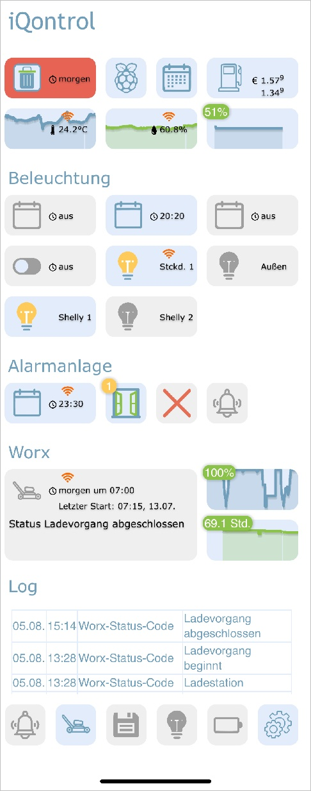
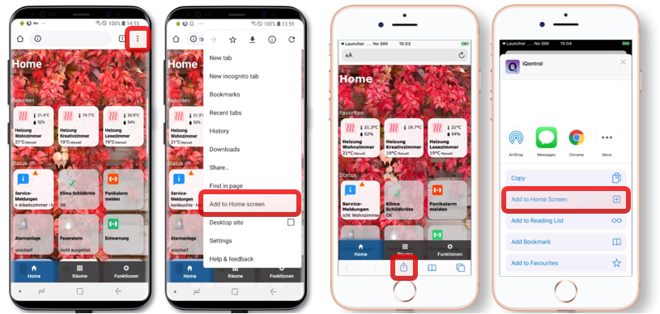

# IoBroker.iqontrol
<!-- [](https://weblate.iobroker.net/engage/adapters/?utm_source=widget) -->

**Tests:**

| Linux/Mac/Windows: | Cross-Browser-Prüfung: |
|---------------------------------------------------------------------------------------------------------------------------------------| --- |

****

## IQontrol-Adapter für ioBroker
Schnelle Web-App zur Visualisierung.

    

© von dslraser:


\nvon muuulle:



© von peks-64:


Läuft in jedem Browser.
Einfach einzurichten, obwohl es vollständig anpassbar und reaktionsfähig ist.

> **Dieser Adapter verwendet Sentry-Bibliotheken, um den Entwicklern automatisch Ausnahmen und Codefehler zu melden.** Weitere Einzelheiten und Informationen zum Deaktivieren der Fehlerberichterstattung finden Sie unter [Sentry-Plugin Dokumentation](https://github.com/ioBroker/plugin-sentry#plugin-sentry)! Die Sentry-Berichterstattung wird ab js-controller 3.0 verwendet.

## Credits
Dieser Adapter wäre ohne die großartige Arbeit von @o0Shojo0o (https://github.com/o0Shojo0o) nicht möglich gewesen, der frühere Versionen dieses Adapters entwickelt hat.

## So melden Sie Probleme und Funktionsanfragen
Verwenden Sie hierfür idealerweise GitHub-Probleme. Die beste Methode erreichen Sie, indem Sie den Adapter in den Debug-Protokollmodus versetzen (Instanzen -> Expertenmodus -> Spaltenprotokollebene). Rufen Sie dann die Protokolldatei über das ioBroker-Unterverzeichnis „log“ von der Festplatte ab, **nicht** über Admin, da dies Zeilen abschneiden würde.

## Video-Tutorial (deutsche Sprache):
[](https://youtube.com/playlist?list=PL8epyNz8pGEv6-R8dnfXm-m5aBlZFKOBG)

## Zum Homescreen hinzufügen
Sie können es als Web-App auf dem Homescreen speichern und es sieht aus und fühlt sich an wie eine native App: 

Das funktioniert auch auf Ihrem PC mit Chrome:

* Öffnen Sie iQontrol in Chrome
* Klicke auf das Drei-Punkte-Menü - Weitere Tools - Verknüpfung erstellen
* Sie finden iQontrol dann im Startmenü unter Chrome-Apps und können es sogar zu Ihrer Taskleiste hinzufügen

## Sie benötigen...
* Nodejs 10 oder höher
* Web-Adapter mit einer Instanz, auf der dasselbe Protokoll (http oder https) wie auf dem Admin-Adapter läuft, socket.IO auf „integriert“ eingestellt und „Web-Sockets erzwingen“ deaktiviert
* Sollte dies zu Konflikten mit anderen Adaptern führen, füge einfach eine weitere Instanz mit den oben genannten Einstellungen hinzu - iQontrol sucht die am besten passende Web-Adapter-Instanz und verwendet diese für die Kommunikation
* Für die Verbindung über *iobroker.pro-Cloud* müssen sowohl der Admin- als auch der Web-Adapter auf http (nicht https) eingestellt sein.

* Wenn Sie auf Probleme stoßen, lesen Sie bitte den Abschnitt [Fehlerbehebung](#Fehlerbehebung) am Ende dieser Readme-Datei.

## Forum
Besuchen Sie den Support-Thread [iobroker-Forum](https://forum.iobroker.net/topic/52077).
Besuchen Sie den Entwickler-Thread [iobroker-Forum](https://forum.iobroker.net/topic/22039).

## Wiki
Sehen Sie sich das Wiki [Wiki](https://github.com/sbormann/ioBroker.iqontrol/wiki) an.

## Wie benutzt man
**Lassen Sie sich nicht von den vielen Optionen abschrecken, die Ihnen zur Verfügung stehen.** Die meisten Dinge funktionieren sofort. Sie *können*, aber Sie müssen nicht alle Konfigurationsmöglichkeiten nutzen, die iQontrol bietet! Beginnen Sie einfach so:

* Beginnen Sie mit der Erstellung von Ansichten.

Sie können Ansichten als eine Art Seite betrachten.

* Erstellen Sie dann Geräte in diesen Ansichten.

Geräte haben eine Rolle, die die Funktion des Geräts bestimmt, welche Symbole verwendet werden und so weiter.
Abhängig von dieser Rolle können Sie dem Gerät verschiedene Zustände zuordnen. Diese verleihen dem Gerät seine Funktionalität.
Wenn Sie als Rolle „Mit anderer Ansicht verknüpfen“ auswählen, können Sie Links zu anderen Ansichten erstellen. Ich schlage vor, Links zu anderen Ansichten mit demselben Hintergrund zu gestalten, den die verknüpfte Ansicht hat.
Sie können auch versuchen, die Funktion „Automatisch erstellen“ zu verwenden, um ein vorhandenes Gerät aus dem iobroker-Objektbaum auszuwählen. „Automatisch erstellen“ versucht, die Rolle herauszufinden und so viele Zustände wie möglich abzugleichen.

* Anschließend können Sie eine Symbolleiste erstellen, die als Fußzeile angezeigt wird.

Toolbar-Einträge sind Links zu Ansichten.
Der erste Toolbar-Eintrag ist Ihre „Home-Ansicht“, die beim Start geladen wird.

* Um dem Ganzen einen schicken Stil zu verleihen, können Sie Ihre eigenen Bilder hochladen.

Sie können Ihre Bilder als Hintergrundbilder für Ansichten oder Geräte verwenden.
Bilder im Ordner `/usericons` können als Symbole für Geräte verwendet werden.
Die kostenlosen integrierten Demo-Hintergrundbilder stammen von www.pexels.com.

### Automatisches Erstellen verwenden
* Sie finden einen `Ansichten automatisch erstellen`-Button innerhalb der `Ansichten`-Registerkarte
* Wenn Sie gut gepflegte ioBroker-Aufzählungen wie Räume oder Funktionen haben, können Sie diese Funktion verwenden, um automatisch Ansichten mit den in diesen Aufzählungen aufgeführten Geräten zu erstellen
* Bedenken Sie, dass die Funktion zur automatischen Erstellung aufgrund der großen Anzahl verschiedener Adapter und Geräte im ioBroker-Universum nicht alle Geräte 100 % korrekt verwalten kann. Möglicherweise müssen Sie einige Einstellungen manuell überarbeiten, um die besten Ergebnisse zu erzielen. Die Funktion zur automatischen Erstellung bietet Ihnen jedoch einen guten Ausgangspunkt, um in Sekundenschnelle Ihre eigene Visualisierung zu erstellen.

## URL-Parameter
* Das Frontend wird über `http[s]://<url oder ip des iobrokers>:<port des Webadapters>/iqontrol/index.html` aufgerufen.
* `<Port des Webadapters>` ist normalerweise 8082
* Um eine bestimmte Instanz zu öffnen, können Sie `namespace=iqontrol.<instance-number>` als URL-Parameter hinzufügen
* Um eine bestimmte Ansicht zu öffnen, können Sie `renderView=<viewID>` als URL-Parameter hinzufügen.
* `<viewID>` muss wie `iqontrol.<instance-number>.Views.<view-name>` formatiert sein.
* Hinweis: Es wird zwischen Groß- und Kleinschreibung unterschieden!
* Um eine bestimmte Ansicht als Startseite zu öffnen, können Sie `home=<viewID>` als URL-Parameter hinzufügen. Dadurch ändert sich auch die verknüpfte Ansicht des ersten Toolbar-Eintrags!
* `<viewID>` muss wie `iqontrol.<instance-number>.Views.<view-name>` formatiert sein.
* Hinweis: Es wird zwischen Groß- und Kleinschreibung unterschieden!
* Um beim Laden der Seite einen bestimmten Dialog zu öffnen, können Sie `openDialog=<deviceID>` als URL-Parameter hinzufügen
* „<deviceID>“ muss wie folgt formatiert sein: „iqontrol.<instance-number>.Views.<view-name>.devices.<device-number>“, wobei „<device-number>“ bei 0 beginnt (das erste Gerät in einer Ansicht hat also die Gerätenummer 0).
* Hinweis: Es wird zwischen Groß- und Kleinschreibung unterschieden!
* Um die Einstellungen für die Rückkehr nach der Zeit festzulegen oder zu überschreiben, verwenden Sie die folgenden Parameter:
    * `returnAfterTimeTreshold=<time in seconds> `, um die Zeit einzustellen, nach der die Zielansicht aufgerufen wird. Verwenden Sie `0`, um die Funktion „Rückkehr nach Zeit“ zu deaktivieren.
* `returnAfterTimeDestiationView=<viewID>` um die Ansicht festzulegen, die nach dem Schwellenwert aufgerufen wird. Wenn nicht angegeben, wird die Home-Ansicht verwendet.
* Diese Optionen sind hilfreich, wenn Sie iQontrol von einem an der Wand montierten Tablet aus aufrufen, das nach der Verwendung automatisch zur Home-Ansicht zurückkehren soll
* Um die Seite ohne Symbolleiste zu laden, können Sie `noToolbar=true` hinzufügen.
* Um die Seite ohne Panel zu laden, können Sie `noPanel=true` hinzufügen.
* Um die Seite ohne Symbolleiste und Bedienfeld, mit deaktiviertem Wischen, ohne Ladespinner und mit transparentem Ladebildschirm zu laden, können Sie `isBackgroundView=true` hinzufügen.
* Normalerweise verwendet iQontrol die Sprache, die in ioBroker eingestellt ist. Sie können dies überschreiben, indem Sie `language=<xx>` hinzufügen.
* `<xx>` kann `de`, `en`, `es`, `fr`, `it`, `nl`, `pl`, `pt`, `ru` oder `zh-cn` sein.
* Wenn Ihre iQontrol-Instanz durch eine Passphrase kennwortgeschützt ist (siehe Optionen - Passphrase-Schutz), können Sie die Passphrase übermitteln, indem Sie `passphrase=<MyPassphrase>' hinzufügen.

**Beispiel:**

* `https://192.168.1.1:8082/iqontrol/index.html?namespace=iqontrol.1&home=iqontrol.1.Views.Living-Room`
*Groß- und Kleinschreibung beachten

## Schriftarten
* Eigene Schriftdateien könnt ihr im Bilder/Widgets-Tab in den Ordner `/userfonts` hochladen
* Im Optionen-Tab gibt es mehrere Stellen, an denen diese Schriftarten ausgewählt werden können
* Es hängt von den MIME-Einstellungen Ihres Servers ab, ob die Schriftart dem Browser korrekt angezeigt wird – bei mir funktionierten .ttf und .woff am besten (getestet auf einem Raspi 4b)
* Diese MIME-Einstellungen sollten funktionieren:
* .otf: `application/x-font-opentype`
* .ttf: „application/x-font-ttf“ oder „application/x-font-truetype“
* .woff: `Anwendung/Schriftart-woff`
* .woff2: `Anwendung/Schriftart-woff2`
* .eot: `application/vnd.ms-fontobject`
* Sie können Schriftarten auf `fontsquirrel.com` unter Generator in andere Formate konvertieren
* Denken Sie daran - Webfonts sind immer ein wenig knifflig und nicht jede Schriftart funktioniert mit jedem Server und jedem Browser

## Icons und Hintergrundbilder
* Sie können die integrierten Bilder oder die unter der Registerkarte „Bilder“ hochgeladenen Bilder oder eine beliebige kostenlose URL verwenden
* Sie können auch eine Variable innerhalb der Bild-URL verwenden. Dies kann beispielsweise für Wettervorhersagen nützlich sein. Verwenden Sie dieses Muster:
* `Pfad/zu/firstloaded.png|ein andererPfad/zu/{iobrokerstate|fallback}.png`
* Beispiel: `./../iqontrol.meta/userimages/demo/bottle.jpg|./../iqontrol.meta/userimages/demo/{javascript.0.myimage|whitestone}.jpg`
* Dies lädt `./../iqontrol.meta/userimages/demo/bottle.jpg`, wenn Sie die Ansicht öffnen
* Sobald der Status von „javascript.0.myimage“ vom Server abgerufen wird, wird das Bild durch „./../iqontrol.meta/userimages/demo/XXX.jpg“ ersetzt, wobei „XXX“ der Wert von „javascript.0.myimage“ ist.
* Wenn `javascript.0.myimage` keinen Wert hat, wird das Fallback `whitestone` verwendet (die Verwendung des Fallbacks ist optional)

### Fortschrittsbalken
* Es ist möglich, SVG-Definitionen in Kombination mit Variablen anstelle von Bilddateien zu verwenden, um Fortschrittsbalken anzuzeigen
* Es sind einige Vorlagen integriert, aus denen Sie auswählen können. Sie können aber auch Ihre eigenen SVGs erstellen.

 

* Weitere Informationen finden Sie im [Wiki](https://github.com/sbormann/ioBroker.iqontrol/wiki/Progress-Bars).

### Diagramme
* Sie können das ''FLOT Chart-Widget'' als BACKGROUND_URL eines beliebigen Geräts hinzufügen, wodurch der Hauptstatus automatisch als Diagramm im Hintergrund der Gerätekachel angezeigt wird
* Sie müssen sicherstellen, dass der Status von einem der Verlaufsadapter von ioBroker protokolliert und aufgezeichnet wird


## Gerätenamen
* Genau wie Variablen in Bild-URLs können Sie Variablen in Gerätenamen verwenden. Die Syntax ist fast dieselbe:
* `Text während des Ladens|Text nach dem Laden {iobrokerstate|fallback}`
* Zusätzlich kann der iobroker-Status in eckige Klammern gesetzt werden, dann wird der reine Wert ohne Einheit verwendet: `Text während des Ladens|Text nach dem Laden {[iobrokerstate]|fallback}`
* Beispiel: `Wetter wird geladen|Wetter: {javascript.0.weather|Keine Wetterdaten gefunden}`
* Dies zeigt `Wetter wird geladen`, wenn Sie die Ansicht öffnen
* Sobald der Status von „javascript.0.weather“ vom Server abgerufen wird, wird der Text durch „Weather: XXX“ ersetzt, wobei „XXX“ der Wert von „javascript.0.weather“ ist.
* Wenn `javascript.0.weather` keinen Wert hat, wird der Fallback `Keine Wetterdaten gefunden` verwendet (die Verwendung des Fallbacks ist optional)

## Popup-Nachrichten
* Jede Instanz erstellt den Status `iqontrol.x.Popup.Message`
* Beim Übergeben von Werten an diesen Status wird auf allen **derzeit** geöffneten iQontrol-Frontends eine Popup-Nachricht (oder ein Toast) angezeigt
* Zusätzlich erzeugt jede Instanz den Status `iqontrol.x.Popup.PersistentMessage`
* Beim Übergeben von Werten für diesen Status wird die Popup-Nachricht im PERSISTENT_MESSAGES_PENDING-Array gespeichert.
* Permanente Meldungen werden nicht nur auf allen aktuell geöffneten iQontrol-Frontends angezeigt, sondern auch auf allen **zukünftig** geöffneten Instanzen, bis sie bestätigt werden (durch Klick oder Dauer) oder ablaufen.
* `PersistentExpires` definiert als UNIX-Zeitstempel, wann die persistente Nachricht abläuft (Sekunden ab 1970-01-01 00:00:00). Werte unter 31536000 werden als Dauer in Sekunden ab jetzt interpretiert (31536000 Sekunden = 1 Jahr).
* `PersistentUndismissible` *boolean* - Wenn dies auf true gesetzt ist, bleibt die persistente Nachricht auch nach dem Schließen erhalten. Wenn Sie eine neue iQontrol-Instanz öffnen, wird sie erneut angezeigt. Andernfalls werden persistente Nachrichten nach dem Schließen des Popups gelöscht (auch per Klick oder nach Ablauf der Dauer).
* „PersistentId“ ist ein optionaler beliebiger Ausdruck, der zur Identifizierung der Nachricht verwendet werden kann.
* Die ID kann verwendet werden, um entsprechende Popup-Nachrichten zu löschen, indem die ID an „PERSISTENT_MESSAGES_DELETE_ID“ gesendet wird. Durch Senden von „null“ an diesen Datenpunkt werden alle ausstehenden Nachrichten gelöscht.
* Die ID kann auch verwendet werden, um entsprechende Popup-Nachrichten auf allen aktuell geöffneten iQontrol-Instanzen erneut anzuzeigen, indem die ID an `PERSISTENT_MESSAGES_SHOW_ID` gesendet wird. Das Senden von `null` an diesen Datenpunkt zeigt alle ausstehenden Nachrichten an.
* **Hinweis**: Sie können eine Nachricht nur an einen der beiden Datenpunkte „Message“ oder „PersistentMessage“ senden, nicht an beide.
* Sie können HTML-Tags verwenden, um den Nachrichtentext zu formatieren
* Es gibt einige zusätzliche Zustände zur weiteren Anpassung des angezeigten Popups (diese müssen festgelegt werden, bevor der Nachrichtendatenpunkt festgelegt wird):
* `Dauer`: Dies ist die Zeit in ms, in der die Nachricht angezeigt wird; wenn der Wert auf 0 gesetzt ist, muss die Nachricht bestätigt werden
* `ClickedValue` und `ClickedDestinationState`: Wenn das Popup vom Benutzer angeklickt wird, wird der Wert von `ClickedValue` an `iqontrol.x.Popup.POPUP_CLICKED` gesendet und, falls angegeben, zusätzlich an den Datenpunkt in `ClickedDestinationState`
* Wenn kein Wert angegeben ist, wird „true“ verwendet
* `ClickKeepsOpen` *boolean* - wenn wahr, kann das Popup nur durch Klicken auf eine Schaltfläche geschlossen werden, durch Klicken auf das Popup selbst wird es nicht geschlossen. Stellen Sie also sicher, dass Sie Ihrer Popup-Nachricht Schaltflächen hinzufügen, wie unten beschrieben.
* `ButtonNames`: Hier können Sie eine durch Kommas getrennte Liste von Schaltflächen angeben, die unten im Popup angezeigt werden (z. B. „OK, Abbrechen“)
* `ButtonValues` und `ButtonDestinationStates`: Dies sind durch Kommas getrennte Listen von Werten, die an `iqontrol.x.Popup.BUTTON_CLICKED` und, falls angegeben, zusätzlich an den Datenpunkt in `ButtonDestinationStates` gesendet werden, wenn der Benutzer auf die entsprechende Schaltfläche klickt.
* Anstelle eines Datenpunkts können Sie die Befehle `COMMAND:renderView` und `COMMAND:openDialog` als ButtonDestinationState verwenden, um eine Ansicht zu rendern oder einen Dialog zu öffnen
* Der ButtonValue gibt dann die Ansicht bzw. den Dialog an und muss im Format „iqontrol.<Instanznummer>.Views.<Ansichtsname>“ bzw. „iqontrol.<Instanznummer>.Views.<Ansichtsname>.devices.<Gerätenummer>“ vorliegen, wobei „<Gerätenummer>“ bei 0 beginnt (das erste Gerät in einer Ansicht hat also die Gerätenummer 0).
* Wenn Sie nur einen Wert verwenden (anstelle einer durch Kommas getrennten Liste), wird dieser Wert für alle Schaltflächen verwendet.
* Wenn Sie `ButtonValues` leer lassen, wird der Name der Schaltfläche verwendet
* Wenn Sie nur einen Zielstatus verwenden (anstelle einer durch Kommas getrennten Liste), wird dieser Status für alle Schaltflächen verwendet.
* `ButtonCloses`: Dies ist eine durch Kommas getrennte Liste von Booleschen Werten (`true`/`false`), die angeben, ob das Popup geschlossen werden soll, wenn die entsprechende Schaltfläche gedrückt wird
* `ButtonClears`: Dies ist eine durch Kommas getrennte Liste von Booleschen Werten (`true`/`false`), die angeben, ob die Popup-Einstellungen gelöscht werden sollen (= alle Popup-Zustände auf leer setzen), wenn die entsprechende Schaltfläche gedrückt wird.
* Alternativ können Sie diese Werte über den sendTo-Befehl mit den Parametern `PopupMessage`, `PopupDuration`, `PopupClickedValue` usw. festlegen.
* Beispiel: `sendTo("iqontrol", "send", {PopupMessage: 'Dies ist meine Nachricht', PopupDuration: 2500, PopupClickedValue: 'messageConfirmed'});`
* Sie können Blockly auch verwenden, um Nachrichten an iQontrol zu senden

 

## Widgets
* Jede Kachel hat einen BACKGROUND_URL und einen BACKGROUND_HTML-Datenpunkt
* Hier können Sie einen Link (via BACKGROUND_URL) zu einer Website definieren oder direkten HTML-Code (via BACKGROUND_HTML) platzieren, der als Hintergrund der Kachel angezeigt wird
* Dies gibt Ihnen die Möglichkeit, (interaktive) Inhalte in einer Kachel zu platzieren (wie Uhren, FLOT-Diagramme, Tabellen, Wettervorhersagen usw.).
* Standardmäßig werden Mausereignisse auf diesen Inhalt umgeleitet (somit können Sie nicht mehr auf die Kachel selbst klicken), aber Sie können dies mit der Option „Mausereignisse auf die Kachel umleiten, anstatt auf den Inhalt von BACKGROUND_VIEW/URL/HTML“ deaktivieren.
* iQontrol bietet eine Geräterolle „Widget“, die einige vordefinierte Optionen enthält, die hauptsächlich beim Anzeigen einer Website als Widget verwendet werden. Sie können jedoch mit jeder anderen Rolle dasselbe Ergebnis erzielen, indem Sie die Geräteoptionen entsprechend ändern.


<details><summary>Widget-Entwicklung (nur für Experten): (<ins> Zum Öffnen anklicken</ins> )</summary>

### JQuery
* Technisch gesehen wird der Inhalt von BACKGROUND_VIEW/URL/HTML in einem HTML-Element namens iframe platziert, das eine Website innerhalb einer Website darstellt
* Um jQuery zu verwenden, können Sie es mit dem folgenden Code von iQontrol in das iFrame übertragen:

``window.$=window.jQuery=parent.jQuery.extend(function(s){return parent.jQuery(s,document)},parent.jQuery);``

* Beispiel:

	```html
	<!doctype html>
	<html>
	<head>
		<meta http-equiv="Content-Type" content="text/html; charset=UTF-8"/>
		<meta name="widget-description" content="This is a demo widget-preset. It has no useful funcion. (C) by Sebastian Bormann"/>
		<meta name="widget-options" content="{'noZoomOnHover': 'true', 'hideDeviceName': 'true', 'sizeInactive': 'xwideIfInactive highIfInactive', 'iconNoPointerEventsInactive': 'true', 'hideDeviceNameIfInactive': 'true', 'hideStateIfInactive': 'true', 'sizeActive': 'fullWidthIfActive fullHeightIfActive', 'bigIconActive': 'true', 'iconNoPointerEventsActive': 'true', 'hideDeviceNameIfActive': 'true', 'hideStateIfActive': 'true', 'sizeEnlarged': 'fullWidthIfEnlarged fullHeightIfEnlarged', 'bigIconEnlarged': 'true', 'iconNoPointerEventsEnlarged': 'false', 'noOverlayEnlarged': 'true', 'hideDeviceNameIfEnlarged': 'true', 'hideStateIfEnlarged': 'true', 'popupAllowPostMessage': 'true', 'backgroundURLAllowPostMessage': 'true', 'backgroundURLNoPointerEvents': 'false'}"/>
		<title>iQontrol Widget Test</title>
	</head>
	<body>
		<div id="testDiv">Loading...</div>
		<script type="text/javascript">
			console.log("JQUERY-TEST");
			window.$=window.jQuery=parent.jQuery.extend(function(s){return parent.jQuery(s,document)},parent.jQuery);
			$(document).ready(function(){
				$('#testDiv').html("<h1>Hello World</h1)");
				console.log("jQuery works!!");
			});
		</script>
	</body>
	</html>
	```

### PostMessage-Kommunikation
* Durch Aktivieren der Option „PostMessage-Kommunikation für BACKGROUND_VIEW/URL/HTML zulassen“ können Sie die PostMessage-Kommunikation zwischen dem Widget in seinem Iframe und iQontrol selbst aktivieren.
* Um Befehle an iQontrol zu senden, können Sie den folgenden Javascript-Befehl verwenden: `window.parent.postMessage(message, "*");`
* „Nachricht“ ist ein JavaScript-Objekt im Format „{Befehl: Befehl, StateId: StateId, Wert: Wert}“.
* Folgende Nachrichtenbefehle werden unterstützt:
* `{ Befehl: "setWidgetState", stateId: <widgetStateId>, Wert: <Wert> }`
* Dadurch wird der ioBroker-Status `iqontrol.<instance>.Widgets.<widgetStateId>` auf den Wert `<value>` gesetzt (`<value>` kann ein String, eine Zahl oder ein Boolean-Wert oder ein Objekt wie `{ val: <value>, ack: true|false }` sein).
* `{ Befehl: "getWidgetState", stateId: <widgetStateId> }`
* Dadurch sendet iQontrol den Wert des ioBroker-Status `iqontrol.<Instanz>.Widgets.<widgetStateId>` (siehe unten, wie die Antwortnachricht empfangen wird)
* `{ Befehl: "getWidgetStateSubscribed", stateId: <widgetStateId> }`
* Dadurch sendet iQontrol den Wert des ioBroker-Status `iqontrol.<instance>.Widgets.<widgetStateId>` jetzt und jedes Mal, wenn sich sein Wert ändert (siehe unten, wie die Antwortnachrichten empfangen werden)
* `{ Befehl: "setWidgetDeviceState", stateId: <widgetDeviceState>, Wert: <Wert> }`
* Dadurch wird der ioBroker-Datenpunkt, der dem Gerätestatus `<widgetDeviceState>` zugewiesen ist (beispielsweise der Datenpunkt, der LEVEL zugewiesen ist), auf den Wert `<value>` gesetzt (`<value>` kann eine Zeichenfolge, Zahl oder ein Boolescher Wert oder ein Objekt wie `{ val: <value>, ack: true|false }` sein).
* `{ Befehl: "getWidgetDeviceState", stateId: <widgetDeviceState> }`
* Dadurch sendet iQontrol den Wert des ioBroker-Datenpunkts, der dem Gerätestatus `<widgetDeviceState>` zugewiesen ist (zum Beispiel der Datenpunkt, der dem Level zugewiesen ist; siehe unten, wie die Antwortnachricht empfangen wird).
* `{ Befehl: "getWidgetDeviceStateSubscribed", stateId: <widgetDeviceState> }`
* Dadurch sendet iQontrol den Wert des ioBroker-Datenpunkts, der dem Gerätestatus `<widgetDeviceState>` zugewiesen ist (z. B. der Datenpunkt, der LEVEL zugewiesen ist), jetzt und jedes Mal, wenn sich sein Wert ändert (siehe unten, wie die Antwortnachricht empfangen wird).
* `{ Befehl: "setState", stateId: <stateId>, Wert: <Wert> }`
* Dadurch wird der ioBroker-Status `<stateId>` auf den Wert `<value>` gesetzt (`<value>` kann ein String, eine Zahl oder ein Boolescher Wert oder ein Objekt wie `{ val: <value>, ack: true|false }` sein).
* `{ Befehl: "getState", stateId: <stateId> }`
* Dadurch sendet iQontrol den Wert des ioBroker-Status `<stateId>` (siehe unten, wie die Antwortnachricht empfangen wird)
* `{ Befehl: "getStateSubscribed", stateId: <stateId> }`
* Dadurch sendet iQontrol den Wert des ioBroker-Status `<stateId>` jetzt und jedes Mal, wenn sich sein Wert ändert (siehe unten, wie die Antwortnachrichten empfangen werden)
* `{ Befehl: "getOptions"}`
* Dadurch sendet iQontrol die Benutzeroptionen, die der Benutzer als Objekt konfiguriert hat
* `{ Befehl: "renderView", Wert: <viewID> }`
* Dadurch wird iQontrol angewiesen, eine Ansicht zu rendern, wobei „<viewID>“ wie „iqontrol.<instance-number>.Views.<view-name>“ formatiert werden muss (Groß-/Kleinschreibung beachten).
* `{ Befehl: "openDialog", Wert: <Geräte-ID> }`
* Dadurch wird iQontrol angewiesen, ein Dialogfeld zu öffnen, in dem „<Geräte-ID>“ wie folgt formatiert werden muss: „iqontrol.<Instanznummer>.Views.<Ansichtsname>.devices.<Gerätenummer>“, wobei „<Gerätenummer>“ bei 0 beginnt (das erste Gerät in einer Ansicht hat also die Gerätenummer 0).
* Um Nachrichten von iQontrol zu empfangen, müssen Sie mit dem JavaScript-Befehl `window.addEventListener("message", receivePostMessage, false);` einen Ereignis-Listener für das "message"-Ereignis registrieren.
* Die Funktion `receivePostMessage` empfängt das Objekt `event`
* „event.data“ enthält die Nachricht von iqontrol, die ein Objekt wie dieses sein wird:
* event.data = `{ command: "getState", stateId: <stateId>, value: <stateObject> }` - dies ist die Antwort auf einen `getState`-Befehl oder einen `getStateSubscribed`-Befehl und gibt Ihnen das aktuelle `<value>`-Objekt des ioBroker-Status`<stateId>`
* `<stateObject>` selbst ist ein Objekt wie

			```
			event.data.value = {
				val: <value (rounded)>,
				unit: "<unit>",
				valFull: <value (not rounded, no javascript-injection prevention)>,
				plainText: "<clear text of val, for example taken from valuelist>",
				min: <minimum>,
				max: <maximum>,
				step: <step-width>,
				valuelist: {<object with possible values and corresponding clear text>},
				targetValues: {<target value list>},
				ack: <true|false>,
				readonly: <true|false>,
				custom: {<object with custom settings>},
				id: <id of the iobroker datapoint>,
				from: "<source of state>",
				lc: <timestamp of last change>,
				ts: <timestamp of last actualization>,
				q: <quality of signal>,
				role: "<role of state>",
				type: "<string|number|boolean>",
				name: "<name of datapoint>",
				desc: "<description of datapoint>",
				Date: <Date-object (only present, if value is regognized as a valid time or period)>
			}
			```

* Um iQontrol anzuweisen, einen Widget-Status unter „iqontrol.<Instanz>.Widgets“ zu generieren, können Sie ein Meta-Tag im Kopfbereich der Widget-Website verwenden:
* Syntax:

```
<meta name="widget-datapoint" content="WidgetName.StateName" data-type="string" data-role="text" />
```

* Sie können den Datenpunkt weiter konfigurieren, indem Sie die Attribute Datentyp (der auf Zeichenfolge, Zahl oder Boolesch eingestellt werden kann), Datenrolle, Datenname, Datenmin, Datenmax, Datendefinition und Dateneinheit verwenden.
* Sie können auch einen URL-Parameter (siehe unten) als Variable verwenden, um beispielsweise verschiedene Instanzen der Widgets mit eigenen Datenpunkten zu erstellen.
* Die Syntax lautet dann:

		  ```
          <meta name="widget-datapoint" content="WidgetName.StateName|WidgetName.{instance}.StateName" data-type="string" data-role="text" />
          ```

* Wenn die Variable `instance` gesetzt ist, dann wird der Teil nach dem `|` als widgetState-Name verwendet und `{instance}` wird durch den Wert von `instance` ersetzt
* Wenn die Variable `instance` nicht gesetzt ist, dann wird der Teil vor dem `|` als `wigdetState`-Name verwendet
* Der entsprechende Datenpunkt wird nur dann erstellt, wenn die Widget-Website einem Gerät als URL oder BACKGROUND_URL hinzugefügt wird
* Das gleiche Konzept kann für den URL/HTML-Status verwendet werden, der zur Anzeige einer Website im Dialog eines Geräts verwendet wird
* Um ein Symbol für Ihr Widget zu erstellen, legen Sie eine PNG-Datei mit demselben Dateinamen wie das Widget in das Widget-Verzeichnis
* Unten finden Sie ein Beispiel für eine Widget-Website:

<details><summary>Beispiel einer Widget-Website anzeigen, die als Widget mit PostMessage-Kommunikation angezeigt werden soll: (<ins> Zum Öffnen anklicken</ins> )</summary>

* Sie können den folgenden HTML-Code verwenden und ihn in den BACKGROUND_HTML-Status eines Widgets kopieren (der dann als „Konstant“ konfiguriert werden muss)
* Alternativ kannst du diesen Code auch als html-Datei in das Unterverzeichnis `/userwidgets` hochladen und dort auf den BACKGROUND_URL-State verweisen (der dann ebenfalls als "Constant" konfiguriert werden muss)
* Aktivieren Sie die Option „PostMessage-Kommunikation für BACKGROUND_VIEW/URL/HTML zulassen“
* Es wird gezeigt, wie eine bidirektionale Kommunikation zwischen der Website und iQontrol erfolgt

```html
<!doctype html>
<html>
<head>
	<meta http-equiv="Content-Type" content="text/html; charset=UTF-8"/>
	<meta name="widget-datapoint" content="postMessageTest.test" data-type="string" data-role="text" />
	<meta name="widget-description" content="This is a test widget. To get the WidgetDeviceState-Functions working, please set a valid iobroker-datapoint for STATE. (C) by Sebastian Bormann"/>
	<meta name="widget-urlparameters" content="title/postMessageTest/Please enter a title">
	<meta name="widget-options" content="{'noZoomOnHover': 'true', 'hideDeviceName': 'true', 'sizeInactive': 'xwideIfInactive highIfInactive', 'iconNoPointerEventsInactive': 'true', 'hideDeviceNameIfInactive': 'true', 'hideStateIfInactive': 'true', 'sizeActive': 'xwideIfActive highIfActive', 'bigIconActive': 'true', 'iconNoPointerEventsActive': 'true', 'hideDeviceNameIfActive': 'true', 'hideStateIfActive': 'true', 'sizeEnlarged': 'fullWidthIfEnlarged fullHeightIfEnlarged', 'bigIconEnlarged': 'true', 'iconNoPointerEventsEnlarged': 'false', 'noOverlayEnlarged': 'true', 'hideDeviceNameIfEnlarged': 'true', 'hideStateIfEnlarged': 'true', 'popupAllowPostMessage': 'true', 'backgroundURLAllowPostMessage': 'true', 'backgroundURLNoPointerEvents': 'false'}"/>
 	<title>iQontrol postMessageTest</title>
</head>
<body>
	<br><br>
	<h3><span id="title">postMessageTest</span><h3>
	<button onclick="getWidgetState('postMessageTest.test')">getWidgetState postMessageTest.test</button><br>
	<button onclick="getWidgetStateSubscribed('postMessageTest.test')">getWidgetStateSubscribed postMessageTest.test</button><br>
	<button onclick="setWidgetState('postMessageTest.test', 'Hello world')">setWidgetState postMessageTest.test to 'Hello world'</button><br>
  	<br>
	<button onclick="getWidgetDeviceState('STATE')">getWidgetDeviceState STATE</button><br>
	<button onclick="getWidgetDeviceStateSubscribed('STATE')">getWidgetDeviceStateSubscribed STATE</button><br>
	<button onclick="setWidgetDeviceState('STATE', 'Hello world')">setWidgetDeviceState STATE to 'Hello world'</button><br>
  	<br>
	<button onclick="getState('system.adapter.admin.0.cpu')">getState system.adapter.admin.0.cpu</button><br>
	<button onclick="getStateSubscribed('system.adapter.admin.0.uptime')">getStateSubscribed system.adapter.admin.0.uptime</button><br>
	<button onclick="setState('iqontrol.0.Popup.Message', 'Hey, this is a test Message')">setState popup message</button><br>
  	<br>
	<button onclick="renderView('iqontrol.0.Views.Home')">renderView 'Home'</button><br>
	<button onclick="openDialog('iqontrol.0.Views.Home.devices.0')">openDialog 1st device on 'Home'</button><br>
	<br><hr>
	message sent: <span id="messageSent">-</span><br>
	<br><hr>
	message received: <span id="messageReceived">-</span><br>
	<br><hr>
	this means: <span id="thisMeans">-</span><br>
	<br><hr>
    <script type="text/javascript">
		var countSend = 0;
		var countReceived = 0;

		//Set title from UrlParameter
		document.getElementById('title').innerHTML = getUrlParameter('title') || "No Title set";

		//getWidgetState
		function getWidgetState(stateId){
			sendPostMessage("getWidgetState", stateId);
		}

		//getWidgetStateSubscribed (this means, everytime the state changes, an update will be received)
		function getWidgetStateSubscribed(stateId){
			sendPostMessage("getWidgetStateSubscribed", stateId);
		}

		//setWidgetState
		function setWidgetState(stateId, value){
			sendPostMessage("setWidgetState", stateId, value);
		}


		//getWidgetDeviceState
		function getWidgetDeviceState(stateId){
			sendPostMessage("getWidgetDeviceState", stateId);
		}

		//getWidgetDeviceStateSubscribed (this means, everytime the state changes, an update will be received)
		function getWidgetDeviceStateSubscribed(stateId){
			sendPostMessage("getWidgetDeviceStateSubscribed", stateId);
		}

		//setWidgetDeviceState
		function setWidgetDeviceState(stateId, value){
			sendPostMessage("setWidgetDeviceState", stateId, value);
		}


		//getState
		function getState(stateId){
			sendPostMessage("getState", stateId);
		}

		//getStateSubscribed (this means, everytime the state changes, an update will be received)
		function getStateSubscribed(stateId){
			sendPostMessage("getStateSubscribed", stateId);
		}

		//setState
		function setState(stateId, value){
			sendPostMessage("setState", stateId, value);
		}


		//renderView
		function renderView(viewId){
			sendPostMessage("renderView", null, viewId);
		}

		//openDialog
		function openDialog(deviceId){
			sendPostMessage("openDialog", null, deviceId);
		}

		// +++++ Default Functions +++++
		//getUrlParameter
		function getUrlParameter(name) {
			name = name.replace(/[\[]/, '\\[').replace(/[\]]/, '\\]');
			var regex = new RegExp('[\\?&]' + name + '=([^&#]*)');
			var results = regex.exec(location.search);
			return results === null ? null : decodeURIComponent(results[1].replace(/\+/g, ' '));
		};

		//send postMessages
		function sendPostMessage(command, stateId, value){
			countSend++;
			message = { command: command, stateId: stateId, value: value };
			document.getElementById('messageSent').innerHTML = countSend + " - " + JSON.stringify(message);
			window.parent.postMessage(message, "*");
		}

		//receive postMessages
		window.addEventListener("message", receivePostMessage, false);
		function receivePostMessage(event) { //event = {data: message data, origin: URL of origin, source: id of sending element}
			countReceived++;
			if(event.data) document.getElementById('messageReceived').innerHTML = countReceived + " - " + JSON.stringify(event.data);
			if(event.data && event.data.command) switch(event.data.command){
				case "getState":
				if(event.data.stateId && event.data.value && event.data.value.val){
					document.getElementById('thisMeans').innerHTML = "Got State " + event.data.stateId + " with value " + event.data.value.val;
				}
				break;
			}
		}
	</script>
</body>
</html>
```

</details>

### Weitere Konfiguration von Widgets
* Es gibt zusätzliche Meta-Tags, die Sie im Kopfbereich Ihrer Widget-Website verwenden können, um das Verhalten des Widgets zu konfigurieren:
* `Widget-Beschreibung`
* Syntax:

		  ```  
          <meta name="widget-description" content="Please see www.mywebsite.com for further informations. (C) by me"/>
          ```

* Der Inhalt wird angezeigt, wenn Sie das Widget als URL oder BACKGROUND_URL auswählen oder wenn Sie ein Widget automatisch erstellen
* `Widget-URL-Parameter`
* Syntax:

		  ```
          <meta name="widget-urlparameters" content="parameter/default value/description/type;parameter2/default value2/description2/type2"/>
          ```

* Der Benutzer wird nach diesen Parametern gefragt, wenn er das Widget als URL oder BACKGROUND_URL auswählt oder automatisch ein Widget erstellt
* „Typ“ ist optional und kann „Text“ (dies ist die Standardeinstellung), „Zahl“, „Kontrollkästchen“, „Farbe“, „Auswahl“, „Mehrfachauswahl“, „Kombinationsfeld“, „Verlaufsinstanz“, „Datenpunkt“, „ListJsonDatapoint“, „Symbol“, „Schriftfamilie“, „Schriftgröße“, „Schriftstil“, „Schriftstärke“, „Sprache“, „Abschnitt“, „Trennlinie“, „Info“, „Link“ oder „Versteckt“ sein.
* Wenn der Typ „select“, „multipleSelect“ oder „combobox“ ist, müssen Sie die möglichen Optionen durch Hinzufügen von „/<selectOptions>“ angeben, wobei „<selectOptions>“ eine Zeichenfolge im Format „<value1>,<caption1>/<value2>,<caption2>/...“ ist (combobox ist eine Auswahlbox mit der Möglichkeit, freien Text einzugeben).
* Wenn der Typ „Zahl“ ist, können Minimum, Maximum und Schrittweite durch Hinzufügen von „/<Zahlenoptionen>“ angegeben werden, wobei „<Zahlenoptionen>“ eine Zeichenfolge im Format „<Min.>,<Max.>,<Schritt>“ ist.
* Die Typen `section`, `divider`, `info` und `link` haben keine weitere Funktion, sie dienen lediglich dazu, dem Benutzer Informationen anzuzeigen. Für `link` sollte der Wert eine URL sein, aber alle Schrägstriche müssen durch Backslashes ersetzt werden.
* Der Typ „hidden“ wird an das Widget übergeben, es wird jedoch kein Konfigurationsdialog angezeigt
* Alle diese Parameter werden der Widget-Website über eine URL-Parameterzeichenfolge übergeben (wie `widget.html?parameter=value&parameter2=value2`)
* Sie können diese Einstellungen innerhalb Ihrer Widget-Website verwenden, indem Sie die URL-Parameter mit einer Funktion wie dieser anfordern:

			```
			function getUrlParameter(name) {
				name = name.replace(/[\[]/, '\\[').replace(/[\]]/, '\\]');
				var regex = new RegExp('[\\?&]' + name + '=([^&#]*)');
				var results = regex.exec(location.search);
				return results === null ? null : decodeURIComponent(results[1].replace(/\+/g, ' '));
			};
			```

* Wenn Sie als URL-Parameter den Typ `icon` verwenden, erhalten Sie entweder einen relativen Pfad zum iqontrol-Verzeichnis oder einen absoluten Pfad zu einem Bild. Um einen gültigen Link zu Ihrem Bild zu erstellen, können Sie diesen Code verwenden:

			    ```
				var iconOn = getUrlParameter('iconOn') || './images/icons/switch_on.png';
				if(iconOn.indexOf('http') != 0) iconOn = '/iqontrol/' + iconOn;
				```

* `Widget-Optionen`
* Syntax:

		  ```
          <meta name="widget-options" content="{'noZoomOnHover': 'true', 'hideDeviceName': 'true'}"/>
          ```

* Im erweiterbaren Abschnitt weiter unten finden Sie die möglichen Optionen, die mit diesem Meta-Tag konfiguriert werden können.

* `Widget-Ersatz-URL`
* Syntax:

```
<meta name="widget-replaceurl" content="<url>" data-absolute="<true|false>"/>

* Dadurch wird die verwendete URL/BACKGROUND_URL für dieses Widget neu konfiguriert (auf diese Weise können Sie Widget-Voreinstellungen definieren, mit denen dem Benutzer spezielle oder vereinfachte Konfigurationen bereitgestellt werden können. Beim Aufrufen des Widgets verwendet iQontrol jedoch die angegebene `<url>` anstelle der ursprünglichen URL).
* Standardmäßig wird nur der Dateiname (mit Erweiterung) ersetzt. Wenn `data-absolute=`true`` gesetzt wird, wird die gesamte URL ersetzt.

<details><summary>Mögliche Optionen anzeigen, die mit dem Meta-Tag „Widget-Optionen“ konfiguriert werden können: (<ins> Zum Öffnen anklicken</ins> )</summary>

* Symbole:
* `icon_on` (Symbol an):
		* Standard: ""
* `icon_off` (Symbol aus):
		* Standard: ""
* Gerätespezifische Optionen:
* `showState` (Status anzeigen) – nur gültig für die Rollen Button und Programm:
* Mögliche Werte: `true`|`false`
* Standardmäßig: „false“
* `showPowerAsState: ` (Power als Status anzeigen) - nur gültig für die Rollen Schalter, Licht und Lüfter:
* Mögliche Werte: `true`|`false`
* Standardmäßig: „false“
* `buttonCaption` (Beschriftung für Button) – nur gültig für die Rolle Button:
		* Standard: ""
* `returnToOffSetValueAfter` (Zurück zu 'OFF_SET_VALUE' nach [ms]) – nur gültig für die Rolle Button:
* Mögliche Werte: Zahl von 10 bis 60000
		* Standard: ""
* `alwaysSendTrue` (Immer ‚true‘ senden (nicht umschalten)) – nur gültig für die Rolle „Szene“:
* Mögliche Werte: `true`|`false`
* Standardmäßig: „false“
* `closeDialogAfterExecution` (Dialog nach Ausführung schließen) – gilt nur für die Rollen Button, Programm und Szene:
* Mögliche Werte: `true`|`false`
* Standardmäßig: „false“
* `invertCt` (CT umkehren (Kelvin statt Mired verwenden)) – nur gültig für die Rolle „Light“:
* Mögliche Werte: `true`|`false`
* Standardmäßig: „false“
* `alternativeColorspace` (Farbraum für ALTERNATIVE_COLORSPACE_VALUE") – nur gültig für die Rolle Light:
* Mögliche Werte: ""|"RGB"|"#RGB"|"RGBW"|"#RGBW"|"RGBWWCW"|"#RGBWWCW"|"RGBCWWW"|"#RGBCWWW"|"RGB_HUEONLY"|"#RGB_HUEONLY"|"HUE_MILIGHT"|"HHSSBB_TUYA"
		* Standard: ""
* `linkOverlayActiveColorToHue` (Lampenfarbe als OVERLAY_ACTIVE_COLOR verwenden) – nur gültig für die Rolle Licht:
* Mögliche Werte: `true`|`false`
* Standardmäßig: „false“
* `linkGlowActiveColorToHue` (Farbe der Lampe als GLOW_ACTIVE_COLOR verwenden) – nur gültig für die Rolle Licht:
* Mögliche Werte: `true`|`false`
* Standardmäßig: „false“
* `controlModeDisabledValue` (Wert von CONTROL_MODE für 'disabled') – nur gültig für die Rollen Thermostat, Homematic-Thermostat und Homematic IP-Thermostat:
		* Standard: ""
* `valveStatesSectionType` (Aussehen von VALVE_STATES) – nur gültig für die Rollen Thermostat, Homematic-Thermostat und Homematic IP-Thermostat:
* Mögliche Werte: `true`|`false` `none`|`none noCaption`|`collapsible`|`collapsible open`
* Standard: „zusammenklappbar“
* `stateClosedValue` (Wert von STATE für ‚geschlossen‘) – nur gültig für die Rolle Fenster und Tür mit Schloss:
		* Standard: ""
* `stateOpenedValue` (Wert von STATE für ‚geöffnet‘) – nur gültig für die Rolle Fenster:
		* Standard: ""
* `stateTiltedValue` (Wert von STATE für ,tilted‘) – nur gültig für die Rolle Window:
		* Standard: ""
* `lockStateLockedValue` (Wert von LOCK_STATE für „gesperrt“) – nur gültig für die Rolle „Tür mit Schloss“:
		* Standard: ""
* `lockOpenValue` (Wert von LOCK_OPEN für 'offene Tür') – nur gültig für die Rolle Tür mit Schloss:
		* Standard: ""
* `invertActuatorLevel` (Level umkehren (0 = offen)) - nur gültig für die Rolle Blind:
* Mögliche Werte: `true`|`false`
* Standardmäßig: „false“
* `directionOpeningValue` (Wert von DIRECTION für 'opening') – nur gültig für die Rolle Window:
* Standardmäßig: "1"
* `directionClosingValue` (Wert von DIRECTION für 'schließen') – nur gültig für die Rolle Window:
* Standardmäßig: „2“
* `directionUncertainValue` (Wert von DIRECTION für ‚unsicher‘) – nur gültig für die Rolle Window:
* Standardmäßig: „3“
* `favoritePositionCaption` (Beschriftung für FAVORITE_POSITION) – nur gültig für die Rolle „Fenster“:
* Standard: „Lieblingsposition“
* `stopCaption` (Beschriftung für STOP) – nur gültig für die Rolle „Fenster“:
* Standard: „Stopp“
* `upCaption` (Beschriftung für UP) – nur gültig für die Rolle „Fenster“:
* Standard: „Runter“
* `downCaption` (Beschriftung für DOWN) – nur gültig für die Rolle „Window“:
* Standard: „Runter“
* `noConfirmationForTogglingViaIcon` (Beim Umschalten über Symbol keine Bestätigung anfordern) – gilt nur für die Rolle „Garagentor“:
* Standardmäßig: „false“
* Mögliche Werte: `true`|`false`
* `controlModeDisarmedValue` (Wert von CONTROL_MODE für 'unscharf') – nur gültig für die Rolle Alarm:
* Standardmäßig: "0"
* `showStateAndLevelSeparatelyInTile` (STATUS und EBENE separat in der Kachel anzeigen) – nur gültig für die Rolle „Wert“:
* Mögliche Werte: ""|"devidedByComma"|"devidedByComma preceedCaptions"|"devidedBySemicolon"|"devidedBySemicolon preceedCaptions"|"devidedByHyphen"|"devidedByHyphen preceedCaptions"
		* Standard: ""
* `timeCaption` (Beschriftung für TIME) – nur gültig für die Rolle DateAndTime:
		* Standard: ""
* `timeFormat` (Format der ZEIT (wie im Datenpunkt gespeichert, siehe Readme)) – nur gültig für die Rolle DateAndTime:
* Standardmäßig: „x“
* `timeDisplayFormat` (Anzeigeformat der ZEIT (wie sie angezeigt werden soll, siehe Readme)) – nur gültig für die Rolle DateAndTime:
* Standard: „dddd, TT.MM.JJJJ HH:mm:ss“
* `timeDisplayDontShowDistance` (Distanz anzeigen) – nur gültig für die Rolle DateAndTime:
* Mögliche Werte: ""|`false`|`true`
* Standard: "" (das bedeutet, benutzerdefinierte Datenpunkteinstellungen verwenden)
* `dateAndTimeTileActiveConditions` (Kachel ist aktiv, wenn alle ausgewählten Elemente wahr sind) – nur gültig für die Rolle DateAndTime:
* Mögliche Werte (Array): „activeIfStateActive“, „activeIfTimeNotZero“, „activeIfTimeInFuture“, „activeIfTimeInPast“
* Standard: „activeIfStateActive,activeIfTimeInFuture“
* `dateAndTimeTileActiveWhenRinging` (Kachel ist immer aktiv, wenn RINGING aktiv ist) – nur gültig für die Rolle DateAndTime:
* Standardmäßig: true
* `dateAndTimeShowInState` (Im Status anzeigen) – nur gültig für die Rolle DateAndTime:
* Mögliche Werte (Array): „showStateIfInactive“, „showStateIfActive“, „showSubjectIfActive“, „showSubjectIfInactive“, „showTimeIfInactiveAndInPast“, „showTimeIfInactiveAndInFuture“, „showTimeIfActiveAndInPast“, „showTimeIfActiveAndInFuture“, „showTimeDistanceIfInactiveAndInPast“, „showTimeDistanceIfInactiveAndInFuture“, „showTimeDistanceIfActiveAndInPast“, „showTimeDistanceIfActiveAndInFuture“
* Standard: „showStateIfInactive,showSubjectIfActive,showTimeDistanceIfActiveAndInFuture“
* `coverImageReloadDelay` (Verzögerung beim Neuladen des Cover-Bildes [ms]) – gilt nur für die Rolle „Medien“:
* Mögliche Werte: Zahlen von 0 bis 5000
		* Standard: ""
* `coverImageNoReloadOnTitleChange: ` (Kein erzwungenes Neuladen des Coverbildes bei Änderung des TITELs) – gilt nur für die Rolle „Medien“:
* Mögliche Werte: `true`|`false`
* Standardmäßig: „false“
* `statePlayValue` (Wert von STATE für „play“) – nur gültig für die Rolle „Media“:
* Standard: „play“
* `statePauseValue` (Wert von STATE für ‚Pause‘) – nur gültig für die Rolle Medien:
* Standard: „Pause“
* `stateStopValue` (Wert von STATE für ‚stop‘) – nur gültig für die Rolle Media:
* Standard: „Stopp“
* `useStateValuesForPlayPauseStop` (Sende diese Werte (anstelle von true), wenn du auf PLAY, PAUSE und STOP klickst) – nur gültig für die Rolle „Medien“:
* Mögliche Werte: `true`|`false`
* Standardmäßig: „false“
* `hidePlayOverlay` (Wiedergabesymbol ausblenden) – nur gültig für die Rolle „Medien“:
* Mögliche Werte: `true`|`false`
* Standardmäßig: „false“
* `hidePauseAndStopOverlay` (Pause- und Stopp-Symbol ausblenden) – nur gültig für die Rolle „Medien“:
* Mögliche Werte: `true`|`false`
* Standardmäßig: „false“
* `repeatOffValue` (Wert von REPEAT für 'aus') – nur gültig für die Rolle Medien:
* Standardmäßig: „false“
* `repeatAllValue` (Wert von REPEAT für 'alles wiederholen') – nur gültig für die Rolle Medien:
* Standardmäßig: „true“
* `repeatOneValue` (Wert von REPEAT für ,repeat one‘) – nur gültig für die Rolle „Medien“:
* Standardmäßig: „2“
* `remoteKeepSectionsOpen` (Abschnitte offen halten) – nur gültig für die Rolle „Medien“:
* Mögliche Werte: `true`|`false`
* Standardmäßig: „false“
* `remoteSectionsStartOpened` (Mit diesen zunächst geöffneten Abschnitten beginnen) – nur gültig für die Rolle „Medien“:
* Mögliche Werte: Array mit „REMOTE_PAD“, „REMOTE_CONTROL“, „REMOTE_ADDITIONAL_BUTTONS“, „REMOTE_CHANNELS“, „REMOTE_NUMBERS“ und/oder „REMOTE_COLORS“
* Standardmäßig: „false“
* `remoteShowDirectionsInsidePad` (Vol und Ch +/- im Pad anzeigen) – nur gültig für die Rolle „Media“:
* Mögliche Werte: `true`|`false`
* Standardmäßig: „false“
* `remoteChannelsCaption` (Überschrift für Abschnitt „Kanäle“) – nur gültig für die Rolle „Medien“:
		* Standard: ""
* `remoteAdditionalButtonsCaption` (Überschrift für Abschnitt „Zusätzliche Schaltflächen“) – nur gültig für die Rolle „Medien“:
		* Standard: ""
* `togglePowerSwitch` (POWER_SWITCH anstelle von STATE umschalten (zum Beispiel beim Klicken auf das Symbol)) – nur gültig für die Rolle „Media“:
* Mögliche Werte: `true`|`false`
* Standardmäßig: „false“
* `noVirtualState` (Keinen virtuellen Datenpunkt für STATE verwenden (Schalter ausblenden, wenn STATE leer ist)) – nur gültig für die Rolle Widget:
* Mögliche Werte: `true`|`false`
* Standardmäßig: „false“
* Allgemein:
* `readonly` (Nur lesen):
* Mögliche Werte: `true`|`false`
* Standardmäßig: „false“
* `renderLinkedViewInParentInstance` (Verknüpfte Ansicht in übergeordneter Instanz öffnen, wenn diese Ansicht als HINTERGRUNDANSICHT verwendet wird):
* Mögliche Werte: `true`|`false`
* Standardmäßig: „false“
* `renderLinkedViewInParentInstanceClosesPanel` (Nach dem Öffnen der verknüpften Ansicht in der übergeordneten Instanz das Panel schließen (sofern es geschlossen werden kann)):
* Mögliche Werte: `true`|`false`
* Standardmäßig: „false“
* Kachel-Verhalten (allgemein):
* `clickOnIconAction` (Klick auf Symbolaktion):
* Mögliche Werte: "toggle"|"openDialog"|"enlarge"|"openLinkToOtherView"|"openURLExternal"|`false`
* Standard: „Umschalten“
* `clickOnTileAction` (Klick auf Kachelaktion):
* Mögliche Werte: "toggle"|"openDialog"|"enlarge"|"openLinkToOtherView"|"openURLExternal"|`false`
* Standard: „openDialog“
* `clickOnIconOpensDialog` (Klick auf Symbol öffnet Dialog (anstatt umzuschalten)):
* *veraltet*, da diese Option jetzt in clickOnIconAction enthalten ist
* Mögliche Werte: `true`|`false`
* Standardmäßig: „false“
* `clickOnTileToggles` (Auf Kachel-Umschalter klicken (anstatt Dialog zu öffnen))):
* *veraltet*, da diese Option jetzt in clickOnTileAction enthalten ist
* Mögliche Werte: `true`|`false`
* Standardmäßig: „false“
* `clickOnTileOpensDialog` (Klick auf Kachel öffnet Dialog):
* *veraltet*, da diese Option jetzt in clickOnTileAction enthalten ist
* Mögliche Werte: `true`|`false`
* Standard: „true“ (für die meisten Geräte)
* `noZoomOnHover` (Zoom-Effekt beim Hovern deaktivieren):
* Mögliche Werte: `true`|`false`
* Standard: „false“ (für die meisten Geräte)
* `iconNoZoomOnHover` (Zoom-Effekt beim Hovern für Symbol deaktivieren):
* Mögliche Werte: `true`|`false`
* Standardmäßig: „false“
* `hideDeviceName` (Gerätenamen verbergen):
* Mögliche Werte: `true`|`false`
* Standardmäßig: „true“
* Bedingungen für ein aktives Plättchen:
* `tileActiveStateId` (Status-ID (leer = STATE/LEVEL wird verwendet)):
		* Standard: ""
* `tileActiveCondition` (Bedingung):
		* Mögliche Werte: ""|"at"|"af"|"eqt"|"eqf"|"eq"|"ne"|"gt"|"ge"|"lt"|"le"
		* Standard: ""
* `tileActiveConditionValue` (Bedingungswert):
		* Standard: ""
* Kachel-Verhalten bei inaktivem Gerät:
* `sizeInactive` (Größe der Kachel, wenn das Gerät inaktiv ist):
* Mögliche Werte: ""|"narrowIfInactive shortIfInactive"|"narrowIfInactive"|"narrowIfInactive highIfInactive"|"narrowIfInactive xhighIfInactive"|"shortIfInactive"|"shortIfInactive wideIfInactive"|"shortIfInactive xwideIfInactive"|"wideIfInactive"|"xwideIfInactive"|"highIfInactive"|"xhighIfInactive"|"wideIfInactive highIfInactive"|"xwideIfInactive highIfInactive"|"wideIfInactive xhighIfInactive"|"xwideIfInactive xhighIfInactive"|"fullWidthIfInactive aspect-1-1IfInactive"|"fullWidthIfInactive aspect-4-3IfInactive"|"fullWidthIfInactive aspect-3-2IfInactive"|"fullWidthIfInactive aspect-16-9IfInactive"|"fullWidthIfInactive Aspect-21-9IfInactive"|"fullWidthIfInactive fullHeightIfInactive"|"
* Standard: „xwideIfInactive highIfInactive“
* `stateHeightAdaptsContentInactive` (Passt die Höhe von STATE an seinen Inhalt an (dies überschreibt bei Bedarf die Kachelgröße), wenn das Gerät inaktiv ist):
* Mögliche Werte: `true`|`false`
* Standardmäßig: „false“
* `stateFillsDeviceInactive` (Größe von STATE füllt das komplette Gerät (dies kann andere Inhalte beeinträchtigen), wenn das Gerät inaktiv ist):
* Mögliche Werte: `true`|`false`
* Standardmäßig: „false“
* `stateBigFontInactive` (Große Schriftart für STATE verwenden, wenn das Gerät inaktiv ist):
* Mögliche Werte: `true`|`false`
* Standardmäßig: „false“
* `bigIconInactive` (Großes Symbol anzeigen, wenn Gerät inaktiv ist):
* Mögliche Werte: `true`|`false`
* Standardmäßig: „false“
* `iconNoPointerEventsInactive` (Mausereignisse für das Symbol ignorieren, wenn das Gerät inaktiv ist):
* Mögliche Werte: `true`|`false`
* Standardmäßig: „false“
* `transparentIfInactive` (Hintergrund transparent machen, wenn Gerät inaktiv ist):
* Mögliche Werte: `true`|`false`
* Standardmäßig: „false“
* `noOverlayInactive` (Overlay der Kachel entfernen, wenn Gerät inaktiv ist):
* Mögliche Werte: `true`|`false`
* Standardmäßig: „true“
* `hideBackgroundURLInactive` (Hintergrund von BACKGROUND_VIEW/URL/HTML ausblenden, wenn das Gerät inaktiv ist):
* Mögliche Werte: `true`|`false`
* Standardmäßig: „false“
* `hideDeviceNameIfInactive` (Gerätenamen verbergen, wenn das Gerät inaktiv ist):
* Mögliche Werte: `true`|`false`
* Standardmäßig: „false“
* `hideInfoAIfInactive` (INFO_A ausblenden, wenn das Gerät inaktiv ist):
* Mögliche Werte: `true`|`false`
* Standardmäßig: „false“
* `hideInfoBIfInactive` (INFO_B ausblenden, wenn das Gerät inaktiv ist):
* Mögliche Werte: `true`|`false`
* Standardmäßig: „false“
* `hideIndicatorIfInactive` (Anzeigesymbole (ERROR, UNREACH, BATTERY) ausblenden, wenn das Gerät inaktiv ist):
* Mögliche Werte: `true`|`false`
* Standardmäßig: „false“
* `hideStateIfInactive` (Status verbergen, wenn das Gerät inaktiv ist):
* Mögliche Werte: `true`|`false`
* Standardmäßig: „false“
* `hideDeviceIfInactive` (Gerät ausblenden, wenn es inaktiv ist):
* Mögliche Werte: `true`|`false`
* Standardmäßig: „false“ * „
* Kachel-Verhalten wenn Gerät aktiv ist:
* `sizeActive` (Größe der Kachel, wenn das Gerät aktiv ist):
* Mögliche Werte: ""|"narrowIfActive shortIfActive"|"narrowIfActive"|"narrowIfActive highIfActive"|"narrowIfActive xhighIfActive"|"shortIfActive"|"shortIfActive wideIfActive"|"shortIfActive xwideIfActive"|"wideIfActive"|"xwideIfActive"|"highIfActive"|"xhighIfActive"|"wideIfActive highIfActive"|"xwideIfActive highIfActive"|"wideIfActive xhighIfActive"|"xwideIfActive xhighIfActive"|"fullWidthIfActive aspect-1-1IfActive"|"fullWidthIfActive aspect-4-3IfActive"|"fullWidthIfActive aspect-3-2IfActive"|"fullWidthIfActive aspect-16-9IfActive"|"fullWidthIfActive Aspekt-21-9WennAktiv"|"volleBreiteWennAktiv volleHöheWennAktiv"|"
* `stateHeightAdaptsContentActive` (Passt die Höhe von STATE an seinen Inhalt an (dies überschreibt bei Bedarf die Kachelgröße), wenn das Gerät inaktiv ist):
* Mögliche Werte: `true`|`false`
* Standardmäßig: „false“
* `stateFillsDeviceActive` (Größe von STATE füllt das komplette Gerät (dies kann mit anderen Inhalten in Konflikt geraten), wenn das Gerät inaktiv ist):
* Mögliche Werte: `true`|`false`
* Standardmäßig: „false“
* `stateBigFontActive` (Große Schriftart für STATE verwenden, wenn das Gerät aktiv ist):
* Mögliche Werte: `true`|`false`
* Standardmäßig: „false“
* `bigIconActive` (Großes Symbol anzeigen, wenn Gerät aktiv ist):
* Mögliche Werte: `true`|`false`
* Standardmäßig: „false“
* `iconNoPointerEventsActive` (Mausereignisse für das Symbol ignorieren, wenn das Gerät aktiv ist):
* Mögliche Werte: `true`|`false`
* Standardmäßig: „false“
* `transparentIfActive` (Hintergrund transparent machen, wenn Gerät aktiv ist):
* Mögliche Werte: `true`|`false`
* Standardmäßig: „false“
* `noOverlayActive` (Overlay der Kachel entfernen, wenn Gerät aktiv ist):
* Mögliche Werte: `true`|`false`
* Standardmäßig: „true“
* `hideBackgroundURLActive` (Hintergrund von BACKGROUND_VIEW/URL/HTML ausblenden, wenn Gerät aktiv ist):
* Mögliche Werte: `true`|`false`
* Standardmäßig: „false“
* `hideDeviceNameIfActive` (Gerätenamen verbergen, wenn das Gerät aktiv ist):
* Mögliche Werte: `true`|`false`
* Standardmäßig: „false“
* `hideInfoAIfActive` (INFO_A ausblenden, wenn das Gerät aktiv ist):
* Mögliche Werte: `true`|`false`
* Standardmäßig: „false“
* `hideInfoBIfActive` (INFO_B ausblenden, wenn das Gerät aktiv ist):
* Mögliche Werte: `true`|`false`
* Standardmäßig: „false“
* `hideIndicatorIfActive` (Anzeigesymbole (ERROR, UNREACH, BATTERY) ausblenden, wenn das Gerät aktiv ist):
* Mögliche Werte: `true`|`false`
* Standardmäßig: „false“
* `hideStateIfActive` (Status verbergen, wenn das Gerät aktiv ist):
* Mögliche Werte: `true`|`false`
* Standardmäßig: „false“
* `hideDeviceIfActive` (Gerät ausblenden, wenn es aktiv ist):
* Mögliche Werte: `true`|`false`
* Standardmäßig: „false“
* Kachel-Verhalten bei Vergrößerung des Gerätes:
* `sizeEnlarged` (Größe der Kachel, wenn das Gerät vergrößert wird):
* Mögliche Werte: ""|"schmalWennVergrößert kurzWennVergrößert"|"schmalWennVergrößert"|"schmalWennVergrößert hochWennVergrößert"|"schmalWennVergrößert xhochWennVergrößert"|"kurzWennVergrößert"|"kurzWennVergrößert wideWennVergrößert"|"kurzWennVergrößert xbreitWennVergrößert"|"breitWennVergrößert"|"xbreitWennVergrößert"|"hochWennVergrößert"|"xhochWennVergrößert"|"breitWennVergrößert highWennVergrößert"|"xbreitWennVergrößert highWennVergrößert"|"breitWennVergrößert xhochWennVergrößert"|"xbreitWennVergrößert xhochWennVergrößert"|"volleBreiteWennVergrößert aspect-1-1WennVergrößert"|"volleBreiteWennVergrößert aspect-4-3WennVergrößert"|"volleBreiteWennVergrößert Aspekt-3-2WennVergrößert"|"VolleBreiteWennVergrößert Aspekt-16-9WennVergrößert"|"VolleBreiteWennVergrößert Aspekt-21-9WennVergrößert"|"VolleBreiteWennVergrößert VolleHöheWennVergrößert"|"
* `stateHeightAdaptsContentEnlarged` (Passt die Höhe von STATE an seinen Inhalt an (dies überschreibt bei Bedarf die Kachelgröße), wenn das Gerät inaktiv ist):
* Mögliche Werte: `true`|`false`
* Standardmäßig: „false“
* `stateFillsDeviceInactiveEnlarged` (Größe von STATE füllt das komplette Gerät (dies kann andere Inhalte beeinträchtigen), wenn das Gerät inaktiv ist):
* Mögliche Werte: `true`|`false`
* Standardmäßig: „false“
* `stateBigFontEnlarged` (Große Schriftart für STATE verwenden, wenn das Gerät vergrößert ist):
* Mögliche Werte: `true`|`false`
* Standardmäßig: „false“
* `bigIconEnlarged` (Großes Symbol anzeigen, wenn das Gerät vergrößert ist):
* Mögliche Werte: `true`|`false`
* Standardmäßig: „true“
* `iconNoPointerEventsEnlarged` (Mausereignisse für das Symbol ignorieren, wenn das Gerät vergrößert ist):
* Mögliche Werte: `true`|`false`
* Standardmäßig: „false“
* `transparentIfEnlarged` (Hintergrund transparent machen, wenn Gerät vergrößert wird):
* Mögliche Werte: `true`|`false`
* Standardmäßig: „false“
* `noOverlayEnlarged` (Overlay der Kachel entfernen, wenn das Gerät vergrößert wird):
* Mögliche Werte: `true`|`false`
* Standardmäßig: „false“
* `tileEnlargeStartEnlarged` (Kachel wird beim Start vergrößert):
* Mögliche Werte: `true`|`false`
* Standardmäßig: „false“
* `tileEnlargeShowButtonInactive` (Vergrößern-Button anzeigen, wenn Gerät inaktiv ist):
* Mögliche Werte: `true`|`false`
* Standardmäßig: „true“
* `tileEnlargeShowButtonActive` (Vergrößern-Button anzeigen, wenn Gerät aktiv ist):
* Mögliche Werte: `true`|`false`
* Standardmäßig: „true“
* `tileEnlargeShowInPressureMenuInactive` (Vergrößerung im Menü anzeigen, wenn Gerät inaktiv ist):
* Mögliche Werte: `true`|`false`
* Standardmäßig: „true“
* `tileEnlargeShowInPressureMenuActive` (Vergrößerung im Menü anzeigen, wenn Gerät aktiv ist)
* Mögliche Werte: `true`|`false`
* Standardmäßig: „true“
* `visibilityBackgroundURLEnlarged` (Sichtbarkeit des Hintergrunds von BACKGROUND_VIEW/URL/HTML, wenn das Gerät vergrößert wird):
* Mögliche Werte: ""|"visibleIfEnlarged"|"hideIfEnlarged"
		* Standard: ""
* `hideDeviceNameIfEnlarged` (Gerätenamen verbergen, wenn das Gerät vergrößert wird):
* Mögliche Werte: `true`|`false`
* Standardmäßig: „false“
* `hideInfoAIfEnlarged` (INFO_A ausblenden, wenn das Gerät vergrößert wird):
* Mögliche Werte: `true`|`false`
* Standardmäßig: „false“
* `hideInfoBIfEnlarged` (INFO_B ausblenden, wenn das Gerät vergrößert wird):
* Mögliche Werte: `true`|`false`
* Standardmäßig: „false“
* `hideIndicatorIfEnlarged` (Anzeigesymbole (ERROR, UNREACH, BATTERY) ausblenden, wenn das Gerät vergrößert ist):
* Mögliche Werte: `true`|`false`
* Standardmäßig: „false“
* `hideStateIfEnlarged` (Status ausblenden, wenn das Gerät vergrößert ist):
* Mögliche Werte: `true`|`false`
* Standardmäßig: „false“
* `hideIconEnlarged` (Symbol ausblenden, wenn Gerät vergrößert wird):
* Mögliche Werte: `true`|`false`
* Standardmäßig: „false“
* Zeitstempel:
* `stateCaption` (Beschriftung von STATE):
		* Standard: ""
* `levelCaption` (Überschrift von LEVEL):
		* Standard: ""
* `levelFavorites` (Favoritenwerte für LEVEL (durch Semikolon getrennte Zahlenliste)):
		* Standard: ""
* `levelFavoritesHideSlider` (Schieberegler für LEVEL ausblenden, wenn Favoritenwerte festgelegt sind):
* Mögliche Werte: `true`|`false`
* Standardmäßig: „false“
* `hideStateAndLevelInDialog` (STATUS und LEVEL im Dialog verbergen):
* Mögliche Werte: `true`|`false`
* Standardmäßig: „false“
* `addTimestampToState` (Zeitstempel zum Status hinzufügen):
		* Mögliche Werte: ""|"SA"|"ST"|"STA"|"SE"|"SEA"|"SE."|"SE.A"|"Se"|"SeA"|"STE"| "STEA"|"STE."|"STE.A"|"STe"|"STeA"|"T"|"TA"|"TE"|"TEA"|"TE."|"TE.A"| "Te"|"TeA"|"E"|"EA"|"E."|"E.A"|"e"|"eA"|"N"
* Standardmäßig: „N“
* `showTimestamp` (Zeitstempel im Dialog anzeigen):
* Mögliche Werte: ""|"ja"|"nein"|"immer"|"nie"
		* Standard: ""
* INFO A/B:
* `infoARoundDigits` (Rundet INFO_A auf diese Anzahl von Ziffern):
* Mögliche Werte: 0-10
* Standardmäßig: "1"
* `infoBRoundDigits` (Rundet INFO_B auf diese Anzahl Ziffern):
* Mögliche Werte: 0-10
* Standardmäßig: "1"
* `infoAShowName` (Name von INFO_A anzeigen):
* Mögliche Werte: `true`|`false`
* Standardmäßig: „false“
* `infoBShowName` (Name von INFO_B anzeigen):
* Mögliche Werte: `true`|`false`
* Standardmäßig: „false“
* Symbol „BATTERIE leer“:
* `batteryActiveCondition` (Zustand):
		* Mögliche Werte: ""|"at"|"af"|"eqt"|"eqf"|"eq"|"ne"|"gt"|"ge"|"lt"|"le"
		* Standard: ""
* `batteryActiveConditionValue` (Zustandswert):
		* Standard: ""
* UNREACH-Symbol:
* `invertUnreach` (UNREACH umkehren (verbunden statt unreach verwenden)):
* Mögliche Werte: `true`|`false`
* Standardmäßig: „false“
* `hideUnreachIfInactive` (UNREACH ausblenden (bzw. ignorieren), wenn das Gerät inaktiv ist):
* Mögliche Werte: `true`|`false`
* Standardmäßig: „false“
* FEHLER-Symbol:
* `invertError` (FEHLER umkehren (ok statt error verwenden)):
* Mögliche Werte: `true`|`false`
* Standardmäßig: „false“
* HINTERGRUNDANSICHT/URL/HTML:
* `adjustHeightToBackgroundView` (Höhe der Gerätekachel an die Größe von BACKGROUND_VIEW anpassen):
* Mögliche Werte: `true`|`false`
* Standardmäßig: „false“
* `backgroundURLAllowAdjustHeight` (Widget in BACKGROUND_URL erlauben, die Höhe der Gerätekachel anzupassen):
* Mögliche Werte: `true`|`false`
* Standardmäßig: „false“
* `backgroundLimitAdjustHeightToScreen` (Begrenzung der Höhenanpassung auf die Bildschirmgröße):
* Mögliche Werte: `true`|`false`
* Standardmäßig: „false“
* `backgroundURLDynamicIframeZoom` (Dynamischer Zoom für BACKGROUND_VIEW/URL/HTML (das ist die Zoomstufe in %, die nötig wäre, damit der Inhalt in eine einzelne 1x1-Kachel passt)):
* Mögliche Werte: Zahlen von 0,01 bis 200
		* Standard: ""
* `backgroundURLPadding` (Füllung auf BACKGROUND_VIEW/URL/HTML anwenden):
* Mögliche Werte: Zahl von 0 bis 50 [Pixel]
		* Standard: ""
* `backgroundURLAllowPostMessage` (postMessage-Kommunikation für BACKGROUND_VIEW/URL/HTML zulassen):
* Mögliche Werte: `true`|`false`
* Standardmäßig: „false“
* `backgroundURLNoPointerEvents` (Mausereignisse auf die Kachel leiten statt auf den Inhalt von BACKGROUND_VIEW/URL/HTML):
* Mögliche Werte: `true`|`false`
* Standardmäßig: „false“
* `overlayAboveBackgroundURL` (Overlay über BACKGROUND_VIEW/URL/HTML positionieren):
* Mögliche Werte: `true`|`false`
* Standardmäßig: „false“
* ABZEICHEN:
* `badgeWithoutUnit` (Badge-Wert ohne Einheit anzeigen):
* Mögliche Werte: `true`|`false`
* Standardmäßig: „false“
* `showBadgeIfZero` (Badge anzeigen, auch wenn der Wert Null ist):
* Mögliche Werte: `true`|`false`
* Standardmäßig: „false“
* GLÜHEN:
* `invertGlowHide` (GLOW_HIDE umkehren):
* Mögliche Werte: `true`|`false`
* Standardmäßig: „false“
* URL/HTML:
* `popupWidth` (Breite [px] für URL/HTML-Box):
		* Standard: ""
* `popupHeight` (Höhe [px] für URL/HTML-Box):
		* Standard: ""
* `popupFixed` (Fest (nicht größenveränderbar)):
* Mögliche Werte: `true`|`false`
* Standardmäßig: „false“
* `openURLExternal` (URL in neuem Fenster öffnen (anstatt als Feld im Dialog anzuzeigen)):
* Mögliche Werte: `true`|`false`
* Standardmäßig: „false“
* `openURLExternalCaption` (Beschriftung für die Schaltfläche zum Öffnen der URL in einem neuen Fenster):
		* Standard: ""
* `popupAllowPostMessage` (PostMessage-Kommunikation für URL/HTML zulassen):
* Mögliche Werte: `true`|`false`
* Standardmäßig: „false“
* ZUSÄTZLICHE_STEUERUNG:
* `additionalControlsSectionType` (Aussehen von ADDITIONAL_CONTROLS):
* Mögliche Werte: „keine“|„zusammenklappbar“|„zusammenklappbar öffnen“
* Standard: „zusammenklappbar“
* `additionalControlsCaption` (Beschriftung für ADDITIONAL_CONTROLS):
* Standard: „Zusätzliche Steuerelemente“
* `additionalControlsHeadingType` (Darstellung der ADDITIONAL_CONTROLS-Überschriften):
* Mögliche Werte: „keine“|„zusammenklappbar“|„zusammenklappbar öffnen“
* Standard: „zusammenklappbar“
* `additionalControlsHideNameForButtons` (Namen (mit Symbol) für Schaltflächen ausblenden (nur Beschriftung verwenden)):
* Mögliche Werte: `true`|`false`
* Standardmäßig: „false“
* ZUSÄTZLICHE_INFORMATIONEN:
* `additionalInfoSectionType` (Auftreten von ADDITIONAL_INFO):
* Mögliche Werte: „keine“|„zusammenklappbar“|„zusammenklappbar öffnen“
* Standard: „zusammenklappbar“
* `additionalInfoCaption` (Beschriftung für ADDITIONAL_INFO):
* Standard: "Zusätzliche Infos"
* `additionalInfoListType` (Listentyp von ADDITIONAL_INFO):
* Mögliche Werte: ""|`plain`
		* Standard: ""
* `additionalInfoListColumnCount` (Liste in diese Anzahl Spalten aufteilen):
* Mögliche Werte: `auto`|`1`|`2`|`3`|`4`|`5`|`6`
* Standard: „auto“
* `additionalInfoListColumnWidth` (Diese Spaltenbreite [px] nicht unterschreiten):
* Mögliche Werte: 0-1200
		* Standard: ""

</details>

<details><summary>Zeigen Sie ein Beispiel einer Widget-Website, die eine Karte mit den obigen Einstellungen erstellt: (<ins> Zum Öffnen anklicken</ins> )</summary>

* Sie können den folgenden HTML-Code als HTML-Datei in das Unterverzeichnis `/userwidgets` hochladen und ihn auf BACKGROUND_URL-State verweisen (der dann als "Constant" konfiguriert werden muss)
* Beim Hinzufügen des Widgets wird eine Beschreibung angezeigt
* Anschließend werden Sie gefragt, ob Sie die enthaltenen Optionen anwenden möchten
* Zur Steuerung der Position der Karte werden drei Datenpunkte erstellt: `iqontrol.x.Widgets.Map.Posision.latitude`, `.altitude` und `.zoom`

```html
<!doctype html>
<html style="width: 100%; height: 100%; margin: 0;">
<head>
	<meta http-equiv="Content-Type" content="text/html; charset=UTF-8"/>
	<meta name="widget-description" content="This is a map widget, please provide coordinates at iqontrol.x.Widgets.Map.Posision. (C) by Sebastian Bormann"/>
	<meta name="widget-options" content="{'noZoomOnHover': 'true', 'hideDeviceName': 'true', 'sizeInactive': 'xwideIfInactive highIfInactive', 'iconNoPointerEventsInactive': 'true', 'hideDeviceNameIfInactive': 'true', 'hideStateIfInactive': 'true', 'sizeActive': 'fullWidthIfActive fullHeightIfActive', 'bigIconActive': 'true', 'iconNoPointerEventsActive': 'true', 'hideDeviceNameIfActive': 'true', 'hideStateIfActive': 'true', 'sizeEnlarged': 'fullWidthIfEnlarged fullHeightIfEnlarged', 'bigIconEnlarged': 'true', 'iconNoPointerEventsEnlarged': 'false', 'noOverlayEnlarged': 'true', 'hideDeviceNameIfEnlarged': 'true', 'hideStateIfEnlarged': 'true', 'popupAllowPostMessage': 'true', 'backgroundURLAllowPostMessage': 'true', 'backgroundURLNoPointerEvents': 'false'}"/>
	<meta name="widget-datapoint" content="Map.Position.latitude" data-type="number" data-role="value.gps.latitude" />
	<meta name="widget-datapoint" content="Map.Position.longitude" data-type="number" data-role="value.gps.longitude" />
	<meta name="widget-datapoint" content="Map.Position.zoom" data-type="number" data-role="value.zoom" />
	<link rel="stylesheet" href="https://unpkg.com/leaflet@1.7.1/dist/leaflet.css" integrity="sha512-xodZBNTC5n17Xt2atTPuE1HxjVMSvLVW9ocqUKLsCC5CXdbqCmblAshOMAS6/keqq/sMZMZ19scR4PsZChSR7A==" crossorigin=""/>
	<script src="https://unpkg.com/leaflet@1.7.1/dist/leaflet.js" integrity="sha512-XQoYMqMTK8LvdxXYG3nZ448hOEQiglfqkJs1NOQV44cWnUrBc8PkAOcXy20w0vlaXaVUearIOBhiXZ5V3ynxwA==" crossorigin=""></script>
	<title>Simple iQontrol Map Widget</title>
</head>
<body style="width: 100%; height: 100%; margin: 0px;">
	<div id="mapid" style="width: 100%; height: 100%; margin: 0px;"></div>
	<script type="text/javascript">
		//Declarations
		var mapPositionLatitude;
		var mapPositionLongitude;
		var mapPositionZoom;
		var mymap = false;

		//Subscribe to WidgetDatapoints now
		sendPostMessage("getWidgetStateSubscribed", "Map.Position.latitude");
		sendPostMessage("getWidgetStateSubscribed", "Map.Position.longitude");
		sendPostMessage("getWidgetStateSubscribed", "Map.Position.zoom");

		//Initialize map (if all three parameters mapPositionLatitude, mapPositionLongitude and mapPositionZoom were received)
		if(mapPositionLatitude != null && mapPositionLongitude != null && mapPositionZoom != null){
			console.log("Init map: " + mapPositionLatitude + "|" + mapPositionLongitude + "|" + mapPositionZoom);
			mymap = L.map('mapid').setView([mapPositionLatitude, mapPositionLongitude], mapPositionZoom);
			L.tileLayer('https://{s}.tile.openstreetmap.org/{z}/{x}/{y}.png', {
				'attribution':  'Kartendaten &copy; <a href="https://www.openstreetmap.org/copyright">OpenStreetMap</a> Mitwirkende',
				'useCache': true
			}).addTo(mymap);
		}

		//Reposition map
		function repositionMap(){
			console.log("Reposition map: " + mapPositionLatitude + "|" + mapPositionLongitude + "|" + mapPositionZoom);
			if(mymap) mymap.setView([mapPositionLatitude, mapPositionLongitude], mapPositionZoom); else console.log("   Abort, map not initialized yet");
		}

		//send postMessages
		function sendPostMessage(command, stateId, value){
			message = { command: command, stateId: stateId, value: value };
			window.parent.postMessage(message, "*");
		}

		//receive postMessages
		window.addEventListener("message", receivePostMessage, false);
		function receivePostMessage(event){ //event = {data: message data, origin: URL of origin, source: id of sending element}
			if(event.data && event.data.command) switch(event.data.command){
				case "getState":
				if(event.data.stateId && event.data.value) switch(event.data.stateId){
					case "Map.Position.latitude":
					console.log("Set latitude to " + event.data.value.val);
					mapPositionLatitude = parseFloat(event.data.value.val) || 0;
					if(mymap) repositionMap();
					break;

					case "Map.Position.longitude":
					console.log("Set longitude to " + event.data.value.val);
					mapPositionLongitude = parseFloat(event.data.value.val) || 0;
					if(mymap) repositionMap();
					break;

					case "Map.Position.zoom":
					console.log("Set zoom to " + event.data.value.val);
					mapPositionZoom = parseFloat(event.data.value.val) || 0;
					if(mymap) repositionMap();
					break;
				}
				break;
			}
		}
	</script>
</body>
</html>
```

</details>

<details><summary>Zeigen Sie ein fortgeschritteneres Beispiel: (<ins> Zum Öffnen anklicken</ins> )</summary>

* Sie können den folgenden HTML-Code als HTML-Datei in das Unterverzeichnis `/userwidgets` hochladen und ihn auf BACKGROUND_URL-State verweisen (der dann als "Constant" konfiguriert werden muss)
* Beim Hinzufügen des Widgets wird eine Beschreibung angezeigt
* Es wird ein URL-Parameter für Ihren Titel und für Ihre Instanz abgefragt
* Anschließend werden Sie gefragt, ob Sie die enthaltenen Optionen anwenden möchten
* Eine Reihe von Datenpunkten werden erstellt, um die Position der Karte zu steuern und Lieblingspositionen festzulegen

```html
<!doctype html>
<html style="width: 100%; height: 100%; margin: 0;">
<head>
	<meta http-equiv="Content-Type" content="text/html; charset=UTF-8"/>
	<meta name="widget-description" content="This is a map widget, please provide coordinates at iqontrol.x.Widgets.Map[.instance]. (C) by Sebastian Bormann"/>
	<meta name="widget-urlparameters" content="instance//Instance (create multiple instances to get multiple distinct datapoints to configure your map)/number/0,100,1;title/My Map/Title for your map">
	<meta name="widget-options" content="{'noZoomOnHover': 'true', 'hideDeviceName': 'true', 'sizeInactive': 'xwideIfInactive highIfInactive', 'iconNoPointerEventsInactive': 'true', 'hideDeviceNameIfInactive': 'true', 'hideStateIfInactive': 'true', 'sizeActive': 'fullWidthIfActive fullHeightIfActive', 'bigIconActive': 'true', 'iconNoPointerEventsActive': 'true', 'hideDeviceNameIfActive': 'true', 'hideStateIfActive': 'true', 'sizeEnlarged': 'fullWidthIfEnlarged fullHeightIfEnlarged', 'bigIconEnlarged': 'true', 'iconNoPointerEventsEnlarged': 'false', 'noOverlayEnlarged': 'true', 'hideDeviceNameIfEnlarged': 'true', 'hideStateIfEnlarged': 'true', 'popupAllowPostMessage': 'true', 'backgroundURLAllowPostMessage': 'true', 'backgroundURLNoPointerEvents': 'false'}"/>

	<meta name="widget-datapoint" content="Map.Position.latitude|Map.{instance}.Position.latitude" data-type="number" data-role="value.gps.latitude" />
	<meta name="widget-datapoint" content="Map.Position.longitude|Map.{instance}.Position.longitude" data-type="number" data-role="value.gps.longitude" />
	<meta name="widget-datapoint" content="Map.Position.zoom|Map.{instance}.Position.zoom" data-type="number" data-role="value.zoom" />

	<meta name="widget-datapoint" content="Map.Favorites.0.Position.latitude|Map.{instance}.Favorites.0.Position.latitude" data-type="number" data-role="value.gps.latitude" />
	<meta name="widget-datapoint" content="Map.Favorites.0.Position.longitude|Map.{instance}.Favorites.0.Position.longitude" data-type="number" data-role="value.gps.longitude" />
	<meta name="widget-datapoint" content="Map.Favorites.0.name|Map.{instance}.Favorites.0.name" data-type="string" data-role="text" />
	<meta name="widget-datapoint" content="Map.Favorites.0.icon-url|Map.{instance}.Favorites.0.icon-url" data-type="string" data-role="url" />

	<meta name="widget-datapoint" content="Map.Favorites.1.Position.latitude|Map.{instance}.Favorites.1.Position.latitude" data-type="number" data-role="value.gps.latitude" />
	<meta name="widget-datapoint" content="Map.Favorites.1.Position.longitude|Map.{instance}.Favorites.1.Position.longitude" data-type="number" data-role="value.gps.longitude" />
	<meta name="widget-datapoint" content="Map.Favorites.1.name|Map.{instance}.Favorites.1.name" data-type="string" data-role="text" />
	<meta name="widget-datapoint" content="Map.Favorites.1.icon-url|Map.{instance}.Favorites.1.icon-url" data-type="string" data-role="url" />

	<meta name="widget-datapoint" content="Map.Favorites.2.Position.latitude|Map.{instance}.Favorites.2.Position.latitude" data-type="number" data-role="value.gps.latitude" />
	<meta name="widget-datapoint" content="Map.Favorites.2.Position.longitude|Map.{instance}.Favorites.2.Position.longitude" data-type="number" data-role="value.gps.longitude" />
	<meta name="widget-datapoint" content="Map.Favorites.2.name|Map.{instance}.Favorites.2.name" data-type="string" data-role="text" />
	<meta name="widget-datapoint" content="Map.Favorites.2.icon-url|Map.{instance}.Favorites.2.icon-url" data-type="string" data-role="url" />

	<meta name="widget-datapoint" content="Map.Favorites.3.Position.latitude|Map.{instance}.Favorites.3.Position.latitude" data-type="number" data-role="value.gps.latitude" />
	<meta name="widget-datapoint" content="Map.Favorites.3.Position.longitude|Map.{instance}.Favorites.3.Position.longitude" data-type="number" data-role="value.gps.longitude" />
	<meta name="widget-datapoint" content="Map.Favorites.3.name|Map.{instance}.Favorites.3.name" data-type="string" data-role="text" />
	<meta name="widget-datapoint" content="Map.Favorites.3.icon-url|Map.{instance}.Favorites.3.icon-url" data-type="string" data-role="url" />

	<meta name="widget-datapoint" content="Map.Favorites.4.Position.latitude|Map.{instance}.Favorites.4.Position.latitude" data-type="number" data-role="value.gps.latitude" />
	<meta name="widget-datapoint" content="Map.Favorites.4.Position.longitude|Map.{instance}.Favorites.4.Position.longitude" data-type="number" data-role="value.gps.longitude" />
	<meta name="widget-datapoint" content="Map.Favorites.4.name|Map.{instance}.Favorites.4.name" data-type="string" data-role="text" />
	<meta name="widget-datapoint" content="Map.Favorites.4.icon-url|Map.{instance}.Favorites.4.icon-url" data-type="string" data-role="url" />

	<meta name="widget-datapoint" content="Map.Favorites.5.Position.latitude|Map.{instance}.Favorites.5.Position.latitude" data-type="number" data-role="value.gps.latitude" />
	<meta name="widget-datapoint" content="Map.Favorites.5.Position.longitude|Map.{instance}.Favorites.5.Position.longitude" data-type="number" data-role="value.gps.longitude" />
	<meta name="widget-datapoint" content="Map.Favorites.5.name|Map.{instance}.Favorites.5.name" data-type="string" data-role="text" />
	<meta name="widget-datapoint" content="Map.Favorites.5.icon-url|Map.{instance}.Favorites.5.icon-url" data-type="string" data-role="url" />

	<meta name="widget-datapoint" content="Map.Favorites.6.Position.latitude|Map.{instance}.Favorites.6.Position.latitude" data-type="number" data-role="value.gps.latitude" />
	<meta name="widget-datapoint" content="Map.Favorites.6.Position.longitude|Map.{instance}.Favorites.6.Position.longitude" data-type="number" data-role="value.gps.longitude" />
	<meta name="widget-datapoint" content="Map.Favorites.6.name|Map.{instance}.Favorites.6.name" data-type="string" data-role="text" />
	<meta name="widget-datapoint" content="Map.Favorites.6.icon-url|Map.{instance}.Favorites.6.icon-url" data-type="string" data-role="url" />

	<meta name="widget-datapoint" content="Map.Favorites.7.Position.latitude|Map.{instance}.Favorites.7.Position.latitude" data-type="number" data-role="value.gps.latitude" />
	<meta name="widget-datapoint" content="Map.Favorites.7.Position.longitude|Map.{instance}.Favorites.7.Position.longitude" data-type="number" data-role="value.gps.longitude" />
	<meta name="widget-datapoint" content="Map.Favorites.7.name|Map.{instance}.Favorites.7.name" data-type="string" data-role="text" />
	<meta name="widget-datapoint" content="Map.Favorites.7.icon-url|Map.{instance}.Favorites.7.icon-url" data-type="string" data-role="url" />

	<meta name="widget-datapoint" content="Map.Favorites.8.Position.latitude|Map.{instance}.Favorites.8.Position.latitude" data-type="number" data-role="value.gps.latitude" />
	<meta name="widget-datapoint" content="Map.Favorites.8.Position.longitude|Map.{instance}.Favorites.8.Position.longitude" data-type="number" data-role="value.gps.longitude" />
	<meta name="widget-datapoint" content="Map.Favorites.8.name|Map.{instance}.Favorites.8.name" data-type="string" data-role="text" />
	<meta name="widget-datapoint" content="Map.Favorites.8.icon-url|Map.{instance}.Favorites.8.icon-url" data-type="string" data-role="url" />

	<meta name="widget-datapoint" content="Map.Favorites.9.Position.latitude|Map.{instance}.Favorites.9.Position.latitude" data-type="number" data-role="value.gps.latitude" />
	<meta name="widget-datapoint" content="Map.Favorites.9.Position.longitude|Map.{instance}.Favorites.9.Position.longitude" data-type="number" data-role="value.gps.longitude" />
	<meta name="widget-datapoint" content="Map.Favorites.9.name|Map.{instance}.Favorites.9.name" data-type="string" data-role="text" />
	<meta name="widget-datapoint" content="Map.Favorites.9.icon-url|Map.{instance}.Favorites.9.icon-url" data-type="string" data-role="url" />

	<link rel="stylesheet" href="https://unpkg.com/leaflet@1.7.1/dist/leaflet.css" integrity="sha512-xodZBNTC5n17Xt2atTPuE1HxjVMSvLVW9ocqUKLsCC5CXdbqCmblAshOMAS6/keqq/sMZMZ19scR4PsZChSR7A==" crossorigin=""/>
	<script src="https://unpkg.com/leaflet@1.7.1/dist/leaflet.js" integrity="sha512-XQoYMqMTK8LvdxXYG3nZ448hOEQiglfqkJs1NOQV44cWnUrBc8PkAOcXy20w0vlaXaVUearIOBhiXZ5V3ynxwA==" crossorigin=""></script>
	<title>iQontrol Map Widget</title>
</head>
<body style="width: 100%; height: 100%; margin: 0px;">
	<div id="mapid" style="width: 100%; height: 100%; margin: 0px;"></div>
	<div id="title" style="position: absolute; top: 3px; right: 15px; z-index: 1000; font-size: smaller; font-family: helvetica; text-shadow: 0px 0px 3px white;"></div>
	<script type="text/javascript">
	//Declarations
	var mapPositionLatitude;
	var mapPositionLongitude;
	var mapPositionZoom;
	var mapFavorites = [];
	var mapMarkers = [];
	var mapMarkerIcons = [];
	var mymap = false;

	//Get UrlParameters
	var instance = getUrlParameter('instance');
	var widgetDatapointsRoot = (instance ? "Map." + instance : "Map");
	document.getElementById('title').innerHTML = getUrlParameter('title') || "";

	//Subscribe to WidgetDatapoints now
	console.log("Getting Map Datapoints from " + widgetDatapointsRoot);
	sendPostMessage("getWidgetStateSubscribed", widgetDatapointsRoot + ".Position.latitude");
	sendPostMessage("getWidgetStateSubscribed", widgetDatapointsRoot + ".Position.longitude");
	sendPostMessage("getWidgetStateSubscribed", widgetDatapointsRoot + ".Position.zoom");
	for(var i=0; i<10; i++){
		mapFavorites[i] = {};
		sendPostMessage("getWidgetStateSubscribed", widgetDatapointsRoot + ".Favorites." + i + ".Position.latitude");
		sendPostMessage("getWidgetStateSubscribed", widgetDatapointsRoot + ".Favorites." + i + ".Position.longitude");
		sendPostMessage("getWidgetStateSubscribed", widgetDatapointsRoot + ".Favorites." + i + ".name");
		sendPostMessage("getWidgetStateSubscribed", widgetDatapointsRoot + ".Favorites." + i + ".icon-url");
	}

	//Initialize and Reposition map
	function repositionMap(){
		console.log("Reposition map: " + mapPositionLatitude + "|" + mapPositionLongitude + "|" + mapPositionZoom);
		if(mymap){
			mymap.setView([mapPositionLatitude, mapPositionLongitude], mapPositionZoom);
		} else {
			if(mapPositionLatitude != null && mapPositionLongitude != null && mapPositionZoom != null){
			console.log("Init map: " + mapPositionLatitude + "|" + mapPositionLongitude + "|" + mapPositionZoom);
				mymap = L.map('mapid', {tap: false}).setView([mapPositionLatitude, mapPositionLongitude], mapPositionZoom);
				L.tileLayer('https://{s}.tile.openstreetmap.org/{z}/{x}/{y}.png', {
					'attribution':  'Kartendaten &copy; <a href="https://www.openstreetmap.org/copyright">OpenStreetMap</a>',
					'useCache': true
				}).addTo(mymap);
			}
		}
	}

	//Set Favorites Markers
	function favoritesMarkers(favoritesIndex){
		if(mapMarkers[favoritesIndex]){
			mapMarkers[favoritesIndex].setLatLng([mapFavorites[favoritesIndex].latitude, mapFavorites[favoritesIndex].longitude]);
		} else {
			if(mapFavorites[favoritesIndex].latitude != null && mapFavorites[favoritesIndex].longitude != null && mapFavorites[favoritesIndex].name != null && mapFavorites[favoritesIndex].iconUrl != null){
				if(mapFavorites[favoritesIndex].iconUrl != "") {
					mapMarkers[favoritesIndex] = L.marker([mapFavorites[favoritesIndex].latitude, mapFavorites[favoritesIndex].longitude], {icon: mapMarkerIcons[favoritesIndex]}).addTo(mymap).bindPopup(mapFavorites[favoritesIndex].name);
				} else {
					mapMarkers[favoritesIndex] = L.marker([mapFavorites[favoritesIndex].latitude, mapFavorites[favoritesIndex].longitude]).addTo(mymap).bindPopup(mapFavorites[favoritesIndex].name);
				}
			}
		}
	}

	//Set Favorites Markers Name
	function favoritesMarkersName(favoritesIndex){
		if(mapMarkers[favoritesIndex]) mapMarkers[favoritesIndex].setPopupContent(mapFavorites[favoritesIndex].name); else favoritesMarkers(favoritesIndex);
	}

	 //Set Farovites Markers Icon
	function favoritesMarkersIcon(favoritesIndex){
		if(mapFavorites[favoritesIndex].iconUrl != "") {
			mapMarkerIcons[favoritesIndex] = L.icon({
				iconUrl: mapFavorites[favoritesIndex].iconUrl,
				iconSize:		[32, 32], // size of the icon
				shadowSize:		[32, 32], // size of the shadow
				iconAnchor:		[16, 16], // point of the icon which will correspond to marker's location
				shadowAnchor:	[16, 16], // the same for the shadow
				popupAnchor:	[0, 0]    // point from which the popup should open relative to the iconAnchor
			});
		} else {
			mapMarkerIcons[favoritesIndex] = L.Icon.Default.prototype;
		}
		if(mapMarkers[favoritesIndex]) mapMarkers[favoritesIndex].setIcon(mapMarkerIcons[favoritesIndex]); else favoritesMarkers(favoritesIndex);
	}

	//send postMessages
	function sendPostMessage(command, stateId, value){
		message = { command: command, stateId: stateId, value: value };
		window.parent.postMessage(message, "*");
	}

	//receive postMessages
	window.addEventListener("message", receivePostMessage, false);
	function receivePostMessage(event) { //event = {data: message data, origin: URL of origin, source: id of sending element}
		if(event.data && event.data.command) switch(event.data.command){
			case "getState":
				if(event.data.stateId && event.data.value) switch(event.data.stateId){
					case widgetDatapointsRoot + ".Position.latitude":
						console.log("Set latitude to " + event.data.value.valFull);
						mapPositionLatitude = parseFloat(event.data.value.valFull) || 0;
						repositionMap();
					break;

					case widgetDatapointsRoot + ".Position.longitude":
						console.log("Set longitude to " + event.data.value.valFull);
						mapPositionLongitude = parseFloat(event.data.value.valFull) || 0;
						repositionMap();
					break;

					case widgetDatapointsRoot + ".Position.zoom":
						console.log("Set zoom to " + event.data.value.valFull);
						mapPositionZoom = parseFloat(event.data.value.valFull) || 0;
						repositionMap();
					break;

					default:
					if(event.data.stateId.substring(0, 14) == widgetDatapointsRoot + ".Favorites."){
						var favoritesIndex = parseInt(event.data.stateId.substring(14,15));
						switch(event.data.stateId.substring(16)){
							case "Position.latitude":
							console.log("Set mapFavorite " + favoritesIndex + " latitude to " + event.data.value.valFull);
							mapFavorites[favoritesIndex].latitude = parseFloat(event.data.value.valFull) || 0;
							favoritesMarkers(favoritesIndex);
							break;

							case "Position.longitude":
							console.log("Set mapFavorite " + favoritesIndex + " longitude to " + event.data.value.valFull);
							mapFavorites[favoritesIndex].longitude = parseFloat(event.data.value.valFull) || 0;
							favoritesMarkers(favoritesIndex);
							break;

							case "name":
							console.log("Set mapFavorite " + favoritesIndex + " name to " + event.data.value.val);
							mapFavorites[favoritesIndex].name = event.data.value.val || null;
							favoritesMarkersName(favoritesIndex);
							break;

							case "icon-url":
							console.log("Set mapFavorite " + favoritesIndex + " iconUrl to " + event.data.value.val);
							mapFavorites[favoritesIndex].iconUrl = event.data.value.val || "";
							favoritesMarkersIcon(favoritesIndex);
							break;
						}
					}
				}
			break;
		}
	}

	//GetUrlParameter
	function getUrlParameter(name) {
		name = name.replace(/[\[]/, '\\[').replace(/[\]]/, '\\]');
		var regex = new RegExp('[\\?&]' + name + '=([^&#]*)');
		var results = regex.exec(location.search);
		return results === null ? null : decodeURIComponent(results[1].replace(/\+/g, ' '));
	};
	</script>
</body>
</html>
```

</details> </details>

## Listen und Zähler
iQontrol bietet ein leistungsstarkes Tool zum Erstellen dynamischer Listen und Zähler von Geräten und Zuständen.

So können beispielsweise alle geöffneten Fenster automatisch gezählt und ebenfalls in einer Liste visualisiert werden. Ein weiteres Beispiel wären die aktuell eingeschalteten Lampen im Haus.

Auch Servicemeldungen können auf diesem Weg erstellt werden, indem zum Beispiel die nicht erreichbaren Geräte oder die Geräte mit leerem Akku gezählt werden. iQontrol aktualisiert die Listen dann automatisch.

Zur Visualisierung der gezählten Geräte steht das Device-Counter-Widget zur Verfügung, welches eine einfache, aber dennoch hochgradig anpassbare Oberfläche bietet. Experten können auch das JSON-Table-Widget verwenden, welches noch mehr Konfigurationsmöglichkeiten bietet (das Device-Counter-Widget ist eine vereinfachte Version des JSON-Table-Widgets).

### Erstellen Sie eine Liste
* Gehen Sie zur Registerkarte LISTEN/ZÄHLER, erstellen Sie eine Liste und geben Sie ihr einen eindeutigen Namen. Klicken Sie auf **Bearbeiten**
* Im oberen Teil müssen Sie die **Selektoren** definieren:
* Diese Liste wird von oben nach unten abgearbeitet.
* Sie können an jeder Position Elemente hinzufügen oder entfernen, indem Sie Bedingungen definieren. Dadurch wird Ihre **TOTAL_LIST** generiert.
* Die Bedingungen bestehen aus folgenden Teilen:
* Modifikator: Elemente zur Liste hinzufügen oder daraus entfernen
* Typ: Wählen Sie aus, was zur Liste hinzugefügt oder daraus entfernt werden soll. Typ könnte sein:
* **Alles** - selbsterklärend
* **Enumeration** - Filtern nach Aufzählung. Sie können Aufzählungen wie „Räume“, „Funktionen“ oder „Fenster Obergeschoss“ im ioBroker-Admin-Adapter definieren.
* **Enumeration mit untergeordneten Elementen** - Enumerationen enthalten oft nur das Gerät ohne seine Datenpunkte. Daher werden Sie meistens die Enumeration mit untergeordneten Elementen verwenden, die automatisch auch die Datenpunkte enthält.
* **ID** – Filtern Sie nach der ID der Datenpunkte, entfernen Sie beispielsweise IDs, die nicht mit „.color“ oder „.saturation“ enden.
* **Objekttyp** - Filtern nach Objekttyp, der Gerät, Kanal, Status oder Aufzählung sein kann
* **Typ** - Filtern nach dem `common.type` des Datenpunkts, zum Beispiel Zeichenfolge, Zahl, Boolescher Wert
* **Rolle** - Filtern Sie nach der `common.role` des Datenpunkts. Dies ist einer der wichtigsten Filter, da jeder Datenpunkt eine `common.role` haben sollte, die beschreibt, wofür er steht, z. B. switch, `indicator.unreach` oder level.color.rgb. Es gibt viele gemeinsame Rollen in ioBroker, schauen Sie sich einfach Ihre Datenpunkte an, der Admin-Adapter bietet eine Liste mit allen
* Vergleichsoperatoren: Manche Typen können mit einem Wert verglichen werden. Der Operator steht für den durchgeführten Vergleich, wie 'ist größer als', 'ist kleiner als' oder bei Strings 'beginnt mit' oder 'enthält':
* Sie arbeiten ohne Berücksichtigung der Groß- und Kleinschreibung (also ist „Text“ dasselbe wie „Text“)
* Sie können auch mehrere Werte gleichzeitig vergleichen, wenn Sie eine durch Kommas getrennte Liste von Argumenten angeben
* Beispiel: „|remove|ID|endet nicht mit|.error,.overheat|“ entfernt alle IDs, die weder mit „.error“ noch mit „.overheat“ enden.
* Wert: Der Wert, mit dem der Vergleichsoperator vergleicht
* Sie können auch **nach Aliasen filtern**: Dies ist nützlich, wenn Sie beispielsweise eine Liste erstellen, die Geräte mit schwachen Batterien zählt. Sie möchten jedoch nicht, dass sowohl das Originalgerät als auch sein Alias gezählt werden. Der Filter „Alias“ stellt also sicher, dass Datenpunkte, die einen Alias in der Liste haben, entfernt werden
* Als nächstes können Sie **Zähler** definieren:
* Sie können mehrere Zähler definieren, die für bestimmte Bedingungen in Ihrer TOTAL_LIST zählen. Nehmen wir an, Sie haben eine Liste mit all Ihren LOW-BATTERY-Datenpunkten erstellt. Nun möchten Sie zählen, wie viele davon im Moment aktiv sind, d. h. den Status „true“ haben. Dies erledigt ein Zähler
* Sie müssen jedem Zähler einen Namen zuweisen
* Sie können jedem Zähler eine Einheit zuordnen
* Für jeden Zähler muss mindestens eine Bedingung definiert werden. Klicken Sie dazu auf das Bearbeiten-Symbol:
* Fügen Sie so viele Bedingungen hinzu, wie Sie möchten
* Die Bedingungen werden von oben nach unten abgearbeitet
* Die Bedingungen können mit UND- oder ODER-Operatoren verknüpft werden, sodass Sie komplexe Bedingungen für Ihren Zähler erstellen können
* Die Zähler werden jedes Mal aktualisiert, wenn sich ein Datenpunkt in Ihrer TOTAL_LIST ändert
* Zusätzlich können Sie ein bestimmtes **Zeitintervall** festlegen, in dem der Zähler aktualisiert wird (wenn Sie beispielsweise zählen, wie viele Geräte Sie mit einem Zeitstempel haben, der älter als 5 Minuten ist – dies erfordert eine regelmäßige Überprüfung)
* Als nächstes können Sie **Berechnungen** definieren:
* Mit Berechnungen können numerische Datenpunkte kombiniert und beispielsweise die Summe verschiedener Zähler berechnet werden.
* Sie können Objekte wie Arrays (Listen) auch durch Addition oder Subtraktion kombinieren.
* Anschließend können Sie **Kombinationen** definieren:
* Mit Kombinationen können verschiedene Datenpunkte mit Text kombiniert werden.
* Das „Präfix“ wird vor, das „Postfix“ nach dem Wert der angegebenen ID platziert.
* Im ‚Nur wenn‘-Bereich können Sie eine Bedingung definieren, ob die Zeile platziert werden soll oder nicht.
* Durch die Aktivierung von „Nur Präfix“ wird nur das Präfix gesetzt (nicht der Wert oder das Postfix), wenn die Bedingung erfüllt ist.
* Sie können auch einen „Sonst“-Text angeben, der platziert wird, wenn die Bedingung nicht erfüllt ist.
* Zumindest können Sie **Protokolle** definieren:
* Mit Logs können Änderungen an Datenpunkten mit Zeitstempel in einer Tabelle protokolliert werden.
* Jedes Mal, wenn sich der Wert einer der angegebenen IDs ändert, wird das Protokoll aktualisiert.
* Durch das Hinzufügen einer Entprellzeit können Sie zu häufige Aktualisierungen verhindern (z. B. wenn sich einige Werte fast gleichzeitig ändern).
* Das Protokoll ist eine Tabelle, die aus beliebig vielen Spalten besteht.
* Sie müssen den Spalten eindeutige Namen zuweisen.
* Anschließend kann der Inhalt der Spalte definiert werden: die Eintragsnummer, ein Zeitstempel oder der Wert einer ID.
* Das Ergebnis des Logs wird als JSON-Code gespeichert und kann vom JSON-Table-Widget angezeigt werden.

* Die Ergebnisse der Listen mit Zählern, Berechnungen, Kombinationen und Protokollen werden in Datenpunkten gespeichert, die Sie unter iqontrol.x.Lists finden

### Beispiele
* Dieses Beispiel zeigt, wie eine UNREACH-Liste erstellt wird:

	

* Die Selektoren fügen zuerst alle Datenpunkte mit der gemeinsamen Rolle „indicator.unreach“ hinzu.
* Allerdings werden dann alle Datenpunkte mit `STICKY_` in der ID entfernt (`homematic` liefert den `STICKY_UNREACH`-Indikator, den wir nicht zählen möchten)
* Es filtert Duplikate durch Aliase heraus

	

* Und zuletzt zählt es alle Datenpunkte mit dem Wert `true`, die diesen Zustand für mindestens 15 Sekunden haben
* Es gibt einige integrierte Standardlisten, die Sie hinzufügen können, beispielsweise komplexe Service-Meldungen und einen Adapter-Monitor. Klicken Sie einfach auf die Schaltfläche „Standardlisten hinzufügen“ und wählen Sie aus, was Sie hinzufügen möchten. Sehen Sie sich die Listen gerne an, um besser zu verstehen, wie sie funktionieren.

### Wiki
* Es gibt eine sehr gute Erklärung mit einigen guten Verbesserungen von „dslraser“ im Wiki: [wiki](https://github.com/sbormann/ioBroker.iqontrol/wiki/Listen-Z%C3%A4hler)
* Hier finden Sie einige Tipps zum Konfigurieren der Icon-Ersetzungen im Gerätezähler-Widget: [wiki](https://github.com/sbormann/ioBroker.iqontrol/wiki/JSON-Table-and-Device-Counter-Widget---Icon-Replacements)

## Datenpunktkonfiguration ändern
Sie können die Konfiguration von Datenpunkten über das Schraubenschlüsselsymbol (oder eher das Zahnradsymbol in der neuen React-Benutzeroberfläche) hinter einem Datenpunkt im Gerätekonfigurationsdialog oder auf der Registerkarte „Objekte“ von Iobroker ändern.

 

Hier können Sie:

* Readonly-Flag setzen
* Invert-Flag setzen
* Confirm-Flag setzen (zwingt den Benutzer zur Bestätigung, bevor eine Änderung in einen Datenpunkt geschrieben wird)
* PIN-Code setzen (zwingt den Benutzer, diesen PIN-Code einzugeben, bevor eine Änderung in einen Datenpunkt geschrieben wird - aber Vorsicht: dies bietet nur geringe Sicherheit, da die PIN im Frontend überprüft wird! Verwenden Sie eine Zahl, um ein Vollbild-Pin-Pad anzuzeigen, wenn nach dem Code gefragt wird)
* Einheit des Datenpunkts ändern, getrennt für Null-, Singular- und Pluralwerte
* Min. und Max. des Datenpunkts ändern
* Stellen Sie die Schritte ein, die ein Level-Slider beim Erhöhen/Verringern durchläuft
* Datenpunkttyp ändern
* Rolle des Datenpunkts ändern
* Legen Sie eine Zielwert-ID fest, also die ID des Datenpunkts, in den die Zielwerte geschrieben werden (wenn Sie unterschiedliche Datenpunkte für den Ist- und den Zielwert haben).
* Werteliste setzen oder ändern
* Optional eine Option zur Werteliste hinzufügen, um freien Text einzugeben
* Legen Sie eine Zielwertliste fest:
* Zusätzlich zur Zielwert-ID können Sie verschiedene Datenpunkt-IDs und Zielwerte für verschiedene Schlüssel definieren (Schlüssel sind mögliche Werte des ursprünglichen Datenpunkts).
* Sie können in den Schlüsseln und in den Zielwerten auch das Wildcard `*` verwenden
	* Beispiel:
* Schlüssel: `TuneIn-Playlist: *`, Ziel-Datenpunkt-ID: `alexa2.0.Echo-Devices.XYZ.Music-Provider.TuneIn-Playlist`, Ziel-Wert: `*`
* Wenn der Benutzer „TuneIn-Playlist: Ambient“ eingibt, wird der Wert „Ambient“ in „alexa2.0.Echo-Devices.XYZ.Music-Provider.TuneIn-Playlist“ geschrieben.

        

## Beschreibung der Rollen und zugehörigen Zustände
Jedes Gerät hat eine Rolle, die die Funktion des Geräts definiert. Jede Rolle erzeugt eine Reihe von Zuständen, die mit einem entsprechenden iobroker-Zustand verknüpft werden können.
Wenn Sie die Auto-Create-Funktion verwenden, können Sie ein vorhandenes Gerät aus dem iobroker-Objektbaum auswählen. Auto-Create versucht, die Rolle herauszufinden und so viele Zustände wie möglich abzugleichen.
Dies funktioniert nur bei bekannten Geräten. Unbekannte Geräte und um Geräten erweiterte Funktionen zu geben, können Sie diese manuell über die (+)-Schaltfläche hinzufügen oder die per Auto-Create erstellten Geräte bearbeiten.
Um die Rolle und die Zustände eines Geräts zu bearbeiten, klicken Sie auf den Bleistift hinter dem Gerät. Nachfolgend finden Sie eine kurze Beschreibung der Rollen und der verwendeten Zustände:

### Allgemeine Zustände:
#### STATE und LEVEL
Fast alle Rollen haben einen **STATE**- und/oder einen **LEVEL**-Zustand. In den meisten Fällen stellt dieser die Hauptfunktion des Gerätes dar. Ihm können iobroker-Zustände der folgenden Typen zugewiesen werden:

* *Boolesch* - wenn möglich, wird es in einen sinnvollen Text wie `an/aus`, `geöffnet/geschlossen` oder ähnliches übersetzt. Wenn Sie auf das Symbol einer Kachel klicken, wird versucht, den Booleschen Wert umzuschalten (zum Beispiel um ein Licht ein- oder auszuschalten). Wenn es nicht schreibgeschützt ist, wird im Dialog ein Kippschalter generiert.
* *Zahl* - wird mit der entsprechenden Einheit angezeigt und generiert einen Schieberegler im Dialog
* *string* - ein anzuzeigender Text
* *Werteliste* - der ausgewählte Wert wird angezeigt. Wenn er nicht schreibgeschützt ist, wird ein Dropdown-Menü im Dialog angezeigt.
* Technisch gesehen ist eine *Werteliste* ein Wert mit einer entsprechenden Übersetzungsliste, die im Objekt „common.custom.iqontrol.<instance>.states“, „native.states“ oder „common.states“ des Datenpunkts definiert ist:

```
"native": {
    "states": {`true`: "Text for true", `false`: "Text for false"},
    ...
}
```

* Sie können Ihre eigene Werteliste erstellen, indem Sie den Datenpunkt ändern (Schraubenschlüssel-Symbol oder eher Zahnrad-Symbol in der neuen React-Benutzeroberfläche hinter dem Datenpunkt auf der Registerkarte „Objekte“ von iobroker, siehe oben).
* iQontrol zeigt unter folgenden Umständen eine definierte Werteliste als Dropdown-Feld im Dialog an:
* wenn der Typ `Zahl` ist und die Werteliste genau so viele Einträge hat, wie Schritte zwischen Min- und Max des Datenpunktes oder
* wenn der Typ „boolean“ ist, die Rolle jedoch nicht „switch“ ist oder
* wenn der Typ `string` ist oder
* wenn „Option zur Eingabe von Freitext hinzufügen“ aktiviert ist
* Ob die Gerätekachel als aktiv oder inaktiv angezeigt wird, wird ebenfalls vom STATE- oder LEVEL-Datenpunkt bestimmt. Darüber hinaus können Sie das Verhalten im Optionsabschnitt „Bedingungen für eine aktive Kachel“ frei anpassen. Sie können sogar einen anderen externen Datenpunkt festlegen, der den Status der Kachel bestimmt

Allerdings ist nicht jeder Typ für jede Rolle sinnvoll. Der STATUS eines Schalters wird beispielsweise in den meisten Fällen ein Boolean-Wert sein, um zwischen Ein und Aus umgeschaltet werden zu können. Es wird möglicherweise eine Zeichenfolge angezeigt, aber der Schalter funktioniert nicht.

#### Weitere allgemeine Zustände:
* **INFO_A** und **INFO_B**: *Array* - ein Array von Datenpunkten und Symbolen, das zyklisch oben rechts auf der Kachel angezeigt wird

    

* **ADDITIONAL_CONTROLS**: *array* - ein Array von Datenpunkten, die zusätzliche Steuerelemente definieren, die im Infodialog angezeigt werden. Sie können Variablen in Namen und Überschriften verwenden (verwenden Sie dieselbe Syntax wie für normale Gerätenamen).
* **ADDITIONAL_INFO**: *array* - ein Array von Datenpunkten, das unten im Infodialog angezeigt wird
* **URL**: CONSTANT oder DATAPOINT *string* - diese URL wird als Iframe im Dialog geöffnet
* **HTML**: CONSTANT oder DATAPOINT *string* - diese Auszeichnung wird innerhalb des Iframes angezeigt, wenn kein URL-Datenpunkt angegeben ist
* **BACKGROUND_URL**: CONSTANT oder DATAPOINT *string* - diese URL wird als Hintergrund der Gerätekachel angezeigt. Sie wird über den Hintergrundbildern platziert, aber Sie können sie so konfigurieren, dass sie ausgeblendet wird, wenn die Kachel aktiv oder inaktiv ist. Bitte schauen Sie sich den Widget-Abschnitt dieses Handbuchs genauer an.
* **BACKGROUND_HTML**: CONSTANT oder DATAPOINT *string* - diese Markierung wird als Hintergrund der Gerätekachel angezeigt, wenn keine BACKGROUND_URL angegeben ist
* **BATTERIE**: *Boolesch* - wenn wahr oder *Zahl* - wenn weniger als 10 %, wird ein kleines Symbol für eine leere Batterie angezeigt
* Sie können das Verhalten des Batteriesymbols im Optionsabschnitt „Symbol für leere Batterie“ weiter anpassen.
* **FEHLER**: *boolean* - wenn wahr, wird ein kleines Ausrufezeichen-Symbol angezeigt
* **UNREACH**: *boolean* - wenn wahr, wird ein kleines Wireless-Symbol angezeigt
* Das Verhalten kann im Abschnitt „Allgemeines“ der Optionen umgekehrt werden (verwenden Sie „verbunden“ statt „nicht erreichbar“).
* **ENLARGE_TILE**: *boolean* - wenn wahr, wird die Kachel vergrößert. Sie können dies überschreiben, indem Sie auf die Schaltfläche zum Vergrößern/Verkleinern klicken. Aber jedes Mal, wenn sich der Status von ENLARGE_TILE ändert, übernimmt es wieder die Kontrolle über den Vergrößerungsstatus der Kacheln. Wenn die Rolle von `ENLARGE_TILE` `Schaltfläche` ist, wird bei jeder Statusänderung der Vergrößerungsstatus umgeschaltet.
* **BADGE**: *Zahl* oder *Zeichenfolge* - wenn ein Wert ungleich Null/Falsch vorhanden ist, wird in der oberen linken Ecke ein Badge mit diesem Wert angezeigt. Kann so konfiguriert werden, dass es auch angezeigt wird, wenn der Wert Null ist, oder dass die Einheit ignoriert wird
* **BADGE_COLOR**: *Zeichenfolge* – jede gültige HTML-Farbzeichenfolge (wie „grün“, „#00FF00“, „rgba(0,255,0,0,5)“ usw.), die die Farbe des Abzeichens darstellt. Wenn nicht vorhanden oder ungültig, wird Rot mit 20 % Transparenz verwendet.

    

* **OVERLAY_INACTIVE_COLOR** und **OVERLAY_ACTIVE_COLOR**: *Zeichenfolge* – jede gültige HTML-Farbzeichenfolge (wie „grün“, „#00FF00“, „rgba(0,255,0,0,5)“ usw.), die die Farbe der Überlagerung der Kachel darstellt (je nachdem, ob die Kachel aktiv oder inaktiv ist). Wenn keine gültige Farbzeichenfolge angegeben ist, wird die Standard-Überlagerungsfarbe (die in den iQontrol-Optionen konfiguriert werden kann) verwendet. Beachten Sie, dass es in den iQontrol-Optionen eine Option zum Definieren der Transparenz der Überlagerung gibt, die sich auf das Erscheinungsbild der festgelegten Überlagerungsfarbe auswirkt.
* Für Lichter können Sie auch die Option „Lampenfarbe als OVERLAY_ACTIVE_COLOR verwenden“ verwenden, die in den gerätespezifischen Optionen zu finden ist.

    

* **GLOW_INACTIVE_COLOR** und **GLOW_ACTIVE_COLOR**: *string* – jeder gültige HTML-Farbstring (wie `green`, `#00FF00`, `rgba(0,255,0,0.5)` usw.), der die Farbe eines Leuchteffekts um die Kachel darstellt (je nachdem, ob die Kachel aktiv oder inaktiv ist). Wenn kein gültiger Farbstring angegeben ist, wird der Leuchteffekt deaktiviert.
* **GLOW_HIDE**: *Boolesch* – wenn wahr, wird der Leuchteffekt ausgeblendet (kann im Abschnitt „Allgemein“ der Optionen invertiert werden)
* Für Lichter können Sie auch die Option „Lampenfarbe als GLOW_ACTIVE_COLOR verwenden“ verwenden, die in den gerätespezifischen Optionen zu finden ist.

    

### Link zur anderen Ansicht:
* Hat keine weiteren Zustände
* Die **Linked-View-Property** wird direkt geöffnet

### Schalten:
* **STATE**: *Boolesch* - Ein-/Aus-Zustand anzeigen und festlegen
* **POWER**: *Zahl* - Stromverbrauch, der klein in der oberen rechten Ecke angezeigt wird

### Taste:
* **STATE**: *any* – jeder gewünschte Statustyp
* **SET_VALUE**: CONSTANT *string* - dies ist eine Konstante (kein verknüpfter iobroker-Status!), die dem STATE zugewiesen wird, wenn die Taste gedrückt wird
* **OFF_SET_VALUE**: CONSTANT *string* - dies ist eine Konstante (kein verknüpfter iobroker-Status!). Wenn definiert, wird STATE nach der in den Optionen definierten Zeit oder 100ms auf diesen Wert zurückgesetzt

### Licht:
Jede Leuchte kann einen oder beide der folgenden Zustände haben:

* **STATE**: *Boolesch* - Ein-/Aus-Zustand anzeigen und festlegen
* **LEVEL**: *Zahl* - zeigt und stellt die Lichtstärke ein

Optional können Sie folgende Zustände definieren:

* Für farbige LEDs (HSB-Farbraum):
* **HUE**: *Zahl* - Farbe des Lichts von 0-360° (Hue-Format)
* **SÄTTIGUNG**: *Zahl* - Sättigung des Lichts (von Weiß bis zu reiner Farbe)
* **COLOR_BRIGHTNESS**: *Zahl* – die Helligkeit der farbigen LEDs (wenn Sie einen LEVEL-Status und keine weißen LEDs haben, wird dies ignoriert, da die Helligkeit vollständig durch LEVEL gesteuert wird)
* Für weiße LEDs:
* **CT**: *Zahl* - Farbtemperatur des Lichts, wenn es zwei Weißtöne hat
* **WHITE_BRIGHTNESS**: *Zahl* – die Helligkeit der weißen LEDs (wenn Sie einen LEVEL-Status und keine farbigen LEDs haben, wird dies ignoriert, da die Helligkeit vollständig durch LEVEL gesteuert wird)
* Alternative Farbräume:
* **ALTERNATIVE_COLORSPACE_VALUE**: *Zeichenfolge* oder *Zahl* (abhängig vom gewählten Farbraum) – der Wert des alternativen Farbraums

Wenn Ihr Gerät die Verwendung von Farbton, Sättigung und Farbhelligkeit (HSB/HSV-Farbraum) nicht unterstützt, können Sie eine Vielzahl alternativer Farbräume verwenden. In den Geräteoptionen können Sie einen der folgenden Farbräume auswählen:

* **RGB** / **#RGB**: statt Farbton, Sättigung und Farbhelligkeit können Sie das RGB-Format (Hex) verwenden, optional mit führendem „#“.
* **RGBW** / **#RGBW**: statt Farbton, Sättigung, Farbhelligkeit und Weißhelligkeit können Sie das RGBW-Format (Hex) verwenden, optional mit führendem „#“.
* **RGBWWCW** / **#RGBWWCW** / **RGBCWWW** / **#RGBCWWW**: statt HUE, SATURATION, COLOR_BRIGHTNESS, CT und WHITE_BRIGHTNESS kann das RGBWWCW- oder RGBCWWW-Format (hex, WW = warmweiß, CW = kaltweiß) verwendet werden, optional mit führendem '#'
* **RGB (Hue only)** / **#RGB (Hue only)**: statt HUE kann auch das RGB (Hue only)-Format (hex) verwendet werden, optional mit führendem '#'. In diesem speziellen Fall akzeptiert das RGB-Format nur reine gesättigte Farben des Hue-Farbkreises. Gemischtes Weiß ist nicht zulässig.
* **Farbton für Milight**: Dies ist der Farbtonwert für Milight-Geräte (v5), wobei ein anderer Startpunkt im Farbtonkreis verwendet wird:

```
tHue = modulo(66 - (hue / 3.60), 100) * 2.55;
modulo(-3.60 * (MilightHue/2.55 - 66), 360);
on modulo(n, m){ return ((n % m) + m) %m; }
```

* **HHSSBB für Tuya**: 12-stellige Hex-Zeichenfolge, die Farbton (HH = 0000-016d [0-365]), Sättigung (SS = 0000-03e8 [0-1000]) und Farbhelligkeit (BB = 0000-03e8 [0-1000]) darstellt.

Beachten Sie: Die Konvertierung in den alternativen Farbraum erfolgt über das Frontend und ist daher nur aktiv, wenn iQontrol irgendwo geöffnet ist. Sie können es daher nicht als Konverter für Farbräume verwenden. Um Konversationsschleifen zu vermeiden, wird empfohlen, entweder die ursprünglichen Farbraum-Datenpunkte (HUE, SATURATION, COLOR_BRIGHTNESS, CT, WHITE_BRIGHTNESS) *oder* den alternativen Farbraum-Datenpunkt zu verwenden, um diese Datenpunkte *zu ersetzen*.

* Effekt-Modus:
* **EFFEKT**: *Werteliste* – der abzuspielende Effekt
* **EFFECT_NEXT**: *boolean* - wenn auf true gesetzt, wird der nächste Effekt abgespielt (als Alternative für Geräte, die keine EFFECT-Werteliste unterstützen)
* **EFFECT_SPEED_UP** / **EFFECT_SPEED_DOWN**: *Boolesch* – wenn auf „true“ gesetzt, wird der Effekt beschleunigt/verlangsamt.
* Verschiedenes:
* **POWER**: *Zahl* - Stromverbrauch, der klein in der oberen rechten Ecke angezeigt wird

### Lüfter:
* **STATE**: *Boolesch* - Ein-/Aus-Zustand anzeigen und festlegen
* **LEVEL**: *Zahl* oder *Werteliste* - die Lüftergeschwindigkeit
* **POWER**: *Zahl* - Stromverbrauch, der klein in der oberen rechten Ecke angezeigt wird

### Thermostat:
* **SET_TEMPERATURE**: *Zahl* - Zieltemperatur
* **TEMPERATUR**: *Zahl* - aktuelle Temperatur, die klein in der oberen rechten Ecke angezeigt werden soll
* **FEUCHTIGKEIT**: *Zahl* - tatsächliche Luftfeuchtigkeit, die klein in der oberen rechten Ecke angezeigt werden soll
* **CONTROL_MODE**: *Werteliste* - Anzeige und Einstellung des Modus des Thermostats
* **WINDOW_OPENING_REPORTING**: *boolean* - wenn wahr, wird ein kleines geöffnetes Fenster angezeigt
* **VALVE_STATES**: Array aus Namen und Nummern - zeigt die Öffnung der Ventile an, die mit dem Thermostat verbunden sind

### Homematic-Thermostat:
Zusätzlich zum normalen Thermostat können Sie Folgendes definieren:

* **PARTY_TEMPERATURE**: *string* - speziell formatierter String zur Definition des Party- oder Urlaubsmodus von Homematic-Thermostaten
* **BOOST_STATE**: *Zahl* - zeigt die verbleibende Boost-Zeit von Homematic-Thermostaten an

### Temperatur-Sensor, Feuchtigkeits-Sensor, Drucksensor:
* **STATE**: *Nummer* - Temperatur oder Luftfeuchtigkeit, die im unteren Teil des Geräts angezeigt wird
* **TEMPERATUR**: *Zahl* - Temperatur, die klein in der oberen rechten Ecke angezeigt wird
* **FEUCHTIGKEIT**: *Zahl* - Luftfeuchtigkeit, die klein in der oberen rechten Ecke angezeigt wird
* Die **Linked-View-Property** wird direkt geöffnet

### Helligkeits-Sensor:
* **STATE**: *Nummer* - Helligkeit, die im unteren Teil des Geräts angezeigt wird
* **HELLIGKEIT**: *Zahl* - Helligkeit, die klein in der oberen rechten Ecke angezeigt wird
* Die **Linked-View-Property** wird direkt geöffnet

### Bewegungssensor:
* **STATE**: *Boolesch* – zeigt an, ob eine Bewegung erkannt wurde oder nicht
* Die **Linked-View-Property** wird direkt geöffnet

### Tür, Fenster:
* **STATE**: *Boolesch* – zeigt an, ob die Tür oder das Fenster geöffnet oder geschlossen ist
* Alternativ können Sie eine *Werteliste* zuweisen, um zusätzliche Zustände wie „gekippt“ anzuzeigen (in den Fensteroptionen können Sie festlegen, welcher Text für geöffnet, geschlossen und gekippt steht, um das richtige Symbol anzuzeigen)
* Sie können auch eine *Zeichenfolge* zuweisen, um einen beliebigen Text wie „3 Fenster geöffnet“ oder „alle geschlossen“ oder eine *Zahl* anzuzeigen
* Die **Linked-View-Property** wird direkt geöffnet

### Garagentor:
* **STATE**: *Boolesch* – zeigt an, ob die Tür geöffnet oder geschlossen ist
* Alternativ können Sie eine *Werteliste* zuweisen, um zusätzliche Zustände wie 'gekippt' anzuzeigen.
* Sie können auch eine *Zeichenfolge* zuweisen, um einen beliebigen Text anzuzeigen, z. B. „3 Türen offen“ oder „alle geschlossen“.
* **TOGGLE**: *boolean* - zeigt einen 'Toggle'-Button an und wird auf true gesetzt, wenn er gedrückt wird

### Tür mit Schloss:
* **STATE**: *boolean* - Anzeige ob die Tür geöffnet oder geschlossen ist (Tür-/Fensterkontakt)
* **LOCK_STATE**: *boolean* - Anzeige und Steuerung, ob die Tür verriegelt oder entriegelt ist (Steuerung ist deaktiviert, wenn STATE wahr ist - weil Sie eine Tür nicht verriegeln können, wenn sie geöffnet ist)
* **LOCK_STATE_UNCERTAIN**: *boolean* - wenn wahr, wird der STATE in kursiver Schrift angezeigt, um anzuzeigen, dass die genaue Position des Schlosses unbekannt ist
* **LOCK_OPEN**: *Boolesch* - wenn auf „true“ gesetzt, öffnet sich die Tür vollständig

### Blind:
* **LEVEL**: *Zahl* - Höhe der Jalousie in Prozent
* **RICHTUNG**: *Werteliste* - kann Stop, Up und Down sein. Die Werte, die Stop, Up, Down und Unbekannt darstellen, können konfiguriert werden
* **STOP**: *boolean* - wird auf true gesetzt, wenn die Stopp-Taste gedrückt wird. Zusätzlich können Sie über den Datenpunkt **STOP_SET_VALUE** einen Wert definieren. Wenn definiert, wird dieser Wert anstelle von true gesendet, wenn die Stopp-Taste gedrückt wird
* **UP** / **DOWN**: *boolean* - wird auf true gesetzt, wenn die Auf-/Ab-Taste gedrückt wird (für Geräte, die UP- und DOWN-Datenpunkte anstelle von oder zusätzlich zu LEVEL verwenden). Zusätzlich können Sie über die **UP_SET_VALUE** / **DOWN_SET_VALUE**-Datenpunkte einen Wert definieren. Wenn definiert, wird dieser Wert anstelle von true gesendet, wenn die Auf-/Ab-Taste gedrückt wird
* **FAVORITE_POSITION**: *boolean* - kann verwendet werden, um eine Favoritenposition abzurufen. Wenn die Favoritentaste (die Tastenbeschriftung kann in den Geräteeinstellungen konfiguriert werden) gedrückt wird, wird true an diesen Datenpunkt gesendet. Zusätzlich können Sie über den Datenpunkt **FAVORITE_POSITION_SET_VALUE** einen Wert definieren. Wenn definiert, wird dieser Wert anstelle von true gesendet, wenn die Favoritentaste gedrückt wird
* **SLATS_LEVEL**: *Zahl* - Position der Lamellen in Prozent

### Feuer-Sensor:
* **STATE**: *boolean* - wenn wahr, wird der Sensor als ausgelöst angezeigt
* Alternativ können Sie eine *Werteliste* zuweisen, um zusätzliche Zustände wie 'manipuliert' anzuzeigen.
* Sie können auch eine *Zeichenfolge* zuweisen, um einen beliebigen Text anzuzeigen, z. B. „Feuer im Obergeschoss“.
* Die **Linked-View-Property** wird direkt geöffnet

### Hochwasser-Sensor:
* **STATE**: *boolean* - wenn wahr, wird der Sensor als ausgelöst angezeigt
* Alternativ können Sie eine *Werteliste* zuweisen, um zusätzliche Zustände wie 'manipuliert' anzuzeigen.
* Sie können auch eine *Zeichenfolge* zuweisen, um einen beliebigen Text anzuzeigen, z. B. „Überschwemmung im Obergeschoss“.
* Die **Linked-View-Property** wird direkt geöffnet

### Alarm:
* **STATE**: *boolean* - wenn wahr, wird der Sensor als ausgelöst angezeigt
* Alternativ können Sie eine *Werteliste* zuweisen, um zusätzliche Zustände wie 'manipuliert' anzuzeigen.
* Sie können auch eine *Zeichenfolge* zuweisen, um einen beliebigen Text anzuzeigen, z. B. „Feuer im Obergeschoss“.
* **CONTROL_MODE**: *Werteliste* - Betriebsart auswählen, z. B. "Scharfgeschaltet" oder "Unscharfgeschaltet"
* In den Geräteoptionen können Sie den Wert definieren, der Unscharfschaltung darstellt, sodass das entsprechende Symbol angezeigt werden kann

### Batterie:
* **STATE**: *Zahl* - Batteriestand in Prozent
* **CHARGING**: *boolean* - wenn wahr, wird ein Ladesymbol angezeigt
* **POWER**: *Zahl* - Stromverbrauch, der klein in der oberen rechten Ecke angezeigt wird
* **SPANNUNG**: *Zahl* - Spannung, die klein in der oberen rechten Ecke angezeigt wird

### Datum und Uhrzeit:
* **STATE**: *Boolesch* - wenn wahr, wird die Kachel als aktiv angezeigt
* **BETREFF**: *Zeichenfolge* - um eine Beschreibung festzulegen
* **RINGING**: *Boolesch* - wenn wahr, wird eine Alarmglocke angezeigt
* Bitte beachten: Über ADDITIONAL_CONTROLS können Sie eine Beenden- und eine Schlummertaste konfigurieren.
* **TIME**: *string* - String mit Datum und/oder Uhrzeit oder Dauer (das Format können Sie in den Geräteoptionen festlegen) für das erste und zweite Mal

<details><summary>Mögliche Zeitformate anzeigen: (<ins> Zum Öffnen anklicken</ins> )</summary>

* Im benutzerdefinierten Abschnitt (Schraubenschlüsselsymbol bzw. Zahnradsymbol in der neuen React-Benutzeroberfläche) jedes Datenpunkts können Sie das Zeitformat und das Zeitanzeigeformat konfigurieren. Wenn der Datenpunkt Zeitinformationen enthält, geben diese beiden Parameter an, in welchem Format die Zeit im Datenpunkt gespeichert wird und wie iQontrols dem Benutzer die Zeit anzeigt.
* Für das „Datum und Uhrzeit“-Gerät können diese beiden Einstellungen auch in den Geräteoptionen im gerätespezifischen Abschnitt vorgenommen werden. Diese überschreiben die im benutzerdefinierten Abschnitt des Datenpunkts vorgenommenen Einstellungen.
* Sie können die folgenden Token verwenden:

| | | Token | Beschreibung/Beispiel | Datenpunkt | Anzeige | Auswahl |
|----------:|-------------------------------:|----------------------|------------------------------------------------------------------------------------|-----------|----------------------------------------|-------------------------------|
| Zeitstempel | Unix s-Zeitstempel | `X` | `1410715640.579` | X | --- | --- |
| Datum | Wochentag | `d` | `0` `1`...`5` `6` | X | --- | --- |
| | | `dd` | `Su` `Mo`...§SSSSS_3§§ `Sa` | X | X (übersetzt) | --- |
| | | `ddd` | `Sun` `Mon`...§SSSSS_3§§ `Sat` | X | X (übersetzt) | --- |
| | | `dddd` | `Sunday` `Monday`...§SSSSS_3§§ `Saturday` | X | X (übersetzt) | --- |
| | | `do` | `0th` `1st`...§SSSSS_3§§ `6th` | X | --- | --- |
| | Tag des Monats | `D` | `1` `2`...§SSSSS_3§§ `31` | X | X | X |
| | | `DD` | `01` `02`...§SSSSS_3§§ `31` | X | X | X |
| | | `Do` | `1st` `2nd`...`30th` `31st` | X | --- (konvertiert in `D`) | --- (konvertiert in `D`) |
| | Monat | `M` | `1` `2`...`11` `12` | X | X | X |
| | | `MM` | `01` `02`...§SSSSS_3§§ `12` | X | X | X |
| | | `MMM` | `Jan` `Feb`...§SSSSS_3§§ `Dec` | X | X | X |
| | | `MMMM` | `January` `February`...§SSSSS_3§§ `December` | X | X | X |
| | | `Mo` | `1st` `2nd`...§SSSSS_3§§ `12th` | X | --- (konvertiert in `M`) | --- (konvertiert in `M`) |
| | Jahr | `Y` | `1970` `1971`...`9999` `+10000` `+10001` | X | X | X |
| | | `YY` | `70` `71`...§SSSSS_3§§ `30` | X | X | X |
| | | `YYYY` | `1970` `1971`...§SSSSS_3§§ `2030` | X | X | X |
| | | `YYYYYY` | `-001970` `-001971`...`+001907` `+001971` | X | --- (konvertiert in `YYYY`) | --- (konvertiert in `YYYY`) |
| Uhrzeit | AM/PM | `A` | `AM` `PM` | X | X | X |
| | | `a` | `am` `pm` | X | X | X |
| | Stunde | `H` | `0` `1`...`22` `23` | X | X | X |
| | | `HH` | `00` `01`...§SSSSS_3§§ `23` | X | X | X |
| | | `h` | `1` `2`...§SSSSS_3§§ `12` | X | X | X |
| | | `hh` | `01` `02`...§SSSSS_3§§ `12` | X | X | X |
| | | `k` | `1` `2`...§SSSSS_3§§ `24` | X | --- (konvertiert in `H`) | --- (konvertiert in `H`) |
| | | `kk` | `01` `02`...§SSSSS_3§§ `24` | X | --- (konvertiert in `HH`) | --- (konvertiert in `HH`) |
| | Minute | `m` | `0` `1`...`58` `59` | X | X | X |
| | | `mm` | `00` `01`...§SSSSS_3§§ `59` | X | X | X |
| | Zweite | `s` | `0` `1`...`58` `59` | X | X | X |
| | | `ss` | `00` `01`...§SSSSS_3§§ `59` | X | X | X |
| | Sekundenbruchteile | `S` | `0` `1`...`8` `9` | X | --- | --- |
| | | `SS` | `00` `01`...§SSSSS_3§§ `99` | X | --- | --- |
| | | `SSS` | `000` `001`...§SSSSS_3§§ `999` | X | --- | --- |
| | | `SSSS`...`SSSSSSSSS` | `000[0..]` `001[0..]`...`998[0..]` `999[0..]` | X | --- | --- |
| | Zeitzone | `z` oder `zz` | `EST` `CST`...§SSSSS_4§§ `PST` | X | --- | --- |
| | | `Z` | `-07:00` `-06:00`...§SSSSS_3§§ `+07:00` | X | --- | --- |
| | | `ZZ` | `-0700` `-0600`...§SSSSS_3§§ `+0700` | X | --- | --- |
| Zeiträume | Tag des Jahres | `DDD` | `1` `2`...`364` `365` | X | --- | --- |
| | | `DDDD` | `001` `002`...§SSSSS_3§§ `365` | X | --- | --- |
| | | `DDDo` | `1st` `2nd`...§SSSSS_3§§ `365th` | X | --- | --- |
| Andere | Wochentag (Gebietsschema) | `e` | `0` `1`...`5` `6` | X | --- | --- |
| | Wochentag (ISO) | `E` | `1` `2`...`6` `7` | X | --- | --- |
| | Viertel | `Q` | `1` `2` `3` `4` | X | --- | --- |
| | | `Qo` | `1st` `2nd` `3rd` `4th` | X | --- | --- |
| | Woche des Jahres | `w` | `1` `2`...`52` `53` | X | --- | --- |
| | | `wo` | `1st` `2nd`...§SSSSS_3§§ `53rd` | X | --- | --- |
| | | `ww` | `01` `02`...§SSSSS_3§§ `53` | X | --- | --- |
| | Woche des Jahres (ISO) | `W` | `1` `2`...`52` `53` | X | --- | --- |
| | | `Wo` | `1st` `2nd`...§SSSSS_3§§ `53rd` | X | --- | --- |
| | | `WW` | `01` `02`...§SSSSS_3§§ `53` | X | --- | --- |
| | Ära Jahr | `y` | `1` `2`...`2020`... | X | --- | --- |
| | | `yo` | `1st` `2nd`...`2020th`... | X | --- | --- |
|           | Ära | `N`, `NN`, `NNN` | `BC` `AD` | X | --- | --- |
| | | `NNNN` | `Before Christ`, `Anno Domini` | X | --- | --- |
| | | `NNNNN` | `BC` `AD` | X | --- | --- |
| | Woche Jahr | `gg` | `70` `71`...`29` `30` | X | --- | --- |
| | | `gggg` | `1970` `1971`...§SSSSS_3§§ `2030` | X | --- | --- |
| | Woche Jahr (ISO) | `GG` | `70` `71`...`29` `30` | X | --- | --- |
| | | `GGGG` | `1970` `1971`...§SSSSS_3§§ `2030` | X | --- | --- |
| Zeiträume | Zeitraum | `P` | Markiert einen Zeitraum und keine bestimmte Zeit. Kann eines der folgenden Formate haben: | X | --- (konvertiert in `D [Day(s)], h:m:s`) | --- (konvertiert in `D, h:m:s`) |
| | | | Millisekunden (z. B. `279344`) | | | |
| | | | Stunden:Minuten (z. B. `46:33`) | | | |
| | | | Stunden:Minuten:Sekunden (z. B. `46:33:44` oder `28:33:44.5`) | | | |
| | | | Tage Stunden:Minuten.Sekunden (z. B. `1 22:33:44` oder `1 22:33:44.5`) | | | |
| | | | Tage.Stunden:Minuten.Sekunden (z. B. `1.22:33:44` oder `1.22:33:44.5`) | | | |
| | | | ISO 8601 (z. B. `P0Y0M1DT22H33M44S` oder `P1DT22H33M44S`) | | | |
| | | `Py` | Zeitraum (Jahre) | X | --- | --- |
| | | `PM` | Zeitraum (Monate) | X | --- | --- |
| | | `Pw` | Zeitraum (Wochen) | X | --- | --- |
| | | `Pd` | Zeitraum (Tage) | X | --- | --- |
| | | `Ph` | Stundendauer | X | --- | --- |
| | | `Pm` | Zeitraum in Minuten | X | --- | --- |
| | | `Ps` | Periodendauer in Sekunden | X | --- | --- |
| | | `Pms` | Periode in Millisekunden | X | --- | --- |
| Flags | Fehlende Teile an den Anfang setzen | `tb` | Z. B. Datum auf 01.01.1970 setzen, wenn nur eine Uhrzeit angegeben ist | X | --- | --- |
| | Fehlende Teile auf jetzt setzen | `tn` | Z. B. Datum auf jetzt setzen, wenn nur eine Uhrzeit angegeben ist | X | --- | --- |
| | Alte Fehlstellen beibehalten | `to` | Z.B. Datum wie bisher belassen, wenn nur eine Uhrzeit angegeben ist | X | --- | --- |
| Freitext | Freitext in Klammern markieren | `[]` | `[this is an example, all tokens are ignored]` | X | X | --- |
| Freitext | Freitext in Klammern markieren | `[]` | `[dies ist ein Beispiel, alle Token werden ignoriert]` | X | X | --- |

* Wenn Sie unterschiedliche Konfigurationen für Datenpunkt-Zeitformat und Anzeige-Zeitformat verwenden, werden die folgenden Konvertierungsregeln verwendet.
* Sie können die Flags „tb“, „tn“ und „to“ innerhalb des Datenpunkt-Zeitformats verwenden, um das Verhalten zu beeinflussen.

    

</details>

### Wert:
* **STATE**: *any* – jeder gültige Status, der angezeigt werden soll (siehe Abschnitt „Allgemeine Status“)
* **LEVEL**: *Nummer* - erzeugt einen Schieberegler im Dialog

### Programm:
* **STATE**: *boolean* - wenn auf true gesetzt, wird das Programm gestartet

### Szene:
* **STATE**: *boolean* - zeigt an, ob die Szene aktiv ist. Abhängig von der Konfiguration der Szene (virtuelle Gruppe, eingestellte Werte für false aktiviert oder deaktiviert) sendet der Umschaltbefehl true, false, min, 0, max oder 100. Es besteht die Möglichkeit, immer true zu senden (Umschalten deaktivieren).

### Media-Player / Fernbedienung:
* **STATUS**: *Zeichenfolge* – „Wiedergabe“, „Pause“ oder „Stopp“ oder *Boolesch* – Wahr für Wiedergabe, FALSCH für Stopp
* In den Geräteoptionen können Sie den Wert definieren, der Wiedergabe, Pause und Stopp darstellt
* **COVER_URL**: *string* - URL zum Coverbild
* **KÜNSTLER, ALBUM, TITEL**: *Zeichenfolge* - selbsterklärend
* **TRACK_NUMBER**: *Nummer* – selbsterklärend
* **PREV, REWIND, PLAY, PAUSE, STOP, FORWARD, NEXT**: *boolean* - wird auf true gesetzt, wenn die entsprechende Taste gedrückt wird
* **SHUFFLE, MUTE, PLAY_EVERYWHERE, EJECT, POWER_SWITCH**: *boolean* – Status für entsprechende Funktion
* **REPEAT**: *boolean* - Status für Wiederholungsfunktion oder *string* - 3 Status können über die entsprechenden Optionen definiert werden: Wert für Aus, Alle wiederholen und Eines wiederholen
* **DAUER, VERGANGEN**: *Zahl* - Dauer und verstrichene Zeit des aktuellen Titels - wird verwendet, um eine Suchleiste anzuzeigen
* **VOLUME**: *Zahl* - für den Lautstärkeregler
* **QUELLE, PLAYLIST**: *Werteliste* - Auswahlmenü anzeigen, um eine Quelle oder einen Titel aus der Playlist auszuwählen

##### Zur Anzeige einer *Universalfernbedienung* können Sie folgende Zustände definieren:
* **REMOTE_NUMBER**: *string* - zeigt einen Ziffernblock an und gibt die entsprechende Nummer zurück, wenn auf eine Nummer geklickt wird
* **REMOTE_VOLUME_UP, REMOTE_VOLUME_UP, REMOTE_CH_UP, REMOTE_CH_DOWN**: *string* – zeigt Schaltflächen für Lautstärke hoch/runter und Kanal hoch/runter und gibt „volumeUp“, „volumeDown“, „chUp“ oder „chDown“ zurück, wenn die entsprechende Schaltfläche gedrückt wird
* **REMOTE_PAD_DIRECTION, REMOTE_PAD_BACK, REMOTE_PAD_HOME, REMOTE_PAD_MENU**: *string* – zeigt ein Trackpad zur Navigation und kehrt zurück
* 'ok' wenn in die Mitte des Pads geklickt wird,
* 'links', 'rechts', 'oben' oder 'unten', wenn die Kanten des Pads angeklickt werden oder das Pad in die entsprechende Richtung gewischt wird oder
* 'Zurück', 'Home' oder 'Menü*, wenn die entsprechenden Schaltflächen angeklickt werden
* Denken Sie daran: Sie können die Zielwertliste (zugänglich über das Schraubenschlüsselsymbol bzw. Zahnradsymbol in der neuen React-Benutzeroberfläche jedes Datenpunkts) verwenden, um je nach zurückgegebenem Wert eine Verknüpfung von einem Datenpunkt zu mehreren Datenpunkten herzustellen (siehe Abschnitt „Datenpunkte ändern“ oben).
* **REMOTE_COLOR**: *string* - zeigt farbige Schaltflächen an und gibt die entsprechende Farbe ('rot', 'grün', 'gelb' oder 'blau') zurück, wenn eine Farbe angeklickt wird
* **REMOTE_CHANNELS**: *array* - ein Array von Schaltflächen. Der Name der Schaltfläche wird an die entsprechende Status-ID gesendet, wenn auf die Schaltfläche geklickt wird.
* **REMOTE_ADDITIONAL_BUTTONS**: *array* - ein Array von Schaltflächen. Der Name der Schaltfläche wird an die entsprechende Status-ID gesendet, wenn auf die Schaltfläche geklickt wird.
* **REMOTE_HIDE_REMOTE**: *boolean* – wenn wahr, wird der gesamte Fernbedienungsbereich ausgeblendet (um ihn beispielsweise nur anzuzeigen, wenn eine gültige Quelle ausgewählt ist)

### Popup:
* **STATE**: *any* - kann verwendet werden, um weitere Informationen anzuzeigen

### Externer Link:
* **STATE**: *any* - kann verwendet werden, um weitere Informationen anzuzeigen
* **URL**: CONSTANT *string* - diese URL wird geöffnet

### Widget:
Dieses Gerät verfügt über einige spezielle vordefinierte Größen- und Anzeigeeinstellungen, um eine Website, die durch **BACKGROUND_URL** definiert werden kann, als Widget anzuzeigen. Mit den Standardoptionen wird oben rechts ein kleiner Vergrößerungsknopf angezeigt.

* **STATUS**: *beliebig* - SPEZIELL: Wenn leer, wird ein virtueller Datenpunkt erstellt, sodass Sie auf das Symbol klicken können, um das Widget zu aktivieren und somit seine Größe zu maximieren.

### Info-Text:
Dieses Gerät verfügt über einige spezielle vordefinierte Größen- und Anzeigeeinstellungen, um einen Text über die gesamte Bildschirmbreite auf einem transparenten Hintergrund anzuzeigen. Mit den Standardeinstellungen wird das Gerät ausgeblendet, wenn der STATE leer ist. Die Höhe des Geräts passt sich der Größe des STATE an.

* **STATUS**: *beliebig* – auf dem Bildschirm angezeigter Text.

****

## Fehlerbehebung
* Stellen Sie sicher, dass Sie den Abschnitt „Sie benötigen …“ oben auf dieser Seite ausgefüllt haben.
* Wenn nach dem Update etwas nicht wie erwartet funktioniert, versuchen Sie bitte die folgenden Schritte:
* Upload des Adapters starten:

    \
        

* Browser-Cache leeren
* ioBroker neu starten

### Falls weiterhin Probleme auftreten, stellen Sie uns bitte das Log aus der Debugging-Konsole Ihres Browsers und Screenshots der fehlerhaften Zeile zur Verfügung:
* Starten Sie iQontrol mit geöffneter Debugging-Konsole Ihres Browsers (meistens müssen Sie <kbd>F12</kbd> drücken, um sie zu öffnen)
* Wechseln Sie zum Konsolenfenster und reproduzieren Sie den Fehler
* Suchen Sie nach Nachrichten im Konsolenfenster
* Bei Fehlern wird die Nummer der Zeile aufgelistet, die den Fehler verursacht hat
* Klicken Sie bitte auf diese Zeilennummer und machen Sie einen Screenshot der fehlerhaften Zeile:

 

****

## Changelog
<!--
  Placeholder for the next version (at the beginning of the line):
  ### **WORK IN PROGRESS**
-->
### 3.0.0 (2024-10-21)
- (mcm1957) Adapter has been moved to iobroker-community-adapter organisation.
- (mcm1957) Adapter requires js-controller 5, admin 6 and node.js 20 now.
- (mcm1957) Dependencies have been updated.

### 2.3.0 (2023-07-16)
* (sbormann) Fixes for new js-controller

### 2.2.0 (2023-03-23)
* (sbormann) You can now chose destination when copying devices.
* (sbormann) Added option Toggle POWER_SWITCH instead of STATE (for example when clicking on icon) for media.
* (sbormann) Added option to hide slider for LEVEL, if favorites are set.
* (sbormann) Added option to show BADGE, even if value is zero.
* (sbormann) Added option to set DURATION and ELAPSED in milliseconds respective percentage for media.
* (sbormann) Added ability to set links to other views with anchor to sub-headings.
* (sbormann) Corrected some fonts.
* (sbormann/Wal) Enabled right-click for wioBrowser.
* (sbormann) Added some new options for popup-messages and introduced persistent popups.
* (sbormann) Uploading of userfiles via ZIP-File is now possible.
* (sbormann/hetti72) Fixed CONTROL_MODE of HP-IP-Thermostat (hopefully finally...)
* (sbormann) Removed hidden links to other views from toolbar context-menu

### 2.1.0 (2023-01-24)
* (sbormann) Fixed marquee for INFO_A/B after resizing tile.
* (sbormann) Subheading with no visible tiles beneath are now hided.
* (sbormann) Added option to hide STATE and LEVEL in dialog.
* (sbormann) Fixed default icons for ERROR, UNREACH and BATTERY (if you have changed them in a previous version you might need to change them again).
* (sbormann) Fixed size of custom toolbar icons.
* (sbormann) Added DISCHARGE to Battery.
* (sbormann) Fixed Favorites not working in map-widget with instance-number.
* (sbormann) Enhanced JSON-Table to work with alexa-shoppinglist-adapter.
* (sbormann) Added badges to toolbar.
* (sbormann) Enhanced handling of images in BACKGROUND_HTML.
* (sbormann) Added option to protect instance by passphrase.
* (sbormann) Added option to set value of LOCK_OPEN for doors with lock.
* (sbormann) Linking color to GLOW or BACKGROUND_COLOR now works when using ALTERNATIVE_COLORSPACE.
* (sbormann) Added URL-Parameter &language=xx.
* (sbormann) Added option to center headers and subheaders. 
* (sbormann) Enhanced FLOT-Chart-Widget to display more Datapoints.
* (sbormann) Fixed timestamp in JSON-Table-Widget.
* (dirkhe) Fixed and enhanced step attribute.
* (sbormann) Moved options caption for STATE and caption for LEVEL into section STATE, LEVEL and TIMESTAMP.
* (sbormann) Added option to set favorite values for LEVEL.
* (sbormann) You can now click on linked devices.
* (sbormann) Prevented back-swiping for safari.
* (sbormann) Updated some dependencies.

### 2.0.1 (2022-03-09)
* (sbormann) Fixed json-table sorting order.
* (sbormann) Added placeholder-option for empty tables to json-table-widget.
* (sbormann) Fixed 'switch to this widget button' for widgets with replace-URL.
* (sbormann) Added more timestamp options to datapoint-detection of json-table-widget.
* (sbormann) Enhanced sorting of lists.

## License
MIT License

Copyright (c) 2024 iobroker-community-adapters <iobroker-community-adapters@gmx.de>  
Copyright (c) 2019-2023 Sebastian Bormann

Permission is hereby granted, free of charge, to any person obtaining a copy
of this software and associated documentation files (the "Software"), to deal
in the Software without restriction, including without limitation the rights
to use, copy, modify, merge, publish, distribute, sublicense, and/or sell
copies of the Software, and to permit persons to whom the Software is
furnished to do so, subject to the following conditions:

The above copyright notice and this permission notice shall be included in all
copies or substantial portions of the Software.

THE SOFTWARE IS PROVIDED "AS IS", WITHOUT WARRANTY OF ANY KIND, EXPRESS OR
IMPLIED, INCLUDING BUT NOT LIMITED TO THE WARRANTIES OF MERCHANTABILITY,
FITNESS FOR A PARTICULAR PURPOSE AND NONINFRINGEMENT. IN NO EVENT SHALL THE
AUTHORS OR COPYRIGHT HOLDERS BE LIABLE FOR ANY CLAIM, DAMAGES OR OTHER
LIABILITY, WHETHER IN AN ACTION OF CONTRACT, TORT OR OTHERWISE, ARISING FROM,
OUT OF OR IN CONNECTION WITH THE SOFTWARE OR THE USE OR OTHER DEALINGS IN THE
SOFTWARE.