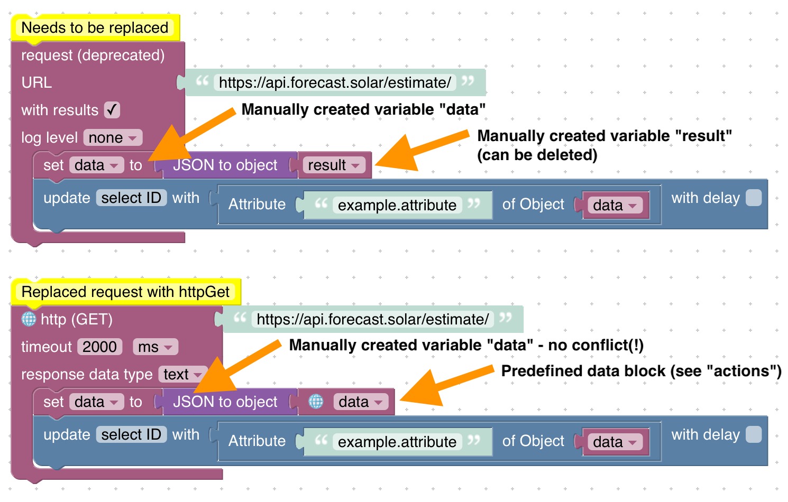

# Upgrade-Anleitung
## Verbotene Verzeichnisse für Script Filesystem Mirroring
**Seit v5.5.0 des JavaScript-Adapters** dürfen die folgenden Speicherorte (relativ zum ioBroker-Basisverzeichnis, normalerweise `/opt/iobroker`) nicht mehr verwendet werden:

* Das ioBroker-Basisverzeichnis selbst und alle Pfade darüber!
* `./iobroker-data` selbst, benutzerdefiniertes Unterverzeichnis (wählen Sie einen Namen, der sich mit keinem Adapter überschneidet!)
* `./iobroker-data/backup-objects` oder irgendetwas darunter
* `./iobroker-data/files` oder irgendetwas darunter
* `./iobroker-data/backitup` oder irgendetwas darunter
* `./backups` oder irgendetwas darunter
* `./node_modules` oder irgendetwas darunter
* `./log` oder irgendetwas darunter

Die Skript-Dateisystemspiegelung speichert alle Quelldateien der Skripte in Ihrem Dateisystem und ermöglicht Ihnen, die Dateien in Ihrem bevorzugten Skripteditor neben dem Webeditor zu bearbeiten. Alle Änderungen werden in beide Richtungen synchronisiert.

Wenn Sie die Systemspiegelung von Skriptdateien aktivieren, achten Sie darauf, ein **dediziertes neues Verzeichnis** zu erstellen und **kein** vorhandenes Verzeichnis mit anderen Inhalten zu verwenden. Stellen Sie außerdem sicher, dass kein anderes Skript oder kein anderer Prozess Dateien im angegebenen Verzeichnis ändert, um Zugriffsprobleme zu vermeiden.
Jeder Speicherort muss für den Benutzer „iobroker“ beschreibbar sein!

## Anfrage an httpGet
**Seit v8.0.0 des JavaScript-Adapters** ist das Paket `request` veraltet und die Verwendung in Ihren Skripten führt zu einer Warnung. Der JavaScript-Adapter muss das Paket irgendwann löschen. Um die Migration so einfach wie möglich zu gestalten, bietet die Sandbox eine neue Funktion zum Anfordern von HTTP-Ressourcen.

### JavaScript
Beispielcode:

```js
const request = require('request');

schedule('*/30 * * * *', () => {
    const options = ;

    request({ url: 'https://api.forecast.solar/estimate/', method: 'GET' }, (error, response, body) => {
        if (!error && response.statusCode == 200) {
            const resObj = JSON.parse(body);

            // ...
        }
    });
});
```

Migration:

1. Entfernen Sie den Import des `request`-Pakets
2. Verwenden Sie die native Methode „httpGet“ (Details finden Sie in der Dokumentation).
3. Aktualisieren Sie die Parameter der Rückruffunktion
4. Ersetzen Sie `body` durch `response.data`

```js
schedule('*/30 * * * *', () => {
    httpGet('https://api.forecast.solar/estimate/', (err, response) => {
        if (err) {
            console.error(err);
        } else if (response.statusCode == 200) {
            const resObj = JSON.parse(response.data);

            // ...
        }
    });
});
```

### Blockly
- Der `request`-Block unterstützte nur HTTP GET (andere Methoden wurden nicht unterstützt) - ersetzen Sie den Block durch `http (GET)`
- Um die Antwort verwenden zu können, musste eine benutzerdefinierte Variable mit dem Namen „Result“ erstellt werden. Dies ist nicht mehr erforderlich. Löschen Sie die Variable und verwenden Sie den dedizierten Block, um mit den Ergebnisparametern zu arbeiten (wie in Triggerblöcken).

