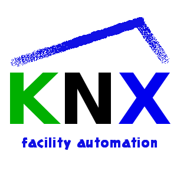

#ioBroker.knx
#### Inhaltsverzeichnis
* [Beschreibung](#Beschreibung)
* [Anforderungen](#Anforderungen)
* [Funktionen](#Funktionen)
* [Adapterkonfiguration](#adapter-konfiguration)
    * [Lizenz installieren](#install-the-license)
    * [Konfigurationsschnittstelle](#konfigurationsschnittstelle)
    * [Objekte](#Objekte)
    * [Verwendung](#Verwendung)
    * [Datenpunkttypen (DPT)](#data-point-types-dpt)
    * [Wie der Import funktioniert](#wie-der-Import funktioniert)
    * [Problemvermeidung](#Problemvermeidung)
* [GA-Tool](#ga-Tool)
    * [Direct Link non-KNX State to KNX vice-verse](#direct-link-non-knx-state-to-knx-vice-verse)
* [Geplante Funktionen](#geplante-Funktionen)
* [Änderungsprotokoll](#Änderungsprotokoll)

## Beschreibung
de: Dieser Adapter ermöglicht den Import von knxproj-Dateien aus der ETS. Es erzeugt die Übersetzung zwischen KNX-Gruppenadressen und ioBroker und stellt die Geräte in Räume (insb. für MobileUI).

ru: [Установка и базовая настройка адаптера](docs/ru/README.md)

Es verbindet sich mit Standard-KNX/LAN-Gateways.

**Achtung: Mit dem Wechsel auf KNX-Adapter Version 2.x hat sich die Lizenzierung geändert. Eine neue Lizenz erhalten Sie bei [https://iobroker.net](https://iobroker.net/)**

**Sie sollten auch iobroker js-controller UND admin auf die neueste Version aktualisieren.**

Bevor Sie beginnen: Jeder DPT von com.Objects sollte in Ihrem ETS-Projekt gesetzt sein. Jedes Gerät sollte in Ihre Anlagenstruktur einsortiert werden.

## Anforderungen
* Knotenversion >= 14.15.4
* Admin-Version >= 5.2.0
* js-Controller-Version >=3.3.20

Ohne diese Anforderungen ist der Adapter nicht installierbar oder funktioniert nicht richtig.

## Merkmale
* `knxproj`-Datei importieren
* Generieren einer ETS-ähnlichen Objektstruktur
* Act-Channel und State-Channel finden und kombinieren (Heuristik)
* Aktualisierung aller Zustände beim Start
* keine Cloud oder Internet erforderlich
* Ausgeben eines READ auf den KNX-Bus, während auf das Zustandsobjekt geschrieben wird
* GA-Objekte mit GA-Tools bearbeiten und modifizieren
* Bearbeiten und Modifizieren von State-Act-Beziehungen mit GA-Tools
* NEU: Direktlink Nicht-KNX State zulassen (umgekehrt)

##Adapterkonfiguration
Öffnen Sie nach der Installation dieses Adapters die Adapterkonfiguration.

###Lizenz installieren
Der erste Schritt besteht darin, die Lizenz zu beantragen. Wenn Sie keine Lizenz installiert haben, werden 500 Datenpunkte angewendet.

* (1) zeigt Ihre System-ID an, Sie benötigen diese, um eine Lizenz zu erhalten
* (2) Klicken Sie hier, um Ihre Lizenz zu beantragen

Wenn Sie bereits eine neue Lizenz unter [https://iobroker.net](https://iobroker.net/) erstellt haben, können Sie diese in (2) einfügen ODER direkt online durch Klick auf (1) erwerben.

Wenn Sie auf (1) geklickt haben, geben Sie Ihr iobroker.net-Konto-Login ein.

Wenn Ihre Daten korrekt waren, sehen Sie alle Ihre Lizenzen, die Sie erhalten haben. Wählen Sie diejenige aus, die Sie verwenden möchten.

Wenn dies erfolgreich war, speichern Sie es.

Das ist alles. Klicken Sie auf die Schaltfläche zum Speichern unten auf dieser Seite.

### Konfigurationsschnittstelle

1. KNX-Gateway IP: IPv4 des KNX-LAN Gateways.
2. KNX-Gateway-Port: Standard ist Port 3671.
3. Physikalische Adresse: Physikalische Adresse der iobroker knx-Instanz **! Wichtig: das ist nicht die phys. Adresse des LAN-Gateways !** und darf nicht auf 0 enden
4. KNX-Pakete pro Sekunde: Dies begrenzt die Paketrate. Wenn sich das KNX Lan Gateway zu oft neu verbindet oder vorübergehend nicht erreichbar ist, reduzieren Sie diese Rate.
5. lokale iobroker IP: Wählen Sie die IP / Schnittstelle aus, an die der Adapter gebunden wird
6. loglevel: normalerweise ist das Level "Info", zum Debuggen das Level erhöhen.
7. nur neue Datenpunkte importieren: dies ist standardmäßig aktiviert. Bei Deaktivierung werden neue GAs generiert UND bestehende GAs neu erstellt.
8. Schaltfläche Datei hochladen: Drag'n Drop ist hier verfügbar oder klicken Sie auf den Dateiauswahldialog. Hier können Sie Ihren ETS-Export im `knxproj`-Format hochladen.

Nach erfolgreichem Import zeigt ein Dialog die Anzahl der importierten Objekte an. Drücken Sie nun "Speichern & Schließen" und der Adapter sollte starten.
Beim Start liest der Adapter alle Gruppenadressen mit Read-Flag und Write-Flag. Dies kann eine Weile dauern und Ihren KNX-Bus stark belasten. Aber die Werte in Ihrem vis werden nach dem Start aktualisiert.
Das Hochladen einer passwortgeschützten Datei ist noch nicht möglich.

9. Host-ID: Dies ist eine spezielle ID des iobroker-Hosts. Diese ID wird für die Generierung und Validierung der Lizenz benötigt
10. GA-Tools: Toolbox zum schnellen Wechseln von GAs

###Objekte
Hier befindet sich unter knx.0 der Gruppenadressbaum wie in Ihrem ETS-Projekt. Verwenden Sie zum Ändern der Eigenschaften das GA-Tool.

### Verwendung
Wenn der Adapter erfolgreich startet, stehen Ihre Datenpunkte für alles zur Verfügung, was Sie tun möchten.

### Datenpunkttypen (DPT)
Es stehen alle DPTs gemäß "System Specifications, Interworking, Datapointtypes" der KNX Association zur Verfügung. Das bedeutet, dass Sie 2 Arten von Informationen erhalten können: 1) einen Wert oder eine Zeichenfolge 2) durch Kommas getrennte Werte oder ein Array von Werten (im Moment weiß ich nicht, wie ich damit besser umgehen soll)

Beispielsweise wird ein DPT5.001 als unsigned Integer mit 8-Bit codiert. Dies ergibt einen einzelnen Wert. Das DPT3.007 (Control Dimming) ist als 1Bit(Boolean)+3Bit(unsigned Int) codiert.
Dies ergibt z.B. in einem Wert wie "0,5", wobei "0" "verringern" bedeutet und "5" die Anzahl der Intervalle bedeutet.

### So funktioniert der Import
1. Lesen aller Kommunikationsobjektreferenzen (COR):

    Kombinieren von Gruppenadressenreferenz-ID'd mit DPT des entsprechenden COR (falls vorhanden).

2. Generierung der Gruppenadressenstruktur (GAS):

    Generieren des GAS basierend auf GAR-IDs und Einstellen von DPT (falls noch nicht erfolgt)

3. Finding State a Act-Adressen:

in ets-exports gibt es keine Informationen über Zustands- und Aktadressen. Der Adapter analysiert alle GAs von "status" oder "state". Wenn es 2 GAs mit einer Ähnlichkeit von mehr als 90% gibt, dann wird eine Adresse gehandelt und die andere der Staat. Es wird auch geprüft, ob die DPTs ähnlich sind. Deshalb ist es nicht einfach, einen Peer zu finden, wenn die GA-Namensgebung nicht konsistent ist.

4. Flag-Check in der Gerätekonfiguration:

   die Flags werden wie folgt behandelt:

    | KNX | | | iobroker | | |
    |-------|-----------|------------|----------|----------|-------------------------------------------------|
    | Lesen | Schreiben | Senden | Lesen | Schreiben | Erklärung |
    | - | - | - | - | - | der Wert wird von GroupValueRead| . aktualisiert |
    | x | - | - | x | x | das Senden eines beliebigen Werts in diesem Zustand löst einen GroupValueRead aus|
    | - | x | - | - | x | mit GroupValueWrite| . den Wert auf KNX schreiben |
    | - | - | x | x | - | der Statuswert wird von GroupValueResponse aktualisiert |
    | x | - | x | x | x | das Senden eines beliebigen Werts in diesem Zustand löst einen GroupValueRead aus|

6. Erstellung von Datenpunkt-Peers (DPP):

Ein DPP wird erstellt, wenn GA, GAR und DPT gültig sind. Dies sind die DPP, mit denen der Adapter arbeitet.
Wenn DPT in einem GA fehlt, weil es nicht gefunden werden konnte, wird das DPP nicht erstellt. Dies kann mit GA-Tool erfolgen.

7. beim Adapterstart:

alle mit "Read" Flag markierten GA's werden beim Start geprüft. Dies kann sich auf einen höheren Busverkehr auswirken. Am Ende sind alle Zustände auf dem neuesten Stand.

###Vermeidung von Problemen
* saubere ETS-Programmierung und noch wichtiger saubere ETS-Programmierung und vor allem saubere ETS-Programmierung
* Weisen Sie die DPTs zu!!
* einheitliche Kennzeichnung der GA-Namen (z.B. „EG Wohnen Decke Licht schalten“ und „EG Wohnen Decke Licht schalten Status“)
* Vermeidung von Sonderzeichen ",./;&%$§[]" (kann zu Problemen bei der Gaserzeugung führen)
* Prüfen Sie, ob das KNX/LAN GW erreichbar ist. Ist dies nicht der Fall, versucht der Adapter kontinuierlich eine Verbindung herzustellen.
* Physikalische Adresse richtig wählen (wichtig bei Verwendung von Linienkopplern). !!! ACHTUNG: Die hier eingetragene physikalische Adresse ist NICHT die Adresse des LAN Gateways und darf nicht auf 0 enden!!!
* Der Port der LAN-Schnittstelle ist normalerweise 3671
* Aufgrund der Möglichkeit der Statusabfrage ist eines zu beachten: Es muss sichergestellt sein, dass vom ioBroker nicht mehr als 40 Anfragen pro Sekunde generiert werden, da diese dann physikalisch generiert werden können

  kann vom Adapter nicht mehr an das Gateway weitergegeben werden.

## GA-Tool
Das GA-Tool macht es einfach, die Eigenschaften von GAs zu ändern.

1. zeigt den GA-Baum und das ausgewählte GA
2. im Eigenschaftsbereich den Namen des ausgewählten GA
3. Iobroker-Flags setzen
4. GA DPT einstellen
5. anerkannte Handlung GA
6. anerkannter staatlicher GA

1. Zeigen Sie die Staat-Akt-Beziehung
2. Wenn eine Beziehung existiert, kann sie entfernt werden

Wenn keine Beziehung vorhanden ist, kann eine neue erstellt werden, indem Sie auf (2) für den ausgewählten GA (1) klicken.
Im Dialog (3) kann der Peer ausgewählt werden

Wenn mehr GAs zum Ändern der Eigenschaften vorhanden sind, verwenden Sie die Mehrfachauswahl. Diese Funktion funktioniert nur für GAs ohne Beziehung.

1. ausgewählte GAs
2. Eigenschaften zum Ändern
3. es ist keine Änderung möglich

### Direct Link Nicht-KNX-Zustand zu KNX umgekehrt
Seit Adapter Version 2.0.6 ist es möglich einen Nicht-KNX ioBroker Zustand direkt mit einem GA zu verknüpfen. Damit können Uhrzeit, Datum, beliebige Zustände oder Infos auf KNX übernommen werden. (ein kleiner Hinweis: Sie können jede Ihrer IOT-Komponenten direkt mit einem GA in KNX verknüpfen (z. B. einen Homematic-Taster mit einem KNX-GA oder einen KNX-Tastensensor mit Ihrem sonosplayer verknüpfen)). Die Zustände können mit einem GroupValueRead gelesen werden und werden bei Zustandsänderungen automatisch auf KNX aktualisiert. Auch wenn Sie auf KNX ändern, wird das verknüpfte Nicht-KNX-IOT-Gerät aktualisiert.

1. Wählen Sie das GA aus, mit dem Sie eine Verbindung herstellen möchten
2. zeige das ausgewählte GA
3. Dieses GA muss das Attribut **write** haben
4. Wählen Sie einen gültigen Datenpunkttyp (wenn sie nicht übereinstimmen, funktioniert es nicht)
5. Es ist nicht erlaubt, eine Akt-Zustand-Beziehung zu haben
6. Schaltfläche zum Auswählen eines Nicht-KNX-Objekts zum Verknüpfen

1. Wählen Sie das Nicht-KNX-Objekt aus, das Sie verknüpfen möchten
2. drück ok, wenn du fertig bist

Jetzt ist KNX-GA **(1)** direkt mit dem Nicht-KNX-Iobroker **(2)** verbunden. Mit **(3)** können Sie diese Relation löschen.

## Geplante Funktionen
* esf-Import
* GA-Mon-Busüberwachungstool

<!-- Platzhalter für die nächste Version (am Zeilenanfang):

### __ARBEITEN IN PROGRESS__ -->
##Ausnahmen und Fehler
**Dieser Adapter verwendet Sentry-Bibliotheken, um den Entwicklern automatisch Ausnahmen und Codefehler zu melden.** Weitere Details und Informationen zum Deaktivieren der Fehlerberichterstattung finden Sie unter [Dokumentation zum Sentry-Plugin](https://github.com/ioBroker/plugin-sentry#plugin-sentry)! Sentry Reporting wird ab js-controller 3.0 verwendet.

Der Entwickler ist nicht in der Lage, weitere spezielle Informationen über das System/die Konfiguration/Benutzer/die Umgebung zu erhalten. Falls keine Lizenz gefunden wird, wird auch die Adapterversion und die Host-ID gemeldet.

## Changelog
### 2.0.8
* fixed bug with unackn write
* fixed bug in linkedState

### 2.0.7
* fixed bug with unable to write on KNX

### 2.0.6
* fixed problem on ETSv6 import
* many small bugfixes
* implemented GA-Tools directLink feature

### 2.0.5

* fixed problem on ETSv4 import
* corrected some messages
* corrected DPT14.x min and max range

### 2.0.4

* fixed DPT9.xxx calculation
* implemented date-and-time DPT19.00x
* fixed confusing "no license error"
* small bugfixes

### 2.0.3 (2021-12-04)

* fixed counting 1st Datapoint
* automaticly remove old V1 license", preventing confusion after upgrade from V1 to V2

### 2.0.1

* fixed problem with license acceptance

### 2.0.0 (2021-11-15) **Major release**

* Breaking change! => new license is neccessary V1 Licenses will not work => V1 business Licenses can changed to V2
* complete refactoring of knx-admin
* added Tool for handling GA in knx-admin
* fixed many bugs (in knx-stack, on importing ETS Projects, reconnect and timeouts)
* added new datapoint types
* added import till ETS V6
* changed license management

### 1.0.46 (2021-03-23)

* New admin GUI

### 1.0.45 (2021_03_22)

* import of ETS v5.7.5 projects

### 1.0.44 (2021_01_22)

* fixed act and state handling
* added some new datapoint types
* fix facility and room recognition and device allocation

### 1.0.42 (2020_09_03)

* Fixed problem with missing index_m.html

### 1.0.41

* fixed bug on GroupValue_Response event
* corrected connection to Gira GW

### 1.0.40

* fixed some import errors for ETS 5.7.x
* fixed bug on GroupValue_Response event

### 1.0.39

* fixed import error

### 1.0.38

* fixed some bugs on import
* show warning if import-file ist password protected

### 1.0.37 (2010-01-31)

* update for ETS 5.7.3 import

### 1.0.36 (2019-10-16)

* some bugs fixed

### 1.0.35 (2019-09-15)

* fixed permanent reconnects, if no traffic on knx-bus

### 1.0.34 (2019-09-15)

* changes on importer for detecting project-id

### 1.0.33 (2019-09-12)

* fixed bug while writing to bus
* added units to states
* fixed "read/write of undefined" error

### 1.0.32 (2019-09-03)

* updated importer for ETS V5.7.2, some changes in KNX-stack state-machine

### 1.0.31

* some fixes on ETS5.7.2 importer
* small changes in knx-stack statemachine
* added (again) phys address to admin config dialog
* fixed bug in deviceTree generation

### 1.0.30

* new Importer for ETS5.7.2 knxproj files
* extended accepted Data point types
* new adapter configuration menu
* implemented a switch for the user to decide to use "true" and "false" or "0" or "1" for binary values
* fixed bug in GroupValue_Read
* implemented a selector for local network interface for KNX to Gateway communication
* extended State Object for later features
* fixed some small other bugs

### 1.0.20

* fixed bug in handling KNX-data packages, which occurs periodical reconnects
* fixed bug in KNX-project file upload procedure

### 1.0.19

* reverted to true/false handling for DPT1.x

### 1.0.18

* fixed upload issue with ETS5.6.x project files
* switched values for "boolean" from 1 and 0 to true false 
* fixed recognition of role set for DPT1.x to switch
* fixed DPT16.xxx writing to KNX-Bus with values < 14Byte

### 1.0.17 (2018-08-16)

* Better state processing
* Add configurable package rate
* corrected Bug in "import only new objects"

### 1.0.15 (2018-07-18)

* change ChID on reconnect
* on Startup read wait for response of State channel or timeout

### 1.0.13 (2018-07-04)

* elimination of special signs while importing
* small bug-fixes

### 1.0.12 (2018-06-19)

* reduced and sorted log output
* small bug-fixes
* NEW Feature: request State/Val of stateObject from KNX-Bus

### 1.0.11 (2018-05-27)

* fixed DPT1 correcting value problem
* fixed reconnect problem
* other small optimizations and fixes

### 1.0.10 (2018-05-04)

* closing local port in case of undefined connection state
* added advanced debug-level via adapter-config
* many fixes

### 1.0.9 (2018-04-29)

* changed to state-wise processing
* fixed "disconnect-request"
* changed connection handling with knxd
* many small fixes

### 1.0.8 (2018-04-04)

* modified package queue
* fixed ACK if sending to KNX-Bus
* many small fixes

### 1.0.7 (2018-03-16)

* fixed Adapter-lock while uploading projects

### 1.0.6 (2018-03-11)

* fixed connection problem
* corrected package counter

### 1.0.5 (2018-03-01)

* fixed empty objects, related to DPT1 (error message \[object Object\] unknown Input value)
* fixed path variable
* fixed bug with GA's containing a "/" in the name (on proj-import)
* start implementing crosswise property update on corresponding DPT (on proj-import)

### 1.0.4 (2018-02-27)

* schema update for room enumeration coming up with ETS 5.6

### 1.0.2 (2018-02-27)

* kleine Fehler beseitigt

### 1.0.1 (2018-02-26)

* fixed certificate error

### 1.0.0 (2018-02-25)

* substitution of used KNX-stack with own from scratch build stack
* implemented full scale of DPT according to "System Specifications, Interworking, Datapointtypes" from KNX Association
* hardening connection handling for tunneling connections
* upgrade Adapter-configuration Interface to be ready with Admin3
* removed "Delay Slider" because of the new knx-stack
* many other small changes
* fixed post-comma values to scale-value of DPT
* implemented "add" mode for knxproject upload (existing Objects stay as they are, only new Objects where added)

### 0.8.6 (2017-06-17)

* some small bug-fixes
* insert slider to set a sendDelay for slow KNX/LAN Gateways to prevent connection loss

### 0.8.5 (2017-06-05)

* project loader rebuild, dpt13-fix

### 0.8.3 (2017-04-24)

* added act channel update of corresponding state
* fix bug in state-vis update
* optimized knxproj upload

### 0.8.2 (2017-02-26)

* implemented device-config parsing from knxproj
* better choice of state/val of DP objects

### 0.8.1 (2017-02-06)

* fixed DPT1 switch problem

### 0.8.0 (2017-02-xx) comming soon

### 0.7.3 (2016-12-22)

* (chefkoch009) more DPT's are supported
* faster Startup
* implemented generation of room list with device dependencies

### 0.7.2 (2016-11-20)

* (chefkoch009) added necessary dependencies

### 0.7.1 (2016-11-19)

* (chefkoch009) Support standard KNX/LAN Gateways.

### 0.7.0 (2016-10-13)

* (chefkoch009) Support of project export

### 0.6.0 (2016-07-20)

* (chefkoch009) redesign

### 0.5.0

*  (vegetto) include vis widget

#### 0.4.0

* (bluefox) fix errors with grunt

#### 0.2.0

* (bluefox) initial release

## License

For <500 datapoints there is no need of registration or adding a license key. If you have more then 500 datapoints you need a license. You can choose  
between yearly and permanent licence.

To use this adapter in ioBroker you need to accept the source code license of the adapter. The source code of this adapter is available under the CC-NC-BY license.

Additionally you need a license to use the adapter. The license editions are available on [https://iobroker.net/www/pricing](https://iobroker.net/www/pricing)

## License
The CC-NC-BY License (CC-NC-BY)

Copyright (c) 2016-2021 K.Ringmann <info@punktnetzwerk.net>

THE WORK IS PROVIDED UNDER THE TERMS OF THIS CREATIVE
COMMONS PUBLIC LICENSE ("CCPL" OR "LICENSE"). THE WORK IS PROTECTED BY
COPYRIGHT AND/OR OTHER APPLICABLE LAW. ANY USE OF THE WORK OTHER THAN AS
AUTHORIZED UNDER THIS LICENSE OR COPYRIGHT LAW IS PROHIBITED.

BY EXERCISING ANY RIGHTS TO THE WORK PROVIDED HERE, YOU ACCEPT AND AGREE
TO BE BOUND BY THE TERMS OF THIS LICENSE. TO THE EXTENT THIS LICENSE MAY
BE CONSIDERED TO BE A CONTRACT, THE LICENSOR GRANTS YOU THE RIGHTS
CONTAINED HERE IN CONSIDERATION OF YOUR ACCEPTANCE OF SUCH TERMS AND
CONDITIONS.

Read full license text in [LICENSE](LICENSE)