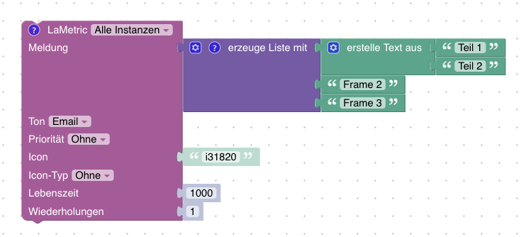

# ioBroker.lametric

## Anforderungen

- *LaMetric Time* mit Firmware *2.2.2* (oder neuer)

## Configuration

Du bekommst deinen Geräte-Schlüssel (API-Key) [hier](https://developer.lametric.com/user/devices).


## Features

- Verändern der Display-Helligkeit (prozentual, Automatik/Manueller Modus)
- Verändern der Lautstärke (prozentual)
- Konfiguration des Bildschirmschoners (aktivieren/deaktivieren, Zeitbasiert, wenn dunkel)
- Bluetooth aktivieren/deaktivieren, Bluetooth Name verändern
- Zwischen Apps wechseln (nächste, vorige, gehe zu spezifischer App)
- Versenden von Notifications (mit konfigurierbarer Priorität, Sound, Icons, Text, ...)
- Kontrolle von speziellen Apps wie ``clock``, ``radio``, ``stopwatch`` oder ``weather``
- Nutzung der *My Data (DIY)* LaMetric App um regelmäßig Informationen darzustellen

Alle Funktionen sind nur durch die [offizielle API](https://lametric-documentation.readthedocs.io/en/latest/reference-docs/lametric-time-reference.html) limitiert.

## Blockly Beispiele

Senden eines einfachen Textes, welcher als einzelner Frame angezeigt wird


Um mehrere Frames darzustellen, kann eine Liste von Texten übergeben werden



Um Graphen darzustellen, muss ein Array aus Zahlen als Liste in einem Frame übergeben werden.


## My Data (DIY) *(version > 1.1.0)*

*LaMetric* bietet (über den integrierten App-Store) eine zusätzliche App an, um eigene Informationen darzustellen. Diese App heißt [My Data DIY](https://apps.lametric.com/apps/my_data__diy_/8942). Dieser Adapter erstellt einen Datenpunkt im erforderlichen Format.
Du kannst den Simple API Adapter nutzen, um Daten zur LaMetric Time zu übertragen.

```ioBroker LaMetric Adapter -> State with Frame information <- Simple API Adapter <- My Data DIY App <- LaMetric```

### Konfiguration (mit Authentisierung)

1. Installiere den [Simple API ioBroker Adapter](https://github.com/ioBroker/ioBroker.simple-api)
2. Erstelle einen neuen ioBroker-Nutzer mit dem Namen ``lametric`` und einem eigenen Passwort (z.B. ``HhX7dZl3Fe``)
3. Füge den neuen ``lametric``-Nutzer zur Gruppe ``users`` hinzu
4. Installiere die App *My Data DIY* über den App-Store auf deiner *LaMetric Time*
5. Öffne die Einstellungen der *My Data (DIY)* App und konfiguriere die URL des Simple API Adapters (siehe unten)
6. Gehe in die Adaptereinstellungen und füge neue Frames mit deinen eigenen Informationen hinzu (siehe nächster Abschnitt)

```
http://172.16.0.219:8087/getPlainValue/lametric.0.mydatadiy.obj/?json&user=lametric&pass=HhX7dZl3Fe
```

**Wichtig: Nutze das json-Flag des SimpleAPI Adapters (verfügbar seit Version 2.6.2)**

**Stelle sicher, dass die IP, der Port, Benutzername und Passwort in der URL korrekt sind!**

### Konfiguration (ohne Authentisierung)

1. Installiere den [Simple API ioBroker Adapter](https://github.com/ioBroker/ioBroker.simple-api)
2. Installiere die App *My Data DIY* über den App-Store auf deiner *LaMetric Time*
3. Öffne die Einstellungen der *My Data (DIY)* App und konfiguriere die URL des Simple API Adapters (siehe unten)
4. Gehe in die Adaptereinstellungen und füge neue Frames mit deinen eigenen Informationen hinzu (siehe nächster Abschnitt)

```
http://172.16.0.219:8087/getPlainValue/lametric.0.mydatadiy.obj/?json
```

**Stelle sicher, dass die IP und der Port in der URL korrekt sind!**

### Frame Konfiguration *(Version > 1.1.0)*

- Füge mit dem Plus-Button so viele Frames hinzu, wie Du möchtest
- Symbol: Wähle ein Symbol von der [offiziellen Webseite](https://developer.lametric.com/icons) und füge die ID in das Feld ein. **Wichtig: Nutze ein i (für statische Sybole) oder ein a (für animierte Symbole) als Präfix der ID (Beispiel: `i3389`)**
- Text: Tippe einen beliebigen anzuzeigenden Text ein. Du kannst Informatioenn aus Datenpunkten abfragem, indem Du deren ID in geschweifte Klammern angibst. An dieser Stelle wird dann der aktuelle Wert der Datenpunkte eingesetzt. (Beispiel: `{youtube.0.channels.HausAutomatisierungCom.statistics.subscriberCount} Subscribers`)

Beispielkonfiguration von 3 Frames:


## Spezielle Apps / Widgets *(Version > 1.1.2)*

Einige Apps lassen sich mit Zusatzinformationen versehen oder steuern.

### clock.clockface

Gültige Werte sind

- `weather`, `page_a_day`, `custom` oder `none`
- Eigene Icons im Format `data:image/png;base64,<base64 encoded png binary>` oder `data:image/gif;base64,<base64 encoded gif binary>`

Beispiel: `data:image/png;base64,iVBORw0KGgoAAAANSUhEUgAAAAgAAAAICAYAAADED76LAAAAOklEQVQYlWNUVFBgwAeYcEncv//gP04FMEmsCmCSiooKjHAFMEF0SRQTsEnCFcAE0SUZGBgYGAl5EwA+6RhuHb9bggAAAABJRU5ErkJggg==`

### countdown.configure

Erlaubte Werte: Zeit in Sekunden

## Scripts

Um Nachrichten/Notifications auf Deiner *LaMetric Time* anzuzeigen, sende eine Nachricht mit dem JavaScript Adapter (oder einem anderen Adapter) an die entsprechende Instanz:

```JavaScript
sendTo(
    "lametric.0",
    "notification",
    {
        priority: "[info|warning|critical]",
        iconType: "[none|info|alert]",
        sound: "<string from sound list>",
        lifeTime: <milliseconds>,
        icon: "<icon>",
        text: "<string|array>",
        cycles: <integer>
    }
);
```

Beispiel einzelner Frame:

```JavaScript
sendTo(
    "lametric.0",
    "notification",
    {
        priority: "info",
        iconType: "none",
        sound: "cat",
        lifeTime: 5000,
        icon: "i31820",
        text: "test",
        cycles: 1
    }
);
```

Beispiel mehrere Frames:

```JavaScript
sendTo(
    "lametric.0",
    "notification",
    {
        priority: "info",
        iconType: "none",
        sound: "cat",
        lifeTime: 5000,
        icon: "i31820",
        text: ["frame 1", "frame 2", "frame 3"],
        cycles: 1
    }
);
```

Beispiel zyklische Informationen:

```JavaScript
let i = 0;
function show() {
    console.log('Show ' + i);
    sendTo(
        "lametric.0",
        "notification",
        {
            priority: "info",
            iconType: "info",
            lifeTime: 5000,
            icon: "data:image/png;base64,iVBORw0KGgoAAAANSUhEUgAAAAgAAAAICAIAAABLbSncAAAAAXNSR0IArs4c6QAAAARnQU1BAACxjwv8YQUAAAAJcEhZcwAADsMAAA7DAcdvqGQAAAAYdEVYdFNvZnR3YXJlAHBhaW50Lm5ldCA0LjEuNWRHWFIAAAAySURBVBhXY4AAYdcKk1lngCSUDwHIfAQbzgLqgDCgIqRLwFkQCYQoBAD5EATl4wQMDADhuxQzaDgX0gAAAABJRU5ErkJggg==",
            text: "Hi " + i,
            cycles: 1
        }
    );
    i++;
}
setInterval(show, 10000);
show();
```

## Changelog

<!--
  Placeholder for the next version (at the beginning of the line):
  ### **WORK IN PROGRESS**
-->
### **WORK IN PROGRESS**

* (klein0r) Updated state roles
* (klein0r) Added hint for Admin 4 configuration

### 1.5.3 (2022-02-08)

* (klein0r) Updated log messages and error handling
* (klein0r) Updated dependencies

### 1.5.2 (2021-12-23)

* (klein0r) Updated dependencies
* (klein0r) Updated documentation

### 1.5.1

* (klein0r) Translated all objects
* (klein0r) Fixed HTTPS option

### 1.5.0

* (klein0r) Fixed myData DIY data type **(BREAKING CHANGE - requires SimpleAPI 2.6.2 or later to use json parameter)**
* (klein0r) Added version check

### 1.4.1

* (klein0r) Fixed missing translations

### 1.4.0

* (klein0r) Admin 5 Support

### 1.3.2

* (klein0r) Updated dependencies

### 1.3.1

* (klein0r) Added local start and end time for screensaver

### 1.3.0

* (klein0r) Encrypt sensitive information **(BREAKING CHANGE - RE-ENTER YOUR API KEY)**

### 1.2.1

* (klein0r) Extended regex for My Data (DIY)

### 1.2.0

* (klein0r) Added hide if value for My Data (DIY)
* (klein0r) Remove frames without text from My Data (DIY)
* (klein0r) Allow dynamic states for My Data (DIY) icons

### 1.1.3

* (klein0r) Fixed async object creation

### 1.1.2

* (klein0r) Delete app channels if app was deleted on LaMetric
* (klein0r) Custom app configuration (clockface, countdown duration)

### 1.1.1

* (klein0r) Fixed replacement issue for My Data (DIY)
* (klein0r) Updated README with more configuration details

### 1.1.0

* (klein0r) Added support for My Data (DIY)

### 1.0.1

* (klein0r) Added chart data support to notification

### 1.0.0

* (klein0r) First stable release
* (klein0r) Added iobroker sentry
* (klein0r) Added brightness and volume limit information (min, max)

### 0.0.10

* (klein0r) Switched to axios lib

### 0.0.9

* (klein0r) Added missing translations
* (GermanBluefox) Improved Blockly and main.js

### 0.0.8

* (klein0r) Updated dependencies

### 0.0.7

* (klein0r) fixed blockly

### 0.0.6

* (klein0r) switched to setTimeout instead of setInterval, improved logging and fixes eslint complaints

### 0.0.5

* (klein0r) Fixed notification, html, updated github template, enable and disable screensaver

### 0.0.4

* (klein0r) Refactored blockly sendTo / notifications

### 0.0.3

* (klein0r) Added app switching support, refactored everything
* (bluefox) The deletion of the actual shown information was added

### 0.0.2

* (Sigi74) Change message_value for variables message
* (Sigi74) Leave sound none

### 0.0.1

* (klein0r) initial release

## License

The MIT License (MIT)

Copyright (c) 2022 Matthias Kleine <info@haus-automatisierung.com>

Permission is hereby granted, free of charge, to any person obtaining a copy
of this software and associated documentation files (the "Software"), to deal
in the Software without restriction, including without limitation the rights
to use, copy, modify, merge, publish, distribute, sublicense, and/or sell
copies of the Software, and to permit persons to whom the Software is
furnished to do so, subject to the following conditions:

The above copyright notice and this permission notice shall be included in
all copies or substantial portions of the Software.

THE SOFTWARE IS PROVIDED "AS IS", WITHOUT WARRANTY OF ANY KIND, EXPRESS OR
IMPLIED, INCLUDING BUT NOT LIMITED TO THE WARRANTIES OF MERCHANTABILITY,
FITNESS FOR A PARTICULAR PURPOSE AND NONINFRINGEMENT. IN NO EVENT SHALL THE
AUTHORS OR COPYRIGHT HOLDERS BE LIABLE FOR ANY CLAIM, DAMAGES OR OTHER
LIABILITY, WHETHER IN AN ACTION OF CONTRACT, TORT OR OTHERWISE, ARISING FROM,
OUT OF OR IN CONNECTION WITH THE SOFTWARE OR THE USE OR OTHER DEALINGS IN
THE SOFTWARE.