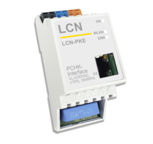

# IoBroker.lcn
Dieser Adapter ermöglicht die Verbindung des Local Control Network [LCN](https://www.lcn.eu/) mit ioBroker.

## Unterstützte Gateways
- LCN-PKE



- LCN-PKU mit LCN-PCHK


**Vergessen Sie nicht, dass ioBroker.lcn eine LCN-Verbindungslizenz blockiert.**

Die Konfiguration und Module werden automatisch durch einen Scan erkannt, der manuell über den Konfigurationsdialog ausgelöst werden muss und jederzeit wiederholt werden kann.

## Typen
Folgende Lese- und Schreibgruppen werden unterstützt:

- Analogwerte (Ausgabe/Eingabe)
- Relais (Ausgang)
- Sensoren (Eingang)
- LEDs (Ausgang/Eingang)
- Variablen (Eingabe)

## Variablen
Um die gültigen Konvertierungsfunktionen auf Variablen anwenden zu können, müssen die Variablen die gültigen Rollen haben. Folgende Rollen werden unterstützt:

- **value.temperature** – Temperatur in Celsius
- **Wert.Helligkeit** - Lux (I-Eingang) in Lux
- **value.speed.wind** – Windgeschwindigkeit in m/s
- **Wert.Spannung** - Spannung in Volt
- **value.current** – Strom in Ampere
- **value.sun.azimuth** – Sonnenazimut
- **value.sun.elevation** – Sonnenhöhe

## Anzeige
Für jedes Gerät können Sie aktivieren, ob es über ein Display verfügt oder nicht.

## Regulator (Regler)
Für jedes Gerät können Sie aktivieren, ob es über Regler verfügt oder nicht.

## Einstellungen
- Wiederverbindungsintervall (Sek.) – wie oft der Adapter versucht, eine Verbindung herzustellen. Standardmäßig alle 30 Sekunden.
– Verbindungs-Timeout (ms) – wie lange der Adapter auf eine Verbindungsantwort einschließlich Authentifizierung wartet. Standardmäßig 6 Sekunden.
– Scan-Antwort-Timeout (ms) – wie lange der Adapter beim Scannen von Modulen auf Antworten wartet.
- Response Timeout (ms) – Timeout für Steuerbefehle
- Ping-Intervall (Sek.) – wie oft der Adapter Ping-Anfragen sendet
- Ping-Antwort-Timeout (ms) – Timeout für Ping-Anfragen
- IN/OUT-Relais sind gleich – wenn die „Out“- und „In“-Relais gleich sind oder wenn diese Relais unterschiedlich sind.

```
// =====================  Same relays =============================
//                                    +-------+
// ----------------- OUT -----------> |       |
//                                    | Relay |
// <----------------- IN ------------ |       |
//                                    +-------+
//
//
// ======================  Different relays =======================
//                                    +-------+
//                                    |       |
// ----------------- OUT -----------> | Relay |
//                                    |       |
//                                    +-------+
//
//                                    +--------+
//                                    | Sensor |
// <----------------- IN ------------ |   or   |
//                                    | Relay  |
//                                    +--------+
```

## Wie benutzt man
Nach dem ersten Start müssen die Geräte gescannt werden. Dies kann im Konfigurationsdialog mit der Schaltfläche „Scannen“ erfolgen


## Machen
- Konfigurationsdialog zum Definieren des Variablentyps.

<!-- Platzhalter für die nächste Version (am Anfang der Zeile):

### **ARBEIT IN ARBEIT** -->

## Changelog
### 1.1.7 (2023-11-06)
* (bluefox) Corrected setting of undefined values

### 1.1.1 (2022-10-19)
* (bluefox) Corrected license check

### 1.1.0 (2022-10-18)
* (bluefox) Corrected issue with password

### 1.0.4 (2021-05-21)
* (bluefox) Ack will be ignored for the display commands

### 1.0.3 (2021-05-21)
* (bluefox) Changed the calculation of the temperature variables

### 1.0.2 (2020-10-11)
* (bluefox) Implemented the regulators and the display support.

### 0.6.3 (2019-12-18)
* (bluefox) General relays mode implemented

### 0.6.2 (2019-12-07)
* (bluefox) Detected delayed responses
* (bluefox) Dynamical creation of states is implemented

### 0.5.5 (2019-12-05)
* (bluefox) Relay inputs were corrected

### 0.5.4 (2019-12-04)
* (bluefox) Connection indication was corrected

### 0.5.1 (2019-11-29)
* (bluefox) Finger scanner supported
* (bluefox) Added possibility to set the analog mode
* (bluefox) Relay outputs are supported now

### 0.4.4 (2019-11-26)
* (bluefox) Fixed error by parsing of acknowledgement

### 0.4.2 (2019-06-12)
* (bluefox) Support of old measure values was added

### 0.3.2 (2018-11-19)
* (bluefox) add variables support

### 0.2.1
* (bluefox) initial release

## License
CC-BY-NC-4.0

Copyright (c) 2018-2023 Bluefox <dogafox@gmail.com>

Up to 10 devices can be connected for free. If you need more devices, you must buy a commercial license.