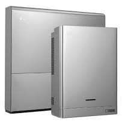

# ioBroker.lg-ess-home

## LG ESS Home Adapter für ioBroker

Ein iobroker-Adapter für einen LG ESS Hybrid-Wechselrichter. Mit diesem Adapter kann der Status des Wechselrichters ausgelesen und der Wechselrichter betrieben werden.

## Konfiguration

### Das Passwort abrufen

#### Möglichkeit Nummer 1

Das Passwort ist die MAC-Adresse der LAN-Schnittstelle des ESS in Kleinbuchstaben und ohne Doppelpunkt. Die MAC-Adresse kann in der Fritzbox (oder einem anderen Router) ausgelesen werden. (Danke an riessfa)

#### Möglichkeit Nummer 2

1. Laden Sie die Datei [LG\_Ess\_Password.exe](https://github.com/Morluktom/ioBroker.lg-ess-home/tree/master/tools) herunter.
2. Verbinden Sie den Computer mit dem WLAN des LG\_ESS-Systems. (Das WLAN-Passwort befindet sich auf dem Typenschild.)
3. Starten Sie LG\_Ess\_Password.exe (Mindestens .NET Framework 4.5 erforderlich)
4. Notieren Sie sich Ihr Passwort.

#### Möglichkeit Nummer 3

Für alle, die .exe nicht mögen: (Danke an grex1975)\
&#x20;Sie können jeden beliebigen REST-Client verwenden, um das Passwort zu erhalten:

1. Verbindung zum WLAN des LG\_ESS herstellen
2. Führe eine POST-Anfrage aus\
   &#x20;URL: <https://192.168.23.1/v1/user/setting/read/password>\
   &#x20;Header: "Charset": "UTF-8", "Content-Type": "application/json"\
   &#x20;{Body: "key": "lgepmsuser!@#"}

Sie erhalten daraufhin das Passwort und den Status.

## Changelog
<!--
    Placeholder for the next version (at the beginning of the line):
    ### **WORK IN PROGRESS**
-->
### **WORK IN PROGRESS**
- (copilot) Adapter requires node.js >= 22 now

### 0.4.1 (2024-12-23)
* (Morluktom) Bugfix lg-ess-home.0.user.essinfo.common not updated
* (Morluktom) Responsive Design added

### 0.4.0 (2024-12-23)
* (Morluktom) Bugfix: State value to set for "lg-ess-home.0.user.essinfo.home.statistics.bat_status" has to be type "number" but received type "string"
* LG ESS HOME 15 Plus added
* Switch AutoCharge and backup soc writeable

### 0.3.0 (2024-08-10)
* (Morluktom) Fixed warnings found by adapter checker
* (Morluktom) Added Admin 5 configuration
* (Morluktom) Added Ukrainan language
* (Morluktom) Add PV Forecast to chart
* (morluktom) NodeJS >= 18.x and js-controller >= 5 is required

### 0.2.3 (2022-04-05)
* (Morluktom) Chart widget: Datepicker changed to jquery

### 0.2.2 (2022-04-04)
* (Morluktom) Chart widget updated

### 0.2.1 (2022-04-04)
* (Morluktom) Chart widget updated

### 0.2.0 (2022-03-14)
* (Morluktom) Chart widget added

### 0.1.1 (2022-01-07)
* (Morluktom) replaced deprecated library and login as installer only when needed

### 0.1.0 (2021-11-27)
* (Morluktom) Read chart data and data from the installer settings

### 0.0.10 (2021-05-04)
* (Morluktom) Bugfix boolean value

### 0.0.9 (2021-05-04)
* (Morluktom) Bugfix boolean value

### 0.0.8 (2021-02-06)
* (Morluktom) Code cleanup

### 0.0.7 (2021-02-01)
* (Morluktom) Code cleanup

### 0.0.6 (2020-12-23)
* (Morluktom) Data type recognition fixed

### 0.0.5 (2020-12-15)
* (Morluktom) ScalingFactor moved to nativ
* password encryption => auto encryption (Maybe you have to set the password new)

### 0.0.4
* (Morluktom) W => kW, values confirmed

### 0.0.3
* (Morluktom) Structure of the channel and states changed

### 0.0.2
* (Morluktom) Separate Intervall for Common and Home

### 0.0.1
* (Morluktom) initial release

[Older changelogs can be found there](https://github.com/Morluktom/ioBroker.lg-ess-home/blob/master/CHANGELOG_OLD.md)

## License
MIT License

Copyright (c) 2025-2026 Morluktom <strassertom@gmx.de>

Permission is hereby granted, free of charge, to any person obtaining a copy
of this software and associated documentation files (the "Software"), to deal
in the Software without restriction, including without limitation the rights
to use, copy, modify, merge, publish, distribute, sublicense, and/or sell
copies of the Software, and to permit persons to whom the Software is
furnished to do so, subject to the following conditions:

The above copyright notice and this permission notice shall be included in all
copies or substantial portions of the Software.

THE SOFTWARE IS PROVIDED "AS IS", WITHOUT WARRANTY OF ANY KIND, EXPRESS OR
IMPLIED, INCLUDING BUT NOT LIMITED TO THE WARRANTIES OF MERCHANTABILITY,
FITNESS FOR A PARTICULAR PURPOSE AND NONINFRINGEMENT. IN NO EVENT SHALL THE
AUTHORS OR COPYRIGHT HOLDERS BE LIABLE FOR ANY CLAIM, DAMAGES OR OTHER
LIABILITY, WHETHER IN AN ACTION OF CONTRACT, TORT OR OTHERWISE, ARISING FROM,
OUT OF OR IN CONNECTION WITH THE SOFTWARE OR THE USE OR OTHER DEALINGS IN THE
SOFTWARE.