# ioBroker.lg-thinq

[Zurück zur README](/README.md)

# Einleitung

Der Adapter erstellt alle Datenpunkte mit dem Template aus dem Datenpunkt `modelJsonUri` (Abweichung bei Geräte) und verwendet die Übersetzung mit dem Template aus dem Datenpunkt `langPackModelUri` (Abweichung bei Geräte). Daher ist es möglich, dass Datenpunkte unter REMOTE angelegt werden die keine Funktion haben oder nicht für das Geräte zur Verfügung steht.

# Zusammenfassung

- [Instanz Einstellungen](#instanz-einstellungen)
    - [Einstellung LG-Thinq](#instanz-einstellung-lg-thinq)
    - [Intervall thinq1](#intervall-thinq1-lg-thinq)
- [Datenpunkte](#datenpunkte)
    - [Datenpunkte Gerät 101 Kühl-Gefrierschrank](#gerät-101-kühlschrankeisschrank-thinq1--thinq2)
        - [Remote Statistik](#101-remote-statistik-thinq2)
        - [Remote Basis Befehle](#101-remote-control-thinq1--thinq2)
        - [Snapshot](#101-snapshot-thinq1--thinq2)
    - [Datenpunkte Gerät 201 Signature](#gerät-201-waschmaschine-signature-thinq2)
        - [Remote Basis Befehle](#201-remote-control-signature-thinq2)
    - [Datenpunkte Gerät 201 Waschmaschine](#gerät-201-waschmaschine-thinq1--thinq2)
        - [Remote Statistik](#201-remote-statistik-thinq2)
        - [Remote Basis Befehle](#201-remote-control-thinq1--thinq2)
        - [Snapshot](#201-snapshot-thinq1--thinq2)
    - [Datenpunkte Gerät 202 Trockner](#gerät-202-trockner-thinq1--thinq2)
        - [Remote Statistik](#202-remote-statistik-thinq2)
        - [Remote Basis Befehle](#202-remote-control-thinq1--thinq2)
        - [Snapshot](#202-snapshot-thinq1--thinq2)
    - [Datenpunkte Gerät 401 Klimaanlage thinq2](#gerät-401-klimanalage-thinq2)
        - [Remote Statistik](#401-remote-statistik-thinq2)
        - [Remote Basis Befehle](#401-remote-ordner-thinq2)
        - [Remote Holiday](#401-remote-holiday-thinq2)
        - [Snapshot](#401-snapshot-thinq2)
    - [Datenpunkte Gerät 401 Klimaanlage thinq1](#gerät-401-klimanalage-thinq1)
        - [Remote Statistik](#401-remote-statistik-thinq1)
        - [Remote Basis Befehle](#401-remote-control-thinq1)
        - [Snapshot](#401-snapshot-thinq1)
    - [Datenpunkte Gerät 406 Wärmepumpe](#gerät-406-wärmepumpe-thinq2)
        - [Remote Statistik](#406-remote-statistik-thinq2)
        - [Remote Basis Befehle](#406-remote-basicctrl-thinq2)
        - [Remote Zeitplan](#406-remote-reservationctrl-thinq2)
        - [Snapshot](#406-snapshot-thinq2)
    - [Wetter](#wetter)

# Instanz Einstellungen

### Instanz Einstellung LG-Thinq

[Zusammenfassung](#zusammenfassung)

- `LG ThinQ E-Mail`: APP eMail eintragen
- `LG ThinQ-Passwort`: APP Passwort eintragen
- `Aktualisierungsintervall in Minuten`: Empfohlen: Bei 60 Minuten. Wenn Intervall thinq1 auf 0 gesetzt wird dann hier 0.5/1 Minute
- `Aktualisierungsintervall in Sekunden für Thinq1 (pro Gerät 1 Sekunde)`: Intervall für thinq1 User
- `Land`: Land eingeben - Standard DE
- `Sprache`: Sprache eingeben - Standard de_DE
- `Plattform`: Plattform eingeben - Standard LGThinQ
- `Sitzungsdaten löschen`: Gibt es Probleme mit dem Login dann bitte die Sitzungsdaten löschen (lg-thinq.0.session wird geleert)

    
    

### Intervall thinq1 LG-Thinq

[Zusammenfassung](#zusammenfassung)

- `interval.active` Wie viele Geräte bekommen derzeit Updates
- `interval.inactive` Wie viele Geräte bekommen derzeit keine Updates
- `interval.interval` Intervall aus der Instanz Einstellung ändern. Nach einem Adapter Neustart wird die Instanz Einstellung angewendet.
- `interval.last_update` Letzte Update
- `interval.status_devices`
    - `OK` Intervall OK
    - `Fail - 0100` Abfrage gescheitert - WorkID wird neu erstellt
    - `Fail - 0106` Gerät nicht verbunden - WorkID wird neu erstellt
    - `Error` Fehlende WorkID - WorkID wird neu erstellt
    - `Error <code>` Unbekannter Fehler - WorkID wird neu erstellt
    - `Result Error` Receive Fehler - WorkID wird neu erstellt
    - `Parse error` Parse Fehler - WorkID wird neu erstellt
    - `Unknown` Unbekannter Fehler - WorkID wird neu erstellt
    - `Request` LG antwortet nicht - WorkID wird neu erstellt
    - `{}` Unbekannt - WorkID wird neu erstellt

    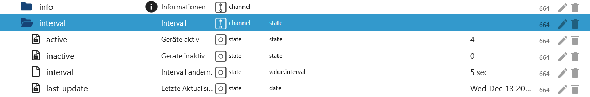

# Datenpunkte

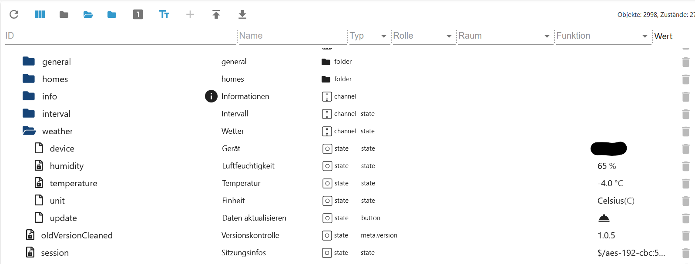

### Gerät 101 Kühlschrank/Eisschrank thinq1 & thinq2

[Zusammenfassung](#zusammenfassung)

### 101 Alle Ordner thinq1 & thinq2


### 101 Remote Ordner thinq1 & thinq2


### 101 Remote Statistik thinq2

[Zusammenfassung](#zusammenfassung)

- hourly
- `remote.Statistic.command` Welche History soll geladen werden
- `remote.Statistic.endDate` Datum eintragen bei hourly muss end und start gleich sein Format: 2023.12.01
- `remote.Statistic.startDate` Datum eintragen bei hourly muss end und start gleich sein Format: 2023.12.01
- ODER daily
- `remote.Statistic.endDate` Datum eintragen daily - Format: 2023.12.06
- `remote.Statistic.startDate` Datum eintragen daily - Format: 2023.12.01
- ODER monthly
- `remote.Statistic.endDate` Datum eintragen monthly - Format: 2023.12.01
- `remote.Statistic.startDate` Datum eintragen monthly - Format: 2023.10.01
- `remote.Statistic.period` Welche Periode
- `remote.Statistic.sendRequest` Auswahl senden
- `remote.Statistic.jsonResult` Statistik als JSON. Sind die Attribute leer dann unterstützt euer Geräte diese nicht oder es wurde ein falsches Datum angegeben.

    
    
    

Beispiel JSON Tür geöffnet

```json
{
    "item": [
        {
            "usedDate": "2023-11",
            "doorType": "DID_DOOR",
            "openCount": "0",
            "openTime": "0"
        },
        {
            "usedDate": "2023-12",
            "doorType": "DID_DOOR",
            "openCount": "0",
            "openTime": "0"
        },
        {
            "usedDate": "2023-11",
            "doorType": "FREEZER_DOOR",
            "openCount": "62",
            "openTime": "713937"
        },
        {
            "usedDate": "2023-12",
            "doorType": "FREEZER_DOOR",
            "openCount": "0",
            "openTime": "0"
        },
        {
            "usedDate": "2023-11",
            "doorType": "FRIDGE_DOOR",
            "openCount": "1037",
            "openTime": "12421700"
        },
        {
            "usedDate": "2023-12",
            "doorType": "FRIDGE_DOOR",
            "openCount": "27",
            "openTime": "304857"
        },
        {
            "usedDate": "2023-11",
            "doorType": "CONVERTIBLE_DOOR",
            "openCount": "0",
            "openTime": "0"
        },
        {
            "usedDate": "2023-12",
            "doorType": "CONVERTIBLE_DOOR",
            "openCount": "0",
            "openTime": "0"
        },
        {
            "usedDate": "2023-11",
            "doorType": "ONE_DOOR",
            "openCount": "0",
            "openTime": "0"
        },
        {
            "usedDate": "2023-12",
            "doorType": "ONE_DOOR",
            "openCount": "0",
            "openTime": "0"
        }
    ]
}
```

### 101 Remote Control thinq1 & thinq2

[Zusammenfassung](#zusammenfassung)

- `remote.expressMode` Express Mode An/Aus/Schnell -> thinq1 Datenpunkt snapshot.IcePlus
- `remote.freezerTemp` Temperatur vom Eisschrank ändern (nur Celsius)
- `remote.fridgeTemp` Temperatur vom Kühlschrank ändern (nur Celsius)
  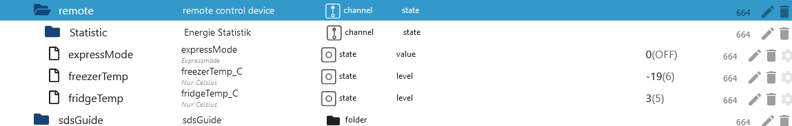

### 101 Snapshot thinq1 & thinq2

[Zusammenfassung](#zusammenfassung)


### Gerät 201 Waschmaschine Signature thinq2

[Zusammenfassung](#zusammenfassung)

### 201 Remote Control Signature thinq2

- Kann wie die 201 gesteuert werden. Allerdings müssen im Ordner `Course` folgende Werte gesetzt werden.
- Im Course Folder: initialBit auf INITIAL_BIT_ON
- Im Course Folder: remoteStart auf REMOTE_START_ON

### Gerät 201 Waschmaschine thinq1 & thinq2

[Zusammenfassung](#zusammenfassung)

### 201 Alle Ordner thinq1 & thinq2


### 201 Remote Ordner thinq1 & thinq2


### 201 Remote Statistik thinq2

[Zusammenfassung](#zusammenfassung)

- hourly
- `remote.Statistic.endDate` Datum eintragen bei hourly muss end und start gleich sein Format: 2023.12.01
- `remote.Statistic.startDate` Datum eintragen bei hourly muss end und start gleich sein Format: 2023.12.01
- ODER daily
- `remote.Statistic.endDate` Datum eintragen daily - Format: 2023.12.06
- `remote.Statistic.startDate` Datum eintragen daily - Format: 2023.12.01
- ODER monthly
- `remote.Statistic.endDate` Datum eintragen monthly - Format: 2023.12.01
- `remote.Statistic.startDate` Datum eintragen monthly - Format: 2023.10.01
- `remote.Statistic.period` Welche Periode
- `remote.Statistic.sendRequest` Auswahl senden
- `remote.Statistic.jsonResult` Statistik als JSON. Sind die Attribute leer dann unterstützt euer Geräte diese nicht oder es wurde ein falsches Datum angegeben.

    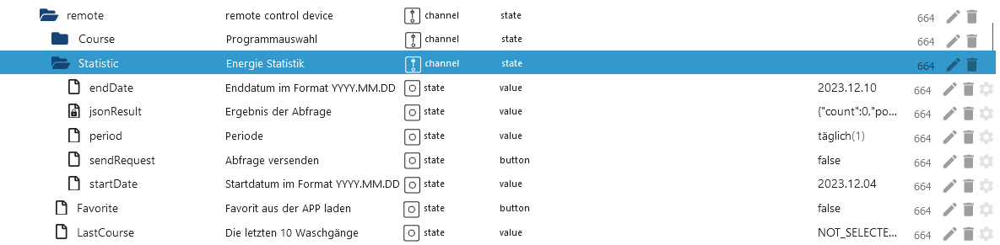

```json
{
    "count": 0,
    "power": 0,
    "energyWater": 0,
    "energyDetergent": 0,
    "energySoftener": 0,
    "powerWh": 0,
    "periodicEnergyData": 0,
    "item": [
        {
            "usedDate": "2023-12-04",
            "count": 0,
            "power": 0,
            "energyWater": 0,
            "energyDetergent": 0,
            "energySoftener": 0,
            "powerWh": 0,
            "periodicEnergyData": 0
        },
        {
            "usedDate": "2023-12-05",
            "count": 0,
            "power": 0,
            "energyWater": 0,
            "energyDetergent": 0,
            "energySoftener": 0,
            "powerWh": 0,
            "periodicEnergyData": 0
        },
        {
            "usedDate": "2023-12-06",
            "count": 2,
            "power": 2,
            "energyWater": 0,
            "energyDetergent": 0,
            "energySoftener": 0,
            "powerWh": 0,
            "periodicEnergyData": 2
        },
        {
            "usedDate": "2023-12-07",
            "count": 2,
            "power": 2,
            "energyWater": 0,
            "energyDetergent": 0,
            "energySoftener": 0,
            "powerWh": 0,
            "periodicEnergyData": 2
        },
        {
            "usedDate": "2023-12-08",
            "count": 5,
            "power": 5,
            "energyWater": 0,
            "energyDetergent": 0,
            "energySoftener": 0,
            "powerWh": 0,
            "periodicEnergyData": 5
        },
        {
            "usedDate": "2023-12-09",
            "count": 0,
            "power": 0,
            "energyWater": 0,
            "energyDetergent": 0,
            "energySoftener": 0,
            "powerWh": 0,
            "periodicEnergyData": 0
        },
        {
            "usedDate": "2023-12-10",
            "count": 0,
            "power": 0,
            "energyWater": 0,
            "energyDetergent": 0,
            "energySoftener": 0,
            "powerWh": 0,
            "periodicEnergyData": 0
        }
    ]
}
```

### 201 Remote Control thinq1 & thinq2

[Zusammenfassung](#zusammenfassung)

- `remote.Favorite` Funktioniert nur wenn ein Favorit in der APP ausgewählt wurde und wenn die Maschine eingeschaltet ist.
- `remote.LastCourse` Die letzte 10 Programme auswählbar.
- `remote.WMDownload_Select` Auswahl aller verfügbaren Programme (STD=Standard/DL=Downloadprogramme)
  Wenn einer der 3 Datenpunkte gefüllt wird, wird das ausgewählt Programm in den Ordner Course geschrieben. Hier könnt ihr dann noch Anpassungen vornehmen. Es können aber nicht alle Datenpunkte im Ordner `Course` geändert werden. Bitte selber testen welche Daten die Waschmaschine akzeptiert.
- `remote.WMDownload` Durch drücken wird das Programm im Ordner `Course` auf die Waschmaschine übertragen und im Display angezeigt (Waschmaschine muss an sein).
- `remote.WMStart` Waschmaschine starten
- `remote.WMStop` Waschvorgang stoppen
- `remote.WMWakeup` Waschmaschine aufwecken

    
    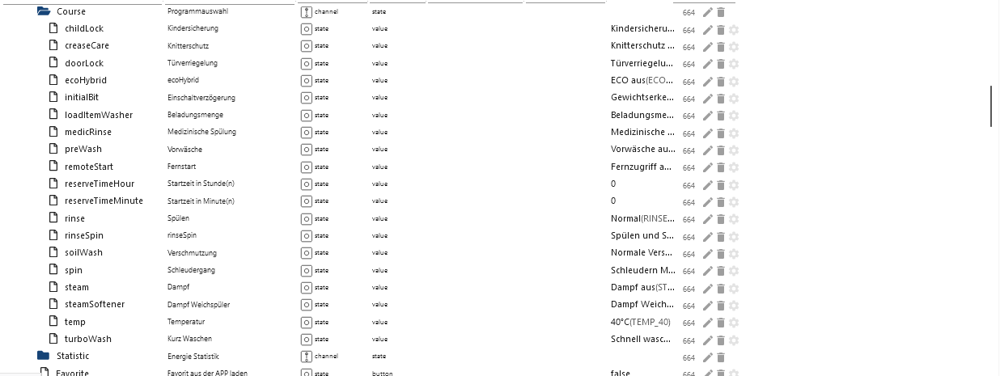

### 201 Snapshot thinq1 & thinq2

[Zusammenfassung](#zusammenfassung)


### Gerät 202 Trockner thinq1 & thinq2

[Zusammenfassung](#zusammenfassung)

### 202 Alle Ordner thinq1 & thinq2


### 202 Remote Ordner thinq1 & thinq2

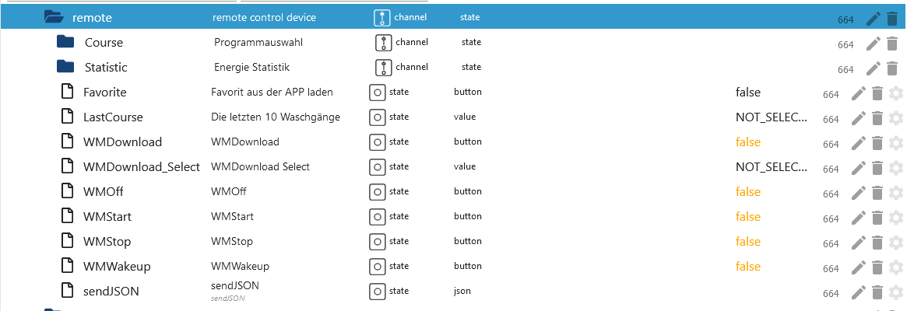

### 202 Remote Statistik thinq2

[Zusammenfassung](#zusammenfassung)

- hourly
- `remote.Statistic.endDate` Datum eintragen bei hourly muss end und start gleich sein Format: 2023.12.01
- `remote.Statistic.startDate` Datum eintragen bei hourly muss end und start gleich sein Format: 2023.12.01
- ODER daily
- `remote.Statistic.endDate` Datum eintragen daily - Format: 2023.12.06
- `remote.Statistic.startDate` Datum eintragen daily - Format: 2023.12.01
- ODER monthly
- `remote.Statistic.endDate` Datum eintragen monthly - Format: 2023.12.01
- `remote.Statistic.startDate` Datum eintragen monthly - Format: 2023.10.01
- `remote.Statistic.period` Welche Periode
- `remote.Statistic.sendRequest` Auswahl senden
- `remote.Statistic.jsonResult` Statistik als JSON. Sind die Attribute leer dann unterstützt euer Geräte diese nicht oder es wurde ein falsches Datum angegeben.

    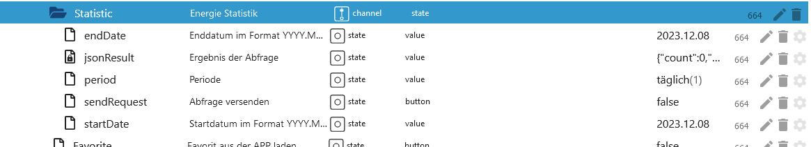

```json
{
    "count": 0,
    "power": 0,
    "energyWater": 0,
    "energyDetergent": 0,
    "energySoftener": 0,
    "powerWh": 0,
    "periodicEnergyData": 0,
    "item": [
        {
            "usedDate": "2023-12-08",
            "count": 5,
            "power": 2587, // 2587 / 1000 kwh
            "energyWater": 0,
            "energyDetergent": 0,
            "energySoftener": 0,
            "powerWh": 0,
            "periodicEnergyData": 2587
        }
    ]
}
```

### 202 Remote Control thinq1 & thinq2

[Zusammenfassung](#zusammenfassung)

- `remote.Favorite` Funktioniert nur wenn ein Favorit in der APP ausgewählt wurde und wenn die Maschine eingeschaltet ist.
- `remote.LastCourse` Die letzte 10 Programme auswählbar.
- `remote.WMDownload_Select` Auswahl aller verfügbaren Programme (STD=Standard/DL=Downloadprogramme)
  Wenn einer der 3 Datenpunkte gefüllt wird, wird das ausgewählt Programm in den Ordner Course geschrieben. Hier könnt ihr dann noch Anpassungen vornehmen. Es können aber nicht alle Datenpunkte im Ordner `Course` geändert werden. Bitte selber testen welche Daten der Trockner akzeptiert.
- `remote.WMDownload` Keine Funktion
- `remote.WMStart` Durch drücken wird das Programm im Ordner `Course` auf den Trockner übertragen und im Display angezeigt (Trockner muss an sein).
- `remote.WMStop` Trocknervorgang stoppen
- `remote.WMWakeup` Trockner aufwecken

    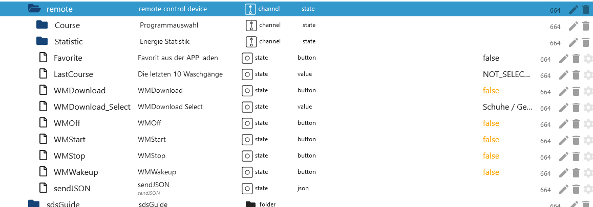
    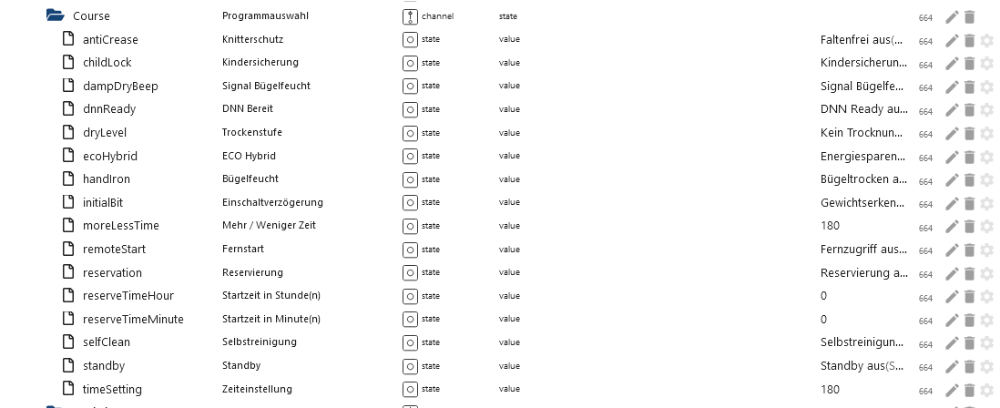

### 202 Snapshot thinq1 & thinq2

[Zusammenfassung](#zusammenfassung)


### Gerät 401 Klimanalage thinq2

[Zusammenfassung](#zusammenfassung)

### 401 Alle Ordner thinq2


### 401 Remote Ordner thinq2

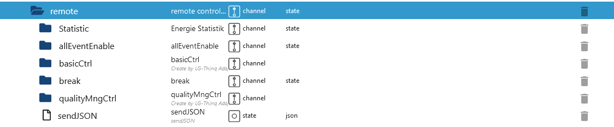

### 401 Remote Statistik thinq2

[Zusammenfassung](#zusammenfassung)

- `remote.Statistic.command` Welche History soll geladen werden
- hourly
- `remote.Statistic.endDate` Datum eintragen bei hourly muss end und start gleich sein Format: 2023.12.01
- `remote.Statistic.startDate` Datum eintragen bei hourly muss end und start gleich sein Format: 2023.12.01
- ODER daily
- `remote.Statistic.endDate` Datum eintragen daily - Format: 2023.12.06
- `remote.Statistic.startDate` Datum eintragen daily - Format: 2023.12.01
- ODER monthly
- `remote.Statistic.endDate` Datum eintragen monthly - Format: 2023.12.01
- `remote.Statistic.startDate` Datum eintragen monthly - Format: 2023.10.01
- `remote.Statistic.period` Welche Periode
- `remote.Statistic.sendRequest` Auswahl senden
- `remote.Statistic.jsonResult` Statistik als JSON. Sind die Attribute leer dann unterstützt euer Geräte diese nicht oder es wurde ein falsches Datum angegeben.

    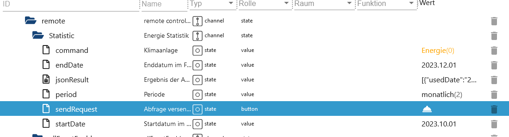

```json
[
    {
        "usedDate": "2023-04",
        "energyData": "0",
        "operationTime": "0"
    },
    {
        "usedDate": "2023-05",
        "energyData": "0",
        "operationTime": "0"
    },
    {
        "usedDate": "2023-06",
        "energyData": "3800",
        "operationTime": "13873"
    }
]
```

### 401 Remote Control thinq2

[Zusammenfassung](#zusammenfassung)

- `remote.basicCtrl.operation` 0 für Aus und 1 für Ein
- `remote.basicCtrl.opMode` 0 für Aus und 4 für Ein
- `remote.basicCtrl.hotWater` 0 für Aus und 1 für Ein
- `remote.basicCtrl.hotWaterTarget` gewünschte Temperatur
- `remote.basicCtrl.powerHotWater` Boost 0 für Aus und 1 für Ein
- `remote.basicCtrl.target` gewünschte Temperatur

- Kommt im Log die Fehlermeldung 400, dann ist dieser Datenpunkt nicht für das Geräte kompatibel.

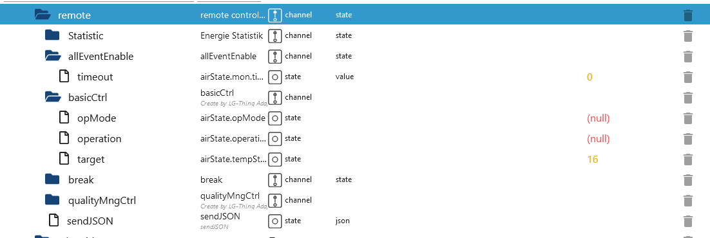
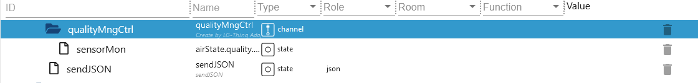

### 401 Remote Holiday thinq2

[Zusammenfassung](#zusammenfassung)

- `remote.break.holiday_silent_update` Hiermit muss immer erst die aktuellen Daten von der Cloud geladen werden
- `remote.break.holiday_silent_data` Aktueller Zeitplan von der Cloud.
- `remote.break.holiday_startdate` Hier das Startdatum für den Urlaubsmodus eintragen. Das Datum darf nicht in der Vergangenheit liegen (Format DD.MM.YY HH:MM)
- `remote.break.holiday_enddate` Hier das Enddatum für den Urlaubsmodus eintragen. Das Datum darf nicht in der Vergangenheit liegen und muss größer sein als das Startdatum (Format DD.MM.YY HH:MM)
- `remote.break.holiday_heating` Heizen An/Aus (wie in der APP)
- `remote.break.holiday_water` Warmwasser An/Aus (wie in der APP)
- `remote.break.holiday_onoff` Erst die o. g. Datenpunkte füllen und dann hier den Urlaubsmodus aktivieren/deaktivieren
- `remote.break.silent_mode_starttime` Hier die Startzeit für den geräuscharmen Modus eintragen (Format HH:MM)
- `remote.break.silent_mode_endtime` Hier die Endzeit für den geräuscharmen Modus eintragen. Sollte natürlich größer als das Startdatum sein. (Format HH:MM)
- `remote.break.silent_mode_onoff` Geräuscharmen Modus aktivieren/deaktivieren
- `remote.break.holiday_sendJSON` Nur für Experten gedacht. Der JSON hat einen Array der aus JSON Type 1, 2 und 3 besteht. 1 steht für die Laufzeiten, die 2 für den Urlaubsmodus und Type 3 für den geräuscharmen Modus. Man könnte nun bei Type 1 weitere JSON`s anhängen und damit generiert man mehr Schaltzeiten.

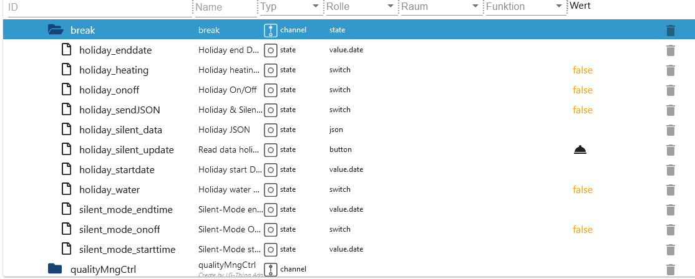

### 401 Snapshot thinq2

[Zusammenfassung](#zusammenfassung)


### Gerät 401 Klimanalage thinq1

[Zusammenfassung](#zusammenfassung)

### 401 Remote Statistik thinq1

[Zusammenfassung](#zusammenfassung)

- hourly
- `remote.Statistic.endDate` Datum eintragen bei hourly muss end und start gleich sein Format: 2023.12.01
- `remote.Statistic.startDate` Datum eintragen bei hourly muss end und start gleich sein Format: 2023.12.01
- ODER daily
- `remote.Statistic.endDate` Datum eintragen daily - Format: 2023.12.06
- `remote.Statistic.startDate` Datum eintragen daily - Format: 2023.12.01
- ODER monthly
- `remote.Statistic.endDate` Datum eintragen monthly - Format: 2023.12.01
- `remote.Statistic.startDate` Datum eintragen monthly - Format: 2023.10.01
- `remote.Statistic.period` Welche Periode
- `remote.Statistic.sendRequest` Auswahl senden
- `remote.Statistic.jsonResult` Statistik als JSON. Sind die Attribute leer dann unterstützt euer Geräte diese nicht oder es wurde ein falsches Datum angegeben.
- `remote.Statistic.ownrequest` Eigene Abfrage von Daten. Die Datei aus dem Link `modelJsonUri` öffnen und cmd, cmdOpt und value übernehmen.
- `remote.Statistic.ownresponse` Ergebnis von `remote.Statistic.ownrequest`

    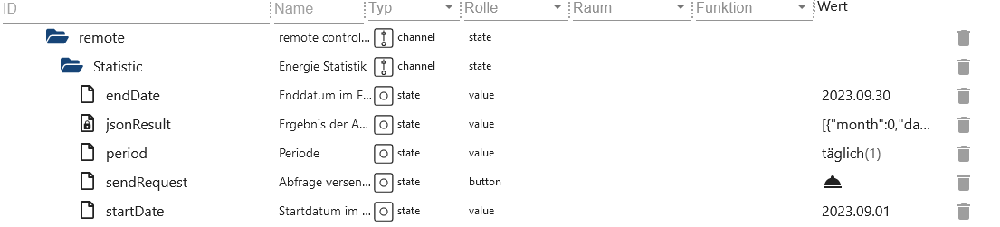

```json
[
    {
        "month": 0,
        "day": "03",
        "hour": 0,
        "min": "16",
        "kwh": 0.1
    },
    {
        "month": 0,
        "day": "04",
        "hour": 0,
        "min": "59",
        "kwh": 0.2
    },
    {
        "month": 0,
        "day": "06",
        "hour": 0,
        "min": "15",
        "kwh": 0.1
    },
    {
        "month": 0,
        "day": "07",
        "hour": 0,
        "min": "40",
        "kwh": 0.1
    },
    {
        "month": 0,
        "day": "09",
        "hour": 0,
        "min": "35",
        "kwh": 0.2
    },
    {
        "month": 0,
        "day": "10",
        "hour": 0,
        "min": "60",
        "kwh": 0.2
    },
    {
        "month": 0,
        "day": "11",
        "hour": 0,
        "min": "60",
        "kwh": 0.2
    },
    {
        "month": 0,
        "day": "12",
        "hour": 0,
        "min": "90",
        "kwh": 0.3
    }
]
```

# ownrequest JSON

```json
{
    "method": "POST", // POST oder GET Axios Request
    "url": "rti/rtiControl", // URL
    "data": {
        "lgedmRoot": {
            "deviceId": null, // Adapter ersetzt null
            "workId": null, // Adapter ersetzt null
            "cmd": "Config", // Änderung möglich
            "cmdOpt": "Get", // Änderung möglich
            "value": "InOutInstantPower", // Änderung möglich
            "isControlFree": "Y" // NICHT ändern
        }
    }
}
```

### 401 Remote Control thinq1


[Zusammenfassung](#zusammenfassung)

Welche Datenpunkte zu set... Datenpunkte gehören steht im Namen vom Datenpunkt.
lg-thinq.0.xxx.remote.SetWDirLeftRight -> {"`WDirLeftRight`":"{{WDirLeftRight}}","`WDirUpDown`":"0"}

- Beispiel einschalten:
- `remote.settings.Operation` auf 1 setzen
- `remote.SetOperation` danach diesen Datenpunkt auf true setzen

- Beispiel ausschalten:
- `remote.settings.Operation` auf 0 setzen
- `remote.SetOperation` danach diesen Datenpunkt auf true setzen

- Beispiel Temperatur ändern:
- `remote.settings.TempCfg` Temperatur eintragen
- `remote.SetTempCfg` danach diesen Datenpunkt auf true setzen

- Andere Beispiel:
- `remote.settings.WDirUpDown` auf 0 setzen
- `remote.settings.WDirLeftRight` 0 oder 1
- `remote.SetWDirLeftRight` danach diesen Datenpunkt auf true setzen

    

### 401 Snapshot thinq1

[Zusammenfassung](#zusammenfassung)


### Gerät 406 Wärmepumpe thinq2

[Zusammenfassung](#zusammenfassung)

### 406 Alle Ordner thinq2


### 406 Remote Ordner thinq2


### 406 Remote Statistik thinq2

[Zusammenfassung](#zusammenfassung)

- hourly
- `remote.Statistic.command` Welche History soll geladen werden (Pollution JSON ist ein leer)
- `remote.Statistic.endDate` Datum eintragen bei hourly muss end und start gleich sein Format: 2023.12.01
- `remote.Statistic.startDate` Datum eintragen bei hourly muss end und start gleich sein Format: 2023.12.01
- ODER daily
- `remote.Statistic.endDate` Datum eintragen daily - Format: 2023.12.06
- `remote.Statistic.startDate` Datum eintragen daily - Format: 2023.12.01
- ODER monthly
- `remote.Statistic.endDate` Datum eintragen monthly - Format: 2023.12.01
- `remote.Statistic.startDate` Datum eintragen monthly - Format: 2023.10.01
- `remote.Statistic.period` Welche Periode
- `remote.Statistic.sendRequest` Auswahl senden
- `remote.Statistic.jsonResult` Statistik als JSON. Sind die Attribute leer dann unterstützt euer Geräte diese nicht oder es wurde ein falsches Datum angegeben.

    

### 406 Remote basicCtrl thinq2

[Zusammenfassung](#zusammenfassung)

- `remote.basicCtrl.hotWaterTarget` Temperatur einstellen
- `remote.basicCtrl.opMode` Modus einstellen

    

### 406 Remote reservationCtrl thinq2

[Zusammenfassung](#zusammenfassung)

- `remote.reservationCtrl.add_new_schedule` Einen neuen Zeitplan anlegen. Es werden dann 3 neue Datenpunkte erstellt die ausgefüllt werden müssen. Danach `send_new_schedule` drücken um den neuen Slot zu speichern. Wird nicht gesendet, dann werden diese neuen Datenpunkte nach einem Restart gelöscht.
- `remote.reservationCtrl.del_new_schedule` Einen Slot wieder löschen. Auch danach wieder `send_new_schedule` drücken damit die Daten gespeichert werden.
- `remote.reservationCtrl.send_new_schedule` Drücken um Änderungen zu speichern.
- `remote.reservationCtrl.01_end Enddatum` z. Bsp 22:30.
- `remote.reservationCtrl.01_start Startdatum` z. Bsp 21:30.
- `remote.reservationCtrl.01_state` Aktivieren/Deaktivieren

    

### 406 Snapshot thinq2

[Zusammenfassung](#zusammenfassung)


### Wetter

[Zusammenfassung](#zusammenfassung)

lg-thinq.0.xxx.area muss gefüllt sein!

- `weather.device` Area auswählen. Haben alle Geräte die gleiche Area wird nur ein Gerät angezeigt.
- `weather.humidity` Luftfeuchtigkeit
- `weather.temperature` Temperatur
- `weather.unit` Auswahl Celsius oder Fahrenheit
- `weather.update` Send request to LG (device and unit must be filled!)

    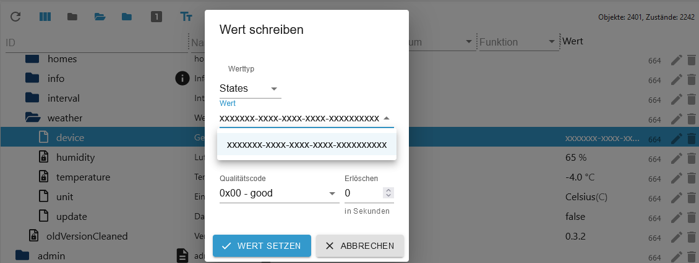

## Changelog
### 1.1.3 (2025-10-03)

- (Lucky-ESA) Added translate for device 201
- (Lucky-ESA) Delete APP-Login (removed by LG)
- (Lucky-ESA) Added online icon
- (Lucky-ESA) Microwave 302 disabled (thinq1)

### 1.1.2 (2025-08-18)

- (Lucky-ESA) Delete expires check

### 1.1.1 (2025-08-16)

- (Lucky-ESA) Dependencies updated
- (Lucky-ESA) Node 20.x required
- (Lucky-ESA) Admin 7.6.17 required

### 1.1.0 (2025-04-08)

- (Lucky-ESA) max target changed from 30 to 40 degrees
- (Lucky-ESA) Dependencies updated
- (Lucky-ESA) Admin 7.4.10 required

### 1.0.7 (2024-12-08)

- (Lucky-ESA) Fixed: Connection status does not turn green
- (Lucky-ESA) Changed: Checkbox to dropdown for login procedure

## License

MIT License

Copyright (c) 2021-2025 TA2k <tombox2020@gmail.com>

Permission is hereby granted, free of charge, to any person obtaining a copy
of this software and associated documentation files (the "Software"), to deal
in the Software without restriction, including without limitation the rights
to use, copy, modify, merge, publish, distribute, sublicense, and/or sell
copies of the Software, and to permit persons to whom the Software is
furnished to do so, subject to the following conditions:

The above copyright notice and this permission notice shall be included in all
copies or substantial portions of the Software.

THE SOFTWARE IS PROVIDED "AS IS", WITHOUT WARRANTY OF ANY KIND, EXPRESS OR
IMPLIED, INCLUDING BUT NOT LIMITED TO THE WARRANTIES OF MERCHANTABILITY,
FITNESS FOR A PARTICULAR PURPOSE AND NONINFRINGEMENT. IN NO EVENT SHALL THE
AUTHORS OR COPYRIGHT HOLDERS BE LIABLE FOR ANY CLAIM, DAMAGES OR OTHER
LIABILITY, WHETHER IN AN ACTION OF CONTRACT, TORT OR OTHERWISE, ARISING FROM,
OUT OF OR IN CONNECTION WITH THE SOFTWARE OR THE USE OR OTHER DEALINGS IN THE
SOFTWARE.