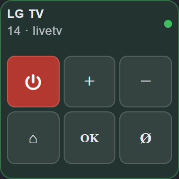

# IoBroker.lgtv
**Tests:** 

LG WebOS SmartTV-Adapter für ioBroker

Fernsteuerung eines LG WebOS SmartTV (Modelle ab 2013) von [ioBroker](https://www.iobroker.net) aus.

---

## Verwendung:
Installieren Sie den Adapter über die ioBroker-Administrationsoberfläche.
Geben Sie in der Adapterkonfiguration die IP-Adresse Ihres LG WebOS-Fernsehers ein.
Beim ersten Verbindungsaufbau erscheint eine Kopplungsaufforderung auf Ihrem Fernsehbildschirm. Erlauben Sie die Verbindung.

### Umfrage
Manche Fernseher trennen die Verbindung zum WebSocket, wenn sie ausgeschaltet werden, und melden dies nicht korrekt an den Adapter. In diesem Fall ist eine zusätzliche Abfrage erforderlich. Das Abfrageintervall kann in den Einstellungen festgelegt werden. Ist kein Wert angegeben, versucht der Adapter, dies automatisch zu erkennen: Nach einem Neustart des Adapters ist die Abfrage (alle 60 Sekunden) aktiv, bis das erste korrekte Ausschalten des Fernsehers erkannt wird.

## Einige Beispiele:
`setState('lgtv.0.states.popup', 'Some text!');`

Auf dem Fernseher wird ein Popup mit dem Text „Etwas Text!“ angezeigt.
Sie können im Text HTML-Zeilenumbrüche (br) verwenden.

`setState('lgtv.0.states.turnOff', true);`

Den Fernseher ausschalten.

`setState('lgtv.0.states.mute', true);`

Schalten Sie den Fernseher stumm.

`setState('lgtv.0.states.mute', false);`

Schalten Sie den Fernseher stumm.

`setState('lgtv.0.states.volumeUp', true);`

Dadurch wird die Lautstärke des Fernsehers erhöht.

`setState('lgtv.0.states.volumeDown', true);`

Die Lautstärke des Fernsehers verringern.

`setState('lgtv.0.states.channelUp', true);`

Erweiterung des aktuellen Fernsehkanals.

`setState('lgtv.0.states.channelDown', true);`

Reduzierung der Anzahl der aktuellen Fernsehkanäle.

`setState('lgtv.0.states.3Dmode', true);`

Aktiviert den 3D-Modus am Fernseher

`setState('lgtv.0.states.3Dmode', false);`

Deaktiviert den 3D-Modus am Fernseher.

`setState('lgtv.0.states.channel', 7);`

Umschalten des Live-Fernsehers auf Kanal Nummer 7.

`setState('lgtv.0.states.launch', 'livetv');`

Wechsel in den Live-TV-Modus.

`setState('lgtv.0.states.launch', 'smartshare');`

Öffnen der SmartShare-App auf dem Fernseher.

`setState('lgtv.0.states.launch', 'tvuserguide');`

Startet die TV-Benutzerhandbuch-App auf dem Fernseher.

`setState('lgtv.0.states.launch', 'netflix');`

Öffnen der Netflix-App auf dem Fernseher.

`setState('lgtv.0.states.launch', 'youtube');`

Öffnet die YouTube-App auf dem Fernseher.

`setState('lgtv.0.states.launch', 'prime');`

Öffnet die Amazon Prime App auf dem Fernseher.

`setState('lgtv.0.states.launch', 'amazon');`

Bei einigen Fernsehern öffnet dieser Befehl die Amazon Prime App.

`setState('lgtv.0.states.openURL', 'http://www.iobroker.net');`

Öffnet den Webbrowser auf dem Fernseher und navigiert zu www.iobroker.net.
Kann auch zum Öffnen von Bildern oder Videos (im Browser) verwendet werden.

`setState('lgtv.0.states.input', 'av1');`

Schaltet den Eingang am Fernseher auf AV1.

`setState('lgtv.0.states.input', 'scart');`

Schaltet den Eingang am Fernseher auf Scart um.

`setState('lgtv.0.states.input', 'component');`

Schaltet den Eingang des Fernsehers auf Komponenteneingang um.

`setState('lgtv.0.states.input', 'hdmi1');`

Schaltet den Eingang des Fernsehers auf HDMI 1 um.

`setState('lgtv.0.states.input', 'hdmi2');`

Schaltet den Eingang des Fernsehers auf HDMI 2 um.

`setState('lgtv.0.states.input', 'hdmi3');`

Schaltet den Eingang des Fernsehers auf HDMI 3 um.

`setState('lgtv.0.states.youtube', 'https://www.youtube.com/watch?v=AjSpMQfRmEo'); OR setState('lgtv.0.states.youtube', 'AjSpMQfRmEo');`

Spiele ein YouTube-Video ab.

`setState('lgtv.0.states.raw', '{"url": "ssap://system.launcher/launch", "cmd": "{id: 'netflix'}" }');` `setState('lgtv.0.states.raw', '{"url": "ssap://api/getServiceList", "cmd": ""}');`

API zum Senden und Empfangen von RAW-Befehlen.

`setState('lgtv.0.remote.*KEY*', true);`

Senden Sie die Fernbedienungstaste an den Fernseher.

`setState('lgtv.0.states.power', true/false);`

Fernseher ausschalten und Fernseher einschalten (Einschalten funktioniert nur im LAN, mit WOL).

`setState('lgtv.0.states.soundOutput', 'external_arc');`

Audioausgabe über ARC (HDMI) umschalten.

---

## Staaten
`channel`

hält den aktuellen Kanal

`volume`

speichert den aktuellen Lautstärkepegel und kann die Lautstärke ändern

`on`

Der Wert ist wahr, wenn der Fernseher eingeschaltet ist, und falsch, wenn er ausgeschaltet ist. Er richtet sich nach dem vom Fernseher gemeldeten Energiestatus (`states.powerState`): `on`, `screen_off` und `screen_saver` gelten als eingeschaltet, `standby` (der Schnellstart-Standby-Modus, in dem die Netzwerkverbindung des Fernsehers für eine gewisse Zeit aufrechterhalten wird) und `off` als ausgeschaltet. Fernseher ohne diesen Endpunkt (webOS 3 und älter) gelten als eingeschaltet, solange eine App im Vordergrund ausgeführt wird.

`powerState`

Der vom Fernseher gemeldete Energiezustand wird `on`, `screen_off`, `screen_saver`, `standby` oder `off` zugeordnet (der Fernseher selbst meldet `Active`, `Screen Off`, `Screen Saver`, `Active Standby` und `Suspend`/`Power Off`).

---

## Fernbedienungs-Widget für `ioBroker.devices`
Der Adapter enthält ein **TV-Steuerungs-Widget** für den `devices`-Adapter. Fügen Sie es über *Widget hinzufügen → TV-Steuerung* hinzu, wählen Sie die LGTV-Instanz aus, und das Widget steuert direkt die `remote.*`-Zustände dieser Instanz. Die Statuszeile zeigt die aktuelle Lautstärke, den Stummschaltungsstatus und die laufende App an; der Punkt in der Ecke repräsentiert `states.on`.

Der Netzschalter folgt `remote.power`: Er sendet die POWER-Taste, wenn der Fernseher eingeschaltet ist, und ein Wake-on-LAN-Paket, wenn er ausgeschaltet ist.

| Kompakt (1x1) | Breit (2x0,5) | Vollfernbedienung (2x1 / 2x2) |
|--------------------------------------------|--------------------------------------|---------------------------------------------|
|  |  | ](../../../en/adapterref/iobroker.lgtv/docs/widget-full.png) |

Die Kanaltasten, Medientasten, Farbtasten und der Ziffernblock können jeweils in den Widget-Einstellungen deaktiviert werden.

## Fernsteuerung im Adminbereich
Die Instanzeinstellungen haben zwei Registerkarten. **Einstellungen** enthält die Konfiguration; **Fernbedienung** ist eine vollständige Fernbedienung für den Fernseher, sodass dieser direkt vom Administrator aus ohne Skript oder eine `devices`-Ansicht bedient werden kann.

Es schreibt dieselben `remote.*`-Zustände wie das obige Widget und zeigt den Betriebszustand des Fernsehers, die laufende App, den aktuellen Eingang und die Lautstärke an, die sich auch verschieben lassen. Die Tasten reagieren sofort - es handelt sich um Zustandsänderungen, nicht um Einstellungen, daher hat die Schaltfläche „Speichern“ im Dialogfeld nichts damit zu tun.

Die Instanz muss ausgeführt werden: Solange sie gestoppt ist, sind die Tasten deaktiviert und die Registerkarte zeigt dies an.

---
---

## Installation
Installieren Sie diesen Adapter mithilfe der ioBroker-Repositories.

>[!NOTE] > Dieser Adapter unterstützt keine Installation von GitHub.

## Changelog

<!--
    Placeholder for the next version (at the beginning of the line):
    ### **WORK IN PROGRESS**
-->
### 3.0.4 (2026-09-07)
- (GermanBluefox) The instance settings have a second tab with a remote control, so the TV can be operated directly from the admin
- (krobipd) `states.scroll` and `states.drag` no longer ignore a movement whose horizontal or vertical part is zero, so plain vertical scrolling (`0,5`) works
- (krobipd) The configuration dialog is fully translated in all eleven languages; the minimum-value hints no longer show up as untranslated raw text
- (krobipd) The adapter no longer creates files in the home directory of the ioBroker user; the client key, the MAC cache and the certificate file all stay in the adapter's data directory
- (krobipd) Two volume changes in quick succession no longer fight over the TV, and an unreadable volume from the TV no longer disables the stepped volume ramp
- (krobipd) Stopping the adapter while the TV was connected no longer logs "setTimeout called, but adapter is shutting down"
- (krobipd) A stopped or crashed instance no longer keeps reporting `info.connection` as connected
- (krobipd) The TV is no longer reported as switched off while it is actually running
- (krobipd) The new state `states.powerState` shows the power state the TV reports itself
- (krobipd) Switching the TV off and on repeatedly no longer piles up connection checks

### 3.0.3 (2026-09-05)
- (GermanBluefox) The WebOS 26 pairing fallback now also asks for the pointer permissions, so the remote buttons, pointer moves, scrolling and clicks work after a fresh pairing
- (GermanBluefox) Older TVs get the signed pairing manifest again; the unsigned manifest is only used after the TV rejected the signed one (ported from lgtv2 2.0.1)
- (GermanBluefox) Adopted the upstream `lgtv2` test suite for the vendored transport

### 3.0.2 (2026-09-05)
- (GermanBluefox) The `lgtv2` library was ported to TypeScript and is now built into the adapter, so the ESM-only npm package is no longer required

### 3.0.1 (2026-09-04)
- (GermanBluefox) Removed a prepare script

### 3.0.0 (2026-09-04)
- (Voodoo2man) Add WebOS 26 compatibility.
- (Voodoo2man) Use the configured MAC address as a fallback for Wake-on-LAN.
- (GermanBluefox) A malformed MAC address or a Wake-on-LAN socket error does not terminate the adapter anymore
- (GermanBluefox) The MAC address is validated in the admin configuration
- (GermanBluefox) Added the missing default value for the `wolwithip` setting
- (GermanBluefox) `remote.power` switches the TV off again instead of only sending Wake-on-LAN
- (GermanBluefox) Migrated the connection options from the deprecated `wsconfig` block to the lgtv2 v2 option names
- (GermanBluefox) Removed the process wide TLS bypass, the certificate check is now relaxed per connection only
- (GermanBluefox) Removed the unused `websocket` dependency
- (GermanBluefox) The adapter was refactored to TypeScript. The sources moved to `src/`, the published code is the compiled `build/`
- (GermanBluefox) The admin translations moved from `admin/i18n/<lang>/translations.json` to the flat `admin/i18n/<lang>.json`
- (GermanBluefox) The unit tests use `node:assert` instead of `chai`
- (GermanBluefox) Added a "Control TV" remote-control widget for the `ioBroker.devices` adapter

[Older changelogs can be found there](CHANGELOG_OLD.md)

## License

MIT License

Copyright (c) 2024-2026 iobroker-community-adapters <iobroker-community-adapters@gmx.de>  
Copyright (c) 2023 Sebastian Schultz.

Permission is hereby granted, free of charge, to any person obtaining a copy
of this software and associated documentation files (the "Software"), to deal
in the Software without restriction, including without limitation the rights
to use, copy, modify, merge, publish, distribute, sublicense, and/or sell
copies of the Software, and to permit persons to whom the Software is
furnished to do so, subject to the following conditions:

The above copyright notice and this permission notice shall be included in
all copies or substantial portions of the Software.

THE SOFTWARE IS PROVIDED "AS IS", WITHOUT WARRANTY OF ANY KIND, EXPRESS OR
IMPLIED, INCLUDING BUT NOT LIMITED TO THE WARRANTIES OF MERCHANTABILITY,
FITNESS FOR A PARTICULAR PURPOSE AND NONINFRINGEMENT. IN NO EVENT SHALL THE
AUTHORS OR COPYRIGHT HOLDERS BE LIABLE FOR ANY CLAIM, DAMAGES OR OTHER
LIABILITY, WHETHER IN AN ACTION OF CONTRACT, TORT OR OTHERWISE, ARISING FROM,
OUT OF OR IN CONNECTION WITH THE SOFTWARE OR THE USE OR OTHER DEALINGS IN
THE SOFTWARE.