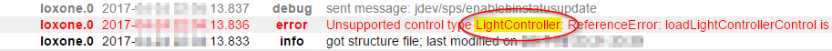

#ioBroker.loxone

**Tests:** 

##loxone-Adapter für ioBroker
**_Dieser Adapter benötigt mindestens nodejs 10.x!_**

Holt alle im Loxone Miniserver (und Loxone Miniserver Go) verfügbaren Informationen und stellt Änderungen in Echtzeit bereit.

**Dieser Adapter verwendet Sentry-Bibliotheken, um den Entwicklern automatisch Ausnahmen und Codefehler zu melden.** Weitere Details und Informationen zum Deaktivieren der Fehlerberichterstattung finden Sie unter [Dokumentation zum Sentry-Plugin](https://github.com/ioBroker/plugin-sentry#plugin-sentry)! Sentry Reporting wird ab js-controller 3.0 verwendet.

## Installieren
Installieren Sie diesen Adapter über ioBroker Admin:

1. Instanzkonfigurationsdialog öffnen
2. Geben Sie die IP-Adresse oder den Hostnamen und den HTTP-Port (standardmäßig 80) Ihres Loxone Miniservers ein
3. Legen Sie im Loxone Miniserver (mit der Anwendung Loxone Config) einen neuen Benutzer an, dem Sie nur Lese- und Schreibrechte auf alle benötigten Variablen geben.
4. Geben Sie den Namen dieses Benutzers und sein Passwort im Konfigurationsdialog ein
5. Speichern Sie die Konfiguration
6. Starten Sie den Adapter

## Aufbau
### Miniserver-Hostname / IP
Dies ist die IP-Adresse oder der Hostname Ihres Loxone Miniservers oder Miniserver Go.

### Miniserver-Port
Dies ist der HTTP-Port Ihres Loxone Miniservers.

Standardmäßig ist der Miniserver so konfiguriert, dass er auf Port 80 lauscht, aber Sie haben ihn möglicherweise geändert.

### Miniserver-Benutzername
Geben Sie einen gültigen Benutzernamen ein, um auf den Loxone Miniserver zuzugreifen.

Aus Sicherheitsgründen wird dringend empfohlen, einen anderen Benutzer als "admin" zu verwenden.

Der Benutzer benötigt nur Lesezugriff auf die Variablen, die Sie von ioBroker verwenden möchten.

### Miniserver-Passwort
Geben Sie das Passwort für den angegebenen Benutzernamen ein (siehe oben).

### Namen synchronisieren
Dadurch werden Namen in ioBroker aktualisiert, wenn sie sich in der Loxone Konfiguration ändern.
Wenn dies deaktiviert ist, werden Namen nur synchronisiert, wenn ein Steuerelement zum ersten Mal erkannt wird.

### Räume synchronisieren
Dadurch wird die enum.rooms-Enumeration mit allen Räumen gefüllt, die vom Loxone Miniserver bereitgestellt werden, und alle Controls verknüpft.

### Funktionen synchronisieren
Dadurch wird die enum.functions-Enumeration mit allen vom Loxone Miniserver bereitgestellten Kategorien gefüllt und alle Controls verknüpft.

### Wetterserver
Wählen Sie aus, welche Wetterdaten Sie synchronisieren möchten:

- "Wetterdaten nicht synchronisieren" synchronisiert nichts mit dem Wetterserver Weather
- "Nur aktuelles Wetter synchronisieren" synchronisiert die Daten unter "Aktuell"
- "24 Stunden Wettervorhersage synchronisieren" synchronisiert das aktuelle Wetter und die 24 Stunden Wettervorhersage
- "Gesamte Wettervorhersage synchronisieren" synchronisiert das aktuelle Wetter und die gesamte Wettervorhersage (96 Stunden)

## Zustände
Der Adapter verbindet sich automatisch mit dem konfigurierten Loxone Miniserver und erstellt Zustände für jeden gefundenen Steuerungszustand.

Die IDs der Staaten sind wie folgt formatiert: `loxone.<instance>.<control>.<state>`

- `<instance>` ist der Instanzindex des ioBroker-Adapters (normalerweise "0")
- `<control>` ist die UUID des Steuerelements
- `<state>` ist der Status innerhalb des Steuerelements (weitere Informationen finden Sie unter [Unterstützte Steuerelementtypen](#supported-control-types)).

Der bei der Konfiguration einer Steuerung in Loxone Config angegebene Name wird nur als Anzeigename in ioBroker verwendet.
Dies liegt daran, dass ein Benutzer für mehrere Steuerelemente denselben Namen wählen kann.

Weitere Informationen zu Controls und deren Zuständen finden Sie auch in der Loxone API (insbesondere der Structure File): https://www.loxone.com/enen/kb/api/

## Sichtbarkeit kontrollieren
Standardmäßig versteckt Loxone Miniserver viele Bedienelemente (und damit deren Zustände) aus dem Webinterface.

Das heißt, sie sind auch vor diesem ioBroker-Adapter verborgen.

### Verwendung in der Benutzeroberfläche
Um sicherzustellen, dass alle Ihre Zustände ordnungsgemäß an ioBroker gemeldet werden, überprüfen Sie bitte, ob "Verwenden" im Abschnitt "Benutzeroberfläche" aktiviert ist:

### Diagnoseeingänge anzeigen
Um Diagnoseeingänge anzuzeigen (z. B. Batteriestatus von Air-Geräten), überprüfen Sie bitte, ob das Gerät "Diagnoseeingänge anzeigen" aktiviert hat:

## Globale Staaten
Die folgenden globalen Zustände werden derzeit von diesem Adapter bereitgestellt:

- `operatingMode`: die aktuelle Betriebsmodusnummer des Loxone Miniservers
- `operatingMode-text`: der aktuelle Betriebsmodus des Loxone Miniservers als Text
- `Sunrise`: die Anzahl der Minuten nach Mitternacht, wenn die Sonne heute aufgeht
- `Sonnenuntergang`: die Anzahl der Minuten nach Mitternacht, wenn die Sonne heute untergeht
- `Benachrichtigungen`: die Anzahl der Benachrichtigungen
- `Modifikationen`: die Anzahl der Modifikationen
- alle anderen globalen Zustände werden einfach als Texte gemeldet

## Unterstützte Steuerungstypen
Die folgenden Steuerungstypen werden derzeit von diesem Adapter unterstützt.

Hinter dem Namen des Staates sehen Sie den Typ des Staates:

- `(rw)`: lesbar und schreibbar: dieser Zustand kann von ioBroker geändert werden
- `(ro)`: schreibgeschützt: dieser Status kann nicht von ioBroker geändert werden
- `(wo)`: write-only: der Wert dieses Zustands wird von diesem Adapter nicht gemeldet, aber er kann geändert werden, was eine Aktion auf dem Loxone Miniserver auslöst

###AalSmartAlarm
Wird von AAL Smart Alarm Control bereitgestellt.

- `alarmLevel` (ro) die ID des aktuellen Alarmlevels
    - 0 = Kein Alarm
    - 1 = Sofortiger Alarm
    - 2 = Verzögerter Alarm
- `alarmCause` (ro) Eine Zeichenfolge, die die letzte Ursache für einen Alarm darstellt
- `isLocked` (ro) Reset aktiv, Eingaben werden ignoriert und somit keine Alarme ausgeführt
- `isLeaveActive` (ro) Eingang verlassen ist gesetzt, keine Alarme werden ausgeführt
- `disableEndTime` (ro) Endzeit für die Deaktivierung der Steuerung
- `bestätigen` (wo) Anstehenden Alarm bestätigen pending
- `disable` (wo) Deaktiviert die Steuerung für einen bestimmten Zeitraum, es werden keine Alarme ausgeführt. Wenn Sie ihn auf 0 setzen, wird der Smart Alarm wieder aktiviert
- `startDrill` (wo) Testalarm ausführen

###AalNotfall
Wird von AAL Smart Emergency Button Control bereitgestellt

- `status` (ro) die ID des aktuellen Status
    - 0 = läuft, normaler Betrieb, wartet auf Nottaste
    - 1 = Alarm ausgelöst
    - 2 = Reset-Eingang in Config bestätigt, Steuerung wird heruntergefahren
    - 3 = App hat die Steuerung vorübergehend deaktiviert
- `disableEndTime` (ro) Endzeit für die Deaktivierung der Steuerung
- `resetActive` (ro) Textzustand bei aktivem Reseteingang (wenn Steuerung im Reset ist)
- `trigger` (wo) einen Alarm aus der App auslösen
- `quit` (wo) einen aktiven Alarm beenden
- `disable` (wo) deaktiviert die Steuerung für die angegebene Zeit in Sekunden. Auf 0 setzen, um die Steuerung erneut zu starten, wenn sie deaktiviert ist

###Alarm
Wird von der Einbruchmeldezentrale bereitgestellt.

- `armed` (rw) boolescher Zustand (true / false) des Alarms; das Schreiben von `true` auf diesen Wert schaltet den Alarm sofort ein (ohne die vordefinierte Verzögerung)
- `nextLevel` (ro) die ID der nächsten Alarmstufe
    - 1 = Lautlos
    - 2 = Akustik
    - 3 = Optisch
    - 4 = Intern
    - 5 = Extern
    - 6 = Fernbedienung
- `nextLevelDelay` (ro) die Verzögerung des nächsten Levels in Sekunden
- `nextLevelDelayTotal` (ro) die Gesamtverzögerung des nächsten Levels in Sekunden
- `level` (ro) die ID des aktuellen Alarmlevels
    - 1 = Lautlos
    - 2 = Akustik
    - 3 = Optisch
    - 4 = Intern
    - 5 = Extern
    - 6 = Fernbedienung
- `startTime` (ro) der Zeitstempel, wann der Alarm gestartet wurde
- `armedDelay` (ro) die Verzögerung der Scharfschaltung der Alarmsteuerung
- `armedDelayTotal` (ro) die Gesamtverzögerung der Scharfschaltung der Alarmsteuerung
- `Sensoren` (ro) die Liste der Sensoren
- `disabledMove` (rw) die Bewegung ist deaktiviert (true) oder nicht (false)
- `delayedOn` (wo) das Schreiben eines beliebigen Werts in diesen Zustand aktiviert den Alarm mit der konfigurierten Verzögerung
- `quit` (wo) das Schreiben eines beliebigen Wertes in diesen Zustand quittiert den Alarm

### Zentraler Alarm
Wird von der zentralen Einbruchmeldeanlage bereitgestellt.

- `armed` (rw) boolescher Zustand (true / false) des Alarms; das Schreiben von `true` auf diesen Wert schaltet den Alarm sofort ein (ohne die vordefinierte Verzögerung)
- `delayedOn` (wo) das Schreiben eines beliebigen Werts in diesen Zustand aktiviert den Alarm mit der konfigurierten Verzögerung
- `quit` (wo) das Schreiben eines beliebigen Wertes in diesen Zustand quittiert den Alarm

### Wecker
Wird von der Weckersteuerung bereitgestellt.

- `isEnabled` (rw) boolescher Zustand (true / false) des Weckers
- `isAlarmActive` (ro) boolean (true / false) ob der Wecker gerade klingelt
- `confirmationNeeded` (ro) boolean (true / false) ob der Benutzer den Alarm bestätigen muss
- `ringingTime` (ro) Countdown in Sekunden, wie lange der Wecker klingelt, bis er wieder schlummert
- `ringDuration` (rw) Dauer in Sekunden der Wecker klingelt
- `prepareDuration` (rw) Vorbereitungszeit in Sekunden
- `snoozeTime` (ro) Sekunden bis das Schlummern endet
- `snoozeDuration` (rw) Dauer in Sekunden des Schlummerns
- `snooze` (wo) das Schreiben eines beliebigen Werts in diesen Zustand verstummt den aktuellen Alarm
- `dismiss` (wo) das Schreiben eines Wertes in diesen Zustand verwirft den aktuellen Alarm

###AudioZone
Wird von der Musikserverzone bereitgestellt.

- `serverState` (ro) Zustand des Musikservers:
    - -3 = unbekannte/ungültige Zone
    - -2 = nicht erreichbar
    - -1 = unbekannt
    - 0 = offline
    - 1 = Initialisieren (booten, versuchen, es zu erreichen)
    - 2 = online
- `playState` (rw) der Wiedergabestatus:
    - -1 = unbekannt (dieser Wert kann nicht eingestellt werden)
    - 0 = gestoppt (Einstellung dieses Wertes pausiert die Wiedergabe)
    - 1 = pausiert (Einstellung dieses Wertes pausiert die Wiedergabe)
    - 2 = Wiedergabe (Einstellen dieses Wertes startet/fortsetzt die Wiedergabe)
- `clientState` (ro) Zustand des Clients:
    - 0 = offline
    - 1 = Initialisieren (booten, versuchen, es zu erreichen)
    - 2 = online
- `power` (rw) ob die Client-Stromversorgung aktiv ist oder nicht
- `Lautstärke` (rw) aktuelle Lautstärke
- `maxVolume` (ro) Zonen kann eine maximale Lautstärke zugewiesen werden
- `Shuffle` (rw) ob Playlist Shuffle aktiviert ist oder nicht
- `sourceList` (ro) Liste mit allen Zonen-Favoriten
- `repeat` (rw) Wiederholungsmodus:
    - -1 = unbekannt
    - 0 = aus
    - 1 = alles wiederholen
    - 2 = -nicht verwendet-
    - 3 = aktuelles Element wiederholen
- `songName` (ro) Songname
- `duration` (ro) wie lang der gesamte Track ist, -1 falls nicht bekannt (Stream)
- `Fortschritt` (rw) aktuelle Position im Track
- `Album` (ro) Albumname
- `Künstler` (ro) Künstlername
- `Station` (ro) Stationsname
- `Genre` (ro) Genrename
- `Cover` (ro) Song-/Album-Coverbild-URL
- `source` (rw) aktuell ausgewählte Quellenkennung (siehe `sourceList` oben)
- `prev` (wo) das Schreiben eines beliebigen Werts in diesen Zustand geht zum vorherigen Track
- `next` (wo) das Schreiben eines beliebigen Werts in diesen Zustand geht zum nächsten Track

### Zentrales Audio
Wird vom zentralen Musikserver bereitgestellt.

- `control` (wo) setzt den Spielstatus aller Spieler (`true` = Play, `false` = Pause)

### Farbwähler
Dieses Gerät erscheint nur innerhalb eines LightControllers.

- `red` (rw) Rotwert des Farbwählers
- `grün` (rw) Grünwert des Farbwählers
- `blue` (rw) Blauwert des Farbwählers

Das Setzen eines oder mehrerer der oben genannten Zustände von ioBroker sendet erst nach ca. 100 ms einen Befehl an den Miniserver.
Dies soll verhindern, dass sich die Farbe bei einer einzelnen Benutzereingabe mehrmals ändert.

### Farbauswahl V2
Dieses Gerät erscheint nur in einem Light Controller V2 ab der Loxone Software Version 9 und höher.

- `red` (rw) Rotwert des Farbwählers
- `grün` (rw) Grünwert des Farbwählers
- `blue` (rw) Blauwert des Farbwählers

Das Setzen eines oder mehrerer der oben genannten Zustände von ioBroker sendet erst nach ca. 100 ms einen Befehl an den Miniserver.
Dies soll verhindern, dass sich die Farbe bei einer einzelnen Benutzereingabe mehrmals ändert.

### Daytimer / IRCDaytimer
Wird durch Timer/Zeitplan bereitgestellt.

- `mode` (ro) aktueller Betriebsmodus des Daytimers
- `mode-text` (ro) aktueller Betriebsmodusname des Daytimers
- `override` (ro) die verbleibende Zeit des Timers
- `value` (ro) aktueller Wert, `true` oder `false` für digital und ein Wert für analog
- `value-formatted` (ro) aktuell formatierter Wert als Text
- `needsActivation` (ro) nur verfügbar, wenn die Steuerung aktiviert werden muss
- `resetActive` (ro) bleibt aktiv, solange der Reset-Eingang des Daytimers aktiv ist
- `pulse` (wo) aktiviert den neuen Wert, wenn ein Eintrag aktiviert werden muss

### Dimmer
Wird von Dimmern bereitgestellt.

- `position` (rw) aktuelle Position für den Dimmer
- `min` (ro) aktueller Minimalwert
- `max` (ro) aktueller Maximalwert
- `step` (ro) aktueller Schrittwert
- `on` (wo) das Schreiben eines beliebigen Wertes in diesen Zustand setzt den Dimmer auf die letzte bekannte Position
- `off` (wo) das Schreiben eines beliebigen Wertes in diesen Zustand deaktiviert den Dimmer, setzt die Position auf 0, merkt sich aber die letzte Position

###EIBDimmer
Wird von EIB/KNX-Dimmern bereitgestellt.

- `position` (rw) aktuelle Position für den Dimmer
- `on` (wo) das Schreiben eines beliebigen Wertes in diesen Zustand setzt den Dimmer auf die letzte bekannte Position
- `off` (wo) das Schreiben eines beliebigen Wertes in diesen Zustand deaktiviert den Dimmer, setzt die Position auf 0, merkt sich aber die letzte Position

###Fronius
Wird vom Energiemonitor bereitgestellt.

- `prodCurr` (ro) aktuelle Produktionsleistung
- `prodCurrDay` (ro) Energieproduktion den ganzen aktuellen Tag
- `prodCurrMonth` (ro) Energieproduktion im gesamten aktuellen Monat
- `prodCurrYear` (ro) Energieproduktion im laufenden Jahr
- `prodTotal` (ro) Energieproduktion seit Gründung
- `consCurr` (ro) aktuelle Leistungsaufnahme
- `consCurrDay` (ro) Energieverbrauch des aktuellen Tages
- `consTotal` (ro) Energieverbrauch seit Einrichtung since
- `Liefertag` (ro) unbekannt
- `earningsDay` (ro) wie viel Geld über den Strom verdient wurde, indem entweder der produzierte Strom selbst verbraucht wurde, anstatt ihn aus dem Netz zu verbrauchen, oder indem ungenutzten produzierten Strom ins Netz exportiert wurde
- `earningsMonth` (ro) wie viel Geld im aktuellen Monat verdient wurde
- `earningsYear` (ro) wie viel Geld im laufenden Jahr verdient wurde
- `earningsTotal` (ro) wie viel Geld seit der Einrichtung verdient wurde
- `gridCurr` (ro) aktueller Netzverbrauch/Lieferleistung. Wenn negativ, wird Strom in das Netz eingespeist.
- `batteryCurr` (ro) aktuelle Lade-/Nutzungsleistung der Batterie. Bei Minus wird die Batterie geladen.
- `stateOfCharge` (ro) repräsentiert den Ladezustand der Batterie. 100 = voll aufgeladen.
- `co2Factor` (ro) Wie viel CO2 wird benötigt, um eine kWh zu produzieren, wird verwendet, um die CO2-Einsparungen zu berechnen
- `online` (ro) true: online, false: offline

### Tor
Wird von Torsteuerungen bereitgestellt.

- `position` (ro) die Position von 1 = hoch bis 0 = runter
- `aktiv` (rw) aktuelle Richtung der Torbewegung
    - -1 = schließen
    - 0 = bewegt sich nicht
    - 1 = offen
- `preventOpen` (ro) ob das Öffnen der Tür verhindert wird
- `preventClose` (ro) ob das Schließen der Tür verhindert wird

### Zentrales Tor
Wird von der zentralen Torsteuerung bereitgestellt.

- `open` (wo) öffnet alle Tore
- `close` (wo) schließt alle Tore
- `stop` (wo) stoppt alle Tormotoren

### Stundenzähler
Zur Verfügung gestellt von

- `total` (ro) Gesamtanzahl der Sekunden, die der Zähler bisher aktiv war
- `verbleibend` (ro) wie viele Sekunden bis zur nächsten Wartung verbleiben
- `lastActivation` (ro) der Zeitstempel wann der Zähler das letzte Mal aktiviert wurde
- `overdue` (ro) `false` wenn nicht überfällig, andernfalls ist eine Wartung erforderlich
- `maintenanceInterval` (ro) Sekunden bis zur nächsten Wartung
- `aktiv` (ro) ob der Zähler gerade aktiv ist oder nicht
- `overdueSince` (ro) Sekunden, seit das MaintainanceInterval überschritten wurde
- `reset` (wo) bewirkt ein Zurücksetzen der folgenden Werte
    - verbleibend bis Wartungsintervall
    - überfällig bei 0
    - überfälligSeit 0
- `resetAll` (wo) wie `reset`, aber auch Sets
    - insgesamt auf 0
    - lastActivation auf 0

### InfoOnlyAnalog
Wird von virtuellen Zuständen sowie dem Loxone Touch Schalter bereitgestellt.

- `value` (ro) der Zustandswert (Nummer) des Controls
- `value-formatted` (ro) falls konfiguriert, der formatierte Wert des Zustands (im Format "Unit" aus Loxone Config)

### InfoOnlyDigital
Wird von virtuellen Zuständen sowie dem Loxone Touch Schalter bereitgestellt.

- `active` (ro) boolescher Zustand (true / false) des Steuerelements
- `active-text` (ro) falls konfiguriert, das Textäquivalent des Status
- `active-image` (ro) falls konfiguriert, das Image-Äquivalent des Zustands
- `active-color` (ro) falls konfiguriert, das Farbäquivalent des Zustands

###InfoOnlyText
Wird von virtuellen Textzuständen bereitgestellt.

- `text` (ro) der Zustandswert des Controls
- `text-formatted` (ro) falls konfiguriert, der formatierte Wert des Zustands

### Gegensprechanlage
Wird von Türsteuerungen bereitgestellt.

- `Glocke` (ro) ob die Glocke läutet
- `lastBellEvents` (ro) Array mit den Zeitstempeln für jede nicht beantwortete Klingelaktivität
- `version` (ro) nur Loxone Intercoms - Text mit der aktuell installierten Firmware

    Versionen

- `Antwort` (wo) das Schreiben eines Wertes in diesen Zustand deaktiviert die Glocke

Dieser Kanaltyp kann andere Geräte enthalten. Weitere Informationen finden Sie im jeweiligen Kapitel.

### Intelligenter Raumcontroller V2
Wird vom intelligenten Raumcontroller V2 ab Miniserver 10.0 bereitgestellt.

TODO: Dokumentation fehlt derzeit

###Jalousie
Geliefert durch verschiedene Arten von Jalousien (automatisch und manuell).

- `up` (rw) ob Jalousie aufsteigt
- `down` (rw) ob Jalousie nach unten fährt
- `position` (ro) Position der Jalousie, eine Zahl von 0 bis 1
    - Jalousie obere Position = 0
    - Jalousie untere Position = 1
- `shadePosition` (ro) Schattenposition der Jalousie (Jalousie), eine Zahl von 0 bis 1
    - Jalousien sind nicht beschattet = 0
    - Jalousien sind beschattet = 1
- `safetyActive` (ro) wird nur von denen mit Autopilot verwendet, dies stellt die Sicherheitsabschaltung dar
- `autoAllowed` (ro) wird nur von denen mit Autopilot verwendet
- `autoActive` (rw) wird nur von denen mit Autopilot verwendet
- `locked` (ro) nur bei denen mit Autopilot, dies repräsentiert den Output QI in Loxone Config
- `infoText` (ro) informiert z.B. darüber, was den gesperrten Zustand verursacht hat oder was dazu geführt hat, dass die Sicherheit aktiviert wurde.
- `fullUp` (wo) das Schreiben eines beliebigen Werts in diesen Zustand löst eine vollständige Aufwärtsbewegung aus
- `fullDown` (wo) das Schreiben eines beliebigen Werts in diesen Zustand löst eine vollständige Abwärtsbewegung aus
- `shade` (wo) das Schreiben eines Werts in diesen Zustand schattiert die Jalousie in die perfekte Position

###Zentraljalousie
Wird von der zentralen Jalousiesteuerung bereitgestellt.

- `autoActive` (rw) wird nur von denen mit Autopilot verwendet
- `fullUp` (wo) das Schreiben eines beliebigen Werts in diesen Zustand löst eine vollständige Aufwärtsbewegung aus
- `fullDown` (wo) das Schreiben eines beliebigen Werts in diesen Zustand löst eine vollständige Abwärtsbewegung aus
- `shade` (wo) einen Wert in diesen Zustand schreibend alle Jalousien in die perfekte Position schattieren

### Lichtregler
Wird von (Hotel-)Lichtsteuerungen bereitgestellt.
Szenen können nur in den Loxone Applikationen geändert, aber in ioBroker ausgewählt werden.

- `activeScene` (rw) aktuell aktive Szenennummer
    - 0: alles aus
    - 1..8: benutzerdefinierte Szene (Definition/Einlernen von Szenen muss mit den Loxone Tools erfolgen)
    - 9: alles an
- `sceneList` (ro) Liste aller Szenen
- `plus` (wo) wechselt zur nächsten Szene
- `minus` (wo) wechselt zur vorherigen Szene

Dieser Kanaltyp kann andere Geräte enthalten. Weitere Informationen finden Sie im jeweiligen Kapitel.

### Lichtregler V2
Wird von (Hotel-)Lichtsteuerungen ab Loxone Software Version 9 bereitgestellt.
Stimmungen können nur in den Loxone Anwendungen verändert, aber in ioBroker ausgewählt und kombiniert werden.

- `moodList` (ro) Liste aller konfigurierten Stimmungsnamen
- `activeMoods` (rw) aktuell aktive Liste der Stimmungsnamen
- `favoriteMoods` (ro) Liste der beliebtesten Stimmungsnamen
- `additionalMoods` (ro) Liste der nicht bevorzugten Stimmungsnamen
- `plus` (wo) wechselt zur nächsten Stimmung
- `minus` (wo) wechselt zur vorherigen Stimmung

Dieser Kanaltyp kann andere Geräte enthalten. Weitere Informationen finden Sie im jeweiligen Kapitel.

### Zentraler Lichtregler
Wird von einer zentralen Lichtsteuerung bereitgestellt.

- `control` (wo) schaltet alle Lichter ein oder aus

### Briefkasten
Bereitgestellt von Paketsafe Air / Tree.

- `notificationsDisabledInput` (ro) Status des Benachrichtigungen deaktivierten Eingangs
- `packetReceived` (ro) Status ob ein Paket empfangen wurde
- `mailReceived` (ro) Status ob Mail empfangen wurde
- `disableEndTime` (ro) Zeitstempel bis die Benachrichtigungen deaktiviert werden
- `confirmPacket` (wo) Bestätige den Empfang eines Pakets
- `confirmMail` (wo) Bestätigung des E-Mail-Empfangs
- `disableNotifications` (wo) Deaktivieren Sie die Benachrichtigungen für x Sekunden; 0 Sekunden zum Abbrechen des Timers

### Messgerät
Wird von Verbrauchszählern bereitgestellt.

- `actual` (ro) der aktuelle Wert (Zahl)
- `actual-formatted` (ro) falls konfiguriert, der formatierte Istwert des Zustands (im Format "Unit" aus Loxone Config)
- `total` (ro) der Gesamtwert (Zahl)
- `total-formatted` (ro) falls konfiguriert, der formatierte Gesamtwert des Zustands (im Format "Unit" aus Loxone Config)
- `reset` (wo) das Schreiben eines beliebigen Wertes in diesen Zustand setzt den Gesamtwert zurück

### Präsenzmelder
Wird durch Präsenzmelder bereitgestellt.

- Präsenzstatus `aktiv` (ro)
- `gesperrt` (ro) gesperrter Zustand
- `Ereignisse` (ro) die Anzahl der Ereignisse
- `infoText` (ro) Grund warum der Präsenzmelder gesperrt ist

### Druckknopf
Wird durch virtuelle Tastereingänge bereitgestellt.

- `aktiv` (rw) der aktuelle Zustand des Tasters
- `pulse` (wo) das Schreiben eines Wertes in diesen Zustand simuliert das Drücken der Taste nur für sehr kurze Zeit

### Radio
Wird durch Optionsfelder (8x und 16x) bereitgestellt.

- `activeOutput` (rw) ID des aktuell aktiven Ausgangs oder 0 wenn keiner aktiv ist ("All Off")

### Schieberegler
Wird von analogen virtuellen Eingängen bereitgestellt.

- `value` (rw) der aktuelle Wert des Sliders
- `value-formatted` (ro) falls konfiguriert, der formatierte Wert des Zustands (im Format "Unit" aus Loxone Config)
- `error` (ro) zeigt einen ungültigen Wert des Schiebereglers an

### Rauchmelder
Wird von Verbrauchszählern bereitgestellt.

- `nextLevel` (ro) die ID der nächsten Alarmstufe
    - 1 = Lautlos
    - 2 = Akustik
    - 3 = Optisch
    - 4 = Intern
    - 5 = Extern
    - 6 = Fernbedienung
- `nextLevelDelay` (ro) Verzögerung des nächsten Levels in Sekunden
- `nextLevelDelayTotal` (ro) Gesamtverzögerung des nächsten Levels in Sekunden
- `level` (ro) die ID des aktuellen Alarmlevels
    - 1 = Lautlos
    - 2 = Akustik
    - 3 = Optisch
    - 4 = Intern
    - 5 = Extern
    - 6 = Fernbedienung
- `Sensoren` (ro) die Liste der Sensoren
- `acousticAlarm` (ro) Zustand des akustischen Alarms false für nicht aktiv und true für aktiv
- `testAlarm` (ro) ob Testalarm aktiv ist
- `alarmCause` (ro) die Ursache des Alarms:
    - 1 = nur Rauchmelder
    - 2 = nur Wasser
    - 3 = Rauch und Wasser
    - 4 = nur Temperatur
    - 5 = Feuer und Temperatur
    - 6 = Temperatur und Wasser
    - 7 = Feuer, Temperatur und Wasser
- `startTime` (ro) Zeitstempel beim Start des Alarms
- `timeServiceMode` (rw) Verzögerung bis der Servicemodus deaktiviert wird
- `mute` (wo) das Schreiben eines Wertes in diesen Zustand schaltet die Sirene stumm
- `quit` (wo) das Schreiben eines beliebigen Wertes in diesen Zustand quittiert den Rauchalarm

### Schalter
Wird von virtuellen Eingangsschaltern bereitgestellt.

- `aktiv` (rw) der aktuelle Zustand des Schalters

###Textstatus
Wird von "Staat" bereitgestellt.

- `textAndIcon` (ro) der aktuelle Wert des Zustands

### Zeitgesteuerter Wechsel
Wird durch Treppenhaus- und Multifunktionsschalter bereitgestellt.

- `deactivationDelayTotal` (ro) Sekunden, wie lange der Ausgang aktiv ist, wenn der Timer verwendet wird
- `deactivationDelay` (ro) Countdown bis der Ausgang deaktiviert wird
    - 0 = der Ausgang ist ausgeschaltet
    - -1 = der Ausgang ist dauerhaft an
    - andernfalls wird von DeaktivierungDelayTotal heruntergezählt
- `on` (wo) das Schreiben eines beliebigen Wertes in diesen Zustand aktiviert den Schalter dauerhaft ohne Deaktivierungsverzögerung
- `off` (wo) das Schreiben eines Wertes in diesen Zustand deaktiviert den Schalter
- `pulse` (wo) pulsiert den Schalter:
    - Deaktivierungsverzögerung = 0
        - Startet den Countdown, von deactivationDelayTotal bis 0
    - wenn es sich um einen Treppenhausschalter handelt:
        - Deaktivierungsverzögerung = -1
            - Keine Wirkung, bleibt dauerhaft an.
        - Deaktivierungsverzögerung > 0
            - Startet den Countdown neu
    - wenn dies ein Multifunktionsschalter ist
        - schaltet es aus (vom Countdown oder permanent an)

###Tracker
Wird durch Treppenhaus- und Multifunktionsschalter bereitgestellt.

- `entries` (ro) Liste der vom Miniserver zurückgegebenen Einträge

### UpDownAnalog
Wird durch den virtuellen Eingang (Up-Down-Tasten) bereitgestellt.

- `value` (rw) der aktuelle Wert des Eingangs
- `value-formatted` (ro) falls konfiguriert, der formatierte Wert des Zustands (im Format "Unit" aus Loxone Config)
- `error` (ro) zeigt einen ungültigen Wert des Schiebereglers an

### ValueSelector
Wertauswahl.

- `Wert` (rw) aktueller Wert
- `min` (ro) aktueller Minimalwert
- `max` (ro) aktueller Maximalwert
- `step` (ro) aktueller Schrittwert

### WindowMonitor
Wird von Verbrauchszählern bereitgestellt.

- `numOpen` (ro) Anzahl der offenen Fenster & Türen
- `numClosed` (ro) Anzahl der geschlossenen Fenster & Türen
- `numTilted` (ro) Anzahl der gekippten Fenster & Türen
- `numOffline` (ro) Anzahl der Fenster & Türen, die nicht verfügbar sind
- `numLocked` (ro) Anzahl der verschlossenen Fenster & Türen
- `numUnlocked` (ro) Anzahl der unverschlossenen Fenster & Türen

Die Summe der Werte aus all diesen Zuständen ist gleich der Anzahl der überwachten Fenster & Türen.? Die Fenster/Türen mit zwei Zuständen werden immer zum "schlechtesten" Zustand gezählt.

Für jedes überwachte Fenster / Tür gibt es ein Gerät mit einem Index als ID und dem angegebenen Namen. Sie haben folgende Zustände:

- `geschlossen` (ro) das Fenster / die Tür ist geschlossen
- `gekippt` (ro) das Fenster / die Tür ist gekippt
- `open` (ro) das Fenster / die Tür ist offen
- `locked` (ro) das Fenster / die Tür ist verschlossen
- `unlocked` (ro) das Fenster / die Tür ist entriegelt

## Wetterserver
Die Wetterserverinformationen werden als Gerät mit mehreren Kanälen bereitgestellt.
Das Gerät heißt `WeatherServer`.
Es beinhaltet:

- der Kanal `Actual` mit den aktuellen Wetterwerten
- ein Kanal für jede Vorhersagestunde namens `HourXX`, wobei `XX` die Anzahl der Stunden ab jetzt ist

Jeder Kanal enthält die folgenden Zustände:

- `barometricPressure`: numerischer Luftdruckwert
- `barometricPressure-formatted`: formatierter Luftdruckwert mit Einheit
- `DewPoint`: Numerischer Taupunktwert
- `dewPoint-formatted`: formatierter Taupunktwert mit Einheit
- `perceivedTemperature`: numerischer wahrgenommener Temperaturwert
- `perceivedTemperature-formatted`: formatierter gefühlter Temperaturwert mit Einheit
- `Niederschlag`: numerischer Niederschlagswert
- `Niederschlagsformatiert`: formatierter Niederschlagswert mit Einheit
- `relativeHumidity`: numerischer Wert der relativen Luftfeuchtigkeit
- `relativeHumidity-formatted`: formatierter relativer Feuchtewert mit Einheit
- `solarRadiation`: Wert der Sonnenstrahlung
- `temperatur`: numerischer Temperaturwert
- `temperature-formatted`: formatierter Temperaturwert mit Einheit
- `timestamp`: Zeitstempel der Daten als `value.time` (JavaScript-Zeit)
- `weatherType`: numerischer Aufzählungswert des Wettertyps
- `weatherType-text`: Textdarstellung des Wettertyps
- `windDirection`: Wert der Windrichtung
- `windSpeed`: Wert der Windgeschwindigkeit
- `windSpeed-formatted`: formatierter Windgeschwindigkeitswert mit Einheit

## Nicht unterstützte Kontrolltypen
Wenn Loxone neue Steuerungstypen hinzufügt, werden diese meistens nicht sofort von diesem Adapter unterstützt.

In diesem Fall hat das Steuerelement "Unbekannt:" vor seinem Namen. Z.B. `Unknown: Wallbox`

Diese Steuerelemente enthalten alle vom Miniserver gemeldeten Zustände, aber alle sind schreibgeschützte Zeichenfolgen.

Wenn Sie eine bessere Unterstützung für einen neuen Kontrolltyp benötigen, befolgen Sie bitte die Schritte im nächsten Abschnitt, um eine neue Funktion anzufordern.

**Sentry:** Nicht unterstützte Kontrolltypen werden den Entwicklern gemeldet, die Sentry verwenden. Auf diese Weise erhalten Sie möglicherweise im nächsten Release neue Steuerelemente, ohne diese selbst anfordern zu müssen.

## Fehlerberichte und Funktionsanfragen
Bitte verwenden Sie das GitHub-Repository, um Fehler zu melden oder neue Funktionen anzufordern.

Wenn Sie einen nicht unterstützten Kontrolltyp benötigen, geben Sie bitte den Namen an, wie er im Fehlerprotokoll von ioBroker gemeldet wird, sowie den gesamten Rohinhalt des Geräts im ioBroker-Objektbaum:

Logfile-Beispiel für "LightController":

Nativer Wert von ioBroker &gt; Objekte

##Rechtliches
Dieses Projekt ist weder direkt noch indirekt mit der Firma Loxone Electronics GmbH verbunden.

Loxone und Miniserver sind eingetragene Warenzeichen der Loxone Electronics GmbH.

## Changelog

<!--
    Placeholder for the next version (at the beginning of the line):
    ### **WORK IN PROGRESS**
-->

### 2.2.2 (2021-06-23)

-   (UncleSamSwiss) Explicitly setting adapter tier to 2.
-   (UncleSamSwiss) Added support for Daytimer (IOBROKER-LOXONE-1Z)
-   (UncleSamSwiss) Added support for Radio (IOBROKER-LOXONE-21)
-   (UncleSamSwiss) Added support for Fronius (IOBROKER-LOXONE-1Y)
-   (UncleSamSwiss) Added support for IRCDaytimer (IOBROKER-LOXONE-27)
-   (UncleSamSwiss) Added support for Hourcounter (IOBROKER-LOXONE-23)
-   (UncleSamSwiss) Added support for InfoOnlyText (IOBROKER-LOXONE-29)
-   (UncleSamSwiss) Fixed issues with Lumitech color pickers (#150)

### 2.2.1 (2021-05-18)

-   (UncleSamSwiss) Fixed typo causing "Cannot read property 'off' of undefined" (IOBROKER-LOXONE-2R, #72)
-   (UncleSamSwiss) Improved Sentry reporting for structure file

### 2.2.0 (2021-05-17)

-   (UncleSamSwiss) Unknown/unsupported controls are now shown with their states as read-only strings
-   (raintonr) Fixes for auto-position based on percentage (#76)
-   (raintonr) Added support for IRoomControllerV2 (#22)
-   (UncleSamSwiss) Added experimental support for EIBDimmer (#15)
-   (UncleSamSwiss) Added support for ValueSelector (#36)
-   (UncleSamSwiss) Added support for TextState (#73)
-   (UncleSamSwiss) Added support for UpDownAnalog (#57)
-   (UncleSamSwiss) Fixed some "State has wrong type" warnings (#99, #128)
-   (UncleSamSwiss) Added support for Lumitech color picker (#44)
-   (UncleSamSwiss) Weather server data can now be filtered (#131)
-   (UncleSamSwiss) Added support for PresenceDetector (IOBROKER-LOXONE-1R)
-   (UncleSamSwiss) Added support for AAL Smart Alarm (IOBROKER-LOXONE-1X)
-   (UncleSamSwiss) Added support for AAL Emergency Button (IOBROKER-LOXONE-1W)
-   (UncleSamSwiss) Added support for Paketsafe (IOBROKER-LOXONE-1P)

### 2.1.0 (2020-12-21)

-   (raintonr) Fixed: activeMoods can get stuck/not sync properly; all events is now handled with a queue (#58, #61, #62)
-   (raintonr) Added open/close buttons to Garage/Gate Control (#59, #60)
-   (pinkit) Added support for virtual text inputs (#48)
-   (UncleSamSwiss) Updated to the latest adapter template
-   (UncleSamSwiss) Changed log level of "Currently unsupported control type" message to "info" (#65)

### 2.0.2 (2020-10-26)

-   (UncleSamSwiss) Fixed color picker updates (#52)
-   (UncleSamSwiss) TimedSwitch to have `on`/`off` instead of `active` (#53)
-   (UncleSamSwiss) Cleaning illegal characters for room and function names (#54)

### 2.0.1 (2020-09-24)

-   (UncleSamSwiss) Fixed percentage states always showing 0% (#49)
-   (UncleSamSwiss) Fixed analog virtual inputs wouldn't set the value 0 from ioBroker (#47)
-   (UncleSamSwiss) Added translations to package information.

### 2.0.0

-   **BREAKING:** Since the password is now encrypted, you will need to enter the password again after an update to this version!
-   (UncleSamSwiss) Updated to the latest development tools and changed to the TypeScript language

### 1.1.0

-   (UncleSamSwiss) Added support for Miniserver Gen 2
-   (sstroot) RGB for LightControllerV2
-   (Apollon77) Updated CI Testing

### 1.0.0

-   (UncleSamSwiss) Fixed issue that was resetting the custom settings and cloud smartName
-   (alladdin) Fixed connection issues with Loxone Miniserver 10
-   (UncleSamSwiss) Changed all write-only "switch"es to "button"s
-   (UncleSamSwiss) Added support for AlarmClock control
-   (Apollon77) Updated CI Testing

### 0.4.0

-   (UncleSamSwiss) Improved support for Loxone Config 9
-   (UncleSamSwiss) Changed all color choosers (i.e. color lights) to use RGB (previously HSV/HSL was completely wrong)

### 0.3.0

-   (UncleSamSwiss) Control names only synchronized on the first time by default (configurable); users can change control names the way they want

### 0.2.1

-   (UncleSamSwiss) Added support for Slider control

### 0.2.0

-   (UncleSamSwiss) Added proper support for Alexa for the following controls: Alarm, AudioZone, Gate, Jalousie and LightController

### 0.1.1

-   (UncleSamSwiss) Added support for synchronizing rooms and functions (categories) from Loxone Miniserver

### 0.1.0

-   (UncleSamSwiss) Added support for many more controls including commands from ioBroker to Loxone Miniserver

### 0.0.3

-   (Bluefox) Formatting, refactoring and Russian translations

### 0.0.2

-   (UncleSamSwiss) Added creation of an empty device for all unsupported controls (helps figure out its configuration)

### 0.0.1

-   (UncleSamSwiss) Initial version

## License

Copyright 2021 UncleSamSwiss

Licensed under the Apache License, Version 2.0 (the "License");
you may not use this file except in compliance with the License.
You may obtain a copy of the License at

http://www.apache.org/licenses/LICENSE-2.0

Unless required by applicable law or agreed to in writing, software
distributed under the License is distributed on an "AS IS" BASIS,
WITHOUT WARRANTIES OR CONDITIONS OF ANY KIND, either express or implied.
See the License for the specific language governing permissions and
limitations under the License.