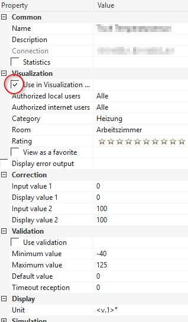
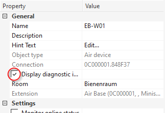

# IoBroker.loxone

**Tests:** 

## Loxone-Adapter für ioBroker
**_Dieser Adapter erfordert mindestens NodeJS 10.x!_**

Ruft alle im Loxone Miniserver (und Loxone Miniserver Go) verfügbaren Informationen ab und stellt Änderungen in Echtzeit bereit.

**Dieser Adapter verwendet Sentry-Bibliotheken, um Ausnahmen und Codefehler automatisch an die Entwickler zu melden.** Weitere Details und Informationen zum Deaktivieren der Fehlerberichterstattung finden Sie unter [Sentry-Plugin-Dokumentation](https://github.com/ioBroker/plugin-sentry#plugin-sentry)! Sentry Reporting wird ab js-controller 3.0 verwendet.

## Installieren
Installieren Sie diesen Adapter über ioBroker Admin:

1. Öffnen Sie den Instanzkonfigurationsdialog
2. Geben Sie die IP-Adresse oder den Hostnamen und den HTTP-Port (standardmäßig 80) Ihres Loxone Miniservers ein
3. Erstellen Sie im Loxone Miniserver einen neuen Benutzer (mittels der Loxone Config-Anwendung), dem Sie lediglich Lese- und Schreibrechte auf alle benötigten Variablen geben.
4. Geben Sie im Konfigurationsdialog den Namen und das Passwort dieses Benutzers ein
5. Speichern Sie die Konfiguration
6. Starten Sie den Adapter

## Aufbau
### Hostname/IP des Miniservers
Dies ist die IP-Adresse oder der Hostname Ihres Loxone Miniservers oder Miniservers Go.

### Miniserver-Port
Dies ist der HTTP-Port Ihres Loxone Miniservers.

Standardmäßig ist der Miniserver so konfiguriert, dass er Port 80 überwacht. Möglicherweise haben Sie dies jedoch geändert.

### Miniserver-Benutzername
Geben Sie einen gültigen Benutzernamen ein, um auf den Loxone Miniserver zuzugreifen.

Aus Sicherheitsgründen wird dringend empfohlen, einen anderen Benutzer als „admin“ zu verwenden.

Der Benutzer benötigt lediglich Lesezugriff auf die Variablen, die Sie von ioBroker verwenden möchten.

### Miniserver-Passwort
Geben Sie das Passwort für den angegebenen Benutzernamen ein (siehe oben).

### Namen synchronisieren
Dadurch werden Namen in ioBroker aktualisiert, wenn sie sich in der Loxone-Konfiguration ändern.
Wenn dies deaktiviert ist, werden Namen nur synchronisiert, wenn ein Steuerelement zum ersten Mal erkannt wird.

### Räume synchronisieren
Dadurch wird die Enumeration enum.rooms mit allen vom Loxone Miniserver bereitgestellten Räumen gefüllt und alle Steuerelemente verknüpft.

### Funktionen synchronisieren
Dadurch wird die Enumeration enum.functions mit allen vom Loxone Miniserver bereitgestellten Kategorien gefüllt und alle Steuerelemente verknüpft.

### Wetterserver
Wählen Sie aus, welche Wetterdaten Sie synchronisieren möchten:

- „Wetterdaten nicht synchronisieren“ synchronisiert nichts, was mit dem Wetterserver zu tun hat
- „Nur aktuelles Wetter synchronisieren“ synchronisiert die Daten unter „Aktuell“
- „24-Stunden-Wettervorhersage synchronisieren“ synchronisiert das aktuelle Wetter und die 24-Stunden-Wettervorhersage
- „Gesamte Wettervorhersage synchronisieren“ synchronisiert das aktuelle Wetter und die gesamte Wettervorhersage (96 Stunden)

## Zustände
Der Adapter verbindet sich automatisch mit dem konfigurierten Loxone Miniserver und erstellt für jeden gefundenen Steuerungszustand Zustände.

Die IDs der Staaten sind wie folgt formatiert: `loxone.<instance>.<control>.<state>`

- „<Instanz>“ ist der Instanzindex des ioBroker-Adapters (normalerweise „0“).
- „<control>“ ist die UUID des Steuerelements
- „<state>“ ist der Status innerhalb des Steuerelements (weitere Informationen finden Sie unter [Unterstützte Steuerelementtypen](#supported-control-types)).

Der bei der Konfiguration eines Controls in Loxone Config angegebene Name wird nur als dessen Anzeigename in ioBroker verwendet.
Dies liegt daran, dass ein Benutzer möglicherweise denselben Namen für mehrere Steuerelemente wählt.

Weitere Informationen zu Steuerelementen und deren Zuständen finden Sie auch in der Loxone API (insbesondere in der Strukturdatei): https://www.loxone.com/de/kb/api/

## Kontrollieren Sie die Sichtbarkeit
Standardmäßig verbirgt der Loxone Miniserver viele Steuerelemente (und damit deren Zustände) vor der Weboberfläche.

Das heißt, sie sind auch vor diesem ioBroker-Adapter verborgen.

### Verwendung in der Benutzeroberfläche
Um sicherzustellen, dass alle Ihre Status ordnungsgemäß an ioBroker gemeldet werden, überprüfen Sie bitte, ob im Abschnitt „Benutzeroberfläche“ die Option „Verwenden“ aktiviert ist:

### Diagnoseeingänge anzeigen
Um Diagnoseeingänge anzuzeigen (z. B. Batteriestatus von Air-Geräten), stellen Sie bitte sicher, dass auf dem Gerät die Option „Diagnoseeingänge anzeigen“ aktiviert ist:

## Globale Staaten
Die folgenden globalen Zustände werden derzeit von diesem Adapter bereitgestellt:

- `operatingMode`: die aktuelle Betriebsmodusnummer des Loxone Miniservers
- `operatingMode-text`: der aktuelle Betriebsmodus des Loxone Miniservers als Text
- „Sonnenaufgang“: die Anzahl der Minuten nach Mitternacht, in denen heute die Sonne aufgeht
- „Sonnenuntergang“: die Anzahl der Minuten nach Mitternacht, in denen die Sonne heute untergeht
- „Benachrichtigungen“: die Anzahl der Benachrichtigungen
- „Änderungen“: die Anzahl der Änderungen
- alle anderen globalen Zustände werden einfach als Texte gemeldet

## Unterstützte Steuerelementtypen
Die folgenden Steuerungstypen werden derzeit von diesem Adapter unterstützt.

Hinter dem Namen des Staates können Sie die Art des Staates erkennen:

- „(rw)“: lesbar und beschreibbar: Dieser Status kann von ioBroker aus geändert werden
- „(ro)“: schreibgeschützt: Dieser Status kann nicht von ioBroker aus geändert werden
- „(wo)“: schreibgeschützt: Der Wert dieses Status wird von diesem Adapter nicht gemeldet, kann aber geändert werden, wodurch eine Aktion auf dem Loxone Miniserver ausgelöst wird

### AalSmartAlarm
Bereitgestellt von AAL Smart Alarm Control.

- `alarmLevel` (ro) die ID der aktuellen Alarmstufe
    - 0 = Kein Alarm
    - 1 = Sofortiger Alarm
    - 2 = Verzögerter Alarm
- „alarmCause“ (ro) Eine Zeichenfolge, die die letzte Ursache für einen Alarm darstellt
- `isLocked` (ro) Reset aktiv, Eingaben werden ignoriert und daher werden keine Alarme ausgeführt
- `isLeaveActive` (ro) Leave-Eingang ist gesetzt, es werden keine Alarme ausgeführt
- „disableEndTime“ (ro) Endzeit für die Deaktivierung des Steuerelements
- „Bestätigen“ (wo) Anstehenden Alarm bestätigen
- „disable“ (wo) Deaktiviert die Steuerung für einen bestimmten Zeitraum, es werden keine Alarme ausgeführt. Wenn Sie den Wert auf 0 setzen, wird der Smart Alarm wieder aktiviert
- `startDrill` (wo) Testalarm ausführen

### AalEmergency
Bereitgestellt durch die AAL Smart Emergency Button-Steuerung.

- „status“ (ro) die ID des aktuellen Status
    - 0 = läuft, normaler Betrieb, wartet auf Notruftaste
    - 1 = Alarm ausgelöst
    - 2 = Reset-Eingang in der Konfiguration aktiviert, Steuerung wird heruntergefahren
    - 3 = App hat die Steuerung vorübergehend deaktiviert
- „disableEndTime“ (ro) Endzeit für die Deaktivierung des Steuerelements
- Textstatus „resetActive“ (ro) mit dem aktiven Reset-Eingang (wenn die Steuerung zurückgesetzt ist)
- „trigger“ (wo) einen Alarm über die App auslösen
- „quit“ (wo) einen aktiven Alarm beenden
- „disable“ (wo) deaktiviert die Steuerung für die angegebene Zeit in Sekunden. Auf 0 setzen, um die Steuerung erneut zu starten, wenn sie deaktiviert ist

### Alarm
Bereitgestellt von der Einbruchmeldezentrale.

- „scharf“ (rw) boolescher Zustand (wahr/falsch) des Alarms; Durch das Schreiben von „true“ auf diesen Wert wird der Alarm sofort aktiviert (ohne die vordefinierte Verzögerung).
- `nextLevel` (ro) die ID der nächsten Alarmstufe
    - 1 = Still
    - 2 = Akustisch
    - 3 = Optisch
    - 4 = Intern
    - 5 = Extern
    - 6 = Fernbedienung
- `nextLevelDelay` (ro) die Verzögerung des nächsten Levels in Sekunden
- `nextLevelDelayTotal` (ro) die Gesamtverzögerung des nächsten Levels in Sekunden
- „level“ (ro) die ID der aktuellen Alarmstufe
    - 1 = Still
    - 2 = Akustisch
    - 3 = Optisch
    - 4 = Intern
    - 5 = Extern
    - 6 = Fernbedienung
- „startTime“ (ro): der Zeitstempel, als der Alarm gestartet wurde
- „armedDelay“ (ro) die Verzögerung, mit der die Alarmsteuerung scharfgeschaltet wird
- „armedDelayTotal“ (ro) die Gesamtverzögerung der Scharfschaltung der Alarmsteuerung
- „Sensoren“ (ro) die Liste der Sensoren
- `disabledMove` (rw) die Bewegung ist deaktiviert (true) oder nicht (false)
- „delayedOn“ (wo) schreibt einen beliebigen Wert in diesen Zustand und löst den Alarm mit der konfigurierten Verzögerung aus
- „quit“ (wo) Das Schreiben eines beliebigen Werts in diesen Zustand bestätigt den Alarm

### Zentraler Alarm
Bereitgestellt durch die zentrale Einbruchmeldezentrale.

- „scharf“ (rw) boolescher Zustand (wahr/falsch) des Alarms; Durch das Schreiben von „true“ auf diesen Wert wird der Alarm sofort aktiviert (ohne die vordefinierte Verzögerung).
- „delayedOn“ (wo) schreibt einen beliebigen Wert in diesen Zustand und löst den Alarm mit der konfigurierten Verzögerung aus
- „quit“ (wo) Das Schreiben eines beliebigen Werts in diesen Zustand bestätigt den Alarm

### Wecker
Bereitgestellt durch Weckersteuerung.

- `isEnabled` (rw) boolescher Zustand (wahr/falsch) des Weckers
- `isAlarmActive` (ro) boolean (true/false), ob der Alarm gerade klingelt
- „confirmationNeeded“ (ro) boolean (true/false), ob der Benutzer den Alarm bestätigen muss
- „ringingTime“ (ro) Countdown in Sekunden, wie lange der Wecker klingelt, bis er wieder schlummert
- „ringDuration“ (rw) Dauer in Sekunden, in denen der Wecker klingelt
- „prepareDuration“ (rw) Vorbereitungszeit in Sekunden
- „snoozeTime“ (ro) Sekunden bis zum Ende der Schlummerfunktion
- „snoozeDuration“ (rw) Dauer des Schlummerns in Sekunden
- „snooze“ (wo): Das Schreiben eines beliebigen Werts in diesen Zustand versetzt den aktuellen Alarm in den Schlummermodus
- „dismiss“ (wo): Das Schreiben eines beliebigen Werts in diesen Status verwirft den aktuellen Alarm

### AudioZone
Bereitgestellt von Music Server Zone.

- `serverState` (ro) Status des Musikservers:
    - -3 = unbekannte/ungültige Zone
    - -2 = nicht erreichbar
    - -1 = unbekannt
    - 0 = offline
    - 1 = Initialisierung (Booten, Versuch, es zu erreichen)
    - 2 = online
- `playState` (rw) der Wiedergabestatus:
    - -1 = unbekannt (dieser Wert kann nicht festgelegt werden)
    - 0 = gestoppt (durch Einstellen dieses Werts wird die Wiedergabe angehalten)
    - 1 = pausiert (durch Einstellen dieses Werts wird die Wiedergabe angehalten)
    - 2 = Wiedergabe (durch Einstellen dieses Werts wird die Wiedergabe gestartet/fortgesetzt)
- `clientState` (ro) Status des Clients:
    - 0 = offline
    - 1 = Initialisierung (Booten, Versuch, es zu erreichen)
    - 2 = online
- „power“ (rw), ob die Client-Stromversorgung aktiv ist oder nicht
- „Volume“ (rw) aktuelle Lautstärke
- „maxVolume“ (ro) Zonen kann eine maximale Lautstärke zugewiesen werden
- „shuffle“ (rw), ob die Wiedergabelisten-Zufallswiedergabe aktiviert ist oder nicht
- `sourceList` (ro) Liste mit allen Zonenfavoriten
- `repeat` (rw) Wiederholungsmodus:
    - -1 = unbekannt
    - 0 = aus
    - 1 = alles wiederholen
    - 2 = -nicht verwendet-
    - 3 = aktuelles Element wiederholen
- `songName` (ro) Liedname
- „Dauer“ (ro), wie lang der gesamte Track ist, -1, wenn nicht bekannt (Stream)
- „progress“ (rw) aktuelle Position im Track
- `album` (ro) Albumname
- „Künstler“ (ro) Künstlername
- `station` (ro) Stationsname
- `genre` (ro) Genrename
- „Cover“ (ro) Song-/Album-Cover-Bild-URL
- „source“ (rw) aktuell ausgewählte Quellenkennung (siehe „sourceList“ oben)
- „prev“ (wo) Das Schreiben eines beliebigen Werts in diesen Zustand führt zur vorherigen Spur
- „next“ (wo) Das Schreiben eines beliebigen Werts in diesen Zustand führt zum nächsten Titel

### Zentrales Audio
Bereitgestellt vom zentralen Musikserver.

- „control“ (wo) setzt den Spielstatus aller Spieler („true“ = spielen, „false“ = Pause)

### Farbwähler
Dieses Gerät erscheint nur innerhalb eines LightControllers.

- „red“ (rw) Rotwert des Farbwählers
- „grün“ (rw) Grünwert des Farbwählers
- „blau“ (rw) Blauwert des Farbwählers

Wenn Sie einen oder mehrere der oben genannten Zustände über ioBroker festlegen, wird erst nach etwa 100 ms ein Befehl an den Miniserver gesendet.
Dadurch soll verhindert werden, dass sich die Farbe bei einer einzelnen Benutzereingabe mehrmals ändert.

### Farbauswahl V2
Dieses Gerät erscheint nur in einem Light Controller V2 in der Loxone-Softwareversion 9 und höher.

- „red“ (rw) Rotwert des Farbwählers
- „grün“ (rw) Grünwert des Farbwählers
- „blau“ (rw) Blauwert des Farbwählers

Wenn Sie einen oder mehrere der oben genannten Zustände über ioBroker festlegen, wird erst nach etwa 100 ms ein Befehl an den Miniserver gesendet.
Dadurch soll verhindert werden, dass sich die Farbe bei einer einzelnen Benutzereingabe mehrmals ändert.

### Daytimer / IRCDaytimer
Wird per Timer/Zeitplan bereitgestellt.

- „mode“ (ro) aktueller Betriebsmodus des Daytimers
- `mode-text` (ro) aktueller Betriebsmodusname des Daytimers
- `override` (ro) die verbleibende Zeit des Timers
- „value“ (ro) aktueller Wert, „true“ oder „false“ für digital und ein Wert für analog
- `value-formatted` (ro) aktueller formatierter Wert als Text
- „needsActivation“ (ro) nur verfügbar, wenn das Steuerelement aktiviert werden muss
- „resetActive“ (ro) bleibt aktiv, solange der Reset-Eingang des Daytimers aktiv ist
- „pulse“ (wo) aktiviert den neuen Wert, wenn ein Eintrag aktiviert werden muss

### Dimmer
Bereitgestellt durch Dimmer.

- `position` (rw) aktuelle Position für den Dimmer
- `min` (ro) aktueller Minimalwert
- „max“ (ro) aktueller Maximalwert
- `step` (ro) aktueller Schrittwert
- „on“ (wo) Das Schreiben eines beliebigen Werts in diesen Zustand setzt den Dimmer auf die letzte bekannte Position
- „off“ (wo) Das Schreiben eines beliebigen Werts in diesen Zustand deaktiviert den Dimmer, setzt die Position auf 0, merkt sich aber die letzte Position

### EIBDimmer
Bereitgestellt durch EIB/KNX-Dimmer.

- `position` (rw) aktuelle Position für den Dimmer
- „on“ (wo) Das Schreiben eines beliebigen Werts in diesen Zustand setzt den Dimmer auf die letzte bekannte Position
- „off“ (wo) Das Schreiben eines beliebigen Werts in diesen Zustand deaktiviert den Dimmer, setzt die Position auf 0, merkt sich aber die letzte Position

### Fronius
Bereitgestellt vom Energiemonitor.

- „prodCurr“ (ro) aktuelle Produktionsleistung
- „prodCurrDay“ (ro) Energieproduktion am gesamten aktuellen Tag
- „prodCurrMonth“ (ro) Energieproduktion im gesamten aktuellen Monat
- „prodCurrYear“ (ro) Energieproduktion im gesamten laufenden Jahr
- „prodTotal“ (ro) Energieproduktion seit der Gründung
- „consCurr“ (ro) aktuelle Verbrauchsleistung
- „consCurrDay“ (ro) Energie, die im Laufe des aktuellen Tages verbraucht wurde
- „consTotal“ (ro) seit der Einrichtung verbrauchte Energie
- `deliveryDay` (ro) unbekannt
- „earningsDay“ (ro), wie viel Geld im laufenden Betrieb verdient wurde, indem entweder der produzierte Strom selbst verbraucht wurde, anstatt ihn aus dem Netz zu verbrauchen, oder indem ungenutzter produzierter Strom in das Netz exportiert wurde
- „earningsMonth“ (ro), wie viel Geld im aktuellen Monat verdient wurde
- „earningsYear“ (ro), wie viel Geld im laufenden Jahr verdient wurde
- „EarningsTotal“ (ro), wie viel Geld seit der Einrichtung verdient wurde
- „gridCurr“ (ro) aktueller Netzverbrauch/Lieferleistung. Bei negativem Wert wird Strom ins Netz eingespeist.
- „batteryCurr“ (ro) aktuelle Lade-/Nutzungsleistung des Akkus. Wenn negativ, wird der Akku geladen.
- „stateOfCharge“ (ro) repräsentiert den Ladezustand der Batterie. 100 = voll aufgeladen.
- „co2Factor“ (ro) Wie viel CO2 wird benötigt, um eine kWh zu produzieren, wird zur Berechnung der CO2-Einsparungen verwendet
- `online` (ro) wahr: online, falsch: offline

### Tor
Wird von Torsteuerungen bereitgestellt.

- `position` (ro) die Position von 1 = oben bis 0 = unten
- „aktiv“ (rw) aktuelle Richtung der Torbewegung
    - -1 = schließen
    - 0 = bewegt sich nicht
    - 1 = offen
- „preventOpen“ (ro), ob das Öffnen der Tür verhindert wird
- „preventClose“ (ro), ob das Schließen der Tür verhindert wird

### Zentrales Tor
Wird von der zentralen Torsteuerung bereitgestellt.

- `open` (wo) öffnet alle Tore
- „close“ (wo) schließt alle Tore
- `stop` (wo) stoppt alle Tormotoren

### Stundenzähler
Zur Verfügung gestellt von

- „total“ (ro) Gesamtzahl der Sekunden, die der Zähler bisher aktiv war
- „remaining“ (ro), wie viele Sekunden verbleiben, bis die nächste Wartung erforderlich ist
- „lastActivation“ (ro) der Zeitstempel, wann der Zähler das letzte Mal aktiviert wurde
- „overdue“ (ro) „false“, wenn nicht überfällig, andernfalls ist eine Wartung erforderlich
- `maintenanceInterval` (ro) Sekunden bis zur nächsten Wartung
- „aktiv“ (ro), ob der Zähler derzeit aktiv ist oder nicht
- „overdueSince“ (ro) Sekunden, seit das MaintenanceInterval überschritten wurde
- „reset“ (wo) bewirkt ein Zurücksetzen der folgenden Werte
    - verbleibendes Wartungsintervall
    - überfällig auf 0
    - überfälligDa auf 0
- „resetAll“ (wo) wie „reset“, setzt aber auch
    - insgesamt auf 0
    - lastActivation auf 0

### InfoOnlyAnalog
Bereitgestellt durch virtuelle Zustände sowie den Loxone Touch-Schalter.

- `value` (ro) der Statuswert (Nummer) des Steuerelements
- `value-formatted` (ro) falls konfiguriert, der formatierte Wert des Zustands (unter Verwendung des „Unit“-Formats aus Loxone Config)

### InfoOnlyDigital
Bereitgestellt durch virtuelle Zustände sowie den Loxone Touch-Schalter.

- „aktiver“ (ro) boolescher Zustand (wahr/falsch) des Steuerelements
- „active-text“ (ro), falls konfiguriert, das Textäquivalent des Status
- „active-image“ (ro), falls konfiguriert, das Bildäquivalent des Status
- „active-color“ (ro), falls konfiguriert, das Farbäquivalent des Status

### InfoOnlyText
Bereitgestellt durch virtuelle Textzustände.

- `text` (ro) der Statuswert des Steuerelements
- „textformatiert“ (ro), falls konfiguriert, der formatierte Wert des Status

### Gegensprechanlage
Wird von Türsteuerungen bereitgestellt.

- „bell“ (ro), ob die Glocke läutet
- Array „lastBellEvents“ (ro), das die Zeitstempel für jede Glockenaktivität enthält, die nicht beantwortet wurde
- „Version“ (ro) Nur Loxone Intercoms – Text, der die aktuell installierte Firmware enthält

    Versionen

- „Antwort“ (wo) Wenn Sie einen beliebigen Wert in diesen Status schreiben, wird die Glocke deaktiviert

Dieser Kanaltyp kann andere Geräte enthalten. Weitere Informationen finden Sie im jeweiligen Kapitel.

### Intelligenter Raumcontroller V2
Wird vom intelligenten Raumcontroller V2 seit Miniserver 10.0 bereitgestellt.

TODO: Dokumentation fehlt derzeit

### Jalousie
Verfügbar durch verschiedene Arten von Jalousien (automatisch und manuell).

- „up“ (rw), ob Jalousie nach oben rückt
- „down“ (rw), ob sich Jalousie nach unten bewegt
- „Position“ (ro) Position der Jalousie, eine Zahl von 0 bis 1
    - Jalousie-Oberstellung = 0
    - Jalousie untere Position = 1
- „shadePosition“ (ro) Schattenposition der Jalousie (Jalousien), eine Zahl von 0 bis 1
    - Jalousien werden nicht abgeschattet = 0
    - Jalousien werden abgeschattet = 1
- „safetyActive“ (ro) wird nur von denen mit Autopilot verwendet, dies stellt die Sicherheitsabschaltung dar
- „autoAllowed“ (ro) wird nur von Benutzern mit Autopilot verwendet
- „autoActive“ (rw) wird nur von Benutzern mit Autopilot verwendet
- „gesperrt“ (ro) nur für diejenigen mit Autopilot, dies stellt den Ausgabe-QI in Loxone Config dar
- `infoText` (ro) informiert z.B. darauf, was den gesperrten Zustand verursacht hat oder was dazu geführt hat, dass die Sicherheit aktiv wurde.
- „fullUp“ (wo) Das Schreiben eines beliebigen Werts in diesen Zustand löst eine vollständige Aufwärtsbewegung aus
- „fullDown“ (wo) Das Schreiben eines beliebigen Werts in diesen Zustand löst eine vollständige Abwärtsbewegung aus
- „Shade“ (wo) Wenn Sie einen beliebigen Wert in diesen Zustand schreiben, wird die Jalousie in die perfekte Position gebracht

### Zentrale Jalousie
Wird von der zentralen Jalousiensteuerung bereitgestellt.

- „autoActive“ (rw) wird nur von Benutzern mit Autopilot verwendet
- „fullUp“ (wo) Das Schreiben eines beliebigen Werts in diesen Zustand löst eine vollständige Aufwärtsbewegung aus
- „fullDown“ (wo) Das Schreiben eines beliebigen Werts in diesen Zustand löst eine vollständige Abwärtsbewegung aus
- `shade` (wo) schreibt einen beliebigen Wert in diesen Zustand und bringt die Jalousien aller Jalousien in die perfekte Position

### Lichtsteuerung
Bereitgestellt von (Hotel-)Lichtsteuerungen.
Szenen können nur in den Loxone-Anwendungen geändert werden, sind aber in ioBroker auswählbar.

- `activeScene` (rw) aktuell aktive Szenennummer
    - 0: alles aus
    - 1..8: Benutzerdefinierte Szene (Definition/Lernen von Szenen muss mit den Loxone-Tools erfolgen)
    - 9: alles an
- `sceneList` (ro) Liste aller Szenen
- „plus“ (wo) wechselt zur nächsten Szene
- „minus“ (wo) wechselt zur vorherigen Szene

Dieser Kanaltyp kann andere Geräte enthalten. Weitere Informationen finden Sie im jeweiligen Kapitel.

### Lichtcontroller V2
Wird von (Hotel-)Lichtsteuerungen in der Loxone-Softwareversion 9 und höher bereitgestellt.
Stimmungen können nur in den Loxone-Anwendungen geändert werden, können jedoch in ioBroker ausgewählt und kombiniert werden.

- `moodList` (ro) Liste aller konfigurierten Stimmungsnamen
- „activeMoods“ (rw) aktuell aktive Liste der Stimmungsnamen
- „favoriteMoods“ (ro) Liste der beliebtesten Stimmungsnamen
- „additionalMoods“ (ro) Liste der nicht bevorzugten Stimmungsnamen
- „plus“ (wo) wechselt zur nächsten Stimmung
- „minus“ (wo) wechselt zur vorherigen Stimmung

Dieser Kanaltyp kann andere Geräte enthalten. Weitere Informationen finden Sie im jeweiligen Kapitel.

### Zentrale Lichtsteuerung
Wird von der zentralen Lichtsteuerung bereitgestellt.

- „control“ (wo) schaltet alle Lichter ein oder aus

### Briefkasten
Bereitgestellt von Paketsafe Air / Tree.

- „notificationsDisabledInput“ (ro) Status der Eingabe für deaktivierte Benachrichtigungen
- „packetReceived“ (ro) Gibt an, ob ein Paket empfangen wurde
- „mailReceived“ (ro) Gibt an, ob E-Mails empfangen wurden
- „disableEndTime“ (ro) Zeitstempel, bis die Benachrichtigungen deaktiviert werden
- `confirmPacket` (wo) Bestätigen Sie den Empfang eines Pakets
- `confirmMail` (wo) Bestätigen Sie den Empfang der E-Mail
- „disableNotifications“ (wo) Deaktiviert die Benachrichtigungen für x Sekunden; 0 Sekunden zum Abbrechen des Timers

### Meter
Wird von Versorgungszählern bereitgestellt.

- `actual` (ro) der tatsächliche Wert (Anzahl)
- `actual-formatted` (ro) falls konfiguriert, der formatierte Istwert des Zustands (unter Verwendung des „Unit“-Formats aus Loxone Config)
- „total“ (ro) der Gesamtwert (Anzahl)
- `total-formatted` (ro) falls konfiguriert, der formatierte Gesamtwert des Zustands (unter Verwendung des „Unit“-Formats aus Loxone Config)
- „reset“ (wo) Das Schreiben eines beliebigen Werts in diesen Zustand setzt den Gesamtwert zurück

### Präsenzmelder
Wird durch einen Präsenzmelder bereitgestellt.

- Präsenzstatus „aktiv“ (ro).
- „gesperrt“ (ro) gesperrter Zustand
- „events“ (ro) die Anzahl der Ereignisse
- `infoText` (ro) Grund, warum der Präsenzmelder gesperrt ist

### Druckknopf
Bereitgestellt durch virtuelle Drucktasteneingänge.

- „aktiv“ (rw) der aktuelle Zustand des Tasters
- „pulse“ (wo) Das Schreiben eines beliebigen Werts in diesen Zustand simuliert, dass die Taste nur für eine sehr kurze Zeit gedrückt wird

### Radio
Wird über Optionsfelder (8x und 16x) bereitgestellt.

- `activeOutput` (rw) ID des aktuell aktiven Ausgangs oder 0, wenn keiner aktiv ist („All Off“)

### Fernbedienung
Bereitgestellt vom Medienverantwortlichen.
Nur grundlegende Lesefunktion.

- „active“ (ro) wahr, wenn der Miniserver die Befehle zum Umschalten der Modi oder zum Einschalten sendet
- „mode“ (ro) die Taste für den aktuellen Modus oder 0, wenn kein Modus ausgewählt ist („All Off“)“
- `timeout` (ro) das Timeout in Millisekunden

### Schieberegler
Bereitgestellt durch analoge virtuelle Eingänge.

- `value` (rw) der aktuelle Wert des Schiebereglers
- `value-formatted` (ro) falls konfiguriert, der formatierte Wert des Zustands (unter Verwendung des „Unit“-Formats aus Loxone Config)
- „Fehler“ (ro) zeigt einen ungültigen Wert des Schiebereglers an

### Rauchmelder
Wird von Versorgungszählern bereitgestellt.

- `nextLevel` (ro) die ID der nächsten Alarmstufe
    - 1 = Still
    - 2 = Akustisch
    - 3 = Optisch
    - 4 = Intern
    - 5 = Extern
    - 6 = Fernbedienung
- `nextLevelDelay` (ro) Verzögerung des nächsten Levels in Sekunden
- `nextLevelDelayTotal` (ro) Gesamtverzögerung des nächsten Levels in Sekunden
- „level“ (ro) die ID der aktuellen Alarmstufe
    - 1 = Still
    - 2 = Akustisch
    - 3 = Optisch
    - 4 = Intern
    - 5 = Extern
    - 6 = Fernbedienung
- „Sensoren“ (ro) die Liste der Sensoren
- „acousticAlarm“ (ro) Zustand des akustischen Alarms: „false“ für nicht aktiv und „true“ für aktiv
- `testAlarm` (ro), ob Testalarm aktiv ist
- `alarmCause` (ro) die Ursache des Alarms:
    - 1 = nur Rauchmelder
    - 2 = nur Wasser
    - 3 = Rauch und Wasser
    - 4 = nur Temperatur
    - 5 = Feuer und Temperatur
    - 6 = Temperatur und Wasser
    - 7 = Feuer, Temperatur und Wasser
- „startTime“ (ro) Zeitstempel, wann der Alarm gestartet wurde
- „timeServiceMode“ (rw) Verzögerung, bis der Servicemodus deaktiviert wird
- „mute“ (wo) Das Schreiben eines beliebigen Werts in diesen Zustand schaltet die Sirene stumm
- „quit“ (wo) Das Schreiben eines beliebigen Werts in diesen Zustand quittiert den Rauchmelder

### Schalten
Bereitgestellt durch virtuelle Eingangsschalter.

- „aktiv“ (rw) der aktuelle Zustand des Schalters

### Textstatus
Bereitgestellt von „state“.

- `textAndIcon` (ro) der aktuelle Wert des Status

### Zeitgesteuerter Schalter
Bereitgestellt durch Treppenhaus- und Multifunktionsschalter.

- „deactivationDelayTotal“ (ro) Sekunden, wie lange der Ausgang aktiv sein wird, wenn der Timer verwendet wird
- `deactivationDelay` (ro) Countdown bis der Ausgang deaktiviert wird
    - 0 = der Ausgang ist ausgeschaltet
    - -1 = der Ausgang ist dauerhaft eingeschaltet
    - andernfalls wird von deactivationDelayTotal heruntergezählt
- „on“ (wo) Das Schreiben eines beliebigen Werts in diesen Zustand aktiviert den Schalter dauerhaft ohne Deaktivierungsverzögerung
- „off“ (wo) Das Schreiben eines beliebigen Werts in diesen Zustand deaktiviert den Schalter
- „pulse“ (wo) pulsiert den Schalter:
    - Deaktivierungsverzögerung = 0
        - Startet den Countdown von DeactivationDelayTotal bis 0
    - wenn es sich um einen Treppenhausschalter handelt:
        - Deaktivierungsverzögerung = -1
            - Keine Auswirkung, bleibt dauerhaft eingeschaltet.
        - Deaktivierungsverzögerung > 0
            - Startet den Countdown neu
    - wenn es sich um einen Multifunktionsschalter handelt
        - schaltet es aus (vom Countdown oder dauerhaft eingeschaltet)

### Tracker
Bereitgestellt durch Treppenhaus- und Multifunktionsschalter.

- „Entries“ (ro) Liste der vom Miniserver zurückgegebenen Einträge

### UpDownAnalog
Wird über den virtuellen Eingang (Auf-Ab-Tasten) bereitgestellt.

- „value“ (rw) der aktuelle Wert der Eingabe
- `value-formatted` (ro) falls konfiguriert, der formatierte Wert des Zustands (unter Verwendung des „Unit“-Formats aus Loxone Config)
- „Fehler“ (ro) zeigt einen ungültigen Wert des Schiebereglers an

### ValueSelector
Wertauswahl.

- `value` (rw) aktueller Wert
- `min` (ro) aktueller Minimalwert
- „max“ (ro) aktueller Maximalwert
- `step` (ro) aktueller Schrittwert

### WindowMonitor
Wird von Versorgungszählern bereitgestellt.

- `numOpen` (ro) Anzahl der geöffneten Fenster und Türen
- `numClosed` (ro) Anzahl der geschlossenen Fenster und Türen
- „numTilted“ (ro) Anzahl der gekippten Fenster und Türen
- `numOffline` (ro) Anzahl der Fenster und Türen, die nicht verfügbar sind
- `numLocked` (ro) Anzahl der verschlossenen Fenster und Türen
- `numUnlocked` (ro) Anzahl der entsperrten Fenster und Türen

Die Summe der Werte aus all diesen Zuständen entspricht der Anzahl der überwachten Fenster und Türen.? Die Fenster/Türen mit zwei Zuständen werden immer zum „schlechtesten“ Zustand gezählt.

Für jedes überwachte Fenster / jede überwachte Tür gibt es ein Gerät mit einem Index als ID und dem angegebenen Namen. Sie haben folgende Zustände:

- „geschlossen“ (ro) das Fenster/die Tür ist geschlossen
- „gekippt“ (ro) das Fenster/die Tür ist gekippt
- „open“ (ro) das Fenster/die Tür ist offen
- „verriegelt“ (ro) das Fenster/die Tür ist verriegelt
- „unlocked“ (ro) Das Fenster/die Tür ist entriegelt

## Wetterserver
Die Wetterserverinformationen werden als Gerät mit mehreren Kanälen bereitgestellt.
Das Gerät heißt `WeatherServer`.
Es beinhaltet:

- der Kanal „Actual“ mit den aktuellen Wetterwerten
- ein Kanal für jede prognostizierte Stunde mit der Bezeichnung „HourXX“, wobei „XX“ die Anzahl der Stunden in der Zukunft angibt

Jeder Kanal enthält die folgenden Zustände:

- „barometrischer Druck“: numerischer Luftdruckwert
- „barmetricPressure-formatted“: formatierter Luftdruckwert mit Einheit
- „dewPoint“: numerischer Taupunktwert
- „dewPoint-formatted“: formatierter Taupunktwert mit Einheit
- „perceivedTemperature“: numerischer Wert der wahrgenommenen Temperatur
- „perceivedTemperature-formatted“: formatierter wahrgenommener Temperaturwert mit Einheit
- „Niederschlag“: numerischer Niederschlagswert
- `precipitation-formatted`: formatierter Niederschlagswert mit Einheit
- „relativeHumidity“: numerischer Wert der relativen Luftfeuchtigkeit
- „relativeHumidity-formatted“: formatierter relativer Luftfeuchtigkeitswert mit Einheit
- „solarRadiation“: Sonnenstrahlungswert
- „Temperatur“: numerischer Temperaturwert
- „temperaturformatiert“: formatierter Temperaturwert mit Einheit
- „timestamp“: Zeitstempel der Daten als „value.time“ (JavaScript-Zeit)
- „weatherType“: numerischer Aufzählungswert des Wettertyps
- „weatherType-text“: Textdarstellung des Wettertyps
- „windDirection“: Wert der Windrichtung
- „windSpeed“: Wert der Windgeschwindigkeit
- „windSpeed-formatted“: formatierter Windgeschwindigkeitswert mit Einheit

## Nicht unterstützte Steuerelementtypen
Wenn Loxone neue Steuerungsarten hinzufügt, werden diese meist nicht sofort von diesem Adapter unterstützt.

In diesem Fall steht vor dem Namen des Steuerelements „Unbekannt:“. Z.B. `Unknown: Wallbox`

Diese Steuerelemente enthalten alle vom Miniserver gemeldeten Zustände, sind jedoch alle schreibgeschützte Zeichenfolgen.

Wenn Sie eine bessere Unterstützung für einen neuen Steuerungstyp benötigen, befolgen Sie bitte die Schritte im nächsten Abschnitt, um eine neue Funktion anzufordern.

**Sentry:** Nicht unterstützte Steuerungstypen werden den Entwicklern gemeldet, die Sentry verwenden. Auf diese Weise erhalten Sie möglicherweise in der nächsten Version neue Steuerelemente, ohne diese selbst anfordern zu müssen.

## Fehlerberichte und Funktionsanfragen
Bitte nutzen Sie das GitHub-Repository, um etwaige Fehler zu melden oder neue Funktionen anzufordern.

Wenn Sie einen nicht unterstützten Steuerungstyp benötigen, geben Sie bitte den Namen an, wie er im Fehlerprotokoll von ioBroker gemeldet wird, sowie den gesamten Rohinhalt des Geräts im ioBroker-Objektbaum:

Beispiel einer Protokolldatei für „LightController“:

Nativer Wert von ioBroker &gt; Objekte

## Legal
Dieses Projekt steht in keiner direkten oder indirekten Verbindung zur Firma Loxone Electronics GmbH.

Loxone und Miniserver sind eingetragene Marken der Loxone Electronics GmbH.

## Changelog

<!--
    Placeholder for the next version (at the beginning of the line):
    ### **WORK IN PROGRESS**
-->

### **WORK IN PROGRESS**

-   (raintonr) Set correct min/max target on IRCv2 when in override (#528)

### 3.0.1 (2023-03-30)

-   (raintonr) Added info statistics (#364)
-   (raintonr) Added missing states from IRCv2 (#365)
-   (raintonr) Added basic functionality for Remote (Media Controller)
-   (raintonr) Fixed ack overwrites of fast changing states (#399) and general ack improvements
-   (raintonr) Fix crash when state changes occur during Miniserver reboot or otherwise unavailable (#298)
-   (raintonr) Release script and other dependency updates

### 3.0.0 (2021-12-29)

-   (tdesmet) Changed to lxcommunicator (fixes #210)
-   (UncleSamSwiss) Updated all dependencies

### 2.2.3 (2021-07-06)

-   (UncleSamSwiss) Reduced number of Sentry reports for unsupported controls.

### 2.2.2 (2021-06-23)

-   (UncleSamSwiss) Explicitly setting adapter tier to 2.
-   (UncleSamSwiss) Added support for Daytimer (IOBROKER-LOXONE-1Z)
-   (UncleSamSwiss) Added support for Radio (IOBROKER-LOXONE-21)
-   (UncleSamSwiss) Added support for Fronius (IOBROKER-LOXONE-1Y)
-   (UncleSamSwiss) Added support for IRCDaytimer (IOBROKER-LOXONE-27)
-   (UncleSamSwiss) Added support for Hourcounter (IOBROKER-LOXONE-23)
-   (UncleSamSwiss) Added support for InfoOnlyText (IOBROKER-LOXONE-29)
-   (UncleSamSwiss) Fixed issues with Lumitech color pickers (#150)

### 2.2.1 (2021-05-18)

-   (UncleSamSwiss) Fixed typo causing "Cannot read property 'off' of undefined" (IOBROKER-LOXONE-2R, #72)
-   (UncleSamSwiss) Improved Sentry reporting for structure file

### 2.2.0 (2021-05-17)

-   (UncleSamSwiss) Unknown/unsupported controls are now shown with their states as read-only strings
-   (raintonr) Fixes for auto-position based on percentage (#76)
-   (raintonr) Added support for IRoomControllerV2 (#22)
-   (UncleSamSwiss) Added experimental support for EIBDimmer (#15)
-   (UncleSamSwiss) Added support for ValueSelector (#36)
-   (UncleSamSwiss) Added support for TextState (#73)
-   (UncleSamSwiss) Added support for UpDownAnalog (#57)
-   (UncleSamSwiss) Fixed some "State has wrong type" warnings (#99, #128)
-   (UncleSamSwiss) Added support for Lumitech color picker (#44)
-   (UncleSamSwiss) Weather server data can now be filtered (#131)
-   (UncleSamSwiss) Added support for PresenceDetector (IOBROKER-LOXONE-1R)
-   (UncleSamSwiss) Added support for AAL Smart Alarm (IOBROKER-LOXONE-1X)
-   (UncleSamSwiss) Added support for AAL Emergency Button (IOBROKER-LOXONE-1W)
-   (UncleSamSwiss) Added support for Paketsafe (IOBROKER-LOXONE-1P)

### 2.1.0 (2020-12-21)

-   (raintonr) Fixed: activeMoods can get stuck/not sync properly; all events is now handled with a queue (#58, #61, #62)
-   (raintonr) Added open/close buttons to Garage/Gate Control (#59, #60)
-   (pinkit) Added support for virtual text inputs (#48)
-   (UncleSamSwiss) Updated to the latest adapter template
-   (UncleSamSwiss) Changed log level of "Currently unsupported control type" message to "info" (#65)

### 2.0.2 (2020-10-26)

-   (UncleSamSwiss) Fixed color picker updates (#52)
-   (UncleSamSwiss) TimedSwitch to have `on`/`off` instead of `active` (#53)
-   (UncleSamSwiss) Cleaning illegal characters for room and function names (#54)

### 2.0.1 (2020-09-24)

-   (UncleSamSwiss) Fixed percentage states always showing 0% (#49)
-   (UncleSamSwiss) Fixed analog virtual inputs wouldn't set the value 0 from ioBroker (#47)
-   (UncleSamSwiss) Added translations to package information.

### 2.0.0

-   **BREAKING:** Since the password is now encrypted, you will need to enter the password again after an update to this version!
-   (UncleSamSwiss) Updated to the latest development tools and changed to the TypeScript language

### 1.1.0

-   (UncleSamSwiss) Added support for Miniserver Gen 2
-   (sstroot) RGB for LightControllerV2
-   (Apollon77) Updated CI Testing

### 1.0.0

-   (UncleSamSwiss) Fixed issue that was resetting the custom settings and cloud smartName
-   (alladdin) Fixed connection issues with Loxone Miniserver 10
-   (UncleSamSwiss) Changed all write-only "switch"es to "button"s
-   (UncleSamSwiss) Added support for AlarmClock control
-   (Apollon77) Updated CI Testing

### 0.4.0

-   (UncleSamSwiss) Improved support for Loxone Config 9
-   (UncleSamSwiss) Changed all color choosers (i.e. color lights) to use RGB (previously HSV/HSL was completely wrong)

### 0.3.0

-   (UncleSamSwiss) Control names only synchronized on the first time by default (configurable); users can change control names the way they want

### 0.2.1

-   (UncleSamSwiss) Added support for Slider control

### 0.2.0

-   (UncleSamSwiss) Added proper support for Alexa for the following controls: Alarm, AudioZone, Gate, Jalousie and LightController

### 0.1.1

-   (UncleSamSwiss) Added support for synchronizing rooms and functions (categories) from Loxone Miniserver

### 0.1.0

-   (UncleSamSwiss) Added support for many more controls including commands from ioBroker to Loxone Miniserver

### 0.0.3

-   (Bluefox) Formatting, refactoring and Russian translations

### 0.0.2

-   (UncleSamSwiss) Added creation of an empty device for all unsupported controls (helps figure out its configuration)

### 0.0.1

-   (UncleSamSwiss) Initial version

## License

Copyright 2023 UncleSamSwiss

Licensed under the Apache License, Version 2.0 (the "License");
you may not use this file except in compliance with the License.
You may obtain a copy of the License at

http://www.apache.org/licenses/LICENSE-2.0

Unless required by applicable law or agreed to in writing, software
distributed under the License is distributed on an "AS IS" BASIS,
WITHOUT WARRANTIES OR CONDITIONS OF ANY KIND, either express or implied.
See the License for the specific language governing permissions and
limitations under the License.