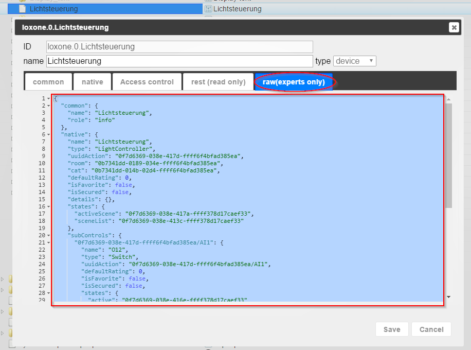

# IoBroker.loxone

**Tests:** 

## Loxone-Adapter für ioBroker
**_Dieser Adapter erfordert mindestens nodejs 10.x!_**

Ruft alle im Loxone Miniserver (und Loxone Miniserver Go) verfügbaren Informationen ab und stellt Änderungen in Echtzeit bereit.

**Dieser Adapter verwendet Sentry-Bibliotheken, um Ausnahmen und Codefehler automatisch an die Entwickler zu melden.** Weitere Details und Informationen zum Deaktivieren der Fehlerberichterstattung finden Sie unter [Sentry-Plugin-Dokumentation](https://github.com/ioBroker/plugin-sentry#plugin-sentry)! Sentry-Berichte werden ab js-controller 3.0 verwendet.

## Installieren
Installieren Sie diesen Adapter über ioBroker Admin:

1. Öffnen Sie den Instanzkonfigurationsdialog
2. Geben Sie die IP-Adresse oder den Hostnamen und den HTTP-Port (standardmäßig 80) Ihres Loxone Miniservers ein
3. Erstellen Sie einen neuen Benutzer im Loxone Miniserver (über die Anwendung Loxone Config), dem Sie nur Lese- und Schreibrechte auf alle erforderlichen Variablen geben.
4. Geben Sie den Namen und das Passwort dieses Benutzers im Konfigurationsdialog ein
5. Speichern Sie die Konfiguration
6. Starten Sie den Adapter

## Aufbau
### Miniserver Hostname / IP
Dies ist die IP-Adresse oder der Hostname Ihres Loxone Miniserver oder Miniserver Go.

### Miniserver-Port
Dies ist der HTTP-Port Ihres Loxone Miniservers.

Standardmäßig ist der Miniserver so konfiguriert, dass er auf Port 80 lauscht, aber Sie haben ihn möglicherweise geändert.

### Miniserver-Benutzername
Geben Sie einen gültigen Benutzernamen an, um auf den Loxone Miniserver zuzugreifen.

Aus Sicherheitsgründen wird dringend empfohlen, einen anderen Benutzer als "admin" zu verwenden.

Der Benutzer benötigt nur Lesezugriff auf die Variablen, die Sie von ioBroker verwenden möchten.

### Miniserver-Passwort
Geben Sie das Passwort für den angegebenen Benutzernamen an (siehe oben).

### Namen synchronisieren
Dadurch werden Namen in ioBroker aktualisiert, wenn sie sich in der Loxone-Konfiguration ändern.
Wenn dies deaktiviert ist, werden Namen nur synchronisiert, wenn ein Steuerelement zum ersten Mal erkannt wird.

### Räume synchronisieren
Dadurch wird die Aufzählung enum.rooms mit allen vom Loxone Miniserver bereitgestellten Räumen gefüllt und alle Controls verknüpft.

### Funktionen synchronisieren
Dadurch wird die Aufzählung enum.functions mit allen vom Loxone Miniserver bereitgestellten Kategorien gefüllt und alle Steuerelemente verknüpft.

### Wetterserver
Wählen Sie aus, welche Wetterdaten Sie synchronisieren möchten:

- "Wetterdaten nicht synchronisieren" synchronisiert nichts, was mit dem Wetterserver zu tun hat
- „Nur aktuelles Wetter synchronisieren“ synchronisiert die Daten unter „Aktuell“
- "24-Stunden-Wettervorhersage synchronisieren" synchronisiert das aktuelle Wetter und die 24-Stunden-Wettervorhersage
- "Gesamte Wettervorhersage synchronisieren" synchronisiert das aktuelle Wetter und die gesamte Wettervorhersage (96 Stunden)

## Zustände
Der Adapter verbindet sich automatisch mit dem konfigurierten Loxone Miniserver und erstellt Zustände für jeden gefundenen Steuerungszustand.

Die IDs der Zustände sind wie folgt formatiert: `loxone.<instance>.<control>.<state>`

- „<instance>“ ist der Index der ioBroker-Adapterinstanz (normalerweise „0“)
- `<control>` ist die UUID des Steuerelements
- `<state>` ist der Status innerhalb des Steuerelements (siehe [Unterstützte Steuerelementtypen](#supported-control-types) für weitere Informationen).

Der bei der Konfiguration eines Controls in Loxone Config vergebene Name wird nur als Anzeigename in ioBroker verwendet.
Dies liegt daran, dass ein Benutzer denselben Namen für mehrere Steuerelemente auswählen kann.

Weitere Informationen zu Controls und deren Zuständen finden Sie auch in der Loxone API (insbesondere der Structure File): https://www.loxone.com/de/kb/api/

## Sichtbarkeit steuern
Standardmäßig blendet der Loxone Miniserver viele Controls (und damit deren Zustände) aus der Weboberfläche aus.

Das heißt, sie sind auch vor diesem ioBroker-Adapter verborgen.

### Verwendung in der Benutzeroberfläche
Um sicherzustellen, dass alle Ihre Zustände ordnungsgemäß an ioBroker gemeldet werden, vergewissern Sie sich bitte, dass im Abschnitt „Benutzeroberfläche“ die Option „Verwenden“ aktiviert ist:

### Diagnoseeingänge anzeigen
Um Diagnoseeingänge (z. B. Batteriestatus von Air-Geräten) anzuzeigen, vergewissern Sie sich bitte, dass das Gerät „Diagnoseeingänge anzeigen“ aktiviert hat:

## Globale Staaten
Die folgenden globalen Status werden derzeit von diesem Adapter bereitgestellt:

- `operatingMode`: die aktuelle Betriebsmodusnummer des Loxone Miniservers
- `operatingMode-text`: der aktuelle Betriebsmodus des Loxone Miniservers als Text
- „Sonnenaufgang“: Die Anzahl der Minuten nach Mitternacht, wenn heute die Sonne aufgeht
- „Sonnenuntergang“: Die Anzahl der Minuten nach Mitternacht, wenn die Sonne heute untergeht
- „Benachrichtigungen“: die Anzahl der Benachrichtigungen
- „Änderungen“: die Anzahl der Änderungen
- Alle anderen globalen Zustände werden einfach als Texte gemeldet

## Unterstützte Steuerelementtypen
Die folgenden Steuerungstypen werden derzeit von diesem Adapter unterstützt.

Hinter dem Namen des Bundeslandes sehen Sie die Art des Bundeslandes:

- `(rw)`: lesbar und beschreibbar: Dieser Status kann von ioBroker aus geändert werden
- `(ro)`: Nur-Lesen: Dieser Status kann nicht von ioBroker aus geändert werden
- `(wo)`: Nur schreiben: Der Wert dieses Zustands wird von diesem Adapter nicht gemeldet, kann aber geändert werden, was eine Aktion auf dem Loxone Miniserver auslöst

### AalSmartAlarm
Bereitgestellt von AAL Smart Alarm Control.

- „alarmLevel“ (ro) die ID der aktuellen Alarmstufe
    - 0 = Kein Alarm
    - 1 = Sofortiger Alarm
    - 2 = Verzögerter Alarm
- `alarmCause` (ro) Eine Zeichenfolge, die die letzte Ursache für einen Alarm darstellt
- `isLocked` (ro) Reset aktiv, Eingaben werden ignoriert und somit keine Alarme ausgeführt
- `isLeaveActive` (ro) Leave-Eingang ist gesetzt, es werden keine Alarme ausgeführt
- `disableEndTime` (ro) Endzeit für die Deaktivierung des Steuerelements
- `confirm` (wo) Anstehenden Alarm bestätigen
- `disable` (wo) Deaktiviert die Steuerung für einen bestimmten Zeitraum, es werden keine Alarme ausgeführt. Wenn Sie ihn auf 0 setzen, wird der Smart Alarm wieder aktiviert
- `startDrill` (wo) Testalarm ausführen

### AalNotfall
Bereitgestellt von der AAL Smart Emergency Button-Steuerung.

- `status` (ro) die ID des aktuellen Status
    - 0 = läuft, normaler Betrieb, wartet auf Drücken der Nottaste
    - 1 = Alarm ausgelöst
    - 2 = Reset-Eingang in Config aktiviert, Steuerung wird abgeschaltet
    - 3 = App hat die Steuerung vorübergehend deaktiviert
- `disableEndTime` (ro) Endzeit für die Deaktivierung des Steuerelements
- `resetActive` (ro) Textstatus mit dem aktiven Reset-Eingang (wenn die Steuerung im Reset ist)
- „trigger“ (wo) löst einen Alarm von der App aus
- `quit` (wo) einen aktiven Alarm beenden
- `disable` (wo) deaktiviert die Steuerung für die angegebene Zeit in Sekunden. Auf 0 setzen, um die Steuerung erneut zu starten, wenn sie deaktiviert ist

### Wecker
Wird von der Einbruchmeldezentrale bereitgestellt.

- „armed“ (rw) boolescher Zustand (true / false) des Alarms; das Schreiben von „true“ auf diesen Wert schaltet den Alarm sofort ein (ohne die vordefinierte Verzögerung)
- `nextLevel` (ro) die ID der nächsten Alarmstufe
    - 1 = Lautlos
    - 2 = Akustisch
    - 3 = Optisch
    - 4 = Intern
    - 5 = Extern
    - 6 = Fernbedienung
- `nextLevelDelay` (ro) die Verzögerung des nächsten Levels in Sekunden
- `nextLevelDelayTotal` (ro) die Gesamtverzögerung des nächsten Levels in Sekunden
- `level` (ro) die ID der aktuellen Alarmstufe
    - 1 = Lautlos
    - 2 = Akustisch
    - 3 = Optisch
    - 4 = Intern
    - 5 = Extern
    - 6 = Fernbedienung
- `startTime` (ro) der Zeitstempel, wann der Alarm gestartet wurde
- `armedDelay` (ro) die Verzögerung der Scharfschaltung der Alarmsteuerung
- `armedDelayTotal` (ro) die Gesamtverzögerung der Scharfschaltung der Alarmsteuerung
- `Sensors` (ro) die Liste der Sensoren
- `disabledMove` (rw) die Bewegung ist deaktiviert (true) oder nicht (false)
- `delayedOn` (wo) Schreiben eines beliebigen Wertes in diesen Zustand macht den Alarm mit der konfigurierten Verzögerung scharf
- `quit` (wo) das Schreiben eines beliebigen Wertes in diesen Zustand bestätigt den Alarm

### Zentraler Alarm
Bereitstellung durch zentrale Einbruchmeldezentrale.

- „armed“ (rw) boolescher Zustand (true / false) des Alarms; das Schreiben von „true“ auf diesen Wert schaltet den Alarm sofort ein (ohne die vordefinierte Verzögerung)
- `delayedOn` (wo) Schreiben eines beliebigen Wertes in diesen Zustand macht den Alarm mit der konfigurierten Verzögerung scharf
- `quit` (wo) das Schreiben eines beliebigen Wertes in diesen Zustand bestätigt den Alarm

### Wecker
Wird von der Weckersteuerung bereitgestellt.

- `isEnabled` (rw) boolescher Zustand (true / false) des Weckers
- `isAlarmActive` (ro) boolean (true / false) ob der Wecker gerade klingelt
- `confirmationNeeded` (ro) boolean (true / false) ob der Benutzer den Alarm bestätigen muss
- `ringingTime` (ro) Countdown in Sekunden, wie lange der Wecker klingelt, bis er wieder schlummert
- `ringDuration` (rw) Dauer in Sekunden, die der Wecker klingelt
- `prepareDuration` (rw) Vorbereitungszeit in Sekunden
- `snoozeTime` (ro) Sekunden bis Schlummern endet
- `snoozeDuration` (rw) Dauer des Schlummerns in Sekunden
- `snooze` (wo) das Schreiben eines beliebigen Wertes in diesen Zustand versetzt den aktuellen Alarm in den Schlummermodus
- `dismiss` (wo) das Schreiben eines beliebigen Wertes in diesen Zustand verwirft den aktuellen Alarm

### AudioZone
Bereitgestellt von Music Server Zone.

- `serverState` (ro) Zustand des Musikservers:
    - -3 = unbekannte/ungültige Zone
    - -2 = nicht erreichbar
    - -1 = unbekannt
    - 0 = offline
    - 1 = initialisieren (booten, versuchen es zu erreichen)
    - 2 = online
- `playState` (rw) der Wiedergabestatus:
    - -1 = unbekannt (dieser Wert kann nicht gesetzt werden)
    - 0 = angehalten (durch Einstellen dieses Werts wird die Wiedergabe angehalten)
    - 1 = angehalten (durch Einstellen dieses Werts wird die Wiedergabe angehalten)
    - 2 = Wiedergabe (durch Einstellen dieses Werts wird die Wiedergabe gestartet/fortgesetzt)
- `clientState` (ro) Zustand des Clients:
    - 0 = offline
    - 1 = initialisieren (booten, versuchen es zu erreichen)
    - 2 = online
- `power` (rw) ob die Client-Stromversorgung aktiv ist oder nicht
- `volume` (rw) aktuelle Lautstärke
- `maxVolume` (ro) Zonen kann eine maximale Lautstärke zugewiesen werden
- `shuffle` (rw) ob Playlist-Shuffle aktiviert ist oder nicht
- `sourceList` (ro) Liste mit allen Zonen-Favoriten
- `repeat` (rw) Wiederholungsmodus:
    - -1 = unbekannt
    - 0 = aus
    - 1 = alles wiederholen
    - 2 = -nicht verwendet-
    - 3 = Aktuelles Element wiederholen
- `songName` (ro) Songname
- `duration` (ro) wie lang der ganze Track ist, -1 falls nicht bekannt (stream)
- `Fortschritt` (rw) aktuelle Position im Track
- `album` (ro) Name des Albums
- „Künstler“ (ro) Künstlername
- `station` (ro) Stationsname
- `genre` (ro) Genrename
- `cover` (ro) Song-/Album-Coverbild-URL
- `source` (rw) aktuell ausgewählte Quellkennung (siehe `sourceList` oben)
- `prev` (wo) Das Schreiben eines beliebigen Wertes in diesen Zustand bewegt sich zum vorherigen Titel
- `next` (wo) Das Schreiben eines beliebigen Wertes in diesen Zustand bewegt sich zur nächsten Spur

### Zentrales Audio
Bereitgestellt vom zentralen Musikserver.

- `control` (wo) setzt den Spielzustand aller Spieler (`true` = spielen, `false` = pausieren)

### Farbwähler
Dieses Gerät erscheint nur in einem LightController.

- `red` (rw) Rotwert des Farbwählers
- `green` (rw) Grünwert des Farbwählers
- `blue` (rw) Blauwert des Farbwählers

Das Setzen eines oder mehrerer der oben genannten Zustände von ioBroker sendet erst nach ca. 100 ms einen Befehl an den Miniserver.
Dadurch soll verhindert werden, dass sich die Farbe für eine einzelne Benutzereingabe mehrmals ändert.

### Colorpicker V2
Dieses Gerät erscheint nur in einem Light Controller V2 in der Loxone Softwareversion 9 und höher.

- `red` (rw) Rotwert des Farbwählers
- `green` (rw) Grünwert des Farbwählers
- `blue` (rw) Blauwert des Farbwählers

Das Setzen eines oder mehrerer der oben genannten Zustände von ioBroker sendet erst nach ca. 100 ms einen Befehl an den Miniserver.
Dadurch soll verhindert werden, dass sich die Farbe für eine einzelne Benutzereingabe mehrmals ändert.

### Daytimer / IRCDaytimer
Bereitgestellt durch Timer/Zeitplan.

- `mode` (ro) aktueller Betriebsmodus des Daytimers
- `mode-text` (ro) aktueller Betriebsmodusname der Tageszeitschaltuhr
- `override` (ro) die verbleibende Zeit des Timers
- „value“ (ro) aktueller Wert, „true“ oder „false“ für digital und ein Wert für analog
- `value-formatted` (ro) aktueller formatierter Wert als Text
- `needsActivation` (ro) nur verfügbar, wenn das Steuerelement aktiviert werden muss
- `resetActive` (ro) bleibt aktiv, solange der Rücksetzeingang der Tageszeitschaltuhr aktiv ist
- `pulse` (wo) aktiviert den neuen Wert, wenn ein Eintrag aktiviert werden muss

### Dimmer
Wird von Dimmern bereitgestellt.

- `position` (rw) aktuelle Position für den Dimmer
- `min` (ro) aktueller Minimalwert
- `max` (ro) aktueller Maximalwert
- `step` (ro) aktueller Schrittwert
- `on` (wo) das Schreiben eines beliebigen Wertes in diesen Zustand setzt den Dimmer auf die letzte bekannte Position
- `off` (wo) das Schreiben eines beliebigen Wertes in diesen Zustand deaktiviert den Dimmer, setzt die Position auf 0, merkt sich aber die letzte Position

### EIBDimmer
Wird von EIB/KNX Dimmern bereitgestellt.

- `position` (rw) aktuelle Position für den Dimmer
- `on` (wo) das Schreiben eines beliebigen Wertes in diesen Zustand setzt den Dimmer auf die letzte bekannte Position
- `off` (wo) das Schreiben eines beliebigen Wertes in diesen Zustand deaktiviert den Dimmer, setzt die Position auf 0, merkt sich aber die letzte Position

###Fronius
Wird vom Energiemonitor bereitgestellt.

- `prodCurr` (ro) aktuelle Produktionsleistung
- `prodCurrDay` (ro) Energieerzeugung über den gesamten aktuellen Tag
- `prodCurrMonth` (ro) Energieerzeugung im laufenden Monat
- `prodCurrYear` (ro) Energieerzeugung im gesamten laufenden Jahr
- `prodTotal` (ro) Energieerzeugung seit Gründung
- `consCurr` (ro) aktuelle Verbrauchsleistung
- `consCurrDay` (ro) Energieverbrauch des aktuellen Tages
- `consTotal` (ro) verbrauchte Energie seit der Einrichtung
- `Liefertag` (ro) unbekannt
- `earningsDay` (ro) Wie viel Geld wurde über den Strom verdient, indem entweder der produzierte Strom selbst verbraucht wurde, anstatt ihn aus dem Netz zu verbrauchen, oder indem ungenutzter produzierter Strom in das Netz eingespeist wurde
- `earningsMonth` (ro) wie viel Geld im aktuellen Monat verdient wurde
- `earningsYear` (ro) wie viel Geld im laufenden Jahr verdient wurde
- `earningsTotal` (ro) wie viel Geld seit der Einrichtung verdient wurde
- `gridCurr` (ro) aktueller Netzverbrauch/Lieferleistung. Wenn negativ, wird Strom an das Netz geliefert.
- `batteryCurr` (ro) aktuelle Lade-/Nutzungsleistung der Batterie. Wenn negativ, wird die Batterie geladen.
- `stateOfCharge` (ro) repräsentiert den Ladezustand der Batterie. 100 = voll aufgeladen.
- `co2Factor` (ro) Wie viel CO2 wird benötigt, um eine kWh zu erzeugen, wird zur Berechnung der CO2-Einsparung verwendet
- `online` (ro) true: online, false: offline

### Tor
Wird von Torsteuerungen bereitgestellt.

- `position` (ro) die Position von 1 = hoch bis 0 = runter
- `aktiv` (rw) aktuelle Richtung der Torbewegung
    - -1 = schließen
    - 0 = bewegt sich nicht
    - 1 = offen
- `preventOpen` (ro) ob das Öffnen der Tür verhindert wird
- `preventClose` (ro), ob das Schließen der Tür verhindert wird

### Zentrales Tor
Bereitstellung durch zentrale Torsteuerung.

- `open` (wo) öffnet alle Tore
- `close` (wo) schließt alle Tore
- `stop` (wo) stoppt alle Tormotoren

### Stundenzähler
Zur Verfügung gestellt von

- `total` (ro) Gesamtzahl der Sekunden, die der Zähler bisher aktiv war
- `remaining` (ro) wie viele Sekunden verbleiben, bis die nächste Wartung erforderlich ist
- `lastActivation` (ro) der Zeitstempel, wann der Zähler das letzte Mal aktiviert wurde
- `overdue` (ro) `false` wenn nicht überfällig, ansonsten Wartung erforderlich
- `maintenanceInterval` (ro) Sekunden bis zur nächsten Wartung
- "aktiv" (ro), ob der Zähler derzeit aktiv ist oder nicht
- `overdueSince` (ro) Sekunden, seit das Wartungsintervall überschritten wurde
- `reset` (wo) bewirkt ein Zurücksetzen der folgenden Werte
    - Rest bis Wartungsintervall
    - überfällig auf 0
    - überfälligSeit 0
- `resetAll` (wo) wie `reset`, aber auch Sets
    - insgesamt auf 0
    - lastActivation auf 0

### Nur InfoAnalog
Bereitgestellt von Virtual States sowie dem Loxone Touch Schalter.

- `value` (ro) der Zustandswert (Nummer) des Steuerelements
- `value-formatted` (ro) falls konfiguriert, der formatierte Wert des Zustands (unter Verwendung des "Unit"-Formats aus Loxone Config)

### Nur InfoDigital
Bereitgestellt von Virtual States sowie dem Loxone Touch Schalter.

- `active` (ro) boolescher Zustand (true / false) des Controls
- `active-text` (ro) falls konfiguriert, das Textäquivalent des Status
- `active-image` (ro) falls konfiguriert, das Bildäquivalent des Zustands
- `active-color` (ro) falls konfiguriert, das Farbäquivalent des Status

### Nur InfoText
Bereitgestellt von virtuellen Textzuständen.

- `text` (ro) der Zustandswert des Steuerelements
- `text-formatted` (ro) falls konfiguriert, der formatierte Wert des Zustands

### Gegensprechanlage
Wird von Türcontrollern bereitgestellt.

- `bell` (ro) ob die Glocke läutet
- `lastBellEvents` (ro) Array, das die Zeitstempel für jede Klingelaktivität enthält, die nicht beantwortet wurde
- `version` (ro) Nur Loxone Intercoms - Text mit der aktuell installierten Firmware

    Versionen

- `Antwort` (wo) das Schreiben eines beliebigen Wertes in diesen Status wird die Glocke deaktivieren

Dieser Kanaltyp kann andere Geräte enthalten. Weitere Informationen finden Sie im entsprechenden Kapitel.

### Intelligenter Raumcontroller V2
Wird vom intelligenten Raumcontroller V2 seit Miniserver 10.0 bereitgestellt.

TODO: Dokumentation fehlt derzeit

### Jalousie
Wird durch verschiedene Arten von Jalousien (automatisch und manuell) bereitgestellt.

- `up` (rw) ob Jalousie aufsteigt
- `down` (rw) ob sich Jalousie nach unten bewegt
- `position` (ro) Position der Jalousie, eine Zahl von 0 bis 1
    - Jalousie obere Position = 0
    - Jalousie untere Position = 1
- `shadePosition` (ro) Beschattungsposition der Jalousie (Jalousien), eine Zahl von 0 bis 1
    - Jalousien sind nicht beschattet = 0
    - Jalousien sind beschattet = 1
- `safetyActive` (ro) wird nur von denen mit Autopilot verwendet, dies stellt die Sicherheitsabschaltung dar
- `autoAllowed` (ro) wird nur von denen mit Autopilot verwendet
- `autoActive` (rw) wird nur von denen mit Autopilot verwendet
- `locked` (ro) nur bei denen mit Autopilot, dies repräsentiert die Ausgabe QI in Loxone Config
- `infoText` (ro) informiert z.B. davon, was den verriegelten Zustand verursacht hat oder was dazu geführt hat, dass die Sicherheit aktiv wurde.
- `fullUp` (wo) das Schreiben eines beliebigen Wertes in diesen Zustand löst eine volle Aufwärtsbewegung aus
- `fullDown` (wo) Das Schreiben eines beliebigen Wertes in diesen Zustand löst eine vollständige Abwärtsbewegung aus
- `shade` (wo) schreibt einen beliebigen Wert in diesen Zustand, um die Jalousie in die perfekte Position zu bringen

### Mitteljalousie
Wird von der zentralen Jalousiesteuerung bereitgestellt.

- `autoActive` (rw) wird nur von denen mit Autopilot verwendet
- `fullUp` (wo) das Schreiben eines beliebigen Wertes in diesen Zustand löst eine volle Aufwärtsbewegung aus
- `fullDown` (wo) Das Schreiben eines beliebigen Wertes in diesen Zustand löst eine vollständige Abwärtsbewegung aus
- `shade` (wo) schreibt einen beliebigen Wert in diesen Zustand, um die Schattierungen aller Jalousien in die perfekte Position zu bringen

### Lichtsteuerung
Wird von (Hotel-)Lichtsteuerungen bereitgestellt.
Szenen können nur in den Loxone-Anwendungen geändert, aber in ioBroker ausgewählt werden.

- `activeScene` (rw) aktuelle aktive Szenennummer
    - 0: alles aus
    - 1..8: Benutzerdefinierte Szene (Definition/Einlernen von Szenen muss mit den Loxone-Tools erfolgen)
    - 9: alles an
- `sceneList` (ro) Liste aller Szenen
- `plus` (wo) wechselt zur nächsten Szene
- „minus“ (wo) wechselt zur vorherigen Szene

Dieser Kanaltyp kann andere Geräte enthalten. Weitere Informationen finden Sie im entsprechenden Kapitel.

### Lichtsteuerung V2
Wird von (Hotel-)Lichtsteuerungen ab Loxone Software Version 9 bereitgestellt.
Stimmungen können nur in den Loxone-Anwendungen geändert, aber in ioBroker ausgewählt und kombiniert werden.

- `moodList` (ro) Liste aller konfigurierten Stimmungsnamen
- `activeMoods` (rw) aktuell aktive Liste von Stimmungsnamen
- `favoriteMoods` (ro) Liste der beliebtesten Stimmungsnamen
- `additionalMoods` (ro) Liste der nicht bevorzugten Stimmungsnamen
- `plus` (wo) wechselt zur nächsten Stimmung
- „minus“ (wo) wechselt zur vorherigen Stimmung

Dieser Kanaltyp kann andere Geräte enthalten. Weitere Informationen finden Sie im entsprechenden Kapitel.

### Zentrale Lichtsteuerung
Wird von der zentralen Beleuchtungssteuerung bereitgestellt.

- `control` (wo) schaltet alle Lichter ein oder aus

### Briefkasten
Zur Verfügung gestellt von Paketsafe Air / Tree.

- `notificationsDisabledInput` (ro) Zustand des Benachrichtigungs-deaktiviert-Eingangs
- `packetReceived` (ro) Gibt an, ob ein Paket empfangen wurde
- `mailReceived` (ro) Gibt an, ob Mail empfangen wurde
- `disableEndTime` (ro) Zeitstempel, bis die Benachrichtigungen deaktiviert werden
- `confirmPacket` (wo) Empfang eines Pakets bestätigen
- `confirmMail` (wo) Empfang der Mail bestätigen
- `disableNotifications` (wo) Benachrichtigungen für x Sekunden deaktivieren; 0 Sekunden zum Abbrechen des Timers

### Zähler
Wird von Verbrauchszählern bereitgestellt.

- `actual` (ro) der aktuelle Wert (Zahl)
- `actual-formatted` (ro) falls konfiguriert, der formatierte aktuelle Wert des Zustands (unter Verwendung des "Unit"-Formats aus Loxone Config)
- `total` (ro) der Gesamtwert (Anzahl)
- `total-formatted` (ro) falls konfiguriert, der formatierte Gesamtwert des Zustands (unter Verwendung des "Unit"-Formats aus Loxone Config)
- `reset` (wo) das Schreiben eines beliebigen Wertes in diesen Zustand setzt den Gesamtwert zurück

### Präsenzmelder
Wird vom Präsenzmelder bereitgestellt.

- Anwesenheitsstatus "aktiv" (ro).
- "locked" (ro) gesperrter Zustand
- `events` (ro) die Anzahl der Ereignisse
- `infoText` (ro) Grund warum der Präsenzmelder gesperrt ist

### Druckknopf
Wird von virtuellen Tastereingängen bereitgestellt.

- `active` (rw) der aktuelle Zustand der Drucktaste
- `pulse` (wo) das Schreiben eines beliebigen Wertes in diesen Zustand simuliert, dass die Taste nur für eine sehr kurze Zeit gedrückt wird

### Radio
Wird durch Optionsfelder bereitgestellt (8x und 16x).

- `activeOutput` (rw) ID des gerade aktiven Ausgangs oder 0 wenn keiner aktiv ist ("All Off")

### Fernbedienung
Wird vom Mediencontroller bereitgestellt.
Nur grundlegende Lesefunktionalität.

- `active` (ro) wahr, wenn der Miniserver die Befehle zum Umschalten der Modi oder zum Einschalten sendet
- `mode` (ro) die Taste für den aktuellen Modus oder 0 wenn kein Modus ausgewählt ist ("All Off")"
- `timeout` (ro) das Timeout in Millisekunden

### Schieberegler
Bereitgestellt von analogen virtuellen Eingängen.

- `value` (rw) der aktuelle Wert des Schiebereglers
- `value-formatted` (ro) falls konfiguriert, der formatierte Wert des Zustands (unter Verwendung des "Unit"-Formats von Loxone Config)
- „error“ (ro) zeigt einen ungültigen Wert des Schiebereglers an

### Rauchmelder
Wird von Verbrauchszählern bereitgestellt.

- `nextLevel` (ro) die ID der nächsten Alarmstufe
    - 1 = Lautlos
    - 2 = Akustisch
    - 3 = Optisch
    - 4 = Intern
    - 5 = Extern
    - 6 = Fernbedienung
- `nextLevelDelay` (ro) Verzögerung des nächsten Levels in Sekunden
- `nextLevelDelayTotal` (ro) Gesamtverzögerung des nächsten Levels in Sekunden
- `level` (ro) die ID der aktuellen Alarmstufe
    - 1 = Lautlos
    - 2 = Akustisch
    - 3 = Optisch
    - 4 = Intern
    - 5 = Extern
    - 6 = Fernbedienung
- `Sensors` (ro) die Liste der Sensoren
- `acousticAlarm` (ro) Zustand des akustischen Alarms false für nicht aktiv und true für aktiv
- `testAlarm` (ro) ob Testalarm aktiv ist
- `alarmCause` (ro) die Ursache des Alarms:
    - 1 = nur Rauchmelder
    - 2 = nur Wasser
    - 3 = Rauch und Wasser
    - 4 = nur Temperatur
    - 5 = Feuer und Temperatur
    - 6 = Temperatur und Wasser
    - 7 = Feuer, Temperatur und Wasser
- `startTime` (ro) Zeitstempel, wann der Alarm gestartet wurde
- `timeServiceMode` (rw) Verzögerung, bis der Servicemodus deaktiviert wird
- `mute` (wo) Schreiben eines beliebigen Wertes in diesen Zustand schaltet die Sirene stumm
- `quit` (wo) das Schreiben eines beliebigen Wertes in diesen Zustand bestätigt den Rauchalarm

### Schalten
Wird von virtuellen Eingangsschaltern bereitgestellt.

- „aktiv“ (rw) der aktuelle Zustand des Schalters

### Textstatus
Bereitgestellt von "Staat".

- `textAndIcon` (ro) der aktuelle Wert des Zustands

### TimedSwitch
Bereitstellung durch Treppenhaus- und Multifunktionsschalter.

- `deactivationDelayTotal` (ro) Sekunden, wie lange der Ausgang aktiv ist, wenn der Timer verwendet wird
- `deactivationDelay` (ro) Countdown bis der Ausgang deaktiviert wird
    - 0 = der Ausgang ist ausgeschaltet
    - -1 = der Ausgang ist dauerhaft an
    - Andernfalls wird von deactivationDelayTotal heruntergezählt
- `on` (wo) das Schreiben eines beliebigen Wertes in diesen Zustand aktiviert den Schalter dauerhaft ohne Deaktivierungsverzögerung
- `off` (wo) das Schreiben eines beliebigen Wertes in diesen Zustand deaktiviert den Schalter
- `pulse` (wo) pulsiert den Schalter:
    - Deaktivierungsverzögerung = 0
        - Startet den Countdown von deactivationDelayTotal bis 0
    - wenn es sich um einen Treppenhausschalter handelt:
        - Deaktivierungsverzögerung = -1
            - Keine Wirkung, bleibt dauerhaft an.
        - Deaktivierungsverzögerung > 0
            - Startet den Countdown neu
    - wenn es sich um einen Multifunktionsschalter handelt
        - schaltet es aus (vom Countdown oder permanenten Ein-Zustand)

### Verfolger
Bereitstellung durch Treppenhaus- und Multifunktionsschalter.

- `entries` (ro) Liste der vom Miniserver zurückgegebenen Einträge

### AufwärtsAbAnalog
Bereitgestellt von Virtual Input (Up-Down-Tasten).

- `value` (rw) der aktuelle Wert der Eingabe
- `value-formatted` (ro) falls konfiguriert, der formatierte Wert des Zustands (unter Verwendung des "Unit"-Formats von Loxone Config)
- „error“ (ro) zeigt einen ungültigen Wert des Schiebereglers an

### ValueSelector
Wertauswahl.

- `value` (rw) aktueller Wert
- `min` (ro) aktueller Minimalwert
- `max` (ro) aktueller Maximalwert
- `step` (ro) aktueller Schrittwert

### WindowMonitor
Wird von Verbrauchszählern bereitgestellt.

- `numOpen` (ro) Anzahl der geöffneten Fenster und Türen
- `numClosed` (ro) Anzahl geschlossener Fenster & Türen
- `numTilted` (ro) Anzahl der gekippten Fenster und Türen
- `numOffline` (ro) Anzahl der nicht verfügbaren Fenster & Türen
- `numLocked` (ro) Anzahl der verschlossenen Fenster und Türen
- `numUnlocked` (ro) Anzahl der unverschlossenen Fenster und Türen

Die Summe der Werte aus all diesen Zuständen entspricht der Anzahl der überwachten Fenster und Türen.? Die Fenster/Türen mit zwei Zuständen werden immer zum "schlechtesten" Zustand gezählt.

Für jedes überwachte Fenster / jede überwachte Tür gibt es ein Gerät mit einem Index als ID und dem gegebenen Namen. Sie haben folgende Zustände:

- `geschlossen` (ro) das Fenster / die Tür ist geschlossen
- `tilted` (ro) das Fenster / die Tür ist gekippt
- `open` (ro) das Fenster / die Tür ist offen
- `locked` (ro) das Fenster / die Tür ist verriegelt
- `unlocked` (ro) das Fenster / die Tür ist entriegelt

## Wetterserver
Die Wetterserverinformationen werden als Gerät mit mehreren Kanälen bereitgestellt.
Das Gerät heißt `WeatherServer`.
Es beinhaltet:

- der Kanal `Aktuell` mit den aktuellen Wetterwerten
- ein Kanal für jede vorhergesagte Stunde mit dem Namen „HourXX“, wobei „XX“ die Anzahl der Stunden von jetzt an ist

Jeder Kanal enthält die folgenden Zustände:

- `barometricPressure`: numerischer barometrischer Druckwert
- `barometricPressure-formatted`: formatierter Luftdruckwert mit Einheit
- `dewPoint`: Numerischer Taupunktwert
- `dewPoint-formatted`: formatierter Taupunktwert mit Einheit
- `perceivedTemperature`: numerischer gefühlter Temperaturwert
- `perceivedTemperature-formatted`: formatierter gefühlter Temperaturwert mit Einheit
- `Niederschlag`: Numerischer Niederschlagswert
- `niederschlagsformatiert`: formatierter Niederschlagswert mit Einheit
- `relativeHumidity`: numerischer Wert der relativen Luftfeuchtigkeit
- `relativeHumidity-formatted`: formatierter Wert der relativen Luftfeuchtigkeit mit Einheit
- `solarRadiation`: Wert der Sonneneinstrahlung
- `temperature`: numerischer Temperaturwert
- `temperaturformatiert`: formatierter Temperaturwert mit Einheit
- `timestamp`: Zeitstempel der Daten als `value.time` (JavaScript time)
- `weatherType`: numerischer Aufzählungswert für den Wettertyp
- `weatherType-text`: Textdarstellung des Wettertyps
- `windDirection`: Windrichtungswert
- `windSpeed`: Wert der Windgeschwindigkeit
- `windSpeed-formatted`: formatierter Windgeschwindigkeitswert mit Einheit

## Nicht unterstützte Steuerelementtypen
Wenn Loxone neue Steuerungstypen hinzufügt, werden diese meistens nicht sofort von diesem Adapter unterstützt.

In diesem Fall hat das Steuerelement "Unbekannt:" vor seinem Namen. Z.B. `Unknown: Wallbox`

Diese Steuerelemente enthalten alle vom Miniserver gemeldeten Zustände, aber sie sind alle schreibgeschützte Zeichenfolgen.

Wenn Sie eine bessere Unterstützung für einen neuen Steuerungstyp benötigen, befolgen Sie bitte die Schritte im nächsten Abschnitt, um eine neue Funktion anzufordern.

**Sentry:** Nicht unterstützte Steuerungstypen werden den Entwicklern gemeldet, die Sentry verwenden. Auf diese Weise erhalten Sie möglicherweise neue Steuerelemente in der nächsten Version, ohne sie selbst anfordern zu müssen.

## Fehlerberichte und Funktionsanfragen
Bitte verwenden Sie das GitHub-Repository, um Fehler zu melden oder neue Funktionen anzufordern.

Wenn Sie einen nicht unterstützten Steuerungstyp benötigen, geben Sie bitte den Namen an, wie er im Fehlerprotokoll von ioBroker gemeldet wird, sowie den gesamten Rohinhalt des Geräts im ioBroker-Objektbaum:

Logfile-Beispiel für „LightController“:

Nativer Wert von ioBroker &gt; Objekte

## Rechtlich
Dieses Projekt ist weder direkt noch indirekt mit der Firma Loxone Electronics GmbH verbunden.

Loxone und Miniserver sind eingetragene Warenzeichen der Loxone Electronics GmbH.

## Changelog

<!--
    Placeholder for the next version (at the beginning of the line):
    ### **WORK IN PROGRESS**
-->

### **WORK IN PROGRESS**

-   (raintonr) Added info statistics (#364)
-   (raintonr) Added basic functionality for Remote (Media Controller)

### 3.0.0 (2021-12-29)

-   (tdesmet) Changed to lxcommunicator (fixes #210)
-   (UncleSamSwiss) Updated all dependencies

### 2.2.3 (2021-07-06)

-   (UncleSamSwiss) Reduced number of Sentry reports for unsupported controls.

### 2.2.2 (2021-06-23)

-   (UncleSamSwiss) Explicitly setting adapter tier to 2.
-   (UncleSamSwiss) Added support for Daytimer (IOBROKER-LOXONE-1Z)
-   (UncleSamSwiss) Added support for Radio (IOBROKER-LOXONE-21)
-   (UncleSamSwiss) Added support for Fronius (IOBROKER-LOXONE-1Y)
-   (UncleSamSwiss) Added support for IRCDaytimer (IOBROKER-LOXONE-27)
-   (UncleSamSwiss) Added support for Hourcounter (IOBROKER-LOXONE-23)
-   (UncleSamSwiss) Added support for InfoOnlyText (IOBROKER-LOXONE-29)
-   (UncleSamSwiss) Fixed issues with Lumitech color pickers (#150)

### 2.2.1 (2021-05-18)

-   (UncleSamSwiss) Fixed typo causing "Cannot read property 'off' of undefined" (IOBROKER-LOXONE-2R, #72)
-   (UncleSamSwiss) Improved Sentry reporting for structure file

### 2.2.0 (2021-05-17)

-   (UncleSamSwiss) Unknown/unsupported controls are now shown with their states as read-only strings
-   (raintonr) Fixes for auto-position based on percentage (#76)
-   (raintonr) Added support for IRoomControllerV2 (#22)
-   (UncleSamSwiss) Added experimental support for EIBDimmer (#15)
-   (UncleSamSwiss) Added support for ValueSelector (#36)
-   (UncleSamSwiss) Added support for TextState (#73)
-   (UncleSamSwiss) Added support for UpDownAnalog (#57)
-   (UncleSamSwiss) Fixed some "State has wrong type" warnings (#99, #128)
-   (UncleSamSwiss) Added support for Lumitech color picker (#44)
-   (UncleSamSwiss) Weather server data can now be filtered (#131)
-   (UncleSamSwiss) Added support for PresenceDetector (IOBROKER-LOXONE-1R)
-   (UncleSamSwiss) Added support for AAL Smart Alarm (IOBROKER-LOXONE-1X)
-   (UncleSamSwiss) Added support for AAL Emergency Button (IOBROKER-LOXONE-1W)
-   (UncleSamSwiss) Added support for Paketsafe (IOBROKER-LOXONE-1P)

### 2.1.0 (2020-12-21)

-   (raintonr) Fixed: activeMoods can get stuck/not sync properly; all events is now handled with a queue (#58, #61, #62)
-   (raintonr) Added open/close buttons to Garage/Gate Control (#59, #60)
-   (pinkit) Added support for virtual text inputs (#48)
-   (UncleSamSwiss) Updated to the latest adapter template
-   (UncleSamSwiss) Changed log level of "Currently unsupported control type" message to "info" (#65)

### 2.0.2 (2020-10-26)

-   (UncleSamSwiss) Fixed color picker updates (#52)
-   (UncleSamSwiss) TimedSwitch to have `on`/`off` instead of `active` (#53)
-   (UncleSamSwiss) Cleaning illegal characters for room and function names (#54)

### 2.0.1 (2020-09-24)

-   (UncleSamSwiss) Fixed percentage states always showing 0% (#49)
-   (UncleSamSwiss) Fixed analog virtual inputs wouldn't set the value 0 from ioBroker (#47)
-   (UncleSamSwiss) Added translations to package information.

### 2.0.0

-   **BREAKING:** Since the password is now encrypted, you will need to enter the password again after an update to this version!
-   (UncleSamSwiss) Updated to the latest development tools and changed to the TypeScript language

### 1.1.0

-   (UncleSamSwiss) Added support for Miniserver Gen 2
-   (sstroot) RGB for LightControllerV2
-   (Apollon77) Updated CI Testing

### 1.0.0

-   (UncleSamSwiss) Fixed issue that was resetting the custom settings and cloud smartName
-   (alladdin) Fixed connection issues with Loxone Miniserver 10
-   (UncleSamSwiss) Changed all write-only "switch"es to "button"s
-   (UncleSamSwiss) Added support for AlarmClock control
-   (Apollon77) Updated CI Testing

### 0.4.0

-   (UncleSamSwiss) Improved support for Loxone Config 9
-   (UncleSamSwiss) Changed all color choosers (i.e. color lights) to use RGB (previously HSV/HSL was completely wrong)

### 0.3.0

-   (UncleSamSwiss) Control names only synchronized on the first time by default (configurable); users can change control names the way they want

### 0.2.1

-   (UncleSamSwiss) Added support for Slider control

### 0.2.0

-   (UncleSamSwiss) Added proper support for Alexa for the following controls: Alarm, AudioZone, Gate, Jalousie and LightController

### 0.1.1

-   (UncleSamSwiss) Added support for synchronizing rooms and functions (categories) from Loxone Miniserver

### 0.1.0

-   (UncleSamSwiss) Added support for many more controls including commands from ioBroker to Loxone Miniserver

### 0.0.3

-   (Bluefox) Formatting, refactoring and Russian translations

### 0.0.2

-   (UncleSamSwiss) Added creation of an empty device for all unsupported controls (helps figure out its configuration)

### 0.0.1

-   (UncleSamSwiss) Initial version

## License

Copyright 2022 UncleSamSwiss

Licensed under the Apache License, Version 2.0 (the "License");
you may not use this file except in compliance with the License.
You may obtain a copy of the License at

http://www.apache.org/licenses/LICENSE-2.0

Unless required by applicable law or agreed to in writing, software
distributed under the License is distributed on an "AS IS" BASIS,
WITHOUT WARRANTIES OR CONDITIONS OF ANY KIND, either express or implied.
See the License for the specific language governing permissions and
limitations under the License.