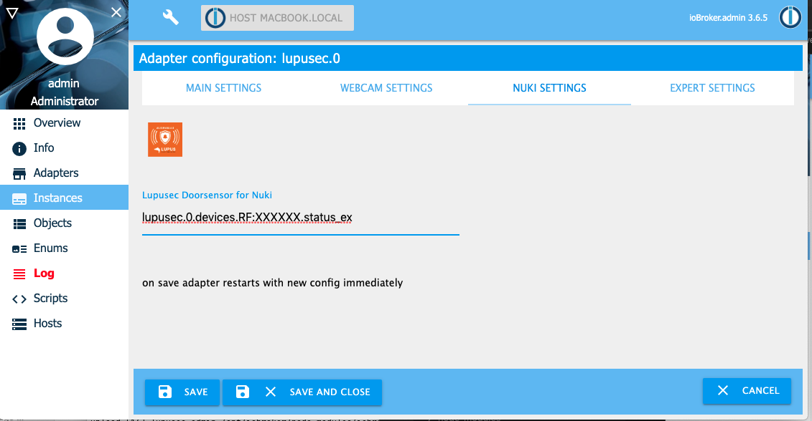
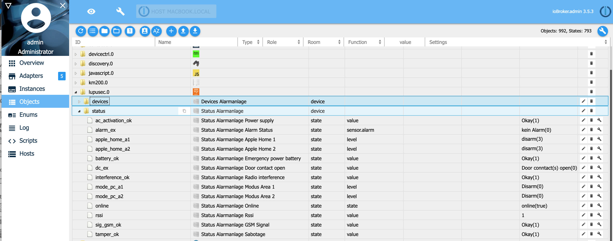
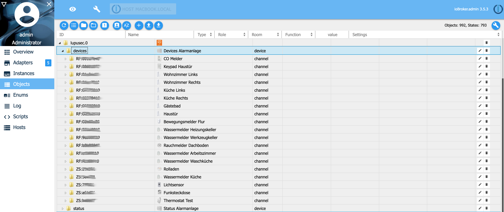
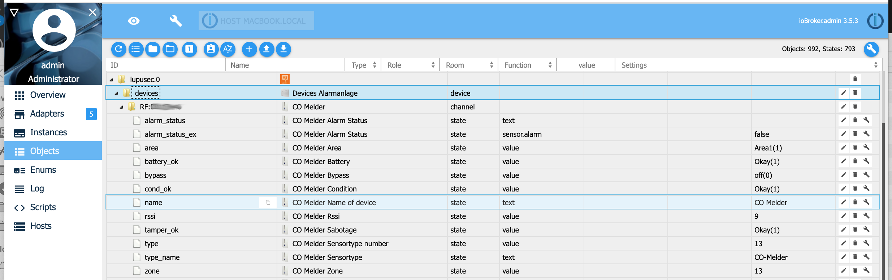
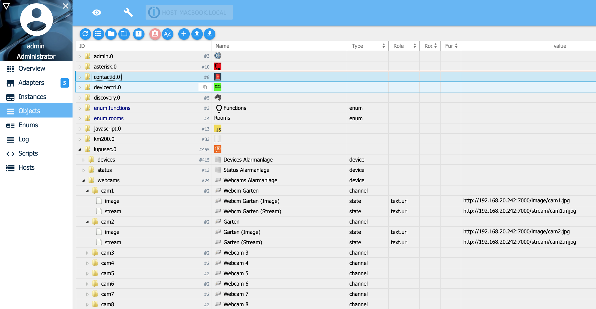
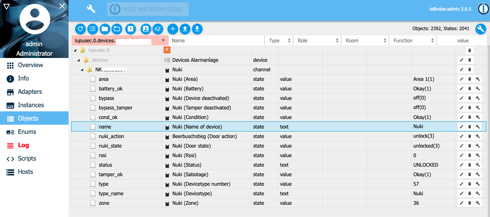
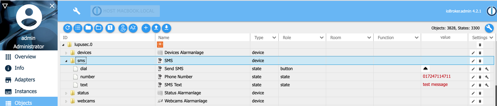

# ioBroker.lupusec

**Erfordert Node.js 20.0 oder höher und Admin v5!**

Dieser Adapter verbindet die Lupusec-Alarmanlagen XT1 Plus, XT2, XT2 Plus und XT3 mit ioBroker. Die XT1 (ohne Plus) wird nicht unterstützt. Sie können den Status der Lupusec-Sensoren (z. B. Tür-, Fenster-, Wasser- und Rauchmelder) sowie den Status der Alarmanlage auslesen. So können Sie beispielsweise Schalter betätigen, Rollläden steuern und die Alarmanlage scharf- bzw. unscharfschalten. Da der Adapter die Alarmanlage mehrmals abfragen muss, um alle Status- und Geräteinformationen zu erhalten, ist die CPU-Auslastung und der Speicherverbrauch hoch. Um die CPU-Auslastung zu reduzieren, können Sie das Abfrageintervall (polltime) erhöhen.

Detaillierte Informationen finden Sie hier: [Lupus](https://www.lupus-electronics.de/en)

## Installation

1. Installieren Sie den Adapter. Am einfachsten konfigurieren Sie den lupusec.iobroker-Adapter über den Discovery-Adapter in ioBroker. Dieser sucht automatisch die richtige IP-Adresse des Lupusec-Alarmsystems. Alternativ können Sie ihn auch manuell konfigurieren.

2. Manuelle Konfiguration des Adapters: Wählen Sie die IP-Adresse oder den Hostnamen und den Port des Lupusec-Alarmsystems. Wenn Sie HTTPS verwenden, aktivieren Sie das HTTPS-Flag. Die CPU-Auslastung ist mit HTTPS höher als ohne HTTP. Um den Status nur auszulesen, wählen Sie einen Benutzer ohne Schreibzugriff. Wenn Sie den Status ändern möchten (z. B. Licht ein-/ausschalten oder Alarm scharf-/unscharfschalten), wählen Sie einen Benutzer mit Schreibzugriff. Mit dem Parameter „polltime“ können Sie festlegen, wie oft das Alarmsystem abgefragt werden soll. Ein hoher Wert für „polltime“ reduziert die CPU-Auslastung.

    Wenn Sie Überwachungskameras an Ihr Lupusec-Alarmsystem angeschlossen haben, können Sie diese in ioBroker einbinden. Der Lupusec-Adapter erkennt alle Lupusec-Kameras automatisch. Sie müssen lediglich eine Adresse (Ihre ioBroker-IP-Adresse oder 0.0.0.0) und einen Port für die spätere Verbindung zu den Kameras angeben. Wenn Ihr Nuki-Türöffner mit Ihrer Lupusec-Alarmanlage verbunden ist, können Sie ihn auch über ioBroker steuern. Im Admin-Menü Ihrer ioBroker-Instanz können Sie den an der Nuki-Tür montierten Lupusec-Türsensor eingeben. Wenn Sie nun die Tür öffnen, an der der Nuki-Sensor angebracht ist, wird Ihnen zusätzlich der Status „Tür geöffnet“ anstelle von „Entriegelt“ angezeigt. Falls kein Lupusec-Türsensor an der Nuki-Tür installiert ist, werden Ihnen nur die Status „Verriegelt“ oder „Verschlossen“ angezeigt.

Standardmäßig werden alle Lupusec-Geräte auf der Registerkarte „ioBroker-Objekt“ angezeigt. Folgende Geräte werden vollständig unterstützt und individuell angepasst:

- Türkontakt / Fensterkontakt (Typ 4)
- Wassersensor (Typ 5)
- Panikknopf (Typ 7)
- Bewegungsmelder / 360-Grad-Bewegungsmelder (Typ 9)
- CO-Sensor (Typ 13)
- Rauchmelder / Wärmemelder (Typ 14)
- Temperatursensor V2 (Typ 20)
- Sirene im Innenraum (Typ 21)
- Statusanzeige / Mini-Innensirene (Typ 22)
- Netzschalter (Typ 24)
- 1-Kanal-Relais mit ZigBee-Repeater (Typ 24)
- 2-Kanal-Relais mit ZigBee-Repeater (Typ 24)
- Repater V2 (Typ 26)
- Tastatur (Typ 37)
- Glassensor (Typ 39)
- Sirene im Innenraum (Typ 45)
- Sirene im Außenbereich (Typ 48)
- Leistungsschalter-Messgerät (Typ 48)
- Stromzähler (Typ 50)
- Universeller IR-Controller (Typ 52)
- Raumsensor V1 (Typ 54)
- LCD-Temperatursensor (Typ 54)
- Mini-Temperaturanzeiger (Typ 54)
- Nuki Türöffner (Typ 57)
- Wärmemelder (Typ 58)
- Dimmer (Typ 66)
- Lichtschalter V2 (Typ 66)
- Farbton (Typ 74)
- Rollladenrelais V1 (Typ 76)
- Heizkörperthermostat (Typ 79)
- Heizkörperthermostat V2 (Typ 79)
- Lichtsensor (Typ 78)
- Szenario-Schalter V2 (Typ 81)
- Stoßsensor (Typ 93)
- Rauchmelder V2 (Typ 14)
- Unterputzrelais mit Dimmer V3 (Typ 66)
- Tastatur für den Außenbereich V2 (Typ 17)

Die beiden Zustände apple\_home\_a1 und lupusec.0.status.apple\_home\_a2 werden vom Apple HomeKit-Adapter yahka unterstützt. Zusätzlich zu den lupusec-Zuständen können Sie die Alarmanlage für Bereich 1 und 2 ein- und ausschalten.

Falls Sie ein Gerät besitzen, das nicht in der obigen Liste aufgeführt ist, kontaktieren Sie mich bitte unter Thorsten Stueben <thorsten@stueben.de> .

## Migration von Adapterversion 1.xx auf 2.xx

Wenn Sie Version 1.xx installiert haben und auf Version 2.0.0 oder höher wechseln möchten, müssen Sie die Lupusec-Instanz leider neu konfigurieren. Die alten Konfigurationswerte aus Version 1.xx werden nicht übernommen.

Dies liegt daran, dass die Konfigurationsschnittstelle komplett überarbeitet wurde.

Um die Einstellungen für das Nuki-Schloss vorzunehmen, müssen Sie zunächst Hostname, Benutzername und Passwort eingeben und anschließend speichern. Die Instanz wird nun neu gestartet. Sobald sie fehlerfrei gestartet ist, öffnen Sie die Instanzkonfiguration erneut. Sie können Ihr Nuki-Schloss nun auf der Registerkarte „Nuki“ konfigurieren.

## Objekte

### Lupusec-Status

ioBroker bietet Ihnen die gleichen Statusobjekte wie die Lupusec-App.

### Lupsec-Geräte

Alle unterstützten Lupsec-Sensoren und -Geräte finden Sie unter „Geräte“. Sollte ein Gerät fehlen, kontaktieren Sie mich bitte. Detailansicht eines Sensors oder Geräts. In diesem Beispiel sehen Sie den CO-Sensor. Bei einem CO-Alarm ändert sich der Status „alarm\_status\_ex“ auf „true“ und „alarm\_status“ auf „CO“.

### Lupose-Webcams

Alle angeschlossenen Überwachungskameras finden Sie unter „Webcams“. Sie können den im Status „Bild“ und „Stream“ angezeigten Link in Ihren Webbrowser kopieren und öffnen.

### Lupusec Nuki

Sie finden Ihren Nuki-Türöffner unter „Geräte“, ähnlich wie die Lupusec-Geräte. Der Nuki bietet zwei Zustände. Der Zustand „nuki\_state“ zeigt den aktuellen Status des Nuki-Türöffners an, z. B. ob die Tür verriegelt oder entriegelt ist. Mit dem Zustand „nuki\_action“ können Sie Ihre Tür öffnen, verriegeln oder entriegeln.\


### Lupusec SMS

Wenn Sie das Lupusec XT1+, XT2+ oder XT3 mit einer SMS-SIM-Karte verwenden, können Sie SMS mit folgenden Zuständen senden:

Alternativ können Sie SMS auch aus Ihrem JavaScript mit folgendem Befehl versenden:

```
sendTo('lupusec.0', 'sms', { number: '+4917247114711', text: 'Test message' });
```

Wenn Sie das SMS-Gateway verwenden, können Sie folgenden Befehl in Ihrem Skript verwenden:

```
sendTo('lupusec.0', 'smsgw', { number: '+4917247114711', text: 'Test message' });
```

## Fehlerbehebung

Falls beim Starten des Lupusec-Adapters die Fehlermeldung erscheint, dass das Alarmsystem nicht erreichbar ist, versuchen Sie bitte, das System von einem Terminalfenster Ihres ioBroker-Systems aus anzupingen.

```
ssh <user>@<iobroker-ip-address>
sudo -u iobroker ping <lupsec-ip-address>
```

Falls die Fehlermeldung _„ping: icmp open socket: Operation not permitted“_ erscheint, führen Sie bitte die folgenden Schritte aus und starten Sie anschließend den Lupusec-Adapter neu.

```
ls -l `which ping`
sudo chmod u+s `which ping`
```

## Geplant

Folgende Dinge sind für die Zukunft geplant:

- Unterstützung für mehr Sensoren/Geräte
- Eine [Dokumentation](/#/docs/adapterref/iobroker.lupusec/docs/en/info.md) für jeden Sensor/jedes Gerät erstellen

## Changelog

### **WORK IN PROGRESS**

- (Stübi) Checks actual_humidity value if it less 0% or greater 100%
- (Stübi) fixing issues detected by repository checker (Issue #126)
- (Stübi) node.js 24 will be supported (Issue #128)
- (Stübi) add IKEA poser supply

### 2.0.8 (2025-04-19)

- (Stübi) Performance optimization by pplling Lupusec alarm system (Issue #123)
- (Stübi) Add actual_temperature to type 20 Sensor (Issue #124)

### 2.0.7 (2025-02-23)

- (Stübi) Fixing @iobroker/adapter-dev 1.0.1 specified. 1.3.0 is required as minimum, 1.3.0 is recommended (Issue #115)
- (Stübi) Fixiing problem, that state value jumps back to old value (Issue #116)
- (Stübi) Delete status switch and add 3 butteons (shutter_up, shutter_down, shutter_stop) for shutter (Issue #116)
- (Stübi) Fixing dependency (Issue #117)

### 2.0.6 (2025-02-10)

- (Stübi) Minus temperature degrees will be shown now (Issue #113)
- (Stübi) Deletes unnecessary device objects (Issue #114)

### 2.0.5 (2025-02-01)

- (Stübi) Adjust datapoints hue, sat with step 1
- (Stübi) Fixed, that unused states will be not be shwon.

### 2.0.4 (2025-01-05)

- (Stübi) Adjustments of test and release yml
- (Stübi) Readme expanded to include migration instructions (Issue #97)
- (Stübi) Fixed error with HUE lights (Issue #104)
- (Stübi) Added the following values ​​for type 54: air pressure, wind strength, wind angle, wind gust, co2, wind speed
- (Stübi) Added for HUE the values mode (hue or temperature) and tempererature
- (Stübi) Added not used states will be not be shwon.
- (Stübi) Fixed value range for HUE to 0 to 360 degree, saturation from 0% to 100% and temperature from 2200 to 6500 kelvin

### 2.0.3 (2024-12-29)

- (Stübi) Adjustments due to migration from ESLint 8x≤ to 9.x.x (Issue #91)
- (Stübi) Redesign - changed everything from JavaScript to TypeScript
- (Stübi) Using axios for http requests
- (Stübi) the configuration changed. You have to edit the configuration
- (Stübi) js-controller in version 6 and 7 will be supported (Issue #83, #84, #95)
- (Stübi) nodejs 20 and nodejs 22 will be suported (Issue #87)

## License

The MIT License (MIT)

Copyright (c) 2025 Thorsten Stueben <thorsten@stueben.de>

Permission is hereby granted, free of charge, to any person obtaining a copy
of this software and associated documentation files (the "Software"), to deal
in the Software without restriction, including without limitation the rights
to use, copy, modify, merge, publish, distribute, sublicense, and/or sell
copies of the Software, and to permit persons to whom the Software is
furnished to do so, subject to the following conditions:

The above copyright notice and this permission notice shall be included in
all copies or substantial portions of the Software.

THE SOFTWARE IS PROVIDED "AS IS", WITHOUT WARRANTY OF ANY KIND, EXPRESS OR
IMPLIED, INCLUDING BUT NOT LIMITED TO THE WARRANTIES OF MERCHANTABILITY,
FITNESS FOR A PARTICULAR PURPOSE AND NONINFRINGEMENT. IN NO EVENT SHALL THE
AUTHORS OR COPYRIGHT HOLDERS BE LIABLE FOR ANY CLAIM, DAMAGES OR OTHER
LIABILITY, WHETHER IN AN ACTION OF CONTRACT, TORT OR OTHERWISE, ARISING FROM,
OUT OF OR IN CONNECTION WITH THE SOFTWARE OR THE USE OR OTHER DEALINGS IN
THE SOFTWARE.