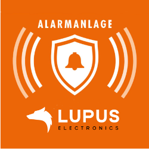
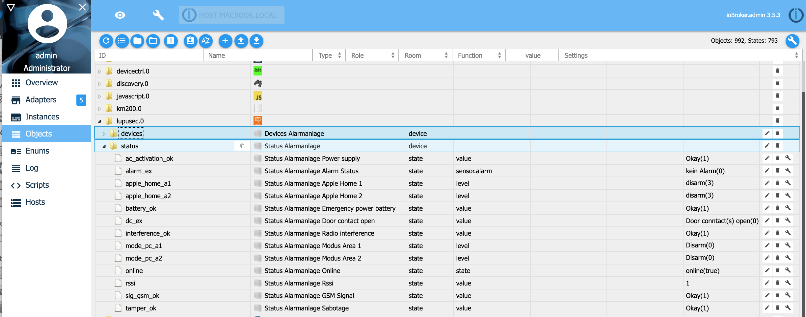

# IoBroker.lupusec
**Erfordert node.js 18.0 oder höher und Admin v5!**

Dieser Adapter verbindet das Lupusec Alarmsystem XT1 Plus, XT2, XT2 Plus und XT3 mit ioBroker.
Der XT1 (ohne Plus) wird nicht unterstützt. Sie können den Status der Lupusec-Sensoren wie Tür-, Fenster-, Wasser- und Rauchsensoren sowie den Status des Alarmsystems ablesen.
Sie können beispielsweise Schalter betätigen, Ihren Rollladen steuern und die Alarmanlage aktivieren/deaktivieren.
Da der Adapter das Alarmsystem einige Male aufrufen muss, um alle Status- und Geräteinformationen zu erhalten, ist die CPU-Auslastung und der Speicherverbrauch hoch. Um die CPU-Last zu verringern, können Sie die Pollzeit erhöhen.

Detaillierte Informationen finden Sie hier: [Lupus](https://www.lupus-electronics.de/en)

## Installation
1. Installieren Sie den Adapter

   Am einfachsten ist es, den lupusec.iobroker-Adapter über den Discovery-Adapter in ioBroker zu konfigurieren. Der Discovery-Adapter sucht nach der richtigen IP-Adresse des Lupusec-Alarmsystems. Die andere Möglichkeit besteht darin, es manuell zu konfigurieren

2. Manuelle Konfiguration des Adapters

Wählen Sie die IP-Adresse oder den Hostnamen und den Port aus dem Lupusec-Alarmsystem. Wenn Sie https verwenden, aktivieren Sie das https-Flag. Die CPU-Last ist höher, wenn https ohne http installiert wird.
Um den Status nur zu lesen, wählen Sie einen Benutzer ohne Schreibzugriff aus. Wenn Sie den Status ändern möchten (z. B. das Licht ein-/ausschalten oder den Alarm aktivieren/deaktivieren), wählen Sie einen Benutzer mit Schreibzugriff aus.
Mit polltime können Sie konfigurieren, wie oft das Alarmsystem aufgerufen werden soll. Eine hohe Pollzeit verringert die CPU-Last.

 Wenn Sie Überwachungskameras an Ihr Lupusec-Alarmsystem angeschlossen haben, können Sie diese in ioBroker bereitstellen. Der Lupusec-Adapter findet selbstständig alle Lupusec-Cams. Sie müssen eine Adresse (Ihre ioBroker-IP-Adresse oder 0.0.0.0) und einen Port eingeben, um später eine Verbindung zu den Kameras herzustellen.
 Wenn Sie Ihren Nuki-Türöffner mit Ihrer Lupusec-Alarmanlage verbunden haben, können Sie ihn auch über ioBroker nutzen. Im Admin-Menü der ioBroker-Instanz können Sie Ihren Lupusec-Türsensor eingeben, der an der Nuki-Tür montiert ist. Öffnet man nun die Tür, an der das Nuki montiert ist, erhält man zusätzlich den Status „Tür geöffnet“ statt nur „entriegelt“. Wenn Sie keinen Lupusec-Türsensor an der Nuki-Tür haben, werden Ihnen nur die Zustände „verriegelt“ oder „verriegelt“ angezeigt.


Standardmäßig werden alle Lupusec-Geräte auf der ioBroker-Objektregisterkarte angezeigt.
Vollständig unterstützt und individuell angepasst werden folgende Geräte:

- Türkontakt / Fensterkontakt (Typ 4)
- Wassersensor (Typ 5)
- Panikknopf (Typ 7)
- Bewegungsmelder / 360-Grad-Bewegungsmelder (Typ 9)
- CO-Sensor (Typ 13)
- Rauchmelder / Wärmemelder (Typ 14)
- Temperatursensor V2 (Typ 20)
- Sirene innen (Typ 21)
- Statusanzeige / Mini-Innensirene (Typ 22)
- Netzschalter (Typ 24)
- 1-Kanal-Relais mit ZigBee-Repeater (Typ 24)
- 2-Kanal-Relais mit ZigBee-Repeater (Typ 24)
- Repater V2 (Typ 26)
- Tastatur (Typ 37)
- Glassensor (Typ 39)
- Sirene innen (Typ 45)
- Sirene außen (Typ 48)
- Leistungsschaltermessgerät (Typ 48)
- Stromzähler (Typ 50)
- Universeller IR-Controller (Typ 52)
- Raumfühler V1 (Typ 54)
- LCD-Temperatursensor (Typ 54)
- Minitemperatur (Typ 54)
- Nuki Türöffner (Typ 57)
- Wärmemelder (Typ 58)
- Dimmer (Typ 66)
- Lichtschalter V2 (Typ 66)
- Farbton (Typ 74)
- Rollladenrelais V1 (Typ 76)
- Heizkörperthermostat (Typ 79)
- Heizkörperthermostat V2 (Typ 79)
- Lichtsensor (Typ 78)
- Szenarioschalter V2 (Typ 81)
- Stoßsensor (Typ 93)
- Rauchmelder V2 (Typ 14)
- Unterputzrelais mit Dimmer V3 (Typ 66)
- Keypad Outdoor V2 (Typ 17)

Die beiden Zustände apple_home_a1 und lupusec.0.status.apple_home_a2 werden für den Apple Homekit-Adapter yahka unterstützt. Sie können zusätzlich zu den Lupusec-Zuständen die Alarmanlage für Bereich 1 und 2 ein- und ausschalten.

Sollten Sie ein Gerät besitzen, das in der obigen Liste nicht aufgeführt ist, kontaktieren Sie mich bitte unter Thorsten Stueben <thorsten@stueben.de>.

## Objekte
### Lupusec-Status
ioBroker bietet Ihnen die gleichen Statusobjekte wie in der Lupusec-App.


### Lupusec-Geräte
Unter „Geräte“ finden Sie alle unterstützten Lupsec-Sensoren und -Geräte. Sollte ein Gerät fehlen, kontaktieren Sie mich bitte.
 Detailansicht eines Sensors oder Geräts. In diesem Beispiel sehen Sie den CO-Sensor. Bei einem CO-Alarm ändert sich der Status „alarm_status_ex“ in „true“ und „alarm_status“ in „CO“.


### Lupusec-Webcams
Unter „Webcams“ finden Sie alle angeschlossenen Überwachungskameras. Sie können den im Status „Bild“ und „Stream“ bereitgestellten Link zum Öffnen in Ihren Webbrowser kopieren.


### Lupusec Nuki
Du findest deinen Nuki Türöffner unter „Geräte“ wie den Lupusec-Geräten. Das Nuki bietet 2 Zustände. Der Status nuki_state zeigt Ihnen den aktuellen Zustand des Nuki Türöffners an, z. B. ob die Tür verriegelt oder entriegelt ist. Mit dem Status nuki_action kannst du deine Tür öffnen, verriegeln oder entriegeln.


### Lupusec SMS
Wenn Sie das Lupusec XT1+, XT2+ oder XT3 mit einer SMS-SIM-Karte verwenden, können Sie SMS mit folgenden Zuständen versenden: 

Alternativ können Sie mit dem folgenden Befehl SMS aus Ihrem JavaScript senden:

```
sendTo('lupusec.0', 'sms', { number: '+4917247114711', text: 'Test message' });
```

Wenn Sie das SMS-Gateway verwenden, können Sie den folgenden Befehl in Ihrem Skript verwenden:

```
sendTo('lupusec.0', 'smsgw', { number: '+4917247114711', text: 'Test message' });
```

## Fehlerbehebung
Wenn Sie den Lupusec-Adapter starten und die Fehlermeldung erhalten, dass das Alarmsystem nicht erreichbar ist, versuchen Sie bitte, das System über ein Terminalfenster Ihres ioBroker-Systems anzupingen.

```
ssh <user>@<iobroker-ip-address>
sudo -u iobroker ping <lupsec-ip-address>
```

Wenn Sie den Fehler _ping: icmp open socket: Operation not erlaubt_ erhalten, gehen Sie bitte wie folgt vor und starten Sie anschließend den Lupusec-Adapter erneut.

```
ls -l `which ping`
sudo chmod u+s `which ping`
```

## Geplant
Folgende Dinge sind für die Zukunft geplant:

- Unterstützung weiterer Sensoren / Geräte
- Schreiben einer [Dokumentation](docs/en/info.md) für jeden Sensor/Gerät

## Changelog

### 2.0.0 (06.01.2023)

-   (Stübi) Redesign - changed everything from JavaScript to TypeScript
-   (Stübi) Using axios for http requests
-   (Stübi) the configuration changed. You have to edit the configuration

## License

The MIT License (MIT)

Copyright (c) 2024 Thorsten Stueben <thorsten@stueben.de>

Permission is hereby granted, free of charge, to any person obtaining a copy
of this software and associated documentation files (the "Software"), to deal
in the Software without restriction, including without limitation the rights
to use, copy, modify, merge, publish, distribute, sublicense, and/or sell
copies of the Software, and to permit persons to whom the Software is
furnished to do so, subject to the following conditions:

The above copyright notice and this permission notice shall be included in
all copies or substantial portions of the Software.

THE SOFTWARE IS PROVIDED "AS IS", WITHOUT WARRANTY OF ANY KIND, EXPRESS OR
IMPLIED, INCLUDING BUT NOT LIMITED TO THE WARRANTIES OF MERCHANTABILITY,
FITNESS FOR A PARTICULAR PURPOSE AND NONINFRINGEMENT. IN NO EVENT SHALL THE
AUTHORS OR COPYRIGHT HOLDERS BE LIABLE FOR ANY CLAIM, DAMAGES OR OTHER
LIABILITY, WHETHER IN AN ACTION OF CONTRACT, TORT OR OTHERWISE, ARISING FROM,
OUT OF OR IN CONNECTION WITH THE SOFTWARE OR THE USE OR OTHER DEALINGS IN
THE SOFTWARE.