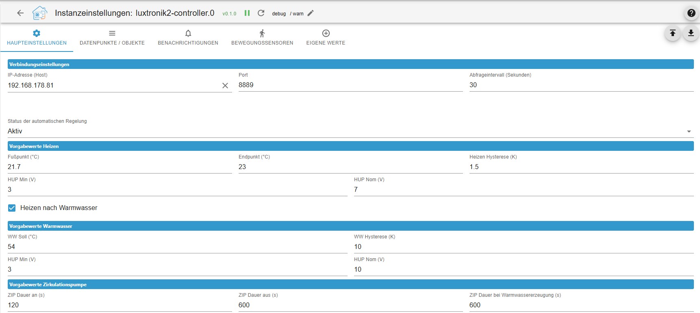
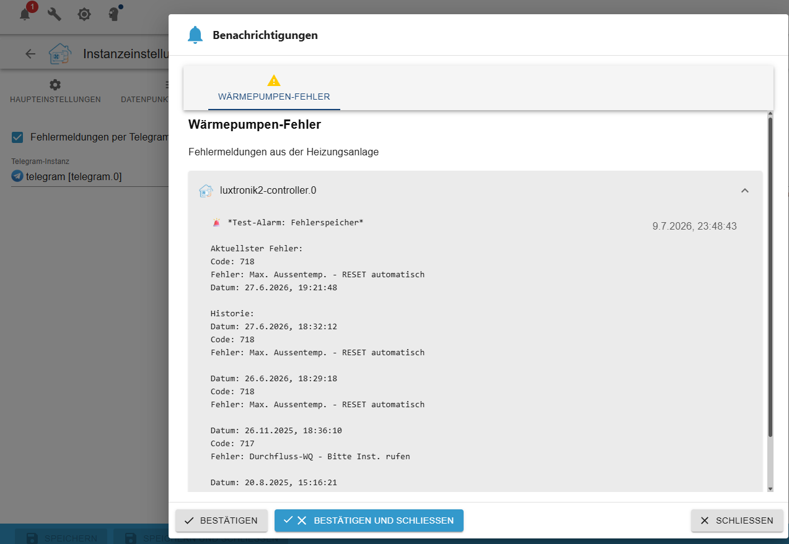

# ioBroker.luxtronik2-Controller

## luxtronik2-Controller-Adapter für ioBroker

Dieser ioBroker-Adapter ermöglicht die lokale Steuerung und Überwachung von Wärmepumpen mit [Luxtronik 2.x-Reglern](https://www.alpha-innotec.com/en/products/accessories/control/luxtronik) (z. B. Alpha Innotec, Novelan). Der Adapter ist vollständig in TypeScript geschrieben.

## Danksagungen & Geschichte

Dieses Projekt baut auf den Vorarbeiten bestehender Open-Source-Projekte auf. Besonderer Dank gilt:

[Bouni](https://github.com/bouni/luxtronik-2) , dessen Pionierarbeit und Codeentwicklungen die wesentliche Grundlage für die Kommunikation mit Luxtronik-Steuerungen bilden.

[Coolchip:](https://github.com/coolchip/luxtronik2) Für das grundlegende Reverse Engineering des Luxtronik-Netzwerkprotokolls.

[UncleSamSwiss:](https://github.com/UncleSamSwiss/ioBroker.luxtronik2) Für den originalen ioBroker-Adapter.

Neuerungen dieser Version: Der luxtronik2-Controller integriert nativ die TCP-Kommunikation (Port 8888/8889) und benötigt keine externen Bibliotheken. Zusätzlich wurden Steuerungsmakros, eine Logik zum Schutz des Kompressors und eine automatisierte Datenpunktverwaltung implementiert.

## Merkmale

- Native TCP-Kommunikation: Direkte Verbindung zur Wärmepumpe ohne zusätzlichen Aufwand.

- Kompressorschutz (Zyklusoptimierung): Zusammenlegung von Heiz- und Warmwasserzyklen zur Reduzierung der Kompressorstarts.

- Integrierte Aktionen (Makros): Vordefinierte Steuerungslogiken für Zwangsheizung, Warmwasseranforderungen und die Umwälzpumpe (ZIP) inkl. automatischer Rückfallfunktion auf Standardwerte.

- Benutzerdefinierte Datenpunkte: Messwerte (Index 3004) und Parameter (Index 3003) können über die Adapterkonfiguration hinzugefügt werden. Unix-Zeitstempel werden automatisch formatiert.

- Automatische Objektverwaltung: Abgewählte oder gelöschte Datenpunkte und leere Ordnerstrukturen werden beim Neustart des Adapters automatisch aus ioBroker entfernt.

- Benachrichtigungssystem: Fehlercodes der Wärmepumpe können direkt an Telegram oder das ioBroker-Benachrichtigungssystem gesendet werden.

- Bewegungsmelderkopplung: Option zur bedarfsgesteuerten Aktivierung der Umwälzpumpe über vorhandene ioBroker-Bewegungssensoren.

## ⚠️ Warnung

Einige Einstellungen dieser Integration können die Leistung Ihrer Wärmepumpe beeinträchtigen. Fehlkonfigurationen können dazu führen, dass der Regler in einen Fehlerzustand wechselt, der einen manuellen Reset vor Ort erfordert.

Dieses Projekt dient dem Schutz Ihrer Wärmepumpe, indem die Konfigurationsoptionen auf sichere Werte beschränkt werden. Dennoch kann keine Garantie gegeben werden. Bitte seien Sie vorsichtig, konsultieren Sie Ihr Luxtronik-Handbuch und ändern Sie keine Einstellungen, die Sie nicht vollständig verstehen.

## 🔧 Kompatibilität

Die Integration ermöglicht die Überwachung und Steuerung von Wärmepumpen mit einem Luxtronik2-Regler. Sie funktioniert lokal ohne Internetverbindung. Sie wurde und wird mit einer LWD50A (LD5) von Alpha Innotec getestet.

## ⚠️ Haftungsausschluss / Haftungsausschluss ⚠️

Dieses Projekt steht in keinerlei Verbindung zu Alpha Innotec, Novelan, ait-deutschland GmbH oder anderen Herstellern. Es handelt sich um ein privates Open-Source-Projekt, das in der Freizeit entwickelt und gepflegt wird. Die Nutzung des Adapters erfolgt auf eigene Gefahr.

_Dieses Projekt steht in keiner Verbindung zu Alpha Innotec, Novelan, ait-deutschland GmbH oder anderen Unternehmen. Es handelt sich um ein privates Projekt, das in der Freizeit gepflegt wird. Die Nutzung erfolgt auf eigene Gefahr._

„project\_disclaimer“: „Dieses Projekt wurde nicht mit Alpha Innotec, Novelan, ait-deutschland GmbH und anderen Herstellern in Verbindung gebracht.

„project\_disclaimer“: „Dieses Projekt ist derzeit nicht mit Alpha Innotec, Novelan, der ait-deutschland GmbH oder einem anderen Hersteller verbunden. Es wurde ein Open-Source-Projekt privat entwickelt und zeitweilig kostenlos gepflegt. Die Verwendung des Adapters ist für Sie selbst riskant.“

„project\_disclaimer“: „Dieses Projekt ist derzeit nicht mit Alpha Innotec, Novelan, der ait-deutschland GmbH oder einem anderen Hersteller verbunden. Es wurde ein Open-Source-Projekt privat entwickelt und zeitweilig kostenlos gepflegt. Die Verwendung des Adapters ist für Sie selbst riskant.“

„project\_disclaimer“: „Dieses Projekt ist nicht vollständig mit Alpha Innotec, Novelan, ait-deutschland GmbH oder anderen Herstellern verbunden.

„project\_disclaimer“: „Zehn Projekte wurden bisher nicht von Alpha Innotec, Novelan, der ait-deutschland GmbH und anderen Herstellern angeboten. Es handelt sich um Open-Source-Projekte, die mit der Qualität von Open-Source-Projekten ausgestattet sind. Der Adapter ist nicht mehr verfügbar odpowiedzialność.“

„project\_disclaimer“: „Dieses Projekt ist nicht mit Alpha Innotec, Novelan, ait-deutschland GmbH oder einem anderen Hersteller verbunden.

„project\_disclaimer“: „Dieses Projekt wurde noch nicht von den Unternehmen Alpha Innotec, Novelan, ait-deutschland GmbH oder anderen Herstellern bearbeitet. Dieses Projekt wurde geschlossen исходным кодом, который wird innerhalb kürzester Zeit zerlegt und aktualisiert. Die Verwendung des Adapters kann auf eigene Gefahr und Gefahr erfolgen.

„project\_disclaimer“: „Dieses chinesische Projekt wurde nicht von Alpha Innotec, Novelan, ait-deutschland GmbH und anderen Herstellern erstellt розробляється та Sie erhalten eine volle Stunde. Der Adapter wird aufgrund der Gefahr einer Überhitzung verwendet.

„project\_disclaimer“: „Dieses chinesische Projekt wurde nicht von Alpha Innotec, Novelan, ait-deutschland GmbH und anderen Herstellern erstellt розробляється та Sie erhalten eine volle Stunde. Der Adapter wird aufgrund der Gefahr einer Überhitzung verwendet.

## Fehler melden & Mitwirken

Fehlerberichte, Kompatibilitätshinweise für bestimmte Firmware-Versionen oder Funktionsanfragen können über den Issue-Tracker im [GitHub-Repository](https://github.com/TbsJah/ioBroker.luxtronik2-controller/issues) eingereicht werden.

## Information

[Info Deutsch](/#/docs/adapterref/iobroker.luxtronik2-controller/documentation/readme_de.md)

[Info Englisch](/#/docs/adapterref/iobroker.luxtronik2-controller/documentation/readme_en.md)

## Changelog

// ### **WORK IN PROGRESS**
### 0.8.1 (2026-09-19)

- Resolve issues which are reported by repository checker

### 0.8.0 (2026-09-14)

**🚀 Features & Enhancements**

- **[Admin UI]** Completely redesigned the adapter configuration interface (`jsonConfig.json`). Settings are now cleanly organized into logical tabs (Connection, Cycle Optimization, Idle Defaults, HUP, Circulation pump, etc.).
- **[HUP Control]** Added a new dynamic hardware voltage scale factor for the heating circulating pump (HUP). Users can now toggle between factor 100 (for Firmware V2.x) and factor 10 (for Firmware V3.x) to ensure full compatibility across different hardware generations.
- **[Safety]** Added a confirmation warning dialog to the Admin UI that alerts users to the importance of entering correct values when enabling "Force default values during idle".

**🐛 Bugfixes**

- **[HUP Control]** Fixed an incorrect conversion factor for registers 867 and 868 (nominal and minimal HUP voltage). This previously caused newer setups (like the Alpha Innotec LWCV series with FW V3.x) to calculate 1.0V instead of 10.0V, resulting in continuous "less than min" boundary warnings in the ioBroker log.

**🛠 Refactoring & Under the Hood**

- **[Architecture]** Extracted the heating circulating pump (HUP) logic from `main.ts` into a dedicated, isolated `hupManager.ts` file to improve code modularity and maintainability.
- **[CI/CD]** Added Node.js 26 to the GitHub Actions test matrix (`test-and-release.yml`) to ensure future compatibility.
- **[TypeScript]** Added the `"rootDir": "./src"` compiler option to `tsconfig.json` to resolve TS5011 build errors with newer TypeScript versions.

### 0.7.3 (2026-09-07)

**Bugfixes**
-(Fixed) Timer Table Register Conflict: Resolved conflicting Luxtronik register IDs for Domestic Hot Water (DHW) Monday–Sunday schedules (WW_MoSo_Start1 to End5). These were previously mapped to registers 507–516 (colliding with Circulation timer registers) and have now been corrected to registers 406–415.

-(Fixed) Time-String Conversion on State Change: Fixed a parsing bug where manual updates to time strings (HH:MM / HH:MM:SS) on states marked with isDurationFormat or time-related roles were passed directly as strings instead of converting to seconds since midnight, preventing user-entered schedule values from persisting in the controller.

### 0.7.2 (2026-09-07)

**Bugfixes**

- (Fixed) Unintended Configuration Overwrites: Fixed a critical architectural flaw where the adapter blindly forced default values (e.g., hot water target temperature, heating curve) to the heat pump on every startup. The adapter is now 100% passive (read-only) upon installation until features are explicitly enabled.

- (Fixed) Strict Opt-In Logic: All internal condition checks for background automations (cycle optimization, ZIP optimization, idle resets) were refactored to strict opt-in logic (=== true), preventing unintended actions when settings have never been saved.

- (Fixed) Live Toggle for Cycle Optimization: Fixed an issue where the ioBroker switch Actions.Regelung_Aktiv was ignored during runtime. The optimization loop now evaluates this switch dynamically, allowing users to toggle the feature live via their dashboard.

- (Fixed) Hardware ZIP Timer Disable: Fixed a bug where a mismatched configuration key (zip_hardware_timer_disable instead of zip_lWP_aktiv) prevented the adapter from correctly disabling the hardware circulation pump timer for flash memory protection.

- (Fixed) "Heating after hot water" Reset: Restored missing logic that properly resets the "Heating after water" status back to false at the end of a cycle, preventing the system from getting stuck in this mode.

**Features & Change**

- (Changed) Forced DHW Safety Limit: Reduced the internal safety limit for temporary hot water target adjustments during forced DHW runs from 75°C to 70°C to better protect the system's high-pressure switch.

### 0.7.1 (2026-09-07)

**Bugfixes**

- (Fixed) Status Display: Fixed a logical evaluation bug where the operating state "Heating" (Code 0) was incorrectly overwritten and displayed as "No demand" (Code 5). Thanks to @michiproep for reporting!

- (Fixed) Temperature Values: Fixed a related issue where temperature readings of exactly 0 °C (e.g., average temperature, return target temperature, cooling release) were incorrectly replaced by internal fallback values (e.g., 1.5 °C).

## License

MIT License

Copyright (c) 2026 TbsJah <github.tbsjah@googlemail.com>

Permission is hereby granted, free of charge, to any person obtaining a copy
of this software and associated documentation files (the "Software"), to deal
in the Software without restriction, including without limitation the rights
to use, copy, modify, merge, publish, distribute, sublicense, and/or sell
copies of the Software, and to permit persons to whom the Software is
furnished to do so, subject to the following conditions:

The above copyright notice and this permission notice shall be included in all
copies or substantial portions of the Software.

THE SOFTWARE IS PROVIDED "AS IS", WITHOUT WARRANTY OF ANY KIND, EXPRESS OR
IMPLIED, INCLUDING BUT NOT LIMITED TO THE WARRANTIES OF MERCHANTABILITY,
FITNESS FOR A PARTICULAR PURPOSE AND NONINFRINGEMENT. IN NO EVENT SHALL THE
AUTHORS OR COPYRIGHT HOLDERS BE LIABLE FOR ANY CLAIM, DAMAGES OR OTHER
LIABILITY, WHETHER IN AN ACTION OF CONTRACT, TORT OR OTHERWISE, ARISING FROM,
OUT OF OR IN CONNECTION WITH THE SOFTWARE OR THE USE OR OTHER DEALINGS IN THE
SOFTWARE.