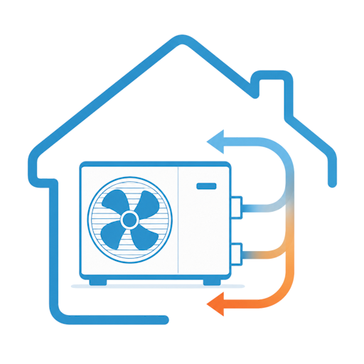
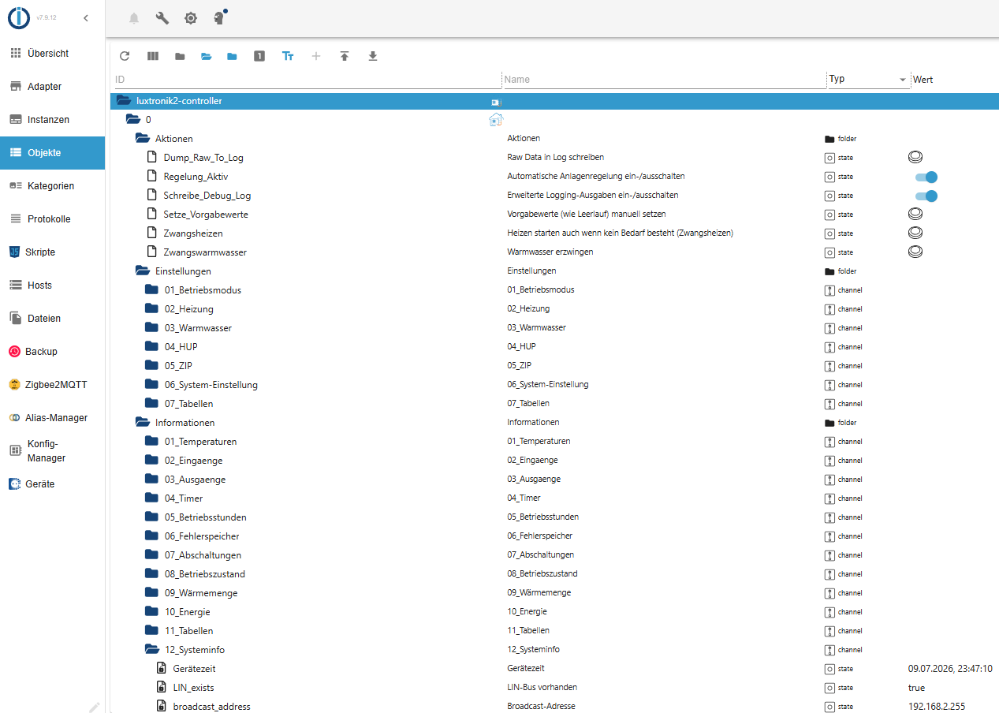
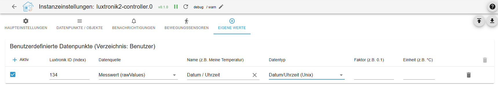

# ioBroker.luxtronik2-Controller

## luxtronik2-Controller-Adapter für ioBroker

Dieser ioBroker-Adapter ermöglicht die lokale Steuerung und Überwachung von Wärmepumpen mit [Luxtronik 2.x-Reglern](https://www.alpha-innotec.com/en/products/accessories/control/luxtronik) (z. B. Alpha Innotec, Novelan). Der Adapter ist vollständig in TypeScript geschrieben.

## Danksagungen & Geschichte

Dieses Projekt baut auf den Vorarbeiten bestehender Open-Source-Projekte auf. Besonderer Dank gilt:

[Bouni](https://github.com/bouni/luxtronik-2) , dessen Pionierarbeit und Codeentwicklungen die wesentliche Grundlage für die Kommunikation mit Luxtronik-Steuerungen bilden.

[Coolchip:](https://github.com/coolchip/luxtronik2) Für das grundlegende Reverse Engineering des Luxtronik-Netzwerkprotokolls.

[UncleSamSwiss:](https://github.com/UncleSamSwiss/ioBroker.luxtronik2) Für den originalen ioBroker-Adapter.

Neuerungen dieser Version: Der luxtronik2-Controller integriert nativ die TCP-Kommunikation (Port 8888/8889) und benötigt keine externen Bibliotheken. Zusätzlich wurden Steuerungsmakros, eine Logik zum Schutz des Kompressors und eine automatisierte Datenpunktverwaltung implementiert.

### Merkmale

- **Native TCP-Kommunikation:** Direkte Verbindung zur Wärmepumpe ohne zusätzlichen Aufwand.
- **Kompressorschutz (Zyklusoptimierung):** Intelligente Zusammenführung von Heizungs- und Warmwasserzyklen zur deutlichen Reduzierung der Kompressorstarts.
- **Dynamische HUP-Steuerung:** Automatische Spannungsanpassung der Heizungsumwälzpumpe (HUP) auf Basis der Vor- und Rücklauftemperaturdifferenz für maximale Effizienz.
- **Integrierte Aktionen (Makros):** Vordefinierte Steuerungslogik für Zwangsheizung, Warmwasseranforderungen und die Umwälzpumpe (ZIP) – einschließlich eines automatischen Rückfalls auf sichere Standardwerte.
- **Bedarfsgesteuerte Zirkulation (ZIP):** Steuern Sie Ihre Zirkulationspumpe über vorhandene ioBroker-Bewegungssensoren oder direkt über externe Aktoren (z. B. Shelly) – ganz ohne Hardwareänderungen an der Wärmepumpe.
- **Benutzerdefinierte Datenpunkte:** Messwerte (Index 3004) und Parameter (Index 3003) lassen sich flexibel über die Adapterkonfiguration hinzufügen. Unix-Zeitstempel werden automatisch in lesbare Formate umgewandelt.
- **Erweiterte Statusmeldungen und Berechnungen:** Live-Berechnung der Temperaturverteilung, der thermischen Energie und detaillierte Textausgaben der aktuellen Systemzustände (einschließlich Offsets, Frostschutz und Kühlstatus).
- **Intelligentes Benachrichtigungssystem:** Fehlercodes und kritische Abschaltungen (z. B. Probleme mit der Durchflussrate) werden direkt an Telegram oder das ioBroker-Benachrichtigungssystem gesendet – inklusive Schutz vor Cooldown-Spam.
- **Automatisierte DTA-Datensicherung:** Geplante Downloads von DTA-Diagnoseprotokollen direkt von der Wärmepumpe in Ihren ioBroker-Speicher zur einfachen Analyse (z. B. in OpenDTA).
- **Automatische Objektverwaltung:** Abgewählte oder gelöschte Datenpunkte sowie leere Ordnerstrukturen werden beim Neustart des Adapters automatisch und sauber aus ioBroker entfernt.
- **Breite Kompatibilität:** Vollständige Unterstützung für ältere (V2.x) und neuere (V3.x) Firmware-Generationen (z. B. Alpha Innotec, Novelan) unter Verwendung dynamischer Skalierungsfaktoren.

## ⚠️ Warnung

Einige Einstellungen dieser Integration können die Leistung Ihrer Wärmepumpe beeinträchtigen. Fehlkonfigurationen können dazu führen, dass der Regler in einen Fehlerzustand wechselt, der einen manuellen Reset vor Ort erfordert.

Dieses Projekt dient dem Schutz Ihrer Wärmepumpe, indem die Konfigurationsoptionen auf sichere Werte beschränkt werden. Dennoch kann keine Garantie gegeben werden. Bitte seien Sie vorsichtig, konsultieren Sie Ihr Luxtronik-Handbuch und ändern Sie keine Einstellungen, die Sie nicht vollständig verstehen.

## 🔧 Kompatibilität

Die Integration ermöglicht die Überwachung und Steuerung von Wärmepumpen mit einem Luxtronik2-Regler. Sie funktioniert lokal ohne Internetverbindung. Sie wurde und wird mit einem LWD50A (LD5) von Alpha Innotec getestet. Sie wird unter anderem von folgenden Herstellern eingesetzt:

- Alpha Innotec,
- Siemens,
- Novelan,
- Roth,
- Elco,
- Buderus,
- Nibe,
- Wolf Heiztechnik.

## ⚠️ Haftungsausschluss ⚠️

_Dieses Projekt steht in keiner Verbindung zu Alpha Innotec, Novelan, ait-deutschland GmbH oder anderen Unternehmen. Es handelt sich um ein privates Projekt, das in der Freizeit gepflegt wird. Die Nutzung erfolgt auf eigene Gefahr._

## Fehler melden & Mitwirken

Fehlerberichte, Kompatibilitätshinweise für bestimmte Firmware-Versionen oder Funktionsanfragen können über den Issue-Tracker im [GitHub-Repository](https://github.com/TbsJah/ioBroker.luxtronik2-controller/issues) eingereicht werden.

## Information

[Info Deutsch](/#/docs/adapterref/iobroker.luxtronik2-controller/documentation/readme_de.md)

[Info Englisch](/#/docs/adapterref/iobroker.luxtronik2-controller/documentation/readme_en.md)

## Changelog

// ### **WORK IN PROGRESS**
### 0.13.1 (2026-10-02)

- **Fix (Circulation/ZIP):** Fixed a bug where the `Virtual_ZIP_Status` datapoint would remain stuck on `true` when using external relays (e.g., Shelly), even though the hardware relay was correctly turned off. The state reset logic has been decoupled and is now guaranteed to execute, ensuring the ioBroker interface stays perfectly synchronized with the actual hardware state.

### 0.13.0 (2026-10-02)

- **Bugfixes:**
    - **Critical DHW Target Fix:** Fixed an issue where the hot water target temperature was incorrectly written to parameter 2 instead of 105. This resolves unexpected temperature jumps (e.g., to 65°C) and socket timeouts on various heat pump models.
    - **Write Queue Timeout:** Added a maximum wait timeout to the write queue lock for legacy V1.x firmware to prevent potential infinite loops during read-write collisions.
    - **Backup Manager Multi-Instance Fix:** The automated DTA backup cron job is now safely scoped to the specific adapter instance, preventing conflicts when running multiple heat pumps on the same ioBroker host.
- **Under the Hood / Refactoring:**
    - **Centralized Typings:** Completely refactored the TypeScript architecture by introducing a centralized `LuxtronikAdapter` interface (`types.ts`). Replaced all fragmented, local interfaces across sub-modules to ensure strict, project-wide type safety and better maintainability.

### 0.12.1 (2026-09-30)

- **Bugfixes:**
    - **Fixed Null-Values on Startup:** Virtual states for the circulation pump logic (`Actions.Activate_Zip` and `03_Outputs.Virtual_ZIP_Status`) are now explicitly initialized to `false` during adapter startup. This prevents undefined `null` values in the object tree, ensuring immediate compatibility with visualizations and logic scripts (like Blockly) right from the first second.

### 0.12.0 (2026-09-30)

- **⚠️ BREAKING CHANGE:**
    - The datapoint to manually trigger the circulation pump macro (`Activate_Zip`) has been moved from the `Settings` folder to the `Actions` folder for better UX. If you use this state in your scripts or visualizations, please update the datapoint path!

- **Features & Improvements:**
    - **Virtual Circulation Pump (ZIP) Status:** Added a new read-only indicator datapoint (`Virtual_ZIP_Status`) in the `03_Outputs` folder. This datapoint mirrors the true state of the adapter's intelligent circulation pump macro in real-time. This is highly beneficial for users controlling the ZIP via external smart relays (e.g., Shelly) to avoid controller flash-wear, as it provides an accurate status even when the heat pump's internal display is bypassed.

### 0.11.2 (2026-09-30)

- **Features & Improvements:**
    - **Smart Parameter Filtering:** Added full support for the Luxtronik visibility registry (Network Command 3005). The adapter now automatically hides parameters in the ioBroker object tree that are physically not supported by your specific heat pump model (e.g., hiding defrost valves on brine-to-water pumps). This dramatically declutters the system.
    - Added an "Expert Mode" toggle in the adapter configuration to optionally disable the visibility filter and force-show all parameters.
    - Extended the "Dump Raw to Log" feature to include the visibility matrix (Command 3005).
    - **Legacy Write-Mode (V1.x):** Added a new connection setting for older heat pumps (Firmware V1.x). This "Fire-and-Forget" mode prevents `Timeout writing TCP parameter` errors on controllers that do not send network acknowledgments after receiving a write command.
    - **Dynamic Hardware Protection:** The adapter now automatically detects your firmware version and adjusts network write delays dynamically (500ms for V1.x vs. 100ms for modern firmwares) to ensure maximum responsiveness without sacrificing stability.
    - **Safe Payload Rounding:** Enforced strict integer rounding (`Math.round`) for all numeric write payloads to prevent memory faults and crashes on older Luxtronik controllers.
    - **Visibility Filter UX:** Added a warning to the visibility filter configuration (Command 3005) to clarify that this feature requires Firmware V3.x and should be disabled on older systems to avoid startup timeouts.

- **Bugfixes:**
    - **Fixed Heat Pump Crashes / Reboots:** Implemented a global mutex lock between the polling cycle (`updateData`) and the write queue. This guarantees that read and write operations never overlap, preventing fatal network socket collisions that caused V1.x controllers to freeze and reboot.
    - **Fixed Object Cleanup:** Changed the mass deletion of orphaned objects and empty folders during adapter startup from parallel to sequential execution. This prevents the ioBroker database from being overloaded and silently dropping delete commands.

## License

MIT License

Copyright (c) 2026 TbsJah <github.tbsjah@googlemail.com>

Permission is hereby granted, free of charge, to any person obtaining a copy
of this software and associated documentation files (the "Software"), to deal
in the Software without restriction, including without limitation the rights
to use, copy, modify, merge, publish, distribute, sublicense, and/or sell
copies of the Software, and to permit persons to whom the Software is
furnished to do so, subject to the following conditions:

The above copyright notice and this permission notice shall be included in all
copies or substantial portions of the Software.

THE SOFTWARE IS PROVIDED "AS IS", WITHOUT WARRANTY OF ANY KIND, EXPRESS OR
IMPLIED, INCLUDING BUT NOT LIMITED TO THE WARRANTIES OF MERCHANTABILITY,
FITNESS FOR A PARTICULAR PURPOSE AND NONINFRINGEMENT. IN NO EVENT SHALL THE
AUTHORS OR COPYRIGHT HOLDERS BE LIABLE FOR ANY CLAIM, DAMAGES OR OTHER
LIABILITY, WHETHER IN AN ACTION OF CONTRACT, TORT OR OTHERWISE, ARISING FROM,
OUT OF OR IN CONNECTION WITH THE SOFTWARE OR THE USE OR OTHER DEALINGS IN THE
SOFTWARE.