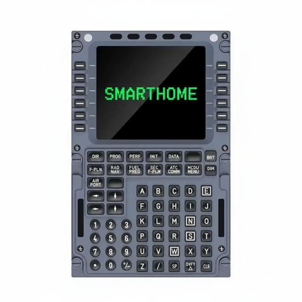

# IoBroker.mcdu
**Tests:** 

## MCDU Smart Home Adapter für ioBroker
Steuern Sie Ihr Smart Home über ein WINWING MCDU-32-CAPTAIN Cockpit-Display via MQTT. Dieses Projekt wertet Ihr Smart Home mit einer authentischen Benutzeroberfläche im Airline-Stil auf, inklusive Eingabefeld, Seitennavigation, Bestätigungsdialogen und einem 14x24-Zeichen-Display mit 8 Farben.

Wir kennen das alle: Tablets an der Wand für die Smart-Home-Steuerung, umständliche Visualisierungen, ewig suchen nach dem richtigen Schalter für eine Glühbirne. Da ich einen Piloten in der Familie habe, war ich sofort begeistert, als ich das MCDU im Cockpit sah: Einfache Dateneingabe, schnelle Auswahl des richtigen Datenpunkts. Dann stieß ich auf ein fantastisches Produkt von Winwing (https://eu.winctrl.com/view/goods-details.html?id=945) und begann mit dem Reverse Engineering. Vielen Dank an https://github.com/alha847 für die Informationen zum Gerät.

Da ich kein Entwickler, sondern ein Technikfreak bin, habe ich Claude Code strukturiert verwendet. Zuerst sammelte ich Informationen über das Gerät und führte Reverse Engineering durch, dann entwickelte ich die passende Architektur für den Smart-Home-Kontext und schließlich den Adapter für ioBroker und den Client für den Raspberry Pi.
Vielen Dank an die großartige Open-Source-Community, insbesondere an https://github.com/klein0r und seine hervorragenden Videos zur Adapterentwicklung und zu ioBroker-Smart-Home-Anwendungen aller Art.

Dies ist die erste Version des Adapters und Clients. Ich muss sie noch gründlich testen und einige Verbesserungen vornehmen. Beiträge sind herzlich willkommen.

### Architektur
```
ioBroker Adapter (main.js)  <-->  MQTT Broker  <-->  RasPi Client (mcdu-client/)  <-->  USB HID Hardware
```

Der ioBroker-Adapter führt die gesamte Geschäftslogik aus (Seitenrendering, Eingabeverarbeitung, Validierung). Der Raspberry-Pi-Client ist ein einfaches Terminal, das MQTT-Nachrichten an die USB-HID-Hardware weiterleitet – er enthält keine Geschäftslogik.

### Merkmale
- **14x24 Zeichenanzeige** mit 8 Farben (Weiß, Bernstein, Cyan, Grün, Magenta, Rot, Gelb, Grau)
- **73 Tasten** inklusive 12 Zeilenauswahltasten, 12 Funktionstasten und vollständigem alphanumerischen Tastenfeld
- **11 LEDs** (9 Indikatoren + 2 Hintergrundbeleuchtungen mit BRT/DIM-Helligkeitssteuerung)
- **Zeilenspezifische Farbsteuerung**: Unabhängige Farben für Spaltenbeschriftung und Spaltendaten, Statusleistenfarbe pro Seite
- **Eingabe im Luftfahrtstil**: Notizblock in Zeile 14, LSK-basierte Feldauswahl, OVFY-Bestätigung
- **Seitensystem**: Konfigurierbare Seiten mit Unterüberschriften, automatische Paginierung, Layouttypen (Menü/Daten/Liste)
- **Funktionstasten**: 11 konfigurierbare Tasten (MENÜ, INIT, DIR, FPLN, PERF usw.) mit gerätespezifischer Belegung
- **Navigation**: übergeordnete Hierarchie, Breadcrumb-Statusleiste, kreisförmige SLEW-Navigation, CLR-zu-übergeordnetes Element
- **Validierungsmodul**: Validierungsebenen für Tastatureingaben, Format, Bereich und Geschäftslogik
- **Bestätigungsdialoge**: weiche (LSK oder OVFY) und harte (nur OVFY) für kritische Aktionen
- **Unterstützung mehrerer Geräte**: Mehrere MCDUs über gerätespezifische MQTT-Themen-Namespaces
- **32 Automatisierungszustände**: LED-Steuerung, Notizblock, Benachrichtigungen, Tastenauslösung durch ioBroker-Skripte

### Entwicklungsstatus
| Phase | Status |
|-------|--------|
| Adapter Foundation (MQTT, Zustandsbaum, Anzeige) | Fertig |
| Eingabesystem (Notizblock, Validierung, Bestätigung) | Fertig |
| Geschäftslogik (Rendering, Paginierung, Funktionstasten) | Fertig |
| Neugestaltung der Admin-Benutzeroberfläche + Links-/Rechtslinienmodell | Abgeschlossen |
| UX-Phase A: Konfiguration der Funktionstasten | Abgeschlossen |
| UX-Phase B: Navigationshierarchie & Breadcrumbs | Abgeschlossen |
| UX-Phase C: Seitenlayout-Typen (Menü/Daten/Liste) | Abgeschlossen |
| Anzeigeoptimierung (Farbaufteilung, Helligkeit, Gerätezustände) | Fertig |
| UX-Phase D: Schnellzugriffsseite | Noch nicht begonnen |
| UX-Phase E: LED-Zuordnungskonfiguration | Nicht gestartet |
| UX-Phase F: Konfigurationsprofile | Nicht begonnen |
| UX-Phase G: Optimierung und Integration der Admin-Benutzeroberfläche | Noch nicht begonnen |
| Hardware-Bereitstellungstests | Nicht gestartet |

199 Tests bestanden (188 Einheitstests + 11 Integrationstests).

### Empfohlene Hardware (mcdu-Client)
Der mcdu-Client ist ein ressourcenschonender Node.js-Prozess (ca. 50–100 MB RAM), der MQTT mit USB HID verbindet. Er benötigt WLAN, einen USB-Host-Anschluss und ausreichend USB-Stromversorgung für das MCDU (ca. 500 mA).

| Platine | Preis | WLAN | USB-Anschluss | Fazit |
|-------|-------|------|----------|---------|
| **Raspberry Pi 4 (1-2 GB)** | 35-45 $ | Dualband | 4x USB-A | **Empfohlen** -- bestes Verhältnis von Preis, Leistung und Einfachheit |
| Raspberry Pi 3B+ | ~35 € | Dualband | 4x USB-A | Bewährt (aktuelles Entwickler-Setup), etwas langsamer |
| Raspberry Pi 5 | 50-80 $ | Dualband | 4x USB-A | Gut, benötigt aber ein offizielles 27-W-Netzteil für die volle USB-Leistung |
| Raspberry Pi Zero 2 W | ~15 € | 2,4 GHz | OTG-Adapter erforderlich | Günstige, aber etwas umständliche OTG-Lösung mit einem Port |
| ESP32-S3 | 5-15 $ | Ja | USB OTG | Node.js kann nicht ausgeführt werden – würde eine vollständige Neuentwicklung in C++ erfordern |

**Wichtige Einschränkung**: Die WinWing MCDU-Firmware benötigt SET_REPORT-Steuerübertragungen (keine Interrupt-OUT). Der mcdu-Client verwendet `node-hid`, was dies auf allen Plattformen automatisch handhabt (IOHIDManager unter macOS, hidraw unter Linux).

### Schnellstart (Entwicklung)
```bash
npm install
npm test          # Run all tests
npm run lint      # ESLint
npm run check     # Lint + test combined
```

Für eine detaillierte Dokumentation siehe [Dokumente/](docs/README.md).

### Skripte
| Drehbuch | Beschreibung |
|--------|-------------|
| `npm test` | Alle Tests ausführen |
| `npm run test:integration` | Nur Integrationstests |
| `npm run test:watch` | Überwachungsmodus für Unit-Tests |
| `npm run lint` | ESLint |
| `npm run lint:fix` | ESLint mit automatischer Korrektur |
| `npm run check` | Linting + Test kombiniert |
| `npm run check` | Linting + Test kombiniert |

## Changelog
<!--
    Placeholder for the next version (at the beginning of the line):
    ### **WORK IN PROGRESS**
-->

### **WORK IN PROGRESS**
* (Flixhummel) Address ioBroker adapter review feedback (reviewer McM1957)
* (Flixhummel) Migrate to ESLint 9 flat config with @iobroker/eslint-config v2.2.0
* (Flixhummel) MQTT password now stored encrypted -- users must re-enter password once after updating
* (Flixhummel) Fix object hierarchy: `devices` container changed from channel to folder
* (Flixhummel) Fix 12+ state roles to match ioBroker standards
* (Flixhummel) Replace native setTimeout/setInterval with adapter equivalents
* (Flixhummel) Consolidate i18n translations to flat JSON files, move i18n.js to scripts/
* (Flixhummel) Remove unused admin/jsonConfig-complexversion.json

### 0.2.0 (2026-02-28)
* (Flixhummel) Fix error display for read-only datapoints, improve save config handling

### 0.1.9 (2026-02-27)
* (Flixhummel) Unify MCDU driver to node-hid on all platforms, clean up mcdu-client setup

### 0.1.8 (2026-02-26)
* (Flixhummel) Remove unpublished news entries and add missing jsonConfig size attributes

### 0.1.7 (2026-02-25)
* (Flixhummel) Fix ioBroker repository checker errors and warnings

### 0.1.4 (2026-02-25)
* (Flixhummel) Switch to npm trusted publishing (OIDC) for automated releases

### 0.1.3 (2026-02-25)
* (Flixhummel) Initial npm release with MQTT bridge, page system, admin UI, and automation states

For detailed changelog see [CHANGELOG.md](CHANGELOG.md).

## License
MIT License

Copyright (c) 2026 Flixhummel <hummelimages@googlemail.com>

Permission is hereby granted, free of charge, to any person obtaining a copy
of this software and associated documentation files (the "Software"), to deal
in the Software without restriction, including without limitation the rights
to use, copy, modify, merge, publish, distribute, sublicense, and/or sell
copies of the Software, and to permit persons to whom the Software is
furnished to do so, subject to the following conditions:

The above copyright notice and this permission notice shall be included in all
copies or substantial portions of the Software.

THE SOFTWARE IS PROVIDED "AS IS", WITHOUT WARRANTY OF ANY KIND, EXPRESS OR
IMPLIED, INCLUDING BUT NOT LIMITED TO THE WARRANTIES OF MERCHANTABILITY,
FITNESS FOR A PARTICULAR PURPOSE AND NONINFRINGEMENT. IN NO EVENT SHALL THE
AUTHORS OR COPYRIGHT HOLDERS BE LIABLE FOR ANY CLAIM, DAMAGES OR OTHER
LIABILITY, WHETHER IN AN ACTION OF CONTRACT, TORT OR OTHERWISE, ARISING FROM,
OUT OF OR IN CONNECTION WITH THE SOFTWARE OR THE USE OR OTHER DEALINGS IN THE
SOFTWARE.