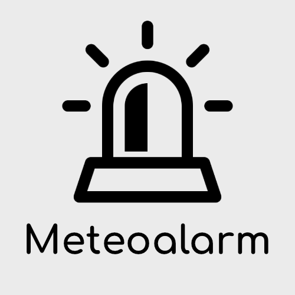

# ioBroker.meteoalarm

**Dieser Adapter nutzt die Sentry-Bibliotheken, um Ausnahmen und Codefehler automatisch an die Entwickler zu melden.** Weitere Details und Informationen zum Deaktivieren der Fehlerberichterstattung finden Sie in [der Sentry-Plugin-Dokumentation](https://github.com/ioBroker/plugin-sentry#plugin-sentry) ! Die Sentry-Berichterstattung wird ab js-controller 3.0 verwendet.

## meteoalarm-Adapter für ioBroker

Dieser Adapter ruft Wetterwarnungen von <https://meteoalarm.org> ab, darunter Informationen zu Wind, Schnee, Regen, Höchst- und Tiefsttemperaturen usw. Diese Informationen sind in der jeweiligen Landessprache und für detaillierte Regionen verfügbar.

HINWEIS: Es kann zu Zeitverzögerungen zwischen dieser Website und der Website [www.meteoalarm.org](http://www.meteoalarm.org) kommen. Für die aktuellsten Informationen zu den Warnstufen, die von den teilnehmenden nationalen Wetterdiensten veröffentlicht werden, nutzen Sie bitte <https://www.meteoalarm.org> .

Der Entwickler kann nicht garantieren, dass die Warnungen rechtzeitig behandelt werden oder dass Fehler und Probleme auftreten, die dazu führen, dass Warnungen überhaupt nicht behandelt werden!

## Wie man es benutzt

Wählen Sie Ihr Land und anschließend die Region, für die Sie Warnungen erhalten möchten. Falls Sie den Namen Ihrer Region nicht kennen, besuchen Sie bitte <https://meteoalarm.org> und suchen Sie dort nach ihr auf der Karte.

[Englische Beschreibung](/#/docs/adapterref/iobroker.meteoalarm/docs/en/meteoalarm.md)

[Deutsche Anleitung](https://github.com/iobroker-community-adapters/ioBroker.meteoalarm/blob/master/docs/de/meteoalarm.md)

## Credits

Dieser Adapter wäre ohne die großartige Arbeit von @jack-blackson ( <https://github.com/jack-blackson> )", der Vorversionen dieses Adapters vor V4.xx erstellt hat, nicht möglich gewesen.

Glockensymbol, entworfen von Freepik von [www.flaticon.com](http://www.flaticon.com)

## Changelog

<!--
	Placeholder for the next version (at the beginning of the line):
	### **WORK IN PROGRESS**
-->

### **WORK IN PROGRESS**
- (copilot) Adapter requires node.js >= 22 now
- (copilot) Adapter requires admin >= 7.7.22 now
- (copilot) Adapter requires admin >= 7.6.17 now

### 4.0.1 (2025-06-24)
* (mcm1957) Invalid dependency has been removed.
* (mcm1957) Dependencies have been updated.

### 4.0.0 (2025-06-06)
* (mcm1957) Adapter has been migrated to iobroker-community-adapters organisation.
* (mcm1957) Adapter requires node.js 20, js-controller 6.0.11 and admin 7.4.10 now.
* (mcm1957) @iobroker/eslint-config has been added and linter error have been fixed.
* (mcm1957) Dependencies have been updated.

### 3.0.3 (2024-08-11)
* (jack-blackson) Updated repositories
* (jack-blackson) Small adjustments in package settings

### 3.0.2 (2024-02-24)
* (jack-blackson) Bugfix for notification text - missing space
* (jack-blackson) Bugfix for notification text - fix to just show "warning level in words" in the notification if it is ticked in the setup

### 3.0.1 (2024-02-29)
* (jack-blackson) Bugfix for location names
* (jack-blackson) Removed necessity to choose country, this is now automatically detected

[Older changelogs can be found there](https://github.com/iobroker-community-adapters/ioBroker.meteoalarm/blob/master/CHANGELOG_OLD.md)

## License
The MIT License (MIT)

Copyright (c) 2025-2026 iobroker-community-adapters <iobroker-community-adapters@gmx.de>  
Copyright (c) 2019-2024 jack-blackson <blacksonj7@gmail.com>

Permission is hereby granted, free of charge, to any person obtaining a copy
of this software and associated documentation files (the "Software"), to deal
in the Software without restriction, including without limitation the rights
to use, copy, modify, merge, publish, distribute, sublicense, and/or sell
copies of the Software, and to permit persons to whom the Software is
furnished to do so, subject to the following conditions:

The above copyright notice and this permission notice shall be included in
all copies or substantial portions of the Software.

THE SOFTWARE IS PROVIDED "AS IS", WITHOUT WARRANTY OF ANY KIND, EXPRESS OR
IMPLIED, INCLUDING BUT NOT LIMITED TO THE WARRANTIES OF MERCHANTABILITY,
FITNESS FOR A PARTICULAR PURPOSE AND NONINFRINGEMENT. IN NO EVENT SHALL THE
AUTHORS OR COPYRIGHT HOLDERS BE LIABLE FOR ANY CLAIM, DAMAGES OR OTHER
LIABILITY, WHETHER IN AN ACTION OF CONTRACT, TORT OR OTHERWISE, ARISING FROM,
OUT OF OR IN CONNECTION WITH THE SOFTWARE OR THE USE OR OTHER DEALINGS IN
THE SOFTWARE.