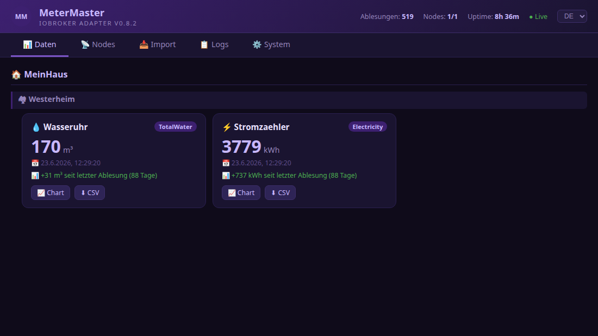

# ioBroker.metermaster

**Übertragen Sie Zählerstände von Ihrem Smartphone automatisch in ioBroker.**

MeterMaster ist die Schnittstelle zwischen der [MeterMaster Android-App](https://play.google.com/store/apps/details?id=com.propertymanagement.metermaster) und Ihrem Smart Home. Erfassen Sie Strom-, Gas-, Wasser- oder Wärmezählerstände mit Ihrem Smartphone; der Adapter speichert sie als ioBroker-Zustände mit korrekten Zeitstempeln und vollständiger Historie – bereit für Skripte, Visualisierungen und Abrechnungsprozesse.

Kein Cloud-Konto erforderlich. Die Messwerte bleiben in Ihrem Netzwerk.

[](https://play.google.com/store/apps/details?id=com.propertymanagement.metermaster)

---

## Wozu diesen Adapter verwenden?

| Ohne MeterMaster                                        | Mit MeterMaster                                                      |
| ------------------------------------------------------- | -------------------------------------------------------------------- |
| Manuelle Eingabe in ioBroker oder Tabellenkalkulationen | Einmal tippen in der App → Status aktualisiert                       |
| Geschätzte Zeitstempel                                  | Zustand`ts` = tatsächliches Ablesedatum                              |
| Keine Historie pro Meter                                | Voll`readings.history` Array                                         |
| Separate Tools für Diagramme/CSV                        | Integrierte Web-Benutzeroberfläche mit Diagrammen und Exportfunktion |

Typische Nutzer: Hausbesitzer, Vermieter und Hausverwalter, die bereits vor Ort die Zählerstände ablesen und diese Werte in ioBroker ohne erneutes Eintippen benötigen.

---

## Schnellstart

1. Installieren Sie **MeterMaster** aus der offiziellen ioBroker-Adapterliste und erstellen Sie eine Instanz.
2. Beachten Sie den HTTP-Port (Standard).`8089` ) und ein Basic-Auth-Passwort festlegen.
3. Installieren Sie die [Android-App](https://play.google.com/store/apps/details?id=com.propertymanagement.metermaster) → **Einstellungen → ioBroker → MeterMaster-Adapter** .
4. Geben Sie Ihren ioBroker-Host, Port, Benutzernamen und Ihr Passwort ein → **Verbindung testen** .
5. Einen Messwert in der App erfassen – er wird angezeigt unter`metermaster.0.…` und in der Web-Benutzeroberfläche.

```
Android app  ──HTTP──►  MeterMaster adapter  ──►  ioBroker states + history + Web UI
```

Öffnen Sie die Web-Benutzeroberfläche jederzeit unter`http://{ioBroker-IP}:8089/` (Zum Ansehen ist kein Passwort erforderlich).

---

## Merkmale

- **HTTP-Empfänger** – empfängt Messwerte von der MeterMaster Android-App (einzeln oder im Batch-Verfahren)
- **Automatische Zustände** – Haus-/Wohnungs-/Zählerobjekte werden bei der ersten Synchronisierung erstellt.
- **Korrekte Zeitstempel** —`readings.latest` verwendet das tatsächliche Ablesedatum als Status`ts`
- **Vollständige Historie** – jeder Zähler speichert eine`readings.history` JSON-Array
- **Basisauthentifizierung** – optionaler Benutzername/Passwort-Schutz für Schreibendpunkte
- **Integrierte Web-Benutzeroberfläche** – Registerkarten Daten, Import, Protokolle und System in DE/EN
- **Löschen in der Web-Oberfläche** – Wohnungen/Zähler aus ioBroker entfernen (Passwortbestätigung)
- **Ausklappbare Abschnitte** – Haus-/Wohnungsblöcke im Datenreiter ausklappen
- **Diagramme & CSV** – Verlaufsdiagramme, monatlicher Verbrauch und CSV-Export pro Zähler
- **Backup-Import** – Wiederherstellung von MeterMaster-App-Backups (Schema 2.0) per Drag & Drop

Optional: [ESP32 OLED-Displayknoten](#optional-esp32-display-nodes) können ausgewählte Messwerte auf einem kleinen Display anzeigen.

---

## MeterMaster Android-App

Der Adapter ist die ioBroker-Seite von [MeterMaster](https://play.google.com/store/apps/details?id=com.propertymanagement.metermaster) – einer Android-App, die lokal arbeitet und für Stromzähler zuständig ist.

- Immobilien, Wohnungen und Zähler verwalten (Strom, Gas, Wasser, Heizung, Verbrauch)
- Messwerte mit Datum/Uhrzeit und optionalen Fotos protokollieren
- Verbrauchsdiagramme und Jahresabrechnung / CSV- / HTML-Export
- Nur lokaler Speicher – keine Cloud, kein Konto, keine Nachverfolgung
- Optionale Integrationen: ioBroker (dieser Adapter), MQTT, Google Sheets, InfluxDB

|                        |                                                                                                 |
| ---------------------- | ----------------------------------------------------------------------------------------------- |
| **Google Play**        | [MeterMaster](https://play.google.com/store/apps/details?id=com.propertymanagement.metermaster) |
| **Quelle & Dokumente** | [MPunktBPunkt/MeterMaster](https://github.com/MPunktBPunkt/MeterMaster)                         |

---

## Screenshots

| Daten – Zählerkarten, KPIs, Verlauf, Diagramm & CSV      | Diagramm – lineare Zeitachse und monatlicher Verbrauch |
| -------------------------------------------------------- | ------------------------------------------------------ |
|  |     |

| Importieren – App-Backup per Drag & Drop                          | Protokolle – Live-Filter & Export                              |
| ----------------------------------------------------------------- | -------------------------------------------------------------- |
|  |  |

| System – Statistik- und Versionsprüfung                      | Knoten – optionaler ESP32-Status                            |
| ------------------------------------------------------------ | ----------------------------------------------------------- |
|  |  |

---

## Installation

Installation aus der offiziellen ioBroker-Adapterliste:

1. **ioBroker-Admin** öffnen → **Adapter**
2. Suche nach **MeterMaster**
3. Klicken Sie auf **„Installieren** “ und erstellen Sie eine Instanz.

Von der Kommandozeile auf dem ioBroker-Host:

```bash
iobroker add metermaster
iobroker start metermaster
```

Wenn die App den Adapter nicht erreichen kann, öffnen Sie die Firewall für den konfigurierten Port, z. B.`sudo ufw allow 8089/tcp` Die

Weitere Hinweise: [INSTALLATION.md](/#/docs/adapterref/iobroker.metermaster/INSTALLATION.md)

---

## Instanzkonfiguration

**ioBroker-Admin → Adapter → MeterMaster → Instanzeinstellungen**

| Einstellung                  | Standard      | Beschreibung                                                           |
| ---------------------------- | ------------- | ---------------------------------------------------------------------- |
| HTTP-Port                    | `8089`        | Port, an dem der Adapter lauscht                                       |
| Benutzername                 | `metermaster` | Benutzername für die Basisauthentifizierung                            |
| Passwort                     | –             | Standard-Authentifizierungspasswort (wählen Sie ein sicheres Passwort) |
| Ausführliche Protokollierung | ermöglicht    | DEBUG-Einträge im Protokoll-Viewer anzeigen                            |
| Protokollpuffer              | `500`         | Maximale Anzahl gespeicherter Protokolleinträge                        |
| Geschichte bewahren          | `0`           | `0` = unbegrenzte Ablesbarkeit pro Zähler                              |

---

## Konfigurieren Sie die Android-App

**Einstellungen → ioBroker → MeterMaster-Adapter**

| Feld                  | Wert                                  |
| --------------------- | ------------------------------------- |
| ioBroker aktivieren   | An                                    |
| IP-Adresse / Hostname | IP-Adresse des ioBroker-Servers       |
| Adapteranschluss      | `8089` (oder Ihr konfigurierter Port) |
| Benutzername          | wie in der Adapterinstanz             |
| Passwort              | wie in der Adapterinstanz             |

Verwenden Sie **die Testverbindung** . Erfolg sieht folgendermaßen aus:`MeterMaster adapter reachable ✓`

---

## Web-Benutzeroberfläche

```
http://{ioBroker-IP}:8089/
```

| Tab            | Inhalt                                                                  |
| -------------- | ----------------------------------------------------------------------- |
| **Daten**      | Zählerstände nach Haus/Wohnung gruppiert – Verlauf, Diagramme, CSV      |
| **Import**     | Sicherung der MeterMaster-App (JSON-Schema 2.0) per Drag & Drop         |
| **Protokolle** | Echtzeitprotokoll mit Filter, automatischem Scrollen und Exportfunktion |
| **System**     | Statistik- und Aktualisierungsprüfung                                   |
| **Knoten**     | Optionale ESP32-Displays (siehe unten)                                  |

Sprachumschaltung: DE / EN in der Web-Benutzeroberfläche.

---

## Erstellte Datenpunkte

```
metermaster.0.
├── info.connection        bool    Adapter connected
├── info.lastSync          number  Timestamp of last sync (ms)
├── info.readingsReceived  number  Total readings received
│
├── {House}/{Apartment}/{Meter}/
│   ├── readings.latest      number  Latest value (ts = reading date)
│   ├── readings.latestDate  string  ISO-8601 date
│   ├── readings.history     string  JSON array of all readings
│   ├── name                 string
│   ├── unit                 string
│   └── typeName             string
│
└── nodes/{MAC}/             (only if ESP32 nodes are used)
    ├── ip, name, version, lastSeen
    ├── config, configAck, cmd
```

---

## HTTP-API

### Ohne Authentifizierung

| Verfahren | Weg             | Beschreibung                            |
| --------- | --------------- | --------------------------------------- |
| ERHALTEN  | `/`             | Web-Benutzeroberfläche                  |
| ERHALTEN  | `/api/version`  | Versions- und GitHub-Prüfung            |
| ERHALTEN  | `/api/stats`    | Statistiken                             |
| ERHALTEN  | `/api/data`     | Alle zwischengespeicherten Messwerte    |
| ERHALTEN  | `/api/logs`     | Log-Puffer (`?level=&category=&text=` ) |
| ERHALTEN  | `/api/nodes`    | Registrierte ESP32-Knoten               |
| ERHALTEN  | `/api/discover` | Bekannte Zählerstatus-IDs               |
| POST      | `/api/register` | ESP32 Herzschlag                        |

### Mit Basisauthentifizierung

| Verfahren | Weg                                      | Beschreibung                           |
| --------- | ---------------------------------------- | -------------------------------------- |
| ERHALTEN  | `/api/ping`                              | Verbindungstest                        |
| POST      | `/api/reading`                           | Speichern Sie einen einzelnen Messwert |
| POST      | `/api/readings`                          | Stapelmesswerte speichern              |
| POST      | `/api/import`                            | App-Backup importieren                 |
| LÖSCHEN   | `/api/apartment/{house}/{apartment}`     | Wohnungskanalbaum löschen              |
| LÖSCHEN   | `/api/meter/{house}/{apartment}/{meter}` | Einzelnen Zähler löschen               |
| GET/POST  | `/api/nodes/{MAC}/config`                | ESP32-Konfiguration abrufen/einstellen |
| POST      | `/api/nodes/{MAC}/configAck`             | Konfigurationsbestätigung              |
| POST      | `/api/nodes/{MAC}/cmd`                   | Direkter Befehl (z. B. LED)            |

### Beispiel: Einzelmessung

```http
POST http://host:8089/api/reading
Authorization: Basic base64(user:password)
Content-Type: application/json

{
  "house": "MyHouse",
  "apartment": "West",
  "meter": "HotWater",
  "value": 128.75,
  "unit": "m³",
  "typeName": "HotWater",
  "readingDate": "2024-02-12T09:30:00.000Z"
}
```

---

## Optional: ESP32-Displayknoten

Als **optionale Erweiterung** kann der Adapter [MeterMaster ESP32-Knoten](https://github.com/MPunktBPunkt/esp32.MeterMaster) verwalten, die ausgewählte Zählerwerte auf einem kleinen OLED-Display anzeigen.

- Knoten registrieren sich über Heartbeat (`POST /api/register` ) und die Konfiguration alle 15 Sekunden abfragen
- Staaten unter`metermaster.0.nodes.{MAC}.*`
- Web-UI- **Knoten** -Registerkarte: Online-Status, IP-Verbindung, Zählerauswahl, LED-Steuerung, Firmware

Sie benötigen **keinen** ESP32, um den Adapter oder die Android-App zu verwenden.

---

## Aktualisieren

**Web-Benutzeroberfläche:**`http://IP:8089/` → **System** → Nach Updates suchen (Installation über die Befehlszeile).

**Befehlszeile:**

```bash
iobroker upgrade metermaster
iobroker restart metermaster.0
```

---

## Changelog


### **WORK IN PROGRESS**
- (ioBroker-Bot) Adapter requires admin >= 7.8.23 now.

### 0.9.10
- Repo checker (E2004/E6029): remove unpublished `0.9.5` from `common.news`
- Trim `common.news` to 7 entries
- Document releases 0.9.6–0.9.10 in README changelog

### 0.9.9
- Web UI: delete apartment/meter with password confirmation (DELETE API)
- Collapsible house/apartment sections in the Data tab (localStorage)

### 0.9.8
- Log MeterMaster app connection tests from User-Agent on `/api/ping` at info level

### 0.9.7
- Print fix (Blob URL revoke)
- ESP32 discover proxy (`getStates` / node-discover)
- Node heartbeat/ack logs moved to debug

### 0.9.6
- Assign display nodes via chips on meter cards in the Data tab
- Correct history on re-sync; edit values in Web UI; print chart and apartment/house latest readings

### 0.9.4
- All adapter log messages and API JSON error responses in English
- State common names and roles corrected (readings channel, date/text/json roles, info.firmware for nodes)
- Web UI i18n: full DE/EN coverage, English default HTML
- Config validation: clamped port (1024–65535), logBufferSize (50–5000), keepHistory (0–100000)
- Removed `/api/update` endpoint and one-click Web UI update (CLI commands card retained)
- `migrateStateRoles()` uses `getAdapterObjectsAsync` (own adapter states only)
- Removed dead `houseName` config; import default house is `MyHouse`
- Fixed redundant state check in stateChange handler
- `@types/node` pinned to `^22.0.0`

### 0.9.3
- Fix state roles for ioBroker object structure check (repochecker E1008/E1009/E1011)
- Migration of existing objects on adapter start

### 0.9.2
- Adapter checker compliance: npm news cleanup, devDependencies, trusted publishing
- npm publish via GitHub Actions with provenance

### 0.9.1
- Lowered admin dependency to >=7.6.20 (fixes startup when admin 7.7.x is installed)

### 0.9.0
- Finalized for ioBroker repository: CI/CD testing, adapter checker compliance
- English README, updated dependencies (Node.js >= 22, adapter-core 3.4.x)
- Admin config i18n, encrypted password storage
- Requires js-controller >= 6.0.11 and admin >= 7.6.20

### 0.8.3
- Chart: linear time axis, yearly consumption projection toggle, README screenshots

### 0.8.2
- Bugfix: chart modal close button and range filters

### 0.8.1
- Bugfix: literal newline in CSV export JS broke Web UI

### 0.8.0
- Charts per meter, consumption KPI, CSV export, DE/EN language switch

See [io-package.json](https://github.com/MPunktBPunkt/ioBroker.metermaster/blob/main/io-package.json) `common.news` for full history. Older entries: [CHANGELOG_OLD.md](https://github.com/MPunktBPunkt/ioBroker.metermaster/blob/main/CHANGELOG_OLD.md).

---

[Older changelogs can be found there](https://github.com/MPunktBPunkt/ioBroker.metermaster/blob/main/CHANGELOG_OLD.md)

## License

MIT License

Copyright (c) 2026 MPunktBPunkt

See [LICENSE](https://github.com/MPunktBPunkt/ioBroker.metermaster/blob/main/LICENSE) for the full license text.