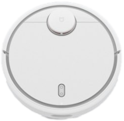
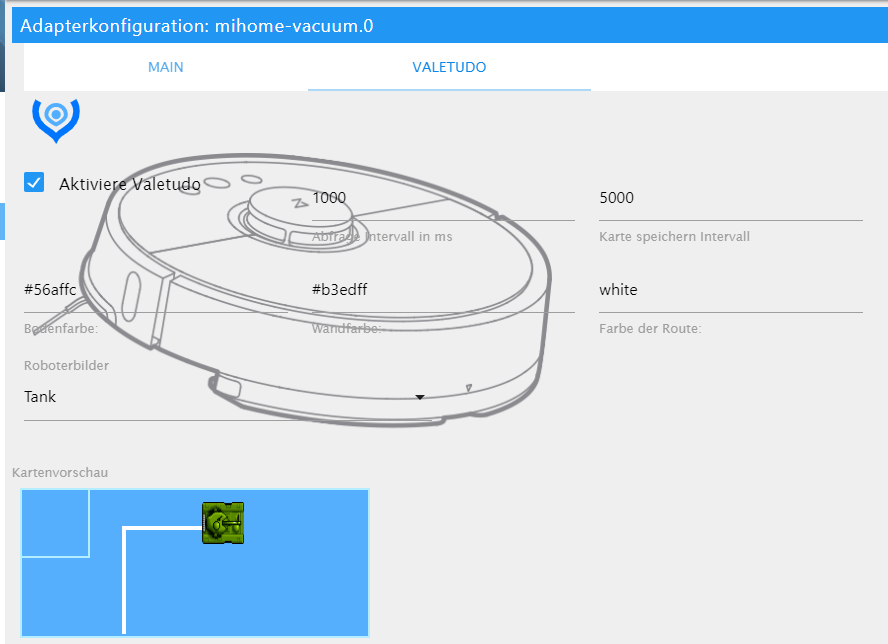

# IoBroker Mihome-Vakuumadapter
 [](https://weblate.iobroker.net/engage/adapters/?utm_source=widget)

[Deutsche Beschreibung hier](README_de.md)

Mit diesem Adapter können Sie den Xiaomi Staubsauger steuern.

**Dieser Adapter verwendet Sentry-Bibliotheken, um den Entwicklern automatisch Ausnahmen und Codefehler zu melden.** Weitere Details und Informationen zum Deaktivieren der Fehlerberichterstattung finden Sie unter [Dokumentation zum Sentry-Plugin](https://github.com/ioBroker/plugin-sentry#plugin-sentry)! Sentry Reporting wird ab js-controller 3.0 verwendet.

## Inhalt
 - [Bekannte Fehler](#known_errors)
    - [Fehler bei der Installation (Leinwand)](#error_at_installation)
    - [HTTP-Fehler beim Abrufen des Token-Cookies{}](#http_error_when_getting_token_cookie{})
- [Setup](#Konfiguration)
    - [Adapter konfigurieren](#Adapter-Konfiguration)
        - [Steuerung über Alexa](#control-over-alexa)
        - [Zweiter Roboter](#zweiter Roboter)
    - [Valetudo konfigurieren](#valetudo-config)
- [Funktionen](#Funktionen)
    - [S50-Befehle](#commands-of-the-s50)
    - [Gehe zu](#goto)
- [zone Clean](#zoneclean)
    - [Zimmer](#Zimmer)
    - [timer](#timer)
    - [Eigene Befehle](#send-your-own-commands)
    - [sendTo-Hook](#send-custom-commands-with-sendto)
- [Widget](#Widget)
- [Fehler](#Fehler)
- [Changelog](#changelog)

## Unterstützte Geräte und Funktionen
Reiniger nicht unterstützt? [Stimmen Sie hier ab!](https://doodle.com/poll/8m8238ridkifua99?utm_source=poll&utm_medium=link)

| Gerät | Grundsteuerung | Geschichte | Zimmer | Karte |
|:------------------    |:-------------------:      |:-------------------:  |:-------------------:|:-------------------:|
| viomi.vacuum.v6 | :heavy_check_mark: | :x: |:x: | :x: |
| viomi.vacuum.v7 | :heavy_check_mark: | :x: |:x: | :x: |
| viomi.vacuum.v8 | :heavy_check_mark: | :x: |:x: | :x: |
| rockrobo.vacuum.v1 | :heavy_check_mark: | :heavy_check_mark: |:x: |:heavy_check_mark: |
| roborock.vacuum.s4 | :heavy_check_mark: | :heavy_check_mark: |:heavy_check_mark: |:heavy_check_mark: |
| roborock.vacuum.s5 | :heavy_check_mark: | :heavy_check_mark: |:heavy_check_mark: |:heavy_check_mark: |
| roborock.vacuum.s5e | :heavy_check_mark: | :heavy_check_mark: |:heavy_check_mark: |:heavy_check_mark: |
| roborock.vacuum.m1s | :heavy_check_mark: | :heavy_check_mark: |:heavy_check_mark: |:heavy_check_mark: |
| roborock.vacuum.a10 | :heavy_check_mark: | :heavy_check_mark: |:heavy_check_mark: |:heavy_check_mark: |
| roborock.vacuum.a15 | :heavy_check_mark: | :heavy_check_mark: |:heavy_check_mark: |:heavy_check_mark: |

## Bekannte Fehler
### Fehler bei der Installation
wenn Ihre Installation fehlerhaft ausgeführt wird. Das Canvas-Paket konnte nicht installiert werden

``npm ERR! canvas@2.6.1 install: node-pre-gyp install --fallback-to-build npm ERR! Ausgangsstatus 1``

Bitte installiere Canvas und die Libs manuell mit: `` sudo apt-get install build-essential libcairo2-dev libpango1.0-dev libjpeg-dev libgif-dev librsvg2-dev ``

`` sudo npm install canvas --unsafe-perm=true ``

### HTTP-Fehler beim Abrufen des Token-Cookies{}
Manchmal können Sie keine Verbindung zur xiaomi-Cloud herstellen.
Bitte öffnen Sie den Browser, gehen Sie zu Mihome und melden Sie sich an. Geben Sie den Code ein, den Sie per E-Mail erhalten haben. Danach sollte die Verbindung funktionieren.

## Aufbau
Derzeit ist das Auffinden des Tokens das größte Problem.
Eine Option zum Extrahieren des Tokens ist die Verwendung dieses Dienstprogramms: https://github.com/PiotrMachowski/Xiaomi-cloud-tokens-extractor

Ansonsten folgen Sie bitte den Anweisungen im Link:

[Token-Tutorial](https://www.smarthomeassistent.de/token-auslesen-roborock-s6-roborock-s5-xiaomi-mi-robot-xiaowa/).

### Adapterkonfiguration
- Bei IP-Adresse muss die IP-Adresse des Roboters im Format `192.168.178.XX` . eingegeben werden
- Der Port des Roboters ist standardmäßig auf "54321" eingestellt, dieser sollte nicht geändert werden
- Eigener Port, sollte nur mit zweitem Roboter geändert werden
- Abfrageintervall Die Zeit in ms, in der die Statuswerte des Roboters abgerufen werden (sollte nicht <10000 sein)

#### Kontrolle über Alexa
Für Alexa wird der spezielle Kontrollzustand `clean_home` erstellt.
Es ist ein Schalter, der bei `true` dem Sauger beginnt und bei `false` nach Hause geht.
Es wird automatisch ein Smart Device im Cloud-Adapter erstellt mit dem Namen "Staubsauger", der im Cloud-Adapter geändert werden kann.

#### Fortsetzen der angehaltenen Zonenreinigung mit der Starttaste
Wenn diese Option aktiviert ist, nimmt der Staubsauger die Zonenreinigung wieder auf, wenn der "Start"-Zustand auf "true" gesetzt wird, wenn er während einer laufenden Zonenreinigung angehalten wurde.
Wenn diese Option deaktiviert ist, startet der Staubsauger beim Senden des Startbefehls eine neue "normale Reinigung", auch wenn er während einer laufenden Zonenreinigung angehalten wurde.

- Experimentell: Über die Checkbox "Send your own commands" werden Objekte erstellt, über die Sie eigene Befehle an den Roboter senden und empfangen können.

#### Zweiter Roboter
Sollen zwei Roboter über ioBroker gesteuert werden, müssen zwei Instanzen angelegt werden. Der zweite Roboter muss seinen eigenen Port ändern (Standard: 53421), damit beide Roboter unterschiedliche Ports haben.

## Kartenkonfiguration
Es gibt zwei Möglichkeiten, die Karte zu erhalten. Die ersten holen sich die Karte aus der Cloud. Dazu müssen Sie sich einloggen und den richtigen Roboter aus der Liste auswählen

Zweiter Weg ist die Karte von Valetudo (nur lokale Verbindung).
Daher müssen Sie valetudo rooten und auf Ihrem Gerät installieren.
Sie können [Valetudo RE](https://github.com/rand256/valetudo) oder normal [Valetudo](https://github.com/Hypfer/Valetudo) verwenden.



- Um die Karte zu verwenden, müssen Sie in der Konfiguration Valetudo oder Originalkarte auswählen
- Anforderungsintervall muss mehr als 1000 ms betragen dies ist das Intervall für die Aktualisierung der HTML-Karte
- Map-Intervall muss mehr als 5000 ms betragen dieses Intervall aktualisiert die PNG-Map-Datei (Sie können dies für Telegram oder vis oder alles andere verwenden)
- Farbe dort können Sie die Farben für das Kartenbeispiel auswählen:

```
- #2211FF
- rbg(255,200,190)
- rgba(255,100,100,0.5) //for Transparent
- green
```

- Roboter dort kannst du verschiedene Roboter oder andere Fahrzeuge für die Karte auswählen

### Kartennutzung
Die Karte wird entweder als base64-raw oder als PNG gespeichert.

Das Kartenbild finden Sie in folgenden Datenpunkten:

- base64: `mihome-vacuum.0.cleanmap.map64`
- PNG: `mihome-vacuum.0.cleanmap.mapURL`

Sie können beide Bilder als Bildquelle im gewünschten VIS verwenden. Im HTML-Stil können Sie das Bild auf diese Weise verwenden:

``

Mit zusätzlichen Style-Tags können Sie den Kartenstil in der Größe ändern und/oder formatieren.

Um die Karte in `jarvis` zu verwenden, verwenden Sie einfach einen der Datenpunkte als URL des DisplayImage-Widgets.
Dort können Sie die Größe des Bildes oder des gesamten Widgets ändern. Beim Responsive Design von jarvis wird die Kartengröße entsprechend der Anzeigegröße angepasst.

Um die Karte in `ioBroker VIS` anzuzeigen, können Sie ein normales HTML-Widget verwenden, z.B.:

```
[{"tpl":"tplHtml","data":{"g_fixed":false,"g_visibility":false,"g_css_font_text":false,"g_css_background":false,"g_css_shadow_padding":false,"g_css_border":false,"g_gestures":false,"g_signals":false,"g_last_change":false,"visibility-cond":"==","visibility-val":1,"visibility-groups-action":"hide","refreshInterval":"0","signals-cond-0":"==","signals-val-0":true,"signals-icon-0":"/vis/signals/lowbattery.png","signals-icon-size-0":0,"signals-blink-0":false,"signals-horz-0":0,"signals-vert-0":0,"signals-hide-edit-0":false,"signals-cond-1":"==","signals-val-1":true,"signals-icon-1":"/vis/signals/lowbattery.png","signals-icon-size-1":0,"signals-blink-1":false,"signals-horz-1":0,"signals-vert-1":0,"signals-hide-edit-1":false,"signals-cond-2":"==","signals-val-2":true,"signals-icon-2":"/vis/signals/lowbattery.png","signals-icon-size-2":0,"signals-blink-2":false,"signals-horz-2":0,"signals-vert-2":0,"signals-hide-edit-2":false,"lc-type":"last-change","lc-is-interval":true,"lc-is-moment":false,"lc-format":"","lc-position-vert":"top","lc-position-horz":"right","lc-offset-vert":0,"lc-offset-horz":0,"lc-font-size":"12px","lc-font-family":"","lc-font-style":"","lc-bkg-color":"","lc-color":"","lc-border-width":"0","lc-border-style":"","lc-border-color":"","lc-border-radius":10,"lc-zindex":0,"html":"{mihome-vacuum.0.map.map64}"},"style":{"left":"0","top":"0","width":"100%","height":"100%"},"widgetSet":"basic"}]
```

Die Verwendung der base64-Karte ist schneller und zeigt die Position des Roboters in der Nähe in Echtzeit an.

## Funktionen
### Befehle des S50 (zweite Generation)
Die Kartengröße beträgt immer 52000mm x 52000mm, somit sind Werte von 0 bis 51999mm möglich.
Leider kann die Position und Lage der Karte nicht abgefragt werden, diese kann sich von Saugen zu Saugen ändern. Als Grundlage dient immer die letzte Saugkarte, sowie in der App.
Nimmt der Roboter nur einen Bereich auf und baut die Karte immer gleich auf, kannst du ihn zuverlässig an Orte schicken oder den Bereich saugen lassen.

#### Gehe zu
Um den Staubsauger an einen Punkt zu fahren, muss das Objekt „goTo“ wie folgt gefüllt werden:

```
xVal, yval
```

Die Werte müssen den oben genannten Umfang erfüllen und die x- und y-Koordinaten auf der Karte angeben.

Beispiel:

```
24,850.26500
```

#### Zonenreinigung
Um eine Zone zu saugen, muss ZoneClean wie folgt befüllt werden:

```
[X1, y1, x2, x2, count]
```

Wobei x und y die Koordinaten des rechteckigen Bereichs sind und die Reinigungsvorgänge "zählen".
Sie können auch mehrere Bereiche gleichzeitig saugen lassen:

```
[X1, y1, x2, x2, count], [x3, y3, x4, x4, count2]
```

Beispiel:

```
[24117,26005,25767,27205,1], [24320,24693,25970,25843,1]
```

#### Räume
neuer Staubsauger mit aktueller Home App unterstützt die Definition von Räumen, siehe [Video](https://www.youtube.com/watch?v=vEiUZzoXfPg)

Jeder Raum in der aktuellen Karte hat einen Index, der dann aus der App dem Raum zugeordnet wird. Vom Roboter bekommen wir nur ein Mapping mit Zimmernummer und Index. Der Adapter fragt diese Räume bei jedem Start des Adapters ab und legt für jeden Raum einen Kanal an, der dann den aktuellen Raumindex kennt. Dasselbe geschieht manuell mit dem Button loadRooms. Dieser Kanal kann dann den ioBroker Räumen zugewiesen werden. Wird die Taste roomClean gedrückt, wird der Index der Karte ermittelt und an den Roboter gesendet, damit dieser anschließend diesen Raum saugen kann. Zuvor wird die FAN-Leistung auf Einzelraumabsaugung eingestellt. Falls Sie in der App noch nicht die Möglichkeit haben, die Räume zu benennen, besteht auch die Möglichkeit, einen solchen Kanal manuell durch Angabe des Kartenindexes zu erstellen. Anstelle von mapIndex können auch Zonenkoordinaten hinzugefügt werden.
Wenn Sie spontan mehrere Räume reinigen möchten, können Sie dies über multiRoomClean tun, indem Sie diesem Datenpunkt die ioBroker-Räume zuordnen und dann die Taste drücken.

#### Timer
Sobald der Staubsauger die Raumfunktion unterstützt (siehe oben), können auch Timer erstellt werden, die dann die entsprechenden Raumkanäle auslösen oder deren MapIndexes ermitteln.
Der Timer könnte direkt über Räume und/oder Raumkanäle auslösen.
Die Timer selbst werden über den Konfig-Bereich angelegt, werden dann aber zu einem Datenpunkt. Dort kann jeder Timer einmal aktiviert/deaktiviert oder übersprungen werden. Auch ein Direktstart ist möglich. Der Vorteil der ioBroker Timer ist, dass sie im VIS angezeigt und verwendet werden können und man den Roboter vom Internet trennen kann, da die Timer der App aus China ausgelöst werden.

### Senden Sie Ihre eigenen Befehle
HINWEIS: Diese Funktion sollte nur von Experten verwendet werden, da der Sauger durch falsche Befehle beschädigt werden könnte

Der Roboter unterscheidet zwischen den Befehlen in Methoden (Methoden) und Parametern (Params), die der Spezifikation der Methoden dienen.
Unter dem Objekt `mihome-vacuum.X.control.X_send_command` können Sie eigene Befehle an den Roboter senden.
Die Objektstruktur muss wie folgt aussehen: Methode; [Parameter]

Unter dem Objekt `mihome-vacuum.X.control.X_get_response` wird die Antwort nach dem Senden vom Roboter eingetragen.
Wurden Parameter abgefragt, erscheinen diese hier im JSON-Format. Wurde nur ein Befehl gesendet, antwortet der Roboter nur mit "0".

Die folgenden Methoden und Parameter werden unterstützt:

| Methode | Parameter | Beschreibung |
|-----------      |-------                                                              |-------------------                                                                                     |
| get_timer | | Gibt den eingestellten Timer zurück. Einstellen der Saugzeiten BSp. 12 Uhr 30 in 5 Tagen |
| set_timer | `[["TIME_IN_MS",["30 12 * * 1,2,3,4,5",["start_clean",""]]]]` | Timer aktivieren / deaktivieren |
| upd_timer | `["1481997713308","ein/aus"]` | |
| | | Rettet die Zeiten der Bitte nicht stören |
| get_dnd_timer | | DND-Zeiten löschen |
| set_dnd_timer | `[22,0,8,0]` | |
| set_dnd_timer | `[22,0,8,0]` | |
|                 |                                                                     |                                                                                                        |
| app_rc_start | | Fernbedienung starten |
| app_rc_end | | Fernbedienung fertigstellen |
| app_rc_move | `[{"seqnum":'0-1000',"velocity":VALUE1,"omega":VALUE2,"duration":VALUE3}]`| Bewegung. Sequenznummer muss fortlaufend sein, VALUE1 (Geschwindigkeit) = -0.3-0.3, VALUE2 (Rotation) = -3.1-3.1, VALUE3 (Dauer) |

weitere Methoden und Parameter finden Sie hier ([Verknüpfung](https://github.com/MeisterTR/XiaomiRobotVacuumProtocol)).

### Senden Sie benutzerdefinierte Befehle mit sendTo
Sie können diese benutzerdefinierten Befehle auch von anderen Adaptern mit `sendTo` senden. Nutzung mit `method_id` und `params` wie oben definiert:

```
sendTo("mihome-vacuum.0", "sendCustomCommand",
    {method: "method_id", params: [...] /* optional*/},
    function (response) { /* do something with the result */}
);
```

Das Objekt `response` hat zwei Eigenschaften: `error` und (wenn kein Fehler aufgetreten ist) `result`.

Auf diese Weise können auch einige vordefinierte Befehle ausgegeben werden:

```
sendTo("mihome-vacuum.0",
    commandName,
    {param1: value1, param2: value2, ...},
    function (response) { /* do something with the result */}
);
```

Die unterstützten Befehle sind:

| Beschreibung | `commandName` | Erforderliche Parameter | Bemerkungen |
| Reinigungsvorgang starten | `startVacuuming` | - Keine - | |
| Beenden Sie den Reinigungsvorgang | `stopVacuuming` | - Keine - | |
| Unterbrechen Sie den Reinigungsvorgang | `pause` | - Keine - | |
| Anstehende Jobs löschen | `clearQueue` | - Keine - | |
| Reinigen Sie einen kleinen Bereich um den Roboter | `cleanSpot` | - Keine - | |
| Geh zurück zur Basis | `charge` | - Keine - | |
| Sag "Hallo, ich bin hier!" | `findMe` | - Keine - | |
| Status der Verbrauchsmaterialien (Bürste usw.) prüfen | `getConsumableStatus` | - Keine - | |
| Status der Verbrauchsmaterialien (Bürste usw.) zurücksetzen | `resetConsumables` | `consumable` | String: filter_work_time, filter_element_work_time, sensor_dirty_time, main_brush_work_time, side_brush_work_time |
| Erhalten Sie eine Zusammenfassung aller bisherigen Reinigungsvorgänge | `getCleaningSummary` | - Keine - | |
| Erhalten Sie eine detaillierte Zusammenfassung eines vorherigen Reinigungsprozesses | `getCleaningRecord` | `recordId` | |
| Holen Sie sich eine Karte | `getMap` | - Keine - | Unbekannt, was mit dem Ergebnis zu tun ist |
| Holen Sie sich den aktuellen Status des Roboters | `getStatus` | - Keine - | |
| Abrufen der Seriennummer des Roboters | `getSerialNumber` | - Keine - | |
| Detaillierte Geräteinformationen abrufen | `getDeviceDetails` | - Keine - | |
| Rufen Sie den *Bitte nicht stören*-Timer ab | `getDNDTimer` | - Keine - | |
| Stellen Sie einen neuen *Bitte nicht stören*-Timer ein | `setDNDTimer` | `startHour`, `startMinute`, `endHour`, `endMinute` | |
| Lösche den *Bitte nicht stören*-Timer | `deleteDNDTimer` | - Keine - | |
| Abrufen der aktuellen Lüftergeschwindigkeit | `getFanSpeed` | - Keine - | |
| Stellen Sie eine neue Lüftergeschwindigkeit ein | `setFanSpeed` | `fanSpeed` | `fanSpeed` ist eine Zahl zwischen 1 und 100 |
| Fernbedienungsfunktion starten | `startRemoteControl` | - Keine - | |
| Fahrbefehl für Fernbedienung ausgeben | `move` | `velocity`, `angularVelocity`, `duration`, `sequenceNumber` | Sequenznummer muss fortlaufend sein, Dauer ist in ms |
| Beenden der Fernbedienungsfunktion | `stopRemoteControl` | - Keine - | |
| Reinraum/Räume | `cleanRooms` | `rooms` | `rooms` ist ein durch Kommas getrennter String mit enum.rooms.XXX |
| sauberes Segment | `cleanSegments` | `rooms` | `rooms` ist ein Array mit mapIndex oder ein durch Kommas getrennter String mit mapIndex |
| saubere Zone | `cleanZone` | `coordinates` | `coordinates` ist ein String mit Koordinaten und Anzahl, siehe [zoneClean](#zonecleaning) |
| saubere Zone | `saubere Zone` | `Koordinaten` | `coordinates` ist ein String mit Koordinaten und Anzahl, siehe [zoneClean](#zonecleaning) |

##Widget


## Fehler
- Gelegentliche Verbindungsabbrüche, dies liegt jedoch nicht am Adapter sondern meist an den eigenen Netzwerken
- Widget zur Zeit ohne Funktion

## Changelog
### __WORK IN PROGRESS__
* (MeisterTR) fix no rooms for S5
* (MeisterTR) fix IOBROKER-MIHOME-VACUUM-4 DB closed

### 3.2.2 (2021-07-16)
* (bluefox) the communication is corrected
* (bluefox) Added roles to be detected by type-detector

### 3.2.1 (2021-07-02)
* (Apollon77) Adjust several crash cases (IOBROKER-MIHOME-VACUUM-K, IOBROKER-MIHOME-VACUUM-J, IOBROKER-MIHOME-VACUUM-F, IOBROKER-MIHOME-VACUUM-7, IOBROKER-MIHOME-VACUUM-A, IOBROKER-MIHOME-VACUUM-4, IOBROKER-MIHOME-VACUUM-G, IOBROKER-MIHOME-VACUUM-C, IOBROKER-MIHOME-VACUUM-B, IOBROKER-MIHOME-VACUUM-Q, IOBROKER-MIHOME-VACUUM-M)

### 3.2.0 (02.06.2021)
* (MeisterTR) release candidate
* (MeisterTR) get consumable after reset

### 3.1.10 (23.05.2021)
* error fixed
* add sentry

### 3.1.6 (05.05.2021)
* minimize Disk write
* minimized Messages 
* changed warn Messages to debug
* extend Debuglog to find error for e2 vacuum
* added getStates when map is changed

### 3.1.5 (03.05.2021)
* try to fix the map error
* Map64 changed. now without img tags
* add Multimap support (get rooms and map when map is changed)
* select Multimaps
* fix error with zone coordinates
* add WiFi
* fix connection Problems
* fix Valetudo map
* add Mop state
* fix some objects

### 3.1.1 (18.4.2021)
 * Full rewrite
 * Fix map bug with multiple vacuums
 * fix performance Problems
 * better connection to vacuum
 * fix bug in ReloadMap button
 * Show Goto and Zone States ti find places
 * and many more...

### 2.2.5 (2021-04-02)
* added S7 Support
* bugfixes for S5 Max and others

### 2.2.4 (2020-09-15)
* (dirkhe) add config for send Pause Before Home

### 2.2.3 (2020-08-20)
* (dirkhe) room DP are not deleted, on map change 

### 2.2.0 (2020-08-13)
* (MeisterTR) add test for Viomi and Dreame Api 

### 2.1.1 (2020-07-10)
* (bluefox) Refactoring
* (bluefox) Support of compact mode added

### 2.0.10 (2020-07-05)
* try to start the cleaning 3 times, if robot not answers and some fixes

### 2.0.9 (2020-03-05)
* (dirkhe) add state info for room channels and change queue info from number to JSON

### 2.0.8 (2020-02-26)
* (dirkhe) decreased communication with robot

### 2.0.7 (2020-02-25)
* (dirkhe) add Resuming after pause for rooms

### 2.0.6 (2020-02-17)
* (MeisterTR) add rooms for s50 with map (cloud or Valetudo needed)

### 2.0.4 (2020-02-13)
* (MeisterTR) add cloud login to get token
* (MeisterTR) add cloud Map
* (MeisterTR) add new and old Map format
* (MeisterTR) rebuild config page

### 1.10.5 (2020-02-11)
* send Ping only if not connected, otherwise get_status
* set button states to true, if clicked
* move timer manager and room manager to own libs

### 1.10.4 (2020-02-06)
* (MeiserTR) add valetudo map support for gen3 and gen2 2XXX

### 1.10.1 (2020-01-20)
* (dirkhe) added zone as room handling
* (dirkhe) timer could room channels directly

### 1.10.0 (2020-01-17)
* (dirkhe) added room handling
* (dirkhe) added Timer 
* (dirkhe) changed feature handling 

### 1.1.6 (2018-12-06)
* (JoJ123) Added fan speed for MOP (S50+).

### 1.1.5 (2018-09-02)
* (BuZZy1337) Added description for Status 16 and 17 (goTo and zone cleaning).
* (BuZZy1337) Added setting for automatic resume of paused zone cleaning.

### 1.1.4 (2018-08-24)
* (BuZZy1337) Added possibility to resume a paused zone clean (State: mihome-vacuum.X.control.resumeZoneClean)

### 1.1.3 (2018-07-11)
* (BuZZy1337) fixed zoneCleanup state not working (vacuum was only leaving the dock, saying "Finished ZoneCleanup", and returned immediately back to the dock)

### 1.1.2 (2018-07-05)
* (BuZZy1337) fixed detection of new Firmware / Second generation Vacuum

### 1.1.1 (2018-04-17)
* (MeisterTR) error caught , added states for new fw

### 1.1.0 (2018-04-10)
* (mswiege) Finished the widget

### 1.0.1 (2018-01-26)
* (MeisterTR) ready for admin3
* (MeisterTR) support SpotClean and voice level (v1)
* (MeisterTR) support second generation (S50)
* (MeisterTR) Speed up data requests

### 0.6.0 (2017-11-17)
* (MeisterTR) use 96 char token from Ios Backup
* (MeisterTR) faster connection on first use

### 0.5.9 (2017-11-03)
* (MeisterTR) fix communication error without i-net
* (AlCalzone) add selection of predefined power levels

### 0.5.7 (2017-08-17)
* (MeisterTR) compare system time and Robot time (fix no connection if system time is different)
* (MeisterTR) update values if robot start by cloud

### 0.5.6 (2017-07-23)
* (MeisterTR) add option for crate switch for Alexa control

### 0.5.5 (2017-06-30)
* (MeisterTR) add states, features, fix communication errors

### 0.3.2 (2017-06-07)
* (MeisterTR) fix no communication after softwareupdate(Vers. 3.3.9)

### 0.3.1 (2017-04-10)
* (MeisterTR) fix setting the fan power
* (bluefox) catch error if port is occupied

### 0.3.0 (2017-04-08)
* (MeisterTR) add more states

### 0.0.2 (2017-04-02)
* (steinwedel) implement better decoding of packets

### 0.0.1 (2017-01-16)
* (bluefox) initial commit

## License
The MIT License (MIT)

Copyright (c) 2017-2021 bluefox <dogafox@gmail.com>

Permission is hereby granted, free of charge, to any person obtaining a copy
of this software and associated documentation files (the "Software"), to deal
in the Software without restriction, including without limitation the rights
to use, copy, modify, merge, publish, distribute, sublicense, and/or sell
copies of the Software, and to permit persons to whom the Software is
furnished to do so, subject to the following conditions:

The above copyright notice and this permission notice shall be included in all
copies or substantial portions of the Software.

THE SOFTWARE IS PROVIDED "AS IS", WITHOUT WARRANTY OF ANY KIND, EXPRESS OR
IMPLIED, INCLUDING BUT NOT LIMITED TO THE WARRANTIES OF MERCHANTABILITY,
FITNESS FOR A PARTICULAR PURPOSE AND NONINFRINGEMENT. IN NO EVENT SHALL THE
AUTHORS OR COPYRIGHT HOLDERS BE LIABLE FOR ANY CLAIM, DAMAGES OR OTHER
LIABILITY, WHETHER IN AN ACTION OF CONTRACT, TORT OR OTHERWISE, ARISING FROM,
OUT OF OR IN CONNECTION WITH THE SOFTWARE OR THE USE OR OTHER DEALINGS IN THE
SOFTWARE.