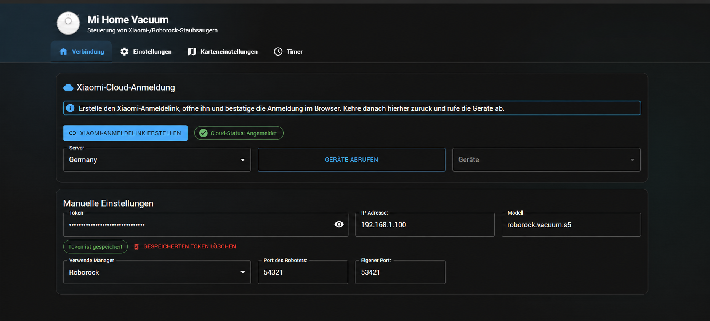
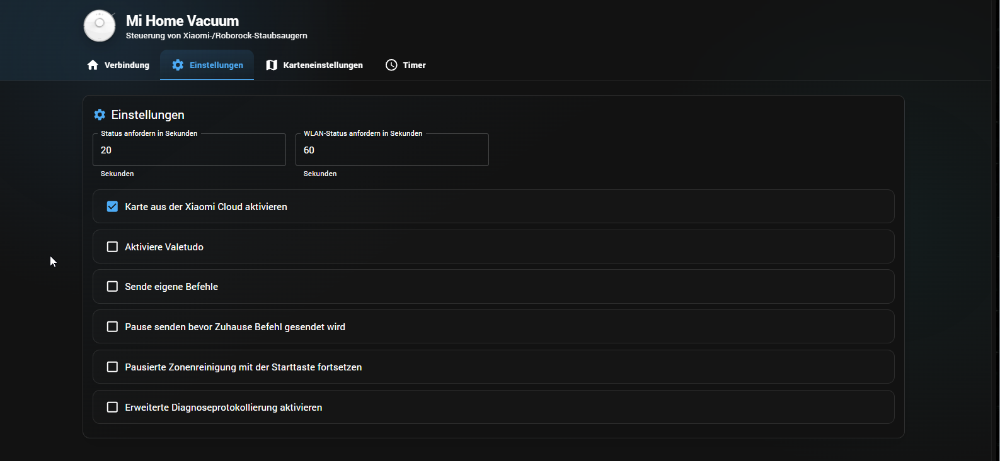
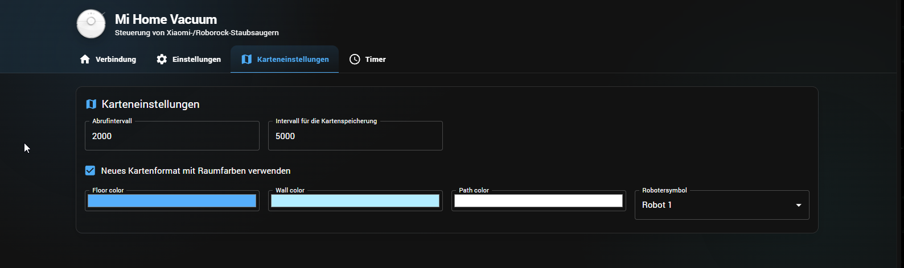
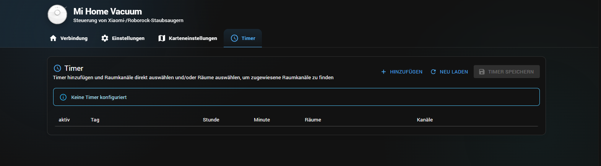
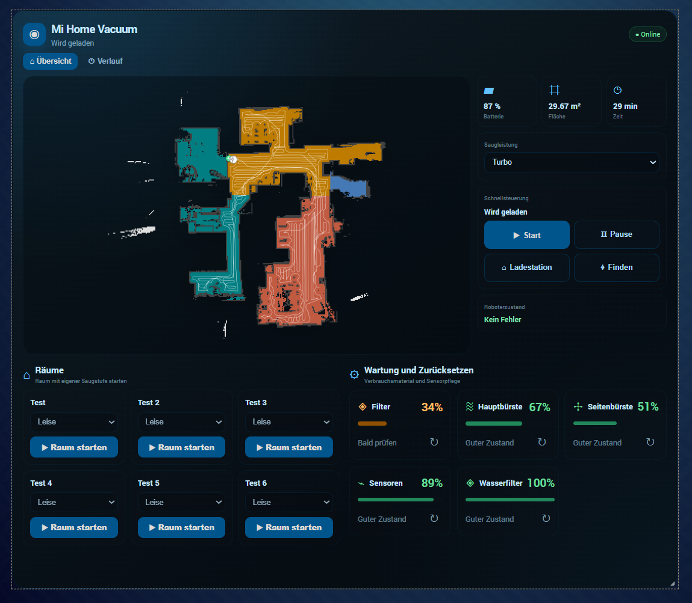
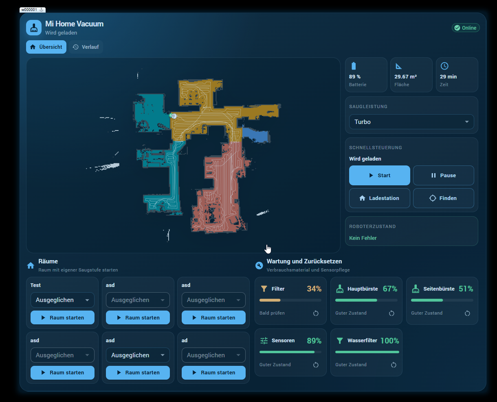
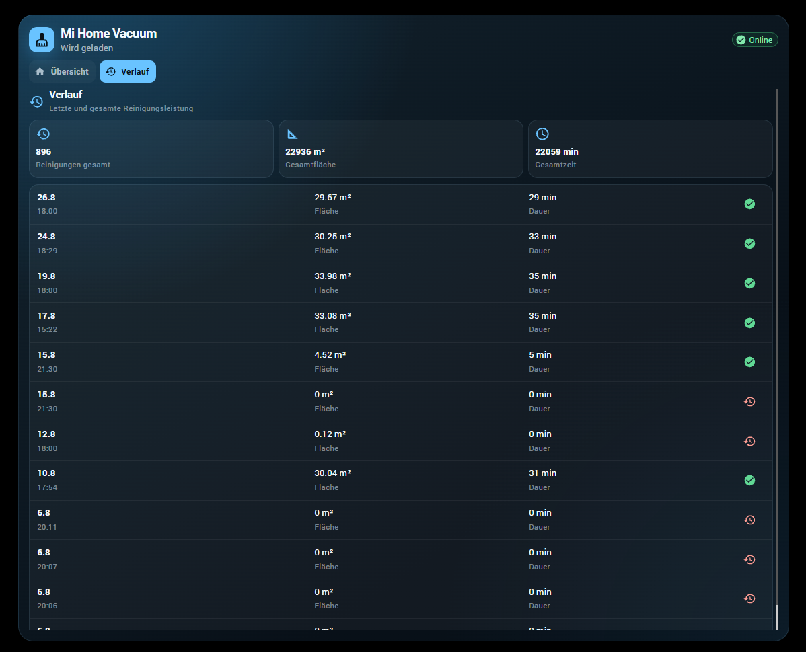

# ioBroker miHome-Vakuumadapter

[](https://weblate.iobroker.net/engage/adapters/?utm_source=widget)

[Deutsche Dokumentation](README_de.md)

Der mihome-vacuum-Adapter verbindet ioBroker mit kompatiblen Saugrobotern des Xiaomi-Ökosystems. Er unterstützt die lokale Steuerung über die IP-Adresse und das Token des Roboters, optional die Geräteerkennung und Kartendarstellung in der Xiaomi Cloud, die Raumreinigung, Timer, Reinigungsverlauf, Informationen zu Verbrauchsmaterialien sowie die dedizierten Widgets VIS 1 und VIS 2.

Unterstützte Gerätefamilien sind Roborock/rockrobo, Viomi und Dreame. Die genauen Befehle, Kartenfunktionen, Räume, Wischsteuerung, Docksteuerung und Verbrauchsmaterialstatus hängen vom Modell und der Firmware ab.

## Installation

Installieren und aktualisieren Sie den Adapter über ioBroker Admin mithilfe einer veröffentlichten npm-Version. Die direkte Installation von GitHub wird nicht unterstützt und ist in Admin deaktiviert. Das Quellcode-Repository enthält weder die generierte Laufzeitumgebung noch die Admin-Benutzeroberfläche oder die VIS 2-Bundles; diese sind in den veröffentlichten Paketen enthalten.

## Unterstützte Geräte und Funktionen

Die folgenden Modelle sind explizit als unterstützt dokumentiert. Andere Modelle derselben Gerätefamilien funktionieren möglicherweise mit dem entsprechenden Manager, die Kompatibilität kann jedoch erst nach Tests garantiert werden. Der Funktionsumfang kann je nach installierter Firmware variieren.

| Gerät                  | Grundlegende Steuerung | Reinigungshistorie | Zimmerreinigung | Karte |
| :--------------------- | :--------------------: | :----------------: | :-------------: | :---: |
| `viomi.vacuum.v6`      |            ✅           |          —         |        —        |   —   |
| `viomi.vacuum.v7`      |            ✅           |          —         |        —        |   —   |
| `viomi.vacuum.v8`      |            ✅           |          —         |        —        |   —   |
| `viomi.vacuum.v19`     |            ✅           |          —         |        —        |   —   |
| `rockrobo.vacuum.v1`   |            ✅           |          ✅         |        —        |   ✅   |
| `roborock.vacuum.s4`   |            ✅           |          ✅         |        ✅        |   ✅   |
| `roborock.vacuum.s5`   |            ✅           |          ✅         |        ✅        |   ✅   |
| `roborock.vacuum.s5e`  |            ✅           |          ✅         |        ✅        |   ✅   |
| `roborock.vacuum.m1s`  |            ✅           |          ✅         |        ✅        |   ✅   |
| `roborock.vacuum.a10`  |            ✅           |          ✅         |        ✅        |   ✅   |
| `roborock.vacuum.a15`  |            ✅           |          ✅         |        ✅        |   ✅   |
| `dreame.vacuum.r2205`  |            ✅           |          ✅         |        —        |   —   |
| `dreame.vacuum.r2216o` |            ✅           |          ✅         |        —        |   —   |
| `dreame.vacuum.r2228o` |            ✅           |          ✅         |        —        |   —   |
| `dreame.vacuum.p2008`  |            ✅           |          ✅         |        —        |   —   |
| `dreame.vacuum.p2009`  |            ✅           |          ✅         |        —        |   —   |
| `dreame.vacuum.p2027`  |            ✅           |          ✅         |        —        |   —   |
| `dreame.vacuum.p2028`  |            ✅           |          ✅         |        —        |   —   |
| `dreame.vacuum.p2029`  |            ✅           |          ✅         |        —        |   —   |
| `dreame.vacuum.p2036`  |            ✅           |          ✅         |        —        |   —   |
| `dreame.vacuum.p2041o` |            ✅           |          ✅         |        —        |   —   |
| `dreame.vacuum.p2114a` |            ✅           |          ✅         |        —        |   —   |
| `dreame.vacuum.p2148o` |            ✅           |          ✅         |        —        |   —   |
| `dreame.vacuum.p2156o` |            ✅           |          ✅         |        —        |   —   |

`✅` bedeutet, dass die Funktion für das dokumentierte Modell unterstützt wird.`—` Das bedeutet, dass der Adapter diese Funktion für das Modell derzeit nicht bereitstellt.

### Unterstützung für ein neues Modell anfordern

Der Adapter wählt seine Gerätebibliothek aus dem ersten Teil der Modell-ID aus, dem Teil vor dem ersten Punkt:`roborock` Und`rockrobo` Verwenden Sie die Roborock-Bibliothek,`viomi` die Viomi-Bibliothek`dreame` Und`xiaomi` Die Dreame/MIOT-Bibliothek. Modelle dieser Familien, die oben nicht aufgeführt sind, funktionieren in der Regel mit derselben Bibliothek: Grundlegende Steuerung, Status, Akku, Verbrauchsmaterialien und Reinigungsverlauf sind verfügbar, wenn der Roboter die Standardeigenschaften verwendet. Eigenschaften, die der Roboter nicht bereitstellt, bleiben leer. Falls ein solches Modell bei Ihnen funktioniert, erstellen Sie bitte ein Ticket mit der Modell-ID und der Firmware-Version, damit es der Tabelle hinzugefügt werden kann.

Wenn das Protokoll anzeigt`Model <id> not supported! You can try to setup manually a library in settings.` Die Modell-ID beginnt mit einem Präfix, das der Adapter nicht kennt (zum Beispiel`ijai` oder`xtl` Der Adapter erzeugt dann keine Zustände, obwohl die Instanz ausgeführt wird. Sie können eine der Bibliotheken mit der Option **„Manager“** in den Instanzeinstellungen erzwingen; Geräte, die das MIOT-Protokoll verwenden, funktionieren manchmal mit der Dreame-Bibliothek. Eine eigene Bibliothek für einen neuen Hersteller benötigt die MIOT-Spezifikation des Modells (`https://home.miot-spec.com/spec/<model id>` ) und jemand, dem das Gerät gehört und der es testen kann.

Jede Anfrage oder jeder Fehlerbericht sollte die Modell-ID und die Firmware enthalten (`deviceInfo.model` ,`deviceInfo.fw_ver` ), die Versionen des Adapters, des JS-Controllers und von Node.js, welche Zustände funktionieren und welche nicht, sowie das Debug-Protokoll rund um das Problem, insbesondere die Zeilen mit`Device model detected` ,`MIIO request` Und`Status update:` Bei Kartenproblemen addieren Sie den Wert von`auth.status` und die Ausgabe von`npm ls canvas` Aus dem ioBroker-Verzeichnis. Tokens, Anmeldelinks, Cloud-Sitzungen und IP-Adressen vor dem Posten entfernen.

## Haftungsausschluss

Alle in diesem Projekt erwähnten Produkt- und Firmennamen, Logos und Marken gehören ihren jeweiligen Eigentümern. Xiaomi, Mi Home, Roborock, Viomi, Dreame und die zugehörigen Namen, Logos und Marken sind Eigentum ihrer jeweiligen Inhaber. Ihre Verwendung dient ausschließlich der Identifizierung und impliziert keinerlei Zugehörigkeit, Sponsoring oder Unterstützung. Dies ist ein privates, nicht-kommerzielles Open-Source-Projekt, das zu Freizeitzwecken entwickelt wurde.

## Posten

**Dieser Adapter nutzt die Sentry-Bibliotheken, um Ausnahmen und Codefehler automatisch an die Entwickler zu melden.** Weitere Informationen und Anweisungen zum Deaktivieren der Fehlerberichterstattung finden Sie in der [Dokumentation des Sentry-Plugins](https://github.com/ioBroker/plugin-sentry) . Die Sentry-Berichterstattung ist ab js-controller Version 3.0 verfügbar.

## Anforderungen

- Node.js 22.13 oder neuer
- js-controller 7.2.2 oder neuer
- Admin 7.8.23 oder neuer
- Der ioBroker-Host und der Roboter sollten über dasselbe lokale Netzwerk erreichbar sein.
- Für die lokale UDP-Steuerung ist ein gültiges lokales Gerätetoken erforderlich.

Xiaomi Cloud ist für die normale lokale Steuerung optional. Es dient der komfortablen Geräteerkennung und der Nutzung von Xiaomi Cloud-Karten.

## Schnellstart

1. Installieren Sie den Adapter und erstellen Sie eine Instanz.
2. Öffnen Sie die Instanzkonfiguration und wählen Sie die Registerkarte **„Verbindung“** .
3. Wählen Sie die Xiaomi-Region aus, in der der Staubsauger registriert ist.
4. Klicken Sie auf **„Xiaomi-Anmeldelink erstellen“** .
5. Öffnen Sie den angezeigten Link und bestätigen Sie die Xiaomi-Anmeldung im Browser.
6. Kehren Sie zu ioBroker zurück, nachdem sich der Cloud-Status auf **„Authentifiziert“** geändert hat.
7. Klicken Sie auf **„Geräte abrufen“** und wählen Sie den Staubsauger aus der Geräteliste aus.
8. Überprüfen Sie das automatisch ausgefüllte Token, die IP-Adresse, das Modell und den Manager.
9. Speichern Sie die Konfiguration und überprüfen Sie, ob`info.connection` wird`true` Die



Die Anmeldung erfolgt über einen Xiaomi-Anmeldelink. Der Adapter generiert kein QR-Code-Bild. Der Link ist nur kurze Zeit gültig; erstellen Sie einen neuen Link, wenn sich der Status ändert.`expired` oder`error` Die

Das ausgewählte Gerät liefert normalerweise automatisch das lokale Token, die IP-Adresse und das Modell. Das Token ist in der ioBroker-Instanzkonfiguration verschlüsselt und wird in der Benutzeroberfläche ausgeblendet. Verwenden Sie die Augenschaltfläche nur, wenn Sie das Token absichtlich anzeigen oder kopieren müssen.

Veröffentlichen Sie niemals ein Gerätetoken, einen Xiaomi-Anmeldelink, ein Cookie, eine Cloud-Sitzung oder eine ungeschwärzte Debug-Antwort in einem Problem- oder Forenbeitrag.

## Lokale Einrichtung ohne Xiaomi Cloud

Die lokale Steuerung ist nicht von einer aktiven Xiaomi Cloud-Sitzung abhängig. Wenn das lokale Token, die IP-Adresse und das Modell bereits bekannt sind, geben Sie diese in **den manuellen Einstellungen** ein:

- **Token:** Lokales hexadezimales Gerätetoken
- **IP-Adresse:** Aktuelle lokale Adresse des Roboters
- **Modell:** Modellkennung wie z. B.`roborock.vacuum.s5`
- **Manager:** wird normalerweise automatisch erkannt; Roborock, Viomi oder Dreame sollten nur bei Bedarf manuell ausgewählt werden
- **Vakuumanschluss:** normalerweise`54321`
- **Eigener Port:** Lokaler UDP-Port, der von dieser Adapterinstanz verwendet wird, normalerweise`53421`

Weisen Sie dem Roboter eine feste DHCP-Lease zu, damit sich seine IP-Adresse nicht ändert.

### Manuelle Beschaffung des Tokens

Das manuelle Abrufen des lokalen Gerätetokens kann ohne die Erkennung durch die Xiaomi Cloud der schwierigste Teil der Einrichtung sein. Die folgende externe Anleitung beschreibt ein mögliches Vorgehen für verschiedene Xiaomi- und Roborock-Modelle:

[Anleitung zur Token-Extraktion (Deutsch)](https://www.smarthomeassistent.de/token-auslesen-roborock-s6-roborock-s5-xiaomi-mi-robot-xiaowa/)

Diese Anleitung stammt von einem Drittanbieter und funktioniert möglicherweise nicht mit jedem Modell, jeder Firmware oder jeder aktuellen Version der Mi Home App. Behandeln Sie das Token wie ein Passwort: Bewahren Sie es sicher auf und veröffentlichen Sie es niemals in Protokollen, Screenshots, Problembeschreibungen oder Forenbeiträgen.

## Konfiguration

### Verbindung

Der Reiter „Verbindung“ enthält die Xiaomi Cloud-Authentifizierung, die Geräteerkennung und die lokalen Einstellungen, die für die direkte Kommunikation mit dem Staubsauger verwendet werden.

- Eine erfolgreiche Cloud-Anmeldung wird als geschützte, verschlüsselte Sitzung gespeichert.
- **Die Geräteabfrage** ist erst nach der Authentifizierung möglich.
- Durch die Auswahl eines erkannten Staubsaugers werden fehlende lokale Einstellungen ergänzt und gegebenenfalls ein veraltetes Token ersetzt.
- Der Anmeldelink wird nach erfolgreicher Anmeldung oder nach Ablauf der Gültigkeitsdauer gelöscht.
- Das Löschen des gespeicherten Tokens wird beim Speichern der Konfiguration wirksam.

### Allgemeine Einstellungen



- **Statusabfrageintervall:** Wie oft der aktuelle Roboterstatus abgefragt wird. Sehr kurze Intervalle erhöhen die Netzwerk- und Roboterlast.
- **Abfrageintervall für den WLAN-Status:** Wie oft werden die Signalinformationen aktualisiert?
- **Karten aus der Xiaomi Cloud aktivieren:** Ermöglicht das Herunterladen von Karten aus der Xiaomi Cloud. Erfordert eine authentifizierte Cloud-Sitzung.
- **Valetudo aktivieren:** Verwendet eine kompatible lokale Valetudo-Kartenquelle.
- **Sende eigene Befehle:** Erzeugt die Expertenzustände`control.X_send_command` Und`control.X_get_response` Die
- **Alexa/IoT-Zustände hinzufügen:** erstellt zusätzlich`control.pauseResume` für Sprachassistenten und IoT-Integrationen.`control.clean_home` existiert immer.
- **Send pause before home:** Sendet eine Pause vor dem Befehl "Return-to-Dock" für Modelle, die dies erfordern.
- **Mit der Starttaste eine pausierte Zonenreinigung fortsetzen:** Setzt eine unterbrochene Zonenreinigung fort, anstatt eine vollständige Reinigung zu starten.
- **Erweiterte Diagnoseprotokollierung:** Fügt detaillierte, anonymisierte Debug-Informationen hinzu. Aktivieren Sie diese Funktion nur vorübergehend während der Fehlerbehebung.

### Karteneinstellungen



Die Kartenunterstützung hängt vom Vakuummodell und der gewählten Quelle ab.

- **Anforderungsintervall:** Steuert, wie oft die Kartenquelle angefordert wird.
- **Speicherintervall der Karte:** Steuert, wie oft die generierte PNG-Datei geschrieben wird.
- **Neues Kartenformat mit Raumfarben:** ermöglicht segmentierte Raumdarstellung, sofern unterstützt.
- **Boden-, Wand- und Wegfarben:** Passen Sie die generierte Karte an.
- **Robotersymbol:** Wählt das Symbol aus, das an der Roboterposition angezeigt wird.

| Kartenstatus         | Beschreibung                                          |
| -------------------- | ----------------------------------------------------- |
| `cleanmap.map64`     | Base64/Daten-URL-Zuordnung, empfohlen für VIS-Widgets |
| `cleanmap.mapURL`    | Pfad zur generierten PNG-Datei                        |
| `cleanmap.actualMap` | Aktive Kartenkennung                                  |
| `cleanmap.mapStatus` | Aktueller Status der Kartenverarbeitung               |
| `cleanmap.loadMap`   | Fordert eine Kartenaktualisierung an                  |

Für die Karten von Xiaomi Cloud müssen sowohl **die Kartenaktivierung in der Xiaomi Cloud als auch ein gültiger Cloud-Login aktiviert sein** . Lokale Roboterbefehle funktionieren weiterhin, wenn keine Cloud-Sitzung verfügbar ist.

### Timer



Adapter-Timer können ausgewählte Raumkanäle an einem gewählten Wochentag und zu einer gewählten Uhrzeit starten.

1. Laden oder erstellen Sie zuerst die Raumkanäle.
2. Öffnen Sie **den Timer** und klicken Sie auf **Hinzufügen** .
3. Wählen Sie Wochentag, Stunde, Minute, Räume und/oder Raumkanäle.
4. Aktivieren Sie den Timer und klicken Sie auf **„Timer speichern“** .

Adapter-Timer werden in ioBroker gespeichert und können daher auch über VIS angezeigt oder gesteuert werden. Sie sind unabhängig von den in der Xiaomi-App konfigurierten Timern.

## Funktionen

### Grundlegende Steuerung

| Zustand              | Funktion                                                        |
| -------------------- | --------------------------------------------------------------- |
| `control.start`      | Beginnen Sie mit einer gründlichen Reinigung.                   |
| `control.pause`      | Den aktuellen Auftrag pausieren                                 |
| `control.home`       | Zur Ladestation zurückkehren                                    |
| `control.find`       | Spiele den Standortton des Roboters ab.                         |
| `control.spotclean`  | Beginnen Sie mit der Fleckenreinigung.                          |
| `control.fan_power`  | Saugkraft ablesen oder einstellen                               |
| `control.zoneClean`  | Bereinigen Sie eine oder mehrere koordinatenbasierte Zonen      |
| `control.goTo`       | Zu den Kartenkoordinaten wechseln                               |
| `control.clearQueue` | Leere die ausstehende Reinigungswarteschlange.                  |
| `control.clean_home` | `true` beginnt mit der Reinigung`false` kehrt nach Hause zurück |

Zusätzliche Bedienelemente für Wischen, Waschen, Trocknen, Staubabsaugung, Teppichmodus und Dockingstationen werden nur dann erstellt, wenn sie vom ausgewählten Modell unterstützt werden.

### Zimmer

Der Adapter erzeugt Kanäle darunter`rooms` wenn der Roboter Raum- oder Segmentinformationen preisgibt.

- Verwenden`rooms.loadRooms` Räume vom Roboter neu laden.
- Ein Raumkanal enthält seinen Kartenindex oder seine Zonenkoordinaten und einen Startbefehl.
- Weisen Sie ioBroker Raumkanäle zu.`enum.rooms` Einträge mit lesbaren Zimmerzuweisungen.
- Stellen Sie vor Beginn der Arbeiten in diesem Raum die gewünschte Saugleistung ein.
- `rooms.multiRoomClean` Sie können mehrere zugewiesene Räume gleichzeitig starten.
- `rooms.addRoom` Ein Raum kann manuell anhand eines Kartenindex oder von Zonenkoordinaten erstellt werden.

Die Raumnamen und -funktionen stammen vom Roboter und können je nach Modell und Firmware-Version variieren.

### Reinigungshistorie

Der`history` Der Kanal enthält die gesamte Reinigungszeit, die Gesamtfläche, die Anzahl der Reinigungsvorgänge und die letzten Reinigungsdatensätze im JSON- und HTML-Format. Der Verlauf wird ebenfalls in beiden bereitgestellten Widgets angezeigt.

### Verbrauchsmaterialien und Wartung

Unterstützte Wartungswerte werden unten erstellt.`consumable` zum Beispiel Filter, Hauptbürste, Seitenbürste, Sensoren, Wasserfilter, Wischmopp-Pad, Sieb, Reinigungsbürste und Staubsammelbehälter.

Die Lebensdauer wird erst zurückgesetzt, nachdem die entsprechende Komponente gereinigt oder ausgetauscht wurde. Nicht unterstützte Verbrauchsmaterialien werden von den Widgets nicht angezeigt.

### Erweiterte benutzerdefinierte Befehle

Wenn **„Eigene Befehle senden“** aktiviert ist, können Befehle geschrieben werden an`control.X_send_command` ; Antworten erscheinen in`control.X_get_response` Dies richtet sich an erfahrene Benutzer. Ungültige oder modellinkompatible Befehle können zu unerwartetem Roboterverhalten führen.

## Wichtige Staaten

| Kanal               | Zweck                                                                 |
| ------------------- | --------------------------------------------------------------------- |
| `info.connection`   | Lokaler Verbindungsstatus                                             |
| `info.state`        | Numerischer Roboterzustand mit lesbaren Zustandsbezeichnungen         |
| `info.error`        | Numerischer Fehlercode mit lesbaren Fehlerbezeichnungen               |
| `info.battery`      | Akkustand in Prozent                                                  |
| `info.cleanedarea`  | Im Rahmen des aktuellen/letzten Auftrags wurde der Bereich gereinigt. |
| `info.cleanedtime`  | Reinigungsdauer                                                       |
| `info.wifi_signal`  | WLAN-Signalstärke des Roboters                                        |
| `deviceInfo.model`  | Erkanntes Modell                                                      |
| `deviceInfo.fw_ver` | Firmware-Version                                                      |
| `auth.status`       | Xiaomi Cloud-Authentifizierungsstatus                                 |
| `auth.loginUrl`     | Temporärer Anmeldelink; wird nach Abschluss/Ablauf gelöscht           |
| `auth.lastError`    | Letzte Fehlermeldung zur sicheren Authentifizierung                   |
| `auth.expiresAt`    | Ablaufzeit des Anmeldelinks                                           |

`info.state` Und`info.error` Geben Sie in der ioBroker-Objektdefinition nummerierten Text an. Unbekannte Codes bleiben sichtbar, sodass sie gemeldet werden können, ohne den ursprünglichen Wert zu verlieren.

## VIS 1- und VIS 2-Widgets

Beide enthaltenen Widgets bieten ein responsives Dashboard mit Karte, Verbindungs- und Roboterstatus, Akku, Bereich, Dauer, Fehlerinformationen, Saugstufenauswahl, Schnellsteuerung, bis zu sechs Räumen, Wartungsaktionen und einer separaten Verlaufsansicht.

### VIS 1

Wählen Sie das Widget-Set **„mihome-vacuum“** aus und fügen Sie **ein Staubsauger-Dashboard mit Karte, Wartung und Verlauf hinzu** . Wählen Sie den **Statuszustand** aus (`info.state` Zuerst füllt das Widget alle anderen leeren Statusattribute Ihrer Instanz aus, einschließlich der Viomi- und Dreame-Varianten der Zustände Wasserstand, Wischmodus und Dock.

Das VIS-1-Widget bietet dieselben Bereiche wie das VIS-2-Widget: Wasserstand, Wischmodus und Teppichmodus, die Ladestation mit ihren Aktionen, eine Kartenauswahl mit Aktualisierungsfunktion für Roboter mit mehreren Karten, den „Bitte nicht stören“-Modus mit dem nächsten Timer und eine konfigurierbare Anzahl von Verlaufseinträgen. Jeder Bereich wird nur angezeigt, wenn sein Status zugewiesen ist. Lassen Sie daher die Statusfelder für Funktionen, die Ihr Roboter nicht unterstützt, leer. Timer können nur in VIS 2 umgeschaltet werden; VIS 1 zeigt den nächsten geplanten Lauf an.



### VIS 2

Wählen Sie das Widget-Set **„Mi Home Vacuum“** aus und fügen Sie **die Staubsaugersteuerung mit Karte** hinzu. Die Einstellungen sind in allgemeine Optionen, Status und Steuerung, Wartung, Räume und Verlauf unterteilt.

- **Instanzauswahl:** Wählen Sie den **Statuszustand** (`info.state` ) der Adapterinstanz, die Sie anzeigen möchten. Alle leeren Statusattribute werden automatisch von dieser Instanz befüllt, sodass der Wechsel von`mihome-vacuum.0` Für den Wechsel zu einer anderen Instanz ist ein Klick erforderlich.
- **Design:** Das Widget passt sich dem hellen oder dunklen Design und der Primärfarbe Ihres VIS 2-Projekts an. Eine optionale **Akzentfarbe** überschreibt die Primärfarbe.
- **Saugstufen:** Die wählbaren Stufen stammen aus der`control.fan_power` Der Zustand Ihres Roboters wird angezeigt, sodass jedes Modell seine eigenen Stufen hat. Die drei numerischen Ausweichwerte werden nur verwendet, wenn für den Zustand kein Stufenkatalog existiert.
- **Status- und Fehlertexte:** aus den Zustandsdefinitionen des Adapters übernommen und, sofern eine Übersetzung vorhanden ist, übersetzt.
- **Verlauf:** Die Anzahl der angezeigten Reinigungsläufe ist konfigurierbar.
- **Reinigungseinstellungen:** Wasserstand, Wischmodus und Teppichmodus werden als Bedienelemente angezeigt, sobald Ihr Roboter die entsprechenden Zustände unterstützt. Die Instanzauswahl findet auch die Viomi- und Dreame-Varianten dieser Zustände.
- **Dockingstation:** Zeigt den Dockingstatus an und bietet die Möglichkeit, den Staubbehälter zu leeren sowie den Wischmopp für Roboter mit einer solchen Station zu waschen und zu trocknen.
- **Karten:** Roboter mit mehreren Karten erhalten eine Kartenauswahl auf dem Kartenbild, und **die Option „Karte neu laden“** ruft die aktuelle Karte vom Roboter ab.
- **Zeitplan:** Zeigt den „Nicht stören“-Status, den nächsten Timer und alle in der Adapterkonfiguration erstellten Timer an. Ein Timer kann über das Widget ein- oder ausgeschaltet, einmal übersprungen oder sofort gestartet werden. Der Abschnitt kann mit **„Zeitplan anzeigen“** ausgeblendet werden.

Jedes Steuerelement wird nur dann angezeigt, wenn der Adapter den entsprechenden Zustand für Ihren Roboter erstellt hat. Das Widget passt sich also den Funktionen des Modells an. Widgets, die mit einer älteren Adapterversion erstellt wurden, übernehmen die neuen Zustände ihrer Instanz automatisch. Die Attribute in den Widget-Einstellungen müssen nur dann geändert werden, wenn ein Zustand auf einen anderen Wert verweisen soll.



### Räume, Saugstärken und Layout

Bei **der automatischen Raumerkennung** (Standardeinstellung) zeigt das VIS 2-Widget alle vom Adapter erstellten Räume an (siehe unten).`rooms.*` einschließlich der eigenen Saugkraft, sofern der Roboter dies unterstützt. Deaktivieren Sie die Option, bis zu sechs Räume manuell mit angezeigtem Namen, Startstatus und Lüfterleistungsstatus zu konfigurieren. Das VIS 1-Widget verwendet immer die manuelle Raumkonfiguration.

Die Widgets behalten das vollständige Seitenverhältnis der Karte bei und passen ihr Layout an ihre eigene Breite an, nicht an die des Browserfensters. Ist ein Widget zu klein, scrollt sein Inhalt, anstatt dass die Karte Steuerelemente oder Wartungskarten überlappt. Das Zurücksetzen eines Verbrauchszählers erfordert eine vorherige Bestätigung.

### Widget-Verlauf

Auf der Registerkarte „Verlauf“ werden die Gesamtzahl der Reinigungen, die Gesamtfläche, die Gesamtzeit und die letzten Reinigungsergebnisse angezeigt.



## Fehlerbehebung

### Der Roboter verbindet sich nicht.

- Verifizieren`info.connection` , die Roboter-IP-Adresse, das Token und das ausgewählte Modell.
- Stellen Sie sicher, dass der Roboter und der ioBroker-Host über das lokale Netzwerk kommunizieren können. Einige Modelle benötigen dasselbe Subnetz.
- Reservieren Sie die IP-Adresse des Roboters auf dem DHCP-Server.
- Halten Sie den Vakuumanschluss bei`54321` es sei denn, das Gerät verwendet explizit einen anderen Port.
- Stellen Sie sicher, dass keine andere Adapterinstanz denselben UDP-Port verwendet.

### Cloud-Anmeldung oder Geräteerkennung schlägt fehl

- Wählen Sie dieselbe Xiaomi-Region, die auch der Roboter verwendet.
- Erstellen Sie einen neuen Anmeldelink, falls der vorherige abgelaufen ist.
- Schließen Sie die Browseranmeldung ab, bevor Sie **auf „Geräte abrufen“** klicken.
- Ein Xiaomi`401` oder`403` Die Antwort führt zur Ungültigkeit der gespeicherten Sitzung und erfordert eine erneute, explizite Anmeldung.

### Es wird keine Karte angezeigt

- Prüfen Sie, ob das verbundene Modell den Kartenabruf unterstützt.
- Aktivieren Sie entweder Xiaomi Cloud Maps oder Valetudo.
- Überprüfen Sie bei Xiaomi-Karten Folgendes:`auth.status` Ist`authenticated` Die
- Überprüfen`cleanmap.mapStatus` ,`cleanmap.map64` und das Adapter-Debug-Protokoll.

### Die Installation schlägt beim Erstellen der Leinwand fehl.

Der Kartenrenderer verwendet die optionale native`canvas` Paket. Falls unter Linux keine vorkompilierte Binärdatei verfügbar ist, installieren Sie die erforderlichen Systempakete vor der Neuinstallation:

```sh
sudo apt-get install build-essential libcairo2-dev libpango1.0-dev libjpeg-dev libgif-dev librsvg2-dev
```

Installieren Sie keine alte Version manuell.`canvas` Version 2.x in das Adapterverzeichnis einfügen.

### Mehrere Roboter

Erstellen Sie für jeden Roboter eine Adapterinstanz. Jede Instanz muss einen anderen **eigenen Port** verwenden, zum Beispiel`53421` ,`53422` , und so weiter.

## Support- und Fehlerberichte

Wenn Sie ein Problem melden, geben Sie bitte die Adapterversion, die Node.js-Version, die Version des JS-Controllers, die Modellkennung, relevante Protokollzeilen und die Aktion an, die das Problem ausgelöst hat. Entfernen Sie Tokens, Anmelde-Links, Cookies, Cloud-Sitzungen, IP-Adressen und andere private Daten, bevor Sie Protokolle veröffentlichen.

Nutzen Sie den [GitHub-Issue-Tracker](https://github.com/iobroker-community-adapters/ioBroker.mihome-vacuum/issues) für reproduzierbare Fehler und Funktionsanfragen.

## Changelog

<!--
    Placeholder for the next version (at the beginning of the line):
    ### **WORK IN PROGRESS**
    * ()
-->
### **WORK IN PROGRESS**

* (xXBJXx) Documented how new models are supported and rewrote the GitHub issue templates as English forms

### 6.1.0 (2026-09-08)

* (xXBJXx) VIS 1 widget: added the cleaning settings, dock station, map selection, do-not-disturb and next-timer sections of the VIS 2 widget, a configurable history length, manager-specific auto-fill of the state attributes, translated state and error texts in all languages, SVG icons instead of Unicode symbols, and a layout that follows the widget width
* (xXBJXx) Removed 115 unused duplicate translation keys of the widget texts
* (xXBJXx) Completed the Spanish, French, Italian, Dutch, Polish, Portuguese, Russian, Ukrainian and Chinese translations of the Admin configuration and both widgets; they previously showed English texts
* (xXBJXx) VIS 2 widget: added water level, mop mode and carpet mode controls, dock station status and actions, map selection and reload, and a schedule section with do-not-disturb, next timer and timer switches; every control appears only when the robot provides the matching state, and the instance selection also finds the Viomi and Dreame state names
* (xXBJXx) Reworked the VIS 2 widget: it follows the VIS 2 theme with an optional accent color, lays itself out by its own width, fills all state attributes from the selected instance, detects rooms automatically, takes suction levels and status texts from the adapter states, confirms resets in a dialog, and has a configurable history length
* (xXBJXx) VIS 1 widget: respect the configured widget size instead of forcing 1280x800 and label the map image correctly
* (xXBJXx) Upgraded the Admin configuration and the VIS 2 widget to React 19, MUI 9, and `@iobroker/gui-components` 10 so the widget keeps working with upcoming VIS 2 releases while staying compatible with the current VIS 2
* (xXBJXx) Updated `qs` to 6.16 and the VIS 2 type definitions and Module Federation tooling to their current versions

### 6.0.1 (2026-09-07)

* (xXBJXx) Remove install-time and prepublish build hooks, build explicitly in CI, and disable unsupported GitHub installations (#1223)
* (xXBJXx) Start directly from `build/main.js` and generate Admin/VIS bundles for npm packages instead of tracking build output in Git
* (xXBJXx) Verify script-free package installation, generated UI assets, direct startup, and Compact Mode
* (xXBJXx) Remove unused Chai test plugins, add VS Code metadata schema support, and annotate the optional Canvas dependency for the repository checker (#1222)
* (xXBJXx) Allow Dependabot updates of GitHub Actions and dependency versions without failing the package policy tests (#1235)
* (xXBJXx) Restore the "Add Alexa/IoT states" option in the Admin configuration so `control.pauseResume` is no longer deleted on every start
* (xXBJXx) Fix the `getCleaningSummary` message, which sent a consumable reset instead of requesting the cleaning summary
* (xXBJXx) Answer the legacy `send` message only once and no longer forward it to the device manager
* (xXBJXx) Reject map updates with a clear error when neither the Xiaomi Cloud map nor Valetudo is enabled instead of leaving the request pending
* (xXBJXx) Track every pending internal delay separately so all of them are cancelled on unload, and remove a duplicated `control.goTo` definition
* (kosmix1980) Apply the room fan, water and mop settings through miIO before queued and repeated room cleanings start instead of racing them against the start command (#1231)
* (kosmix1980) Keep the native multi-pass segment cleaning lockout only for the current run instead of persisting it after a single error (#1231)
* (xXBJXx) Continue starting the cleaning with a warning when a fan, water or mop parameter command fails

### 6.0.0 (2026-08-26)

* (xXBJXx) Align the Admin requirement with stable Admin 7.8.23 and remove the invalid empty instance-object declaration
* (xXBJXx) Add the official ioBroker adapter development toolchain and allow compatible `qs` patch updates
* (xXBJXx) Require Node.js 22.13 or newer, js-controller 7.2.2 or newer, and Admin 7.8.23 or newer
* (xXBJXx) Build the productive runtime from TypeScript and start it through a Git-install-compatible bootstrap
* (xXBJXx) Added a responsive React, Vite and TypeScript configuration UI with connection, general, map and timer settings
* (xXBJXx) Added Xiaomi login-link authentication and the `auth.status`, `auth.loginUrl`, `auth.lastError`, and `auth.expiresAt` states
* (xXBJXx) Added encrypted and protected persistence for the local device token and reusable Xiaomi Cloud session
* (xXBJXx) Added opt-in advanced diagnostic logging with credential and personal-data redaction
* (xXBJXx) Added TypeScript, protocol, lifecycle, multi-instance, admin-security, package and integration test coverage
* (xXBJXx) Added clean package builds and a packed-runtime installation smoke test
* (xXBJXx) Added redesigned VIS 1 and VIS 2 widgets with maps, rooms, maintenance and history
* (xXBJXx) Added shared ioBroker/Weblate translations for Admin, VIS 1 and VIS 2
* (xXBJXx) Completed all shipped translations and migrated Admin and VIS 2 to ioBroker's short i18n format
* (xXBJXx) Migrated the adapter runtime and its Roborock, Viomi and Dreame managers from JavaScript to TypeScript
* (xXBJXx) Updated the local UDP startup, request dispatching, timeout handling and shutdown lifecycle
* (xXBJXx) Migrated runtime callbacks to unload-aware ioBroker timers and deprecated object writes to supported APIs
* (xXBJXx) Isolated runtime state per adapter and manager instance for Compact Mode and multiple instances
* (xXBJXx) Kept local IP/token control independent from Xiaomi Cloud authentication
* (xXBJXx) Updated runtime and development dependencies, including `canvas` 3.2.3, `qs` 6.15.3 and the current ioBroker tooling
* (xXBJXx) Updated CI to build and test the backend, admin UI and installation package on supported Node.js versions
* (xXBJXx) Always create `control.clean_home`, independently of optional Alexa/IoT configuration
* (xXBJXx) Prevent the first `miIO.info` request from being lost directly after the UDP connection event
* (xXBJXx) Prevent timers and pending requests from writing states after adapter shutdown
* (xXBJXx) Prevent delayed status callbacks from losing their manager context and terminating the adapter
* (xXBJXx) Validate cloud sessions, cloud responses, room objects and optional configuration values before use
* (xXBJXx) Redact device tokens, cloud sessions, cookies, login URLs and complete API payloads from normal logs

### 5.3.0 (2025-07-24)

* (dirkhe) update dependecies
* (dirkhe) replace request with axios
* (dirkhe) fix login issues by replacing and moving code to XiaomiCloudConnector

### 5.2.0 (2025-01-22)

* (dirkhe) add IP Adress to info
* (dirkhe) assign rockrobo (valetudo) to roborock Manager

[Older changelog entries](CHANGELOG_OLD.md)

## License

MIT License

Copyright (c) 2023-2026 iobroker-community-adapters <iobroker-community-adapters@gmx.de>  
Copyright (c) 2017-2023 bluefox <dogafox@gmail.com>

See [LICENSE](LICENSE) for the complete license text.