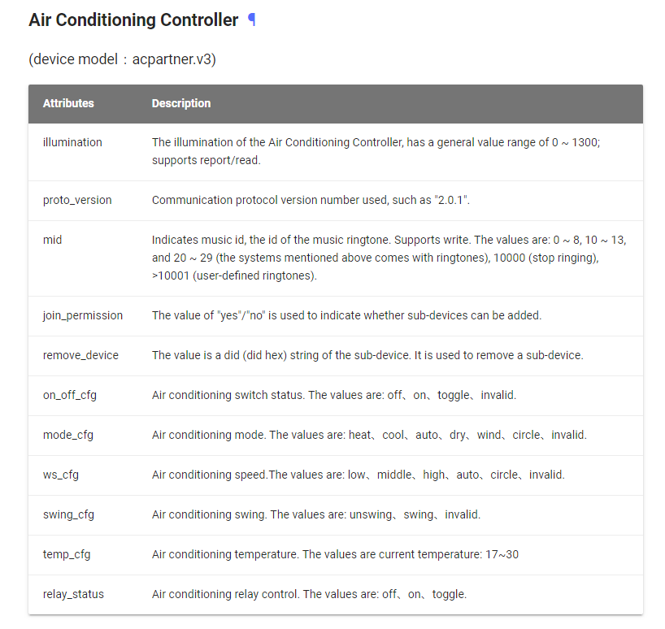
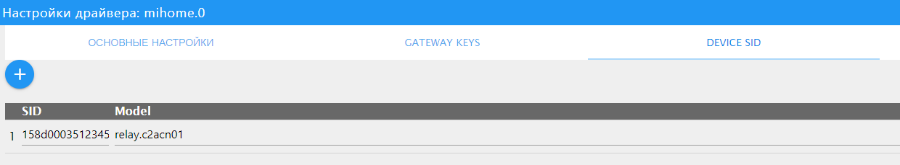

# miHome Gateway

**Dieser Adapter nutzt die Sentry-Bibliotheken, um Ausnahmen und Codefehler automatisch an die Entwickler zu melden.** Weitere Details und Informationen zum Deaktivieren der Fehlerberichterstattung finden Sie in [der Sentry-Plugin-Dokumentation](https://github.com/ioBroker/plugin-sentry#plugin-sentry) . Die Sentry-Berichterstattung wird ab js-controller 3.0 verwendet.

Mit dem Mi Home Adapter wird ein Mi Control Hub (Gateway) in ein ioBroker-System integriert und ermöglicht die Kommunikation verschiedener Xiaomi-Sensoren, -Schalter usw. mit ioBroker. So lassen sich beispielsweise die Beleuchtung und der Lautsprecher des Gateways über ioBroker steuern.

## Anforderungen

- Mi Home App auf einem Android- oder iOS-Gerät mit aktivierter lokaler Netzwerkfunktion
- Verbundenes Mi Home Gateway
- Sofort einsatzbereites ioBroker-System

### Installation der Mi Home App und Aktivierung der lokalen Netzwerkfunktion

Zuerst muss die lokale Netzwerkfunktion aktiviert werden, da der Adapter nur über das lokale Netzwerk mit dem Gateway kommuniziert.

#### Android

- Laden Sie die [Android-App](https://play.google.com/store/apps/details?id=com.xiaomi.smarthome) auf ein Android-Gerät herunter, installieren Sie sie, öffnen Sie sie und stimmen Sie den Nutzungsbedingungen zu.
- Wählen`Mainland China` als Land (unter`settings -> Locale` Zum jetzigen Zeitpunkt scheint dies erforderlich zu sein. Die Sprache kann weiterhin auf Englisch eingestellt werden.
- Erstellen Sie ein Konto über _Login_
- Nach erfolgreicher Registrierung können Sie ein Gerät hinzufügen über`+`
- Wählen Sie unter _„Haushaltssicherheit“_ die Option „Haushaltssicherheit“ aus.`MI Control Hub` und befolgen Sie die Anweisungen
- Nachdem das Gateway erfolgreich integriert wurde, tippen Sie auf die drei Punkte oben rechts auf dem Bildschirm und anschließend _auf „Über“._
- Tippen Sie unten auf dem Bildschirm 10 Mal auf den Text _„Plug-in-Version“_ (bei älteren App-Versionen: die Versionsnummer). Dadurch wird der Entwicklermodus aktiviert und nach kurzer Zeit erscheinen zwei zusätzliche Menüeinträge. \[Falls nicht, wiederholen Sie alle Schritte!]
- Wählen Sie den Menüeintrag aus.`Wireless communication protocol` (der erste neue Eintrag in älteren App-Versionen)
- Schalten Sie den Schiebeschalter oben ein, notieren Sie sich das Passwort (`29p9i40jeypwck38` (im Screenshot) und bestätigen Sie mit`OK` (rechts neben der Schaltfläche „Abbrechen“), um Ihre Änderungen zu speichern

> Das Passwort wird später bei der Konfiguration des ioBroker-Adapters benötigt. Wenn Sie hier etwas ändern, wird ein neues Passwort generiert und das alte geht verloren!

Nun können mithilfe der Technologie weitere Geräte angeleitet werden.`+` Symbol.

#### iOS

- Laden Sie die [iOS-App](https://itunes.apple.com/de/app/mi-home-xiaomi-smarthome/id957323480?mt=8) auf ein iOS-Gerät herunter, installieren Sie sie, öffnen Sie sie und stimmen Sie der Datenschutzrichtlinie zu.
- Wählen Sie unter Profil/Einstellungen/Ländereinstellungen das Land _Festlandchina_ aus – dies ist derzeit erforderlich. Die Sprache kann weiterhin auf Englisch eingestellt werden.
- Erstellen Sie ein Konto über _Login_
- Nach erfolgreicher Registrierung können Sie ein Gerät hinzufügen über`+`
- Wählen Sie unter _„Haushaltssicherheit“_ die Option „Haushaltssicherheit“ aus.`MI Control Hub` und befolgen Sie die Anweisungen
- Nachdem das Gateway erfolgreich integriert wurde, tippen Sie auf die drei Punkte oben rechts auf dem Bildschirm und anschließend _auf „Über“._
- Tippe wiederholt auf den leeren Bereich unterhalb des _Tutorial_ -Menüs. Dadurch wird der Entwicklermodus aktiviert und nach einer gewissen Zeit erscheinen zusätzliche Menüeinträge (in älteren App-Versionen auf Chinesisch). \[Falls es nicht sofort funktioniert, wiederhole die Schritte!]
- Wählen Sie den vierten Menüpunkt (in älteren App-Versionen den zweiten neuen Eintrag).
- Schalten Sie den Schiebeschalter oben ein, notieren Sie sich das Passwort und bestätigen Sie es mit`OK` (rechts neben der Schaltfläche „Abbrechen“), um Ihre Änderungen zu speichern

> Das Passwort wird später bei der Konfiguration des ioBroker-Adapters benötigt. Wenn Sie hier etwas ändern, wird ein neues Passwort generiert und das alte geht verloren!

Nun können mithilfe der Technologie weitere Geräte angeleitet werden.`+` Symbol.

### Einstellungen am Router

Unter „Über/Hub-Info“ finden Sie die IP-Adresse des Gateways im Text nach _„localip“_ . Diese IP-Adresse sollte dem Gateway im verwendeten Router dauerhaft zugewiesen werden. Wenn Sie die eingebundenen Geräte nicht mehr über die App steuern möchten, können Sie den Internetzugang des Gateways im Router deaktivieren, nachdem alle Geräte eingebunden wurden.

### Nutzung von acpartner

Mit einem Adapter der Version 1.3.xx oder höher können Sie die mit ioBroker verbundene Klimaanlage über acpartner.v3 (KTBL11LM) steuern (es funktioniert wahrscheinlich auch mit Version v2, aber der Entwickler hatte keine Hardware zum Testen; falls es jemand ausprobiert, geben Sie uns bitte Bescheid).

Folgende Zustände wurden hinzugefügt, um die Klimaanlage zu steuern:

Der Vorgang der Aktivierung des LAN-Zugangs und des Empfangs des GATEWAY-SCHLÜSSELS kann mitunter schwierig sein; der Vorgang wird im Folgenden beschrieben.

So starten Sie die Nutzung:

- Installieren Sie die Aqara Home-App auf Ihrem Smartphone ( <https://play.google.com/store/apps/details?id=com.lumiunited.aqarahome> ),
- Registrieren Sie sich in der Aqara Home-Anwendung,
- Wählen Sie in den Einstellungen die Region „Festlandchina“ aus.
- Füge acpartner zur Aqara Home App hinzu,
- Aktualisieren Sie die acpartner-Firmware (klicken Sie auf das Klimaanlagensymbol, dann auf die drei Punkte in der oberen rechten Ecke und anschließend auf den untersten Punkt „Softwareversion“). Dadurch wird die Aqara-Firmware auf acpartner installiert (bei Verwendung der MiHome-Anwendung stammte sie von Xiaomi).
- Registrieren Sie sich auf der Website <https://opencloud.aqara.cn/> mit demselben Passwort und Login wie in der Aqara Home-Anwendung (die Registrierungsbestätigung kann einige Zeit in Anspruch nehmen, bei mir dauerte es etwa 6 Stunden).
- Melden Sie sich in der Konsole an [: https://opencloud.aqara.cn/console/](https://opencloud.aqara.cn/console/)
- Erstellen Sie eine Anwendung auf der Registerkarte <https://opencloud.aqara.cn/console/app-management> vom Typ "Gerätezugriff" (Ich bin mir nicht sicher, ob dieser Schritt notwendig ist (da ich ihn noch nicht durchgeführt habe), daher können Sie ihn überspringen).
- Gehen Sie dann zur Konsole <https://opencloud.aqara.cn/console> und wählen Sie links Gateway LAN aus. Geben Sie die Felder „Aqara-Konto“ und „Passwort“ ein und klicken Sie auf die Schaltfläche „Absenden“. Anschließend sehen Sie Ihren Klimaanlagen-Controller und die Schaltfläche zum Aktivieren des Netzwerkprotokolls. Durch Klicken auf diese Schaltfläche erlauben Sie den LAN-Zugriff. Außerdem wird Ihnen der Netzwerkschlüssel angezeigt, der zur Konfiguration des Adapters in ioBroker erforderlich ist.
- Geben Sie in den Adaptereinstellungen den oben erhaltenen Schlüssel ein.

## Installation des ioBroker Mi Home-Adapters

Weitere Einstellungen erfolgen ausschließlich über die ioBroker-Administrationsoberfläche. Suchen Sie den Adapter im Bereich _„Adapter“_ und installieren Sie ihn mithilfe des entsprechenden Befehls.`+` Symbol.

Anschließend öffnet sich folgendes Konfigurationsfenster:

Geben Sie das oben ermittelte Passwort ein unter`Default Gateway Key` Schließen Sie das Fenster mit _„Speichern und schließen“_ . Der laufende Adapter sollte dann unter _„Instanzen“_ grün angezeigt werden.

Das Gateway und seine einprogrammierten Geräte werden nun unter _Objekte_ angezeigt:

Dieses Handbuch wurde nach bestem Wissen und Gewissen erstellt.

## Verwendung

Sie können den kleinen Knopf am Temperatursensor verwenden, um ihn auszulösen.`double Press` Drücken Sie einfach innerhalb von 5 Sekunden zweimal. Sie können dieses Intervall in den Einstellungen festlegen, es sollte jedoch nicht über 10 Sekunden liegen.

### Gerät anhand der SID hinzufügen

Falls ein Gerät anhand seines Modellnamens nicht erkannt wird, kann versucht werden, es mithilfe der SID hinzuzufügen. Dies ist derzeit für **das Aqara-2-Kanal-Relaissteuermodul** anwendbar, dessen Modellname aufgrund von Problemen in der Gateway-Firmware leer ist.

Um ein Gerät anhand der SID hinzuzufügen, öffnen Sie`DEVICE SID` Klicken Sie auf die Registerkarte „Adaptereinstellungen“ und geben Sie die SID und den Gerätenamen aus der unten stehenden Liste der unterstützten Geräte an.

Für das Aqara-Relaismodul sollte es wie folgt angegeben werden:

### Unterstützte Geräte

Die folgende Liste erhebt keinen Anspruch auf Vollständigkeit:

- `gateway` - Xiaomi RGB-Gateway
- `acpartner.v3` - Aqara AC Partner (KTBL11LM)
- `sensor_ht` - Xiaomi Temperatur/Luftfeuchtigkeit
- `weather.v1` - Xiaomi Temperatur/Luftfeuchtigkeit/Druck
- `switch` - Xiaomi Wireless Switch
- `sensor_switch.aq2` - Xiaomi Aqara Funkschaltersensor
- `sensor_switch.aq3` - Xiaomi Aqara Funkschaltersensor
- `plug` - Xiaomi Smart Plug
- `86plug` - Xiaomi Smart-Wandsteckdose
- `86sw2` - Xiaomi Drahtloser Doppelwandschalter
- `86sw1` - Xiaomi Drahtloser Einzelwandschalter
- `natgas` Xiaomi Mijia Honeywell Gasalarmgerät
- `smoke` - Xiaomi Mijia Honeywell Feuermelder
- `ctrl_ln1` - Xiaomi Aqara 86 Firewall-Wandschalter mit einem Knopf
- `ctrl_ln1.aq1` - Xiaomi Aqara Wandschalter LN
- `ctrl_ln2` - Xiaomi 86-Zero-Fire Wandschalter Doppeltaste
- `ctrl_ln2.aq1` - Xiaomi Aqara Wandschalter LN Doppeltaste
- `ctrl_neutral2` - Xiaomi Kabelgebundener Doppelwandschalter
- `ctrl_neutral1` - Xiaomi Kabelgebundener Einzelwandschalter
- `cube` - Xiaomi Cube
- `sensor_cube.aqgl01` - Xiaomi Cube
- `magnet` - Xiaomi Türsensor
- `sensor_magnet.aq2` - Xiaomi Aqara Türsensor
- `curtain` - Xiaomi Aqara Smart Curtain
- `motion` - Xiaomi Bewegungssensor
- `sensor_motion.aq2` - Xiaomi Aqara Bewegungssensor
- `sensor_wleak.aq1` - Xiaomi Aqara Wassersensor
- `ctrl_ln2.aq1` - Xiaomi Aqara Wandschalter LN (Doppelt)
- `remote.b186acn01` - Xiaomi Aqara Drahtloser Fernbedienungsschalter
- `remote.b186acn02` - Xiaomi Aqara Drahtloser Fernbedienungsschalter
- `remote.b286acn01` - Xiaomi Aqara Drahtloser Fernbedienungsschalter (Doppelwippe)
- `remote.b286acn02` - Xiaomi Aqara Drahtloser Fernbedienungsschalter (Doppelwippe)
- `remote.b1acn01` - Xiaomi Aqara Drahtloser Fernbedienungsschalter
- `vibration` - Xiaomi Vibrationssensor
- `wleak1` - Xiaomi Aqara Wassersensor
- `lock_aq1` - Xiaomi-Schloss
- `relay.c2acn01` - Aqara 2-Kanal-Relaissteuermodul ( **unter Verwendung der SID-Nummer** )

<!--
	Placeholder for the next version (at the beginning of the line):
	### __WORK IN PROGRESS__
-->

## Changelog
### 2.0.0 (2026-09-10)
* (bluefox) The adapter was refactored to TypeScript and the configuration was migrated to JsonConfig
* (bluefox) __Breaking:__ Node.js >= 22, js-controller >= 6.0.11 and admin >= 7 are required now
* (bluefox) The reports of the curtain are no longer written into a `state` object that does not exist
* (bluefox) Fixed the `open`, `close` and `stop` states of the curtain: the reported status was never evaluated

### 1.4.0 (2022-03-10)
* (drtsb) Added two new aqara devices and some missing icons
* (VLGorskij) fixed the error messages for some states
* (Apollon77) Catch some errors reported by Sentry and users

### 1.3.7 (2021-01-22)
* (Apollon77) Prevent a crash case (Sentry IOBROKER-MIHOME-A)

### 1.3.6 (2020-09-25)
* (VLGorskij) Added new device QBKG24LM

### 1.3.5 (2020-09-17)
* (Apollon77) Fix crash cases (Sentry IOBROKER-MIHOME-1..4)

[Older changelogs can be found there](https://github.com/ioBroker/ioBroker.mihome/blob/master/CHANGELOG_OLD.md)

## License
The MIT License (MIT)

Copyright (c) 2017-2026 bluefox <dogafox@gmail.com>

Permission is hereby granted, free of charge, to any person obtaining a copy of this software and associated documentation files (the "Software"), to deal in the Software without restriction, including without limitation the rights to use, copy, modify, merge, publish, distribute, sublicense, and/or sell copies of the Software, and to permit persons to whom the Software is furnished to do so, subject to the following conditions:

The above copyright notice and this permission notice shall be included in all copies or substantial portions of the Software.

THE SOFTWARE IS PROVIDED "AS IS", WITHOUT WARRANTY OF ANY KIND, EXPRESS OR IMPLIED, INCLUDING BUT NOT LIMITED TO THE WARRANTIES OF MERCHANTABILITY, FITNESS FOR A PARTICULAR PURPOSE AND NONINFRINGEMENT. IN NO EVENT SHALL THE AUTHORS OR COPYRIGHT HOLDERS BE LIABLE FOR ANY CLAIM, DAMAGES OR OTHER LIABILITY, WHETHER IN AN ACTION OF CONTRACT, TORT OR OTHERWISE, ARISING FROM, OUT OF OR IN CONNECTION WITH THE SOFTWARE OR THE USE OR OTHER DEALINGS IN THE SOFTWARE.